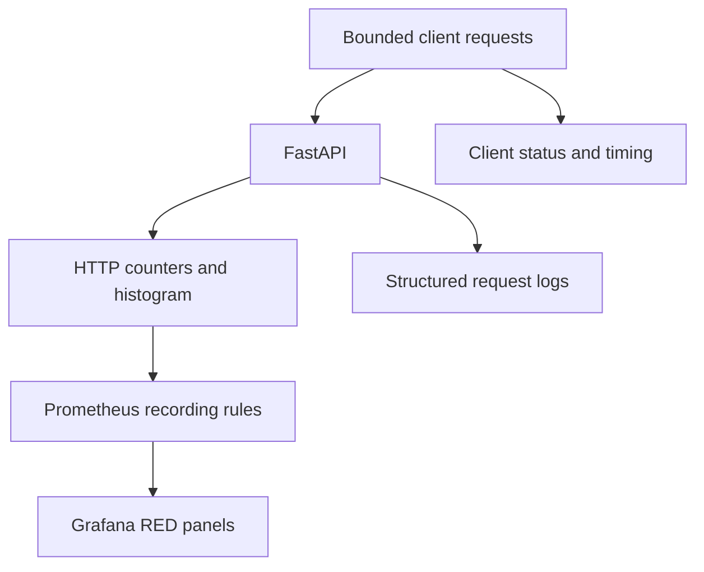

# Lab 20: Build a RED Application Dashboard

## Purpose and Scope

> **Primary Objective:** Build and validate request-rate, error-rate and latency panels from operational questions and explicit request populations.

A panel can look correct while using the wrong denominator, unit or route scope. This lab builds a complete RED dashboard from the verified recording rules, then validates it against bounded normal, slow and failed requests.

You will first create a panel manually and then import a reproducible twelve-panel dashboard. This is operational visualization, not an SLO declaration. Provisioning arrives in Lab 22; the later telemetry backends remain stopped.

## 1. Inherited State and Starting Checks

```bash
source lab-notes/session.sh
source lab-notes/evidence.sh
source lab-notes/raw-metrics.sh
source lab-notes/metrics-session.sh
metrics_check
start_lab 20
```

Complete [Lab 19](Lab-19.md) first. Run commands from the repository root in the same Bash session. Keep the existing credentials, named volumes and checkpoint item. Expect eight services and five scrape jobs. The demo endpoint must be enabled only for this local learning environment. Stop other load generators.

## 2. Learning Objectives and Evidence Paths

You will define panel populations, use recorded rates directly, merge histogram buckets before quantiles, distinguish rates from fractions and correlate chart changes with client timing and request logs.



The relevant events are completed requests, delayed demo responses, database failures, dependency recovery and dashboard creation. Aggregated metrics do not replace the client/event ledger.

## 3. Write the Dashboard Contract

| Operational question | Measurement | Caveat |
|---|---|---|
| Are metrics being collected? | Application target `up` | Scrape health is not readiness |
| How much traffic completes? | Requests/second by route | Includes enabled `/api/v1/` demo route |
| How many responses fail? | 5xx rate and fraction | 4xx remain visible separately |
| How slow are completed requests? | Mean and p50/p95/p99 | Histogram includes all statuses |
| How much evidence supports a quantile? | Estimated observation count | Extrapolated, not an exact event count |
| Is work executing now? | In-progress gauge | Short work may occur between scrapes |

The scope is normalized `/api/v1/` routes. Middleware already excludes health and metrics endpoints; documentation and unmatched paths are not selected here. The stricter Items SLO population in Lab 25 will be different.

## 4. Build One Panel Manually

Open **Dashboards → New → New dashboard → Add visualization**, select Prometheus and Code mode, and enter:

```promql
sum by (route) (service_route:application_http_requests:rate2m{route=~"/api/v1/.*"})
```

Choose Time series, requests/second units and `{{route}}` as the legend. Save as **Lab 20 — Manual panel**. Inspect the actual query in Query Inspector.

This panel selects the only current service. The complete generator below adds your configured environment/service selectors. Never apply `rate()` to the already recorded `rate2m` value.

## 5. Install a Reusable Panel Factory

```bash
cat > lab-notes/dashboard_factory.py <<'PYTHON'
"""Generate ordinary dashboard JSON using only the Python standard library."""

import json
from pathlib import Path

DS = {"type": "prometheus", "uid": "prometheus"}


def scope(environment, service):
    return "environment=" + json.dumps(environment) + ",service=" + json.dumps(service)


def panel(number, title, queries, unit, description, kind="timeseries"):
    defaults = {
        "unit": unit,
        "noValue": "No data",
        "mappings": [],
        "color": {"mode": "palette-classic"},
    }
    if unit == "percentunit":
        defaults.update(min=0, max=1)
    if kind == "timeseries":
        defaults["custom"] = {
            "drawStyle": "line",
            "lineWidth": 2,
            "fillOpacity": 10,
            "spanNulls": False,
        }
    options = (
        {
            "legend": {"displayMode": "table", "placement": "bottom"},
            "tooltip": {"mode": "multi", "sort": "desc"},
        }
        if kind == "timeseries"
        else {
            "reduceOptions": {"calcs": ["lastNotNull"], "fields": "", "values": False},
            "colorMode": "none",
            "graphMode": "none",
            "textMode": "auto",
        }
    )
    return {
        "id": number,
        "title": title,
        "description": description,
        "type": kind,
        "datasource": DS,
        "gridPos": {
            "x": ((number - 1) % 2) * 12,
            "y": ((number - 1) // 2) * 8,
            "w": 12,
            "h": 8,
        },
        "fieldConfig": {"defaults": defaults, "overrides": []},
        "options": options,
        "targets": [
            {
                "refId": chr(65 + i),
                "datasource": DS,
                "editorMode": "code",
                "expr": expr,
                "legendFormat": legend,
                "range": kind != "stat",
                "instant": kind == "stat",
                "format": "time_series",
            }
            for i, (expr, legend) in enumerate(queries)
        ],
    }


def save(path, uid, title, panels):
    result = {
        "id": None,
        "uid": uid,
        "title": title,
        "schemaVersion": 39,
        "version": 1,
        "editable": True,
        "timezone": "utc",
        "refresh": "15s",
        "time": {"from": "now-15m", "to": "now"},
        "tags": ["learning", "fastapi"],
        "links": [],
        "templating": {"list": []},
        "annotations": {"list": []},
        "panels": panels,
    }
    p = Path(path)
    p.parent.mkdir(parents=True, exist_ok=True)
    p.write_text(json.dumps(result, indent=2) + "\n")
    print(f"Wrote {p}: {len(panels)} panels; UID {uid}")
PYTHON
```

This module generates ordinary dashboard JSON without a plugin. Time-series panels use range queries; current-state stat panels use instant queries so a historical “last non-null” value cannot disguise missing current data. No-data remains visible.

The classic JSON representation is documented in the [Grafana dashboard model reference](https://grafana.com/docs/grafana/latest/visualizations/dashboards/build-dashboards/view-dashboard-json-model/).

## 6. Generate and Import the Complete Dashboard

```bash
cat > lab-notes/build_red_dashboard.py <<'PYTHON'
"""Usage: build_red_dashboard.py ENVIRONMENT SERVICE OUTPUT_JSON"""

import sys
from dashboard_factory import panel, save, scope

if len(sys.argv) != 4:
    raise SystemExit(__doc__)
environment, service, output = sys.argv[1:]
base = scope(environment, service)
selected = base + ',route=~"/api/v1/.*"'


def recorded(name):
    return "service_route:" + name + ":rate2m{" + selected + "}"


requests = recorded("application_http_requests")
errors = recorded("application_http_server_errors")
buckets = recorded("application_http_request_duration_seconds_bucket")
count = recorded("application_http_request_duration_seconds_count")
duration = recorded("application_http_request_duration_seconds_sum")
r = "sum by (route) (" + requests + ")"
e = "sum by (route) (" + errors + ")"
c = "sum by (route) (" + count + ")"
p = []


def add(title, queries, unit, description, kind="timeseries"):
    p.append(panel(len(p) + 1, title, queries, unit, description, kind))


add(
    "FastAPI scrape health",
    [('up{job="fastapi",' + base + "}", "{{instance}}")],
    "short",
    "Scrape success is not business readiness.",
    "stat",
)
add(
    "Recording output age",
    [("time() - max(timestamp(" + requests + "))", "age")],
    "s",
    "Age of the newest selected rule output; absent stays absent.",
    "stat",
)
add(
    "Request rate by route",
    [(r, "{{route}}")],
    "reqps",
    "Completed API requests per second, including the enabled demo; 2-minute window.",
)
add(
    "5xx rate by route",
    [(e, "{{route}}")],
    "reqps",
    "Server-error responses per second.",
)
add(
    "5xx fraction by route",
    [(f"({e} / {r}) and on (route) ({r} > 0)", "{{route}}")],
    "percentunit",
    "0.05 means 5%; no positive traffic denominator means no ratio.",
)
add(
    "Global latency quantiles",
    [
        (f"histogram_quantile({q}, sum by (le) ({buckets}))", legend)
        for q, legend in [(0.5, "p50"), (0.95, "p95"), (0.99, "p99")]
    ],
    "s",
    "Approximate quantiles from merged buckets, not averages of route quantiles.",
)
add(
    "p95 latency by route",
    [(f"histogram_quantile(0.95, sum by (le,route) ({buckets}))", "{{route}}")],
    "s",
    "Sparse observations and bucket width limit precision.",
)
add(
    "Mean latency by route",
    [(f"(sum by (route) ({duration}) / {c}) and on (route) ({c} > 0)", "{{route}}")],
    "s",
    "Duration sum rate divided by observation count rate.",
)
add(
    "Status code rates",
    [
        (
            "sum by (status_code) (service_route_status:application_http_requests:rate2m{"
            + selected
            + "})",
            "{{status_code}}",
        )
    ],
    "reqps",
    "Separate 4xx and 5xx outcomes within the same API scope.",
)
add(
    "Requests currently executing",
    [
        (
            'sum(application_http_requests_in_progress{job="fastapi",' + base + "})",
            "in progress",
        )
    ],
    "short",
    "Short requests can complete between 15-second scrapes.",
)
add(
    "Estimated observations in 2m",
    [("sum(" + count + ") * 120", "observations")],
    "short",
    "Extrapolated rate times 120 seconds, not an exact event ledger.",
    "stat",
)
add(
    "Recorded throughput",
    [("sum(" + requests + ")", "requests/s")],
    "reqps",
    "Current service rate over two minutes.",
    "stat",
)
save(output, "lab20-red", "Lab 20 — FastAPI RED", p)
PYTHON
```

```bash
python3 lab-notes/build_red_dashboard.py "$LAB_ENVIRONMENT" "$LAB_SERVICE" lab-notes/grafana/lab20-red.json
python3 -m json.tool lab-notes/grafana/lab20-red.json >/dev/null
cp lab-notes/grafana/lab20-red.json "$LAB_DIR/red-dashboard-generated.json"
```

Import this file through **Dashboards → New → Import → Upload dashboard JSON file**. If the browser is on your workstation, transfer the JSON from the VM first. Open **Lab 20 — FastAPI RED**, UID `lab20-red`.

On a rerun, export any UI edits you need before replacing this learning UID. The separate manual scratch dashboard is unaffected. Every expression uses an existing raw metric or one of Lab 16's six recording names.

## 7. Audit Units and Aggregation

A 5xx rate has units requests/second. A 5xx fraction is dimensionless: numeric `0.05` is 5% with Grafana `percentunit`. Do not multiply by 100 and then use a fraction unit again.

The ratio aggregates both operands to matching route labels. Idle routes have no positive denominator and are omitted rather than declared successful. Quantiles merge bucket rates while preserving `le`; they are not averages of route p95 values. The mean divides duration sum by observation count.

Tail estimates are approximate and sensitive to bucket width and sparse traffic. Use the observation-count panel and route breakdown when interpreting a global p95.

## 8. Predict and Run Normal and Waiting Traffic

```bash
api -fsS "$APP_URL/api/v1/demo/work?iterations=1000&delay_ms=0" >/dev/null
record_change "red_normal_60_requests" planned
for index in $(seq 1 60); do
  api -fsS -o /dev/null -w '%{http_code} %{time_total}\n' \
    "$APP_URL/api/v1/items?limit=1" >> "$LAB_DIR/normal-client.txt"
  sleep 1
done
record_change "red_normal_60_requests" completed
record_change "red_waiting_demo_40_requests" planned
for index in $(seq 1 40); do
  api -fsS -o /dev/null -w '%{http_code} %{time_total}\n' \
    "$APP_URL/api/v1/demo/work?iterations=1000&delay_ms=400" >> "$LAB_DIR/slow-client.txt"
  sleep 1
done
record_change "red_waiting_demo_40_requests" completed
```

Predict which panels should change before running the loops. The 400 ms wait raises request duration but does not demonstrate CPU saturation. Sequential requests sleep after completion, so the slow phase runs at less than one request/second.

The two-minute window and 15-second rule cadence smooth transitions. A request may start and finish between scrapes, leaving no visible in-progress gauge sample. Client timing also includes transport overhead beyond the application middleware interval.

## 9. Inject a Short Failure and Guarantee Recovery

```bash
(
  set -euo pipefail
  trap 'dm start postgres >/dev/null' EXIT
  trap 'exit 130' INT
  trap 'exit 143' TERM
  record_change "red_postgres_stop" planned
  dm stop postgres
  api -fsS "$APP_URL/health/live" > "$LAB_DIR/live-during-db-stop.json"
  for index in $(seq 1 12); do
    status=$(api -sS -o "$LAB_DIR/db-error-$index.json" -w '%{http_code}' "$APP_URL/api/v1/items?limit=1")
    printf '%s %s\n' "$(date -u +%FT%TZ)" "$status" >> "$LAB_DIR/error-client.txt"
    test "$status" = 503
    sleep 1
  done
)
wait_ready
wait_metric 'pg_up{job="postgres"}' 1
record_change "red_postgres_restored" completed
for index in $(seq 1 30); do api -fsS "$APP_URL/api/v1/items?limit=1" >/dev/null; sleep 1; done
metrics_check
capture_app_logs
```

List reads are uncached, so the database failure should produce 503 while liveness remains healthy. This depends on the database exception handling completed in Lab 2. If the code differs, recover first and inspect that implementation rather than weakening the assertion.

The trap starts PostgreSQL on exit even if an assertion fails. No data, migrations or volumes are removed. A cached single-item endpoint would be a poor choice for reliably demonstrating this database failure.

## 10. Correlate the Dashboard With Source Evidence

```bash
pq 'sum by (route,status_code) (service_route_status:application_http_requests:rate2m{route=~"/api/v1/.*"})' \
  > "$LAB_DIR/status-rates.json"
jq -c 'select(."http.status_code"==503) | {timestamp,event_id,request_id,route:."http.route",status:."http.status_code"}' \
  "$LAB_DIR/app.jsonl" > "$LAB_DIR/error-events.jsonl"
```

Save a screenshot or panel export with an absolute UTC range covering all phases. Inspect one error and one latency panel's request parameters. Compare with client timestamps and the structured error records.

The client ledger proves the exact attempted failures. The rate graph shows the aggregate trend and its duration; extrapolation/smoothing means it is not an exact count. A global quantile depends on traffic mix, so inspect the slow demo route separately.

## 11. Recovery and Troubleshooting

Allow a full two-minute window of recovered traffic, then verify the 5xx rate returns toward zero, readiness succeeds and recording output stays fresh.

| Symptom | Inspect | Corrective action |
|---|---|---|
| Recorded panels empty | Rule health and output labels | Remove a nonexistent job/instance matcher |
| 500% when expecting 5% | Expression and unit | Use a fraction with `percentunit` |
| Global p95 barely changes | Route mix and sample volume | Inspect the slow route; do not average quantiles |
| 503 phase returns 200 | Endpoint/cache behavior | Use the uncached list route |
| Demo returns 404/429 | Enablement or concurrent demo | Restore the learning setting and stop overlapping traffic |
| Current health looks stale | Query type and fill transformations | Use instant stats and preserve missing-data state |

Keep the factory, generator and JSON for the next labs. Do not reset counters to clean up the chart; preserve the incident history.

## 12. Knowledge Check

1. Why not average route p95s?
2. Why can in-progress miss a request?
3. Why is an idle error fraction absent?

### Answer Guide

1. A combined quantile depends on the whole distribution.
2. The request can complete between scrape instants.
3. No positive request denominator exists.

## 13. Professional Scenario Exercise

A global mean looks healthy while a low-volume route is slow. Use route quantiles, volume and client timing to explain what the mean hides without adding request-ID labels.

## 14. Lab Notebook Template

Create a notebook in the evidence directory for this run:

```bash
test -e "$LAB_DIR/notebook.md" || printf '# Lab 20 Evidence\n' > "$LAB_DIR/notebook.md"
```

Use these headings and fill them with your predictions, commands, observed results and conclusions:

```markdown
# Lab 20 Evidence

## Starting state and operational question
## Prediction before the change
## Commands and timestamps
## Observed results and source evidence
## Unexpected findings and troubleshooting
## Recovery proof and remaining limitations
```

## 15. Observable Completion Criteria

- [ ] Twelve panels use real metrics with correct units and scope.
- [ ] Normal, waiting and failure phases have client/log evidence.
- [ ] Quantiles retain histogram boundaries and observation context.
- [ ] PostgreSQL and all eight services recover.

## 16. Production Implications

Review dashboards as operational code. Stable labels, explicit populations and honest empty states matter more than decorative thresholds. Local artificial delays do not define production SLOs.

## 17. End State and Transition

Keep eight services and both source files. [Lab 21](Lab-21.md) correlates RED symptoms with host and dependency observations.
