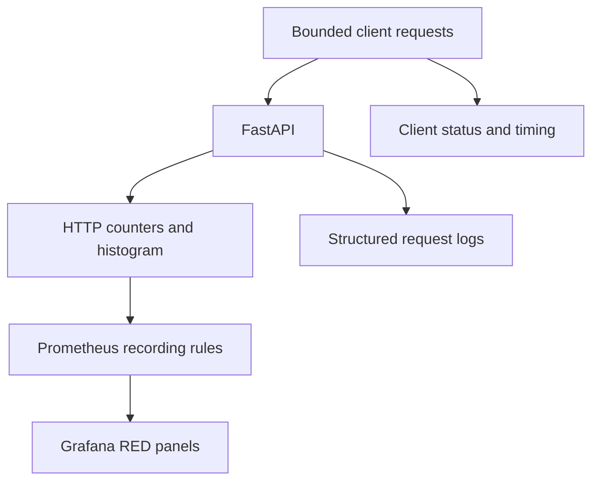

# Lab 20: Build a RED Application Dashboard

## 1. Purpose and Learning Outcomes

**In Plain Language:** You will build a RED dashboard from explicit operational questions. After creating one panel by hand, use a shared generator for consistent panels, then exercise normal traffic, waiting, and database failure. Validate what the panels show against known requests and source evidence rather than judging the dashboard by appearance alone.

> **Primary Objective:** Build and validate request-rate, error-rate and latency panels from operational questions and explicit request populations.

A panel can look correct while using the wrong denominator, unit or route scope. This lab builds a complete RED dashboard from the verified recording rules, then validates it against bounded normal, slow and failed requests.

You will first create a panel manually and then import a reproducible twelve-panel dashboard. This is operational visualization, not an SLO declaration. Provisioning arrives in Lab 22; the later telemetry backends remain stopped.

## 2. Starting Point and Lab Map

Use this guide inside the complete application repository. Run commands from the repository root in Bash unless a step says otherwise. Work through the starting checks in order; they load the helpers and state this lab needs.

Read the explanation before each step, run one complete code block at a time, and compare the actual result with the stated expectation. Save commands, observations, explanations, and unexpected results in your notebook.

### Key Terms

| **Term**              | **Plain-Language Meaning**                                                    |
| --------------------- | ----------------------------------------------------------------------------- |
| Panel contract        | The question, population, expression, units, and interpretation of one panel. |
| Error rate / fraction | Errors per second versus the share of completed requests that were errors.    |
| Instant query         | A query evaluated at one time, useful for a current-state display.            |

### Lab Map

The arrows show the flow or dependency being studied. Branches identify paths to compare; this is a conceptual map, not a captured runtime trace.


```mermaid
flowchart TD
    C["Bounded client requests"] --> A["FastAPI"]
    A --> M["HTTP counters and histogram"]
    M --> R["Prometheus recording rules"]
    R --> G["Grafana RED panels"]
    A --> L["Structured request logs"]
    C --> E["Client status and timing"]
```

## 3. Guided Walkthrough

### Step 01. Inherited State and Starting Checks

**What You Are Doing:** Verify the Grafana and metrics stage and keep the demo workload bounded. Existing rules supply the tested source expressions used by the dashboard.

**Practical Walkthrough:** Verify Grafana, current scrape jobs, and the recording rules the dashboard will query. Keep test traffic limited to the documented routes and sequence. A dashboard can only summarize available source evidence, so fix missing or unhealthy recordings before adjusting panel appearance.

Check the recording-rule outputs used by the dashboard before importing panels. A missing source cannot be repaired by units, colors, or legend changes. Preserve the known stage and workload boundaries so later graph changes can be attributed to the controlled normal, waiting, and failure phases.

```bash
source lab-notes/session.sh
source lab-notes/evidence.sh
source lab-notes/raw-metrics.sh
source lab-notes/metrics-session.sh
metrics_check
start_lab 20
```

Complete [Lab 19](Lab-19.md) first. Run commands from the repository root in the same Bash session. Keep the existing credentials, named volumes and checkpoint item. Expect eight services and five scrape jobs. The demo endpoint must be enabled only for this local learning environment. Stop other load generators.

**Understanding the Result:** The dashboard builds on tested queries. Its visual completeness is not a substitute for healthy data inputs.

### Step 02. Learning Objectives and Evidence Paths

**What You Are Doing:** Trace each panel back through recording rules to request observations. The client ledger and logs provide independent detail for checking changes in the graphs.

**Practical Walkthrough:** Trace each planned panel back from its query to recording rules and original request instruments. Keep the client ledger and completion records available as independent evidence for the controlled workload. This lets you explain graph changes using known actions rather than inferring actions solely from the graph.

For every planned panel, identify the original instrument and any intermediate recording rule. Keep client and completion evidence outside the dashboard as well. This gives you an independent explanation for a graph change instead of using the same visualization as both observation and proof of its cause.

You will define panel populations, use recorded rates directly, merge histogram buckets before quantiles, distinguish rates from fractions and correlate chart changes with client timing and request logs.

The lab map in Section 2 shows this relationship.

The relevant events are completed requests, delayed demo responses, database failures, dependency recovery and dashboard creation. Aggregated metrics do not replace the client/event ledger.

**Understanding the Result:** Every panel needs a stated observation boundary. Individual logs and aggregate metrics complement each other without being identical.

### Step 03. Write the Dashboard Contract

**What You Are Doing:** Write the question and measurement for every panel before creating it. This keeps scope, units, and known limitations visible while choosing the visualization.

**Practical Walkthrough:** For each panel, write the operational question, selected population, units, and handling of missing data. Choose the visualization only after those decisions. A percent unit or attractive legend cannot fix a denominator that includes the wrong requests or a duration displayed at the wrong scale.

Define the numerator, denominator, retained labels, and unit before selecting a panel type. Decide how idle or missing data should appear. These are interpretation choices, so review them as carefully as layout; an attractive percentage panel can still describe the wrong request population.

| **Operational Question**               | **Measurement**             | **Caveat**                             |
| -------------------------------------- | --------------------------- | -------------------------------------- |
| Are metrics being collected?           | Application target `up`     | Scrape health is not readiness         |
| How much traffic completes?            | Requests/second by route    | Includes enabled `/api/v1/` demo route |
| How many responses fail?               | 5xx rate and fraction       | 4xx remain visible separately          |
| How slow are completed requests?       | Mean and p50/p95/p99        | Histogram includes all statuses        |
| How much evidence supports a quantile? | Estimated observation count | Extrapolated, not an exact event count |
| Is work executing now?                 | In-progress gauge           | Short work may occur between scrapes   |

The scope is normalized `/api/v1/` routes. Middleware already excludes health and metrics endpoints; documentation and unmatched paths are not selected here. The stricter Items SLO population in Lab 25 will be different.

**Understanding the Result:** The panel contract describes what a viewer may conclude. Keep its limitations visible in the supplied description fields.

### Step 04. Build One Panel Manually

**What You Are Doing:** Build one panel manually to understand its query, legend, and units. Inspect its request so the later generated panels are recognizable rather than opaque JSON.

**Practical Walkthrough:** Build the first panel manually and inspect how expression, legend, range settings, and units affect the result. Use Query Inspector to connect the visible panel with the actual request. This provides a concrete reference for understanding the generated JSON in later steps.

Build the first throughput panel and inspect its expanded expression and returned labels. Verify requests-per-second units and the route legend. Use this manually understood panel as a reference when reviewing generated JSON, so automation does not conceal settings that change the query's meaning.

Open **Dashboards → New → New dashboard → Add visualization**, select Prometheus and Code mode, and enter:

```promql
sum by (route) (service_route:application_http_requests:rate2m{route=~"/api/v1/.*"})
```

Choose Time series, requests/second units and `{{route}}` as the legend. Save as **Lab 20 — Manual panel**. Inspect the actual query in Query Inspector.

This panel selects the only current service. The complete generator below adds your configured environment/service selectors. Never apply `rate()` to the already recorded `rate2m` value.

**Understanding the Result:** Manual construction teaches the mapping between configuration and display. Keep the tested query unchanged while inspecting presentation settings.

### Step 05. Install a Reusable Panel Factory

**What You Are Doing:** Create reusable panel-building functions for consistent settings. The factory centralizes choices such as range versus instant queries and how missing data remains visible.

**Practical Walkthrough:** Create the provided panel helper functions and read their shared defaults. They centralize repeated choices so all generated panels use consistent behavior. Pay attention to instant versus range queries and missing-data treatment because those settings change interpretation, not just appearance.

Read the factory defaults for data-source references, instant/range behavior, units, and missing values. These defaults affect every generated panel. A shared helper improves consistency only when its interpretation is correct, so understand those settings before using the factory across the complete dashboard.

```bash
cat > lab-notes/dashboard_factory.py <<'PYTHON'
"""Generate ordinary dashboard JSON using only the Python standard library."""

import json
from pathlib import Path

DS = {"type": "prometheus", "uid": "prometheus"}


def scope(environment, service):
    return "environment=" + json.dumps(environment) + ",service=" + json.dumps(service)


def panel(number, title, queries, unit, description, kind="timeseries"):
    defaults = {
        "unit": unit,
        "noValue": "No data",
        "mappings": [],
        "color": {"mode": "palette-classic"},
    }
    if unit == "percentunit":
        defaults.update(min=0, max=1)
    if kind == "timeseries":
        defaults["custom"] = {
            "drawStyle": "line",
            "lineWidth": 2,
            "fillOpacity": 10,
            "spanNulls": False,
        }
    options = (
        {
            "legend": {"displayMode": "table", "placement": "bottom"},
            "tooltip": {"mode": "multi", "sort": "desc"},
        }
        if kind == "timeseries"
        else {
            "reduceOptions": {"calcs": ["lastNotNull"], "fields": "", "values": False},
            "colorMode": "none",
            "graphMode": "none",
            "textMode": "auto",
        }
    )
    return {
        "id": number,
        "title": title,
        "description": description,
        "type": kind,
        "datasource": DS,
        "gridPos": {
            "x": ((number - 1) % 2) * 12,
            "y": ((number - 1) // 2) * 8,
            "w": 12,
            "h": 8,
        },
        "fieldConfig": {"defaults": defaults, "overrides": []},
        "options": options,
        "targets": [
            {
                "refId": chr(65 + i),
                "datasource": DS,
                "editorMode": "code",
                "expr": expr,
                "legendFormat": legend,
                "range": kind != "stat",
                "instant": kind == "stat",
                "format": "time_series",
            }
            for i, (expr, legend) in enumerate(queries)
        ],
    }


def save(path, uid, title, panels):
    result = {
        "id": None,
        "uid": uid,
        "title": title,
        "schemaVersion": 39,
        "version": 1,
        "editable": True,
        "timezone": "utc",
        "refresh": "15s",
        "time": {"from": "now-15m", "to": "now"},
        "tags": ["learning", "fastapi"],
        "links": [],
        "templating": {"list": []},
        "annotations": {"list": []},
        "panels": panels,
    }
    p = Path(path)
    p.parent.mkdir(parents=True, exist_ok=True)
    p.write_text(json.dumps(result, indent=2) + "\n")
    print(f"Wrote {p}: {len(panels)} panels; UID {uid}")
PYTHON
```

**Command Note:** `<<'PYTHON'` writes the following block literally until `PYTHON`. Quoting the delimiter prevents Bash from expanding `$variables` inside the generated file; creation and execution are separate steps.

This module generates ordinary dashboard JSON without a plugin. Time-series panels use range queries; current-state stat panels use instant queries so a historical “last non-null” value cannot disguise missing current data. No-data remains visible.

The classic JSON representation is documented in the [Grafana dashboard model reference](https://grafana.com/docs/grafana/latest/visualizations/dashboards/build-dashboards/view-dashboard-json-model/).

**Understanding the Result:** A factory reduces configuration drift. Its defaults still need to match each panel's measurement contract.

### Step 06. Generate and Import the Complete Dashboard

**What You Are Doing:** Generate and import the complete dashboard using stable identifiers. Preserve any local UI edits before a rerun replaces the imported definition.

**Practical Walkthrough:** Generate the dashboard and import it using the stable dashboard and data-source identifiers. Preserve any intentional UI edits before rerunning the generator, since the imported definition can replace them. Verify the resulting dashboard refers to the expected source and has all planned panels.

Validate the generated JSON before import, then check the dashboard UID, source UID, and panel inventory. Preserve intentional UI work before rerunning the generator. Stable identifiers make updates reproducible, but they also mean a new import can replace an existing definition rather than create an unrelated copy.

```bash
cat > lab-notes/build_red_dashboard.py <<'PYTHON'
"""Usage: build_red_dashboard.py ENVIRONMENT SERVICE OUTPUT_JSON"""

import sys
from dashboard_factory import panel, save, scope

if len(sys.argv) != 4:
    raise SystemExit(__doc__)
environment, service, output = sys.argv[1:]
base = scope(environment, service)
selected = base + ',route=~"/api/v1/.*"'


def recorded(name):
    return "service_route:" + name + ":rate2m{" + selected + "}"


requests = recorded("application_http_requests")
errors = recorded("application_http_server_errors")
buckets = recorded("application_http_request_duration_seconds_bucket")
count = recorded("application_http_request_duration_seconds_count")
duration = recorded("application_http_request_duration_seconds_sum")
r = "sum by (route) (" + requests + ")"
e = "sum by (route) (" + errors + ")"
c = "sum by (route) (" + count + ")"
p = []


def add(title, queries, unit, description, kind="timeseries"):
    p.append(panel(len(p) + 1, title, queries, unit, description, kind))


add(
    "FastAPI scrape health",
    [('up{job="fastapi",' + base + "}", "{{instance}}")],
    "short",
    "Scrape success is not business readiness.",
    "stat",
)
add(
    "Recording output age",
    [("time() - max(timestamp(" + requests + "))", "age")],
    "s",
    "Age of the newest selected rule output; absent stays absent.",
    "stat",
)
add(
    "Request rate by route",
    [(r, "{{route}}")],
    "reqps",
    "Completed API requests per second, including the enabled demo; 2-minute window.",
)
add(
    "5xx rate by route",
    [(e, "{{route}}")],
    "reqps",
    "Server-error responses per second.",
)
add(
    "5xx fraction by route",
    [(f"({e} / {r}) and on (route) ({r} > 0)", "{{route}}")],
    "percentunit",
    "0.05 means 5%; no positive traffic denominator means no ratio.",
)
add(
    "Global latency quantiles",
    [
        (f"histogram_quantile({q}, sum by (le) ({buckets}))", legend)
        for q, legend in [(0.5, "p50"), (0.95, "p95"), (0.99, "p99")]
    ],
    "s",
    "Approximate quantiles from merged buckets, not averages of route quantiles.",
)
add(
    "p95 latency by route",
    [(f"histogram_quantile(0.95, sum by (le,route) ({buckets}))", "{{route}}")],
    "s",
    "Sparse observations and bucket width limit precision.",
)
add(
    "Mean latency by route",
    [(f"(sum by (route) ({duration}) / {c}) and on (route) ({c} > 0)", "{{route}}")],
    "s",
    "Duration sum rate divided by observation count rate.",
)
add(
    "Status code rates",
    [
        (
            "sum by (status_code) (service_route_status:application_http_requests:rate2m{"
            + selected
            + "})",
            "{{status_code}}",
        )
    ],
    "reqps",
    "Separate 4xx and 5xx outcomes within the same API scope.",
)
add(
    "Requests currently executing",
    [
        (
            'sum(application_http_requests_in_progress{job="fastapi",' + base + "})",
            "in progress",
        )
    ],
    "short",
    "Short requests can complete between 15-second scrapes.",
)
add(
    "Estimated observations in 2m",
    [("sum(" + count + ") * 120", "observations")],
    "short",
    "Extrapolated rate times 120 seconds, not an exact event ledger.",
    "stat",
)
add(
    "Recorded throughput",
    [("sum(" + requests + ")", "requests/s")],
    "reqps",
    "Current service rate over two minutes.",
    "stat",
)
save(output, "lab20-red", "Lab 20 — FastAPI RED", p)
PYTHON
```

```bash
python3 lab-notes/build_red_dashboard.py "$LAB_ENVIRONMENT" "$LAB_SERVICE" lab-notes/grafana/lab20-red.json
python3 -m json.tool lab-notes/grafana/lab20-red.json >/dev/null
cp lab-notes/grafana/lab20-red.json "$LAB_DIR/red-dashboard-generated.json"
```

Import this file through **Dashboards → New → Import → Upload dashboard JSON file**. If the browser is on your workstation, transfer the JSON from the VM first. Open **Lab 20 — FastAPI RED**, UID `lab20-red`.

On a rerun, export any UI edits you need before replacing this learning UID. The separate manual scratch dashboard is unaffected. Every expression uses an existing raw metric or one of Lab 16's six recording names.

**Understanding the Result:** Successful import proves the definition was accepted. Query and unit checks are still needed to validate the displayed meaning.

### Step 07. Audit Units and Aggregation

**What You Are Doing:** Audit units, denominators, and histogram aggregation panel by panel. A visually plausible percentage or percentile can still describe the wrong population.

**Practical Walkthrough:** Audit each panel's units, label scope, and aggregation against its contract. Check error fractions use aligned request populations and histogram queries preserve bucket boundaries before quantiles. Read actual query output when a graph looks plausible; presentation can hide an incorrect calculation.

Inspect actual output from each query, including labels and units, and compare it with the panel contract. For ratios, align populations; for quantiles, preserve bucket boundaries until calculation. A plausible curve or percentage is insufficient evidence that the aggregation answers the intended question.

A 5xx rate has units requests/second. A 5xx fraction is dimensionless: numeric `0.05` is 5% with Grafana `percentunit`. Do not multiply by 100 and then use a fraction unit again.

The ratio aggregates both operands to matching route labels. Idle routes have no positive denominator and are omitted rather than declared successful. Quantiles merge bucket rates while preserving `le`; they are not averages of route p95 values. The mean divides duration sum by observation count.

Tail estimates are approximate and sensitive to bucket width and sparse traffic. Use the observation-count panel and route breakdown when interpreting a global p95.

**Understanding the Result:** Validate numerical meaning before styling. Consistent units and correct denominators are part of a trustworthy dashboard.

### Step 08. Predict and Run Normal and Waiting Traffic

**What You Are Doing:** Run normal and waiting traffic and predict which panels change. Awaited delay raises elapsed duration without establishing CPU saturation.

**Practical Walkthrough:** Run normal traffic and then the prescribed waiting workload, recording their times. Predict rate, error, and duration changes separately. The waiting path increases elapsed time without necessarily consuming much CPU, so a latency rise alone cannot establish CPU saturation.

Record the start and end of the normal and waiting phases separately. Compare throughput, error rate, and elapsed duration with those times. Waiting can raise latency without equivalent CPU work, so use resource observations before describing the delayed phase as CPU saturation.

```bash
api -fsS "$APP_URL/api/v1/demo/work?iterations=1000&delay_ms=0" >/dev/null
record_change "red_normal_60_requests" planned
for index in $(seq 1 60); do
  api -fsS -o /dev/null -w '%{http_code} %{time_total}\n' \
    "$APP_URL/api/v1/items?limit=1" >> "$LAB_DIR/normal-client.txt"
  sleep 1
done
record_change "red_normal_60_requests" completed
record_change "red_waiting_demo_40_requests" planned
for index in $(seq 1 40); do
  api -fsS -o /dev/null -w '%{http_code} %{time_total}\n' \
    "$APP_URL/api/v1/demo/work?iterations=1000&delay_ms=400" >> "$LAB_DIR/slow-client.txt"
  sleep 1
done
record_change "red_waiting_demo_40_requests" completed
```

Predict which panels should change before running the loops. The 400 ms wait raises request duration but does not demonstrate CPU saturation. Sequential requests sleep after completion, so the slow phase runs at less than one request/second.

The two-minute window and 15-second rule cadence smooth transitions. A request may start and finish between scrapes, leaving no visible in-progress gauge sample. Client timing also includes transport overhead beyond the application middleware interval.

**Understanding the Result:** Compare observed panels with the known workload. Report small or absent effects honestly instead of extending traffic to manufacture a dramatic graph.

### Step 09. Inject a Short Failure and Guarantee Recovery

**What You Are Doing:** Interrupt PostgreSQL briefly while using an uncached route, with recovery already installed. The known 503 population supplies a concrete check of the error panels.

**Practical Walkthrough:** Use the bounded database fault and uncached route so the request must exercise PostgreSQL. Keep recovery installed before interrupting the dependency and retain the resulting statuses. The known 503 population gives the error panels a concrete set of events to summarize.

Install the recovery trap before stopping PostgreSQL and retain every planned request outcome. Use the database-required route so a warm cache cannot mask the fault. After restoration, verify normal work separately from the historical error panel, whose window can still include the captured failures.

```bash
(
  set -euo pipefail
  trap 'dm start postgres >/dev/null' EXIT
  trap 'exit 130' INT
  trap 'exit 143' TERM
  record_change "red_postgres_stop" planned
  dm stop postgres
  api -fsS "$APP_URL/health/live" > "$LAB_DIR/live-during-db-stop.json"
  for index in $(seq 1 12); do
    status=$(api -sS -o "$LAB_DIR/db-error-$index.json" -w '%{http_code}' "$APP_URL/api/v1/items?limit=1")
    printf '%s %s\n' "$(date -u +%FT%TZ)" "$status" >> "$LAB_DIR/error-client.txt"
    test "$status" = 503
    sleep 1
  done
)
wait_ready
wait_metric 'pg_up{job="postgres"}' 1
record_change "red_postgres_restored" completed
for index in $(seq 1 30); do api -fsS "$APP_URL/api/v1/items?limit=1" >/dev/null; sleep 1; done
metrics_check
capture_app_logs
```

**Command Note:** `trap ... EXIT` schedules cleanup when that shell exits. Keep it in the same block as the fault; the explicit recovery checks afterward confirm that restoration actually succeeded.

List reads are uncached, so the database failure should produce 503 while liveness remains healthy. This depends on the database exception handling completed in Lab 2. If the code differs, recover first and inspect that implementation rather than weakening the assertion.

The trap starts PostgreSQL on exit even if an assertion fails. No data, migrations or volumes are removed. A cached single-item endpoint would be a poor choice for reliably demonstrating this database failure.

**Understanding the Result:** Restore readiness before continuing. A recovered service can still show earlier errors inside the dashboard's selected time window.

### Step 10. Correlate the Dashboard with Source Evidence

**What You Are Doing:** Compare the absolute dashboard window with client timestamps and request records. Keep the query settings with the screenshot so another person can reproduce the interpretation.

**Practical Walkthrough:** Set an absolute dashboard window covering the experiment and align it with client and log timestamps. Save the expression settings along with screenshots so another reader can reproduce the view. Use request evidence to explain when the fault started, which outcomes occurred, and when recovery was verified.

Set an absolute time interval covering the saved ledger and completion records. Record panel expressions and time settings beside screenshots. Match the fault and recovery timestamps to actual responses, making clear which part of the graph corresponds to measured events and which interpretation remains uncertain.

```bash
pq 'sum by (route,status_code) (service_route_status:application_http_requests:rate2m{route=~"/api/v1/.*"})' \
  > "$LAB_DIR/status-rates.json"
jq -c 'select(."http.status_code"==503) | {timestamp,event_id,request_id,route:."http.route",status:."http.status_code"}' \
  "$LAB_DIR/app.jsonl" > "$LAB_DIR/error-events.jsonl"
```

Save a screenshot or panel export with an absolute UTC range covering all phases. Inspect one error and one latency panel's request parameters. Compare with client timestamps and the structured error records.

The client ledger proves the exact attempted failures. The rate graph shows the aggregate trend and its duration; extrapolation/smoothing means it is not an exact count. A global quantile depends on traffic mix, so inspect the slow demo route separately.

**Understanding the Result:** Temporal alignment supports comparison. A graph's visual proximity alone does not establish that one signal caused another.

### Step 11. Recovery and Troubleshooting

**What You Are Doing:** Allow the query window to move through recovered traffic and confirm fresh rule output. Distinguish current recovery from the historical errors still visible in the selected range.

**Practical Walkthrough:** Verify fresh healthy requests and rule evaluations after recovery, then watch the moving window age past the fault. Keep the absolute incident view for evidence. Distinguish a currently failing service from a healthy service whose recent-window error fraction still includes earlier failures.

Verify current healthy requests and successful rule evaluations first, then observe recent-window values as the outage ages out. Keep the absolute incident view unchanged for review. A nonzero recent error fraction can be correct after recovery because the window still contains earlier failures.

Allow a full two-minute window of recovered traffic, then verify the 5xx rate returns toward zero, readiness succeeds and recording output stays fresh.

| **Symptom**                | **Inspect**                         | **Corrective Action**                                     |
| -------------------------- | ----------------------------------- | --------------------------------------------------------- |
| Recorded panels empty      | Rule health and output labels       | Remove a nonexistent job/instance matcher                 |
| 500% when expecting 5%     | Expression and unit                 | Use a fraction with `percentunit`                         |
| Global p95 barely changes  | Route mix and sample volume         | Inspect the slow route; do not average quantiles          |
| 503 phase returns 200      | Endpoint/cache behavior             | Use the uncached list route                               |
| Demo returns 404/429       | Enablement or concurrent demo       | Restore the learning setting and stop overlapping traffic |
| Current health looks stale | Query type and fill transformations | Use instant stats and preserve missing-data state         |

Keep the factory, generator and JSON for the next labs. Do not reset counters to clean up the chart; preserve the incident history.

**Understanding the Result:** Recovery and historical impact can coexist on the dashboard. State the time scope of each conclusion.

## 4. Troubleshooting and Diagnosis

Start with the first unexpected result. Record the exact symptom, identify which component produced it, and use the checks below before repeating the experiment. After a fix, repeat the original check and confirm recovery.

Use the recovery and troubleshooting checks in Step 09, Step 11.

## 5. Review and Practice

Answer the knowledge questions in your own words before reading the answer guide. For the scenario, name the evidence you would collect and the conclusion each observation would support.

### Knowledge Check

1. Why not average route p95s?
2. Why can in-progress miss a request?
3. Why is an idle error fraction absent?

#### Answer Guide

1. A combined quantile depends on the whole distribution.
2. The request can complete between scrape instants.
3. No positive request denominator exists.

### Professional Scenario Exercise

A global mean looks healthy while a low-volume route is slow. Use route quantiles, volume and client timing to explain what the mean hides without adding request-ID labels.

## 6. Completion Checklist

Mark each item only after you can point to its result or evidence file. Complete any cleanup shown here before moving on.

### Observable Completion Criteria

- [ ] Twelve panels use real metrics with correct units and scope.
- [ ] Normal, waiting and failure phases have client/log evidence.
- [ ] Quantiles retain histogram boundaries and observation context.
- [ ] PostgreSQL and all eight services recover.

## 7. Production Context and Next Lab

### Production Implications

Review dashboards as operational code. Stable labels, explicit populations and honest empty states matter more than decorative thresholds. Local artificial delays do not define production SLOs.

### End State and Transition

Keep eight services and both source files. [Lab 21](Lab-21.md) correlates RED symptoms with host and dependency observations.
