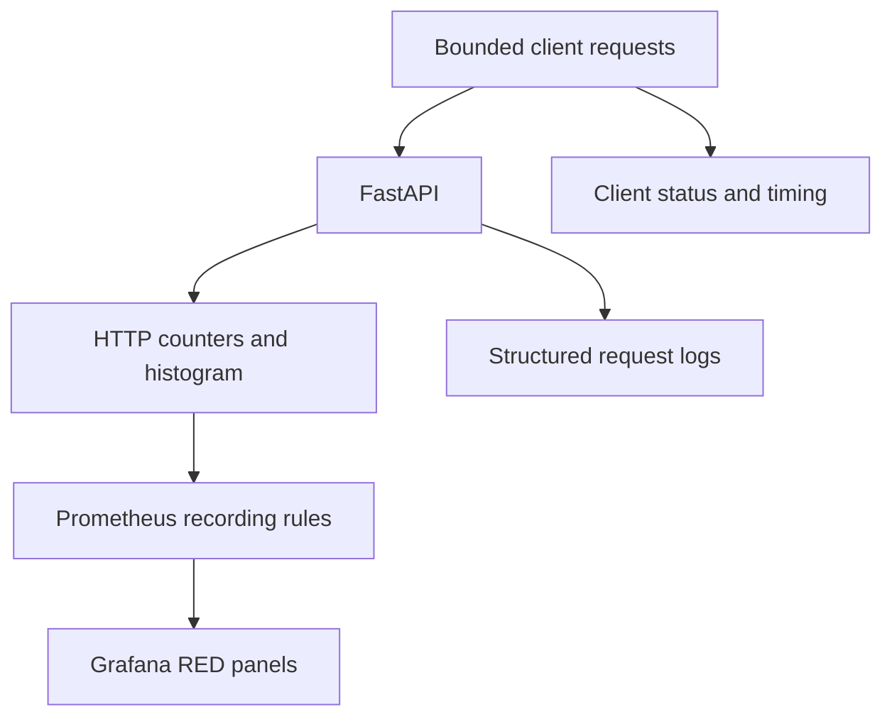

# Lab 20: Build a RED Application Dashboard

## 1. Purpose and Learning Outcomes

You will build a RED dashboard by first deciding which operational questions it should answer. After making one panel by hand, you will use a shared generator to create consistent panels. Then you will run normal requests, delayed requests, and a database failure. Compare the panels with known requests and source evidence to check their meaning, not just their appearance.

> **Primary Objective:** Build and verify request-rate, error, and latency panels using clear questions and clearly defined sets of requests.

A panel can look reasonable while using the wrong denominator, unit, or route selection. This lab builds a complete RED dashboard from the tested recording rules, then checks it with limited normal, slow, and failed requests.

First, you will create one panel manually. Then you will import a repeatable twelve-panel dashboard. This dashboard supports operations; it does not define an SLO. Dashboard provisioning begins in Lab 22, and the later telemetry backends remain stopped.

## 2. Starting Point and Lab Map

Open the complete application repository before using this guide. Unless a step says otherwise, run commands in Bash from the repository's top-level folder. Follow the starting checks in order because later commands depend on the helper functions and running services they prepare.

Read each explanation before running its commands. Run one complete code block, check the result, and then continue. In your notebook, save the commands, what happened, why you think it happened, and anything that differed from the expected result.

### Key Terms

| **Term**              | **Explanation**                                                                                 |
| --------------------- | ----------------------------------------------------------------------------------------------- |
| Panel contract        | A panel's question, selected requests, query, units, and intended meaning.                      |
| Error rate / fraction | Error rate is errors per second; error fraction is the share of completed requests that failed. |
| Instant query         | A query run at one evaluation time, often used to display current state.                        |

### Lab Map

The arrows show how the parts connect and where a request can take different paths. Use this map to understand the design. It is not a recording of a request that actually ran.


```mermaid
flowchart TD
    C["Bounded client requests"] --> A["FastAPI"]
    A --> M["HTTP counters and histogram"]
    M --> R["Prometheus recording rules"]
    R --> G["Grafana RED panels"]
    A --> L["Structured request logs"]
    C --> E["Client status and timing"]
```

## 3. Guided Walkthrough

### Step 01. Inherited State and Starting Checks

**What You Are Doing:** Check Grafana and the metrics stage, and keep the demo traffic limited. The dashboard relies on the recording rules already tested in earlier labs.

**Practical Walkthrough:** Check Grafana, scrape jobs, and the required recordings. Use only the documented test routes and sequence. Panels can summarize only the source data available, so repair missing or unhealthy rule output before changing appearance.

Check each required recording before importing panels. Colors, units, and legends cannot restore missing data. Keep the starting services and workload controlled so later graph changes can be explained by the normal, waiting, and failure phases.

```bash
source lab-notes/session.sh
source lab-notes/evidence.sh
source lab-notes/raw-metrics.sh
source lab-notes/metrics-session.sh
metrics_check
start_lab 20
```

Complete [Lab 19](Lab-19.md) first, using the repository root and the same Bash session. Keep credentials, named volumes, and the checkpoint item. Expect eight services and five scrape jobs. Enable the demo endpoint only in this local learning environment, and stop other load generators.

**Understanding the Result:** The dashboard depends on tested queries and healthy data. A complete-looking display is not proof that its inputs are correct.

### Step 02. Learning Objectives and Evidence Paths

**What You Are Doing:** Trace each panel back through its recording rule to the original request metric. Keep client and log records to independently check the graph's changes.

**Practical Walkthrough:** Follow each panel from query to recording rule to source instrument. Save the workload ledger and completion records alongside it. Known actions can then explain the chart, instead of guessing what happened from the chart alone.

For each panel, identify its original instrument and any intermediate recording. Keep client and completion records outside the dashboard. These provide independent evidence of the actions behind a graph change.

You will define which requests each panel includes, use recorded rates directly, combine histogram buckets before estimating quantiles, distinguish rates from fractions, and compare charts with client timings and logs.

The lab map in Section 2 shows this relationship.

Record completed requests, delayed demo responses, database failures, dependency recovery, and dashboard creation. Aggregate metrics do not replace the individual request and event ledger.

**Understanding the Result:** State what each panel observes. Individual logs and aggregate metrics provide different but complementary evidence.

### Step 03. Write the Dashboard Contract

**What You Are Doing:** Define each panel's question and measurement before creating it. Keep the selected requests, units, and limitations clear while choosing the display.

**Practical Walkthrough:** Write the question, included requests, units, and missing-data behavior for every panel. Then choose a visualization. A percentage format or attractive legend cannot fix a wrong denominator or an incorrectly scaled duration.

Before choosing the panel type, define its numerator, denominator, retained labels, and unit. Decide how inactivity and missing data should appear. Review these decisions as carefully as layout, since a polished percentage can still describe the wrong requests.

| **Operational Question**               | **Measurement**              | **Caveat**                                        |
| -------------------------------------- | ---------------------------- | ------------------------------------------------- |
| Are metrics being collected?           | Application target `up`      | A successful scrape does not prove readiness      |
| How much traffic completes?            | Requests per second by route | Includes the enabled `/api/v1/` demo route        |
| How many responses fail?               | 5xx rate and fraction        | 4xx responses remain visible separately           |
| How slow are completed requests?       | Mean and p50/p95/p99         | The histogram includes every response status      |
| How much evidence supports a quantile? | Estimated observation count  | Estimated from samples, not an exact event ledger |
| Is work executing now?                 | In-progress gauge            | Short requests may finish between scrapes         |

These panels select normalized `/api/v1/` routes. Middleware already excludes health and metrics endpoints, and these queries also leave out documentation and unmatched paths. Lab 25 uses a different, stricter request selection for the Items SLO.

**Understanding the Result:** The panel definition sets the conclusions a viewer can draw. Keep its limitations visible in the description fields.

### Step 04. Build One Panel Manually

**What You Are Doing:** Build one panel manually to understand its query, legend, and units. Inspect the actual request so the generated JSON later has a familiar reference.

**Practical Walkthrough:** Create the first panel and inspect how its expression, legend, range settings, and units affect the display. Use Query Inspector to connect the chart with its request. This makes the later generated configuration easier to understand.

Build the throughput panel, then inspect the expanded expression and returned labels. Confirm requests-per-second units and the route legend. Use this panel as a reference when reviewing the generated JSON so shared settings do not hide changes in query meaning.

Open **Dashboards → New → New dashboard → Add visualization**, select Prometheus, choose Code mode, and enter:

```promql
sum by (route) (service_route:application_http_requests:rate2m{route=~"/api/v1/.*"})
```

Choose Time series, set requests/second units, and use `{{route}}` for the legend. Save the dashboard as **Lab 20 — Manual panel** and inspect its request with Query Inspector.

This panel selects the only current service. The full generator below adds the configured environment and service selections. Do not apply `rate()` to an already recorded `rate2m` value.

**Understanding the Result:** Building the panel by hand connects configuration choices with what you see. Keep the tested query unchanged while exploring display settings.

### Step 05. Install a Reusable Panel Factory

**What You Are Doing:** Create reusable functions that build panels with consistent settings. They centralize choices such as instant or range queries and how missing data is displayed.

**Practical Walkthrough:** Create the provided helper functions and read their defaults. These shared settings keep generated panels consistent. Pay particular attention to query type and missing-data behavior, since they affect meaning as well as appearance.

Check the factory's source references, query types, units, and handling of absent values. They affect every panel it creates. A shared helper spreads both good and bad settings, so understand the defaults before generating the full dashboard.

```bash
cat > lab-notes/dashboard_factory.py <<'PYTHON'
"""Generate ordinary dashboard JSON using only the Python standard library."""

import json
from pathlib import Path

DS = {"type": "prometheus", "uid": "prometheus"}


def scope(environment, service):
    return "environment=" + json.dumps(environment) + ",service=" + json.dumps(service)


def panel(number, title, queries, unit, description, kind="timeseries"):
    defaults = {
        "unit": unit,
        "noValue": "No data",
        "mappings": [],
        "color": {"mode": "palette-classic"},
    }
    if unit == "percentunit":
        defaults.update(min=0, max=1)
    if kind == "timeseries":
        defaults["custom"] = {
            "drawStyle": "line",
            "lineWidth": 2,
            "fillOpacity": 10,
            "spanNulls": False,
        }
    options = (
        {
            "legend": {"displayMode": "table", "placement": "bottom"},
            "tooltip": {"mode": "multi", "sort": "desc"},
        }
        if kind == "timeseries"
        else {
            "reduceOptions": {"calcs": ["lastNotNull"], "fields": "", "values": False},
            "colorMode": "none",
            "graphMode": "none",
            "textMode": "auto",
        }
    )
    return {
        "id": number,
        "title": title,
        "description": description,
        "type": kind,
        "datasource": DS,
        "gridPos": {
            "x": ((number - 1) % 2) * 12,
            "y": ((number - 1) // 2) * 8,
            "w": 12,
            "h": 8,
        },
        "fieldConfig": {"defaults": defaults, "overrides": []},
        "options": options,
        "targets": [
            {
                "refId": chr(65 + i),
                "datasource": DS,
                "editorMode": "code",
                "expr": expr,
                "legendFormat": legend,
                "range": kind != "stat",
                "instant": kind == "stat",
                "format": "time_series",
            }
            for i, (expr, legend) in enumerate(queries)
        ],
    }


def save(path, uid, title, panels):
    result = {
        "id": None,
        "uid": uid,
        "title": title,
        "schemaVersion": 39,
        "version": 1,
        "editable": True,
        "timezone": "utc",
        "refresh": "15s",
        "time": {"from": "now-15m", "to": "now"},
        "tags": ["learning", "fastapi"],
        "links": [],
        "templating": {"list": []},
        "annotations": {"list": []},
        "panels": panels,
    }
    p = Path(path)
    p.parent.mkdir(parents=True, exist_ok=True)
    p.write_text(json.dumps(result, indent=2) + "\n")
    print(f"Wrote {p}: {len(panels)} panels; UID {uid}")
PYTHON
```

**Command Note:** `<<'PYTHON'` writes the following text literally until the closing `PYTHON`. The quoted delimiter prevents Bash from expanding `$variables` in the file. Creating the file and running it are separate steps.

The module generates ordinary dashboard JSON and needs no plugin. Time-series panels use range queries. Current-state stat panels use instant queries so an old “last non-null” value cannot hide missing current data. No-data states stay visible.

The classic JSON format is described in the [Grafana dashboard model reference](https://grafana.com/docs/grafana/latest/visualizations/dashboards/build-dashboards/view-dashboard-json-model/).

**Understanding the Result:** A factory keeps panel settings consistent, but its defaults must still fit what each panel promises to measure.

### Step 06. Generate and Import the Complete Dashboard

**What You Are Doing:** Generate and import the complete dashboard with stable IDs. Save any local UI edits before another import replaces the definition.

**Practical Walkthrough:** Generate the dashboard using the fixed dashboard and data-source identities. Export intentional UI changes before rerunning, since the import can replace them. Afterward, confirm the source and all planned panels.

Validate the JSON, import it, and check the dashboard UID, source UID, and panel list. Preserve UI work before rerunning the generator. Stable IDs make updates repeatable, but also let an import replace an existing dashboard rather than create a separate copy.

```bash
cat > lab-notes/build_red_dashboard.py <<'PYTHON'
"""Usage: build_red_dashboard.py ENVIRONMENT SERVICE OUTPUT_JSON"""

import sys
from dashboard_factory import panel, save, scope

if len(sys.argv) != 4:
    raise SystemExit(__doc__)
environment, service, output = sys.argv[1:]
base = scope(environment, service)
selected = base + ',route=~"/api/v1/.*"'


def recorded(name):
    return "service_route:" + name + ":rate2m{" + selected + "}"


requests = recorded("application_http_requests")
errors = recorded("application_http_server_errors")
buckets = recorded("application_http_request_duration_seconds_bucket")
count = recorded("application_http_request_duration_seconds_count")
duration = recorded("application_http_request_duration_seconds_sum")
r = "sum by (route) (" + requests + ")"
e = "sum by (route) (" + errors + ")"
c = "sum by (route) (" + count + ")"
p = []


def add(title, queries, unit, description, kind="timeseries"):
    p.append(panel(len(p) + 1, title, queries, unit, description, kind))


add(
    "FastAPI scrape health",
    [('up{job="fastapi",' + base + "}", "{{instance}}")],
    "short",
    "Scrape success is not business readiness.",
    "stat",
)
add(
    "Recording output age",
    [("time() - max(timestamp(" + requests + "))", "age")],
    "s",
    "Age of the newest selected rule output; absent stays absent.",
    "stat",
)
add(
    "Request rate by route",
    [(r, "{{route}}")],
    "reqps",
    "Completed API requests per second, including the enabled demo; 2-minute window.",
)
add(
    "5xx rate by route",
    [(e, "{{route}}")],
    "reqps",
    "Server-error responses per second.",
)
add(
    "5xx fraction by route",
    [(f"({e} / {r}) and on (route) ({r} > 0)", "{{route}}")],
    "percentunit",
    "0.05 means 5%; no positive traffic denominator means no ratio.",
)
add(
    "Global latency quantiles",
    [
        (f"histogram_quantile({q}, sum by (le) ({buckets}))", legend)
        for q, legend in [(0.5, "p50"), (0.95, "p95"), (0.99, "p99")]
    ],
    "s",
    "Approximate quantiles from merged buckets, not averages of route quantiles.",
)
add(
    "p95 latency by route",
    [(f"histogram_quantile(0.95, sum by (le,route) ({buckets}))", "{{route}}")],
    "s",
    "Sparse observations and bucket width limit precision.",
)
add(
    "Mean latency by route",
    [(f"(sum by (route) ({duration}) / {c}) and on (route) ({c} > 0)", "{{route}}")],
    "s",
    "Duration sum rate divided by observation count rate.",
)
add(
    "Status code rates",
    [
        (
            "sum by (status_code) (service_route_status:application_http_requests:rate2m{"
            + selected
            + "})",
            "{{status_code}}",
        )
    ],
    "reqps",
    "Separate 4xx and 5xx outcomes within the same API scope.",
)
add(
    "Requests currently executing",
    [
        (
            'sum(application_http_requests_in_progress{job="fastapi",' + base + "})",
            "in progress",
        )
    ],
    "short",
    "Short requests can complete between 15-second scrapes.",
)
add(
    "Estimated observations in 2m",
    [("sum(" + count + ") * 120", "observations")],
    "short",
    "Extrapolated rate times 120 seconds, not an exact event ledger.",
    "stat",
)
add(
    "Recorded throughput",
    [("sum(" + requests + ")", "requests/s")],
    "reqps",
    "Current service rate over two minutes.",
    "stat",
)
save(output, "lab20-red", "Lab 20 — FastAPI RED", p)
PYTHON
```

```bash
python3 lab-notes/build_red_dashboard.py "$LAB_ENVIRONMENT" "$LAB_SERVICE" lab-notes/grafana/lab20-red.json
python3 -m json.tool lab-notes/grafana/lab20-red.json >/dev/null
cp lab-notes/grafana/lab20-red.json "$LAB_DIR/red-dashboard-generated.json"
```

Import the file through **Dashboards → New → Import → Upload dashboard JSON file**. If your browser runs on your workstation, first transfer the JSON from the VM. Open **Lab 20 — FastAPI RED**, with UID `lab20-red`.

Before rerunning, export UI edits you want to keep from this learning dashboard. The separate manual dashboard is unaffected. Each expression uses an existing raw metric or one of the six Lab 16 recording names.

**Understanding the Result:** A successful import confirms that Grafana accepted the definition. You still need to check the queries and units to validate what the panels mean.

### Step 07. Audit Units and Aggregation

**What You Are Doing:** Check every panel's units, denominators, and histogram calculations. A believable percentage or percentile can still cover the wrong requests.

**Practical Walkthrough:** Compare each panel's labels, units, and aggregation with its written definition. Error fractions need aligned request sets. Histogram queries need bucket boundaries until the quantile calculation. Inspect actual query output even when the graph looks reasonable.

Read the labels and units returned by each query. Check that ratios compare matching groups and that quantile inputs retain their boundaries. A smooth curve or plausible percentage is not enough to prove the calculation answers the intended question.

A 5xx rate is measured in requests per second. A 5xx fraction has no unit: `0.05` represents 5% when displayed with Grafana `percentunit`. Do not multiply by 100 and then apply the fraction display unit as well.

The ratio groups both inputs by matching route labels. Routes with no positive request denominator are omitted rather than called successful. Quantile queries combine bucket rates and retain `le`; they do not average route p95 values. The mean divides the duration sum by the observation count.

Tail percentiles are estimates affected by bucket width and low traffic. Check the observation-count panel and individual routes when interpreting the global p95.

**Understanding the Result:** Verify what the numbers mean before styling them. Correct units and denominators are part of making a dashboard trustworthy.

### Step 08. Predict and Run Normal and Waiting Traffic

**What You Are Doing:** Predict the panels' responses to normal and waiting traffic, then run both phases. Waiting increases elapsed time without proving CPU saturation.

**Practical Walkthrough:** Run normal requests, then the prescribed waiting workload, and record their times. Predict rate, errors, and duration separately. A request can wait longer without using much CPU, so increased latency alone does not prove a CPU bottleneck.

Record each phase's start and end. Compare throughput, error rate, and duration with those times. Because waiting can increase latency without equivalent CPU work, inspect resource evidence before calling the delayed phase CPU saturation.

```bash
api -fsS "$APP_URL/api/v1/demo/work?iterations=1000&delay_ms=0" >/dev/null
record_change "red_normal_60_requests" planned
for index in $(seq 1 60); do
  api -fsS -o /dev/null -w '%{http_code} %{time_total}\n' \
    "$APP_URL/api/v1/items?limit=1" >> "$LAB_DIR/normal-client.txt"
  sleep 1
done
record_change "red_normal_60_requests" completed
record_change "red_waiting_demo_40_requests" planned
for index in $(seq 1 40); do
  api -fsS -o /dev/null -w '%{http_code} %{time_total}\n' \
    "$APP_URL/api/v1/demo/work?iterations=1000&delay_ms=400" >> "$LAB_DIR/slow-client.txt"
  sleep 1
done
record_change "red_waiting_demo_40_requests" completed
```

Predict the effects before running the loops. The 400 ms wait increases duration but does not demonstrate CPU saturation. Each sequential request finishes before the loop sleeps, so the delayed phase sends less than one request per second.

The two-minute window and 15-second rule interval smooth transitions. A request can start and finish between scrapes, leaving no observed nonzero in-progress value. Client timing also includes transport overhead outside the middleware's measurement.

**Understanding the Result:** Compare the actual panels with the known workload. Report small or absent effects as observed; do not extend the load simply to create a dramatic graph.

### Step 09. Inject a Short Failure and Guarantee Recovery

**What You Are Doing:** Briefly stop PostgreSQL and use a route that cannot answer from cache. Install recovery first. The expected 503 responses provide known failures for checking the error panels.

**Practical Walkthrough:** Use the limited database fault with the uncached route so each request needs PostgreSQL. Set up recovery before the stop and record actual statuses. These known 503 outcomes give the error panels a specific workload to summarize.

Install the trap before stopping PostgreSQL and keep every planned request's outcome. Use the database-required route so a warm cache cannot hide the fault. After restoration, verify current normal work separately from the graph, which may still include historical failures.

```bash
(
  set -euo pipefail
  trap 'dm start postgres >/dev/null' EXIT
  trap 'exit 130' INT
  trap 'exit 143' TERM
  record_change "red_postgres_stop" planned
  dm stop postgres
  api -fsS "$APP_URL/health/live" > "$LAB_DIR/live-during-db-stop.json"
  for index in $(seq 1 12); do
    status=$(api -sS -o "$LAB_DIR/db-error-$index.json" -w '%{http_code}' "$APP_URL/api/v1/items?limit=1")
    printf '%s %s\n' "$(date -u +%FT%TZ)" "$status" >> "$LAB_DIR/error-client.txt"
    test "$status" = 503
    sleep 1
  done
)
wait_ready
wait_metric 'pg_up{job="postgres"}' 1
record_change "red_postgres_restored" completed
for index in $(seq 1 30); do api -fsS "$APP_URL/api/v1/items?limit=1" >/dev/null; sleep 1; done
metrics_check
capture_app_logs
```

**Command Note:** `trap ... EXIT` schedules cleanup when that shell exits. Keep it in the same block as the fault. The recovery checks afterward verify that restoration succeeded.

List reads are uncached, so they should return 503 during database failure while liveness stays healthy. This relies on the database exception handling from Lab 2. If your code differs, restore PostgreSQL first, then inspect the implementation instead of weakening the check.

The exit trap starts PostgreSQL even if an assertion fails. It removes no data, migrations, or volumes. A cached single-item route would not reliably demonstrate this database failure because it might answer without the database.

**Understanding the Result:** Restore readiness before continuing. Even after recovery, the dashboard can correctly show errors from earlier in its selected window.

### Step 10. Correlate the Dashboard with Source Evidence

**What You Are Doing:** Align the dashboard's absolute time window with the client and completion records. Save query settings with screenshots so another reader can reproduce the comparison.

**Practical Walkthrough:** Select an absolute interval covering the experiment and compare its times with the ledger and logs. Save panel expressions and settings beside screenshots. Use request records to establish when the fault began, what responses occurred, and when recovery was confirmed.

Choose a fixed interval that covers the saved client and completion evidence. Record panel expressions and time settings. Match fault and recovery times with actual responses, and state which conclusions are supported by measured events and which remain uncertain.

```bash
pq 'sum by (route,status_code) (service_route_status:application_http_requests:rate2m{route=~"/api/v1/.*"})' \
  > "$LAB_DIR/status-rates.json"
jq -c 'select(."http.status_code"==503) | {timestamp,event_id,request_id,route:."http.route",status:."http.status_code"}' \
  "$LAB_DIR/app.jsonl" > "$LAB_DIR/error-events.jsonl"
```

Save a screenshot or panel export using an absolute UTC range covering every phase. Inspect the request parameters of one error panel and one latency panel. Compare them with client timestamps and structured error records.

The ledger records the exact planned attempts and their failure outcomes. The rate graph shows their aggregate trend over time, but estimation and smoothing make it different from an exact event count. A global quantile depends on the traffic mix, so inspect the delayed demo route separately.

**Understanding the Result:** Matching times helps compare evidence. Two signals appearing close together on a chart does not by itself prove that one caused the other.

### Step 11. Recovery and Troubleshooting

**What You Are Doing:** Confirm fresh healthy requests and rule output, then let the moving query window pass the outage. Keep current recovery separate from historical errors still visible in the range.

**Practical Walkthrough:** Check new requests and rule evaluations after recovery. Watch recent-window values change as the fault moves outside the window, while preserving the fixed incident view. A healthy service may still have a nonzero recent error fraction because the window includes old failures.

Verify current healthy responses and successful evaluations first. Then observe the recent values as the outage ages out. Leave the absolute incident view intact for review. A nonzero fraction can remain correct after recovery while earlier failures are still included.

Allow a full two-minute window of recovered traffic. Then check that the 5xx rate moves toward zero, readiness succeeds, and recorded output remains fresh.

| **Symptom**                | **Inspect**                         | **Corrective Action**                                              |
| -------------------------- | ----------------------------------- | ------------------------------------------------------------------ |
| Recorded panels empty      | Rule health and output labels       | Remove filters for job or instance labels that no longer exist     |
| 500% when expecting 5%     | Query expression and display unit   | Supply a fraction and display it with `percentunit`                |
| Global p95 barely changes  | Route mix and observation count     | Inspect the delayed route separately; do not average quantiles     |
| 503 phase returns 200      | Endpoint and cache behavior         | Use the uncached list route so the request needs PostgreSQL        |
| Demo returns 404/429       | Demo enablement or overlapping work | Restore the local learning setting and stop competing demo traffic |
| Current health looks stale | Query type and missing-value fills  | Use instant stats and leave missing current data visible           |

Keep the factory, generator, and JSON for later labs. Preserve incident history rather than resetting counters to make the chart look clean.

**Understanding the Result:** A dashboard can show both current recovery and earlier impact. State the time period behind each conclusion.

## 4. Troubleshooting and Diagnosis

Begin with the first result that differed from your prediction. Save the exact error or symptom and identify which service or command produced it. Use the checks below, make the needed fix, and repeat the original check to confirm the problem is resolved.

Use the recovery and troubleshooting checks in Step 09, Step 11.

## 5. Review and Practice

Answer the questions in your own words before reading the answers. For the scenario, say what you would inspect and exactly what each result would tell you.

### Knowledge Check

1. Why not average route p95s?
2. Why can in-progress miss a request?
3. Why is an idle error fraction absent?

#### Answer Guide

1. The combined percentile depends on all the underlying bucket counts, not the average of separate percentile values.
2. A short request can begin and finish between scrapes, so no scrape observes it in progress.
3. With no positive request denominator, an error fraction cannot establish success or failure for traffic that did not occur.

### Professional Scenario Exercise

The global mean looks healthy, but a route with little traffic is slow. Use that route's quantiles, request volume, and client timings to explain what the overall mean hides. Do this without adding request IDs to metric labels.

## 6. Completion Checklist

Tick an item only when you can show its result or saved evidence. Finish the cleanup instructions before starting the next lab.

### Observable Completion Criteria

- [ ] All twelve panels use real metrics with correct units and request selections.
- [ ] Client and log records cover the normal, waiting, and failure phases.
- [ ] Quantile calculations keep bucket boundaries and are interpreted with observation counts.
- [ ] PostgreSQL and all eight services are healthy after recovery.

## 7. Production Context and Next Lab

### Production Implications

Review dashboard definitions as operational code. Stable labels, clear request selections, and visible missing-data states matter more than decorative thresholds. Artificial delays in a local lab do not define production SLOs.

### End State and Transition

Keep all eight services and both source files. [Lab 21](Lab-21.md) connects RED symptoms with host and dependency observations.
