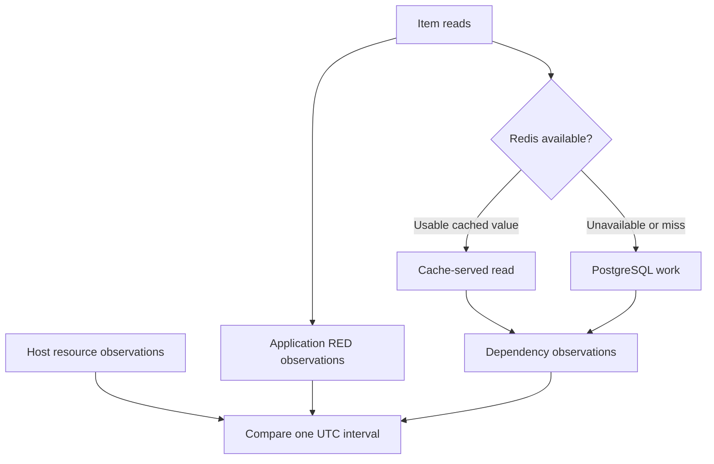

# Lab 21: Build USE and Dependency Dashboards

## 1. Purpose and Learning Outcomes

**In Plain Language:** You will place application symptoms beside host and dependency observations. Build the resource dashboard using real device identities, then compare a warm-cache baseline with a brief Redis outage. The aim is to explain how successful requests, cache fallback, database activity, and host pressure relate without assuming that simultaneous graph changes prove a cause.

> **Primary Objective:** Correlate application behavior with host utilization, saturation clues, error evidence and independent database/cache observations.

RED describes completed service requests. USE asks about utilization, saturation and errors of supporting resources. Exporters observe those resources from different connections and scopes than the application.

This lab builds a twenty-panel dashboard and briefly stops Redis to compare business success, cache degradation and PostgreSQL fallback. It does not add new services or repeat the full Redis incident exercise scheduled for Lab 45.

## 2. Starting Point and Lab Map

Use this guide inside the complete application repository. Run commands from the repository root in Bash unless a step says otherwise. Work through the starting checks in order; they load the helpers and state this lab needs.

Read the explanation before each step, run one complete code block at a time, and compare the actual result with the stated expectation. Save commands, observations, explanations, and unexpected results in your notebook.

### Key Terms

| **Term**             | **Plain-Language Meaning**                                                          |
| -------------------- | ----------------------------------------------------------------------------------- |
| Resource identity    | The particular host, device, filesystem, or interface a series describes.           |
| Independent observer | A component measuring through its own connection and scope.                         |
| Correlation          | Observations occurring together; a starting point for testing a causal explanation. |

### Lab Map

The arrows show the flow or dependency being studied. Branches identify paths to compare; this is a conceptual map, not a captured runtime trace.



## 3. Guided Walkthrough

### Step 01. Inherited State and Starting Checks

**What You Are Doing:** Verify the existing RED dashboard and exporter stage. Both dashboards need fresh, correctly scoped source data for a meaningful comparison.

**Practical Walkthrough:** Check the RED dashboard and all exporter targets before building the resource view. Both dashboards must use fresh observations from the same active stage. If a dependency panel later becomes empty, this baseline helps distinguish a new query mistake from a source that was already unavailable.

Verify every exporter target and the existing RED recordings before generating the resource dashboard. Save the healthy starting state. If a later panel is empty, compare with this baseline to determine whether the cause is query scope, unavailable instrumentation, or a newly failed collection path.

```bash
source lab-notes/session.sh
source lab-notes/evidence.sh
source lab-notes/raw-metrics.sh
source lab-notes/metrics-session.sh
metrics_check
start_lab 21
```

Complete [Lab 20](Lab-20.md) first. Run commands from the repository root in the same Bash session. Keep the existing credentials, named volumes and checkpoint item. Keep eight services and five jobs healthy. Node Exporter measures the Linux VM, not a Docker Desktop workstation. Preserve the checkpoint item.

**Understanding the Result:** Verify data freshness as well as dashboard reachability. A saved panel can display old history while current collection is failing.

### Step 02. Objectives and Scope of Evidence

**What You Are Doing:** Pair each resource question with its utilization, pressure, and error evidence. State when the available measurements leave a gap rather than substituting an unrelated gauge.

**Practical Walkthrough:** For each resource question, identify the available utilization, pressure, and error measurements. Keep their scope aligned: host CPU pressure and database connection count describe different resources. Where the lab has no direct saturation or error signal, record that limitation instead of assigning the meaning to an unrelated gauge.

Attach each USE measurement to its specific resource and describe gaps explicitly. A database connection count does not automatically measure host saturation, and a utilization gauge is not an error counter. Keep those meanings separate when deciding which evidence supports a proposed diagnosis.

You will separate utilization from pressure, match vector labels correctly, distinguish exporter reachability from downstream health and correlate two dashboards over one time range.

| **Resource** | **Utilization**                 | **Saturation/Pressure Clue** | **Error Evidence or Gap**                    |
| ------------ | ------------------------------- | ---------------------------- | -------------------------------------------- |
| CPU          | Non-idle fraction               | Load per CPU                 | No universal CPU-error counter               |
| Memory       | Used fraction from MemAvailable | Requires pressure context    | Used bytes alone do not prove OOM risk       |
| Disk         | Busy time and filesystem use    | Weighted I/O time            | Not a direct application storage-error count |
| Network      | Per-interface byte rate         | Needs link-capacity context  | Interface errors differ from HTTP failures   |
| PostgreSQL   | Connections and transactions    | Pool/query investigation     | Deadlocks, rollbacks and connectivity differ |
| Redis        | Memory, clients, commands       | Evictions/rejections         | Cache errors and downstream health           |

This table maps questions to available evidence rather than pretending every USE cell is completely instrumented. The relevant events are cache failure, fallback reads, exporter collection and recovery.

**Understanding the Result:** The dashboard should show supported evidence. A missing USE category is an instrumentation gap, not proof that the category is healthy.

### Step 03. Inspect Resource Identity Before Graphing

**What You Are Doing:** Identify actual filesystems, devices, and interfaces before selecting them. Host naming and topology vary, and several interfaces can observe the same traffic.

**Practical Walkthrough:** Discover the host's actual mount, device, and interface names before applying selectors. Choose the resources relevant to this deployment and retain those identities in the evidence. Several virtual and physical interfaces may observe the same traffic, so broad sums can double-count activity.

Use the discovered database, mountpoint, device, and interface identities in selectors. Avoid copying resource names from another host. When several interfaces observe the same traffic, choose the relevant boundary rather than summing them into an inflated total.

```bash
ITEM_ID=$(cat lab-notes/checkpoint-item-id.txt)
LAB_DATABASE=$(dm exec -T app python -c 'from app.config import Settings; print(Settings().postgres_db)')
api -fsS "$APP_URL/api/v1/items/$ITEM_ID" > "$LAB_DIR/checkpoint-before.json"
pq 'node_filesystem_size_bytes{job="node"}' > "$LAB_DIR/filesystems.json"
pq 'node_network_receive_bytes_total{job="node"}' > "$LAB_DIR/interfaces.json"
pq 'pg_stat_database_numbackends{job="postgres"}' > "$LAB_DIR/databases.json"
docker info --format '{{.DockerRootDir}}' > "$LAB_DIR/docker-data-directory.txt"
jq -r '.data.result[].metric | [.mountpoint,.device,.fstype] | @tsv' "$LAB_DIR/filesystems.json"
```

Identify the filesystem holding Docker's data directory. Do not assume `/dev/sda`, root `/` or `eth0` on every VM. Physical, bridge and veth interfaces can see the same packets; summing them blindly double-counts work.

Host-wide use includes other services. A time correlation motivates a hypothesis but does not attribute all CPU or disk activity to FastAPI.

**Understanding the Result:** Selectors must match this host's topology. Copying another machine's device name can produce a valid but empty panel.

### Step 04. Generate the Complete Dependency Dashboard

**What You Are Doing:** Generate the dependency dashboard with the same panel factory used for RED. Keep units and source identities explicit so unlike measurements are not visually conflated.

**Practical Walkthrough:** Use the existing panel factory to generate the dependency dashboard with the same visual conventions as RED. Keep units and data-source references explicit in each definition. Shared formatting makes comparison easier, while panel descriptions must still explain the different resource and observer boundaries.

Generate and validate the JSON, then inspect source references and representative panel expressions before import. Shared factory styling should make navigation consistent with RED. Check descriptions and units independently because host resources and database observations have different scopes even when panels look alike.

```bash
cat > lab-notes/build_use_dashboard.py <<'PYTHON'
"""Usage: build_use_dashboard.py ENVIRONMENT SERVICE DATABASE OUTPUT_JSON"""

import json, sys
from dashboard_factory import panel, save, scope

if len(sys.argv) != 5:
    raise SystemExit(__doc__)
environment, service, database, output = sys.argv[1:]
base = scope(environment, service)
pg = 'job="postgres",datname=' + json.dumps(database)
fs = 'job="node",fstype!~"tmpfs|devtmpfs|overlay|squashfs|proc|sysfs|cgroup2?"'
hits = "rate(pg_stat_database_blks_hit{" + pg + "}[2m])"
reads = "rate(pg_stat_database_blks_read{" + pg + "}[2m])"
cache_hits = 'sum(rate(application_cache_hits_total{job="fastapi",' + base + "}[2m]))"
cache_misses = (
    'sum(rate(application_cache_misses_total{job="fastapi",' + base + "}[2m]))"
)
p = []


def add(title, queries, unit, description, kind="timeseries"):
    p.append(panel(len(p) + 1, title, queries, unit, description, kind))


add(
    "Exporter scrape health",
    [('up{job=~"node|postgres|redis"}', "{{job}} {{instance}}")],
    "short",
    "Prometheus-to-exporter path.",
    "stat",
)
add(
    "Dependency observation paths",
    [
        ('pg_up{job="postgres"}', "PostgreSQL exporter → server"),
        ('redis_up{job="redis"}', "Redis exporter → server"),
        (
            'application_dependency_up{job="fastapi",' + base + "}",
            "application → {{dependency}}",
        ),
    ],
    "short",
    "Independent observers; do not average their binary states.",
    "stat",
)
add(
    "Host CPU utilization",
    [
        (
            '1 - avg by (instance) (rate(node_cpu_seconds_total{job="node",mode="idle"}[2m]))',
            "{{instance}}",
        )
    ],
    "percentunit",
    "Host-wide non-idle fraction across CPUs, not application-only use.",
)
add(
    "Load per CPU",
    [
        (
            'max by (instance) (node_load1{job="node"}) / count by (instance) (node_cpu_seconds_total{job="node",mode="idle"})',
            "{{instance}}",
        )
    ],
    "short",
    "Runnable and uninterruptible tasks per CPU; a pressure clue, not a direct queue measure.",
)
add(
    "Host memory used fraction",
    [
        (
            '1 - node_memory_MemAvailable_bytes{job="node"} / node_memory_MemTotal_bytes{job="node"}',
            "{{instance}}",
        )
    ],
    "percentunit",
    "Available memory accounts for reclaimable memory better than free memory alone.",
)
add(
    "Filesystem used fraction",
    [
        (
            "(1 - node_filesystem_avail_bytes{"
            + fs
            + "} / node_filesystem_size_bytes{"
            + fs
            + "}) and (node_filesystem_size_bytes{"
            + fs
            + "} > 0)",
            "{{mountpoint}} {{device}}",
        )
    ],
    "percentunit",
    "Match the Docker data directory to its actual mount; do not sum duplicate mounts.",
)
add(
    "Disk busy fraction",
    [
        (
            'rate(node_disk_io_time_seconds_total{job="node",device!~"loop.*|ram.*"}[2m])',
            "{{device}}",
        )
    ],
    "percentunit",
    "Busy time is not a universal performance ceiling for parallel storage.",
)
add(
    "Disk weighted I/O time rate",
    [
        (
            'rate(node_disk_io_time_weighted_seconds_total{job="node",device!~"loop.*|ram.*"}[2m])',
            "{{device}}",
        )
    ],
    "short",
    "Approximate average in-flight I/O; interpret per device with latency.",
)
add(
    "Network throughput",
    [
        (
            'rate(node_network_receive_bytes_total{job="node",device!="lo"}[2m])',
            "RX {{device}}",
        ),
        (
            'rate(node_network_transmit_bytes_total{job="node",device!="lo"}[2m])',
            "TX {{device}}",
        ),
    ],
    "Bps",
    "Keep physical, bridge and veth paths distinct to avoid double-counting.",
)
add(
    "Network errors",
    [
        (
            'rate(node_network_receive_errs_total{job="node",device!="lo"}[2m])',
            "RX {{device}}",
        ),
        (
            'rate(node_network_transmit_errs_total{job="node",device!="lo"}[2m])',
            "TX {{device}}",
        ),
    ],
    "ops",
    "Interface errors, not HTTP errors.",
)
add(
    "PostgreSQL connections",
    [("pg_stat_database_numbackends{" + pg + "}", "{{datname}}")],
    "short",
    "Includes app pool, exporter and operator connections; no invented maximum denominator.",
)
add(
    "PostgreSQL transactions",
    [
        ("rate(pg_stat_database_xact_commit{" + pg + "}[2m])", "commits/s"),
        ("rate(pg_stat_database_xact_rollback{" + pg + "}[2m])", "rollbacks/s"),
    ],
    "ops",
    "Server activity includes health checks and monitoring, not just item writes.",
)
add(
    "PostgreSQL buffer hit fraction",
    [(f"({hits} / ({hits} + {reads})) and ({hits} + {reads} > 0)", "{{datname}}")],
    "percentunit",
    "Shared-buffer hits; does not include operating-system cache effects.",
)
add(
    "PostgreSQL deadlocks",
    [("rate(pg_stat_database_deadlocks{" + pg + "}[2m])", "{{datname}}")],
    "ops",
    "Database deadlocks, not all query failures.",
)
add(
    "Redis memory",
    [('redis_memory_used_bytes{job="redis"}', "used bytes")],
    "bytes",
    "Server memory; used bytes alone do not establish saturation.",
)
add(
    "Redis clients",
    [('redis_connected_clients{job="redis"}', "clients")],
    "short",
    "Connections from application, exporter and administration.",
)
add(
    "Redis commands",
    [('rate(redis_commands_processed_total{job="redis"}[2m])', "commands/s")],
    "ops",
    "All server commands, including monitoring.",
)
add(
    "Application cache outcomes",
    [
        (cache_hits, "hits/s"),
        (cache_misses, "misses/s"),
        (
            'sum(rate(application_redis_errors_total{job="fastapi",' + base + "}[2m]))",
            "errors/s",
        ),
    ],
    "ops",
    "Application cache observations, not global Redis keyspace statistics.",
)
add(
    "Application cache hit fraction",
    [
        (
            f"({cache_hits} / ({cache_hits} + {cache_misses})) and ({cache_hits} + {cache_misses} > 0)",
            "hit fraction",
        )
    ],
    "percentunit",
    "Successful lookup population; read alongside cache-error rate.",
)
add(
    "Redis evictions and rejections",
    [
        ('rate(redis_evicted_keys_total{job="redis"}[2m])', "evictions/s"),
        ('rate(redis_rejected_connections_total{job="redis"}[2m])', "rejections/s"),
    ],
    "ops",
    "Distinct pressure symptoms tied to server configuration.",
)
save(output, "lab21-use", "Lab 21 — Host and Dependencies", p)
PYTHON
```

**Command Note:** `<<'PYTHON'` writes the following block literally until `PYTHON`. Quoting the delimiter prevents Bash from expanding `$variables` inside the generated file; creation and execution are separate steps.

```bash
python3 lab-notes/build_use_dashboard.py "$LAB_ENVIRONMENT" "$LAB_SERVICE" "$LAB_DATABASE" lab-notes/grafana/lab21-use.json
python3 -m json.tool lab-notes/grafana/lab21-use.json >/dev/null
cp lab-notes/grafana/lab21-use.json "$LAB_DIR/use-dashboard-generated.json"
```

Import as **Lab 21 — Host and Dependencies**, UID `lab21-use`. Keep the RED dashboard in a second tab with the same UTC interval. The existing factory provides consistent panel structure without adding a plugin.

Bytes, clients, fractions and operations/second remain separate. There is no invented maximum-connection denominator or assumption that Redis used bytes equals memory saturation.

**Understanding the Result:** Consistent appearance should not imply interchangeable measurements. Each panel's units and population remain part of its meaning.

### Step 05. Explain the Query Choices

**What You Are Doing:** Explain how each query aligns labels and selects the intended resource. A missing result can be a label-matching problem rather than an idle resource.

**Practical Walkthrough:** Read each expression from selector through label matching and aggregation. Inspect operands independently when a ratio returns no result. Confirm the resource labels retained in the output correspond to the intended device or dependency instead of treating an empty calculation as an idle resource.

Evaluate a ratio's operands independently if the combined result is empty. Compare the labels that must match, then inspect the resource identity retained after aggregation. A valid expression returning no paired series is different from a measured zero utilization or idle dependency.

The load/CPU-count division aggregates both sides by `instance` so their label sets match. An unmatched division can silently return no data.

The pinned PostgreSQL exporter exposes `pg_stat_database_xact_commit` and related counters without `_total`; use their actual type/name rather than inventing a suffix. Shared-buffer hit fraction does not include operating-system cache behavior. Consult the [versioned exporter documentation](https://github.com/prometheus-community/postgres_exporter/tree/v0.17.1).

Redis server statistics include all clients and monitoring commands. Application cache outcomes cover the wrapper's lookup/error behavior. A failed cache operation is not automatically a normal miss, so read cache errors alongside a hit fraction.

**Understanding the Result:** Query validity does not establish correct pairing. Label inspection often explains a missing derived value.

### Step 06. Compare Independent Dependency Observers

**What You Are Doing:** Compare scraper, exporter, and application observations without averaging them. Each successful or failed check refers to a different connection path.

**Practical Walkthrough:** Compare Prometheus scrape status, exporter downstream status, and application dependency observations side by side. Each follows a different connection path and may update at a different time. Do not average these indicators into one number that hides which boundary failed.

Place scrape status, downstream exporter status, and app dependency state side by side without averaging them. Compare their timestamps as well as values. A mismatch can identify a failed monitoring credential or path while another observer continues to reach the underlying service successfully.

```bash
pq 'up{job=~"postgres|redis"}' > "$LAB_DIR/exporter-health-before.json"
pq 'pg_up{job="postgres"}' > "$LAB_DIR/postgres-health-before.json"
pq 'redis_up{job="redis"}' > "$LAB_DIR/redis-health-before.json"
pq 'application_dependency_up{job="fastapi"}' > "$LAB_DIR/app-dependencies-before.json"
api -fsS "$APP_URL/health/ready" > "$LAB_DIR/readiness-before.json"
```

Explain why exporter `up=1` can coexist with `redis_up=0`: Prometheus reached the exporter, but the exporter could not collect from Redis. The application has its own connections and health contract.

Do not average these binary checks into one reassuring number. Their different observation times and failure domains are diagnostically useful.

**Understanding the Result:** Use the pattern to locate a failure. An exporter can answer HTTP while its connection to the database is broken.

### Step 07. Establish a Warm-Cache Baseline

**What You Are Doing:** Warm the exercise item and measure the normal read pattern. This establishes the cache behavior against which database fallback will be compared.

**Practical Walkthrough:** Read the exercise item to populate its cache and then measure the normal repeated-read behavior within the stated timing. A warm cache gives a known baseline for comparison with Redis failure. Verify actual hits rather than assuming the first read succeeded in creating a usable cached entry.

Confirm the exact item key is populated and the repeated reads produce the intended cache behavior before saving the baseline. Keep the same item and timing through the comparison. A successful first request alone does not prove the following requests are using a valid cached representation.

```bash
snapshot "$LAB_DIR/warm-before.json"
for index in $(seq 1 20); do
  api -fsS -o /dev/null -w '%{http_code} %{time_total}\n' "$APP_URL/api/v1/items/$ITEM_ID" >> "$LAB_DIR/warm-client.txt"
  sleep 1
done
snapshot "$LAB_DIR/warm-after.json"
printf '%s\n' 'SELECT datname,numbackends,xact_commit,xact_rollback,blks_hit,blks_read FROM pg_stat_database WHERE datname=current_database();' \
  | dbsql > "$LAB_DIR/database-before.txt"
```

The first read or a TTL boundary can miss; subsequent reads should usually hit. Compare raw counter deltas using the earlier `metric_sum` helper. PostgreSQL still performs health/exporter/operator work even when application reads hit cache.

**Understanding the Result:** Cache state and TTL affect the baseline. Record them before attributing later database activity to the outage.

### Step 08. Predict and Run the Bounded Redis Experiment

**What You Are Doing:** Predict the independent health results, stop Redis briefly, and keep business reads running. The experiment tests the optional-cache policy while observing its resource consequences.

**Practical Walkthrough:** Write predictions for app responses, cache health, exporter health, and database work, then stop Redis within the bounded recovery block. Continue the prescribed reads so PostgreSQL fallback can be observed. Keep the population fixed and restore Redis before moving on.

Keep the request population fixed while Redis is stopped and record the fault interval. Compare business outcomes with cache failure and PostgreSQL activity. Preserve the complete restoration block so the experiment ends with a recovered dependency rather than leaving the next dashboard comparison inside an unrecorded outage.

```bash
(
  set -euo pipefail
  trap 'dm start redis >/dev/null' EXIT
  trap 'exit 130' INT
  trap 'exit 143' TERM
  record_change "use_redis_stop" planned
  dm stop redis
  wait_metric 'redis_up{job="redis"}' 0
  wait_target redis up
  api -fsS "$APP_URL/health/ready" > "$LAB_DIR/degraded-readiness.json"
  snapshot "$LAB_DIR/degraded-before.json"
  for index in $(seq 1 30); do
    api -fsS -o /dev/null -w '%{http_code} %{time_total}\n' "$APP_URL/api/v1/items/$ITEM_ID" >> "$LAB_DIR/degraded-client.txt"
    sleep 1
  done
  snapshot "$LAB_DIR/degraded-after.json"
  pq 'application_dependency_up{job="fastapi"}' > "$LAB_DIR/degraded-app-state.json"
  printf '%s\n' 'SELECT datname,numbackends,xact_commit,xact_rollback,blks_hit,blks_read FROM pg_stat_database WHERE datname=current_database();' \
    | dbsql > "$LAB_DIR/database-during.txt"
)
wait_ready
wait_metric 'redis_up{job="redis"}' 1
metrics_check
record_change "use_redis_restored" completed
```

**Command Note:** `trap ... EXIT` schedules cleanup when that shell exits. Keep it in the same block as the fault; the explicit recovery checks afterward confirm that restoration actually succeeded.

Before stopping Redis, predict both exporter hops, readiness HTTP status, business status and cache errors. Expected: exporter endpoint healthy, Redis downstream unavailable, readiness HTTP 200 with degraded cache, successful business reads and additional cache errors.

PostgreSQL connection count need not rise: the existing pool can execute more operations on the same connections. Compare operation/transaction activity and client evidence rather than asserting a connection spike. Thirty reads may be subtle against monitoring traffic and a two-minute rate window.

**Understanding the Result:** Successful reads can coexist with lost cache service and increased database work. Availability alone does not describe the full effect.

### Step 09. Correlate Both Dashboards and Prove Recovery

**What You Are Doing:** Align both dashboards to the same absolute interval and verify recovery. Write one supported explanation and one uncertainty so a temporal association is not overstated.

**Practical Walkthrough:** Set both dashboards to the same absolute interval and align them with request evidence. Verify current Redis recovery separately from the historical outage view. Write one conclusion supported by the observations and one remaining uncertainty, such as work from other database clients.

Use the same absolute interval in both dashboards and align it with the request ledger. Verify current recovery independently of the historical panels. State which observations support fallback and which cannot isolate application work from monitoring or other database clients during the same interval.

```bash
api -fsS "$APP_URL/api/v1/items/$ITEM_ID" > "$LAB_DIR/checkpoint-recovered.json"
for index in $(seq 1 10); do api -fsS "$APP_URL/api/v1/items/$ITEM_ID" >/dev/null; sleep 1; done
snapshot "$LAB_DIR/recovered-metrics.json"
api -fsS "$APP_URL/health/ready" > "$LAB_DIR/recovered-readiness.json"
capture_app_logs
jq -e --arg id "$ITEM_ID" '.id==$id' "$LAB_DIR/checkpoint-recovered.json"
metrics_check
```

**Command Note:** `jq --arg` passes a shell value as a JSON-query string variable without inserting it into the query text. Where used, `-e` turns a false or null final result into a failing exit status.

Use the same absolute time window on both dashboards. Relate successful requests and latency to cache errors, downstream health, database activity and host observations. Save one supported conclusion and one uncertainty.

After recovery, the first read can repopulate the cache and later reads should hit. Lifetime error counters retain historical failures; their rates return toward zero as the window moves past the outage. A missing Redis server series during failure is not a measured zero.

**Understanding the Result:** Aligned timing supports a comparison but not unlimited causal claims. State what the controlled fault and independent evidence actually establish.

## 4. Troubleshooting and Diagnosis

Start with the first unexpected result. Record the exact symptom, identify which component produced it, and use the checks below before repeating the experiment. After a fix, repeat the original check and confirm recovery.

### Troubleshooting

| **Symptom**                                  | **Check**                      | **Action**                                                     |
| -------------------------------------------- | ------------------------------ | -------------------------------------------------------------- |
| Host panels empty                            | Node target and bridge gateway | Revisit Lab 14; do not expose exporter on every interface      |
| Database panels empty                        | Actual `datname`               | Regenerate with the configured database                        |
| Buffer ratio absent at idle                  | Hit/read denominator           | Preserve undefined state rather than declaring 100% hits       |
| Redis exporter up but server metrics missing | Downstream collection          | Inspect `redis_up`, credentials and server health              |
| High memory use with no pressure             | Available/reclaimable memory   | Do not infer OOM risk from use alone                           |
| Database effect is small                     | Rate window and competing work | Compare raw deltas and application operations at matched times |

Use the [versioned Node Exporter collector reference](https://github.com/prometheus/node_exporter/tree/v1.9.1) when interpreting host-specific collector behavior.

## 5. Review and Practice

Answer the knowledge questions in your own words before reading the answer guide. For the scenario, name the evidence you would collect and the conclusion each observation would support.

### Knowledge Check

1. Why is utilization not saturation?
2. Why can pooled connection count stay flat?
3. Why not sum all network interfaces?

#### Answer Guide

1. Use alone does not show waiting or resource exhaustion.
2. Existing connections can execute more work.
3. The same traffic may traverse multiple observed interfaces.

### Professional Scenario Exercise

Latency and database connections rise while host CPU remains modest. Propose two competing hypotheses and a discriminating observation for each before recommending a larger VM.

## 6. Completion Checklist

Mark each item only after you can point to its result or evidence file. Complete any cleanup shown here before moving on.

### Observable Completion Criteria

- [ ] Twenty panels use actual dependency/host metrics.
- [ ] Measurement scopes and vector matching are explained.
- [ ] Redis outage preserves business reads and changes cache observations.
- [ ] Both dashboards share a correlated interval and recovery evidence.

## 7. Production Context and Next Lab

### Production Implications

Host-wide metrics are not automatic application attribution. Maintain exporter contracts and scoped credentials; combine utilization with pressure and workload evidence before assigning capacity or alert thresholds.

### End State and Transition

Keep eight services and both dashboard source files. [Lab 22](Lab-22.md) adds selectors, navigation and version-controlled provisioning.
