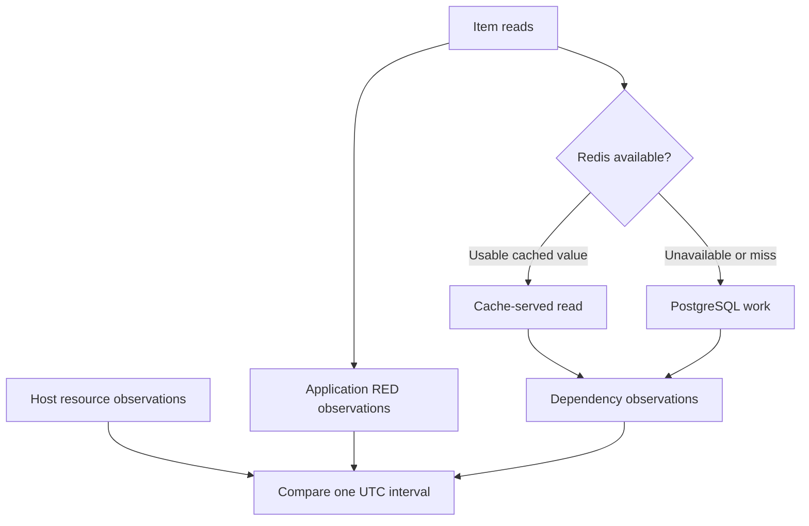

# Lab 21: Build USE and Dependency Dashboards

## 1. Purpose and Learning Outcomes

**In Plain Language:** You will compare application symptoms with measurements from the host, PostgreSQL, and Redis. First, build a resource dashboard using the actual devices and interfaces on your VM. Then compare normal warm-cache reads with a short Redis outage. You will see how successful requests, cache fallback, database work, and host pressure relate, while remembering that two graphs changing together does not prove that one change caused the other.

> **Primary Objective:** Compare app behavior with host resource use, signs of waiting or pressure, error evidence, and separate database and cache observations.

RED describes the rate, errors, and duration of completed service requests. USE asks how much a supporting resource is used, whether work is waiting for it, and whether errors occur. Exporters measure those resources through their own connections and include different activity from the app.

This lab builds a twenty-panel dashboard and briefly stops Redis. You will compare successful business reads, degraded cache health, and fallback to PostgreSQL. It adds no services and does not repeat the full Redis incident exercise planned for Lab 45.

## 2. Starting Point and Lab Map

Open the complete application repository before using this guide. Unless a step says otherwise, run commands in Bash from the repository's top-level folder. Follow the starting checks in order because later commands depend on the helper functions and running services they prepare.

Read each explanation before running its commands. Run one complete code block, check the result, and then continue. In your notebook, save the commands, what happened, why you think it happened, and anything that differed from the expected result.

### Key Terms

| **Term**             | **Explanation**                                                                          |
| -------------------- | ---------------------------------------------------------------------------------------- |
| Resource identity    | The exact host, device, filesystem, or network interface described by a series.          |
| Independent observer | A component that measures through its own connection and covers its own set of activity. |
| Correlation          | Two observations happening together; a clue to investigate, not proof of cause.          |

### Lab Map

The arrows show how the parts connect and where a request can take different paths. Use this map to understand the design. It is not a recording of a request that actually ran.



## 3. Guided Walkthrough

### Step 01. Inherited State and Starting Checks

**What You Are Doing:** Check the existing RED dashboard and exporters. To compare the dashboards meaningfully, both need fresh data from the intended sources.

**Practical Walkthrough:** Check the RED dashboard and every exporter target before creating the resource view. Confirm that both will use current data from the same running stage. This starting record helps you investigate a later empty panel: the cause could be its query or a source that was already unavailable.

Verify all exporter targets and the RED recording results, then save the healthy baseline. If a panel is empty later, compare with that baseline. Check whether the query selects the wrong labels, the measurement is unsupported, or collection has newly failed.

```bash
source lab-notes/session.sh
source lab-notes/evidence.sh
source lab-notes/raw-metrics.sh
source lab-notes/metrics-session.sh
metrics_check
start_lab 21
```

Complete [Lab 20](Lab-20.md) first. Use the repository root and the same Bash session. Keep the credentials, named volumes, and checkpoint item. All eight services and five jobs should be healthy. Node Exporter measures the Linux VM, not the workstation running Docker Desktop.

**Understanding the Result:** Check freshness as well as dashboard access. A panel can still display old history while current collection is failing.

### Step 02. Objectives and Scope of Evidence

**What You Are Doing:** Match each resource question with measurements of use, pressure, and errors. If a needed measurement is unavailable, state that gap instead of giving an unrelated metric that meaning.

**Practical Walkthrough:** For each resource, identify the available utilization, pressure, and error signals. Keep the resource clear: host CPU pressure and database connection count describe different things. If the lab has no direct measure of waiting or errors, record that limit rather than treating another gauge as a substitute.

Name the resource behind each USE measurement and explain what is missing. Database connection count is not automatically a measure of host saturation. A utilization gauge does not count errors. Keep these meanings separate when deciding what supports your explanation.

You will distinguish use from pressure, pair series using the correct labels, separate exporter reachability from dependency health, and compare two dashboards over the same time range.

| **Resource** | **Utilization**                     | **Saturation/Pressure Clue**     | **Error Evidence or Gap**                                           |
| ------------ | ----------------------------------- | -------------------------------- | ------------------------------------------------------------------- |
| CPU          | Fraction of time spent non-idle     | Load relative to CPU count       | No single counter covers every CPU error                            |
| Memory       | Used fraction based on MemAvailable | Needs pressure measurements      | Used bytes alone do not prove out-of-memory risk                    |
| Disk         | Busy time and filesystem use        | Weighted I/O time                | These do not directly count app storage errors                      |
| Network      | Byte rate for each interface        | Needs a meaningful link capacity | Interface errors are different from HTTP failures                   |
| PostgreSQL   | Connections and transactions        | Investigate pools and queries    | Deadlocks, rollbacks, and connection failures mean different things |
| Redis        | Memory, clients, and commands       | Evictions and rejected work      | Cache errors and exporter-to-Redis health                           |

The table links questions to available evidence. It does not claim that every USE category has a complete set of measurements. Record cache failure, fallback reads, exporter collection, and recovery as the main events in this experiment.

**Understanding the Result:** Display what the measurements support. A missing USE category is a gap in observation, not proof that the resource is healthy in that category.

### Step 03. Inspect Resource Identity Before Graphing

**What You Are Doing:** Find the actual filesystems, devices, and interfaces before selecting them. Names and connections vary by host, and several interfaces may observe the same traffic.

**Practical Walkthrough:** Discover this host's mounts, devices, and interfaces. Select the ones relevant to the deployment and keep their names in your evidence. Adding physical and virtual interface totals together can count the same traffic more than once.

Use the database, mountpoint, device, and interface names you actually found. Do not copy names from another machine. If multiple interfaces see the same traffic, choose the relevant interface instead of combining repeated observations into an inflated total.

```bash
ITEM_ID=$(cat lab-notes/checkpoint-item-id.txt)
LAB_DATABASE=$(dm exec -T app python -c 'from app.config import Settings; print(Settings().postgres_db)')
api -fsS "$APP_URL/api/v1/items/$ITEM_ID" > "$LAB_DIR/checkpoint-before.json"
pq 'node_filesystem_size_bytes{job="node"}' > "$LAB_DIR/filesystems.json"
pq 'node_network_receive_bytes_total{job="node"}' > "$LAB_DIR/interfaces.json"
pq 'pg_stat_database_numbackends{job="postgres"}' > "$LAB_DIR/databases.json"
docker info --format '{{.DockerRootDir}}' > "$LAB_DIR/docker-data-directory.txt"
jq -r '.data.result[].metric | [.mountpoint,.device,.fstype] | @tsv' "$LAB_DIR/filesystems.json"
```

Find the filesystem containing Docker's data directory. Do not assume every VM uses `/dev/sda`, root `/`, or `eth0`. Physical, bridge, and veth interfaces may observe the same packets, so blindly summing them can count traffic repeatedly.

Host-wide measurements include other services. Changes at the same time suggest an explanation to test, but do not assign all CPU or disk activity to FastAPI.

**Understanding the Result:** Select resources that exist on this host. A device name copied from another machine can give a valid query with an empty result.

### Step 04. Generate the Complete Dependency Dashboard

**What You Are Doing:** Build the dependency dashboard with the RED panel factory. Keep units and source identities clear so similar-looking panels do not suggest different measurements mean the same thing.

**Practical Walkthrough:** Reuse the panel factory for a consistent appearance and navigation. Give each panel explicit units and a data-source reference. Its description must still explain which resource and observer it represents.

Generate and validate the JSON, then inspect source references and some panel expressions before importing it. The shared factory should make the two dashboards easy to compare. Check descriptions and units separately because host and database measurements cover different activity despite looking similar.

```bash
cat > lab-notes/build_use_dashboard.py <<'PYTHON'
"""Usage: build_use_dashboard.py ENVIRONMENT SERVICE DATABASE OUTPUT_JSON"""

import json, sys
from dashboard_factory import panel, save, scope

if len(sys.argv) != 5:
    raise SystemExit(__doc__)
environment, service, database, output = sys.argv[1:]
base = scope(environment, service)
pg = 'job="postgres",datname=' + json.dumps(database)
fs = 'job="node",fstype!~"tmpfs|devtmpfs|overlay|squashfs|proc|sysfs|cgroup2?"'
hits = "rate(pg_stat_database_blks_hit{" + pg + "}[2m])"
reads = "rate(pg_stat_database_blks_read{" + pg + "}[2m])"
cache_hits = 'sum(rate(application_cache_hits_total{job="fastapi",' + base + "}[2m]))"
cache_misses = (
    'sum(rate(application_cache_misses_total{job="fastapi",' + base + "}[2m]))"
)
p = []


def add(title, queries, unit, description, kind="timeseries"):
    p.append(panel(len(p) + 1, title, queries, unit, description, kind))


add(
    "Exporter scrape health",
    [('up{job=~"node|postgres|redis"}', "{{job}} {{instance}}")],
    "short",
    "Prometheus-to-exporter path.",
    "stat",
)
add(
    "Dependency observation paths",
    [
        ('pg_up{job="postgres"}', "PostgreSQL exporter → server"),
        ('redis_up{job="redis"}', "Redis exporter → server"),
        (
            'application_dependency_up{job="fastapi",' + base + "}",
            "application → {{dependency}}",
        ),
    ],
    "short",
    "Independent observers; do not average their binary states.",
    "stat",
)
add(
    "Host CPU utilization",
    [
        (
            '1 - avg by (instance) (rate(node_cpu_seconds_total{job="node",mode="idle"}[2m]))',
            "{{instance}}",
        )
    ],
    "percentunit",
    "Host-wide non-idle fraction across CPUs, not application-only use.",
)
add(
    "Load per CPU",
    [
        (
            'max by (instance) (node_load1{job="node"}) / count by (instance) (node_cpu_seconds_total{job="node",mode="idle"})',
            "{{instance}}",
        )
    ],
    "short",
    "Runnable and uninterruptible tasks per CPU; a pressure clue, not a direct queue measure.",
)
add(
    "Host memory used fraction",
    [
        (
            '1 - node_memory_MemAvailable_bytes{job="node"} / node_memory_MemTotal_bytes{job="node"}',
            "{{instance}}",
        )
    ],
    "percentunit",
    "Available memory accounts for reclaimable memory better than free memory alone.",
)
add(
    "Filesystem used fraction",
    [
        (
            "(1 - node_filesystem_avail_bytes{"
            + fs
            + "} / node_filesystem_size_bytes{"
            + fs
            + "}) and (node_filesystem_size_bytes{"
            + fs
            + "} > 0)",
            "{{mountpoint}} {{device}}",
        )
    ],
    "percentunit",
    "Match the Docker data directory to its actual mount; do not sum duplicate mounts.",
)
add(
    "Disk busy fraction",
    [
        (
            'rate(node_disk_io_time_seconds_total{job="node",device!~"loop.*|ram.*"}[2m])',
            "{{device}}",
        )
    ],
    "percentunit",
    "Busy time is not a universal performance ceiling for parallel storage.",
)
add(
    "Disk weighted I/O time rate",
    [
        (
            'rate(node_disk_io_time_weighted_seconds_total{job="node",device!~"loop.*|ram.*"}[2m])',
            "{{device}}",
        )
    ],
    "short",
    "Approximate average in-flight I/O; interpret per device with latency.",
)
add(
    "Network throughput",
    [
        (
            'rate(node_network_receive_bytes_total{job="node",device!="lo"}[2m])',
            "RX {{device}}",
        ),
        (
            'rate(node_network_transmit_bytes_total{job="node",device!="lo"}[2m])',
            "TX {{device}}",
        ),
    ],
    "Bps",
    "Keep physical, bridge and veth paths distinct to avoid double-counting.",
)
add(
    "Network errors",
    [
        (
            'rate(node_network_receive_errs_total{job="node",device!="lo"}[2m])',
            "RX {{device}}",
        ),
        (
            'rate(node_network_transmit_errs_total{job="node",device!="lo"}[2m])',
            "TX {{device}}",
        ),
    ],
    "ops",
    "Interface errors, not HTTP errors.",
)
add(
    "PostgreSQL connections",
    [("pg_stat_database_numbackends{" + pg + "}", "{{datname}}")],
    "short",
    "Includes app pool, exporter and operator connections; no invented maximum denominator.",
)
add(
    "PostgreSQL transactions",
    [
        ("rate(pg_stat_database_xact_commit{" + pg + "}[2m])", "commits/s"),
        ("rate(pg_stat_database_xact_rollback{" + pg + "}[2m])", "rollbacks/s"),
    ],
    "ops",
    "Server activity includes health checks and monitoring, not just item writes.",
)
add(
    "PostgreSQL buffer hit fraction",
    [(f"({hits} / ({hits} + {reads})) and ({hits} + {reads} > 0)", "{{datname}}")],
    "percentunit",
    "Shared-buffer hits; does not include operating-system cache effects.",
)
add(
    "PostgreSQL deadlocks",
    [("rate(pg_stat_database_deadlocks{" + pg + "}[2m])", "{{datname}}")],
    "ops",
    "Database deadlocks, not all query failures.",
)
add(
    "Redis memory",
    [('redis_memory_used_bytes{job="redis"}', "used bytes")],
    "bytes",
    "Server memory; used bytes alone do not establish saturation.",
)
add(
    "Redis clients",
    [('redis_connected_clients{job="redis"}', "clients")],
    "short",
    "Connections from application, exporter and administration.",
)
add(
    "Redis commands",
    [('rate(redis_commands_processed_total{job="redis"}[2m])', "commands/s")],
    "ops",
    "All server commands, including monitoring.",
)
add(
    "Application cache outcomes",
    [
        (cache_hits, "hits/s"),
        (cache_misses, "misses/s"),
        (
            'sum(rate(application_redis_errors_total{job="fastapi",' + base + "}[2m]))",
            "errors/s",
        ),
    ],
    "ops",
    "Application cache observations, not global Redis keyspace statistics.",
)
add(
    "Application cache hit fraction",
    [
        (
            f"({cache_hits} / ({cache_hits} + {cache_misses})) and ({cache_hits} + {cache_misses} > 0)",
            "hit fraction",
        )
    ],
    "percentunit",
    "Successful lookup population; read alongside cache-error rate.",
)
add(
    "Redis evictions and rejections",
    [
        ('rate(redis_evicted_keys_total{job="redis"}[2m])', "evictions/s"),
        ('rate(redis_rejected_connections_total{job="redis"}[2m])', "rejections/s"),
    ],
    "ops",
    "Distinct pressure symptoms tied to server configuration.",
)
save(output, "lab21-use", "Lab 21 — Host and Dependencies", p)
PYTHON
```

**Command Note:** `<<'PYTHON'` writes the following text literally until the closing `PYTHON`. The quoted delimiter prevents Bash from expanding `$variables` in the file. Creating the file and running it are separate steps.

```bash
python3 lab-notes/build_use_dashboard.py "$LAB_ENVIRONMENT" "$LAB_SERVICE" "$LAB_DATABASE" lab-notes/grafana/lab21-use.json
python3 -m json.tool lab-notes/grafana/lab21-use.json >/dev/null
cp lab-notes/grafana/lab21-use.json "$LAB_DIR/use-dashboard-generated.json"
```

Import **Lab 21 — Host and Dependencies**, with UID `lab21-use`. Open the RED dashboard in another tab and use the same UTC interval. The existing factory keeps panel structure consistent without an extra plugin.

Keep bytes, client counts, fractions, and operations per second as separate units. Do not invent a maximum-connection value for a ratio or assume Redis memory use alone proves memory saturation.

**Understanding the Result:** Matching visual styles do not make measurements interchangeable. Each panel's units and included activity remain part of its meaning.

### Step 05. Explain the Query Choices

**What You Are Doing:** Explain how each query selects a resource and pairs labeled series. An empty calculation can be caused by incompatible labels rather than an idle resource.

**Practical Walkthrough:** Read the selector, matching rules, and aggregation in each expression. If a ratio is empty, run its two inputs separately. Check that the output still identifies the intended device or dependency before interpreting the result.

If a division returns nothing, inspect both inputs and compare their matching labels. Then check which resource labels remain after aggregation. No matching pair is different from a measurement of zero utilization or no activity.

The load-to-CPU-count division groups both sides by `instance` so their labels match. If the series cannot be paired, division may quietly return no data.

The pinned PostgreSQL exporter exposes `pg_stat_database_xact_commit` and related counters without `_total`. Use the actual name and type rather than adding a suffix. Its shared-buffer hit fraction does not measure operating-system cache behavior. See the [versioned exporter documentation](https://github.com/prometheus-community/postgres_exporter/tree/v0.17.1).

Redis server statistics include every client and monitoring command. The app's cache metrics cover the wrapper's own lookup and error behavior. A failed cache operation is not necessarily an ordinary miss, so read cache errors alongside the hit fraction.

**Understanding the Result:** Valid syntax does not prove the inputs pair correctly. Checking labels often explains a missing calculated result.

### Step 06. Compare Independent Dependency Observers

**What You Are Doing:** Compare scraper, exporter, and app checks side by side. Do not average them: each checks a different connection path.

**Practical Walkthrough:** Compare Prometheus scrape status, the exporter's access to its dependency, and the app's own dependency check. Their paths and update times differ. Keep the individual results visible so you can identify which connection failed.

Place the three statuses together and compare timestamps as well as values. Different results can reveal a broken monitoring credential or connection while another observer still reaches the same service. Averaging them would hide that useful distinction.

```bash
pq 'up{job=~"postgres|redis"}' > "$LAB_DIR/exporter-health-before.json"
pq 'pg_up{job="postgres"}' > "$LAB_DIR/postgres-health-before.json"
pq 'redis_up{job="redis"}' > "$LAB_DIR/redis-health-before.json"
pq 'application_dependency_up{job="fastapi"}' > "$LAB_DIR/app-dependencies-before.json"
api -fsS "$APP_URL/health/ready" > "$LAB_DIR/readiness-before.json"
```

Explain how exporter `up=1` and `redis_up=0` can both be true. Prometheus reached the exporter, but the exporter could not collect from Redis. The app has its own connections and conditions for health.

Do not average these binary checks into one reassuring value. Their different times and connection paths help locate the problem.

**Understanding the Result:** Use the pattern of results to identify the failing path. An exporter can answer HTTP while its database connection fails.

### Step 07. Establish a Warm-Cache Baseline

**What You Are Doing:** Populate the cache for the exercise item and check normal repeated reads. This establishes the behavior you will compare with database fallback.

**Practical Walkthrough:** Read the item to warm its cache, then measure repeated reads within the stated period. Verify actual cache hits. A successful first request alone does not prove that a valid cached entry was created or used afterward.

Confirm the specific item key is cached and that repeated reads behave as expected before saving the baseline. Keep the same item and timing for the later comparison. Check the cache evidence rather than assuming successful responses must come from cache.

```bash
snapshot "$LAB_DIR/warm-before.json"
for index in $(seq 1 20); do
  api -fsS -o /dev/null -w '%{http_code} %{time_total}\n' "$APP_URL/api/v1/items/$ITEM_ID" >> "$LAB_DIR/warm-client.txt"
  sleep 1
done
snapshot "$LAB_DIR/warm-after.json"
printf '%s\n' 'SELECT datname,numbackends,xact_commit,xact_rollback,blks_hit,blks_read FROM pg_stat_database WHERE datname=current_database();' \
  | dbsql > "$LAB_DIR/database-before.txt"
```

The first read, or a read near expiry, may miss; later reads should usually hit. Compare raw counter changes using the earlier `metric_sum` helper. PostgreSQL still handles health checks, exporter queries, and operator activity even when app reads use cache.

**Understanding the Result:** Cache contents and TTL affect the starting behavior. Record them before attributing later database activity to the outage.

### Step 08. Predict and Run the Bounded Redis Experiment

**What You Are Doing:** Predict the separate health results, briefly stop Redis, and continue business reads. This tests the optional-cache fallback while you observe its effect on resource activity.

**Practical Walkthrough:** Predict app responses, cache status, exporter status, and database work. Then run the short Redis stop inside the recovery block. Keep the specified reads unchanged so you can observe fallback to PostgreSQL, and restore Redis before proceeding.

Use the same request set while Redis is stopped and save the fault's start and end. Compare successful responses with cache errors and database activity. Run the complete restoration block so later dashboard checks are not affected by an unrecorded ongoing outage.

```bash
(
  set -euo pipefail
  trap 'dm start redis >/dev/null' EXIT
  trap 'exit 130' INT
  trap 'exit 143' TERM
  record_change "use_redis_stop" planned
  dm stop redis
  wait_metric 'redis_up{job="redis"}' 0
  wait_target redis up
  api -fsS "$APP_URL/health/ready" > "$LAB_DIR/degraded-readiness.json"
  snapshot "$LAB_DIR/degraded-before.json"
  for index in $(seq 1 30); do
    api -fsS -o /dev/null -w '%{http_code} %{time_total}\n' "$APP_URL/api/v1/items/$ITEM_ID" >> "$LAB_DIR/degraded-client.txt"
    sleep 1
  done
  snapshot "$LAB_DIR/degraded-after.json"
  pq 'application_dependency_up{job="fastapi"}' > "$LAB_DIR/degraded-app-state.json"
  printf '%s\n' 'SELECT datname,numbackends,xact_commit,xact_rollback,blks_hit,blks_read FROM pg_stat_database WHERE datname=current_database();' \
    | dbsql > "$LAB_DIR/database-during.txt"
)
wait_ready
wait_metric 'redis_up{job="redis"}' 1
metrics_check
record_change "use_redis_restored" completed
```

**Command Note:** `trap ... EXIT` arranges cleanup when that shell exits. Keep it in the same block as the fault. The recovery checks afterward confirm that restoration worked.

Before stopping Redis, predict the Prometheus-to-exporter and exporter-to-Redis results, readiness HTTP status, business responses, and cache errors. Expect a healthy exporter endpoint, unavailable Redis, HTTP 200 readiness with degraded cache status, successful business reads, and more cache errors.

PostgreSQL connection count may stay steady because the existing pool can perform more work using the same connections. Compare operation or transaction activity with client records instead of expecting a connection spike. Thirty reads may have only a small visible effect beside monitoring traffic and a two-minute rate window.

**Understanding the Result:** Reads can succeed while the cache is unavailable and the database does more work. Availability alone does not describe every effect of the fault.

### Step 09. Correlate Both Dashboards and Prove Recovery

**What You Are Doing:** Set both dashboards to the same fixed interval and confirm recovery. Write a supported conclusion and a remaining uncertainty so you do not overstate what simultaneous changes prove.

**Practical Walkthrough:** Align both dashboards with the request records using one absolute interval. Check current Redis recovery separately from the historical outage display. State one conclusion the evidence supports and one uncertainty, such as database work from other clients.

Use the same absolute interval and compare it with the request ledger. Confirm current recovery independently. Explain which observations support fallback and which cannot separate app work from monitoring or other database clients.

```bash
api -fsS "$APP_URL/api/v1/items/$ITEM_ID" > "$LAB_DIR/checkpoint-recovered.json"
for index in $(seq 1 10); do api -fsS "$APP_URL/api/v1/items/$ITEM_ID" >/dev/null; sleep 1; done
snapshot "$LAB_DIR/recovered-metrics.json"
api -fsS "$APP_URL/health/ready" > "$LAB_DIR/recovered-readiness.json"
capture_app_logs
jq -e --arg id "$ITEM_ID" '.id==$id' "$LAB_DIR/checkpoint-recovered.json"
metrics_check
```

**Command Note:** `jq --arg` passes a shell value as a string variable without inserting it into the query text. When used, `-e` makes a false or null final result return a failing exit status.

Use the same fixed time window on both dashboards. Compare request success and latency with cache errors, dependency status, database work, and host measurements. Save one supported explanation and one unresolved point.

After recovery, the first read may fill the cache again and later reads should hit. Lifetime error counters keep the earlier failures, while their rates move toward zero as those failures leave the window. A missing Redis series during failure is not a measured zero.

**Understanding the Result:** Matching times supports comparison, but does not prove every possible causal claim. State only what the controlled fault and independent records establish.

## 4. Troubleshooting and Diagnosis

Begin with the first result that differed from your prediction. Save the exact error or symptom and identify which service or command produced it. Use the checks below, make the needed fix, and repeat the original check to confirm the problem is resolved.

### Troubleshooting

| **Symptom**                                  | **Check**                           | **Action**                                                             |
| -------------------------------------------- | ----------------------------------- | ---------------------------------------------------------------------- |
| Host panels empty                            | Node target and bridge gateway      | Revisit Lab 14; keep the exporter restricted to its intended interface |
| Database panels empty                        | Actual `datname`                    | Regenerate the dashboard using the configured database name            |
| Buffer ratio absent at idle                  | Hit/read denominator                | Keep the undefined result; no activity does not mean 100% hits         |
| Redis exporter up but server metrics missing | Exporter-to-Redis collection        | Check `redis_up`, credentials, and Redis health                        |
| High memory use with no pressure             | Available and reclaimable memory    | Do not infer out-of-memory risk from memory use alone                  |
| Database effect is small                     | Rate window and other database work | Compare raw changes and app operations over matching times             |

Use the [versioned Node Exporter collector reference](https://github.com/prometheus/node_exporter/tree/v1.9.1) to understand collector behavior specific to the host.

## 5. Review and Practice

Answer the questions in your own words before reading the answers. For the scenario, say what you would inspect and exactly what each result would tell you.

### Knowledge Check

1. Why is utilization not saturation?
2. Why can pooled connection count stay flat?
3. Why not sum all network interfaces?

#### Answer Guide

1. Resource use alone does not show whether work is waiting or capacity is exhausted.
2. Connections already in the pool can handle more operations without increasing their count.
3. The same traffic may pass through several measured interfaces, so adding them can count it more than once.

### Professional Scenario Exercise

Latency and database connections increase while host CPU stays moderate. Suggest two possible explanations and a measurement that would help distinguish each one. Do this before recommending a larger VM.

## 6. Completion Checklist

Tick an item only when you can show its result or saved evidence. Finish the cleanup instructions before starting the next lab.

### Observable Completion Criteria

- [ ] All twenty panels use actual host and dependency metrics.
- [ ] I can explain what each observer measures and how query labels match.
- [ ] Business reads succeed during the Redis outage while cache observations change.
- [ ] Both dashboards use the same experiment interval and have evidence of recovery.

## 7. Production Context and Next Lab

### Production Implications

Host-wide metrics do not automatically identify which app caused the activity. Maintain clear exporter definitions and limited credentials. Combine resource use with pressure and workload evidence before choosing capacity or alert thresholds.

### End State and Transition

Keep all eight services and both dashboard source files. [Lab 22](Lab-22.md) adds selectors, navigation, and provisioning managed in version control.
