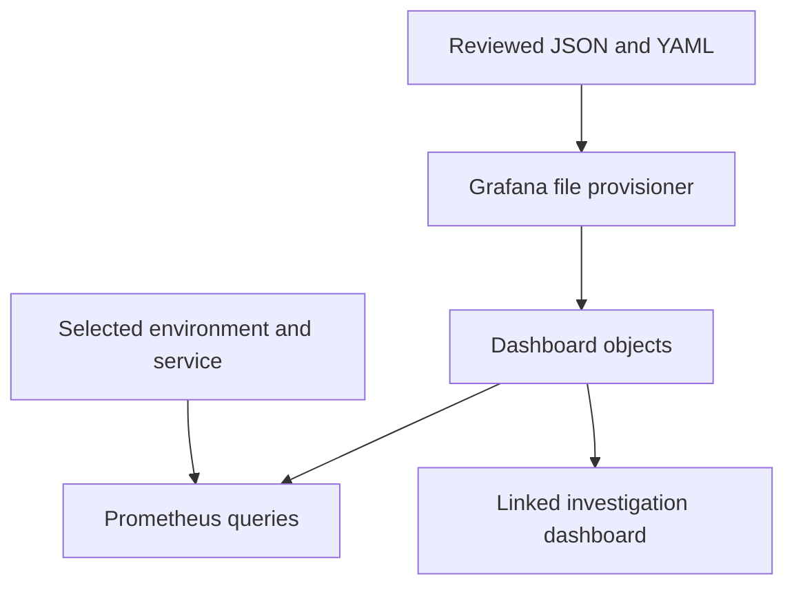

# Lab 22: Dashboard Variables, UX, Drilldowns, and Provisioning

## Purpose and Scope

> **Primary Objective:** Make both dashboards reusable and reviewable through bounded selectors, consistent visual semantics, context-preserving links and file provisioning.

A dashboard's contract includes defaults, scope, units, no-data behavior and navigation. Manual copies can drift even when their original PromQL was correct.

This lab adds environment/service variables, meaningful health mappings and reproducible provisioning. It does not add request-ID variables, plugins, Grafana alert evaluation or another data source. Prometheus remains the metric owner.

## 1. Inherited State and Starting Checks

```bash
source lab-notes/session.sh
source lab-notes/evidence.sh
source lab-notes/raw-metrics.sh
source lab-notes/metrics-session.sh
metrics_check
start_lab 22
```

Complete [Lab 21](Lab-21.md) first. Run commands from the repository root in the same Bash session. Keep the existing credentials, named volumes and checkpoint item. Both dashboards and their generated JSON must exist. Expect eight services and five healthy targets. Preserve any UI edits before transferring authority to files.

## 2. Learning Objectives and Change Ownership

You will verify interpolated queries, distinguish shared-host scope from service scope, preserve time/variables during navigation, validate a file change and roll it back.



Provisioning is a configuration-change event. The file becomes authoritative; the Grafana database object is the runtime presentation. Changing a file must be observable and recoverable.

## 3. Export the Current State

```bash
GRAFANA_USER=$(dm exec -T grafana sh -c 'printf "%s" "$GF_SECURITY_ADMIN_USER"')
export GRAFANA_USER
gapi /api/dashboards/uid/lab20-red -fsS > "$LAB_DIR/red-before.json"
gapi /api/dashboards/uid/lab21-use -fsS > "$LAB_DIR/use-before.json"
cp lab-notes/compose.grafana.yaml "$LAB_DIR/grafana-overlay-before.yaml"
```

Use the current username if it differs from the initial environment value. The helper prompts for the password. Export before provisioning the same UIDs because file ownership can replace UI-only edits.

## 4. Choose Bounded Variables and Honest Scope

Use environment and then service values discovered from FastAPI `up` series. Both are single-select without an unrestricted All option. A known down or idle target can still have an `up` series, whereas a successful-request series may not provide a useful selector.

The selectors affect application metrics. This stage has one VM and one configured database/cache; host/server panels deliberately retain that shared scope. A service variable does not make Node Exporter measurements attributable to that service.

Regex interpolation escapes selected values for regex matchers. Grafana macros are not PromQL; inspect their expanded form before comparing with Prometheus directly. See [Grafana variable syntax](https://grafana.com/docs/grafana/latest/visualizations/dashboards/variables/variable-syntax/).

## 5. Transform the Dashboards

```bash
cat > lab-notes/provision_dashboards.py <<'PYTHON'
"""Usage: provision_dashboards.py ENVIRONMENT SERVICE"""

import json, sys
from pathlib import Path

if len(sys.argv) != 3:
    raise SystemExit(__doc__)
environment, service = sys.argv[1:]
out = Path("config/grafana/learning/dashboards")
out.mkdir(parents=True, exist_ok=True)


def variable(name, label, query, value):
    return {
        "name": name,
        "label": label,
        "type": "query",
        "datasource": {"type": "prometheus", "uid": "prometheus"},
        "query": {"query": query, "refId": "variable-" + name},
        "definition": query,
        "refresh": 1,
        "sort": 1,
        "multi": False,
        "includeAll": False,
        "hide": 0,
        "options": [],
        "current": {"text": value, "value": value, "selected": True},
    }


for filename, other_uid, title in [
    ("lab20-red.json", "lab21-use", "Host and dependencies"),
    ("lab21-use.json", "lab20-red", "Application RED"),
]:
    d = json.loads((Path("lab-notes/grafana") / filename).read_text())
    d["templating"]["list"] = [
        variable(
            "environment",
            "Environment",
            'label_values(up{job="fastapi"}, environment)',
            environment,
        ),
        variable(
            "service",
            "Service",
            'label_values(up{job="fastapi",environment=~"$environment"}, service)',
            service,
        ),
    ]
    d["links"] = [
        {
            "title": title,
            "type": "link",
            "url": "/d/" + other_uid,
            "includeVars": True,
            "keepTime": True,
            "targetBlank": False,
        }
    ]
    for panel in d["panels"]:
        for target in panel["targets"]:
            target["expr"] = (
                target["expr"]
                .replace(
                    "environment=" + json.dumps(environment),
                    'environment=~"${environment:regex}"',
                )
                .replace(
                    "service=" + json.dumps(service), 'service=~"${service:regex}"'
                )
            )
        if panel["title"] in {
            "FastAPI scrape health",
            "Exporter scrape health",
            "Dependency observation paths",
        }:
            defaults = panel["fieldConfig"]["defaults"]
            defaults["color"] = {"mode": "thresholds"}
            defaults["thresholds"] = {
                "mode": "absolute",
                "steps": [
                    {"color": "red", "value": None},
                    {"color": "green", "value": 1},
                ],
            }
            defaults["mappings"] = [
                {
                    "type": "value",
                    "options": {
                        "0": {"text": "Down", "color": "red"},
                        "1": {"text": "Up", "color": "green"},
                    },
                }
            ]
            panel["options"]["colorMode"] = "value"
        if filename == "lab21-use.json":
            panel["description"] += (
                " Host/server panels describe the single VM and configured database; selectors scope application metrics only."
            )
    (out / filename).write_text(json.dumps(d, indent=2) + "\n")
    print(out / filename)
PYTHON
```

```bash
python3 lab-notes/provision_dashboards.py "$LAB_ENVIRONMENT" "$LAB_SERVICE"
python3 -m json.tool config/grafana/learning/dashboards/lab20-red.json >/dev/null
python3 -m json.tool config/grafana/learning/dashboards/lab21-use.json >/dev/null
```

The output under `config/grafana/learning/` becomes reviewable source. Stable UIDs preserve links even if titles change. Binary health mappings mean 0 Down and 1 Up; no-data remains distinct. CPU and latency get no arbitrary red threshold before there is a defensible workload/objective meaning.

## 6. Create the Provider and Activate Its Mounts

```bash
mkdir -p config/grafana/learning/provisioning/datasources config/grafana/learning/provisioning/dashboards
cp lab-notes/grafana/provisioning/datasources/datasources.yml config/grafana/learning/provisioning/datasources/datasources.yml
```

```bash
cat > config/grafana/learning/provisioning/dashboards/labs.yml <<'YAML'
apiVersion: 1
providers:
  - name: learning-metrics
    orgId: 1
    folder: Observability Learning
    type: file
    disableDeletion: false
    allowUiUpdates: false
    updateIntervalSeconds: 15
    options:
      path: /var/lib/grafana/dashboards
YAML
```

```bash
cat > config/grafana/learning/compose.yaml <<'YAML'
services:
  grafana:
    volumes:
      - ./config/grafana/learning/provisioning:/etc/grafana/provisioning:ro
      - ./config/grafana/learning/dashboards:/var/lib/grafana/dashboards:ro
YAML
```

```bash
cp config/grafana/learning/compose.yaml lab-notes/compose.grafana.yaml
find config/grafana/learning -type d -exec chmod 755 {} +
find config/grafana/learning -type f -exec chmod 644 {} +
dm config --quiet
record_change "activate_versioned_dashboards" planned
dm up -d --no-deps grafana
wait_grafana
sleep 20
gapi /api/dashboards/uid/lab20-red -fsS > "$LAB_DIR/red-provisioned.json"
gapi /api/dashboards/uid/lab21-use -fsS > "$LAB_DIR/use-provisioned.json"
jq -e '.meta.provisioned==true and .dashboard.uid=="lab20-red"' "$LAB_DIR/red-provisioned.json"
jq -e '.meta.provisioned==true and .dashboard.uid=="lab21-use"' "$LAB_DIR/use-provisioned.json"
metrics_check
```

The added files are operational configuration: two JSON dashboards, a provider, the existing validated data source and its stage overlay. The helper discovers the private active overlay copy; the reviewed source lives under `config/`.

`allowUiUpdates: false` establishes file authority. With `disableDeletion: false`, removing a source dashboard can remove its runtime object, so review deletions. A 15-second polling interval avoids depending on bind-mount filesystem events. See [Grafana provisioning](https://grafana.com/docs/grafana/latest/administration/provisioning/#dashboards).

If provisioning is still scanning, inspect logs and repeat the API read after another poll. Do not import a competing UI copy or delete the database volume.

## 7. Test Variables, Links and Panel UX

Open **Observability Learning**. Select environment/service and inspect the expanded query. Verify selected values are escaped correctly and recorded metrics still have no job/instance filter.

Choose an absolute UTC interval covering Lab 21. Follow **Host and dependencies** from RED and **Application RED** back. Verify `includeVars` and `keepTime` preserve investigation context. Use a panel's Explore action for deeper query inspection without constructing fragile hand-encoded URLs.

Review requests/second, bytes/second, seconds and fraction units. Keep route/device/mount legends readable. A numeric 0.05 should display as 5% only with a fraction unit. Current health uses instant queries; historical trends retain gaps.

The Python panel factory is this curriculum's reusable panel mechanism. It is not a Grafana Library Panel object. Try a local UI edit, observe the provisioned save restriction, then discard it or save a separate scratch copy.

## 8. Predict and Test a Reversible Source Change

```bash
cp config/grafana/learning/dashboards/lab20-red.json "$LAB_DIR/red-source-before.json"
(
  set -euo pipefail
  trap 'cp "$LAB_DIR/red-source-before.json" config/grafana/learning/dashboards/lab20-red.json; chmod 644 config/grafana/learning/dashboards/lab20-red.json' EXIT
  trap 'exit 130' INT
  trap 'exit 143' TERM
  python3 - <<'PYTHON'
import json
from pathlib import Path
p=Path("config/grafana/learning/dashboards/lab20-red.json");d=json.loads(p.read_text())
d["title"]="Lab 20 — FastAPI RED — provisioning check"
p.write_text(json.dumps(d,indent=2)+"\n")
PYTHON
  sleep 20
  gapi /api/dashboards/uid/lab20-red -fsS > "$LAB_DIR/title-probe.json"
  jq -e '.dashboard.title=="Lab 20 — FastAPI RED — provisioning check"' "$LAB_DIR/title-probe.json"
)
sleep 20
gapi /api/dashboards/uid/lab20-red -fsS > "$LAB_DIR/title-recovered.json"
jq -e '.dashboard.title=="Lab 20 — FastAPI RED" and .meta.provisioned==true' "$LAB_DIR/title-recovered.json"
record_change "dashboard_file_change_and_rollback_verified" completed
```

Predict whether a restart is needed, whether the UID changes and whether links break. Expected: polling updates the title without a restart; the stable UID and links remain. The trap restores source even on failure.

The source JSON version is not an overwrite-protection mechanism for file provisioning. The authoritative file can supersede the database object; preserve intended changes in source control.

## 9. Review the Version-Control Boundary

If you started from a ZIP and have not initialized Git, run `git init` in the repository root first. Preserve the existing history when working in a Git checkout.

```bash
cmp config/grafana/learning/compose.yaml lab-notes/compose.grafana.yaml
git status --short -- config/grafana/learning
git add -- config/grafana/learning
git diff --cached --stat -- config/grafana/learning
git diff --cached --check -- config/grafana/learning
dm logs --no-color --since 10m grafana > "$LAB_DIR/grafana-provisioning.log"
metrics_check
```

Review staged configuration and commit using your normal workflow. Do not force-add the ignored notes directory: it contains private evidence and can include sensitive operational details. No credential belongs in these provisioning files.

## 10. Troubleshooting

| Symptom | Inspect | Recovery |
|---|---|---|
| File ignored | JSON, permissions, provider path | Fix the source and wait for polling |
| Old full-stack objects remain | Persistent database and active provider | Verify mount sources; preserve unrelated objects |
| UI save blocked | Provisioned ownership | Change source or use a separate scratch copy |
| Variable has no values | FastAPI target labels/source health | Inspect `up`, not guessed labels |
| Host panels ignore service | Documented shared scope | Expected; application panels must still be scoped |
| Links lose time/selection | UID and link fields | Keep matching variable names, includeVars and keepTime |

Restore a previously reviewed source to recover a broken rendering change. Validate JSON and preserve permissions; deleting Grafana storage is unnecessary.

## 11. Knowledge Check

1. Why use up for selector inventory?
2. Why keep no-data distinct?
3. Why do host panels ignore service?

### Answer Guide

1. Known targets can remain represented while down or idle.
2. Missing observations and errors are not healthy zeros.
3. The exporter observes the shared VM, not a per-service partition.

## 12. Professional Scenario Exercise

A teammate loses a UI edit after a provisioning refresh. Explain the ownership model, recover the intended content from an export and propose a reviewable source change without changing dashboard identity.

## 13. Lab Notebook Template

Create a notebook in the evidence directory for this run:

```bash
test -e "$LAB_DIR/notebook.md" || printf '# Lab 22 Evidence\n' > "$LAB_DIR/notebook.md"
```

Use these headings and fill them with your predictions, commands, observed results and conclusions:

```markdown
# Lab 22 Evidence

## Starting state and operational question
## Prediction before the change
## Commands and timestamps
## Observed results and source evidence
## Unexpected findings and troubleshooting
## Recovery proof and remaining limitations
```

## 14. Observable Completion Criteria

- [ ] Both dashboards are provisioned under stable UIDs.
- [ ] Selectors and expanded queries are verified.
- [ ] Links preserve time and variables.
- [ ] A file change and rollback are observed.
- [ ] Only reviewed configuration is staged for version control.

## 15. Production Implications

Dashboards are operational code. Review expressions, labels, units, source ownership, defaults and deletion behavior together. Restrict editing/admin access and test schema compatibility during upgrades.

## 16. End State and Transition

Keep eight services and the learning provider. [Lab 23](Lab-23.md) introduces Prometheus alert evaluation and its lifecycle.
