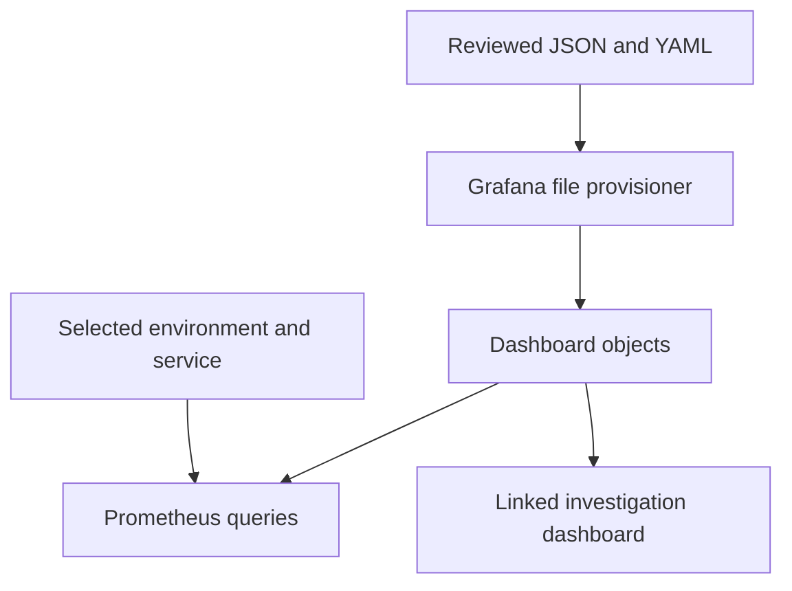

# Lab 22: Dashboard Variables, UX, Drilldowns, and Provisioning

## 1. Purpose and Learning Outcomes

**In Plain Language:** You will turn the two dashboards into consistent, reusable configuration. Add bounded selectors and links that carry investigation context, then make reviewed files the authoritative dashboard definitions. A reversible title change will show how provisioning updates the UI and why stable identifiers matter more than display names for navigation.

> **Primary Objective:** Make both dashboards reusable and reviewable through bounded selectors, consistent visual semantics, context-preserving links and file provisioning.

A dashboard's contract includes defaults, scope, units, no-data behavior and navigation. Manual copies can drift even when their original PromQL was correct.

This lab adds environment/service variables, meaningful health mappings and reproducible provisioning. It does not add request-ID variables, plugins, Grafana alert evaluation or another data source. Prometheus remains the metric owner.

## 2. Starting Point and Lab Map

Use this guide inside the complete application repository. Run commands from the repository root in Bash unless a step says otherwise. Work through the starting checks in order; they load the helpers and state this lab needs.

Read the explanation before each step, run one complete code block at a time, and compare the actual result with the stated expectation. Save commands, observations, explanations, and unexpected results in your notebook.

### Key Terms

| **Term**           | **Plain-Language Meaning**                                                       |
| ------------------ | -------------------------------------------------------------------------------- |
| Dashboard variable | A selected value substituted into a query under an explicit scope.               |
| UID                | A stable identifier used to find or link a dashboard independently of its title. |
| File ownership     | Provisioned source files control the runtime dashboard definition.               |

### Lab Map

The arrows show the flow or dependency being studied. Branches identify paths to compare; this is a conceptual map, not a captured runtime trace.


```mermaid
flowchart TD
    S["Reviewed JSON and YAML"] --> P["Grafana file provisioner"]
    P --> D["Dashboard objects"]
    V["Selected environment and service"] --> Q["Prometheus queries"]
    D --> Q
    D --> N["Linked investigation dashboard"]
```

## 3. Guided Walkthrough

### Step 01. Inherited State and Starting Checks

**What You Are Doing:** Verify both dashboards and save any UI-only work before changing ownership. Provisioning the same identifiers can replace runtime edits with file contents.

**Practical Walkthrough:** Check both dashboards and export any work that exists only in the UI before enabling provisioning. Files with the same dashboard identifiers can become authoritative and replace runtime edits. Preserve a recovery point so the ownership change is deliberate and reviewable.

Export any UI-only changes before activating file provisioning for the same dashboard UIDs. This preserves the known starting definition while ownership changes. Confirm the exports refer to the intended dashboards so a similarly named copy does not become the accidental recovery source.

```bash
source lab-notes/session.sh
source lab-notes/evidence.sh
source lab-notes/raw-metrics.sh
source lab-notes/metrics-session.sh
metrics_check
start_lab 22
```

Complete [Lab 21](Lab-21.md) first. Run commands from the repository root in the same Bash session. Keep the existing credentials, named volumes and checkpoint item. Both dashboards and their generated JSON must exist. Expect eight services and five healthy targets. Preserve any UI edits before transferring authority to files.

**Understanding the Result:** A healthy dashboard can still contain unsaved-to-file changes. Capture the current definition before changing who controls it.

### Step 02. Learning Objectives and Change Ownership

**What You Are Doing:** Treat defaults, units, missing data, and navigation as part of the dashboard contract. Reusability requires preserving meaning as well as reusing expressions.

**Practical Walkthrough:** Review variables, default selections, units, missing-data behavior, and cross-dashboard navigation as one user-facing contract. Reuse means a viewer can change context without changing the meaning of a measurement accidentally. Decide which source file owns each behavior before transforming definitions.

Decide which file owns variables, links, panel settings, and query definitions. Then review how a viewer's selection changes the displayed population. Reusability requires consistent meaning across selections, including explicit treatment of shared host resources that cannot be attributed solely to one selected service.

You will verify interpolated queries, distinguish shared-host scope from service scope, preserve time/variables during navigation, validate a file change and roll it back.

The lab map in Section 2 shows this relationship.

Provisioning is a configuration-change event. The file becomes authoritative; the Grafana database object is the runtime presentation. Changing a file must be observable and recoverable.

**Understanding the Result:** Consistent semantics matter as much as consistent colors. Defaults and links can silently change the investigated population.

### Step 03. Export the Current State

**What You Are Doing:** Export the current dashboard definitions as a recovery point. This makes the existing UI state reviewable before files become authoritative.

**Practical Walkthrough:** Export the current RED and dependency definitions using the provided workflow and retain their UIDs. These files preserve the known UI state before provisioning takes over. Inspect the exports sufficiently to confirm they belong to the expected dashboards rather than a similarly named copy.

Inspect each export's UID and title before transforming it. Preserve the original exports as the before-state, including intentional UI changes. The retained UID connects the provisioned update to the existing dashboard, so it is more important for identity than a display title alone.

```bash
GRAFANA_USER=$(dm exec -T grafana sh -c 'printf "%s" "$GF_SECURITY_ADMIN_USER"')
export GRAFANA_USER
gapi /api/dashboards/uid/lab20-red -fsS > "$LAB_DIR/red-before.json"
gapi /api/dashboards/uid/lab21-use -fsS > "$LAB_DIR/use-before.json"
cp lab-notes/compose.grafana.yaml "$LAB_DIR/grafana-overlay-before.yaml"
```

Use the current username if it differs from the initial environment value. The helper prompts for the password. Export before provisioning the same UIDs because file ownership can replace UI-only edits.

**Understanding the Result:** The UID is the stable identity used by links and updates. A title alone is not a reliable identity check.

### Step 04. Choose Bounded Variables and Honest Scope

**What You Are Doing:** Choose bounded environment and service selectors and document where they apply. A service selector must not imply that shared-host measurements belong exclusively to that service.

**Practical Walkthrough:** Define only the bounded environment and service choices supported by the lab. Identify which panels those choices should filter and which describe shared infrastructure. A service variable should not imply that host-wide resource activity belongs exclusively to that selected service.

Use only the documented bounded choices and inspect where each variable is applied. A service selection can filter application metrics while a host panel remains shared infrastructure. Make that scope visible so the viewer does not infer that all host CPU or disk activity belongs to the selected service.

Use environment and then service values discovered from FastAPI `up` series. Both are single-select without an unrestricted All option. A known down or idle target can still have an `up` series, whereas a successful-request series may not provide a useful selector.

The selectors affect application metrics. This stage has one VM and one configured database/cache; host/server panels deliberately retain that shared scope. A service variable does not make Node Exporter measurements attributable to that service.

Regex interpolation escapes selected values for regex matchers. Grafana macros are not PromQL; inspect their expanded form before comparing with Prometheus directly. See [Grafana variable syntax](https://grafana.com/docs/grafana/latest/visualizations/dashboards/variables/variable-syntax/).

**Understanding the Result:** Variable scope must match measurement scope. Shared-resource panels need honest descriptions even when displayed beside service-specific panels.

### Step 05. Transform the Dashboards

**What You Are Doing:** Transform both dashboards consistently while preserving their UIDs. Aligning health mappings, links, and units makes transitions between them easier to interpret.

**Practical Walkthrough:** Run the transformation over both exported definitions while preserving their UIDs. Review changes to units, health mappings, links, and variable references. The transformation should standardize interaction and presentation without silently redefining queries or disconnecting existing navigation.

Review the transformed JSON for unchanged UIDs, correct data-source references, and intended variable substitution. Compare query semantics as well as presentation changes. Standardizing links and units should preserve the original operational questions rather than silently changing aggregation or missing-data meaning.

```bash
cat > lab-notes/provision_dashboards.py <<'PYTHON'
"""Usage: provision_dashboards.py ENVIRONMENT SERVICE"""

import json, sys
from pathlib import Path

if len(sys.argv) != 3:
    raise SystemExit(__doc__)
environment, service = sys.argv[1:]
out = Path("config/grafana/learning/dashboards")
out.mkdir(parents=True, exist_ok=True)


def variable(name, label, query, value):
    return {
        "name": name,
        "label": label,
        "type": "query",
        "datasource": {"type": "prometheus", "uid": "prometheus"},
        "query": {"query": query, "refId": "variable-" + name},
        "definition": query,
        "refresh": 1,
        "sort": 1,
        "multi": False,
        "includeAll": False,
        "hide": 0,
        "options": [],
        "current": {"text": value, "value": value, "selected": True},
    }


for filename, other_uid, title in [
    ("lab20-red.json", "lab21-use", "Host and dependencies"),
    ("lab21-use.json", "lab20-red", "Application RED"),
]:
    d = json.loads((Path("lab-notes/grafana") / filename).read_text())
    d["templating"]["list"] = [
        variable(
            "environment",
            "Environment",
            'label_values(up{job="fastapi"}, environment)',
            environment,
        ),
        variable(
            "service",
            "Service",
            'label_values(up{job="fastapi",environment=~"$environment"}, service)',
            service,
        ),
    ]
    d["links"] = [
        {
            "title": title,
            "type": "link",
            "url": "/d/" + other_uid,
            "includeVars": True,
            "keepTime": True,
            "targetBlank": False,
        }
    ]
    for panel in d["panels"]:
        for target in panel["targets"]:
            target["expr"] = (
                target["expr"]
                .replace(
                    "environment=" + json.dumps(environment),
                    'environment=~"${environment:regex}"',
                )
                .replace(
                    "service=" + json.dumps(service), 'service=~"${service:regex}"'
                )
            )
        if panel["title"] in {
            "FastAPI scrape health",
            "Exporter scrape health",
            "Dependency observation paths",
        }:
            defaults = panel["fieldConfig"]["defaults"]
            defaults["color"] = {"mode": "thresholds"}
            defaults["thresholds"] = {
                "mode": "absolute",
                "steps": [
                    {"color": "red", "value": None},
                    {"color": "green", "value": 1},
                ],
            }
            defaults["mappings"] = [
                {
                    "type": "value",
                    "options": {
                        "0": {"text": "Down", "color": "red"},
                        "1": {"text": "Up", "color": "green"},
                    },
                }
            ]
            panel["options"]["colorMode"] = "value"
        if filename == "lab21-use.json":
            panel["description"] += (
                " Host/server panels describe the single VM and configured database; selectors scope application metrics only."
            )
    (out / filename).write_text(json.dumps(d, indent=2) + "\n")
    print(out / filename)
PYTHON
```

**Command Note:** `<<'PYTHON'` writes the following block literally until `PYTHON`. Quoting the delimiter prevents Bash from expanding `$variables` inside the generated file; creation and execution are separate steps.

```bash
python3 lab-notes/provision_dashboards.py "$LAB_ENVIRONMENT" "$LAB_SERVICE"
python3 -m json.tool config/grafana/learning/dashboards/lab20-red.json >/dev/null
python3 -m json.tool config/grafana/learning/dashboards/lab21-use.json >/dev/null
```

The output under `config/grafana/learning/` becomes reviewable source. Stable UIDs preserve links even if titles change. Binary health mappings mean 0 Down and 1 Up; no-data remains distinct. CPU and latency get no arbitrary red threshold before there is a defensible workload/objective meaning.

**Understanding the Result:** Compare the generated definitions with the recovery copies. Unexpected query or identity changes need investigation before activation.

### Step 06. Create the Provider and Activate Its Mounts

**What You Are Doing:** Create the provider and mounts, then activate the reviewed source. Confirm which source location the active helper uses so edits reach the running provisioner.

**Practical Walkthrough:** Create the provider configuration and mount the reviewed dashboard directory through the active stage helper. Confirm the running container sees that exact source path. Editing a similar directory elsewhere will not affect provisioning, even if its filenames match.

Match the provider's path with the directory actually mounted in the running Grafana container. Validate the model and apply the required container change. A provider file and dashboard JSON can both be correct on the host yet remain inactive if the service sees a different directory.

```bash
mkdir -p config/grafana/learning/provisioning/datasources config/grafana/learning/provisioning/dashboards
cp lab-notes/grafana/provisioning/datasources/datasources.yml config/grafana/learning/provisioning/datasources/datasources.yml
```

```bash
cat > config/grafana/learning/provisioning/dashboards/labs.yml <<'YAML'
apiVersion: 1
providers:
  - name: learning-metrics
    orgId: 1
    folder: Observability Learning
    type: file
    disableDeletion: false
    allowUiUpdates: false
    updateIntervalSeconds: 15
    options:
      path: /var/lib/grafana/dashboards
YAML
```

```bash
cat > config/grafana/learning/compose.yaml <<'YAML'
services:
  grafana:
    volumes:
      - ./config/grafana/learning/provisioning:/etc/grafana/provisioning:ro
      - ./config/grafana/learning/dashboards:/var/lib/grafana/dashboards:ro
YAML
```

```bash
cp config/grafana/learning/compose.yaml lab-notes/compose.grafana.yaml
find config/grafana/learning -type d -exec chmod 755 {} +
find config/grafana/learning -type f -exec chmod 644 {} +
dm config --quiet
record_change "activate_versioned_dashboards" planned
dm up -d --no-deps grafana
wait_grafana
sleep 20
gapi /api/dashboards/uid/lab20-red -fsS > "$LAB_DIR/red-provisioned.json"
gapi /api/dashboards/uid/lab21-use -fsS > "$LAB_DIR/use-provisioned.json"
jq -e '.meta.provisioned==true and .dashboard.uid=="lab20-red"' "$LAB_DIR/red-provisioned.json"
jq -e '.meta.provisioned==true and .dashboard.uid=="lab21-use"' "$LAB_DIR/use-provisioned.json"
metrics_check
```

The added files are operational configuration: two JSON dashboards, a provider, the existing validated data source and its stage overlay. The helper discovers the private active overlay copy; the reviewed source lives under `config/`.

`allowUiUpdates: false` establishes file authority. With `disableDeletion: false`, removing a source dashboard can remove its runtime object, so review deletions. A 15-second polling interval avoids depending on bind-mount filesystem events. See [Grafana provisioning](https://grafana.com/docs/grafana/latest/administration/provisioning/#dashboards).

If provisioning is still scanning, inspect logs and repeat the API read after another poll. Do not import a competing UI copy or delete the database volume.

**Understanding the Result:** Runtime mounts identify the authoritative files. Provider health and the loaded dashboard confirm the complete file-to-UI path.

### Step 07. Test Variables, Links and Panel UX

**What You Are Doing:** Test the expanded queries, variable selections, links, and time context. A working hyperlink is incomplete if it silently switches the investigation to another population or interval.

**Practical Walkthrough:** Test each variable choice and inspect the expanded query rather than only the variable menu. Follow links between dashboards and verify they retain the intended time range and population. A link that opens successfully can still lose the investigation's context.

Change each supported variable and inspect the expanded query, then follow the drilldown links. Check time bounds and context at the destination, not only whether it opens. A working link that drops the incident interval or selected service can send the investigation to unrelated evidence.

Open **Observability Learning**. Select environment/service and inspect the expanded query. Verify selected values are escaped correctly and recorded metrics still have no job/instance filter.

Choose an absolute UTC interval covering Lab 21. Follow **Host and dependencies** from RED and **Application RED** back. Verify `includeVars` and `keepTime` preserve investigation context. Use a panel's Explore action for deeper query inspection without constructing fragile hand-encoded URLs.

Review requests/second, bytes/second, seconds and fraction units. Keep route/device/mount legends readable. A numeric 0.05 should display as 5% only with a fraction unit. Current health uses instant queries; historical trends retain gaps.

The Python panel factory is this curriculum's reusable panel mechanism. It is not a Grafana Library Panel object. Try a local UI edit, observe the provisioned save restriction, then discard it or save a separate scratch copy.

**Understanding the Result:** Navigation correctness includes context preservation. Check selected values and absolute time after every cross-dashboard transition.

### Step 08. Predict and Test a Reversible Source Change

**What You Are Doing:** Change one harmless title and observe the provisioner's update, then restore it. The unchanged UID should preserve navigation throughout the experiment.

**Practical Walkthrough:** Make the supplied harmless title change in the source file, wait for provisioning, and observe the UI update. Restore the original title afterward and verify the unchanged UID throughout. This proves file ownership using a reversible visual change instead of altering measurement logic.

Keep the title edit harmless and reversible, then allow the provisioning interval to apply it. Verify the same UID before and after both the edit and restoration. This demonstrates which file controls the dashboard without modifying measurement expressions or introducing an unrelated data change.

```bash
cp config/grafana/learning/dashboards/lab20-red.json "$LAB_DIR/red-source-before.json"
(
  set -euo pipefail
  trap 'cp "$LAB_DIR/red-source-before.json" config/grafana/learning/dashboards/lab20-red.json; chmod 644 config/grafana/learning/dashboards/lab20-red.json' EXIT
  trap 'exit 130' INT
  trap 'exit 143' TERM
  python3 - <<'PYTHON'
import json
from pathlib import Path
p=Path("config/grafana/learning/dashboards/lab20-red.json");d=json.loads(p.read_text())
d["title"]="Lab 20 — FastAPI RED — provisioning check"
p.write_text(json.dumps(d,indent=2)+"\n")
PYTHON
  sleep 20
  gapi /api/dashboards/uid/lab20-red -fsS > "$LAB_DIR/title-probe.json"
  jq -e '.dashboard.title=="Lab 20 — FastAPI RED — provisioning check"' "$LAB_DIR/title-probe.json"
)
sleep 20
gapi /api/dashboards/uid/lab20-red -fsS > "$LAB_DIR/title-recovered.json"
jq -e '.dashboard.title=="Lab 20 — FastAPI RED" and .meta.provisioned==true' "$LAB_DIR/title-recovered.json"
record_change "dashboard_file_change_and_rollback_verified" completed
```

**Command Note:** `trap ... EXIT` schedules cleanup when that shell exits. Keep it in the same block as the fault; the explicit recovery checks afterward confirm that restoration actually succeeded.

Predict whether a restart is needed, whether the UID changes and whether links break. Expected: polling updates the title without a restart; the stable UID and links remain. The trap restores source even on failure.

The source JSON version is not an overwrite-protection mechanism for file provisioning. The authoritative file can supersede the database object; preserve intended changes in source control.

**Understanding the Result:** The observed update connects the active file to the dashboard. Restoring the title returns the intended presentation baseline.

### Step 09. Review the Version-Control Boundary

**What You Are Doing:** Review only the intended operational configuration for version control. Keep private evidence and credentials outside the staged changes.

**Practical Walkthrough:** Review the proposed version-control changes and stage only the intended operational definitions. Keep credentials, private evidence, and temporary exports outside the staged set. The saved configuration should be sufficient to reproduce the dashboard behavior without carrying unrelated local state.

Review the diff and staged paths before committing operational definitions. Include the reproducible provisioning source while excluding credentials and private run evidence. Confirm the active overlay matches the reviewed source so version control records the configuration actually used by the deployment.

If you started from a ZIP and have not initialized Git, run `git init` in the repository root first. Preserve the existing history when working in a Git checkout.

```bash
cmp config/grafana/learning/compose.yaml lab-notes/compose.grafana.yaml
git status --short -- config/grafana/learning
git add -- config/grafana/learning
git diff --cached --stat -- config/grafana/learning
git diff --cached --check -- config/grafana/learning
dm logs --no-color --since 10m grafana > "$LAB_DIR/grafana-provisioning.log"
metrics_check
```

Review staged configuration and commit using your normal workflow. Do not force-add the ignored notes directory: it contains private evidence and can include sensitive operational details. No credential belongs in these provisioning files.

**Understanding the Result:** Inspect the staged diff, not just the working directory. Reproducibility depends on the actual files included in the change.

## 4. Troubleshooting and Diagnosis

Start with the first unexpected result. Record the exact symptom, identify which component produced it, and use the checks below before repeating the experiment. After a fix, repeat the original check and confirm recovery.

### Troubleshooting

| **Symptom**                   | **Inspect**                             | **Recovery**                                           |
| ----------------------------- | --------------------------------------- | ------------------------------------------------------ |
| File ignored                  | JSON, permissions, provider path        | Fix the source and wait for polling                    |
| Old full-stack objects remain | Persistent database and active provider | Verify mount sources; preserve unrelated objects       |
| UI save blocked               | Provisioned ownership                   | Change source or use a separate scratch copy           |
| Variable has no values        | FastAPI target labels/source health     | Inspect `up`, not guessed labels                       |
| Host panels ignore service    | Documented shared scope                 | Expected; application panels must still be scoped      |
| Links lose time/selection     | UID and link fields                     | Keep matching variable names, includeVars and keepTime |

Restore a previously reviewed source to recover a broken rendering change. Validate JSON and preserve permissions; deleting Grafana storage is unnecessary.

## 5. Review and Practice

Answer the knowledge questions in your own words before reading the answer guide. For the scenario, name the evidence you would collect and the conclusion each observation would support.

### Knowledge Check

1. Why use up for selector inventory?
2. Why keep no-data distinct?
3. Why do host panels ignore service?

#### Answer Guide

1. Known targets can remain represented while down or idle.
2. Missing observations and errors are not healthy zeros.
3. The exporter observes the shared VM, not a per-service partition.

### Professional Scenario Exercise

A teammate loses a UI edit after a provisioning refresh. Explain the ownership model, recover the intended content from an export and propose a reviewable source change without changing dashboard identity.

## 6. Completion Checklist

Mark each item only after you can point to its result or evidence file. Complete any cleanup shown here before moving on.

### Observable Completion Criteria

- [ ] Both dashboards are provisioned under stable UIDs.
- [ ] Selectors and expanded queries are verified.
- [ ] Links preserve time and variables.
- [ ] A file change and rollback are observed.
- [ ] Only reviewed configuration is staged for version control.

## 7. Production Context and Next Lab

### Production Implications

Dashboards are operational code. Review expressions, labels, units, source ownership, defaults and deletion behavior together. Restrict editing/admin access and test schema compatibility during upgrades.

### End State and Transition

Keep eight services and the learning provider. [Lab 23](Lab-23.md) introduces Prometheus alert evaluation and its lifecycle.
