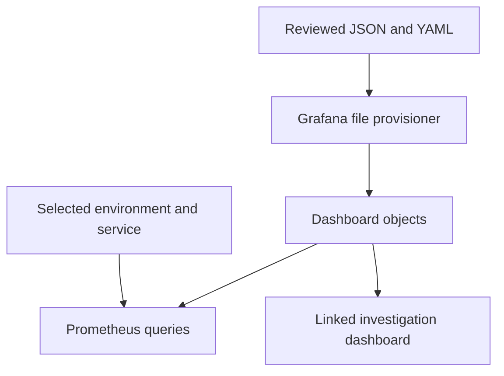

# Lab 22: Dashboard Variables, UX, Drilldowns, and Provisioning

## 1. Purpose and Learning Outcomes

**In Plain Language:** You will make the two dashboards consistent and easier to reuse. Add selectors with a limited set of values and links that keep the chosen service and time range. Then make reviewed files control the dashboard definitions. A temporary title change will show how provisioning updates Grafana and why links should use stable IDs rather than depend on titles.

> **Primary Objective:** Make both dashboards reusable and easy to review with limited selectors, consistent units and meanings, links that retain investigation context, and file-based provisioning.

A dashboard's definition includes defaults, selected data, units, missing-data behavior, and navigation. Manually copied dashboards can develop differences even when their original PromQL was correct.

You will add environment and service variables, clear health-value mappings, and repeatable provisioning. This lab adds no request-ID variables, plugins, Grafana alert evaluation, or extra data source. Prometheus remains responsible for the metrics.

## 2. Starting Point and Lab Map

Open the complete application repository before using this guide. Unless a step says otherwise, run commands in Bash from the repository's top-level folder. Follow the starting checks in order because later commands depend on the helper functions and running services they prepare.

Read each explanation before running its commands. Run one complete code block, check the result, and then continue. In your notebook, save the commands, what happened, why you think it happened, and anything that differed from the expected result.

### Key Terms

| **Term**           | **Explanation**                                                                  |
| ------------------ | -------------------------------------------------------------------------------- |
| Dashboard variable | A chosen value that Grafana substitutes into the intended query filters.         |
| UID                | A stable ID used to find or link a dashboard even if its title changes.          |
| File ownership     | The provisioned source files determine the dashboard definition Grafana runs.    |

### Lab Map

The arrows show how the parts connect and where a request can take different paths. Use this map to understand the design. It is not a recording of a request that actually ran.


```mermaid
flowchart TD
    S["Reviewed JSON and YAML"] --> P["Grafana file provisioner"]
    P --> D["Dashboard objects"]
    V["Selected environment and service"] --> Q["Prometheus queries"]
    D --> Q
    D --> N["Linked investigation dashboard"]
```

## 3. Guided Walkthrough

### Step 01. Inherited State and Starting Checks

**What You Are Doing:** Verify both dashboards and export changes that exist only in the UI. Provisioning the same IDs can replace those edits with the file contents.

**Practical Walkthrough:** Check the dashboards and save UI-only work before enabling provisioning. A file with the same dashboard ID can become the controlling definition. Keep a recovery copy so this change in ownership is intentional and can be reviewed.

Export UI-only changes before provisioning these dashboard UIDs. Check that each export belongs to the intended dashboard. A similarly named copy may have a different identity and would not be the right recovery source.

```bash
source lab-notes/session.sh
source lab-notes/evidence.sh
source lab-notes/raw-metrics.sh
source lab-notes/metrics-session.sh
metrics_check
start_lab 22
```

Complete [Lab 21](Lab-21.md) first. Use the repository root and the same Bash session. Keep credentials, named volumes, and the checkpoint item. Both dashboards and their generated JSON must exist, with eight services and five healthy targets. Save UI changes before giving files control of the dashboards.

**Understanding the Result:** A working dashboard may still contain edits that are absent from its source file. Capture the current definition before changing which copy controls it.

### Step 02. Learning Objectives and Change Ownership

**What You Are Doing:** Review defaults, units, missing data, and navigation as part of the dashboard's meaning. Reusing a query is useful only if the viewer can still interpret it correctly.

**Practical Walkthrough:** Review variables, defaults, units, missing-data handling, and links together. A viewer should be able to change selections without accidentally changing what a measurement means. Decide which source file controls each behavior before transforming the dashboards.

Identify the files responsible for variables, links, panel settings, and queries. Check how a selection changes the included data. Explain that shared host resources cannot be assigned entirely to one selected service, even when displayed beside its app metrics.

You will inspect queries after variables are substituted, distinguish shared-host and service-specific data, preserve time and selections when following links, and test and undo a source-file change.

The lab map in Section 2 shows this relationship.

Provisioning is a configuration change. The source file becomes the controlling definition, and Grafana's stored dashboard presents it at runtime. You should be able to observe a file change taking effect and restore the earlier version.

**Understanding the Result:** Consistent meaning matters as much as consistent colors. Defaults and links can quietly change which data you are investigating.

### Step 03. Export the Current State

**What You Are Doing:** Export the current dashboards as recovery copies. These capture the UI state before provisioned files take control.

**Practical Walkthrough:** Export the RED and dependency dashboards with the given workflow and keep their UIDs. Confirm that the files describe the intended dashboards, including any UI edits you want to preserve.

Check each export's UID and title before transforming it. Keep the original exports as the before-state. The UID connects a provisioned update to an existing dashboard, so the title alone is not enough to confirm identity.

```bash
GRAFANA_USER=$(dm exec -T grafana sh -c 'printf "%s" "$GF_SECURITY_ADMIN_USER"')
export GRAFANA_USER
gapi /api/dashboards/uid/lab20-red -fsS > "$LAB_DIR/red-before.json"
gapi /api/dashboards/uid/lab21-use -fsS > "$LAB_DIR/use-before.json"
cp lab-notes/compose.grafana.yaml "$LAB_DIR/grafana-overlay-before.yaml"
```

Use the current username if it differs from the original environment value. The helper asks for the password. Export before provisioning these UIDs because the source files can replace edits made only in the UI.

**Understanding the Result:** Links and updates use the UID as a stable identity. Do not rely on a display title alone to identify the dashboard.

### Step 04. Choose Bounded Variables and Honest Scope

**What You Are Doing:** Add limited environment and service selectors and explain which panels they affect. Selecting a service must not imply that all shared-host activity belongs to it.

**Practical Walkthrough:** Use only the environment and service choices supported by this lab. Identify which app panels they filter and which infrastructure panels remain shared. A selected service does not own all CPU, disk, or network activity on the VM.

Inspect where each variable is used. App measurements can be filtered by service while host panels still cover the entire VM. Make that difference visible so viewers do not assign every host change to the selected app.

Discover environment values and then service values from FastAPI `up` series. Use single selection without an unrestricted All option. A known target can still have an `up` series while down or idle, whereas a successful-request series may be missing and give an incomplete selector list.

These selectors filter app metrics. This stage has one VM and one configured database and cache, so host and server panels keep that shared scope. Choosing a service does not make Node Exporter's measurements specific to it.

Regex interpolation escapes the selected values before inserting them into regex matchers. Grafana macros are not PromQL syntax, so inspect the expanded expression before running it directly in Prometheus. See [Grafana variable syntax](https://grafana.com/docs/grafana/latest/visualizations/dashboards/variables/variable-syntax/).

**Understanding the Result:** Apply variables only where their scope fits the measurement. Shared-resource panels need clear descriptions beside service-specific panels.

### Step 05. Transform the Dashboards

**What You Are Doing:** Update both dashboards consistently while keeping their UIDs. Align health displays, units, and links so moving between them is easier to understand.

**Practical Walkthrough:** Transform the exported definitions and preserve their identities. Review health mappings, units, variable references, and navigation. These changes should make interaction consistent without quietly changing query meaning or breaking existing links.

Check the generated JSON for unchanged UIDs, correct sources, and intended variable substitution. Review the actual queries as well as the display. Standardization should preserve the original questions and treatment of aggregation and missing data.

```bash
cat > lab-notes/provision_dashboards.py <<'PYTHON'
"""Usage: provision_dashboards.py ENVIRONMENT SERVICE"""

import json, sys
from pathlib import Path

if len(sys.argv) != 3:
    raise SystemExit(__doc__)
environment, service = sys.argv[1:]
out = Path("config/grafana/learning/dashboards")
out.mkdir(parents=True, exist_ok=True)


def variable(name, label, query, value):
    return {
        "name": name,
        "label": label,
        "type": "query",
        "datasource": {"type": "prometheus", "uid": "prometheus"},
        "query": {"query": query, "refId": "variable-" + name},
        "definition": query,
        "refresh": 1,
        "sort": 1,
        "multi": False,
        "includeAll": False,
        "hide": 0,
        "options": [],
        "current": {"text": value, "value": value, "selected": True},
    }


for filename, other_uid, title in [
    ("lab20-red.json", "lab21-use", "Host and dependencies"),
    ("lab21-use.json", "lab20-red", "Application RED"),
]:
    d = json.loads((Path("lab-notes/grafana") / filename).read_text())
    d["templating"]["list"] = [
        variable(
            "environment",
            "Environment",
            'label_values(up{job="fastapi"}, environment)',
            environment,
        ),
        variable(
            "service",
            "Service",
            'label_values(up{job="fastapi",environment=~"$environment"}, service)',
            service,
        ),
    ]
    d["links"] = [
        {
            "title": title,
            "type": "link",
            "url": "/d/" + other_uid,
            "includeVars": True,
            "keepTime": True,
            "targetBlank": False,
        }
    ]
    for panel in d["panels"]:
        for target in panel["targets"]:
            target["expr"] = (
                target["expr"]
                .replace(
                    "environment=" + json.dumps(environment),
                    'environment=~"${environment:regex}"',
                )
                .replace(
                    "service=" + json.dumps(service), 'service=~"${service:regex}"'
                )
            )
        if panel["title"] in {
            "FastAPI scrape health",
            "Exporter scrape health",
            "Dependency observation paths",
        }:
            defaults = panel["fieldConfig"]["defaults"]
            defaults["color"] = {"mode": "thresholds"}
            defaults["thresholds"] = {
                "mode": "absolute",
                "steps": [
                    {"color": "red", "value": None},
                    {"color": "green", "value": 1},
                ],
            }
            defaults["mappings"] = [
                {
                    "type": "value",
                    "options": {
                        "0": {"text": "Down", "color": "red"},
                        "1": {"text": "Up", "color": "green"},
                    },
                }
            ]
            panel["options"]["colorMode"] = "value"
        if filename == "lab21-use.json":
            panel["description"] += (
                " Host/server panels describe the single VM and configured database; selectors scope application metrics only."
            )
    (out / filename).write_text(json.dumps(d, indent=2) + "\n")
    print(out / filename)
PYTHON
```

**Command Note:** `<<'PYTHON'` writes the following text literally until the closing `PYTHON`. Quoting the delimiter prevents Bash from expanding `$variables` in the file. Creating the file and executing it are separate actions.

```bash
python3 lab-notes/provision_dashboards.py "$LAB_ENVIRONMENT" "$LAB_SERVICE"
python3 -m json.tool config/grafana/learning/dashboards/lab20-red.json >/dev/null
python3 -m json.tool config/grafana/learning/dashboards/lab21-use.json >/dev/null
```

Files under `config/grafana/learning/` become the reviewable source. Stable UIDs keep links working when titles change. Binary health values map 0 to Down and 1 to Up, while no-data stays separate. CPU and latency receive no arbitrary red thresholds before you have a workload or objective that gives them meaning.

**Understanding the Result:** Compare generated files with the saved recovery copies. Investigate unexpected query or identity changes before activating them.

### Step 06. Create the Provider and Activate Its Mounts

**What You Are Doing:** Create the dashboard provider and mounts, then activate the reviewed files. Confirm the active helper uses the source location you intend to edit.

**Practical Walkthrough:** Configure the provider and mount the reviewed directory using the stage helper. Verify the running container sees that exact path. Editing another directory with similarly named files will not update the active dashboards.

Match the provider path with the directory mounted inside Grafana. Validate the combined configuration and apply the required container change. Correct files on the host can remain inactive if Grafana is reading a different directory.

```bash
mkdir -p config/grafana/learning/provisioning/datasources config/grafana/learning/provisioning/dashboards
cp lab-notes/grafana/provisioning/datasources/datasources.yml config/grafana/learning/provisioning/datasources/datasources.yml
```

```bash
cat > config/grafana/learning/provisioning/dashboards/labs.yml <<'YAML'
apiVersion: 1
providers:
  - name: learning-metrics
    orgId: 1
    folder: Observability Learning
    type: file
    disableDeletion: false
    allowUiUpdates: false
    updateIntervalSeconds: 15
    options:
      path: /var/lib/grafana/dashboards
YAML
```

```bash
cat > config/grafana/learning/compose.yaml <<'YAML'
services:
  grafana:
    volumes:
      - ./config/grafana/learning/provisioning:/etc/grafana/provisioning:ro
      - ./config/grafana/learning/dashboards:/var/lib/grafana/dashboards:ro
YAML
```

```bash
cp config/grafana/learning/compose.yaml lab-notes/compose.grafana.yaml
find config/grafana/learning -type d -exec chmod 755 {} +
find config/grafana/learning -type f -exec chmod 644 {} +
dm config --quiet
record_change "activate_versioned_dashboards" planned
dm up -d --no-deps grafana
wait_grafana
sleep 20
gapi /api/dashboards/uid/lab20-red -fsS > "$LAB_DIR/red-provisioned.json"
gapi /api/dashboards/uid/lab21-use -fsS > "$LAB_DIR/use-provisioned.json"
jq -e '.meta.provisioned==true and .dashboard.uid=="lab20-red"' "$LAB_DIR/red-provisioned.json"
jq -e '.meta.provisioned==true and .dashboard.uid=="lab21-use"' "$LAB_DIR/use-provisioned.json"
metrics_check
```

These operational files include two dashboard JSON files, a provider, the existing validated data source, and the stage overlay. The helper finds the private active overlay copy, while the reviewed source stays under `config/`.

`allowUiUpdates: false` makes the files authoritative. With `disableDeletion: false`, removing a source dashboard can also remove its runtime object, so review deletions carefully. Polling every 15 seconds avoids reliance on bind-mount file events. See [Grafana provisioning](https://grafana.com/docs/grafana/latest/administration/provisioning/#dashboards).

If provisioning has not finished scanning, inspect the logs and repeat the API read after the next poll. Do not create a competing UI import or delete the Grafana database volume.

**Understanding the Result:** The runtime mounts show which files actually control the dashboards. A healthy provider and the loaded dashboard confirm the full path from file to UI.

### Step 07. Test Variables, Links and Panel UX

**What You Are Doing:** Test variable choices, expanded queries, links, and time ranges. A link must keep the investigation's context, not merely open a page.

**Practical Walkthrough:** Try each variable choice and inspect the resulting query. Follow dashboard links and confirm that the destination keeps the intended time window and selected data. A successful page load can still lose important context.

Change each supported variable, inspect its expanded query, and follow the drilldowns. Check the destination's time bounds and selections. A link that drops the incident period or service can lead you to unrelated evidence.

Open **Observability Learning**. Select environment and service, then inspect the expanded query. Confirm correct escaping and check that recorded-metric queries still do not filter by removed job or instance labels.

Choose an absolute UTC interval covering Lab 21. Follow **Host and dependencies** from RED, then **Application RED** back. Check that `includeVars` and `keepTime` retain the selections and time window. Use the panel's Explore action for deeper inspection instead of building fragile URLs by hand.

Check requests per second, bytes per second, seconds, and fraction units. Keep route, device, and mount legends readable. A value of 0.05 should appear as 5% only with a fraction unit. Current health uses instant queries, while historical trends keep gaps visible.

The Python factory is the course's reusable panel mechanism; it is not a Grafana Library Panel object. Try a local UI edit to see the provisioned-save restriction. Then discard it or save a separate scratch copy.

**Understanding the Result:** Correct navigation preserves context. Check the selected values and absolute time after each move between dashboards.

### Step 08. Predict and Test a Reversible Source Change

**What You Are Doing:** Temporarily change a harmless title in the source file, observe the update, and restore it. The unchanged UID should keep navigation working throughout.

**Practical Walkthrough:** Apply the supplied title edit, wait for provisioning, and check the UI. Restore the original title and verify the UID stayed the same. This demonstrates file ownership without changing measurement logic.

Keep the title change reversible and allow a polling interval for it to appear. Verify the same UID before the change, after the change, and after restoration. The experiment identifies the controlling file without altering the queries or data.

```bash
cp config/grafana/learning/dashboards/lab20-red.json "$LAB_DIR/red-source-before.json"
(
  set -euo pipefail
  trap 'cp "$LAB_DIR/red-source-before.json" config/grafana/learning/dashboards/lab20-red.json; chmod 644 config/grafana/learning/dashboards/lab20-red.json' EXIT
  trap 'exit 130' INT
  trap 'exit 143' TERM
  python3 - <<'PYTHON'
import json
from pathlib import Path
p=Path("config/grafana/learning/dashboards/lab20-red.json");d=json.loads(p.read_text())
d["title"]="Lab 20 — FastAPI RED — provisioning check"
p.write_text(json.dumps(d,indent=2)+"\n")
PYTHON
  sleep 20
  gapi /api/dashboards/uid/lab20-red -fsS > "$LAB_DIR/title-probe.json"
  jq -e '.dashboard.title=="Lab 20 — FastAPI RED — provisioning check"' "$LAB_DIR/title-probe.json"
)
sleep 20
gapi /api/dashboards/uid/lab20-red -fsS > "$LAB_DIR/title-recovered.json"
jq -e '.dashboard.title=="Lab 20 — FastAPI RED" and .meta.provisioned==true' "$LAB_DIR/title-recovered.json"
record_change "dashboard_file_change_and_rollback_verified" completed
```

**Command Note:** `trap ... EXIT` arranges cleanup when the shell exits. Keep it in the same block as the experiment. The later recovery checks confirm that restoration worked.

Predict whether Grafana needs a restart, whether the UID changes, and whether links break. Expect the poll to update the title without restarting, while the UID and links remain stable. The trap restores the source even if the block fails.

The source JSON version does not protect a provisioned dashboard from being overwritten by its file. The authoritative file can replace the stored object, so keep intended changes in version-controlled source.

**Understanding the Result:** Seeing the update confirms which active file controls the dashboard. Restoring the title returns it to the intended presentation.

### Step 09. Review the Version-Control Boundary

**What You Are Doing:** Review the operational files intended for version control. Keep credentials, private evidence, and temporary exports out of the staged changes.

**Practical Walkthrough:** Stage only the reviewed definitions needed to reproduce dashboard behavior. Keep secrets and unrelated local state separate. Review the proposed changes rather than assuming every modified file belongs in the commit.

Inspect both the diff and the staged paths. Include reproducible provisioning source, but exclude credentials and private run evidence. Check that the active overlay matches the reviewed source so Git records what the deployment actually uses.

If you started from a ZIP and have no Git repository yet, run `git init` at the repository root. If this is already a checkout, preserve its existing history.

```bash
cmp config/grafana/learning/compose.yaml lab-notes/compose.grafana.yaml
git status --short -- config/grafana/learning
git add -- config/grafana/learning
git diff --cached --stat -- config/grafana/learning
git diff --cached --check -- config/grafana/learning
dm logs --no-color --since 10m grafana > "$LAB_DIR/grafana-provisioning.log"
metrics_check
```

Review the staged configuration and commit through your normal workflow. Do not force-add the ignored notes directory, which holds private evidence and may contain sensitive operational details. Provisioning files must contain no credentials.

**Understanding the Result:** Review the staged diff, not only files in the working directory. Reproducing the change depends on what is actually committed.

## 4. Troubleshooting and Diagnosis

Begin with the first result that differed from your prediction. Save the exact error or symptom and identify which service or command produced it. Use the checks below, make the needed fix, and repeat the original check to confirm the problem is resolved.

### Troubleshooting

| **Symptom**                   | **Inspect**                                   | **Recovery**                                                    |
| ----------------------------- | --------------------------------------------- | --------------------------------------------------------------- |
| File ignored                  | JSON validity, permissions, and provider path | Fix the source and wait for the next poll                       |
| Old full-stack objects remain | Stored database objects and active provider   | Check mount sources and preserve unrelated objects              |
| UI save blocked               | Whether provisioning owns the dashboard       | Edit the source or save a separate scratch copy                 |
| Variable has no values        | FastAPI labels and source health              | Inspect actual `up` labels instead of guessing                  |
| Host panels ignore service    | Their documented shared-host scope            | This is expected; app panels should still be filtered           |
| Links lose time/selection     | Dashboard UID and link settings               | Keep variable names consistent and use includeVars and keepTime |

To undo a broken display change, restore a previously reviewed source file. Validate its JSON and keep correct permissions. There is no need to delete Grafana storage.

## 5. Review and Practice

Answer the questions in your own words before reading the answers. For the scenario, say what you would inspect and exactly what each result would tell you.

### Knowledge Check

1. Why use up for selector inventory?
2. Why keep no-data distinct?
3. Why do host panels ignore service?

#### Answer Guide

1. Known targets can remain represented by up even when they are down or have no traffic.
2. Missing measurements and query errors do not mean a healthy measured zero.
3. Node Exporter measures the shared VM, not a separate slice belonging to one service.

### Professional Scenario Exercise

A teammate's UI edit disappears after a provisioning refresh. Explain which copy controls the dashboard, recover the intended content from an export, and propose a source change that can be reviewed while keeping the same dashboard identity.

## 6. Completion Checklist

Tick an item only when you can show its result or saved evidence. Finish the cleanup instructions before starting the next lab.

### Observable Completion Criteria

- [ ] Both dashboards are provisioned with stable UIDs.
- [ ] I have checked variable selections and the resulting expanded queries.
- [ ] Links keep the chosen time range and variable values.
- [ ] I have observed a source-file update and its rollback.
- [ ] Only reviewed operational configuration is staged for version control.

## 7. Production Context and Next Lab

### Production Implications

Treat dashboards as operational code. Review queries, labels, units, source ownership, defaults, and deletion behavior together. Restrict editor and administrator access, and check schema compatibility during upgrades.

### End State and Transition

Keep the eight services and the learning provider. [Lab 23](Lab-23.md) introduces Prometheus alert evaluation and the stages of an alert's lifecycle.
