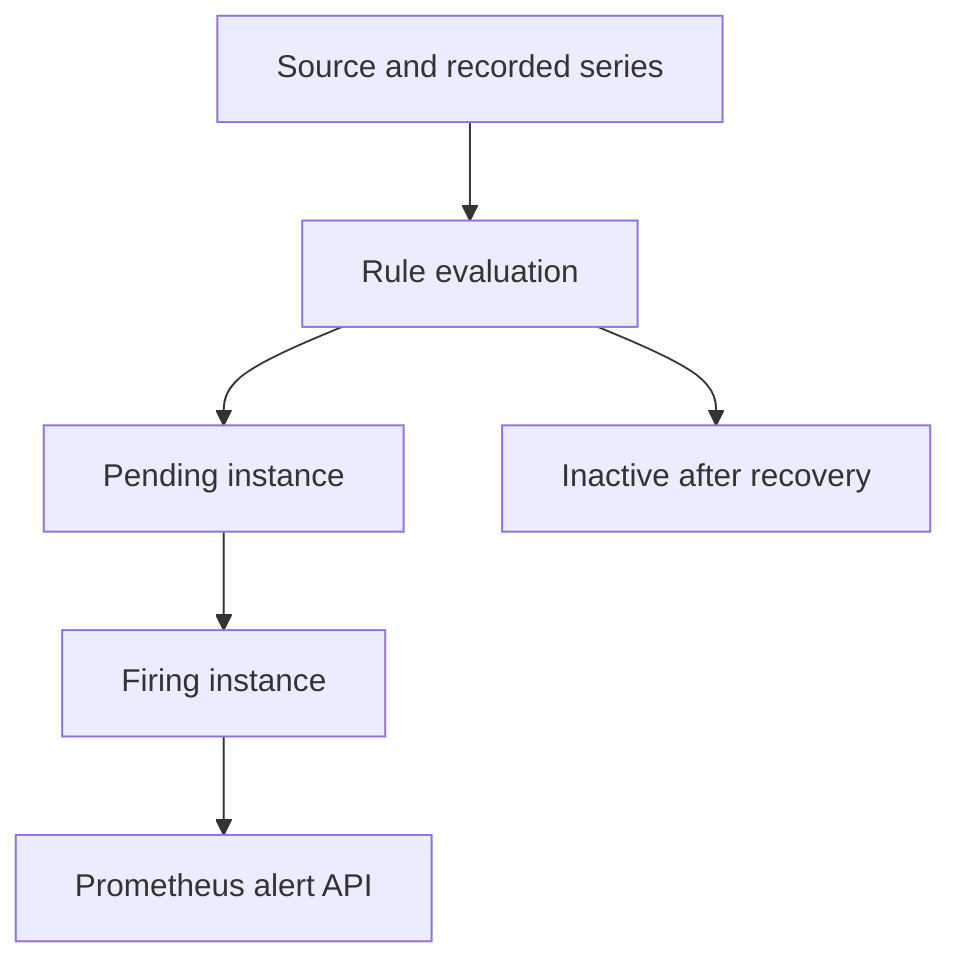

# Lab 23: Prometheus Alert Rule Lifecycle

## Purpose and Scope

> **Primary Objective:** Implement alert conditions, test hold times, observe pending/firing transitions and prove recovery separately from notification delivery.

An alert is a state machine evaluated over time-series data. A threshold crossing does not by itself tell you when an operator will receive a notification.

This lab adds five Prometheus rules and deterministic tests, then sustains a short Redis outage until a warning fires. Alertmanager is introduced in Lab 24. The local thresholds and traffic floors are teaching choices, not customer SLOs.

## 1. Inherited State and Starting Checks

```bash
source lab-notes/session.sh
source lab-notes/evidence.sh
source lab-notes/raw-metrics.sh
source lab-notes/metrics-session.sh
metrics_check
start_lab 23
```

Complete [Lab 22](Lab-22.md) first. Run commands from the repository root in the same Bash session. Keep the existing credentials, named volumes and checkpoint item. Expect eight services, five scrape jobs, six recording rules and both provisioned dashboards. Let the two-minute window move beyond previous failures before beginning.

## 2. Learning Objectives and Evaluation Boundaries

You will inspect rule health separately from alert state, explain label identity, test `for` timing, distinguish absent input from false conditions, and compare a cache warning with successful business readiness.



Configuration acceptance, first true evaluation, pending-to-firing transition and dependency recovery are distinct events. Capture their timestamps rather than assuming the Docker stop time is the start of the alert hold period.

## 3. Understand Identity, Hold Time and Resolution

Each vector element returned by an alert expression creates an active identity defined by its labels. Changing a label can create a new identity and restart pending time. Keep changing descriptive information in annotations.

`for` starts at the first active evaluation and requires the identity to remain active at subsequent evaluations. Dependency observation, scrape timing and the 15-second evaluation cadence add delay.

The rule API exposes inactive, pending and firing. After recovery the rule returns to inactive; “resolved” describes the recovery transition and notification state rather than a permanent fourth rule state. See [Prometheus alerting rules](https://prometheus.io/docs/prometheus/latest/configuration/alerting_rules/).

## 4. Define the Rule Contract

| Alert | Evidence | Hold | Meaning |
|---|---|---|---|
| FastAPIScrapeUnavailable | `up=0` | 45 s | Investigate the scrape path; business failure is not yet proven |
| PostgresUnavailable | Application database observation | 45 s | Required dependency unavailable |
| RedisDegraded | Application cache observation | 1 min | Optional cache unavailable; verify fallback |
| FastAPIHighServerErrorRatio | API 5xx fraction >10% and traffic >0.05/s | 1 min | Sustained server failures above a learning floor |
| FastAPIHighLatency | API p95 >350 ms and observations >0.1/s | 2 min | Sustained slow completed responses |

The API-prefix scope includes demo traffic. A traffic floor reduces sparse noise but can hide a real low-volume problem. These are not yet the Items SLO definitions.

A disappeared discovery target does not yield `up=0`. Inventory/missing-series detection is a separate requirement; revisit Lab 11 before claiming this rule covers it.

## 5. Install the Complete Rule and Prometheus Files

```bash
cat > lab-notes/prometheus/application-alerts.yml <<'YAML'
groups:
- name: learning-application-alerts
  interval: 15s
  rules:
  - alert: FastAPIScrapeUnavailable
    expr: up{job="fastapi"} == 0
    for: 45s
    labels:
      severity: critical
      team: platform
    annotations:
      summary: FastAPI scrape unavailable
      description: Check target and network before assuming business unavailability. Service={{ $labels.service
        }}, environment={{ $labels.environment }}.
      runbook: docs/operations.md
  - alert: PostgresUnavailable
    expr: application_dependency_up{job="fastapi",dependency="postgres"} == 0
    for: 45s
    labels:
      severity: critical
      team: platform
    annotations:
      summary: Required PostgreSQL dependency unavailable
      description: Check readiness and the application database connection path. Service={{ $labels.service }},
        environment={{ $labels.environment }}.
      runbook: docs/operations.md
  - alert: RedisDegraded
    expr: application_dependency_up{job="fastapi",dependency="redis"} == 0
    for: 1m
    labels:
      severity: warning
      team: platform
    annotations:
      summary: Application cache degraded
      description: Verify PostgreSQL fallback and cache recovery; the API may remain ready. Service={{ $labels.service
        }}, environment={{ $labels.environment }}.
      runbook: docs/operations.md
  - alert: FastAPIHighServerErrorRatio
    expr: (sum by (environment, service) (service_route:application_http_server_errors:rate2m{route=~"/api/v1/.*"})
      / sum by (environment, service) (service_route:application_http_requests:rate2m{route=~"/api/v1/.*"}) > 0.10)
      and on (environment, service) (sum by (environment, service) (service_route:application_http_requests:rate2m{route=~"/api/v1/.*"})
      > 0.05)
    for: 1m
    labels:
      severity: critical
      team: platform
    annotations:
      summary: Sustained API server-error fraction
      description: More than 10% 5xx above the learning traffic floor; inspect routes and dependencies. Service={{
        $labels.service }}, environment={{ $labels.environment }}.
      runbook: docs/operations.md
  - alert: FastAPIHighLatency
    expr: (histogram_quantile(0.95, sum by (environment, service, le) (service_route:application_http_request_duration_seconds_bucket:rate2m{route=~"/api/v1/.*"}))
      > 0.35) and on (environment, service) (sum by (environment, service) (service_route:application_http_request_duration_seconds_count:rate2m{route=~"/api/v1/.*"})
      > 0.10)
    for: 2m
    labels:
      severity: warning
      team: platform
    annotations:
      summary: Sustained API p95 above learning threshold
      description: p95 exceeds 350 ms above the learning observation floor; inspect routes and resource pressure.
        Service={{ $labels.service }}, environment={{ $labels.environment }}.
      runbook: docs/operations.md
YAML
```

```bash
cat > lab-notes/prometheus/prometheus.yml <<'YAML'
global:
  scrape_interval: 15s
  scrape_timeout: 5s
  evaluation_interval: 15s
scrape_configs:
- job_name: fastapi
  metrics_path: /metrics
  file_sd_configs:
  - files:
    - /etc/prometheus/labs/app-targets.json
    refresh_interval: 5s
  sample_limit: 5000
  label_limit: 12
  label_name_length_limit: 80
  label_value_length_limit: 128
  body_size_limit: 2MB
  relabel_configs:
  - source_labels:
    - monitoring
    regex: disabled
    action: drop
  - source_labels:
    - environment
    target_label: environment
    action: lowercase
  - target_label: telemetry_role
    replacement: application
  - regex: monitoring|lab_discovery_note
    action: labeldrop
  metric_relabel_configs:
  - source_labels:
    - __name__
    regex: application_.*_created
    action: drop
  - source_labels:
    - request_id
    regex: .+
    action: drop
  - source_labels:
    - event_id
    regex: .+
    action: drop
  - source_labels:
    - item_id
    regex: .+
    action: drop
  - source_labels:
    - user_id
    regex: .+
    action: drop
  - source_labels:
    - trace_id
    regex: .+
    action: drop
- job_name: prometheus
  static_configs:
  - targets:
    - prometheus:9090
- job_name: node
  static_configs:
  - targets:
    - host-metrics:9100
- job_name: postgres
  static_configs:
  - targets:
    - postgres-exporter:9187
- job_name: redis
  static_configs:
  - targets:
    - redis-exporter:9121
rule_files:
- /etc/prometheus/labs/recording-rules.yml
- /etc/prometheus/labs/application-alerts.yml
YAML
```

The full configuration retains the five jobs, ingestion guardrails and recording rules. Each alert has severity/team labels and useful summary, description and repository-relative runbook metadata.

Use a filtering comparison, not `> bool`, for these expressions. A false boolean comparison retains an element with numeric zero, and element presence activates an alert. Do not use a broad zero fallback to hide missing evidence.

## 6. Install and Run Timing Tests

```bash
cat > lab-notes/prometheus/alert-tests.yml <<'YAML'
rule_files:
- application-alerts.yml
evaluation_interval: 15s
tests:
- name: redis pending firing and recovery
  interval: 15s
  input_series:
  - series: application_dependency_up{dependency="redis",environment="local",service="fastapi-items",job="fastapi",instance="app:8000"}
    values: 1 0 0 0 0 0 1 1
  alert_rule_test:
  - eval_time: 1m
    alertname: RedisDegraded
    exp_alerts: []
  - eval_time: 1m15s
    alertname: RedisDegraded
    exp_alerts:
    - exp_labels:
        dependency: redis
        environment: local
        service: fastapi-items
        job: fastapi
        instance: app:8000
        severity: warning
        team: platform
      exp_annotations:
        summary: Application cache degraded
        description: Verify PostgreSQL fallback and cache recovery; the API may remain ready. Service=fastapi-items,
          environment=local.
        runbook: docs/operations.md
  - eval_time: 1m30s
    alertname: RedisDegraded
    exp_alerts: []
  promql_expr_test:
  - expr: ALERTS{alertname="RedisDegraded",alertstate="pending"}
    eval_time: 30s
    exp_samples:
    - labels: ALERTS{alertname="RedisDegraded",alertstate="pending",dependency="redis",environment="local",service="fastapi-items",job="fastapi",instance="app:8000",severity="warning",team="platform"}
      value: 1
- name: sustained error ratio
  interval: 15s
  input_series:
  - series: service_route:application_http_requests:rate2m{environment="local",service="fastapi-items",route="/api/v1/items",method="GET"}
    values: 0.2+0x8
  - series: service_route:application_http_server_errors:rate2m{environment="local",service="fastapi-items",route="/api/v1/items",method="GET"}
    values: 0.04+0x8
  alert_rule_test:
  - eval_time: 1m
    alertname: FastAPIHighServerErrorRatio
    exp_alerts:
    - exp_labels:
        environment: local
        service: fastapi-items
        severity: critical
        team: platform
      exp_annotations:
        summary: Sustained API server-error fraction
        description: More than 10% 5xx above the learning traffic floor; inspect routes and dependencies. Service=fastapi-items,
          environment=local.
        runbook: docs/operations.md
- name: traffic floor suppresses sparse failures
  interval: 15s
  input_series:
  - series: service_route:application_http_requests:rate2m{environment="local",service="fastapi-items",route="/api/v1/items",method="GET"}
    values: 0.01+0x8
  - series: service_route:application_http_server_errors:rate2m{environment="local",service="fastapi-items",route="/api/v1/items",method="GET"}
    values: 0.01+0x8
  alert_rule_test:
  - eval_time: 1m
    alertname: FastAPIHighServerErrorRatio
    exp_alerts: []
YAML
```

```bash
chmod 644 lab-notes/prometheus/application-alerts.yml lab-notes/prometheus/alert-tests.yml lab-notes/prometheus/prometheus.yml
dm run --rm -T --no-deps --entrypoint promtool prometheus check rules /etc/prometheus/labs/application-alerts.yml
dm run --rm -T --no-deps --entrypoint promtool prometheus test rules /etc/prometheus/labs/alert-tests.yml
```

Predict the fixture before running it: Redis turns unhealthy at 15 s, is pending at 30 s, is not yet firing at 60 s, fires at 75 s and recovers at 90 s. The ratio cases test sustained errors and the low-traffic floor.

Recorded-rate inputs intentionally isolate alert semantics; Lab 16 tested those recordings from raw counters. These tests do not validate Docker networking or delivery. See [Prometheus rule tests](https://prometheus.io/docs/prometheus/latest/configuration/unit_testing_rules/).

## 7. Load the Rules and Verify Health

```bash
cat > lab-notes/alert-session.sh <<'BASH'
# Source after metrics-session.sh.
wait_rule_state() {
  local name="$1" state="$2" attempt
  for attempt in {1..180}; do
    if api -fsS "$PROM_URL/api/v1/rules?type=alert" | jq -e --arg name "$name" --arg state "$state" \
      '[.data.groups[].rules[]|select(.name==$name)] as $r | ($r|length)>0 and all($r[]; .state==$state and .health=="ok")' >/dev/null; then return 0; fi
    sleep 1
  done
  printf 'Rule state deadline: %s / %s\n' "$name" "$state" >&2
  return 1
}
capture_alert_state() {
  api -fsS "$PROM_URL/api/v1/rules?type=alert" > "$LAB_DIR/$1-rules.json"
  api -fsS "$PROM_URL/api/v1/alerts" > "$LAB_DIR/$1-alerts.json"
}
BASH
```

```bash
source lab-notes/alert-session.sh
record_change "load_five_application_alerts" planned
reload_prometheus
wait_rule_state RedisDegraded inactive
capture_alert_state loaded
jq '.data.groups[].rules[] | {name,state,health,lastError}' "$LAB_DIR/loaded-rules.json"
pq 'prometheus_config_last_reload_successful' > "$LAB_DIR/reload-success.json"
```

Open Prometheus **Alerts** and inspect the five names/durations. A successful signal submission does not prove the expected rules loaded; the API and reload-success metric provide that evidence. Inactive with healthy evaluation differs from a failed evaluation.

## 8. Predict and Observe the Real Lifecycle

```bash
(
  set -euo pipefail
  trap 'dm start redis >/dev/null' EXIT
  trap 'exit 130' INT
  trap 'exit 143' TERM
  record_change "alert_lifecycle_redis_stop" planned
  dm stop redis
  api -fsS "$APP_URL/health/ready" > "$LAB_DIR/degraded-readiness.json"
  wait_rule_state RedisDegraded pending
  capture_alert_state pending
  date -u +%FT%TZ > "$LAB_DIR/pending-observed-at.txt"
  pq 'ALERTS{alertname="RedisDegraded",alertstate="pending"}' > "$LAB_DIR/pending-series.json"
  api -fsS "$APP_URL/api/v1/items?limit=1" > "$LAB_DIR/business-while-pending.json"
  wait_rule_state RedisDegraded firing
  capture_alert_state firing
  date -u +%FT%TZ > "$LAB_DIR/firing-observed-at.txt"
  jq '.data.alerts[] | select(.labels.alertname=="RedisDegraded") | {labels,state,activeAt,annotations}' "$LAB_DIR/firing-alerts.json"
)
wait_ready
wait_metric 'redis_up{job="redis"}' 1
wait_rule_state RedisDegraded inactive
capture_alert_state recovered
metrics_check
capture_app_logs
record_change "redis_recovered_and_warning_inactive" completed
```

Write the expected sequence before running it. The bounded helper allows three minutes, not an endless wait. Do not extend the deadline without inspecting source observation and rule health.

Readiness remains HTTP 200 with cache degradation, and uncached list reads still work. The alert's `activeAt` can precede the moment your polling command observed it. The trap starts Redis even after a failed check; verify recovery explicitly afterward.

## 9. Compare Current and Historical State

```bash
pq 'ALERTS{alertname="RedisDegraded"}' > "$LAB_DIR/current-alert-series.json"
pq 'increase(prometheus_rule_evaluation_failures_total[5m])' > "$LAB_DIR/rule-failures.json"
api -fsS "$APP_URL/health/ready" > "$LAB_DIR/readiness-recovered.json"
```

The recovered instant alert query should be empty for this identity. A historical range still shows pending/firing samples. Lifetime cache errors retain the incident history; they do not return to zero.

Correlate the warning with Redis/server observations, readiness and request logs. Successful fallback does not make the cache warning false: the warning describes the degraded optimization path.

## 10. Prove a Wrong Timing Expectation Fails

```bash
python3 - <<'PYTHON'
from pathlib import Path
s=Path("lab-notes/prometheus/alert-tests.yml").read_text()
assert s.count("eval_time: 1m15s")==1
Path("lab-notes/prometheus/alert-tests-negative.yml").write_text(s.replace("eval_time: 1m15s","eval_time: 1m"))
PYTHON
chmod 644 lab-notes/prometheus/alert-tests-negative.yml
if dm run --rm -T --no-deps --entrypoint promtool prometheus test rules /etc/prometheus/labs/alert-tests-negative.yml \
  > "$LAB_DIR/negative-test.txt" 2>&1; then
  printf 'Unexpected pass; inspect fixture\n' >&2
else
  printf 'Expected negative-test failure captured\n'
fi
rm lab-notes/prometheus/alert-tests-negative.yml
```

Read the output to confirm an assertion failure, not a missing file or syntax failure. At 60 s the condition has existed for only 45 s. The temporary fixture is never referenced by the runtime rule list.

## 11. Troubleshooting

| Symptom | Distinction | Next action |
|---|---|---|
| Rule absent | Configuration loading | Inspect path, promtool result, reload metric and logs |
| Pending repeatedly resets | Identity or condition instability | Inspect changing labels and full-window samples |
| Stopped Redis but no warning | Application observation/scrape path | Read readiness, dependency metric and target state |
| Fires sooner than expected | Earlier active state | Inspect activeAt and loaded duration |
| Historical graph still shows firing | Current versus range query | Compare the current API state |
| No chat/email received | No delivery backend yet | Expected here; continue to Lab 24 |

Keep evaluation errors visible. Missing observations are not proof of service health.

## 12. Knowledge Check

1. When does for start?
2. Why avoid dynamic labels?
3. What does a silence change?

### Answer Guide

1. At the first evaluation yielding that identity, after observation/scrape delay.
2. Labels define identity and changing them can reset the hold time.
3. Notification suppression, not the evaluated condition; Lab 24 demonstrates it.

## 13. Professional Scenario Exercise

An error alert stays pending for twenty minutes despite an elevated graph. Investigate label churn, intermittent conditions, sparse input, denominators and evaluation failures before changing for.

## 14. Lab Notebook Template

Create a notebook in the evidence directory for this run:

```bash
test -e "$LAB_DIR/notebook.md" || printf '# Lab 23 Evidence\n' > "$LAB_DIR/notebook.md"
```

Use these headings and fill them with your predictions, commands, observed results and conclusions:

```markdown
# Lab 23 Evidence

## Starting state and operational question
## Prediction before the change
## Commands and timestamps
## Observed results and source evidence
## Unexpected findings and troubleshooting
## Recovery proof and remaining limitations
```

## 15. Observable Completion Criteria

- [ ] Five alerts evaluate healthily.
- [ ] Timing and traffic-floor fixtures pass; the negative expectation fails correctly.
- [ ] Real pending/firing states have timestamps and business evidence.
- [ ] Redis recovers and the rule becomes inactive.

## 16. Production Implications

Production alerting requires actionable ownership, calibrated thresholds, missing-data policies and runbooks. Short local hold times make transitions visible; they are not universal recommendations.

## 17. End State and Transition

Keep eight services, five jobs, six recording rules and five alerts. [Lab 24](Lab-24.md) adds notification routing and suppression.
