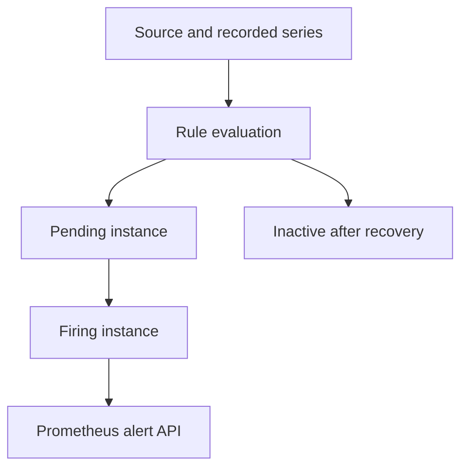

# Lab 23: Prometheus Alert Rule Lifecycle

## 1. Purpose and Learning Outcomes

**In Plain Language:** You will treat an alert as a state that develops across evaluations. Define a condition and hold time, test the expected transitions with fixtures, and observe a real Redis warning from pending through firing to recovery. This establishes alert-rule behavior before the next lab introduces notification delivery.

> **Primary Objective:** Implement alert conditions, test hold times, observe pending/firing transitions and prove recovery separately from notification delivery.

An alert is a state machine evaluated over time-series data. A threshold crossing does not by itself tell you when an operator will receive a notification.

This lab adds five Prometheus rules and deterministic tests, then sustains a short Redis outage until a warning fires. Alertmanager is introduced in Lab 24. The local thresholds and traffic floors are teaching choices, not customer SLOs.

## 2. Starting Point and Lab Map

Use this guide inside the complete application repository. Run commands from the repository root in Bash unless a step says otherwise. Work through the starting checks in order; they load the helpers and state this lab needs.

Read the explanation before each step, run one complete code block at a time, and compare the actual result with the stated expectation. Save commands, observations, explanations, and unexpected results in your notebook.

### Key Terms

| **Term**       | **Plain-Language Meaning**                                                     |
| -------------- | ------------------------------------------------------------------------------ |
| Pending        | The condition is active, but its configured hold time has not yet completed.   |
| Firing         | The same alert identity has satisfied the condition for the required duration. |
| Alert identity | The label set that distinguishes one alert instance from another.              |

### Lab Map

The arrows show the flow or dependency being studied. Branches identify paths to compare; this is a conceptual map, not a captured runtime trace.


```mermaid
flowchart TD
    S["Source and recorded series"] --> E["Rule evaluation"]
    E --> P["Pending instance"]
    P --> F["Firing instance"]
    E --> I["Inactive after recovery"]
    F --> A["Prometheus alert API"]
```

## 3. Guided Walkthrough

### Step 01. Inherited State and Starting Checks

**What You Are Doing:** Start with healthy rules and let previous failure observations leave the relevant windows. Old traffic could otherwise activate an alert before the new experiment begins.

**Practical Walkthrough:** Verify current source and rule health, then let earlier fault samples leave the relevant windows. A healthy service can still satisfy a recent-window alert because its history includes failures. Establish a clean evaluation baseline before starting the new lifecycle experiment.

Inspect the current alert list and evaluation health and record any already-pending or firing instance before the new fault. Compare the expression's lookback with the time of earlier experiments. If the alert is already active, preserve that observation and establish the documented inactive baseline; otherwise the new fault's hold-time measurement would begin from an unknown prior state.

```bash
source lab-notes/session.sh
source lab-notes/evidence.sh
source lab-notes/raw-metrics.sh
source lab-notes/metrics-session.sh
metrics_check
start_lab 23
```

Complete [Lab 22](Lab-22.md) first. Run commands from the repository root in the same Bash session. Keep the existing credentials, named volumes and checkpoint item. Expect eight services, five scrape jobs, six recording rules and both provisioned dashboards. Let the two-minute window move beyond previous failures before beginning.

**Understanding the Result:** Current recovery and historical alert input can differ. Record the window and baseline state before applying another fault.

### Step 02. Learning Objectives and Evaluation Boundaries

**What You Are Doing:** Separate configuration loading, source sampling, evaluation, and alert state. Each happens at its own time and can fail independently.

**Practical Walkthrough:** Follow configuration loading, scraping, recording-rule calculation, and alert evaluation as separate timed stages. A change must reach each relevant stage before its effect appears in alert state. Keep their health observations separate so a missing alert is not automatically blamed on notification delivery.

Follow the timing chain from new source observation through scrape, recording, and alert evaluation. Inspect each stage's health when an expected alert is absent. Notification handling is downstream of these stages, so a rule that never fired cannot be diagnosed as a receiver-delivery failure.

You will inspect rule health separately from alert state, explain label identity, test `for` timing, distinguish absent input from false conditions, and compare a cache warning with successful business readiness.

The lab map in Section 2 shows this relationship.

Configuration acceptance, first true evaluation, pending-to-firing transition and dependency recovery are distinct events. Capture their timestamps rather than assuming the Docker stop time is the start of the alert hold period.

**Understanding the Result:** The rule engine cannot evaluate evidence it has not received. Inspect upstream freshness and evaluation status first.

### Step 03. Understand Identity, Hold Time and Resolution

**What You Are Doing:** Follow how labels define the instance whose pending timer is tracked. Changing identity can restart timing even when the human description sounds like the same problem.

**Practical Walkthrough:** Read the resulting label set as the identity of one alert instance. The pending timer follows that identity while the condition remains present. If labels change or the series disappears, the lifecycle can change even when a human would describe the symptom with the same words.

Inspect the labels defining one alert instance and distinguish them from descriptive annotations. The hold timer depends on continued presence of that identity. A changing label can create another instance, so avoid assuming repeated human-readable symptoms necessarily share one uninterrupted pending timer.

Each vector element returned by an alert expression creates an active identity defined by its labels. Changing a label can create a new identity and restart pending time. Keep changing descriptive information in annotations.

`for` starts at the first active evaluation and requires the identity to remain active at subsequent evaluations. Dependency observation, scrape timing and the 15-second evaluation cadence add delay.

The rule API exposes inactive, pending and firing. After recovery the rule returns to inactive; “resolved” describes the recovery transition and notification state rather than a permanent fourth rule state. See [Prometheus alerting rules](https://prometheus.io/docs/prometheus/latest/configuration/alerting_rules/).

**Understanding the Result:** A stable alert name alone does not define a stable instance. Labels and continuous condition presence matter to the hold timer.

### Step 04. Define the Rule Contract

**What You Are Doing:** Specify each alert's evidence, hold duration, and intended meaning. A scrape alert should not silently claim that all business operations are unavailable.

**Practical Walkthrough:** For each rule, state the selected evidence, hold duration, and operational claim. A failed scrape supports a collection-path warning, while business unavailability needs relevant business evidence. Keep the annotation wording within what the expression actually observes.

Compare each annotation's claim with its expression. A scrape failure establishes a monitoring-path symptom, while a business failure requires relevant application evidence. State the hold time and selected population explicitly so the rule's operational meaning is reviewable before it becomes active.

| **Alert**                   | **Evidence**                              | **Hold** | **Meaning**                                                     |
| --------------------------- | ----------------------------------------- | -------- | --------------------------------------------------------------- |
| FastAPIScrapeUnavailable    | `up=0`                                    | 45 s     | Investigate the scrape path; business failure is not yet proven |
| PostgresUnavailable         | Application database observation          | 45 s     | Required dependency unavailable                                 |
| RedisDegraded               | Application cache observation             | 1 min    | Optional cache unavailable; verify fallback                     |
| FastAPIHighServerErrorRatio | API 5xx fraction >10% and traffic >0.05/s | 1 min    | Sustained server failures above a learning floor                |
| FastAPIHighLatency          | API p95 >350 ms and observations >0.1/s   | 2 min    | Sustained slow completed responses                              |

The API-prefix scope includes demo traffic. A traffic floor reduces sparse noise but can hide a real low-volume problem. These are not yet the Items SLO definitions.

A disappeared discovery target does not yield `up=0`. Inventory/missing-series detection is a separate requirement; revisit Lab 11 before claiming this rule covers it.

**Understanding the Result:** An alert is a claim backed by a measurement contract. Avoid broader diagnoses than the selected evidence can support.

### Step 05. Install the Complete Rule and Prometheus Files

**What You Are Doing:** Install the complete configuration while preserving earlier jobs and recording rules. Check filtering expressions carefully so a false Boolean result does not still leave an active vector element.

**Practical Walkthrough:** Install the full rules while preserving existing jobs and recordings, then inspect comparison semantics. Alert expressions treat returned series as active candidates; a Boolean comparison can leave a zero-valued series present. Use the supplied filtering form where false conditions must disappear from the result.

Preserve all existing jobs and recordings while installing alerts. Read comparison semantics carefully: an alert expression returning a series is active even if that series has numeric zero. Where false conditions should vanish, use the provided filtering comparison rather than introducing `bool` merely for apparent clarity.

```bash
cat > lab-notes/prometheus/application-alerts.yml <<'YAML'
groups:
- name: learning-application-alerts
  interval: 15s
  rules:
  - alert: FastAPIScrapeUnavailable
    expr: up{job="fastapi"} == 0
    for: 45s
    labels:
      severity: critical
      team: platform
    annotations:
      summary: FastAPI scrape unavailable
      description: Check target and network before assuming business unavailability. Service={{ $labels.service
        }}, environment={{ $labels.environment }}.
      runbook: docs/operations.md
  - alert: PostgresUnavailable
    expr: application_dependency_up{job="fastapi",dependency="postgres"} == 0
    for: 45s
    labels:
      severity: critical
      team: platform
    annotations:
      summary: Required PostgreSQL dependency unavailable
      description: Check readiness and the application database connection path. Service={{ $labels.service }},
        environment={{ $labels.environment }}.
      runbook: docs/operations.md
  - alert: RedisDegraded
    expr: application_dependency_up{job="fastapi",dependency="redis"} == 0
    for: 1m
    labels:
      severity: warning
      team: platform
    annotations:
      summary: Application cache degraded
      description: Verify PostgreSQL fallback and cache recovery; the API may remain ready. Service={{ $labels.service
        }}, environment={{ $labels.environment }}.
      runbook: docs/operations.md
  - alert: FastAPIHighServerErrorRatio
    expr: (sum by (environment, service) (service_route:application_http_server_errors:rate2m{route=~"/api/v1/.*"})
      / sum by (environment, service) (service_route:application_http_requests:rate2m{route=~"/api/v1/.*"}) > 0.10)
      and on (environment, service) (sum by (environment, service) (service_route:application_http_requests:rate2m{route=~"/api/v1/.*"})
      > 0.05)
    for: 1m
    labels:
      severity: critical
      team: platform
    annotations:
      summary: Sustained API server-error fraction
      description: More than 10% 5xx above the learning traffic floor; inspect routes and dependencies. Service={{
        $labels.service }}, environment={{ $labels.environment }}.
      runbook: docs/operations.md
  - alert: FastAPIHighLatency
    expr: (histogram_quantile(0.95, sum by (environment, service, le) (service_route:application_http_request_duration_seconds_bucket:rate2m{route=~"/api/v1/.*"}))
      > 0.35) and on (environment, service) (sum by (environment, service) (service_route:application_http_request_duration_seconds_count:rate2m{route=~"/api/v1/.*"})
      > 0.10)
    for: 2m
    labels:
      severity: warning
      team: platform
    annotations:
      summary: Sustained API p95 above learning threshold
      description: p95 exceeds 350 ms above the learning observation floor; inspect routes and resource pressure.
        Service={{ $labels.service }}, environment={{ $labels.environment }}.
      runbook: docs/operations.md
YAML
```

**Command Note:** `<<'YAML'` writes the following block literally until `YAML`. Quoting the delimiter prevents Bash from expanding `$variables` inside the generated file; creation and execution are separate steps.

```bash
cat > lab-notes/prometheus/prometheus.yml <<'YAML'
global:
  scrape_interval: 15s
  scrape_timeout: 5s
  evaluation_interval: 15s
scrape_configs:
- job_name: fastapi
  metrics_path: /metrics
  file_sd_configs:
  - files:
    - /etc/prometheus/labs/app-targets.json
    refresh_interval: 5s
  sample_limit: 5000
  label_limit: 12
  label_name_length_limit: 80
  label_value_length_limit: 128
  body_size_limit: 2MB
  relabel_configs:
  - source_labels:
    - monitoring
    regex: disabled
    action: drop
  - source_labels:
    - environment
    target_label: environment
    action: lowercase
  - target_label: telemetry_role
    replacement: application
  - regex: monitoring|lab_discovery_note
    action: labeldrop
  metric_relabel_configs:
  - source_labels:
    - __name__
    regex: application_.*_created
    action: drop
  - source_labels:
    - request_id
    regex: .+
    action: drop
  - source_labels:
    - event_id
    regex: .+
    action: drop
  - source_labels:
    - item_id
    regex: .+
    action: drop
  - source_labels:
    - user_id
    regex: .+
    action: drop
  - source_labels:
    - trace_id
    regex: .+
    action: drop
- job_name: prometheus
  static_configs:
  - targets:
    - prometheus:9090
- job_name: node
  static_configs:
  - targets:
    - host-metrics:9100
- job_name: postgres
  static_configs:
  - targets:
    - postgres-exporter:9187
- job_name: redis
  static_configs:
  - targets:
    - redis-exporter:9121
rule_files:
- /etc/prometheus/labs/recording-rules.yml
- /etc/prometheus/labs/application-alerts.yml
YAML
```

The full configuration retains the five jobs, ingestion guardrails and recording rules. Each alert has severity/team labels and useful summary, description and repository-relative runbook metadata.

Use a filtering comparison, not `> bool`, for these expressions. A false boolean comparison retains an element with numeric zero, and element presence activates an alert. Do not use a broad zero fallback to hide missing evidence.

**Understanding the Result:** False numeric value and absent series are different. This distinction can determine whether an alert enters pending unexpectedly.

### Step 06. Install and Run Timing Tests

**What You Are Doing:** Test the exact pending, firing, and resolution times using known samples. Fixed input timing makes the hold-time semantics easier to verify than live polling alone.

**Practical Walkthrough:** Run fixed-time fixtures that assert pending, firing, and resolution boundaries. Known samples let you see exactly when continuous truth satisfies the hold duration. Read any failure against the fixture timeline before changing the rule, because a one-evaluation timing assumption may be the issue.

Read the fixture timeline and evaluation interval before running it. Identify the first true evaluation, the hold-duration boundary, and the first false evaluation. A failed timing assertion should be explained against those points instead of changing the expected state without understanding the lifecycle.

```bash
cat > lab-notes/prometheus/alert-tests.yml <<'YAML'
rule_files:
- application-alerts.yml
evaluation_interval: 15s
tests:
- name: redis pending firing and recovery
  interval: 15s
  input_series:
  - series: application_dependency_up{dependency="redis",environment="local",service="items-info",job="fastapi",instance="app:8000"}
    values: 1 0 0 0 0 0 1 1
  alert_rule_test:
  - eval_time: 1m
    alertname: RedisDegraded
    exp_alerts: []
  - eval_time: 1m15s
    alertname: RedisDegraded
    exp_alerts:
    - exp_labels:
        dependency: redis
        environment: local
        service: items-info
        job: fastapi
        instance: app:8000
        severity: warning
        team: platform
      exp_annotations:
        summary: Application cache degraded
        description: Verify PostgreSQL fallback and cache recovery; the API may remain ready. Service=items-info,
          environment=local.
        runbook: docs/operations.md
  - eval_time: 1m30s
    alertname: RedisDegraded
    exp_alerts: []
  promql_expr_test:
  - expr: ALERTS{alertname="RedisDegraded",alertstate="pending"}
    eval_time: 30s
    exp_samples:
    - labels: ALERTS{alertname="RedisDegraded",alertstate="pending",dependency="redis",environment="local",service="items-info",job="fastapi",instance="app:8000",severity="warning",team="platform"}
      value: 1
- name: sustained error ratio
  interval: 15s
  input_series:
  - series: service_route:application_http_requests:rate2m{environment="local",service="items-info",route="/api/v1/items",method="GET"}
    values: 0.2+0x8
  - series: service_route:application_http_server_errors:rate2m{environment="local",service="items-info",route="/api/v1/items",method="GET"}
    values: 0.04+0x8
  alert_rule_test:
  - eval_time: 1m
    alertname: FastAPIHighServerErrorRatio
    exp_alerts:
    - exp_labels:
        environment: local
        service: items-info
        severity: critical
        team: platform
      exp_annotations:
        summary: Sustained API server-error fraction
        description: More than 10% 5xx above the learning traffic floor; inspect routes and dependencies. Service=items-info,
          environment=local.
        runbook: docs/operations.md
- name: traffic floor suppresses sparse failures
  interval: 15s
  input_series:
  - series: service_route:application_http_requests:rate2m{environment="local",service="items-info",route="/api/v1/items",method="GET"}
    values: 0.01+0x8
  - series: service_route:application_http_server_errors:rate2m{environment="local",service="items-info",route="/api/v1/items",method="GET"}
    values: 0.01+0x8
  alert_rule_test:
  - eval_time: 1m
    alertname: FastAPIHighServerErrorRatio
    exp_alerts: []
YAML
```

```bash
chmod 644 lab-notes/prometheus/application-alerts.yml lab-notes/prometheus/alert-tests.yml lab-notes/prometheus/prometheus.yml
dm run --rm -T --no-deps --entrypoint promtool prometheus check rules /etc/prometheus/labs/application-alerts.yml
dm run --rm -T --no-deps --entrypoint promtool prometheus test rules /etc/prometheus/labs/alert-tests.yml
```

Predict the fixture before running it: Redis turns unhealthy at 15 s, is pending at 30 s, is not yet firing at 60 s, fires at 75 s and recovers at 90 s. The ratio cases test sustained errors and the low-traffic floor.

Recorded-rate inputs intentionally isolate alert semantics; Lab 16 tested those recordings from raw counters. These tests do not validate Docker networking or delivery. See [Prometheus rule tests](https://prometheus.io/docs/prometheus/latest/configuration/unit_testing_rules/).

**Understanding the Result:** Deterministic tests explain lifecycle semantics. Live polling adds scrape and scheduling delays on top of those semantics.

### Step 07. Load the Rules and Verify Health

**What You Are Doing:** Load the rules and inspect both reload success and evaluation health. Sending a reload signal is an action; the resulting loaded-rule state is its evidence.

**Practical Walkthrough:** Load the validated rules and inspect the running groups, reload status, and evaluation errors. A reload request only initiates an action; the active rule listing confirms what was accepted. Check that existing groups remain present and healthy after the change.

Load validated files, then inspect the running rule list, reload-success signal, and evaluation health. Check that earlier groups remain present. Issuing reload is only an attempted change; the active listing and subsequent successful evaluations establish that the intended rule set was adopted.

```bash
cat > lab-notes/alert-session.sh <<'BASH'
# Source after metrics-session.sh.
wait_rule_state() {
  local name="$1" state="$2" attempt
  for attempt in {1..180}; do
    if api -fsS "$PROM_URL/api/v1/rules?type=alert" | jq -e --arg name "$name" --arg state "$state" \
      '[.data.groups[].rules[]|select(.name==$name)] as $r | ($r|length)>0 and all($r[]; .state==$state and .health=="ok")' >/dev/null; then return 0; fi
    sleep 1
  done
  printf 'Rule state deadline: %s / %s\n' "$name" "$state" >&2
  return 1
}
capture_alert_state() {
  api -fsS "$PROM_URL/api/v1/rules?type=alert" > "$LAB_DIR/$1-rules.json"
  api -fsS "$PROM_URL/api/v1/alerts" > "$LAB_DIR/$1-alerts.json"
}
BASH
```

**Command Note:** `jq --arg` passes a shell value as a JSON-query string variable without inserting it into the query text. Where used, `-e` turns a false or null final result into a failing exit status.

```bash
source lab-notes/alert-session.sh
record_change "load_five_application_alerts" planned
reload_prometheus
wait_rule_state RedisDegraded inactive
capture_alert_state loaded
jq '.data.groups[].rules[] | {name,state,health,lastError}' "$LAB_DIR/loaded-rules.json"
pq 'prometheus_config_last_reload_successful' > "$LAB_DIR/reload-success.json"
```

Open Prometheus **Alerts** and inspect the five names/durations. A successful signal submission does not prove the expected rules loaded; the API and reload-success metric provide that evidence. Inactive with healthy evaluation differs from a failed evaluation.

**Understanding the Result:** Do not infer success from sending a signal alone. Verify the intended rules are loaded and evaluating.

### Step 08. Predict and Observe the Real Lifecycle

**What You Are Doing:** Stop Redis for the bounded exercise and follow the warning's actual transitions. Compare them with source observations while confirming required business work remains available.

**Practical Walkthrough:** Stop Redis for the bounded interval and follow the warning from inactive through its observed states. Compare dependency samples with evaluation times and keep business reads running as directed. Restore Redis and continue observing until the rule reflects fresh recovery evidence.

Record Redis failure and restoration times and compare them with observed alert-state transitions. Keep the bounded fault and recovery together. Scrape and evaluation schedules explain detection delay, while continued business reads show that the warning concerns degradation rather than proving total application unavailability.

```bash
(
  set -euo pipefail
  trap 'dm start redis >/dev/null' EXIT
  trap 'exit 130' INT
  trap 'exit 143' TERM
  record_change "alert_lifecycle_redis_stop" planned
  dm stop redis
  api -fsS "$APP_URL/health/ready" > "$LAB_DIR/degraded-readiness.json"
  wait_rule_state RedisDegraded pending
  capture_alert_state pending
  date -u +%FT%TZ > "$LAB_DIR/pending-observed-at.txt"
  pq 'ALERTS{alertname="RedisDegraded",alertstate="pending"}' > "$LAB_DIR/pending-series.json"
  api -fsS "$APP_URL/api/v1/items?limit=1" > "$LAB_DIR/business-while-pending.json"
  wait_rule_state RedisDegraded firing
  capture_alert_state firing
  date -u +%FT%TZ > "$LAB_DIR/firing-observed-at.txt"
  jq '.data.alerts[] | select(.labels.alertname=="RedisDegraded") | {labels,state,activeAt,annotations}' "$LAB_DIR/firing-alerts.json"
)
wait_ready
wait_metric 'redis_up{job="redis"}' 1
wait_rule_state RedisDegraded inactive
capture_alert_state recovered
metrics_check
capture_app_logs
record_change "redis_recovered_and_warning_inactive" completed
```

**Command Note:** `trap ... EXIT` schedules cleanup when that shell exits. Keep it in the same block as the fault; the explicit recovery checks afterward confirm that restoration actually succeeded.

Write the expected sequence before running it. The bounded helper allows three minutes, not an endless wait. Do not extend the deadline without inspecting source observation and rule health.

Readiness remains HTTP 200 with cache degradation, and uncached list reads still work. The alert's `activeAt` can precede the moment your polling command observed it. The trap starts Redis even after a failed check; verify recovery explicitly afterward.

**Understanding the Result:** Optional-cache degradation can trigger a warning while required business work succeeds. Record actual transitions rather than assuming exact wall-clock timing.

### Step 09. Compare Current and Historical State

**What You Are Doing:** Compare current inactive state with historical pending and firing evidence. Recovery ends the current condition without erasing the incident's stored history.

**Practical Walkthrough:** Compare the current inactive result with historical pending and firing series over the incident window. Resolution changes the current state but does not erase earlier evidence. Use an absolute time range when documenting the lifecycle so later readers can still see the original transitions.

Query the current alert state separately from historical `ALERTS` over the incident interval. Resolution removes current truth without deleting stored transition evidence. Save the absolute time range so later review can still distinguish the pending period, firing period, and recovered state.

```bash
pq 'ALERTS{alertname="RedisDegraded"}' > "$LAB_DIR/current-alert-series.json"
pq 'increase(prometheus_rule_evaluation_failures_total[5m])' > "$LAB_DIR/rule-failures.json"
api -fsS "$APP_URL/health/ready" > "$LAB_DIR/readiness-recovered.json"
```

The recovered instant alert query should be empty for this identity. A historical range still shows pending/firing samples. Lifetime cache errors retain the incident history; they do not return to zero.

Correlate the warning with Redis/server observations, readiness and request logs. Successful fallback does not make the cache warning false: the warning describes the degraded optimization path.

**Understanding the Result:** An inactive alert now does not prove no alert fired earlier. Current and historical queries answer different questions.

### Step 10. Prove a Wrong Timing Expectation Fails

**What You Are Doing:** Make a deliberately incorrect timing expectation fail in the test fixture. Confirm that the failure concerns the assertion you intended to test, not an unrelated syntax or file error.

**Practical Walkthrough:** Run the intentionally wrong timing expectation in an isolated fixture and inspect the assertion failure. Confirm the file parsed and the intended case actually executed. Keep the broken candidate outside the active configuration so this checks test sensitivity without changing live alert behavior.

Inspect the test output for the expected-versus-observed alert state and its evaluation time. The deliberately wrong expectation should produce a nonzero test result for that assertion; a missing file, invalid YAML, or unknown expression would be a different failure. Compare this with the passing approved fixture to demonstrate that the test distinguishes the intended lifecycle behavior.

```bash
python3 - <<'PYTHON'
from pathlib import Path
s=Path("lab-notes/prometheus/alert-tests.yml").read_text()
assert s.count("eval_time: 1m15s")==1
Path("lab-notes/prometheus/alert-tests-negative.yml").write_text(s.replace("eval_time: 1m15s","eval_time: 1m"))
PYTHON
chmod 644 lab-notes/prometheus/alert-tests-negative.yml
if dm run --rm -T --no-deps --entrypoint promtool prometheus test rules /etc/prometheus/labs/alert-tests-negative.yml \
  > "$LAB_DIR/negative-test.txt" 2>&1; then
  printf 'Unexpected pass; inspect fixture\n' >&2
else
  printf 'Expected negative-test failure captured\n'
fi
rm lab-notes/prometheus/alert-tests-negative.yml
```

Read the output to confirm an assertion failure, not a missing file or syntax failure. At 60 s the condition has existed for only 45 s. The temporary fixture is never referenced by the runtime rule list.

**Understanding the Result:** A failing test is useful here only when it fails for the planned reason. Syntax failure would not demonstrate timing-test coverage.

## 4. Troubleshooting and Diagnosis

Start with the first unexpected result. Record the exact symptom, identify which component produced it, and use the checks below before repeating the experiment. After a fix, repeat the original check and confirm recovery.

### Troubleshooting

| **Symptom**                         | **Distinction**                     | **Next Action**                                       |
| ----------------------------------- | ----------------------------------- | ----------------------------------------------------- |
| Rule absent                         | Configuration loading               | Inspect path, promtool result, reload metric and logs |
| Pending repeatedly resets           | Identity or condition instability   | Inspect changing labels and full-window samples       |
| Stopped Redis but no warning        | Application observation/scrape path | Read readiness, dependency metric and target state    |
| Fires sooner than expected          | Earlier active state                | Inspect activeAt and loaded duration                  |
| Historical graph still shows firing | Current versus range query          | Compare the current API state                         |
| No chat/email received              | No delivery backend yet             | Expected here; continue to Lab 24                     |

Keep evaluation errors visible. Missing observations are not proof of service health.

## 5. Review and Practice

Answer the knowledge questions in your own words before reading the answer guide. For the scenario, name the evidence you would collect and the conclusion each observation would support.

### Knowledge Check

1. When does for start?
2. Why avoid dynamic labels?
3. What does a silence change?

#### Answer Guide

1. At the first evaluation yielding that identity, after observation/scrape delay.
2. Labels define identity and changing them can reset the hold time.
3. Notification suppression, not the evaluated condition; Lab 24 demonstrates it.

### Professional Scenario Exercise

An error alert stays pending for twenty minutes despite an elevated graph. Investigate label churn, intermittent conditions, sparse input, denominators and evaluation failures before changing for.

## 6. Completion Checklist

Mark each item only after you can point to its result or evidence file. Complete any cleanup shown here before moving on.

### Observable Completion Criteria

- [ ] Five alerts evaluate healthily.
- [ ] Timing and traffic-floor fixtures pass; the negative expectation fails correctly.
- [ ] Real pending/firing states have timestamps and business evidence.
- [ ] Redis recovers and the rule becomes inactive.

## 7. Production Context and Next Lab

### Production Implications

Production alerting requires actionable ownership, calibrated thresholds, missing-data policies and runbooks. Short local hold times make transitions visible; they are not universal recommendations.

### End State and Transition

Keep eight services, five jobs, six recording rules and five alerts. [Lab 24](Lab-24.md) adds notification routing and suppression.
