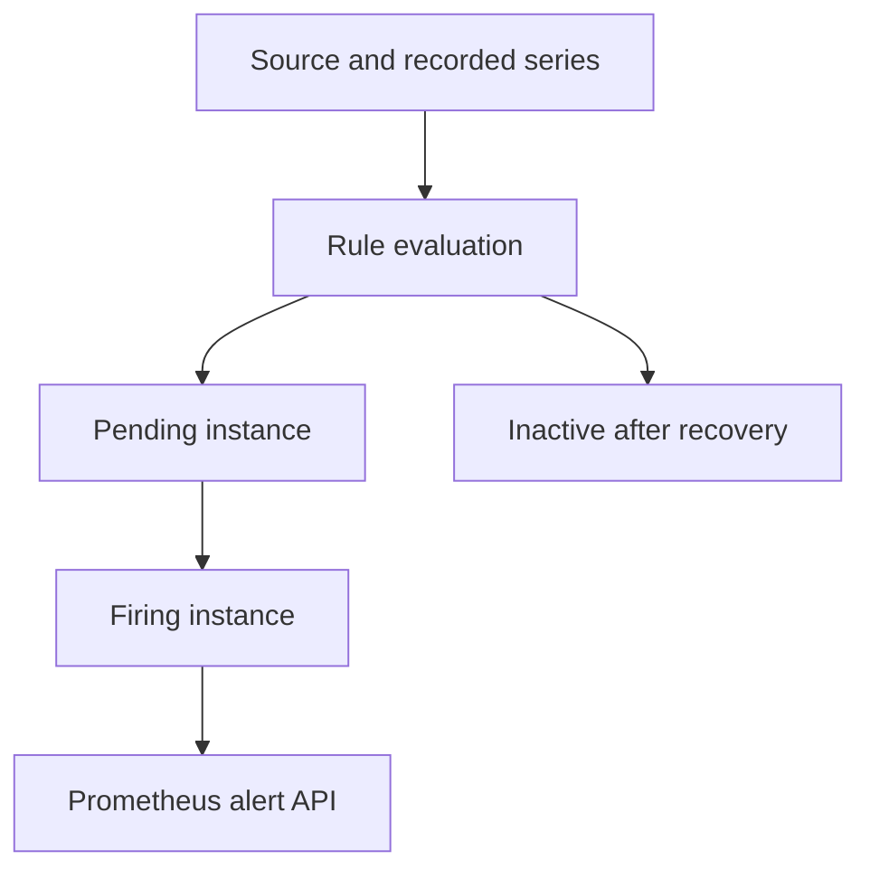

# Lab 23: Prometheus Alert Rule Lifecycle

## 1. Purpose and Learning Outcomes

**In Plain Language:** You will learn how an alert moves through states as Prometheus evaluates it over time. Define a condition and how long it must remain true, then test the expected timing with fixed samples. Finally, stop Redis briefly and watch its warning move from pending to firing and back to a healthy state. This lab checks rule behavior; the next lab adds notification delivery.

> **Primary Objective:** Write alert conditions, test their waiting periods, observe pending and firing states, and confirm recovery separately from notification delivery.

An alert changes state as Prometheus evaluates time-series data. A value crossing a threshold does not by itself tell you when a notification will reach an operator.

You will add five alert rules with repeatable tests, then keep Redis unavailable briefly until its warning fires. Alertmanager comes in Lab 24. The thresholds and minimum traffic levels here are teaching examples, not customer SLOs.

## 2. Starting Point and Lab Map

Open the complete application repository before using this guide. Unless a step says otherwise, run commands in Bash from the repository's top-level folder. Follow the starting checks in order because later commands depend on the helper functions and running services they prepare.

Read each explanation before running its commands. Run one complete code block, check the result, and then continue. In your notebook, save the commands, what happened, why you think it happened, and anything that differed from the expected result.

### Key Terms

| **Term**       | **Explanation**                                                                     |
| -------------- | ----------------------------------------------------------------------------------- |
| Pending        | The condition is active, but it has not remained active for the full required time. |
| Firing         | The same alert instance has stayed active long enough to satisfy its hold time.     |
| Alert identity | The complete label set that tells one alert instance apart from another.            |

### Lab Map

The arrows show how the parts connect and where a request can take different paths. Use this map to understand the design. It is not a recording of a request that actually ran.


```mermaid
flowchart TD
    S["Source and recorded series"] --> E["Rule evaluation"]
    E --> P["Pending instance"]
    P --> F["Firing instance"]
    E --> I["Inactive after recovery"]
    F --> A["Prometheus alert API"]
```

## 3. Guided Walkthrough

### Step 01. Inherited State and Starting Checks

**What You Are Doing:** Check rule health and let earlier failures move outside the query windows. Otherwise, old events could activate an alert before this experiment starts.

**Practical Walkthrough:** Confirm current collection and rule health, then wait for earlier fault samples to leave the relevant windows. A recovered service can still match an alert whose lookback includes past failures. Establish an inactive starting state before measuring the new lifecycle.

Inspect the current alert list and evaluation health. Record any alert already pending or firing. Compare its lookback period with earlier experiments. Preserve any existing activity, then establish the documented inactive baseline so the next hold-time measurement does not start from an unknown prior state.

```bash
source lab-notes/session.sh
source lab-notes/evidence.sh
source lab-notes/raw-metrics.sh
source lab-notes/metrics-session.sh
metrics_check
start_lab 23
```

Complete [Lab 22](Lab-22.md) first. Use the repository root and the same Bash session. Keep credentials, named volumes, and the checkpoint item. Expect eight services, five scrape jobs, six recording rules, and both provisioned dashboards. Let the two-minute window move past previous failures before starting.

**Understanding the Result:** Current service health can differ from the recent history an alert reads. Record the window and starting alert state before adding another fault.

### Step 02. Learning Objectives and Evaluation Boundaries

**What You Are Doing:** Separate loading the configuration, collecting samples, evaluating rules, and updating alert state. Each stage has its own timing and possible failures.

**Practical Walkthrough:** Follow the change through configuration loading, scraping, recording rules, and alert evaluation. Its effect appears only after the relevant stages run. Check each stage separately instead of immediately blaming notification delivery when an alert is absent.

Trace a new observation through the scrape, recording, and alert evaluation times. If an expected alert is missing, inspect those stages' health. Notification delivery happens afterward; a rule that never fired has not yet produced a receiver-delivery problem.

You will check evaluation health separately from alert state, explain label identity, test `for` timing, distinguish missing inputs from false conditions, and compare a cache warning with successful business readiness.

The lab map in Section 2 shows this relationship.

Configuration acceptance, the first active evaluation, the transition to firing, and dependency recovery are separate events. Record their timestamps. Stopping a Docker container does not necessarily start the alert's hold timer at that exact moment.

**Understanding the Result:** Rules cannot use evidence that has not arrived. Check source freshness and successful evaluation first.

### Step 03. Understand Identity, Hold Time and Resolution

**What You Are Doing:** Follow how labels identify the alert whose pending timer is running. A label change can start a new timer even when the description sounds like the same issue.

**Practical Walkthrough:** Read the returned label set as one alert instance's identity. Its timer continues while that identity remains active. If its labels change or its series disappears, the lifecycle can change even though a person still describes the same symptom.

Distinguish identifying labels from explanatory annotations. The hold timer follows the continued presence of the same identity. A changing label can create a different instance, so similar descriptions do not guarantee one uninterrupted pending period.

Each element returned by the alert expression creates an active instance identified by its labels. Changing a label can create a new instance and restart pending time. Put changing descriptive details in annotations instead.

`for` begins with the first active evaluation and requires the same identity to remain active at later evaluations. The app's dependency check, scraping, and the 15-second evaluation interval all add delay before the state change is observed.

The rule API shows inactive, pending, and firing. After recovery, the rule becomes inactive again. “Resolved” describes the recovery transition and notification state, not a permanent fourth rule state. See [Prometheus alerting rules](https://prometheus.io/docs/prometheus/latest/configuration/alerting_rules/).

**Understanding the Result:** An unchanged alert name does not guarantee an unchanged instance. The labels and continued presence of the condition control its hold timer.

### Step 04. Define the Rule Contract

**What You Are Doing:** Define the evidence, waiting period, and intended meaning of each alert. A failed scrape should not claim that every business operation has failed.

**Practical Walkthrough:** For each rule, state what it reads, how long the condition must last, and what conclusion it supports. A scrape failure supports investigation of the collection path. Claims about business availability need business-relevant evidence. Keep annotations within those limits.

Compare each annotation with the expression behind it. Name the selected requests or targets and the hold time. A monitoring-path symptom and an application failure are different claims, so make the rule's intended meaning clear before activating it.

| **Alert**                   | **Evidence**                              | **Hold** | **Meaning**                                                          |
| --------------------------- | ----------------------------------------- | -------- | -------------------------------------------------------------------- |
| FastAPIScrapeUnavailable    | `up=0`                                    | 45 s     | Check the scrape path; business failure has not yet been established |
| PostgresUnavailable         | App's database observation                | 45 s     | The required database path is unavailable                            |
| RedisDegraded               | App's cache observation                   | 1 min    | The optional cache is unavailable; check that fallback works         |
| FastAPIHighServerErrorRatio | API 5xx fraction >10% and traffic >0.05/s | 1 min    | Server failures continue above the lab's minimum traffic level       |
| FastAPIHighLatency          | API p95 >350 ms and observations >0.1/s   | 2 min    | Completed responses remain slow                                      |

The API-prefix selection includes demo requests. A minimum traffic level reduces noisy results from sparse data, but can hide a real problem on a quiet route. These rules do not yet use the Items SLO definitions.

A target removed from discovery does not produce `up=0`. Detecting missing targets or series needs a separate policy. Revisit Lab 11 before claiming that this alert covers disappearance.

**Understanding the Result:** An alert makes a claim based on specific measurements. Do not let its wording imply more than those measurements support.

### Step 05. Install the Complete Rule and Prometheus Files

**What You Are Doing:** Add the full alert configuration while keeping previous jobs and recordings. Check comparisons carefully: an existing result with value zero can still activate an alert.

**Practical Walkthrough:** Preserve the existing stage while installing the rules. Alert expressions treat returned series as active candidates. A Boolean comparison can retain a series even when its value becomes zero. Use the supplied filtering comparisons where a false condition should remove the series.

Keep every existing job and recording rule. An alert is active when its expression returns a series, even one valued zero. Use the given filtering form when false inputs should disappear. Adding `bool` can change that behavior rather than merely make the expression clearer.

```bash
cat > lab-notes/prometheus/application-alerts.yml <<'YAML'
groups:
- name: learning-application-alerts
  interval: 15s
  rules:
  - alert: FastAPIScrapeUnavailable
    expr: up{job="fastapi"} == 0
    for: 45s
    labels:
      severity: critical
      team: platform
    annotations:
      summary: FastAPI scrape unavailable
      description: Check target and network before assuming business unavailability. Service={{ $labels.service
        }}, environment={{ $labels.environment }}.
      runbook: docs/operations.md
  - alert: PostgresUnavailable
    expr: application_dependency_up{job="fastapi",dependency="postgres"} == 0
    for: 45s
    labels:
      severity: critical
      team: platform
    annotations:
      summary: Required PostgreSQL dependency unavailable
      description: Check readiness and the application database connection path. Service={{ $labels.service }},
        environment={{ $labels.environment }}.
      runbook: docs/operations.md
  - alert: RedisDegraded
    expr: application_dependency_up{job="fastapi",dependency="redis"} == 0
    for: 1m
    labels:
      severity: warning
      team: platform
    annotations:
      summary: Application cache degraded
      description: Verify PostgreSQL fallback and cache recovery; the API may remain ready. Service={{ $labels.service
        }}, environment={{ $labels.environment }}.
      runbook: docs/operations.md
  - alert: FastAPIHighServerErrorRatio
    expr: (sum by (environment, service) (service_route:application_http_server_errors:rate2m{route=~"/api/v1/.*"})
      / sum by (environment, service) (service_route:application_http_requests:rate2m{route=~"/api/v1/.*"}) > 0.10)
      and on (environment, service) (sum by (environment, service) (service_route:application_http_requests:rate2m{route=~"/api/v1/.*"})
      > 0.05)
    for: 1m
    labels:
      severity: critical
      team: platform
    annotations:
      summary: Sustained API server-error fraction
      description: More than 10% 5xx above the learning traffic floor; inspect routes and dependencies. Service={{
        $labels.service }}, environment={{ $labels.environment }}.
      runbook: docs/operations.md
  - alert: FastAPIHighLatency
    expr: (histogram_quantile(0.95, sum by (environment, service, le) (service_route:application_http_request_duration_seconds_bucket:rate2m{route=~"/api/v1/.*"}))
      > 0.35) and on (environment, service) (sum by (environment, service) (service_route:application_http_request_duration_seconds_count:rate2m{route=~"/api/v1/.*"})
      > 0.10)
    for: 2m
    labels:
      severity: warning
      team: platform
    annotations:
      summary: Sustained API p95 above learning threshold
      description: p95 exceeds 350 ms above the learning observation floor; inspect routes and resource pressure.
        Service={{ $labels.service }}, environment={{ $labels.environment }}.
      runbook: docs/operations.md
YAML
```

**Command Note:** `<<'YAML'` writes the following text literally until the closing `YAML`. The quoted delimiter stops Bash from expanding `$variables` in the file. File creation and execution are separate steps.

```bash
cat > lab-notes/prometheus/prometheus.yml <<'YAML'
global:
  scrape_interval: 15s
  scrape_timeout: 5s
  evaluation_interval: 15s
scrape_configs:
- job_name: fastapi
  metrics_path: /metrics
  file_sd_configs:
  - files:
    - /etc/prometheus/labs/app-targets.json
    refresh_interval: 5s
  sample_limit: 5000
  label_limit: 12
  label_name_length_limit: 80
  label_value_length_limit: 128
  body_size_limit: 2MB
  relabel_configs:
  - source_labels:
    - monitoring
    regex: disabled
    action: drop
  - source_labels:
    - environment
    target_label: environment
    action: lowercase
  - target_label: telemetry_role
    replacement: application
  - regex: monitoring|lab_discovery_note
    action: labeldrop
  metric_relabel_configs:
  - source_labels:
    - __name__
    regex: application_.*_created
    action: drop
  - source_labels:
    - request_id
    regex: .+
    action: drop
  - source_labels:
    - event_id
    regex: .+
    action: drop
  - source_labels:
    - item_id
    regex: .+
    action: drop
  - source_labels:
    - user_id
    regex: .+
    action: drop
  - source_labels:
    - trace_id
    regex: .+
    action: drop
- job_name: prometheus
  static_configs:
  - targets:
    - prometheus:9090
- job_name: node
  static_configs:
  - targets:
    - host-metrics:9100
- job_name: postgres
  static_configs:
  - targets:
    - postgres-exporter:9187
- job_name: redis
  static_configs:
  - targets:
    - redis-exporter:9121
rule_files:
- /etc/prometheus/labs/recording-rules.yml
- /etc/prometheus/labs/application-alerts.yml
YAML
```

The complete configuration keeps all five jobs, ingestion safeguards, and recording rules. Each alert has severity and team labels plus a useful summary, description, and repository-relative runbook reference.

Use the filtering comparison rather than `> bool` in these rules. A false Boolean comparison leaves a zero-valued element, whose presence can activate an alert. Do not add a broad zero fallback to conceal missing evidence.

**Understanding the Result:** A zero value and an absent series are different. Confusing them can make an alert enter pending when you expected it to be inactive.

### Step 06. Install and Run Timing Tests

**What You Are Doing:** Test pending, firing, and recovery times with fixed samples. Known timing makes the hold-period rules easier to verify than live polling alone.

**Practical Walkthrough:** Run fixtures that check the lifecycle at specific times. Their fixed samples show when a continuously active condition completes its hold period. If a test fails, compare its timeline with the evaluation schedule before changing the rule or expected result.

Read the fixture timeline and interval first. Identify the first active evaluation, the end of the required hold period, and the first inactive evaluation. Explain a failed assertion using these points instead of changing its expected state without understanding the timing.

```bash
cat > lab-notes/prometheus/alert-tests.yml <<'YAML'
rule_files:
- application-alerts.yml
evaluation_interval: 15s
tests:
- name: redis pending firing and recovery
  interval: 15s
  input_series:
  - series: application_dependency_up{dependency="redis",environment="local",service="items-info",job="fastapi",instance="app:8000"}
    values: 1 0 0 0 0 0 1 1
  alert_rule_test:
  - eval_time: 1m
    alertname: RedisDegraded
    exp_alerts: []
  - eval_time: 1m15s
    alertname: RedisDegraded
    exp_alerts:
    - exp_labels:
        dependency: redis
        environment: local
        service: items-info
        job: fastapi
        instance: app:8000
        severity: warning
        team: platform
      exp_annotations:
        summary: Application cache degraded
        description: Verify PostgreSQL fallback and cache recovery; the API may remain ready. Service=items-info,
          environment=local.
        runbook: docs/operations.md
  - eval_time: 1m30s
    alertname: RedisDegraded
    exp_alerts: []
  promql_expr_test:
  - expr: ALERTS{alertname="RedisDegraded",alertstate="pending"}
    eval_time: 30s
    exp_samples:
    - labels: ALERTS{alertname="RedisDegraded",alertstate="pending",dependency="redis",environment="local",service="items-info",job="fastapi",instance="app:8000",severity="warning",team="platform"}
      value: 1
- name: sustained error ratio
  interval: 15s
  input_series:
  - series: service_route:application_http_requests:rate2m{environment="local",service="items-info",route="/api/v1/items",method="GET"}
    values: 0.2+0x8
  - series: service_route:application_http_server_errors:rate2m{environment="local",service="items-info",route="/api/v1/items",method="GET"}
    values: 0.04+0x8
  alert_rule_test:
  - eval_time: 1m
    alertname: FastAPIHighServerErrorRatio
    exp_alerts:
    - exp_labels:
        environment: local
        service: items-info
        severity: critical
        team: platform
      exp_annotations:
        summary: Sustained API server-error fraction
        description: More than 10% 5xx above the learning traffic floor; inspect routes and dependencies. Service=items-info,
          environment=local.
        runbook: docs/operations.md
- name: traffic floor suppresses sparse failures
  interval: 15s
  input_series:
  - series: service_route:application_http_requests:rate2m{environment="local",service="items-info",route="/api/v1/items",method="GET"}
    values: 0.01+0x8
  - series: service_route:application_http_server_errors:rate2m{environment="local",service="items-info",route="/api/v1/items",method="GET"}
    values: 0.01+0x8
  alert_rule_test:
  - eval_time: 1m
    alertname: FastAPIHighServerErrorRatio
    exp_alerts: []
YAML
```

```bash
chmod 644 lab-notes/prometheus/application-alerts.yml lab-notes/prometheus/alert-tests.yml lab-notes/prometheus/prometheus.yml
dm run --rm -T --no-deps --entrypoint promtool prometheus check rules /etc/prometheus/labs/application-alerts.yml
dm run --rm -T --no-deps --entrypoint promtool prometheus test rules /etc/prometheus/labs/alert-tests.yml
```

Predict the fixture first: Redis becomes unhealthy at 15 s, is pending at 30 s, is still not firing at 60 s, fires at 75 s, and recovers at 90 s. The ratio fixtures check both sustained errors and the minimum traffic condition.

The fixtures supply recorded rates directly to isolate alert behavior. Lab 16 already tested those recordings from raw counters. These tests do not check Docker networking or notification delivery. See [Prometheus rule tests](https://prometheus.io/docs/prometheus/latest/configuration/unit_testing_rules/).

**Understanding the Result:** Fixed tests explain the lifecycle for known inputs. Live observations also include collection and scheduling delays.

### Step 07. Load the Rules and Verify Health

**What You Are Doing:** Load the validated rules and check both reload success and ongoing evaluation. Sending a reload signal is an action; the active rule state shows whether it worked.

**Practical Walkthrough:** Inspect the running groups, reload result, and evaluation errors after loading. Confirm that earlier groups are still present and healthy. The active listing shows what Prometheus accepted, while successful evaluations show it can run the rules.

Load the checked files, then examine the rule list, reload-success signal, and evaluation health. Keep the earlier groups in view. A reload request alone proves only that you attempted the change; the runtime evidence confirms it took effect.

```bash
cat > lab-notes/alert-session.sh <<'BASH'
# Source after metrics-session.sh.
wait_rule_state() {
  local name="$1" state="$2" attempt
  for attempt in {1..180}; do
    if api -fsS "$PROM_URL/api/v1/rules?type=alert" | jq -e --arg name "$name" --arg state "$state" \
      '[.data.groups[].rules[]|select(.name==$name)] as $r | ($r|length)>0 and all($r[]; .state==$state and .health=="ok")' >/dev/null; then return 0; fi
    sleep 1
  done
  printf 'Rule state deadline: %s / %s\n' "$name" "$state" >&2
  return 1
}
capture_alert_state() {
  api -fsS "$PROM_URL/api/v1/rules?type=alert" > "$LAB_DIR/$1-rules.json"
  api -fsS "$PROM_URL/api/v1/alerts" > "$LAB_DIR/$1-alerts.json"
}
BASH
```

**Command Note:** `jq --arg` passes a shell value into the JSON query as a string variable without inserting it into the query text. When used, `-e` makes a false or null final result return a failing exit status.

```bash
source lab-notes/alert-session.sh
record_change "load_five_application_alerts" planned
reload_prometheus
wait_rule_state RedisDegraded inactive
capture_alert_state loaded
jq '.data.groups[].rules[] | {name,state,health,lastError}' "$LAB_DIR/loaded-rules.json"
pq 'prometheus_config_last_reload_successful' > "$LAB_DIR/reload-success.json"
```

Open Prometheus **Alerts** and check the five names and hold durations. The API and reload-success metric confirm loading; successful signal submission alone does not. An inactive rule evaluating normally differs from one whose evaluation fails.

**Understanding the Result:** Verify the intended rules are loaded and running. Do not infer success only from sending the reload signal.

### Step 08. Predict and Observe the Real Lifecycle

**What You Are Doing:** Briefly stop Redis and watch the warning's actual state changes. Compare them with dependency observations while checking that required business work still succeeds.

**Practical Walkthrough:** Run the limited Redis fault and follow the warning from its inactive baseline. Compare dependency samples and evaluation times, and continue the directed business reads. Restore Redis and keep checking until fresh recovery data reaches the rule.

Record fault and restoration times alongside alert transitions. Keep the fault and cleanup in one block. Scrape and evaluation timing explain delay; successful reads show that the warning describes degraded cache service rather than total app unavailability.

```bash
(
  set -euo pipefail
  trap 'dm start redis >/dev/null' EXIT
  trap 'exit 130' INT
  trap 'exit 143' TERM
  record_change "alert_lifecycle_redis_stop" planned
  dm stop redis
  api -fsS "$APP_URL/health/ready" > "$LAB_DIR/degraded-readiness.json"
  wait_rule_state RedisDegraded pending
  capture_alert_state pending
  date -u +%FT%TZ > "$LAB_DIR/pending-observed-at.txt"
  pq 'ALERTS{alertname="RedisDegraded",alertstate="pending"}' > "$LAB_DIR/pending-series.json"
  api -fsS "$APP_URL/api/v1/items?limit=1" > "$LAB_DIR/business-while-pending.json"
  wait_rule_state RedisDegraded firing
  capture_alert_state firing
  date -u +%FT%TZ > "$LAB_DIR/firing-observed-at.txt"
  jq '.data.alerts[] | select(.labels.alertname=="RedisDegraded") | {labels,state,activeAt,annotations}' "$LAB_DIR/firing-alerts.json"
)
wait_ready
wait_metric 'redis_up{job="redis"}' 1
wait_rule_state RedisDegraded inactive
capture_alert_state recovered
metrics_check
capture_app_logs
record_change "redis_recovered_and_warning_inactive" completed
```

**Command Note:** `trap ... EXIT` arranges cleanup when the shell exits. Keep it with the fault in the same block. The recovery checks afterward confirm that Redis actually returned.

Write the expected sequence before starting. The helper stops waiting after three minutes. If the expected state does not appear, inspect source observations and rule health before extending the deadline.

Readiness remains HTTP 200 with degraded cache status, and uncached list reads still succeed. The alert's `activeAt` may be earlier than the moment your poll first saw it. The trap starts Redis even after a failed check; verify recovery explicitly.

**Understanding the Result:** Optional-cache failure can produce a warning while required business work continues. Save the observed times rather than assuming transitions occur at exact wall-clock offsets.

### Step 09. Compare Current and Historical State

**What You Are Doing:** Compare the current inactive state with the earlier pending and firing history. Recovery ends current activity without deleting evidence of the incident.

**Practical Walkthrough:** Inspect current state separately from historical alert samples. Use an absolute incident interval so later readers can still see pending and firing. Resolution changes what is active now; it does not erase previous observations.

Query current alert state separately from historical `ALERTS` during the incident. Save the fixed time range. This makes the pending period, firing period, and recovery distinguishable even after the active condition has ended.

```bash
pq 'ALERTS{alertname="RedisDegraded"}' > "$LAB_DIR/current-alert-series.json"
pq 'increase(prometheus_rule_evaluation_failures_total[5m])' > "$LAB_DIR/rule-failures.json"
api -fsS "$APP_URL/health/ready" > "$LAB_DIR/readiness-recovered.json"
```

After recovery, the instant alert query for this identity should be empty. A historical range still shows its pending and firing samples. Lifetime cache-error counters also retain the incident; they do not reset to zero.

Compare the warning with Redis metrics, readiness, and request logs. Successful fallback does not make the warning incorrect. The warning describes the degraded cache path, even when the database keeps requests working.

**Understanding the Result:** Inactive now does not mean the alert never fired. Current and historical queries answer different questions.

### Step 10. Prove a Wrong Timing Expectation Fails

**What You Are Doing:** Intentionally make a wrong timing expectation fail in a separate test. Verify that the intended assertion fails, not merely the file loading or syntax.

**Practical Walkthrough:** Run the isolated fixture and read its failure. Confirm the file parsed and the expected case executed. Keep it outside the active configuration so you test whether the fixture catches the mistake without changing live alerts.

Find the expected and actual alert states and their evaluation time in the test output. The wrong expectation should cause a nonzero test result for that assertion. Missing files, invalid YAML, or an invalid expression would test something else. Compare with the approved passing fixture to show that the test detects the lifecycle difference.

```bash
python3 - <<'PYTHON'
from pathlib import Path
s=Path("lab-notes/prometheus/alert-tests.yml").read_text()
assert s.count("eval_time: 1m15s")==1
Path("lab-notes/prometheus/alert-tests-negative.yml").write_text(s.replace("eval_time: 1m15s","eval_time: 1m"))
PYTHON
chmod 644 lab-notes/prometheus/alert-tests-negative.yml
if dm run --rm -T --no-deps --entrypoint promtool prometheus test rules /etc/prometheus/labs/alert-tests-negative.yml \
  > "$LAB_DIR/negative-test.txt" 2>&1; then
  printf 'Unexpected pass; inspect fixture\n' >&2
else
  printf 'Expected negative-test failure captured\n'
fi
rm lab-notes/prometheus/alert-tests-negative.yml
```

Confirm an assertion failure in the output, not a file or syntax error. At 60 s, the condition has been active for only 45 s. This temporary fixture is never included in the running rule list.

**Understanding the Result:** The negative test is useful only if it fails for the planned reason. A syntax error would not prove that alert timing is being checked.

## 4. Troubleshooting and Diagnosis

Begin with the first result that differed from your prediction. Save the exact error or symptom and identify which service or command produced it. Use the checks below, make the needed fix, and repeat the original check to confirm the problem is resolved.

### Troubleshooting

| **Symptom**                         | **Distinction**                               | **Next Action**                                             |
| ----------------------------------- | --------------------------------------------- | ----------------------------------------------------------- |
| Rule absent                         | Configuration may not be loaded               | Check the path, promtool result, reload metric, and logs    |
| Pending repeatedly resets           | Labels or condition may be changing           | Inspect identity labels and samples across the whole window |
| Stopped Redis but no warning        | The app observation or scrape may lag or fail | Check readiness, the dependency metric, and target health   |
| Fires sooner than expected          | The alert may have been active earlier        | Check activeAt and the loaded hold duration                 |
| Historical graph still shows firing | Past data differs from current state          | Compare with the current alert API                          |
| No chat/email received              | Delivery is not configured yet                | This is expected here; continue to Lab 24                   |

Keep evaluation errors visible. Missing measurements do not establish that a service is healthy.

## 5. Review and Practice

Answer the questions in your own words before reading the answers. For the scenario, say what you would inspect and exactly what each result would tell you.

### Knowledge Check

1. When does for start?
2. Why avoid dynamic labels?
3. What does a silence change?

#### Answer Guide

1. It starts at the first evaluation returning that alert identity, after any observation and scrape delay.
2. Labels identify the alert instance. Changing them can create a new instance with a new hold timer.
3. A silence suppresses notifications; it does not change the evaluated condition. Lab 24 demonstrates this.

### Professional Scenario Exercise

An error alert remains pending for twenty minutes although the graph looks elevated. Check changing labels, conditions that briefly become false, sparse input, denominators, and evaluation failures before changing the for duration.

## 6. Completion Checklist

Tick an item only when you can show its result or saved evidence. Finish the cleanup instructions before starting the next lab.

### Observable Completion Criteria

- [ ] All five alerts are evaluating successfully.
- [ ] Timing and minimum-traffic tests pass, and the deliberately wrong expectation fails for the intended reason.
- [ ] The real pending and firing transitions have timestamps and business-request evidence.
- [ ] Redis has recovered and its rule is inactive again.

## 7. Production Context and Next Lab

### Production Implications

Production alerts need a responsible owner, useful actions, suitable thresholds, a missing-data policy, and runbooks. The short hold times here make transitions easy to observe; they are not universal settings for production.

### End State and Transition

Keep eight services, five jobs, six recording rules, and five alert rules. [Lab 24](Lab-24.md) adds notification routing and suppression.
