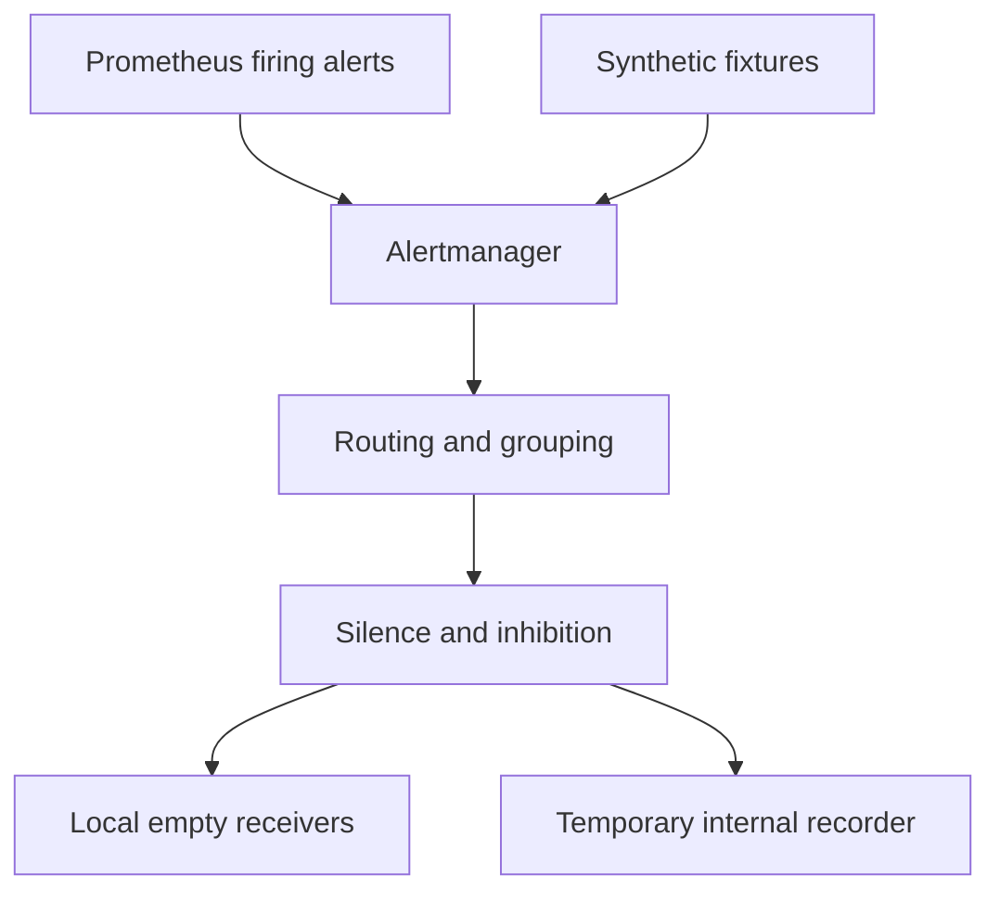

# Lab 24: Alertmanager Routing, Grouping, Inhibition, and Silences

## Purpose and Scope

> **Primary Objective:** Prove real alert receipt and test routing, notification grouping/repetition, scoped suppression and resolution delivery without external credentials.

Prometheus evaluates conditions; Alertmanager controls notifications. A silence cannot repair a dependency, and an API entry does not by itself prove notification delivery.

This lab starts Alertmanager and briefly uses a small internal webhook recorder for synthetic delivery fixtures. Ordinary learning alerts have local receivers without external integrations. Only explicitly labeled fixtures reach the recorder, which is stopped afterward. No email, chat or public webhook is contacted.

## 1. Inherited State and Starting Checks

```bash
source lab-notes/session.sh
source lab-notes/evidence.sh
source lab-notes/raw-metrics.sh
source lab-notes/metrics-session.sh
metrics_check
start_lab 24
```

Complete [Lab 23](Lab-23.md) first. Run commands from the repository root in the same Bash session. Keep the existing credentials, named volumes and checkpoint item. Start with eight healthy services and no injected outage. Alertmanager remains pinned to `0.34.0`. End with nine services; the temporary recorder is a tenth only during its test.

## 2. Learning Objectives and Delivery Flow

You will prove Prometheus-to-Alertmanager receipt, validate routes before injecting events, observe grouped/repeated/resolved HTTP deliveries, silence one warning and test inhibition with a negative control.



Capture alert receipt, notification dispatch, silence creation/expiry, inhibition and recovery as separate events. A successful recorder acknowledgment proves local receiver delivery, not human acknowledgment.

## 3. Install Routing, Grouping and Inhibition

```bash
source lab-notes/alert-session.sh
wait_rule_state RedisDegraded inactive
mkdir -p lab-notes/alertmanager/templates
chmod 755 lab-notes/alertmanager lab-notes/alertmanager/templates
```

```bash
cat > lab-notes/alertmanager/alertmanager.yml <<'YAML'
global:
  resolve_timeout: 5m
route:
  receiver: local-default
  group_by: [alertname, service, environment]
  group_wait: 15s
  group_interval: 30s
  repeat_interval: 4h
  routes:
    - receiver: local-recorder
      matchers: ['lab="notification-fixture"']
      group_wait: 2s
      group_interval: 5s
      repeat_interval: 10s
    - receiver: local-critical
      matchers: ['severity="critical"']
    - receiver: local-warning
      matchers: ['severity="warning"']
receivers:
  - name: local-default
  - name: local-critical
  - name: local-warning
  - name: local-recorder
    webhook_configs:
      - url: http://lab24-receiver:8088/alerts
        send_resolved: true
inhibit_rules:
  - source_matchers: ['alertname="PostgresUnavailable"', 'severity="critical"']
    target_matchers: ['alertname=~"FastAPIHighServerErrorRatio|FastAPIHighLatency"']
    equal: [service, environment]
templates:
  - /etc/alertmanager/templates/*.tmpl
YAML
```

```bash
cat > lab-notes/alertmanager/templates/default.tmpl <<'TEMPLATE'
{{ define "learning.summary" -}}
[{{ .Status | toUpper }}] {{ .CommonLabels.service }} / {{ .CommonLabels.environment }}
{{ range .Alerts }}{{ .Labels.alertname }}: {{ .Annotations.summary }}
{{ end }}
{{- end }}
TEMPLATE
```

The root groups by alert name/service/environment. The first matching child route wins unless `continue` is enabled. The fixture route precedes severity routing and uses short timers only for deterministic local tests.

`group_wait` delays the first notification; `group_interval` controls later group processing; `repeat_interval` controls unchanged firing reminders. Ten seconds is a multiple of the fixture's five-second processing interval. Ordinary alerts retain a four-hour repeat.

The template is available for human-readable receiver formats; native webhook JSON does not render it. Empty local receivers intentionally send nothing externally. See [Alertmanager configuration](https://prometheus.io/docs/alerting/latest/configuration/).

## 4. Add the Minimal Temporary Recorder

```bash
cat > lab-notes/notification_recorder.py <<'PYTHON'
"""Temporary internal-only synthetic Alertmanager webhook recorder."""

import json
from datetime import datetime, timezone
from http.server import BaseHTTPRequestHandler, ThreadingHTTPServer


class Handler(BaseHTTPRequestHandler):
    def do_GET(self):
        self.send_response(200 if self.path == "/health" else 404)
        self.end_headers()

    def do_POST(self):
        if self.path != "/alerts":
            self.send_error(404)
            return
        try:
            length = int(self.headers.get("Content-Length", "0"))
            if not 0 < length <= 1024 * 1024:
                raise ValueError("Invalid length")
            self.connection.settimeout(5)
            payload = json.loads(self.rfile.read(length))
            if not isinstance(payload, dict) or not isinstance(
                payload.get("alerts"), list
            ):
                raise ValueError("Invalid payload")
        except (ValueError, TimeoutError):
            self.send_error(400)
            return
        print(
            json.dumps(
                {
                    "timestamp": datetime.now(timezone.utc).isoformat(),
                    "event": "notification_received",
                    "payload": payload,
                }
            ),
            flush=True,
        )
        self.send_response(200)
        self.end_headers()

    def log_message(self, format, *args):
        return


if __name__ == "__main__":
    ThreadingHTTPServer(("0.0.0.0", 8088), Handler).serve_forever()
PYTHON
```

```bash
cat > lab-notes/compose.alertmanager.yaml <<'YAML'
services:
  alertmanager:
    volumes: !override
      - ./lab-notes/alertmanager:/etc/alertmanager:ro
      - type: volume
        source: alertmanager-data
        target: /alertmanager
        volume:
          nocopy: true
  lab24-receiver:
    image: python:3.12.14-slim-bookworm
    profiles: [notification-fixture]
    user: "10001:10001"
    read_only: true
    restart: "no"
    mem_limit: 64m
    networks: [platform]
    cap_drop: [ALL]
    security_opt: [no-new-privileges:true]
    environment:
      PYTHONUNBUFFERED: "1"
      PYTHONDONTWRITEBYTECODE: "1"
    command: [python, /work/notification_recorder.py]
    volumes:
      - ./lab-notes/notification_recorder.py:/work/notification_recorder.py:ro
    logging:
      driver: json-file
      options:
        max-size: 5m
        max-file: "2"
    healthcheck:
      test: [CMD, python, -c, "import urllib.request; urllib.request.urlopen('http://127.0.0.1:8088/health', timeout=2).read()"]
      interval: 5s
      timeout: 3s
      retries: 6
YAML
```

This extra service is needed to observe real notification payloads and repeats. It is a fixture, not another log collector. It exposes no host port and has a non-root UID, read-only filesystem, bounded memory/logging and dropped capabilities.

The Alertmanager `!override` mount list retains its named data volume and replaces the original file/template mounts with a directory mount. The profile prevents the recorder from starting as part of the normal stage.

## 5. Connect Prometheus and Start Alertmanager

```bash
cat > lab-notes/prometheus/prometheus.yml <<'YAML'
global:
  scrape_interval: 15s
  scrape_timeout: 5s
  evaluation_interval: 15s
scrape_configs:
- job_name: fastapi
  metrics_path: /metrics
  file_sd_configs:
  - files:
    - /etc/prometheus/labs/app-targets.json
    refresh_interval: 5s
  sample_limit: 5000
  label_limit: 12
  label_name_length_limit: 80
  label_value_length_limit: 128
  body_size_limit: 2MB
  relabel_configs:
  - source_labels:
    - monitoring
    regex: disabled
    action: drop
  - source_labels:
    - environment
    target_label: environment
    action: lowercase
  - target_label: telemetry_role
    replacement: application
  - regex: monitoring|lab_discovery_note
    action: labeldrop
  metric_relabel_configs:
  - source_labels:
    - __name__
    regex: application_.*_created
    action: drop
  - source_labels:
    - request_id
    regex: .+
    action: drop
  - source_labels:
    - event_id
    regex: .+
    action: drop
  - source_labels:
    - item_id
    regex: .+
    action: drop
  - source_labels:
    - user_id
    regex: .+
    action: drop
  - source_labels:
    - trace_id
    regex: .+
    action: drop
- job_name: prometheus
  static_configs:
  - targets:
    - prometheus:9090
- job_name: node
  static_configs:
  - targets:
    - host-metrics:9100
- job_name: postgres
  static_configs:
  - targets:
    - postgres-exporter:9187
- job_name: redis
  static_configs:
  - targets:
    - redis-exporter:9121
- job_name: alertmanager
  static_configs:
  - targets:
    - alertmanager:9093
rule_files:
- /etc/prometheus/labs/recording-rules.yml
- /etc/prometheus/labs/application-alerts.yml
alerting:
  alertmanagers:
  - api_version: v2
    static_configs:
    - targets:
      - alertmanager:9093
YAML
```

```bash
cat > lab-notes/alertmanager-session.sh <<'BASH'
export ALERTMANAGER_URL="${ALERTMANAGER_URL:-http://127.0.0.1:9093}"
am() { dm exec -T alertmanager /bin/amtool --alertmanager.url=http://127.0.0.1:9093 "$@"; }
wait_alertmanager() {
  local attempt
  for attempt in {1..60}; do
    if api -fsS "$ALERTMANAGER_URL/-/ready" >/dev/null 2>&1; then return 0; fi
    sleep 1
  done
  echo 'Alertmanager readiness deadline exceeded' >&2
  return 1
}
wait_am_state() {
  local name="$1" service="$2" expected="$3" attempt
  for attempt in {1..90}; do
    if api -fsS "$ALERTMANAGER_URL/api/v2/alerts" | jq -e --arg name "$name" --arg service "$service" --arg state "$expected" \
      '[.[]|select(.labels.alertname==$name and .labels.service==$service)] as $a | if $state=="absent" then ($a|length)==0 else ($a|length)>0 and all($a[]; .status.state==$state) end' >/dev/null; then return 0; fi
    sleep 1
  done
  printf 'Alertmanager state deadline: %s / %s / %s\n' "$name" "$service" "$expected" >&2
  return 1
}
wait_notification_count() {
  local state="$1" minimum="$2" attempt
  for attempt in {1..60}; do
    dm logs --no-color --no-log-prefix lab24-receiver > "$LAB_DIR/notifications.jsonl" || return 1
    if jq -s -e --arg state "$state" --argjson minimum "$minimum" \
      '[.[]|select(.event=="notification_received" and .payload.status==$state)]|length >= $minimum' "$LAB_DIR/notifications.jsonl" >/dev/null; then return 0; fi
    sleep 1
  done
  echo 'Notification count deadline exceeded' >&2
  return 1
}
BASH
```

```bash
chmod 644 lab-notes/notification_recorder.py lab-notes/alertmanager/alertmanager.yml \
  lab-notes/alertmanager/templates/default.tmpl lab-notes/prometheus/prometheus.yml
source lab-notes/metrics-session.sh
source lab-notes/alertmanager-session.sh
dm config --quiet
dm run --rm -T --no-deps --entrypoint /bin/amtool alertmanager check-config /etc/alertmanager/alertmanager.yml
record_change "start_alertmanager_and_connect_prometheus" planned
dm up -d alertmanager
wait_alertmanager
reload_prometheus
wait_target alertmanager up
metrics_check
api -fsS "$PROM_URL/api/v1/alertmanagers" > "$LAB_DIR/alertmanager-discovery.json"
```

The configuration retains all earlier jobs and rules, adds Alertmanager's real metrics endpoint as job six, and sends alerts to its API v2 endpoint. Expect nine running services; the recorder is still stopped.

Browse `http://127.0.0.1:9093` locally or tunnel that loopback port as in Lab 19. This single instance is not highly available and its administrative API must not be published publicly.

## 6. Assert Route Selection

```bash
am config routes test --config.file=/etc/alertmanager/alertmanager.yml \
  --verify.receivers=local-warning alertname=RedisDegraded severity=warning service="$LAB_SERVICE" environment="$LAB_ENVIRONMENT"
am config routes test --config.file=/etc/alertmanager/alertmanager.yml \
  --verify.receivers=local-critical alertname=PostgresUnavailable severity=critical service="$LAB_SERVICE" environment="$LAB_ENVIRONMENT"
am config routes test --config.file=/etc/alertmanager/alertmanager.yml \
  --verify.receivers=local-recorder lab=notification-fixture severity=critical
am config routes test --config.file=/etc/alertmanager/alertmanager.yml \
  --verify.receivers=local-default alertname=UnclassifiedLearningFixture
```

Predict receiver names before running the assertions. These tests establish route selection, not delivery timing or inhibition. In particular, the fixture's critical severity does not bypass its earlier special route.

## 7. Prove Receipt and a Scoped Maintenance Silence

```bash
(
  set -euo pipefail
  LAB_SILENCE_ID=""
  cleanup_cache() {
    if [[ -n "$LAB_SILENCE_ID" ]]; then am silence expire "$LAB_SILENCE_ID" >/dev/null || true; fi
    dm start redis >/dev/null
  }
  trap cleanup_cache EXIT
  trap 'exit 130' INT
  trap 'exit 143' TERM
  record_change "alertmanager_redis_receipt_test" planned
  dm stop redis
  api -fsS "$APP_URL/health/ready" > "$LAB_DIR/degraded-readiness.json"
  wait_rule_state RedisDegraded firing
  wait_am_state RedisDegraded "$LAB_SERVICE" active
  api -fsS "$ALERTMANAGER_URL/api/v2/alerts" > "$LAB_DIR/received-warning.json"
  LAB_SILENCE_ID=$(am silence add --duration=5m --author=lab-operator \
    --comment='Bounded cache maintenance exercise' alertname=RedisDegraded "service=$LAB_SERVICE" "environment=$LAB_ENVIRONMENT")
  printf '%s\n' "$LAB_SILENCE_ID" > "$LAB_DIR/silence-id.txt"
  wait_am_state RedisDegraded "$LAB_SERVICE" suppressed
  api -fsS "$ALERTMANAGER_URL/api/v2/alerts" > "$LAB_DIR/silenced-warning.json"
  wait_rule_state RedisDegraded firing
  am silence expire "$LAB_SILENCE_ID"
  LAB_SILENCE_ID=""
  wait_am_state RedisDegraded "$LAB_SERVICE" active
)
wait_ready
wait_rule_state RedisDegraded inactive
wait_am_state RedisDegraded "$LAB_SERVICE" absent
metrics_check
record_change "real_warning_resolved_and_silence_expired" completed
```

Inspect `status.silencedBy` and compare it with the saved ID. Prometheus keeps firing during the silence. Expiration removes suppression without repairing Redis; dependency recovery removes the condition.

The silence has exact alert/service/environment matchers, a comment, owner and safety expiry. Do not create a global regex silence to make the UI look healthy. The trap attempts both silence expiry and Redis recovery on interruption.

## 8. Install Bounded Synthetic Fixtures

```bash
cat > lab-notes/alert_fixture.py <<'PYTHON'
"""Usage: alert_fixture.py notification|inhibition|resolve [SAVED_JSON]"""

import json, sys
from datetime import datetime, timedelta, timezone
from pathlib import Path

now = datetime.now(timezone.utc)


def stamp(t):
    return t.isoformat().replace("+00:00", "Z")


if len(sys.argv) < 2:
    raise SystemExit(__doc__)
mode = sys.argv[1]
if mode == "resolve" and len(sys.argv) == 3:
    alerts = json.loads(Path(sys.argv[2]).read_text())
    for alert in alerts:
        alert["endsAt"] = stamp(now - timedelta(seconds=1))
elif mode in {"notification", "inhibition"} and len(sys.argv) == 2:
    rows = (
        [
            ("NotificationFixture", "routing-fixture", "one"),
            ("NotificationFixture", "routing-fixture", "two"),
        ]
        if mode == "notification"
        else [
            ("PostgresUnavailable", "inhibition-fixture", "source"),
            ("FastAPIHighServerErrorRatio", "inhibition-fixture", "target"),
            ("FastAPIHighServerErrorRatio", "other-service-fixture", "control"),
        ]
    )
    alerts = [
        {
            "labels": {
                "alertname": name,
                "service": service,
                "environment": "test",
                "instance": instance,
                "severity": "critical",
                "team": "platform",
                "lab": mode + "-fixture",
            },
            "annotations": {
                "summary": "Synthetic local lab fixture; no business incident"
            },
            "startsAt": stamp(now - timedelta(seconds=1)),
            "endsAt": stamp(now + timedelta(minutes=5)),
        }
        for name, service, instance in rows
    ]
else:
    raise SystemExit(__doc__)
print(json.dumps(alerts, indent=2))
PYTHON
```

The notification fixture has two instance identities sharing one group. The inhibition fixture has a source, a matching dependent target and a different-service control. Each expires after five minutes without refresh and is clearly labeled synthetic.

These payloads test Alertmanager directly. They do not create fake business metrics or pretend to be Prometheus-generated alerts; the previous section tested the real delivery path. Generate each immediately before posting so its expiry remains useful.

## 9. Observe Grouping, Repetition and Resolved Delivery

```bash
(
  set -euo pipefail
  python3 lab-notes/alert_fixture.py notification > "$LAB_DIR/notification-fixture.json"
  cleanup_notifications() {
    python3 lab-notes/alert_fixture.py resolve "$LAB_DIR/notification-fixture.json" > "$LAB_DIR/notification-resolved.json"
    api -fsS -X POST -H 'Content-Type: application/json' --data-binary @"$LAB_DIR/notification-resolved.json" \
      "$ALERTMANAGER_URL/api/v2/alerts" >/dev/null || true
    dm stop lab24-receiver >/dev/null || true
  }
  trap cleanup_notifications EXIT
  trap 'exit 130' INT
  trap 'exit 143' TERM
  dm up -d --force-recreate --wait --wait-timeout 60 lab24-receiver
  api -fsS -X POST -H 'Content-Type: application/json' --data-binary @"$LAB_DIR/notification-fixture.json" \
    "$ALERTMANAGER_URL/api/v2/alerts" >/dev/null
  wait_notification_count firing 2
  api -fsS "$ALERTMANAGER_URL/api/v2/alerts/groups" > "$LAB_DIR/notification-groups.json"
  python3 lab-notes/alert_fixture.py resolve "$LAB_DIR/notification-fixture.json" > "$LAB_DIR/notification-resolved.json"
  api -fsS -X POST -H 'Content-Type: application/json' --data-binary @"$LAB_DIR/notification-resolved.json" \
    "$ALERTMANAGER_URL/api/v2/alerts" >/dev/null
  wait_notification_count resolved 1
)
wait_am_state NotificationFixture routing-fixture absent
python3 - "$LAB_DIR/notifications.jsonl" <<'PYTHON'
import json,sys
from datetime import datetime
rows=[json.loads(x) for x in open(sys.argv[1]) if x.strip()]
firing=[x for x in rows if x['payload']['status']=='firing']
resolved=[x for x in rows if x['payload']['status']=='resolved']
assert len(firing)>=2 and resolved
first,second=firing[:2]
assert first['payload']['groupKey']==second['payload']['groupKey']
assert len(first['payload']['alerts'])==2 and len(second['payload']['alerts'])==2
gap=(datetime.fromisoformat(second['timestamp'])-datetime.fromisoformat(first['timestamp'])).total_seconds()
print({'repeat_gap_seconds':gap,'firing_deliveries':len(firing),'resolved_deliveries':len(resolved)})
PYTHON
```

Before rerunning `--force-recreate`, preserve any previous recorder logs needed; the current helper captures this run's payloads in its evidence directory. Expect grouped payloads with two alerts, at least one unchanged firing repeat and a resolved notification.

The first group waits about two seconds; repeats follow the ten-second policy at group-processing boundaries. Measure timestamps instead of expecting millisecond equality. Inspect `groupLabels`, `commonLabels` and individual instance labels. Grouping preserves individual alerts while reducing messages; deduplication suppresses unchanged messages between repeat opportunities.

## 10. Test Inhibition With a Negative Control

```bash
(
  set -euo pipefail
  python3 lab-notes/alert_fixture.py inhibition > "$LAB_DIR/inhibition-fixture.json"
  cleanup_inhibition() {
    python3 lab-notes/alert_fixture.py resolve "$LAB_DIR/inhibition-fixture.json" > "$LAB_DIR/inhibition-resolved.json"
    api -fsS -X POST -H 'Content-Type: application/json' --data-binary @"$LAB_DIR/inhibition-resolved.json" \
      "$ALERTMANAGER_URL/api/v2/alerts" >/dev/null || true
  }
  trap cleanup_inhibition EXIT
  trap 'exit 130' INT
  trap 'exit 143' TERM
  api -fsS -X POST -H 'Content-Type: application/json' --data-binary @"$LAB_DIR/inhibition-fixture.json" \
    "$ALERTMANAGER_URL/api/v2/alerts" >/dev/null
  wait_am_state FastAPIHighServerErrorRatio inhibition-fixture suppressed
  wait_am_state FastAPIHighServerErrorRatio other-service-fixture active
  api -fsS "$ALERTMANAGER_URL/api/v2/alerts" > "$LAB_DIR/inhibition-observed.json"
  jq -e '[.[]|select(.labels.lab=="inhibition-fixture" and .labels.instance=="target")|.status.inhibitedBy|length] | length==1 and all(.>0)' \
    "$LAB_DIR/inhibition-observed.json"
)
wait_am_state PostgresUnavailable inhibition-fixture absent
wait_am_state FastAPIHighServerErrorRatio inhibition-fixture absent
wait_am_state FastAPIHighServerErrorRatio other-service-fixture absent
```

The source and intended target share service/environment. The control differs in service and must stay active. `inhibitedBy` proves inhibition rather than a coincidental silence.

Missing equality labels can unintentionally match each other. Maintain those labels in the rule contract and test negative cases. Inhibition suppresses notifications, not Prometheus evaluation or the underlying failure.

## 11. Final Recovery and Troubleshooting

```bash
dm stop lab24-receiver
api -fsS "$ALERTMANAGER_URL/api/v2/alerts" > "$LAB_DIR/final-alerts.json"
api -fsS "$ALERTMANAGER_URL/api/v2/silences" > "$LAB_DIR/final-silences.json"
dm logs --no-color --since 15m alertmanager > "$LAB_DIR/alertmanager.log"
metrics_check
record_change "notification_tests_complete_and_fixtures_resolved" completed
```

Verify Redis is healthy, the lab silence expired, synthetic alerts resolved and the recorder stopped. Investigate unrelated alerts; do not clear all alerts/silences to satisfy a check.

| Symptom | Inspect | Action |
|---|---|---|
| Prometheus fires but no receipt | Alertmanager discovery and notifier logs | Verify internal v2 destination/network |
| Wrong receiver | Child order and exact labels | Use routes test before changing policy |
| No webhook payload | Fixture label, recorder health and timers | Check internal DNS/port and special route |
| Too many groups | Group labels | Keep instance out of this fixture's grouping key |
| Suppressed unexpectedly | silencedBy/inhibitedBy and matchers | Narrow scope and inspect expiry/equality labels |
| Extra service at end | Recorder still running | Save its logs and stop only that fixture |

After interruption, explicitly start Redis, expire the saved silence if active, post resolved forms of saved fixtures and stop the recorder. Five-minute expiry is a fallback, not recovery proof.

## 12. Knowledge Check

1. What differs among the three group timers?
2. What proves delivery?
3. Why test an inhibition control?

### Answer Guide

1. Initial delay, later group-processing cadence and unchanged firing reminder interval.
2. A payload received and acknowledged by the intended receiver.
3. It detects overly broad suppression of an unrelated service.

## 13. Professional Scenario Exercise

A maintenance silence suppresses another service. Reconstruct matchers, ownership, times and labels; restore narrow suppression and propose a negative-control test that prevents recurrence.

## 14. Lab Notebook Template

Create a notebook in the evidence directory for this run:

```bash
test -e "$LAB_DIR/notebook.md" || printf '# Lab 24 Evidence\n' > "$LAB_DIR/notebook.md"
```

Use these headings and fill them with your predictions, commands, observed results and conclusions:

```markdown
# Lab 24 Evidence

## Starting state and operational question
## Prediction before the change
## Commands and timestamps
## Observed results and source evidence
## Unexpected findings and troubleshooting
## Recovery proof and remaining limitations
```

## 15. Observable Completion Criteria

- [ ] Routes select the intended receivers.
- [ ] A real warning reaches Alertmanager and remains firing while silenced.
- [ ] Grouped, repeated and resolved webhook deliveries are captured.
- [ ] Inhibition affects the intended target but not the control.
- [ ] Nine services remain healthy with fixtures and silence cleaned up.

## 16. Production Implications

Protect Alertmanager administrative APIs and establish real ownership/escalation. A local receiver proves mechanics without contacting people. Short fixture timers and empty ordinary receivers are learning policies, not production paging.

## 17. End State and Transition

Keep nine services and six jobs, recorder stopped and no lab silence active. [Lab 25](Lab-25.md) defines user-facing SLIs, SLOs and request budgets.
