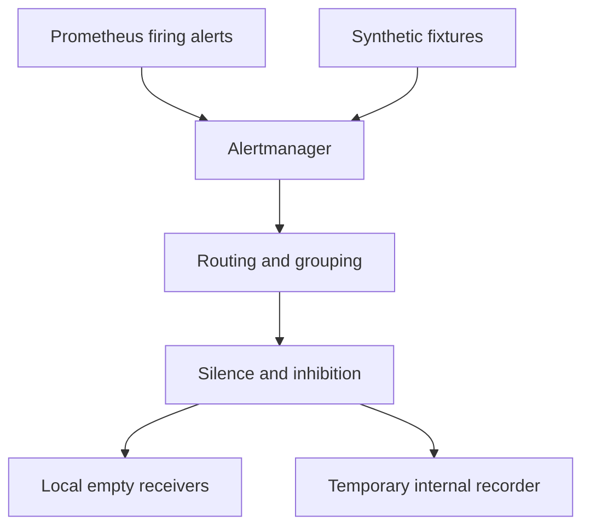

# Lab 24: Alertmanager Routing, Grouping, Inhibition, and Silences

## 1. Purpose and Learning Outcomes

**In Plain Language:** You will follow a firing alert into Alertmanager and check what happens to its notifications. Routing chooses a receiver, grouping combines related alerts, and silences or inhibition suppress selected notifications. A temporary internal recorder will capture grouped, repeated, and resolved messages so you can verify delivery without setting up external messaging accounts.

> **Primary Objective:** Confirm receipt of real alerts and test routing, grouped and repeated notifications, narrowly targeted suppression, and resolved messages without external credentials.

Prometheus evaluates alert conditions. Alertmanager manages notifications. Silencing an alert does not repair its dependency, and seeing an alert in an API does not prove that a notification reached a receiver.

This lab starts Alertmanager and temporarily uses a small internal webhook recorder for synthetic delivery tests. Ordinary learning alerts use local receivers with no external integrations. Only specially labeled test alerts reach the recorder, which is stopped afterward. The experiment contacts no email, chat, or public webhook service.

## 2. Starting Point and Lab Map

Open the complete application repository before using this guide. Unless a step says otherwise, run commands in Bash from the repository's top-level folder. Follow the starting checks in order because later commands depend on the helper functions and running services they prepare.

Read each explanation before running its commands. Run one complete code block, check the result, and then continue. In your notebook, save the commands, what happened, why you think it happened, and anything that differed from the expected result.

### Key Terms

| **Term**   | **Explanation**                                                                     |
| ---------- | ----------------------------------------------------------------------------------- |
| Grouping   | Putting alerts with chosen shared label values into one notification group.         |
| Silence    | A temporary rule that matches alerts and stops their notifications.                 |
| Inhibition | Suppressing a target alert's notifications while a matching source alert is active. |

### Lab Map

The arrows show how the parts connect and where a request can take different paths. Use this map to understand the design. It is not a recording of a request that actually ran.


```mermaid
flowchart TD
    P["Prometheus firing alerts"] --> A["Alertmanager"]
    F["Synthetic fixtures"] --> A
    A --> R["Routing and grouping"]
    R --> S["Silence and inhibition"]
    S --> L["Local empty receivers"]
    S --> W["Temporary internal recorder"]
```

## 3. Guided Walkthrough

### Step 01. Inherited State and Starting Checks

**What You Are Doing:** Begin with no injected fault or leftover lab silence. Alertmanager stays in the continuing stage, while the recorder runs only for this experiment.

**Practical Walkthrough:** Check the existing alerts and remove only the leftover test silences or fixtures identified by the guide. Record unrelated active conditions because they can affect notification timing. Keep Alertmanager afterward, but use the recorder only during its designated test.

Start with recovered dependencies and inspect alerts and silences before adding fixtures. Remove only known leftovers from this exercise. Do not broadly clear Alertmanager state; save any other active conditions as starting context for the observations.

```bash
source lab-notes/session.sh
source lab-notes/evidence.sh
source lab-notes/raw-metrics.sh
source lab-notes/metrics-session.sh
metrics_check
start_lab 24
```

Complete [Lab 23](Lab-23.md) first. Use the repository root and the same Bash session. Keep credentials, named volumes, and the checkpoint item. Begin with eight healthy services and no injected outage. Keep Alertmanager at `0.34.0`. Finish with nine services; the temporary recorder is a tenth service only during testing.

**Understanding the Result:** An old silence can prevent notifications while Prometheus continues firing. Check existing suppression before diagnosing missing delivery.

### Step 02. Learning Objectives and Delivery Flow

**What You Are Doing:** Separate Alertmanager receiving an alert from a receiver getting its notification. An API entry confirms only one stage of that path.

**Practical Walkthrough:** Follow the alert through evaluation, Alertmanager receipt, routing, dispatch, and arrival at the recorder. Collect evidence at each stage. Visibility in Alertmanager does not prove that the chosen receiver received an HTTP payload.

Identify evidence for rule firing, Alertmanager receipt, route choice, dispatch, and recorder arrival. Success at one stage does not establish the next. Use captured recorder payloads to prove delivery rather than assuming every active alert has already sent a notification.

You will confirm Prometheus-to-Alertmanager receipt, test routes before posting alerts, capture grouped, repeated, and resolved deliveries, silence one warning, and test inhibition against an unrelated control alert.

The lab map in Section 2 shows this relationship.

Record receipt, dispatch, silence creation and expiry, inhibition, and recovery as separate events. A successful recorder response proves delivery to this local receiver, not acknowledgment by a person.

**Understanding the Result:** If delivery fails, find the last stage that has evidence of success. An alert being present is not a notification receipt.

### Step 03. Install Routing, Grouping and Inhibition

**What You Are Doing:** Install routing, grouping timers, and inhibition rules. Read child routes in order because an earlier match can determine where an alert goes.

**Practical Walkthrough:** Follow each matching route and identify its receiver, grouping labels, and timers. Then inspect how one alert can inhibit another based on labels. These choices change notification handling, not whether the Prometheus condition is true.

Read routes in order and record the settings of the selected path. Check inhibition's equality labels separately. Routing determines how to handle a notification; inhibition can suppress it while the source condition remains active.

```bash
source lab-notes/alert-session.sh
wait_rule_state RedisDegraded inactive
mkdir -p lab-notes/alertmanager/templates
chmod 755 lab-notes/alertmanager lab-notes/alertmanager/templates
```

```bash
cat > lab-notes/alertmanager/alertmanager.yml <<'YAML'
global:
  resolve_timeout: 5m
route:
  receiver: local-default
  group_by: [alertname, service, environment]
  group_wait: 15s
  group_interval: 30s
  repeat_interval: 4h
  routes:
    - receiver: local-recorder
      matchers: ['lab="notification-fixture"']
      group_wait: 2s
      group_interval: 5s
      repeat_interval: 10s
    - receiver: local-critical
      matchers: ['severity="critical"']
    - receiver: local-warning
      matchers: ['severity="warning"']
receivers:
  - name: local-default
  - name: local-critical
  - name: local-warning
  - name: local-recorder
    webhook_configs:
      - url: http://lab24-receiver:8088/alerts
        send_resolved: true
inhibit_rules:
  - source_matchers: ['alertname="PostgresUnavailable"', 'severity="critical"']
    target_matchers: ['alertname=~"FastAPIHighServerErrorRatio|FastAPIHighLatency"']
    equal: [service, environment]
templates:
  - /etc/alertmanager/templates/*.tmpl
YAML
```

**Command Note:** `<<'YAML'` writes the following text literally until the closing `YAML`. The quoted delimiter prevents Bash from expanding `$variables` inside the file. Creation and execution are separate steps.

```bash
cat > lab-notes/alertmanager/templates/default.tmpl <<'TEMPLATE'
{{ define "learning.summary" -}}
[{{ .Status | toUpper }}] {{ .CommonLabels.service }} / {{ .CommonLabels.environment }}
{{ range .Alerts }}{{ .Labels.alertname }}: {{ .Annotations.summary }}
{{ end }}
{{- end }}
TEMPLATE
```

The root groups alerts by name, service, and environment. The first matching child route wins unless `continue` is enabled. The fixture route comes before severity routes and uses short timers only for the controlled local tests.

`group_wait` delays the first notification. `group_interval` controls later processing of the group. `repeat_interval` controls reminders for unchanged firing alerts. The fixture's ten-second repeat is a multiple of its five-second processing interval. Ordinary alerts keep a four-hour repeat interval.

The template can be used by human-readable receiver formats, but native webhook JSON does not render it. Empty local receivers deliberately send nothing outside the lab. See [Alertmanager configuration](https://prometheus.io/docs/alerting/latest/configuration/).

**Understanding the Result:** Routing, grouping, silences, and inhibition have different roles. Identify which one explains each delay or suppressed notification.

### Step 04. Add the Minimal Temporary Recorder

**What You Are Doing:** Add a temporary internal recorder to capture notification payloads. It provides delivery evidence without an external recipient or a new production logging path.

**Practical Walkthrough:** Create the local receiver and inspect the payloads it records. Keep it internal and temporary. Actual received content confirms delivery more reliably than an assumption that dispatch succeeded.

Check where the recorder saves payloads and how the experiment reads them. Its arrival timestamps let you compare notifications with configured timers. Keep the supplied internal scope and temporary lifecycle.

```bash
cat > lab-notes/notification_recorder.py <<'PYTHON'
"""Temporary internal-only synthetic Alertmanager webhook recorder."""

import json
from datetime import datetime, timezone
from http.server import BaseHTTPRequestHandler, ThreadingHTTPServer


class Handler(BaseHTTPRequestHandler):
    def do_GET(self):
        self.send_response(200 if self.path == "/health" else 404)
        self.end_headers()

    def do_POST(self):
        if self.path != "/alerts":
            self.send_error(404)
            return
        try:
            length = int(self.headers.get("Content-Length", "0"))
            if not 0 < length <= 1024 * 1024:
                raise ValueError("Invalid length")
            self.connection.settimeout(5)
            payload = json.loads(self.rfile.read(length))
            if not isinstance(payload, dict) or not isinstance(
                payload.get("alerts"), list
            ):
                raise ValueError("Invalid payload")
        except (ValueError, TimeoutError):
            self.send_error(400)
            return
        print(
            json.dumps(
                {
                    "timestamp": datetime.now(timezone.utc).isoformat(),
                    "event": "notification_received",
                    "payload": payload,
                }
            ),
            flush=True,
        )
        self.send_response(200)
        self.end_headers()

    def log_message(self, format, *args):
        return


if __name__ == "__main__":
    ThreadingHTTPServer(("0.0.0.0", 8088), Handler).serve_forever()
PYTHON
```

```bash
cat > lab-notes/compose.alertmanager.yaml <<'YAML'
services:
  alertmanager:
    volumes: !override
      - ./lab-notes/alertmanager:/etc/alertmanager:ro
      - type: volume
        source: alertmanager-data
        target: /alertmanager
        volume:
          nocopy: true
  lab24-receiver:
    image: python:3.12.14-slim-bookworm
    profiles: [notification-fixture]
    user: "10001:10001"
    read_only: true
    restart: "no"
    mem_limit: 64m
    networks: [platform]
    cap_drop: [ALL]
    security_opt: [no-new-privileges:true]
    environment:
      PYTHONUNBUFFERED: "1"
      PYTHONDONTWRITEBYTECODE: "1"
    command: [python, /work/notification_recorder.py]
    volumes:
      - ./lab-notes/notification_recorder.py:/work/notification_recorder.py:ro
    logging:
      driver: json-file
      options:
        max-size: 5m
        max-file: "2"
    healthcheck:
      test: [CMD, python, -c, "import urllib.request; urllib.request.urlopen('http://127.0.0.1:8088/health', timeout=2).read()"]
      interval: 5s
      timeout: 3s
      retries: 6
YAML
```

The extra service lets you inspect real notification payloads and repeats. It is a test fixture, not another log collector. It has no host port and uses a non-root UID, a read-only filesystem, limited memory and logging, and dropped capabilities.

Alertmanager's `!override` mount list keeps its named data volume and replaces the original file and template mounts with a directory mount. A profile keeps the recorder from starting with the normal stage.

**Understanding the Result:** The recorder is a test receiver. Its payloads do not replace rule-evaluation evidence or create another application log pipeline.

### Step 05. Connect Prometheus and Start Alertmanager

**What You Are Doing:** Connect Prometheus to Alertmanager and add its monitoring job. Leave the recorder stopped until the delivery test calls for it.

**Practical Walkthrough:** Validate the active configuration, start Alertmanager, and check its new scrape job. Verify Alertmanager health and the Prometheus connection separately. Keep the recorder stopped so later delivery timing begins from the intended state.

Check the Prometheus destination and Alertmanager configuration before startup. Then verify each service and the connection between them. Start the temporary receiver only at its designated step so its availability and notification timing remain controlled.

```bash
cat > lab-notes/prometheus/prometheus.yml <<'YAML'
global:
  scrape_interval: 15s
  scrape_timeout: 5s
  evaluation_interval: 15s
scrape_configs:
- job_name: fastapi
  metrics_path: /metrics
  file_sd_configs:
  - files:
    - /etc/prometheus/labs/app-targets.json
    refresh_interval: 5s
  sample_limit: 5000
  label_limit: 12
  label_name_length_limit: 80
  label_value_length_limit: 128
  body_size_limit: 2MB
  relabel_configs:
  - source_labels:
    - monitoring
    regex: disabled
    action: drop
  - source_labels:
    - environment
    target_label: environment
    action: lowercase
  - target_label: telemetry_role
    replacement: application
  - regex: monitoring|lab_discovery_note
    action: labeldrop
  metric_relabel_configs:
  - source_labels:
    - __name__
    regex: application_.*_created
    action: drop
  - source_labels:
    - request_id
    regex: .+
    action: drop
  - source_labels:
    - event_id
    regex: .+
    action: drop
  - source_labels:
    - item_id
    regex: .+
    action: drop
  - source_labels:
    - user_id
    regex: .+
    action: drop
  - source_labels:
    - trace_id
    regex: .+
    action: drop
- job_name: prometheus
  static_configs:
  - targets:
    - prometheus:9090
- job_name: node
  static_configs:
  - targets:
    - host-metrics:9100
- job_name: postgres
  static_configs:
  - targets:
    - postgres-exporter:9187
- job_name: redis
  static_configs:
  - targets:
    - redis-exporter:9121
- job_name: alertmanager
  static_configs:
  - targets:
    - alertmanager:9093
rule_files:
- /etc/prometheus/labs/recording-rules.yml
- /etc/prometheus/labs/application-alerts.yml
alerting:
  alertmanagers:
  - api_version: v2
    static_configs:
    - targets:
      - alertmanager:9093
YAML
```

```bash
cat > lab-notes/alertmanager-session.sh <<'BASH'
export ALERTMANAGER_URL="${ALERTMANAGER_URL:-http://127.0.0.1:9093}"
am() { dm exec -T alertmanager /bin/amtool --alertmanager.url=http://127.0.0.1:9093 "$@"; }
wait_alertmanager() {
  local attempt
  for attempt in {1..60}; do
    if api -fsS "$ALERTMANAGER_URL/-/ready" >/dev/null 2>&1; then return 0; fi
    sleep 1
  done
  echo 'Alertmanager readiness deadline exceeded' >&2
  return 1
}
wait_am_state() {
  local name="$1" service="$2" expected="$3" attempt
  for attempt in {1..90}; do
    if api -fsS "$ALERTMANAGER_URL/api/v2/alerts" | jq -e --arg name "$name" --arg service "$service" --arg state "$expected" \
      '[.[]|select(.labels.alertname==$name and .labels.service==$service)] as $a | if $state=="absent" then ($a|length)==0 else ($a|length)>0 and all($a[]; .status.state==$state) end' >/dev/null; then return 0; fi
    sleep 1
  done
  printf 'Alertmanager state deadline: %s / %s / %s\n' "$name" "$service" "$expected" >&2
  return 1
}
wait_notification_count() {
  local state="$1" minimum="$2" attempt
  for attempt in {1..60}; do
    dm logs --no-color --no-log-prefix lab24-receiver > "$LAB_DIR/notifications.jsonl" || return 1
    if jq -s -e --arg state "$state" --argjson minimum "$minimum" \
      '[.[]|select(.event=="notification_received" and .payload.status==$state)]|length >= $minimum' "$LAB_DIR/notifications.jsonl" >/dev/null; then return 0; fi
    sleep 1
  done
  echo 'Notification count deadline exceeded' >&2
  return 1
}
BASH
```

**Command Note:** In `jq`, `--arg` passes a string, while `--argjson` passes a JSON value. `-e` makes a false or null final result fail the command, allowing an assertion to stop the block.

```bash
chmod 644 lab-notes/notification_recorder.py lab-notes/alertmanager/alertmanager.yml \
  lab-notes/alertmanager/templates/default.tmpl lab-notes/prometheus/prometheus.yml
source lab-notes/metrics-session.sh
source lab-notes/alertmanager-session.sh
dm config --quiet
dm run --rm -T --no-deps --entrypoint /bin/amtool alertmanager check-config /etc/alertmanager/alertmanager.yml
record_change "start_alertmanager_and_connect_prometheus" planned
dm up -d alertmanager
wait_alertmanager
reload_prometheus
wait_target alertmanager up
metrics_check
api -fsS "$PROM_URL/api/v1/alertmanagers" > "$LAB_DIR/alertmanager-discovery.json"
```

The configuration keeps earlier jobs and rules, adds Alertmanager's real metrics endpoint as the sixth job, and sends alerts to its API v2 endpoint. Expect nine running services, with the recorder still stopped.

Open `http://127.0.0.1:9093` locally, or forward that loopback port as in Lab 19. This single Alertmanager instance is not highly available. Keep its administrative API off public networks.

**Understanding the Result:** Check the new service and its monitoring target separately before submitting test alerts.

### Step 06. Assert Route Selection

**What You Are Doing:** Test route selection with known labels before sending fixtures. This checks receiver choice without mixing in notification timing.

**Practical Walkthrough:** Run the route tests using the given label combinations. Predict which receiver handles each case, including controls that should take a different route. These tests do not wait for grouping or repeat timers.

Use the exact fixture and control labels and inspect the selected receiver. Separating route logic from timing and delivery makes a later missing notification easier to locate.

```bash
am config routes test --config.file=/etc/alertmanager/alertmanager.yml \
  --verify.receivers=local-warning alertname=RedisDegraded severity=warning service="$LAB_SERVICE" environment="$LAB_ENVIRONMENT"
am config routes test --config.file=/etc/alertmanager/alertmanager.yml \
  --verify.receivers=local-critical alertname=PostgresUnavailable severity=critical service="$LAB_SERVICE" environment="$LAB_ENVIRONMENT"
am config routes test --config.file=/etc/alertmanager/alertmanager.yml \
  --verify.receivers=local-recorder lab=notification-fixture severity=critical
am config routes test --config.file=/etc/alertmanager/alertmanager.yml \
  --verify.receivers=local-default alertname=UnclassifiedLearningFixture
```

Predict receiver names before running the assertions. They test route selection, not delivery timing or inhibition. A fixture marked critical still follows its earlier special route rather than bypassing it for severity routing.

**Understanding the Result:** Correct routing is required for delivery, but does not prove it. Later steps test timing and actual receiver arrival.

### Step 07. Prove Receipt and a Scoped Maintenance Silence

**What You Are Doing:** Let a real warning reach Alertmanager, then silence only that alert's intended identity. Prometheus should continue evaluating it while notifications are suppressed.

**Practical Walkthrough:** Confirm the real warning is received, then create a narrowly matched silence. Continue checking Prometheus. A silence changes notification handling; it does not repair Redis or alter the underlying rule lifecycle.

Keep the silence limited to the test alert and save its ID for cleanup. Observe that Prometheus can stay firing while Alertmanager marks it silenced. This proves suppression, not recovery of the dependency.

```bash
(
  set -euo pipefail
  LAB_SILENCE_ID=""
  cleanup_cache() {
    if [[ -n "$LAB_SILENCE_ID" ]]; then am silence expire "$LAB_SILENCE_ID" >/dev/null || true; fi
    dm start redis >/dev/null
  }
  trap cleanup_cache EXIT
  trap 'exit 130' INT
  trap 'exit 143' TERM
  record_change "alertmanager_redis_receipt_test" planned
  dm stop redis
  api -fsS "$APP_URL/health/ready" > "$LAB_DIR/degraded-readiness.json"
  wait_rule_state RedisDegraded firing
  wait_am_state RedisDegraded "$LAB_SERVICE" active
  api -fsS "$ALERTMANAGER_URL/api/v2/alerts" > "$LAB_DIR/received-warning.json"
  LAB_SILENCE_ID=$(am silence add --duration=5m --author=lab-operator \
    --comment='Bounded cache maintenance exercise' alertname=RedisDegraded "service=$LAB_SERVICE" "environment=$LAB_ENVIRONMENT")
  printf '%s\n' "$LAB_SILENCE_ID" > "$LAB_DIR/silence-id.txt"
  wait_am_state RedisDegraded "$LAB_SERVICE" suppressed
  api -fsS "$ALERTMANAGER_URL/api/v2/alerts" > "$LAB_DIR/silenced-warning.json"
  wait_rule_state RedisDegraded firing
  am silence expire "$LAB_SILENCE_ID"
  LAB_SILENCE_ID=""
  wait_am_state RedisDegraded "$LAB_SERVICE" active
)
wait_ready
wait_rule_state RedisDegraded inactive
wait_am_state RedisDegraded "$LAB_SERVICE" absent
metrics_check
record_change "real_warning_resolved_and_silence_expired" completed
```

**Command Note:** `trap ... EXIT` arranges cleanup when the shell exits. Keep it in the same block as the fault. The recovery checks afterward confirm that restoration succeeded.

Compare `status.silencedBy` with the saved silence ID. Prometheus continues firing during the silence. Expiring the silence removes suppression; restoring Redis removes the underlying condition. These are separate actions.

The silence uses exact alert, service, and environment matchers, plus an owner, comment, and expiry. Do not use a global regex silence to make the screen look healthy. On interruption, the trap attempts both silence expiry and Redis restoration.

**Understanding the Result:** A silenced alert can still be firing for a real condition. Remove the lab silence during cleanup instead of changing the rule just to clear the display.

### Step 08. Install Bounded Synthetic Fixtures

**What You Are Doing:** Create short-lived synthetic alerts with fixed labels. Use them to test grouping and inhibition, with a different-service alert as the control that should remain unaffected.

**Practical Walkthrough:** Keep the fixture's service and severity labels exactly as supplied. They determine grouping and inhibition. The other-service control checks that suppression stops at the intended matching boundary.

Review labels and expiry before submitting the fixtures. Do not alter the different-service control. It helps prove that similar severity or alert names do not cause grouping or inhibition across a boundary the policy should preserve.

```bash
cat > lab-notes/alert_fixture.py <<'PYTHON'
"""Usage: alert_fixture.py notification|inhibition|resolve [SAVED_JSON]"""

import json, sys
from datetime import datetime, timedelta, timezone
from pathlib import Path

now = datetime.now(timezone.utc)


def stamp(t):
    return t.isoformat().replace("+00:00", "Z")


if len(sys.argv) < 2:
    raise SystemExit(__doc__)
mode = sys.argv[1]
if mode == "resolve" and len(sys.argv) == 3:
    alerts = json.loads(Path(sys.argv[2]).read_text())
    for alert in alerts:
        alert["endsAt"] = stamp(now - timedelta(seconds=1))
elif mode in {"notification", "inhibition"} and len(sys.argv) == 2:
    rows = (
        [
            ("NotificationFixture", "routing-fixture", "one"),
            ("NotificationFixture", "routing-fixture", "two"),
        ]
        if mode == "notification"
        else [
            ("PostgresUnavailable", "inhibition-fixture", "source"),
            ("FastAPIHighServerErrorRatio", "inhibition-fixture", "target"),
            ("FastAPIHighServerErrorRatio", "other-service-fixture", "control"),
        ]
    )
    alerts = [
        {
            "labels": {
                "alertname": name,
                "service": service,
                "environment": "test",
                "instance": instance,
                "severity": "critical",
                "team": "platform",
                "lab": mode + "-fixture",
            },
            "annotations": {
                "summary": "Synthetic local lab fixture; no business incident"
            },
            "startsAt": stamp(now - timedelta(seconds=1)),
            "endsAt": stamp(now + timedelta(minutes=5)),
        }
        for name, service, instance in rows
    ]
else:
    raise SystemExit(__doc__)
print(json.dumps(alerts, indent=2))
PYTHON
```

The notification fixture has two distinct instances in one group. The inhibition fixture has a source, a matching target, and a different-service control. Each is clearly marked synthetic and expires after five minutes unless refreshed.

These payloads test Alertmanager directly. They do not add fake business metrics or claim to come from Prometheus. The previous section checked the real alert path. Generate each fixture just before posting it so its expiry still leaves time for the test.

**Understanding the Result:** Fixture labels are part of the test design. Casual changes can invalidate the grouping or inhibition comparison.

### Step 09. Observe Grouping, Repetition and Resolved Delivery

**What You Are Doing:** Capture grouped, repeated, and resolved messages at the recorder. Their content and arrival times show actual delivery behavior, beyond merely choosing the right route.

**Practical Walkthrough:** Start the recorder and compare incoming messages with the grouping, repeat, and resolution settings. Save the first group, expected repeats, and resolved notification separately. Receiver arrival is the evidence that the notification completed its path.

Compare arrivals with group wait, group interval, repeat interval, and resolution behavior. Save each payload with its time and alerts. An accepted alert submission proves intake; the recorded webhook proves delivery to this receiver.

```bash
(
  set -euo pipefail
  python3 lab-notes/alert_fixture.py notification > "$LAB_DIR/notification-fixture.json"
  cleanup_notifications() {
    python3 lab-notes/alert_fixture.py resolve "$LAB_DIR/notification-fixture.json" > "$LAB_DIR/notification-resolved.json"
    api -fsS -X POST -H 'Content-Type: application/json' --data-binary @"$LAB_DIR/notification-resolved.json" \
      "$ALERTMANAGER_URL/api/v2/alerts" >/dev/null || true
    dm stop lab24-receiver >/dev/null || true
  }
  trap cleanup_notifications EXIT
  trap 'exit 130' INT
  trap 'exit 143' TERM
  dm up -d --force-recreate --wait --wait-timeout 60 lab24-receiver
  api -fsS -X POST -H 'Content-Type: application/json' --data-binary @"$LAB_DIR/notification-fixture.json" \
    "$ALERTMANAGER_URL/api/v2/alerts" >/dev/null
  wait_notification_count firing 2
  api -fsS "$ALERTMANAGER_URL/api/v2/alerts/groups" > "$LAB_DIR/notification-groups.json"
  python3 lab-notes/alert_fixture.py resolve "$LAB_DIR/notification-fixture.json" > "$LAB_DIR/notification-resolved.json"
  api -fsS -X POST -H 'Content-Type: application/json' --data-binary @"$LAB_DIR/notification-resolved.json" \
    "$ALERTMANAGER_URL/api/v2/alerts" >/dev/null
  wait_notification_count resolved 1
)
wait_am_state NotificationFixture routing-fixture absent
python3 - "$LAB_DIR/notifications.jsonl" <<'PYTHON'
import json,sys
from datetime import datetime
rows=[json.loads(x) for x in open(sys.argv[1]) if x.strip()]
firing=[x for x in rows if x['payload']['status']=='firing']
resolved=[x for x in rows if x['payload']['status']=='resolved']
assert len(firing)>=2 and resolved
first,second=firing[:2]
assert first['payload']['groupKey']==second['payload']['groupKey']
assert len(first['payload']['alerts'])==2 and len(second['payload']['alerts'])==2
gap=(datetime.fromisoformat(second['timestamp'])-datetime.fromisoformat(first['timestamp'])).total_seconds()
print({'repeat_gap_seconds':gap,'firing_deliveries':len(firing),'resolved_deliveries':len(resolved)})
PYTHON
```

Before rerunning `--force-recreate`, save any earlier recorder logs you need. The helper captures this run's payloads in the evidence directory. Expect groups containing two alerts, at least one unchanged firing reminder, and a resolved notification.

The first group waits about two seconds. Reminders follow the ten-second repeat policy at group-processing times, so measure timestamps rather than demanding millisecond equality. Inspect `groupLabels`, `commonLabels`, and instance labels. Grouping keeps the individual alerts while reducing message count; deduplication avoids resending unchanged messages between repeat opportunities.

**Understanding the Result:** Notification timing includes waits and processing. Use measured arrival times rather than assuming immediate dispatch when an alert fires.

### Step 10. Test Inhibition with a Negative Control

**What You Are Doing:** Check that inhibition suppresses the intended target while the other-service control remains active. This verifies the scope set by equality labels.

**Practical Walkthrough:** Compare the inhibited target with the different-service control. Both alert conditions may remain active, but only the matching target's notification should be suppressed. Check the equality labels to explain the difference.

Inspect source and target labels directly. Compare the matched target with the control from another service. The test concerns notification eligibility, not whether either underlying condition has been repaired.

```bash
(
  set -euo pipefail
  python3 lab-notes/alert_fixture.py inhibition > "$LAB_DIR/inhibition-fixture.json"
  cleanup_inhibition() {
    python3 lab-notes/alert_fixture.py resolve "$LAB_DIR/inhibition-fixture.json" > "$LAB_DIR/inhibition-resolved.json"
    api -fsS -X POST -H 'Content-Type: application/json' --data-binary @"$LAB_DIR/inhibition-resolved.json" \
      "$ALERTMANAGER_URL/api/v2/alerts" >/dev/null || true
  }
  trap cleanup_inhibition EXIT
  trap 'exit 130' INT
  trap 'exit 143' TERM
  api -fsS -X POST -H 'Content-Type: application/json' --data-binary @"$LAB_DIR/inhibition-fixture.json" \
    "$ALERTMANAGER_URL/api/v2/alerts" >/dev/null
  wait_am_state FastAPIHighServerErrorRatio inhibition-fixture suppressed
  wait_am_state FastAPIHighServerErrorRatio other-service-fixture active
  api -fsS "$ALERTMANAGER_URL/api/v2/alerts" > "$LAB_DIR/inhibition-observed.json"
  jq -e '[.[]|select(.labels.lab=="inhibition-fixture" and .labels.instance=="target")|.status.inhibitedBy|length] | length==1 and all(.>0)' \
    "$LAB_DIR/inhibition-observed.json"
)
wait_am_state PostgresUnavailable inhibition-fixture absent
wait_am_state FastAPIHighServerErrorRatio inhibition-fixture absent
wait_am_state FastAPIHighServerErrorRatio other-service-fixture absent
```

The source and intended target share service and environment. The control has a different service and must remain active. Check `inhibitedBy` to prove inhibition rather than an unrelated silence.

Missing equality labels can accidentally match one another. Keep those labels in rule definitions and test cases that should not match. Inhibition suppresses notifications, not Prometheus evaluation or the actual failure.

**Understanding the Result:** A control checks where suppression stops. Silencing everything would not demonstrate correctly scoped inhibition.

### Step 11. Final Recovery and Troubleshooting

**What You Are Doing:** Restore Redis, remove the test silence, resolve fixtures, and stop the recorder. Keep unrelated operational alerts and silences intact.

**Practical Walkthrough:** Clean up only the resources and identities created by this exercise. Confirm normal Prometheus and Alertmanager health afterward. Do not clear unrelated state just to get an empty screen.

Compare the final alert and silence lists with this run's saved IDs. Confirm the silence no longer suppresses the test alert, fixtures resolved or expired as specified, and the recorder is stopped. Keep received firing and resolved messages with timestamps as evidence of what happened before cleanup.

```bash
dm stop lab24-receiver
api -fsS "$ALERTMANAGER_URL/api/v2/alerts" > "$LAB_DIR/final-alerts.json"
api -fsS "$ALERTMANAGER_URL/api/v2/silences" > "$LAB_DIR/final-silences.json"
dm logs --no-color --since 15m alertmanager > "$LAB_DIR/alertmanager.log"
metrics_check
record_change "notification_tests_complete_and_fixtures_resolved" completed
```

Verify Redis health, silence expiry, synthetic-alert resolution, and recorder shutdown. Investigate unrelated alerts rather than deleting all alerts or silences to satisfy a check.

| **Symptom**                     | **Inspect**                                | **Action**                                          |
| ------------------------------- | ------------------------------------------ | --------------------------------------------------- |
| Prometheus fires but no receipt | Alertmanager discovery and notifier logs   | Verify the internal v2 destination and network path |
| Wrong receiver                  | Child-route order and exact labels         | Test routes before changing the policy              |
| No webhook payload              | Fixture label, recorder health, and timers | Check internal DNS, port, and the special route     |
| Too many groups                 | Labels used as the grouping key            | Leave instance out of this fixture's grouping key   |
| Suppressed unexpectedly         | silencedBy/inhibitedBy and matchers        | Check scope, expiry, and inhibition equality labels |
| Extra service at end            | Whether the recorder is still running      | Save its logs, then stop only that test service     |

After interruption, explicitly start Redis, expire the saved silence if still active, post resolved versions of saved fixtures, and stop the recorder. Five-minute expiry is a fallback; it does not by itself prove recovery.

**Understanding the Result:** Cleanup ends the experiment without erasing its evidence. Keep payloads and lifecycle times in the notebook.

## 4. Troubleshooting and Diagnosis

Begin with the first result that differed from your prediction. Save the exact error or symptom and identify which service or command produced it. Use the checks below, make the needed fix, and repeat the original check to confirm the problem is resolved.

Use the recovery and troubleshooting checks in Step 11.

## 5. Review and Practice

Answer the questions in your own words before reading the answers. For the scenario, say what you would inspect and exactly what each result would tell you.

### Knowledge Check

1. What differs among the three group timers?
2. What proves delivery?
3. Why test an inhibition control?

#### Answer Guide

1. They control the first notification's delay, later group-processing times, and reminders for unchanged firing alerts.
2. A payload received and acknowledged by the intended receiver proves delivery to that receiver.
3. It detects a policy that also suppresses an unrelated service by mistake.

### Professional Scenario Exercise

A maintenance silence also suppresses another service. Reconstruct its matchers, owner, times, and affected labels. Restore the intended narrow match and propose a control test that would catch this mistake next time.

## 6. Completion Checklist

Tick an item only when you can show its result or saved evidence. Finish the cleanup instructions before starting the next lab.

### Observable Completion Criteria

- [ ] Route tests select the intended receivers.
- [ ] A real warning reaches Alertmanager, and Prometheus remains firing while it is silenced.
- [ ] I have captured grouped, repeated, and resolved webhook messages.
- [ ] Inhibition suppresses the intended target while leaving the control active.
- [ ] Nine services are healthy, and the test fixtures and silence are cleaned up.

## 7. Production Context and Next Lab

### Production Implications

Protect Alertmanager's administrative APIs and assign real notification owners and escalation paths. The local recorder proves mechanics without contacting people. Short test timers and empty ordinary receivers are teaching settings, not a production paging setup.

### End State and Transition

Keep nine services and six jobs. Leave the recorder stopped and no lab silence active. [Lab 25](Lab-25.md) defines user-facing SLIs, SLOs, and request budgets.
