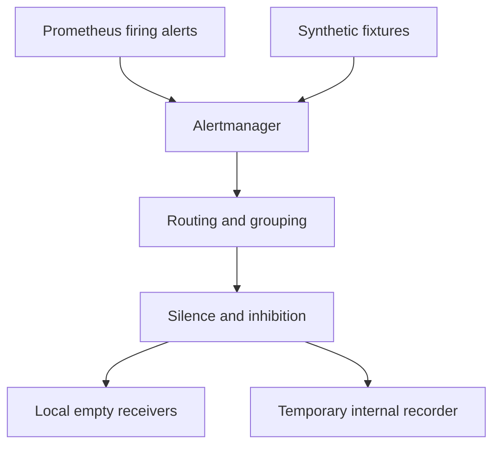

# Lab 24: Alertmanager Routing, Grouping, Inhibition, and Silences

## 1. Purpose and Learning Outcomes

**In Plain Language:** You will follow a firing alert into Alertmanager and then observe notification behavior locally. Routing chooses a receiver, grouping combines related alerts, and silences or inhibition suppress selected notifications. A temporary internal recorder lets you verify actual grouped, repeated, and resolved deliveries without configuring external messaging accounts.

> **Primary Objective:** Prove real alert receipt and test routing, notification grouping/repetition, scoped suppression and resolution delivery without external credentials.

Prometheus evaluates conditions; Alertmanager controls notifications. A silence cannot repair a dependency, and an API entry does not by itself prove notification delivery.

This lab starts Alertmanager and briefly uses a small internal webhook recorder for synthetic delivery fixtures. Ordinary learning alerts have local receivers without external integrations. Only explicitly labeled fixtures reach the recorder, which is stopped afterward. No email, chat or public webhook is contacted.

## 2. Starting Point and Lab Map

Use this guide inside the complete application repository. Run commands from the repository root in Bash unless a step says otherwise. Work through the starting checks in order; they load the helpers and state this lab needs.

Read the explanation before each step, run one complete code block at a time, and compare the actual result with the stated expectation. Save commands, observations, explanations, and unexpected results in your notebook.

### Key Terms

| **Term**   | **Plain-Language Meaning**                                              |
| ---------- | ----------------------------------------------------------------------- |
| Grouping   | Combining alerts with selected shared labels into a notification group. |
| Silence    | A time-limited matcher-based suppression of selected notifications.     |
| Inhibition | Suppressing a target alert while a matching source alert is active.     |

### Lab Map

The arrows show the flow or dependency being studied. Branches identify paths to compare; this is a conceptual map, not a captured runtime trace.


```mermaid
flowchart TD
    P["Prometheus firing alerts"] --> A["Alertmanager"]
    F["Synthetic fixtures"] --> A
    A --> R["Routing and grouping"]
    R --> S["Silence and inhibition"]
    S --> L["Local empty receivers"]
    S --> W["Temporary internal recorder"]
```

## 3. Guided Walkthrough

### Step 01. Inherited State and Starting Checks

**What You Are Doing:** Begin without an active experiment or leftover silence. The local recorder is temporary, while Alertmanager becomes part of the continuing course stage.

**Practical Walkthrough:** Check the existing alert stage and remove only leftover experiment silences or fixtures identified by the guide. Start without an unrelated active fault so notification timing is interpretable. Alertmanager remains in the course baseline, while the local notification recorder is used only during this exercise.

Begin with recovered dependencies and inspect existing alerts and silences before creating fixtures. Remove only identified leftovers from this exercise. An unrelated active alert or silence can change notification observations, so record that starting context rather than broadly clearing Alertmanager state.

```bash
source lab-notes/session.sh
source lab-notes/evidence.sh
source lab-notes/raw-metrics.sh
source lab-notes/metrics-session.sh
metrics_check
start_lab 24
```

Complete [Lab 23](Lab-23.md) first. Run commands from the repository root in the same Bash session. Keep the existing credentials, named volumes and checkpoint item. Start with eight healthy services and no injected outage. Alertmanager remains pinned to `0.34.0`. End with nine services; the temporary recorder is a tenth only during its test.

**Understanding the Result:** A prior silence can suppress delivery without changing Prometheus state. Establish the suppression baseline before diagnosing missing notifications.

### Step 02. Learning Objectives and Delivery Flow

**What You Are Doing:** Follow alert receipt separately from notification dispatch and receipt. Seeing an alert in the API does not prove that a notification payload reached its destination.

**Practical Walkthrough:** Follow an alert through Prometheus evaluation, Alertmanager receipt, routing, notification dispatch, and recorder receipt. Each boundary provides different evidence. An alert visible in Alertmanager proves receipt there, but not successful delivery of a notification to the selected receiver.

Identify evidence for each boundary: rule firing, Alertmanager receipt, route selection, dispatch, and recorder arrival. Visibility at one stage does not establish success at the next. Use actual recorder payloads as delivery evidence rather than assuming an active alert guarantees a notification was received.

You will prove Prometheus-to-Alertmanager receipt, validate routes before injecting events, observe grouped/repeated/resolved HTTP deliveries, silence one warning and test inhibition with a negative control.

The lab map in Section 2 shows this relationship.

Capture alert receipt, notification dispatch, silence creation/expiry, inhibition and recovery as separate events. A successful recorder acknowledgment proves local receiver delivery, not human acknowledgment.

**Understanding the Result:** Locate the last proven boundary when delivery fails. Do not treat alert presence as a notification receipt.

### Step 03. Install Routing, Grouping and Inhibition

**What You Are Doing:** Install the routing tree, grouping timers, and inhibition conditions. Read route order carefully because an earlier matching route can determine the receiver.

**Practical Walkthrough:** Read the routing tree in order and identify the receiver, grouping labels, and timers selected by each matching path. Then read inhibition as suppression based on another alert's labels. These mechanisms affect notification handling without changing the source rule's truth.

Read matching routes in order and record grouping labels and timer values for the selected receiver. Then inspect inhibition equality labels independently. Routing chooses notification handling; inhibition suppresses eligible notifications while the source alert condition can remain true.

```bash
source lab-notes/alert-session.sh
wait_rule_state RedisDegraded inactive
mkdir -p lab-notes/alertmanager/templates
chmod 755 lab-notes/alertmanager lab-notes/alertmanager/templates
```

```bash
cat > lab-notes/alertmanager/alertmanager.yml <<'YAML'
global:
  resolve_timeout: 5m
route:
  receiver: local-default
  group_by: [alertname, service, environment]
  group_wait: 15s
  group_interval: 30s
  repeat_interval: 4h
  routes:
    - receiver: local-recorder
      matchers: ['lab="notification-fixture"']
      group_wait: 2s
      group_interval: 5s
      repeat_interval: 10s
    - receiver: local-critical
      matchers: ['severity="critical"']
    - receiver: local-warning
      matchers: ['severity="warning"']
receivers:
  - name: local-default
  - name: local-critical
  - name: local-warning
  - name: local-recorder
    webhook_configs:
      - url: http://lab24-receiver:8088/alerts
        send_resolved: true
inhibit_rules:
  - source_matchers: ['alertname="PostgresUnavailable"', 'severity="critical"']
    target_matchers: ['alertname=~"FastAPIHighServerErrorRatio|FastAPIHighLatency"']
    equal: [service, environment]
templates:
  - /etc/alertmanager/templates/*.tmpl
YAML
```

**Command Note:** `<<'YAML'` writes the following block literally until `YAML`. Quoting the delimiter prevents Bash from expanding `$variables` inside the generated file; creation and execution are separate steps.

```bash
cat > lab-notes/alertmanager/templates/default.tmpl <<'TEMPLATE'
{{ define "learning.summary" -}}
[{{ .Status | toUpper }}] {{ .CommonLabels.service }} / {{ .CommonLabels.environment }}
{{ range .Alerts }}{{ .Labels.alertname }}: {{ .Annotations.summary }}
{{ end }}
{{- end }}
TEMPLATE
```

The root groups by alert name/service/environment. The first matching child route wins unless `continue` is enabled. The fixture route precedes severity routing and uses short timers only for deterministic local tests.

`group_wait` delays the first notification; `group_interval` controls later group processing; `repeat_interval` controls unchanged firing reminders. Ten seconds is a multiple of the fixture's five-second processing interval. Ordinary alerts retain a four-hour repeat.

The template is available for human-readable receiver formats; native webhook JSON does not render it. Empty local receivers intentionally send nothing externally. See [Alertmanager configuration](https://prometheus.io/docs/alerting/latest/configuration/).

**Understanding the Result:** Routing, grouping, silencing, and inhibition solve different problems. Record which one explains each observed suppression or delay.

### Step 04. Add the Minimal Temporary Recorder

**What You Are Doing:** Add the internal recorder solely to capture notification payloads. It supplies delivery evidence without introducing an external recipient or another production logging path.

**Practical Walkthrough:** Create the internal recorder service so notification payloads have a local, inspectable destination. It records delivery evidence for the experiment without contacting an external recipient. Keep its scope and lifecycle temporary, and inspect actual payloads rather than assuming dispatch succeeded.

Keep the recorder internal and temporary as specified. Review where it stores payloads and how the experiment retrieves them. This local endpoint provides a concrete delivery observation without requiring an external recipient, and its received timestamps let you compare actual notifications with the configured timers.

```bash
cat > lab-notes/notification_recorder.py <<'PYTHON'
"""Temporary internal-only synthetic Alertmanager webhook recorder."""

import json
from datetime import datetime, timezone
from http.server import BaseHTTPRequestHandler, ThreadingHTTPServer


class Handler(BaseHTTPRequestHandler):
    def do_GET(self):
        self.send_response(200 if self.path == "/health" else 404)
        self.end_headers()

    def do_POST(self):
        if self.path != "/alerts":
            self.send_error(404)
            return
        try:
            length = int(self.headers.get("Content-Length", "0"))
            if not 0 < length <= 1024 * 1024:
                raise ValueError("Invalid length")
            self.connection.settimeout(5)
            payload = json.loads(self.rfile.read(length))
            if not isinstance(payload, dict) or not isinstance(
                payload.get("alerts"), list
            ):
                raise ValueError("Invalid payload")
        except (ValueError, TimeoutError):
            self.send_error(400)
            return
        print(
            json.dumps(
                {
                    "timestamp": datetime.now(timezone.utc).isoformat(),
                    "event": "notification_received",
                    "payload": payload,
                }
            ),
            flush=True,
        )
        self.send_response(200)
        self.end_headers()

    def log_message(self, format, *args):
        return


if __name__ == "__main__":
    ThreadingHTTPServer(("0.0.0.0", 8088), Handler).serve_forever()
PYTHON
```

```bash
cat > lab-notes/compose.alertmanager.yaml <<'YAML'
services:
  alertmanager:
    volumes: !override
      - ./lab-notes/alertmanager:/etc/alertmanager:ro
      - type: volume
        source: alertmanager-data
        target: /alertmanager
        volume:
          nocopy: true
  lab24-receiver:
    image: python:3.12.14-slim-bookworm
    profiles: [notification-fixture]
    user: "10001:10001"
    read_only: true
    restart: "no"
    mem_limit: 64m
    networks: [platform]
    cap_drop: [ALL]
    security_opt: [no-new-privileges:true]
    environment:
      PYTHONUNBUFFERED: "1"
      PYTHONDONTWRITEBYTECODE: "1"
    command: [python, /work/notification_recorder.py]
    volumes:
      - ./lab-notes/notification_recorder.py:/work/notification_recorder.py:ro
    logging:
      driver: json-file
      options:
        max-size: 5m
        max-file: "2"
    healthcheck:
      test: [CMD, python, -c, "import urllib.request; urllib.request.urlopen('http://127.0.0.1:8088/health', timeout=2).read()"]
      interval: 5s
      timeout: 3s
      retries: 6
YAML
```

This extra service is needed to observe real notification payloads and repeats. It is a fixture, not another log collector. It exposes no host port and has a non-root UID, read-only filesystem, bounded memory/logging and dropped capabilities.

The Alertmanager `!override` mount list retains its named data volume and replaces the original file/template mounts with a directory mount. The profile prevents the recorder from starting as part of the normal stage.

**Understanding the Result:** The recorder is a test receiver. It is not a second application log pipeline or a replacement for alert evaluation evidence.

### Step 05. Connect Prometheus and Start Alertmanager

**What You Are Doing:** Connect Prometheus to Alertmanager and verify the added monitoring job. Keep the recorder stopped until the delivery experiment needs it.

**Practical Walkthrough:** Connect Prometheus to Alertmanager, validate the active configuration, and start the continuing service and scrape job. Keep the recorder stopped until its experiment step. Verify Alertmanager health and Prometheus connectivity independently so later delivery checks begin from a known working route.

Validate Prometheus-to-Alertmanager configuration and the Alertmanager file before startup. Verify each service's health and the selected connection separately. Leave the temporary recorder for its designated step so notification timing and receiver availability remain controlled during the later delivery experiment.

```bash
cat > lab-notes/prometheus/prometheus.yml <<'YAML'
global:
  scrape_interval: 15s
  scrape_timeout: 5s
  evaluation_interval: 15s
scrape_configs:
- job_name: fastapi
  metrics_path: /metrics
  file_sd_configs:
  - files:
    - /etc/prometheus/labs/app-targets.json
    refresh_interval: 5s
  sample_limit: 5000
  label_limit: 12
  label_name_length_limit: 80
  label_value_length_limit: 128
  body_size_limit: 2MB
  relabel_configs:
  - source_labels:
    - monitoring
    regex: disabled
    action: drop
  - source_labels:
    - environment
    target_label: environment
    action: lowercase
  - target_label: telemetry_role
    replacement: application
  - regex: monitoring|lab_discovery_note
    action: labeldrop
  metric_relabel_configs:
  - source_labels:
    - __name__
    regex: application_.*_created
    action: drop
  - source_labels:
    - request_id
    regex: .+
    action: drop
  - source_labels:
    - event_id
    regex: .+
    action: drop
  - source_labels:
    - item_id
    regex: .+
    action: drop
  - source_labels:
    - user_id
    regex: .+
    action: drop
  - source_labels:
    - trace_id
    regex: .+
    action: drop
- job_name: prometheus
  static_configs:
  - targets:
    - prometheus:9090
- job_name: node
  static_configs:
  - targets:
    - host-metrics:9100
- job_name: postgres
  static_configs:
  - targets:
    - postgres-exporter:9187
- job_name: redis
  static_configs:
  - targets:
    - redis-exporter:9121
- job_name: alertmanager
  static_configs:
  - targets:
    - alertmanager:9093
rule_files:
- /etc/prometheus/labs/recording-rules.yml
- /etc/prometheus/labs/application-alerts.yml
alerting:
  alertmanagers:
  - api_version: v2
    static_configs:
    - targets:
      - alertmanager:9093
YAML
```

```bash
cat > lab-notes/alertmanager-session.sh <<'BASH'
export ALERTMANAGER_URL="${ALERTMANAGER_URL:-http://127.0.0.1:9093}"
am() { dm exec -T alertmanager /bin/amtool --alertmanager.url=http://127.0.0.1:9093 "$@"; }
wait_alertmanager() {
  local attempt
  for attempt in {1..60}; do
    if api -fsS "$ALERTMANAGER_URL/-/ready" >/dev/null 2>&1; then return 0; fi
    sleep 1
  done
  echo 'Alertmanager readiness deadline exceeded' >&2
  return 1
}
wait_am_state() {
  local name="$1" service="$2" expected="$3" attempt
  for attempt in {1..90}; do
    if api -fsS "$ALERTMANAGER_URL/api/v2/alerts" | jq -e --arg name "$name" --arg service "$service" --arg state "$expected" \
      '[.[]|select(.labels.alertname==$name and .labels.service==$service)] as $a | if $state=="absent" then ($a|length)==0 else ($a|length)>0 and all($a[]; .status.state==$state) end' >/dev/null; then return 0; fi
    sleep 1
  done
  printf 'Alertmanager state deadline: %s / %s / %s\n' "$name" "$service" "$expected" >&2
  return 1
}
wait_notification_count() {
  local state="$1" minimum="$2" attempt
  for attempt in {1..60}; do
    dm logs --no-color --no-log-prefix lab24-receiver > "$LAB_DIR/notifications.jsonl" || return 1
    if jq -s -e --arg state "$state" --argjson minimum "$minimum" \
      '[.[]|select(.event=="notification_received" and .payload.status==$state)]|length >= $minimum' "$LAB_DIR/notifications.jsonl" >/dev/null; then return 0; fi
    sleep 1
  done
  echo 'Notification count deadline exceeded' >&2
  return 1
}
BASH
```

**Command Note:** In `jq`, `--arg` supplies a string and `--argjson` supplies a JSON value. `-e` also makes a false or null final result fail the command, so assertions can stop the block.

```bash
chmod 644 lab-notes/notification_recorder.py lab-notes/alertmanager/alertmanager.yml \
  lab-notes/alertmanager/templates/default.tmpl lab-notes/prometheus/prometheus.yml
source lab-notes/metrics-session.sh
source lab-notes/alertmanager-session.sh
dm config --quiet
dm run --rm -T --no-deps --entrypoint /bin/amtool alertmanager check-config /etc/alertmanager/alertmanager.yml
record_change "start_alertmanager_and_connect_prometheus" planned
dm up -d alertmanager
wait_alertmanager
reload_prometheus
wait_target alertmanager up
metrics_check
api -fsS "$PROM_URL/api/v1/alertmanagers" > "$LAB_DIR/alertmanager-discovery.json"
```

The configuration retains all earlier jobs and rules, adds Alertmanager's real metrics endpoint as job six, and sends alerts to its API v2 endpoint. Expect nine running services; the recorder is still stopped.

Browse `http://127.0.0.1:9093` locally or tunnel that loopback port as in Lab 19. This single instance is not highly available and its administrative API must not be published publicly.

**Understanding the Result:** A new service and its monitoring target add separate checks. Confirm both before sending test alerts.

### Step 06. Assert Route Selection

**What You Are Doing:** Test receiver selection with known label combinations before sending fixtures. These checks validate routing decisions independently of notification timing.

**Practical Walkthrough:** Run receiver-selection tests with the documented label combinations. These fixtures answer which route should handle an alert without waiting for grouping or repeat timers. Inspect both expected matches and controls that should follow another route.

Run the positive route fixtures and the controls with their exact labels. Inspect which receiver each case selects before testing timing. These checks isolate routing logic from grouping waits and delivery failures, making a later missing notification easier to diagnose at the correct stage.

```bash
am config routes test --config.file=/etc/alertmanager/alertmanager.yml \
  --verify.receivers=local-warning alertname=RedisDegraded severity=warning service="$LAB_SERVICE" environment="$LAB_ENVIRONMENT"
am config routes test --config.file=/etc/alertmanager/alertmanager.yml \
  --verify.receivers=local-critical alertname=PostgresUnavailable severity=critical service="$LAB_SERVICE" environment="$LAB_ENVIRONMENT"
am config routes test --config.file=/etc/alertmanager/alertmanager.yml \
  --verify.receivers=local-recorder lab=notification-fixture severity=critical
am config routes test --config.file=/etc/alertmanager/alertmanager.yml \
  --verify.receivers=local-default alertname=UnclassifiedLearningFixture
```

Predict receiver names before running the assertions. These tests establish route selection, not delivery timing or inhibition. In particular, the fixture's critical severity does not bypass its earlier special route.

**Understanding the Result:** Correct routing is necessary but not sufficient for delivery. Timing and receiver receipt are tested in later steps.

### Step 07. Prove Receipt and a Scoped Maintenance Silence

**What You Are Doing:** Observe receipt of a real warning, then silence only its intended identity. Prometheus should keep evaluating the condition while Alertmanager suppresses its notifications.

**Practical Walkthrough:** Allow the real warning to reach Alertmanager, then apply a narrowly matched silence to that intended alert identity. Continue inspecting Prometheus to see that its rule still evaluates. The silence changes notifications, not the underlying dependency condition or source alert lifecycle.

Match the silence narrowly to the intended alert and retain its identifier for cleanup. Observe that Prometheus can remain firing while notification is silenced. This demonstrates suppression of delivery, not repair of Redis or cancellation of the rule's underlying condition.

```bash
(
  set -euo pipefail
  LAB_SILENCE_ID=""
  cleanup_cache() {
    if [[ -n "$LAB_SILENCE_ID" ]]; then am silence expire "$LAB_SILENCE_ID" >/dev/null || true; fi
    dm start redis >/dev/null
  }
  trap cleanup_cache EXIT
  trap 'exit 130' INT
  trap 'exit 143' TERM
  record_change "alertmanager_redis_receipt_test" planned
  dm stop redis
  api -fsS "$APP_URL/health/ready" > "$LAB_DIR/degraded-readiness.json"
  wait_rule_state RedisDegraded firing
  wait_am_state RedisDegraded "$LAB_SERVICE" active
  api -fsS "$ALERTMANAGER_URL/api/v2/alerts" > "$LAB_DIR/received-warning.json"
  LAB_SILENCE_ID=$(am silence add --duration=5m --author=lab-operator \
    --comment='Bounded cache maintenance exercise' alertname=RedisDegraded "service=$LAB_SERVICE" "environment=$LAB_ENVIRONMENT")
  printf '%s\n' "$LAB_SILENCE_ID" > "$LAB_DIR/silence-id.txt"
  wait_am_state RedisDegraded "$LAB_SERVICE" suppressed
  api -fsS "$ALERTMANAGER_URL/api/v2/alerts" > "$LAB_DIR/silenced-warning.json"
  wait_rule_state RedisDegraded firing
  am silence expire "$LAB_SILENCE_ID"
  LAB_SILENCE_ID=""
  wait_am_state RedisDegraded "$LAB_SERVICE" active
)
wait_ready
wait_rule_state RedisDegraded inactive
wait_am_state RedisDegraded "$LAB_SERVICE" absent
metrics_check
record_change "real_warning_resolved_and_silence_expired" completed
```

**Command Note:** `trap ... EXIT` schedules cleanup when that shell exits. Keep it in the same block as the fault; the explicit recovery checks afterward confirm that restoration actually succeeded.

Inspect `status.silencedBy` and compare it with the saved ID. Prometheus keeps firing during the silence. Expiration removes suppression without repairing Redis; dependency recovery removes the condition.

The silence has exact alert/service/environment matchers, a comment, owner and safety expiry. Do not create a global regex silence to make the UI look healthy. The trap attempts both silence expiry and Redis recovery on interruption.

**Understanding the Result:** A silenced firing alert remains a real firing condition. Remove the experiment silence during recovery rather than changing the rule to clear the screen.

### Step 08. Install Bounded Synthetic Fixtures

**What You Are Doing:** Create short-lived synthetic alerts with controlled labels. Their identities deliberately test grouping and inhibition while a different-service control tests the boundary.

**Practical Walkthrough:** Create the short-lived synthetic fixtures with their exact service and severity labels. Those labels establish which alerts should group or inhibit one another. Keep the different-service fixture as a negative control, since it tests that suppression does not spread beyond the intended equality boundary.

Review fixture labels and expiration before submission. Keep the different-service alert unchanged as a negative control. Its purpose is to show that grouping or inhibition does not spread across an equality boundary merely because severity or alert names look similar.

```bash
cat > lab-notes/alert_fixture.py <<'PYTHON'
"""Usage: alert_fixture.py notification|inhibition|resolve [SAVED_JSON]"""

import json, sys
from datetime import datetime, timedelta, timezone
from pathlib import Path

now = datetime.now(timezone.utc)


def stamp(t):
    return t.isoformat().replace("+00:00", "Z")


if len(sys.argv) < 2:
    raise SystemExit(__doc__)
mode = sys.argv[1]
if mode == "resolve" and len(sys.argv) == 3:
    alerts = json.loads(Path(sys.argv[2]).read_text())
    for alert in alerts:
        alert["endsAt"] = stamp(now - timedelta(seconds=1))
elif mode in {"notification", "inhibition"} and len(sys.argv) == 2:
    rows = (
        [
            ("NotificationFixture", "routing-fixture", "one"),
            ("NotificationFixture", "routing-fixture", "two"),
        ]
        if mode == "notification"
        else [
            ("PostgresUnavailable", "inhibition-fixture", "source"),
            ("FastAPIHighServerErrorRatio", "inhibition-fixture", "target"),
            ("FastAPIHighServerErrorRatio", "other-service-fixture", "control"),
        ]
    )
    alerts = [
        {
            "labels": {
                "alertname": name,
                "service": service,
                "environment": "test",
                "instance": instance,
                "severity": "critical",
                "team": "platform",
                "lab": mode + "-fixture",
            },
            "annotations": {
                "summary": "Synthetic local lab fixture; no business incident"
            },
            "startsAt": stamp(now - timedelta(seconds=1)),
            "endsAt": stamp(now + timedelta(minutes=5)),
        }
        for name, service, instance in rows
    ]
else:
    raise SystemExit(__doc__)
print(json.dumps(alerts, indent=2))
PYTHON
```

The notification fixture has two instance identities sharing one group. The inhibition fixture has a source, a matching dependent target and a different-service control. Each expires after five minutes without refresh and is clearly labeled synthetic.

These payloads test Alertmanager directly. They do not create fake business metrics or pretend to be Prometheus-generated alerts; the previous section tested the real delivery path. Generate each immediately before posting so its expiry remains useful.

**Understanding the Result:** Fixture identity is part of the test. Changing labels casually can invalidate the grouping or inhibition comparison.

### Step 09. Observe Grouping, Repetition and Resolved Delivery

**What You Are Doing:** Capture grouped, repeated, and resolved payloads at the recorder. Use their actual times and contents to distinguish route correctness from delivery behavior.

**Practical Walkthrough:** Start the recorder and compare notification payload contents and arrival times with grouping, repeat, and resolution settings. Keep the first grouped message, any expected repeat, and resolved delivery separately. Actual receipt is the evidence that the notification completed its path.

Compare actual recorder arrivals with group wait, group interval, repeat interval, and resolution behavior. Save each payload separately with its time and alert contents. An accepted alert submission proves ingestion; only the recorded webhook establishes delivery to this receiver.

```bash
(
  set -euo pipefail
  python3 lab-notes/alert_fixture.py notification > "$LAB_DIR/notification-fixture.json"
  cleanup_notifications() {
    python3 lab-notes/alert_fixture.py resolve "$LAB_DIR/notification-fixture.json" > "$LAB_DIR/notification-resolved.json"
    api -fsS -X POST -H 'Content-Type: application/json' --data-binary @"$LAB_DIR/notification-resolved.json" \
      "$ALERTMANAGER_URL/api/v2/alerts" >/dev/null || true
    dm stop lab24-receiver >/dev/null || true
  }
  trap cleanup_notifications EXIT
  trap 'exit 130' INT
  trap 'exit 143' TERM
  dm up -d --force-recreate --wait --wait-timeout 60 lab24-receiver
  api -fsS -X POST -H 'Content-Type: application/json' --data-binary @"$LAB_DIR/notification-fixture.json" \
    "$ALERTMANAGER_URL/api/v2/alerts" >/dev/null
  wait_notification_count firing 2
  api -fsS "$ALERTMANAGER_URL/api/v2/alerts/groups" > "$LAB_DIR/notification-groups.json"
  python3 lab-notes/alert_fixture.py resolve "$LAB_DIR/notification-fixture.json" > "$LAB_DIR/notification-resolved.json"
  api -fsS -X POST -H 'Content-Type: application/json' --data-binary @"$LAB_DIR/notification-resolved.json" \
    "$ALERTMANAGER_URL/api/v2/alerts" >/dev/null
  wait_notification_count resolved 1
)
wait_am_state NotificationFixture routing-fixture absent
python3 - "$LAB_DIR/notifications.jsonl" <<'PYTHON'
import json,sys
from datetime import datetime
rows=[json.loads(x) for x in open(sys.argv[1]) if x.strip()]
firing=[x for x in rows if x['payload']['status']=='firing']
resolved=[x for x in rows if x['payload']['status']=='resolved']
assert len(firing)>=2 and resolved
first,second=firing[:2]
assert first['payload']['groupKey']==second['payload']['groupKey']
assert len(first['payload']['alerts'])==2 and len(second['payload']['alerts'])==2
gap=(datetime.fromisoformat(second['timestamp'])-datetime.fromisoformat(first['timestamp'])).total_seconds()
print({'repeat_gap_seconds':gap,'firing_deliveries':len(firing),'resolved_deliveries':len(resolved)})
PYTHON
```

Before rerunning `--force-recreate`, preserve any previous recorder logs needed; the current helper captures this run's payloads in its evidence directory. Expect grouped payloads with two alerts, at least one unchanged firing repeat and a resolved notification.

The first group waits about two seconds; repeats follow the ten-second policy at group-processing boundaries. Measure timestamps instead of expecting millisecond equality. Inspect `groupLabels`, `commonLabels` and individual instance labels. Grouping preserves individual alerts while reducing messages; deduplication suppresses unchanged messages between repeat opportunities.

**Understanding the Result:** Delivery timing includes configured waits and processing. Use recorded times rather than assuming a notification is sent immediately when an alert fires.

### Step 10. Test Inhibition with a Negative Control

**What You Are Doing:** Verify inhibition of the intended target and continued activity of the negative control. This checks that equality labels narrow suppression to the correct population.

**Practical Walkthrough:** Inspect the intended inhibited alert alongside the different-service control. The source condition may remain active for both, while only the matching target's notification is suppressed. Verify the equality labels directly to explain why the control remains eligible.

Inspect source and target alert labels directly and compare the intended inhibited case with the other-service control. Both source conditions can remain active while their notification eligibility differs. This comparison tests the scope of inhibition rather than whether either underlying condition was repaired.

```bash
(
  set -euo pipefail
  python3 lab-notes/alert_fixture.py inhibition > "$LAB_DIR/inhibition-fixture.json"
  cleanup_inhibition() {
    python3 lab-notes/alert_fixture.py resolve "$LAB_DIR/inhibition-fixture.json" > "$LAB_DIR/inhibition-resolved.json"
    api -fsS -X POST -H 'Content-Type: application/json' --data-binary @"$LAB_DIR/inhibition-resolved.json" \
      "$ALERTMANAGER_URL/api/v2/alerts" >/dev/null || true
  }
  trap cleanup_inhibition EXIT
  trap 'exit 130' INT
  trap 'exit 143' TERM
  api -fsS -X POST -H 'Content-Type: application/json' --data-binary @"$LAB_DIR/inhibition-fixture.json" \
    "$ALERTMANAGER_URL/api/v2/alerts" >/dev/null
  wait_am_state FastAPIHighServerErrorRatio inhibition-fixture suppressed
  wait_am_state FastAPIHighServerErrorRatio other-service-fixture active
  api -fsS "$ALERTMANAGER_URL/api/v2/alerts" > "$LAB_DIR/inhibition-observed.json"
  jq -e '[.[]|select(.labels.lab=="inhibition-fixture" and .labels.instance=="target")|.status.inhibitedBy|length] | length==1 and all(.>0)' \
    "$LAB_DIR/inhibition-observed.json"
)
wait_am_state PostgresUnavailable inhibition-fixture absent
wait_am_state FastAPIHighServerErrorRatio inhibition-fixture absent
wait_am_state FastAPIHighServerErrorRatio other-service-fixture absent
```

The source and intended target share service/environment. The control differs in service and must stay active. `inhibitedBy` proves inhibition rather than a coincidental silence.

Missing equality labels can unintentionally match each other. Maintain those labels in the rule contract and test negative cases. Inhibition suppresses notifications, not Prometheus evaluation or the underlying failure.

**Understanding the Result:** A negative control tests suppression scope. Silence everywhere would not demonstrate correct inhibition boundaries.

### Step 11. Final Recovery and Troubleshooting

**What You Are Doing:** Restore Redis, remove the experiment's suppression, let fixtures resolve, and stop the recorder. Preserve unrelated operational alerts rather than clearing everything to obtain a clean screen.

**Practical Walkthrough:** Restore Redis, remove the experiment's silence, let synthetic fixtures resolve, and stop the temporary recorder. Verify normal Alertmanager and Prometheus health afterward. Preserve unrelated alerts and silences; cleanup should target only identities and resources created by this lab.

Inspect the final alert and silence listings against the identifiers saved by this run. Confirm the temporary silence no longer suppresses its intended test alert, the synthetic fixtures have resolved or expired as specified, and the recorder is stopped. Keep received firing and resolved payloads with their times so cleanup does not remove the evidence used to explain delivery behavior.

```bash
dm stop lab24-receiver
api -fsS "$ALERTMANAGER_URL/api/v2/alerts" > "$LAB_DIR/final-alerts.json"
api -fsS "$ALERTMANAGER_URL/api/v2/silences" > "$LAB_DIR/final-silences.json"
dm logs --no-color --since 15m alertmanager > "$LAB_DIR/alertmanager.log"
metrics_check
record_change "notification_tests_complete_and_fixtures_resolved" completed
```

Verify Redis is healthy, the lab silence expired, synthetic alerts resolved and the recorder stopped. Investigate unrelated alerts; do not clear all alerts/silences to satisfy a check.

| **Symptom**                     | **Inspect**                               | **Action**                                       |
| ------------------------------- | ----------------------------------------- | ------------------------------------------------ |
| Prometheus fires but no receipt | Alertmanager discovery and notifier logs  | Verify internal v2 destination/network           |
| Wrong receiver                  | Child order and exact labels              | Use routes test before changing policy           |
| No webhook payload              | Fixture label, recorder health and timers | Check internal DNS/port and special route        |
| Too many groups                 | Group labels                              | Keep instance out of this fixture's grouping key |
| Suppressed unexpectedly         | silencedBy/inhibitedBy and matchers       | Narrow scope and inspect expiry/equality labels  |
| Extra service at end            | Recorder still running                    | Save its logs and stop only that fixture         |

After interruption, explicitly start Redis, expire the saved silence if active, post resolved forms of saved fixtures and stop the recorder. Five-minute expiry is a fallback, not recovery proof.

**Understanding the Result:** Recovery closes the experiment without erasing operational evidence. Retain captured payloads and lifecycle times in the notebook.

## 4. Troubleshooting and Diagnosis

Start with the first unexpected result. Record the exact symptom, identify which component produced it, and use the checks below before repeating the experiment. After a fix, repeat the original check and confirm recovery.

Use the recovery and troubleshooting checks in Step 11.

## 5. Review and Practice

Answer the knowledge questions in your own words before reading the answer guide. For the scenario, name the evidence you would collect and the conclusion each observation would support.

### Knowledge Check

1. What differs among the three group timers?
2. What proves delivery?
3. Why test an inhibition control?

#### Answer Guide

1. Initial delay, later group-processing cadence and unchanged firing reminder interval.
2. A payload received and acknowledged by the intended receiver.
3. It detects overly broad suppression of an unrelated service.

### Professional Scenario Exercise

A maintenance silence suppresses another service. Reconstruct matchers, ownership, times and labels; restore narrow suppression and propose a negative-control test that prevents recurrence.

## 6. Completion Checklist

Mark each item only after you can point to its result or evidence file. Complete any cleanup shown here before moving on.

### Observable Completion Criteria

- [ ] Routes select the intended receivers.
- [ ] A real warning reaches Alertmanager and remains firing while silenced.
- [ ] Grouped, repeated and resolved webhook deliveries are captured.
- [ ] Inhibition affects the intended target but not the control.
- [ ] Nine services remain healthy with fixtures and silence cleaned up.

## 7. Production Context and Next Lab

### Production Implications

Protect Alertmanager administrative APIs and establish real ownership/escalation. A local receiver proves mechanics without contacting people. Short fixture timers and empty ordinary receivers are learning policies, not production paging.

### End State and Transition

Keep nine services and six jobs, recorder stopped and no lab silence active. [Lab 25](Lab-25.md) defines user-facing SLIs, SLOs and request budgets.
