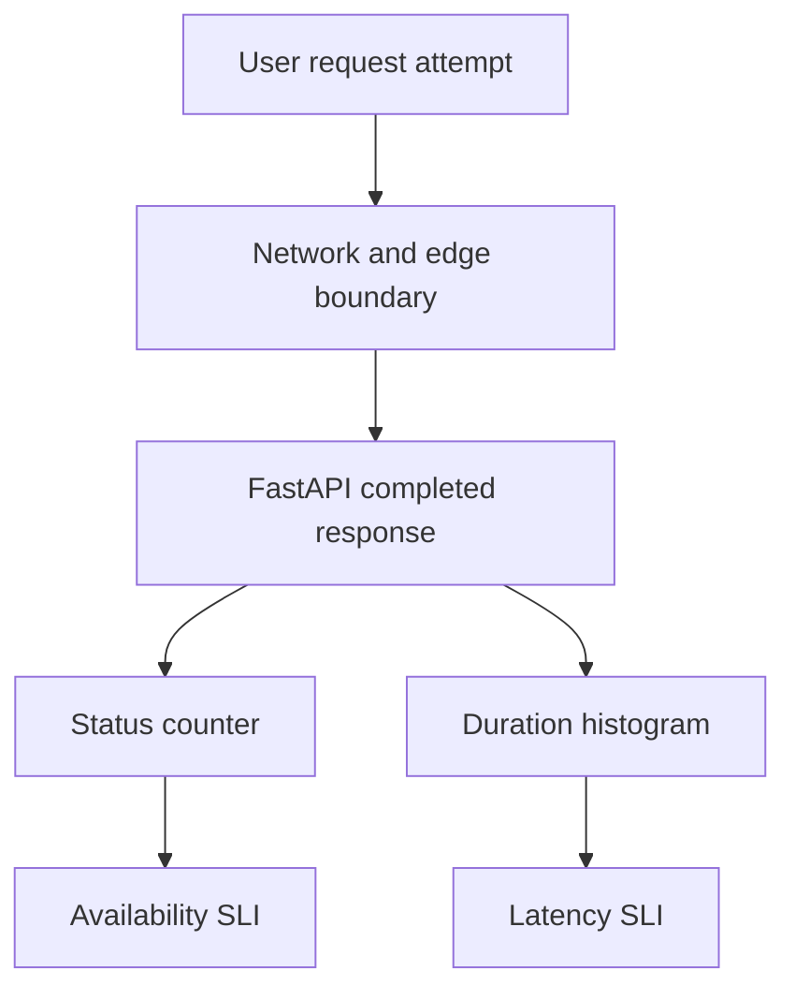

# Lab 25: Define SLIs, SLOs, and Error Budgets

## Purpose and Scope

> **Primary Objective:** Define measurable Items availability and latency populations, validate their implementation and calculate request budgets without overstating data coverage.

An SLI is a measurement with a defined population and observation boundary. An SLO adds a target and a time window. An error budget expresses how much bad service that objective permits.

This lab specifies two Items objectives, implements short-window measurements, tests eligibility with fixtures and real requests, and calculates budgets. It does not implement burn-rate alerts or an SLO operations dashboard; those belong to Lab 26. The local three-day retention cannot prove a complete 30-day SLO.

## 1. Inherited State and Starting Checks

```bash
source lab-notes/session.sh
source lab-notes/evidence.sh
source lab-notes/raw-metrics.sh
source lab-notes/metrics-session.sh
metrics_check
start_lab 25
```

Complete [Lab 24](Lab-24.md) first. Run commands from the repository root in the same Bash session. Keep the existing credentials, named volumes and checkpoint item. Keep nine services and six jobs healthy, the notification recorder stopped, and no lab silence active. Stop other API clients during the exact-population experiment.

## 2. Learning Objectives and Observation Boundary

You will distinguish specification from implementation, define eligible/good/bad events, use a histogram threshold instead of a percentile for a latency ratio, handle zero traffic honestly and calculate a request budget over an explicit observation window.



This implementation observes completed responses inside the app. Connection failures before the app, some disconnects and unobserved process failures are not fully represented. A production user-experience objective may need edge/client or synthetic observations as well. The [SRE workbook on implementing SLOs](https://sre.google/workbook/implementing-slos/) explains why the specification and measurement implementation should be distinguished.

## 3. Write the Two Explicit Contracts

| Field | Availability | Latency |
|---|---|---|
| Service scope | Selected environment/service; normalized Items list and item routes | Same routes |
| Eligible population | Completed 2xx, 3xx and 5xx responses | All completed Items responses, including 4xx |
| Good event | 2xx or 3xx | Duration ≤250 ms |
| Bad event | 5xx | Duration >250 ms |
| Proposed objective | 99.5% good | 99% good |
| Proposed policy window | Rolling 30 days | Rolling 30 days |
| Learning measurement | Raw isolated counter deltas and a 10-minute Prometheus window | Same, with the existing 0.25-second bucket |

The duration histogram has no status-code label. Therefore this lab does **not** claim to measure successful-responses-only latency or the combined “successful and fast” population. A fast 503 can meet the latency threshold while failing availability; evaluate both contracts.

Availability excludes 4xx as a deliberate local policy, not a universal truth. A buggy release causing valid users to receive 4xx could be hidden by this choice. Document and revisit that risk. Demo, health, metrics, documentation and unmatched routes are excluded.

## 4. Save a Concrete Policy Document

```bash
cat > lab-notes/slo-policy.md <<'MARKDOWN'
# Items API learning SLO policy

- Owner: platform learning operator.
- Scope: one explicitly selected environment and service; normalized /api/v1/items and /api/v1/items/{item_id} routes.
- Availability: 99.5% of eligible completed 2xx/3xx/5xx responses are 2xx/3xx over a rolling 30-day window.
- Latency: 99% of all completed Items responses, including 4xx, finish within 250 ms over a rolling 30-day window.
- Measurement boundary: application middleware, not complete end-user/network experience.
- Missing traffic/data: undefined or incomplete, never automatically 100% successful.
- Current coverage: local retention is three days; this lab produces short-window learning measurements only.
- Budget policy: investigate accelerated consumption; when the measured budget is exhausted, prioritize reliability and review risky changes with the service owner.
- Review: reassess populations, thresholds, retained history and user expectations before production adoption.
MARKDOWN
```

Targets are explicit teaching proposals. They need stakeholder/user validation before becoming a production commitment. An SLO is not an SLA, and this single-node learning deployment makes no high-availability promise.

## 5. Implement the Short-Window SLI Rules

```bash
cat > lab-notes/prometheus/slo-recording-rules.yml <<'YAML'
groups:
- name: items-sli-learning
  interval: 15s
  rules:
  - record: service:slo_items_eligible_requests:rate5m
    expr: sum by (environment, service) (rate(application_http_requests_total{job="fastapi",route=~"/api/v1/items(/\\{item_id\\})?",status_code=~"2..|3..|5.."}[5m]))
  - record: service:slo_items_bad_requests:rate5m
    expr: sum by (environment, service) (rate(application_http_server_errors_total{job="fastapi",route=~"/api/v1/items(/\\{item_id\\})?"}[5m]))
  - record: service:slo_items_latency_observations:rate5m
    expr: sum by (environment, service) (rate(application_http_request_duration_seconds_count{job="fastapi",route=~"/api/v1/items(/\\{item_id\\})?"}[5m]))
  - record: service:slo_items_latency_good_observations:rate5m
    expr: sum by (environment, service) (rate(application_http_request_duration_seconds_bucket{job="fastapi",route=~"/api/v1/items(/\\{item_id\\})?",le="0.25"}[5m]))
  - record: service:slo_items_availability_error:ratio5m
    expr: (service:slo_items_bad_requests:rate5m / service:slo_items_eligible_requests:rate5m) and on (environment,
      service) (service:slo_items_eligible_requests:rate5m > 0)
  - record: service:slo_items_latency_error:ratio5m
    expr: ((service:slo_items_latency_observations:rate5m - service:slo_items_latency_good_observations:rate5m)
      / service:slo_items_latency_observations:rate5m) and on (environment, service) (service:slo_items_latency_observations:rate5m
      > 0)
YAML
```

```bash
python3 - <<'PYTHON'
from pathlib import Path
p=Path("lab-notes/prometheus/prometheus.yml");t=p.read_text()
anchor="- /etc/prometheus/labs/application-alerts.yml\n"
addition="- /etc/prometheus/labs/slo-recording-rules.yml\n"
if addition not in t:
    assert t.count(anchor)==1, "Inspect the expected Lab 24 configuration"
    p.write_text(t.replace(anchor,anchor+addition))
PYTHON
```

The route regex matches only the two normalized Items routes, including literal `{item_id}` braces. Raw counter rates are aggregated after reset handling. The initialized server-error counter supplies real zero-error observations after a route is exercised, avoiding invented zero series.

Within this one rule group, the first four rules produce rates and the final two compute matching ratios. Positive denominators are required. A rate gauge is not a count; do not sum sampled rates over time and call the result a request total without accounting for cadence/coverage.

## 6. Test Population Definitions and Zero Traffic

```bash
cat > lab-notes/prometheus/slo-tests.yml <<'YAML'
rule_files:
- slo-recording-rules.yml
evaluation_interval: 15s
fuzzy_compare: true
tests:
- name: different availability and latency populations
  interval: 15s
  input_series:
  - series: application_http_requests_total{job="fastapi",environment="local",service="fastapi-items",route="/api/v1/items",method="GET",status_code="200"}
    values: 0+95x20
  - series: application_http_requests_total{job="fastapi",environment="local",service="fastapi-items",route="/api/v1/items",method="GET",status_code="503"}
    values: 0+5x20
  - series: application_http_requests_total{job="fastapi",environment="local",service="fastapi-items",route="/api/v1/items",method="GET",status_code="404"}
    values: 0+20x20
  - series: application_http_server_errors_total{job="fastapi",environment="local",service="fastapi-items",route="/api/v1/items",method="GET"}
    values: 0+5x20
  - series: application_http_request_duration_seconds_count{job="fastapi",environment="local",service="fastapi-items",route="/api/v1/items",method="GET"}
    values: 0+120x20
  - series: application_http_request_duration_seconds_bucket{job="fastapi",environment="local",service="fastapi-items",route="/api/v1/items",method="GET",le="0.25"}
    values: 0+114x20
  promql_expr_test:
  - expr: service:slo_items_eligible_requests:rate5m
    eval_time: 5m
    exp_samples:
    - labels: service:slo_items_eligible_requests:rate5m{environment="local",service="fastapi-items"}
      value: 6.666666666666667
  - expr: service:slo_items_bad_requests:rate5m
    eval_time: 5m
    exp_samples:
    - labels: service:slo_items_bad_requests:rate5m{environment="local",service="fastapi-items"}
      value: 0.3333333333333333
  - expr: service:slo_items_latency_observations:rate5m
    eval_time: 5m
    exp_samples:
    - labels: service:slo_items_latency_observations:rate5m{environment="local",service="fastapi-items"}
      value: 8.0
  - expr: service:slo_items_latency_good_observations:rate5m
    eval_time: 5m
    exp_samples:
    - labels: service:slo_items_latency_good_observations:rate5m{environment="local",service="fastapi-items"}
      value: 7.6
  - expr: round(service:slo_items_availability_error:ratio5m, 0.000001)
    eval_time: 5m
    exp_samples:
    - labels: '{environment="local",service="fastapi-items"}'
      value: 0.05
  - expr: round(service:slo_items_latency_error:ratio5m, 0.000001)
    eval_time: 5m
    exp_samples:
    - labels: '{environment="local",service="fastapi-items"}'
      value: 0.05
- name: idle population stays undefined
  interval: 15s
  input_series:
  - series: application_http_requests_total{job="fastapi",environment="local",service="fastapi-items",route="/api/v1/items",method="GET",status_code="200"}
    values: 0+0x20
  - series: application_http_requests_total{job="fastapi",environment="local",service="fastapi-items",route="/api/v1/items",method="GET",status_code="503"}
    values: 0+0x20
  - series: application_http_requests_total{job="fastapi",environment="local",service="fastapi-items",route="/api/v1/items",method="GET",status_code="404"}
    values: 0+0x20
  - series: application_http_server_errors_total{job="fastapi",environment="local",service="fastapi-items",route="/api/v1/items",method="GET"}
    values: 0+0x20
  - series: application_http_request_duration_seconds_count{job="fastapi",environment="local",service="fastapi-items",route="/api/v1/items",method="GET"}
    values: 0+0x20
  - series: application_http_request_duration_seconds_bucket{job="fastapi",environment="local",service="fastapi-items",route="/api/v1/items",method="GET",le="0.25"}
    values: 0+0x20
  promql_expr_test:
  - expr: service:slo_items_eligible_requests:rate5m
    eval_time: 5m
    exp_samples:
    - labels: service:slo_items_eligible_requests:rate5m{environment="local",service="fastapi-items"}
      value: 0
  - expr: service:slo_items_bad_requests:rate5m
    eval_time: 5m
    exp_samples:
    - labels: service:slo_items_bad_requests:rate5m{environment="local",service="fastapi-items"}
      value: 0
  - expr: service:slo_items_latency_observations:rate5m
    eval_time: 5m
    exp_samples:
    - labels: service:slo_items_latency_observations:rate5m{environment="local",service="fastapi-items"}
      value: 0
  - expr: service:slo_items_latency_good_observations:rate5m
    eval_time: 5m
    exp_samples:
    - labels: service:slo_items_latency_good_observations:rate5m{environment="local",service="fastapi-items"}
      value: 0
  - expr: round(service:slo_items_availability_error:ratio5m, 0.000001)
    eval_time: 5m
    exp_samples: []
  - expr: round(service:slo_items_latency_error:ratio5m, 0.000001)
    eval_time: 5m
    exp_samples: []
YAML
```

```bash
chmod 644 lab-notes/prometheus/slo-recording-rules.yml lab-notes/prometheus/slo-tests.yml
dm run --rm -T --no-deps --entrypoint promtool prometheus check rules /etc/prometheus/labs/slo-recording-rules.yml
dm run --rm -T --no-deps --entrypoint promtool prometheus test rules /etc/prometheus/labs/slo-tests.yml
reload_prometheus
```

Predict the first fixture: each 15-second increment contains 95 successful responses, five server errors and twenty 4xx responses. Availability has 100 eligible and five bad events; latency has 120 observations with 114 within threshold. Both error fractions are 5%, but their denominators differ.

The idle fixture keeps source counters flat and expects no ratio, not a fabricated 100% SLI. Ratio assertions round only for floating-point comparison; the production rule values are not rounded. The fixtures validate semantics without manufacturing real production incidents.

## 7. Prepare a Client Ledger for a Bounded Experiment

```bash
MISSING_ID=$(new_uuid)
: > "$LAB_DIR/slo-client.jsonl"
observe_slo_request() {
  local expected="$1" route="$2" url="$3" status
  shift 3
  status=$(api -sS -o /dev/null -w '%{http_code}' "$@" "$url") || return 1
  if [[ "$status" != "$expected" ]]; then printf 'Unexpected status %s, expected %s\n' "$status" "$expected" >&2; return 1; fi
  printf '{"route":"%s","status":%s}\n' "$route" "$status" >> "$LAB_DIR/slo-client.jsonl"
}
snapshot "$LAB_DIR/slo-before.json"
```

Predict the eligible and total populations for the next sequence before running it. Keep all other clients quiet. The helper uses only fixed normalized route strings in a local ledger; it does not add route IDs or request IDs to Prometheus labels.

## 8. Generate Success, Excluded Outcomes and Failures

```bash
for index in $(seq 1 30); do
  observe_slo_request 200 '/api/v1/items' "$APP_URL/api/v1/items?limit=1"
  sleep 1
done
for index in $(seq 1 5); do
  observe_slo_request 422 '/api/v1/items' "$APP_URL/api/v1/items" -X POST \
    -H 'Content-Type: application/json' -d '{"name":"","price":-1}'
  observe_slo_request 404 '/api/v1/items/{item_id}' "$APP_URL/api/v1/items/$MISSING_ID"
  observe_slo_request 200 '/api/v1/demo/work' "$APP_URL/api/v1/demo/work?iterations=1000&delay_ms=400"
done
(
  set -euo pipefail
  trap 'dm start postgres >/dev/null' EXIT
  trap 'exit 130' INT
  trap 'exit 143' TERM
  record_change "slo_population_six_database_failures" planned
  dm stop postgres
  for index in $(seq 1 6); do
    observe_slo_request 503 '/api/v1/items' "$APP_URL/api/v1/items?limit=1"
    sleep 1
  done
)
wait_ready
snapshot "$LAB_DIR/slo-after.json"
metrics_check
record_change "slo_population_database_recovered" completed
capture_app_logs
```

Expected ledger: 36 availability-eligible requests, six availability failures, and 46 Items latency observations. The ten 4xx responses count only for latency. The five intentionally slow demo calls count in neither Items SLI.

Do not assert a specific latency-good count; actual operation duration determines it. The app can reject a database connection quickly or after a timeout. This experiment changes no schema and creates no valid item rows. The trap restores PostgreSQL on exit.

## 9. Verify the Population Against Raw Metric Deltas

```bash
cat > lab-notes/verify_slo_population.py <<'PYTHON'
"""Usage: verify_slo_population.py BEFORE_JSON AFTER_JSON CLIENT_JSONL"""

import json, math, sys
from pathlib import Path

if len(sys.argv) != 4:
    raise SystemExit(__doc__)
before, after = (json.loads(Path(x).read_text()) for x in sys.argv[1:3])
clients = [
    json.loads(x) for x in Path(sys.argv[3]).read_text().splitlines() if x.strip()
]
routes = {"/api/v1/items", "/api/v1/items/{item_id}"}
chosen = [x for x in clients if x["route"] in routes]
expected = {
    "eligible": sum(
        200 <= x["status"] < 400 or 500 <= x["status"] < 600 for x in chosen
    ),
    "bad": sum(500 <= x["status"] < 600 for x in chosen),
    "latency_observations": len(chosen),
}


def totals(samples):
    result = dict(eligible=0.0, bad=0.0, latency_observations=0.0, latency_good=0.0)
    for s in samples:
        label = s["labels"]
        name = s["name"]
        value = float(s["value"])
        if label.get("route") not in routes:
            continue
        if name == "application_http_requests_total":
            status = int(label["status_code"])
            if 200 <= status < 400 or 500 <= status < 600:
                result["eligible"] += value
        elif name == "application_http_server_errors_total":
            result["bad"] += value
        elif name == "application_http_request_duration_seconds_count":
            result["latency_observations"] += value
        elif (
            name == "application_http_request_duration_seconds_bucket"
            and label.get("le") == "0.25"
        ):
            result["latency_good"] += value
    return result


first, second = totals(before), totals(after)
delta = {k: second[k] - first[k] for k in first}
for k, v in expected.items():
    if not math.isclose(delta[k], v, abs_tol=1e-6):
        raise SystemExit(
            f"Population mismatch for {k}: metrics {delta[k]}, ledger {v}. Check other clients or process restart."
        )
assert 0 <= delta["latency_good"] <= delta["latency_observations"]
print(json.dumps({"client_ledger": expected, "raw_metric_delta": delta}, indent=2))
PYTHON
```

```bash
python3 lab-notes/verify_slo_population.py "$LAB_DIR/slo-before.json" "$LAB_DIR/slo-after.json" \
  "$LAB_DIR/slo-client.jsonl" > "$LAB_DIR/population-proof.json"
jq . "$LAB_DIR/population-proof.json"
```

This comparison uses raw counter differences over an isolated experiment, avoiding rate extrapolation. A mismatch is evidence to investigate: another client, an app restart, a wrong route contract or missing request completion. Do not change expected values just to make the assertion pass.

Use request logs to inspect unexpected statuses. The demo can visibly worsen the broad RED dashboard while leaving the Items SLO unchanged because the populations differ. That is an intentional scope demonstration.

## 10. Query a Clearly Labeled Short Window

```bash
cat > lab-notes/slo_queries.py <<'PYTHON'
"""Usage: slo_queries.py ENVIRONMENT SERVICE WINDOW (for example 10m)"""

import json, re, sys

if len(sys.argv) != 4 or not re.fullmatch(r"[1-9][0-9]*[smhdw]", sys.argv[3]):
    raise SystemExit(__doc__)
environment, service, window = sys.argv[1:]
sel = (
    'job="fastapi",environment='
    + json.dumps(environment)
    + ",service="
    + json.dumps(service)
    + ",route=~"
    + json.dumps(r"/api/v1/items(/\{item_id\})?")
)


def increase(metric, extra=""):
    return (
        "sum by (environment, service) (increase("
        + metric
        + "{"
        + sel
        + extra
        + "}["
        + window
        + "]))"
    )


eligible = increase("application_http_requests_total", ',status_code=~"2..|3..|5.."')
bad = increase("application_http_server_errors_total")
total = increase("application_http_request_duration_seconds_count")
good = increase("application_http_request_duration_seconds_bucket", ',le="0.25"')
print(
    json.dumps(
        {
            "availability_eligible": eligible,
            "availability_bad": bad,
            "latency_observations": total,
            "latency_good": good,
            "availability_sli": f"(1 - ({bad} / {eligible})) and on (environment, service) ({eligible} > 0)",
            "latency_sli": f"({good} / {total}) and on (environment, service) ({total} > 0)",
        },
        indent=2,
    )
)
PYTHON
```

```bash
python3 lab-notes/slo_queries.py "$LAB_ENVIRONMENT" "$LAB_SERVICE" 10m > "$LAB_DIR/slo-queries.json"
sleep 20
EVAL_AT=$(date -u +%s)
for name in availability_eligible availability_bad latency_observations latency_good availability_sli latency_sli; do
  query=$(jq -er --arg name "$name" '.[$name]' "$LAB_DIR/slo-queries.json")
  api -fsS --get --data-urlencode "query=$query" --data-urlencode "time=$EVAL_AT" \
    "$PROM_URL/api/v1/query" > "$LAB_DIR/$name-10m.json"
done
jq . "$LAB_DIR/availability_sli-10m.json" "$LAB_DIR/latency_sli-10m.json"
```

All queries use the same evaluation time. `increase` handles observed counter resets and extrapolates across the selected range, so fractional counts are possible. The ten-minute window can contain earlier traffic; it need not equal this experiment's exact ledger.

Use `le="0.25"` directly for the threshold fraction. A p95 panel does not tell you exactly what fraction met a chosen threshold. Do not filter this histogram by a nonexistent status label.

## 11. Calculate and Interpret Request Error Budgets

```bash
cat > lab-notes/budget.py <<'PYTHON'
"""Request budget calculator; supplied population must have an explicit time window."""

import argparse, json
from decimal import Decimal, InvalidOperation

p = argparse.ArgumentParser()
p.add_argument("--eligible", required=True)
p.add_argument("--bad", required=True)
p.add_argument("--target", required=True)
a = p.parse_args()
try:
    eligible, bad, target = (Decimal(x) for x in (a.eligible, a.bad, a.target))
except InvalidOperation:
    p.error("All values must be numeric")
if not all(x.is_finite() for x in (eligible, bad, target)):
    p.error("Values must be finite")
if not (eligible > 0 and 0 <= bad <= eligible and 0 < target < 1):
    p.error("Require eligible>0, 0<=bad<=eligible, 0<target<1")
allowed = eligible * (1 - target)
result = {
    "eligible": eligible,
    "bad": bad,
    "objective": target,
    "observed_sli": 1 - bad / eligible,
    "allowed_bad": allowed,
    "remaining_bad_budget": allowed - bad,
    "budget_consumed_fraction": bad / allowed,
}
print(json.dumps({k: str(v) for k, v in result.items()}, indent=2))
PYTHON
```

```bash
python3 lab-notes/budget.py --eligible 10000 --bad 40 --target 0.995 > "$LAB_DIR/budget-with-headroom.json"
python3 lab-notes/budget.py --eligible 10000 --bad 70 --target 0.995 > "$LAB_DIR/budget-exhausted.json"
cat "$LAB_DIR/budget-with-headroom.json" "$LAB_DIR/budget-exhausted.json"
ELIGIBLE=$(jq -er '.client_ledger.eligible' "$LAB_DIR/population-proof.json")
BAD=$(jq -er '.client_ledger.bad' "$LAB_DIR/population-proof.json")
python3 lab-notes/budget.py --eligible "$ELIGIBLE" --bad "$BAD" --target 0.995 \
  > "$LAB_DIR/experiment-budget-only.json"
```

For a request population N and objective T, allowed bad events are `N × (1−T)`. Remaining budget is allowed minus observed bad; consumed fraction is bad divided by allowed.

At 10,000 eligible requests and 99.5%, the allowance is 50. Forty errors consume 80% and leave ten; seventy errors consume 140% and leave −20. Preserve negative remaining budget rather than clamping away a breach.

These are request-weighted budgets, not automatically minutes of downtime. Converting the percentage to time assumes a different measurement model. The last calculation describes only the artificial experiment, not 30-day compliance. A zero-event population is rejected because its ratio is undefined.

## 12. Make Coverage and Policy Limitations Visible

Inspect the actual retention flags from Lab 18. A successful `[30d]` query can still return a partial result when only three days are retained. HTTP success and a plausible percentage do not prove complete coverage.

A production reporting system needs sufficient retained data, monitored collection/rule gaps, a declared boundary and an agreed missing-data policy. Do not lengthen retention casually on a modest VM without capacity planning. This lab deliberately leaves retention unchanged.

The simple budget policy prioritizes investigation and reliability work when consumption is high or exhausted. It does not automatically ban every deployment; fixes, security changes and risk decisions need ownership. Lab 26 will add burn-rate alerting over multiple windows using these definitions.

## 13. Recovery and Troubleshooting

```bash
source lab-notes/alert-session.sh
wait_rule_state PostgresUnavailable inactive
api -fsS "$PROM_URL/api/v1/rules?type=record" > "$LAB_DIR/final-recording-rules.json"
api -fsS "$APP_URL/health/ready" > "$LAB_DIR/final-readiness.json"
metrics_check
```

| Symptom | Inspect | Corrective action |
|---|---|---|
| Availability and latency counts differ | Defined eligibility | Expected for 4xx; do not silently change denominators |
| Slow demo leaves SLI unchanged | Items-only route scope | Expected; compare the broad RED panel |
| Latency appears good during 503s | Separate status/latency populations | Evaluate availability as well; fast failure is still failure |
| Empty SLI | Zero traffic, missing series or insufficient history | Distinguish these cases before claiming success |
| Window totals differ from ledger | Extrapolation and earlier traffic | Use exact raw deltas for isolated population proof |
| Budget remaining is negative | Consumption exceeds allowance | Preserve the breach and explain its window |
| 30-day result from three-day storage | Incomplete history | Mark coverage insufficient rather than claiming compliance |

Keep PostgreSQL healthy, retain the six new recording rules and preserve the policy/fixture evidence. There is no new notification policy in this lab.

## 14. Knowledge Check

1. Why can a fast 503 satisfy the latency threshold?
2. Why exclude demo calls here?
3. Why is a 30-day query not proof of 30-day coverage?
4. Why not average successive success percentages?

### Answer Guide

1. Latency and availability measure different populations/outcomes; both must be evaluated.
2. The contract covers Items user functionality, not diagnostic work.
3. The backend can return the partial history it actually has.
4. Different intervals have different event counts; aggregate good and total events before dividing.

## 15. Professional Scenario Exercise

A report says 100% availability during an hour with no requests and a scrape gap. Rewrite the conclusion with traffic and coverage qualifications, then specify what observation would support a defensible user-facing claim.

## 16. Lab Notebook Template

Create a notebook in the evidence directory for this run:

```bash
test -e "$LAB_DIR/notebook.md" || printf '# Lab 25 Evidence\n' > "$LAB_DIR/notebook.md"
```

Use these headings and fill them with your predictions, commands, observed results and conclusions:

```markdown
# Lab 25 Evidence

## Starting state and operational question
## Prediction before the change
## Commands and timestamps
## Observed results and source evidence
## Unexpected findings and troubleshooting
## Recovery proof and remaining limitations
```

## 17. Observable Completion Criteria

- [ ] Availability and latency populations are explicitly different and measurable.
- [ ] Six SLI recordings and zero-traffic fixtures validate.
- [ ] The real client ledger matches raw metric deltas.
- [ ] Threshold latency uses the actual 0.25-second bucket.
- [ ] Budget math handles exhaustion and undefined traffic honestly.
- [ ] Short-window evidence is not mislabeled as 30-day compliance.

## 18. Production Implications

SLOs are agreements about user outcomes, not decorative dashboard thresholds. Revisit eligibility, coverage, low-volume behavior, telemetry failures and ownership before production adoption. Keep request-based and time-based budgets distinct.

## 19. End State and Transition

Keep nine services, six scrape jobs, twelve recording rules and the five operational alerts. [Lab 26](Lab-26.md) uses the defined SLIs for multi-window burn rates and an SLO operations dashboard; it is not implemented in this batch.
