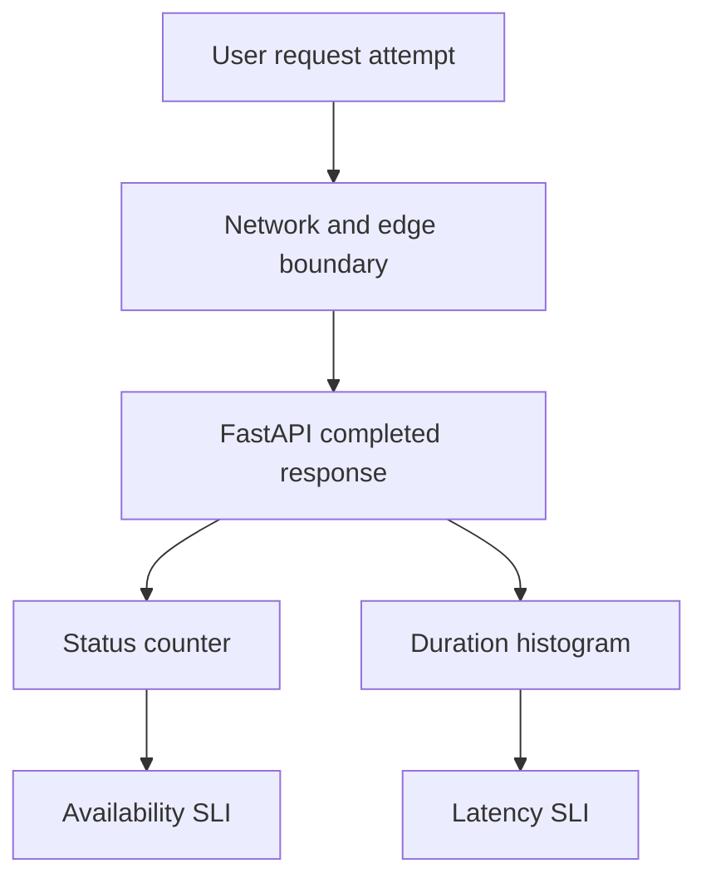

# Lab 25: Define SLIs, SLOs, and Error Budgets

## 1. Purpose and Learning Outcomes

**In Plain Language:** You will decide exactly which requests count toward availability and latency goals. Then you will implement those definitions, test excluded requests and periods with no traffic, and compare a controlled request ledger with raw metric changes. Finally, you will calculate an error budget based on request counts and explain why a short lab window cannot prove a long-term service commitment.

> **Primary Objective:** Define measurable availability and latency results for Items requests, verify that the implementation follows those definitions, and calculate request budgets without claiming more history than the data covers.

An SLI, or service-level indicator, measures a defined set of events at a stated observation point. An SLO, or service-level objective, adds a target and time window. The error budget is the amount of bad service that target allows.

This lab defines two Items objectives, measures them over short windows, tests eligible requests with fixtures and real traffic, and calculates budgets. Burn-rate alerts and an SLO operations dashboard begin in Lab 26. The local three-day retention cannot establish a complete 30-day SLO result.

## 2. Starting Point and Lab Map

Open the complete application repository before using this guide. Unless a step says otherwise, run commands in Bash from the repository's top-level folder. Follow the starting checks in order because later commands depend on the helper functions and running services they prepare.

Read each explanation before running its commands. Run one complete code block, check the result, and then continue. In your notebook, save the commands, what happened, why you think it happened, and anything that differed from the expected result.

### Key Terms

| **Term**     | **Explanation**                                                                 |
| ------------ | ------------------------------------------------------------------------------- |
| SLI          | A measurement of service behavior for a clearly defined set of eligible events. |
| SLO          | The target that measurement should meet over a specified time window.           |
| Error budget | The number or share of bad outcomes allowed by the target and eligible events.  |

### Lab Map

The arrows show how the parts connect and where a request can take different paths. Use this map to understand the design. It is not a recording of a request that actually ran.


```mermaid
flowchart TD
    U["User request attempt"] --> E["Network and edge boundary"]
    E --> A["FastAPI completed response"]
    A --> C["Status counter"]
    A --> H["Duration histogram"]
    C --> S["Availability SLI"]
    H --> L["Latency SLI"]
```

## 3. Guided Walkthrough

### Step 01. Inherited State and Starting Checks

**What You Are Doing:** Check the full stage and stop other API traffic. Exact snapshot comparisons require knowing which requests happened between the measurements.

**Practical Walkthrough:** Verify the alerting stage and stop competing clients before taking snapshots. Keep the app process unchanged and know the requests in the interval. Earlier history may remain in Prometheus, but keep it separate from this controlled sequence.

Take both raw snapshots within one app process lifetime, with unrelated generators stopped. The exact difference needs a controlled interval even though historical Prometheus data remains. Record unexpected traffic or a reset before comparing results with the planned requests.

```bash
source lab-notes/session.sh
source lab-notes/evidence.sh
source lab-notes/raw-metrics.sh
source lab-notes/metrics-session.sh
metrics_check
start_lab 25
```

Complete [Lab 24](Lab-24.md) first. Use the repository root and the same Bash session. Keep credentials, named volumes, and the checkpoint item. All nine services and six jobs should be healthy, the recorder stopped, and the lab silence inactive. Stop other API clients for the exact-count experiment.

**Understanding the Result:** Raw snapshot differences cover the controlled interval. A time-window query can cover other activity too. Establish the known request set before comparing them.

### Step 02. Learning Objectives and Observation Boundary

**What You Are Doing:** Identify where requests are measured before choosing a target. These SLIs cover server-observed completions, not automatically every client attempt.

**Practical Walkthrough:** Find the point where completed responses update the instruments. Requests that never reach the app or never reach that observation point may be missing. Explain this coverage before presenting the result as user experience.

Use the completion observer as the measurement boundary. A client attempt that fails earlier may not enter these counters. State that limit so server-observed availability is not mistaken for a complete record of all attempted requests.

You will distinguish a policy from its implementation, define eligible, good, and bad events, use a histogram threshold for latency, explain zero traffic, and calculate a request budget for a clear time window.

The lab map in Section 2 shows this relationship.

This implementation observes responses completed inside the app. It does not fully represent connection failures before the app, some disconnects, or unobserved process failures. A production user-experience objective may also need edge, client, or synthetic checks. The [SRE workbook on implementing SLOs](https://sre.google/workbook/implementing-slos/) explains why the definition and its measurement implementation must be considered separately.

**Understanding the Result:** The denominator determines which events the SLI can describe. A high percentage does not prove success for attempts the system never observed.

### Step 03. Write the Two Explicit Contracts

**What You Are Doing:** Define eligible and good events separately for availability and latency. The two denominators intentionally count different requests.

**Practical Walkthrough:** Read each eligibility policy on its own. Availability includes the specified success and server-error status classes. Latency includes all completed Items responses, including client errors. Exclude demo routes as stated, and apply each target to its own denominator.

Make separate lists of requests eligible for availability and latency. Check how each treats 4xx rather than assuming the totals must match. Keep Items route selection and demo exclusion explicit; correct arithmetic can still implement the wrong policy.

| **Field**              | **Availability**                                                        | **Latency**                                    |
| ---------------------- | ----------------------------------------------------------------------- | ---------------------------------------------- |
| Service scope          | Selected environment and service; normalized Items list and item routes | The same Items routes                          |
| Eligible population    | Completed 2xx, 3xx, and 5xx responses                                   | All completed Items responses, including 4xx   |
| Good event             | A 2xx or 3xx response                                                   | Duration at or below 250 ms                    |
| Bad event              | A 5xx response                                                          | Duration above 250 ms                          |
| Proposed objective     | 99.5% of eligible responses are good                                    | 99% of eligible responses are good             |
| Proposed policy window | A rolling 30-day window                                                 | A rolling 30-day window                        |
| Learning measurement   | Isolated raw counter changes and a 10-minute Prometheus window          | The same methods, using the 0.25-second bucket |

The duration histogram has no status-code label. This lab therefore does **not** measure latency only for successful responses or the combined “successful and fast” set. A fast 503 can pass the latency threshold while failing availability. Evaluate both definitions together.

Excluding 4xx from availability is a deliberate policy for this lab, not a universal rule. It could hide a release bug that returns 4xx to valid users, so document and revisit that risk. Demo, health, metrics, documentation, and unmatched routes are excluded.

**Understanding the Result:** The different denominators are intentional. Do not quietly change eligibility just to make the availability and latency counts equal.

### Step 04. Save a Concrete Policy Document

**What You Are Doing:** Save the policy before writing its implementation. The target, routes, exclusions, and coverage limits are all part of what the tests must check.

**Practical Walkthrough:** Write a reviewable definition of eligible requests, good outcomes, targets, and coverage. Use the specified 99.5% availability target and 99% latency target at 250 milliseconds. Refer to this document when interpreting test or live results.

Check the saved targets, threshold, routes, and exclusions before writing queries. If the implementation later disagrees with the policy, identify and resolve the mismatch explicitly. Do not silently redefine the goal to fit the output.

```bash
cat > lab-notes/slo-policy.md <<'MARKDOWN'
# Items API learning SLO policy

- Owner: platform learning operator.
- Scope: one explicitly selected environment and service; normalized /api/v1/items and /api/v1/items/{item_id} routes.
- Availability: 99.5% of eligible completed 2xx/3xx/5xx responses are 2xx/3xx over a rolling 30-day window.
- Latency: 99% of all completed Items responses, including 4xx, finish within 250 ms over a rolling 30-day window.
- Measurement boundary: application middleware, not complete end-user/network experience.
- Missing traffic/data: undefined or incomplete, never automatically 100% successful.
- Current coverage: local retention is three days; this lab produces short-window learning measurements only.
- Budget policy: investigate accelerated consumption; when the measured budget is exhausted, prioritize reliability and review risky changes with the service owner.
- Review: reassess populations, thresholds, retained history and user expectations before production adoption.
MARKDOWN
```

**Command Note:** `<<'MARKDOWN'` writes the following text literally until the closing `MARKDOWN`. The quoted delimiter stops Bash from expanding `$variables` inside the file. Creating the file and executing commands are separate actions.

These targets are teaching proposals. Users and stakeholders must validate them before they become production commitments. An SLO is not an SLA, or service-level agreement, and this single-node learning deployment promises no high availability.

**Understanding the Result:** Implement the agreed policy. A convenient query result should not change the definition of good service afterward.

### Step 05. Implement the Short-Window SLI Rules

**What You Are Doing:** Write the short-window rules using the exact normalized Items routes. Preserve reset handling, matching labels, and the latency threshold from the policy.

**Practical Walkthrough:** Use the precise route labels and eligible request sets in the recordings. Handle resets before aggregation and use the existing histogram boundary. Keep each ratio's numerator and denominator on the same window.

Check route-template matching and confirm the required bucket exists. Calculate reset-aware values for original series before combining them. The recordings must follow both policies, including their different eligibility, rather than simply produce similarly named percentages.

```bash
cat > lab-notes/prometheus/slo-recording-rules.yml <<'YAML'
groups:
- name: items-sli-learning
  interval: 15s
  rules:
  - record: service:slo_items_eligible_requests:rate5m
    expr: sum by (environment, service) (rate(application_http_requests_total{job="fastapi",route=~"/api/v1/items(/\\{item_id\\})?",status_code=~"2..|3..|5.."}[5m]))
  - record: service:slo_items_bad_requests:rate5m
    expr: sum by (environment, service) (rate(application_http_server_errors_total{job="fastapi",route=~"/api/v1/items(/\\{item_id\\})?"}[5m]))
  - record: service:slo_items_latency_observations:rate5m
    expr: sum by (environment, service) (rate(application_http_request_duration_seconds_count{job="fastapi",route=~"/api/v1/items(/\\{item_id\\})?"}[5m]))
  - record: service:slo_items_latency_good_observations:rate5m
    expr: sum by (environment, service) (rate(application_http_request_duration_seconds_bucket{job="fastapi",route=~"/api/v1/items(/\\{item_id\\})?",le="0.25"}[5m]))
  - record: service:slo_items_availability_error:ratio5m
    expr: (service:slo_items_bad_requests:rate5m / service:slo_items_eligible_requests:rate5m) and on (environment,
      service) (service:slo_items_eligible_requests:rate5m > 0)
  - record: service:slo_items_latency_error:ratio5m
    expr: ((service:slo_items_latency_observations:rate5m - service:slo_items_latency_good_observations:rate5m)
      / service:slo_items_latency_observations:rate5m) and on (environment, service) (service:slo_items_latency_observations:rate5m
      > 0)
YAML
```

```bash
python3 - <<'PYTHON'
from pathlib import Path
p=Path("lab-notes/prometheus/prometheus.yml");t=p.read_text()
anchor="- /etc/prometheus/labs/application-alerts.yml\n"
addition="- /etc/prometheus/labs/slo-recording-rules.yml\n"
if addition not in t:
    assert t.count(anchor)==1, "Inspect the expected Lab 24 configuration"
    p.write_text(t.replace(anchor,anchor+addition))
PYTHON
```

The route regex selects only the two normalized Items routes, including the literal `{item_id}` braces. Counter rates are combined after reset handling. Once a route is exercised, its initialized server-error counter provides a real zero-error observation instead of requiring an invented zero series.

In this rule group, the first four rules calculate rates and the final two calculate aligned ratios. Denominators must be positive. A rate gauge is not an event count. Adding its sampled values over time is not a request total unless you account for the sampling interval and coverage.

**Understanding the Result:** A metric name does not prove the policy is implemented correctly. Check routes, statuses, threshold, labels, and units.

### Step 06. Test Population Definitions and Zero Traffic

**What You Are Doing:** Test successes, server errors, client errors, and inactivity. Confirm that no traffic is not reported as proof of perfect service.

**Practical Walkthrough:** Run the fixtures and compare every case with both eligibility policies. Keep an idle result separate from a measured success ratio. No observed requests cannot show how requests would have behaved.

Before each test, identify which statuses are present and which should count. Include no-traffic cases and verify the intended absent or undefined result. Keep this behavior visible instead of turning it into 100% success.

```bash
cat > lab-notes/prometheus/slo-tests.yml <<'YAML'
rule_files:
- slo-recording-rules.yml
evaluation_interval: 15s
fuzzy_compare: true
tests:
- name: different availability and latency populations
  interval: 15s
  input_series:
  - series: application_http_requests_total{job="fastapi",environment="local",service="items-info",route="/api/v1/items",method="GET",status_code="200"}
    values: 0+95x20
  - series: application_http_requests_total{job="fastapi",environment="local",service="items-info",route="/api/v1/items",method="GET",status_code="503"}
    values: 0+5x20
  - series: application_http_requests_total{job="fastapi",environment="local",service="items-info",route="/api/v1/items",method="GET",status_code="404"}
    values: 0+20x20
  - series: application_http_server_errors_total{job="fastapi",environment="local",service="items-info",route="/api/v1/items",method="GET"}
    values: 0+5x20
  - series: application_http_request_duration_seconds_count{job="fastapi",environment="local",service="items-info",route="/api/v1/items",method="GET"}
    values: 0+120x20
  - series: application_http_request_duration_seconds_bucket{job="fastapi",environment="local",service="items-info",route="/api/v1/items",method="GET",le="0.25"}
    values: 0+114x20
  promql_expr_test:
  - expr: service:slo_items_eligible_requests:rate5m
    eval_time: 5m
    exp_samples:
    - labels: service:slo_items_eligible_requests:rate5m{environment="local",service="items-info"}
      value: 6.666666666666667
  - expr: service:slo_items_bad_requests:rate5m
    eval_time: 5m
    exp_samples:
    - labels: service:slo_items_bad_requests:rate5m{environment="local",service="items-info"}
      value: 0.3333333333333333
  - expr: service:slo_items_latency_observations:rate5m
    eval_time: 5m
    exp_samples:
    - labels: service:slo_items_latency_observations:rate5m{environment="local",service="items-info"}
      value: 8.0
  - expr: service:slo_items_latency_good_observations:rate5m
    eval_time: 5m
    exp_samples:
    - labels: service:slo_items_latency_good_observations:rate5m{environment="local",service="items-info"}
      value: 7.6
  - expr: round(service:slo_items_availability_error:ratio5m, 0.000001)
    eval_time: 5m
    exp_samples:
    - labels: '{environment="local",service="items-info"}'
      value: 0.05
  - expr: round(service:slo_items_latency_error:ratio5m, 0.000001)
    eval_time: 5m
    exp_samples:
    - labels: '{environment="local",service="items-info"}'
      value: 0.05
- name: idle population stays undefined
  interval: 15s
  input_series:
  - series: application_http_requests_total{job="fastapi",environment="local",service="items-info",route="/api/v1/items",method="GET",status_code="200"}
    values: 0+0x20
  - series: application_http_requests_total{job="fastapi",environment="local",service="items-info",route="/api/v1/items",method="GET",status_code="503"}
    values: 0+0x20
  - series: application_http_requests_total{job="fastapi",environment="local",service="items-info",route="/api/v1/items",method="GET",status_code="404"}
    values: 0+0x20
  - series: application_http_server_errors_total{job="fastapi",environment="local",service="items-info",route="/api/v1/items",method="GET"}
    values: 0+0x20
  - series: application_http_request_duration_seconds_count{job="fastapi",environment="local",service="items-info",route="/api/v1/items",method="GET"}
    values: 0+0x20
  - series: application_http_request_duration_seconds_bucket{job="fastapi",environment="local",service="items-info",route="/api/v1/items",method="GET",le="0.25"}
    values: 0+0x20
  promql_expr_test:
  - expr: service:slo_items_eligible_requests:rate5m
    eval_time: 5m
    exp_samples:
    - labels: service:slo_items_eligible_requests:rate5m{environment="local",service="items-info"}
      value: 0
  - expr: service:slo_items_bad_requests:rate5m
    eval_time: 5m
    exp_samples:
    - labels: service:slo_items_bad_requests:rate5m{environment="local",service="items-info"}
      value: 0
  - expr: service:slo_items_latency_observations:rate5m
    eval_time: 5m
    exp_samples:
    - labels: service:slo_items_latency_observations:rate5m{environment="local",service="items-info"}
      value: 0
  - expr: service:slo_items_latency_good_observations:rate5m
    eval_time: 5m
    exp_samples:
    - labels: service:slo_items_latency_good_observations:rate5m{environment="local",service="items-info"}
      value: 0
  - expr: round(service:slo_items_availability_error:ratio5m, 0.000001)
    eval_time: 5m
    exp_samples: []
  - expr: round(service:slo_items_latency_error:ratio5m, 0.000001)
    eval_time: 5m
    exp_samples: []
YAML
```

```bash
chmod 644 lab-notes/prometheus/slo-recording-rules.yml lab-notes/prometheus/slo-tests.yml
dm run --rm -T --no-deps --entrypoint promtool prometheus check rules /etc/prometheus/labs/slo-recording-rules.yml
dm run --rm -T --no-deps --entrypoint promtool prometheus test rules /etc/prometheus/labs/slo-tests.yml
reload_prometheus
```

Predict the first fixture: each 15-second increase includes 95 successes, five server errors, and twenty 4xx responses. Availability counts 100 eligible events, five bad. Latency counts 120 observations, with 114 inside the threshold. Both bad fractions are 5%, but they use different totals.

The idle fixture keeps counters unchanged and expects no ratio, not a made-up 100% SLI. Tests round only to compare floating-point values; the actual rules do not round their outputs. These fixtures test definitions without creating real production incidents.

**Understanding the Result:** Check both included and excluded requests. Inactivity needs its own explanation, not an automatic claim of perfect service.

### Step 07. Prepare a Client Ledger for a Bounded Experiment

**What You Are Doing:** Prepare a client ledger independent of Prometheus. Predict how each planned request will count before sending the sequence.

**Practical Walkthrough:** Plan each request's SLI eligibility and retain IDs, timestamps, and statuses in the ledger. This lets you compare the request set independently. Latency goodness still depends on the actual measured duration, not the scenario's name.

Before the first snapshot, note the planned IDs, routes, and expected statuses, and prepare to record actual times and results. Predict eligibility separately from speed. Calling a scenario “normal” does not guarantee that its duration meets the threshold.

```bash
MISSING_ID=$(new_uuid)
: > "$LAB_DIR/slo-client.jsonl"
observe_slo_request() {
  local expected="$1" route="$2" url="$3" status
  shift 3
  status=$(api -sS -o /dev/null -w '%{http_code}' "$@" "$url") || return 1
  if [[ "$status" != "$expected" ]]; then printf 'Unexpected status %s, expected %s\n' "$status" "$expected" >&2; return 1; fi
  printf '{"route":"%s","status":%s}\n' "$route" "$status" >> "$LAB_DIR/slo-client.jsonl"
}
snapshot "$LAB_DIR/slo-before.json"
```

Predict the next sequence's eligible and total counts, and keep other clients quiet. The ledger uses fixed normalized route strings. It does not add route IDs or request IDs to Prometheus labels.

**Understanding the Result:** The ledger records attempts and actual outcomes. Apply the saved eligibility policy consistently to those records.

### Step 08. Generate Success, Excluded Outcomes and Failures

**What You Are Doing:** Send the controlled mix, including outcomes excluded by one or both policies. Let measured durations determine latency success rather than assigning it in advance.

**Practical Walkthrough:** Keep every outcome, even when a policy excludes it. Use the same process and controlled traffic between snapshots. Classify latency by the actual threshold measurement, not by assuming normal requests are fast or delayed requests are always above the boundary.

Run the sequence once in the given order and preserve unexpected statuses. Keep recovery in the dependency-fault block. If results differ from predictions, classify what actually happened rather than the outcomes the script intended.

```bash
for index in $(seq 1 30); do
  observe_slo_request 200 '/api/v1/items' "$APP_URL/api/v1/items?limit=1"
  sleep 1
done
for index in $(seq 1 5); do
  observe_slo_request 422 '/api/v1/items' "$APP_URL/api/v1/items" -X POST \
    -H 'Content-Type: application/json' -d '{"name":"","price":-1}'
  observe_slo_request 404 '/api/v1/items/{item_id}' "$APP_URL/api/v1/items/$MISSING_ID"
  observe_slo_request 200 '/api/v1/demo/work' "$APP_URL/api/v1/demo/work?iterations=1000&delay_ms=400"
done
(
  set -euo pipefail
  trap 'dm start postgres >/dev/null' EXIT
  trap 'exit 130' INT
  trap 'exit 143' TERM
  record_change "slo_population_six_database_failures" planned
  dm stop postgres
  for index in $(seq 1 6); do
    observe_slo_request 503 '/api/v1/items' "$APP_URL/api/v1/items?limit=1"
    sleep 1
  done
)
wait_ready
snapshot "$LAB_DIR/slo-after.json"
metrics_check
record_change "slo_population_database_recovered" completed
capture_app_logs
```

**Command Note:** `trap ... EXIT` arranges cleanup when the shell exits. Keep it in the same block as the fault. Later checks verify that restoration actually succeeded.

Expect 36 availability-eligible requests, including six availability failures, and 46 Items latency observations. The ten 4xx responses count only for latency. The five deliberately slow demo calls count in neither Items SLI.

Do not require a fixed latency-good count; actual durations determine it. Database failure may return quickly or only after a timeout. This experiment changes no schema and creates no valid item rows. The exit trap restores PostgreSQL.

**Understanding the Result:** Classify actual outcomes, not intended ones. Unexpected timing is useful evidence rather than a reason to alter the record.

### Step 09. Verify the Population Against Raw Metric Deltas

**What You Are Doing:** Compare exact raw metric changes with the ledger before interpreting window estimates. Differences may come from extra traffic, a process reset, or incorrect selection.

**Practical Walkthrough:** Compare counter and histogram differences with all recorded requests. If they disagree, check process continuity, labels, and competing traffic. These raw checks establish whether the intended events were measured before time-window estimation adds other effects.

Read the verifier's process, route, and label checks first. Resolve a mismatch between raw counts and the complete ledger before calculating ratios. A range function cannot repair a request set that was measured or selected incorrectly.

```bash
cat > lab-notes/verify_slo_population.py <<'PYTHON'
"""Usage: verify_slo_population.py BEFORE_JSON AFTER_JSON CLIENT_JSONL"""

import json, math, sys
from pathlib import Path

if len(sys.argv) != 4:
    raise SystemExit(__doc__)
before, after = (json.loads(Path(x).read_text()) for x in sys.argv[1:3])
clients = [
    json.loads(x) for x in Path(sys.argv[3]).read_text().splitlines() if x.strip()
]
routes = {"/api/v1/items", "/api/v1/items/{item_id}"}
chosen = [x for x in clients if x["route"] in routes]
expected = {
    "eligible": sum(
        200 <= x["status"] < 400 or 500 <= x["status"] < 600 for x in chosen
    ),
    "bad": sum(500 <= x["status"] < 600 for x in chosen),
    "latency_observations": len(chosen),
}


def totals(samples):
    result = dict(eligible=0.0, bad=0.0, latency_observations=0.0, latency_good=0.0)
    for s in samples:
        label = s["labels"]
        name = s["name"]
        value = float(s["value"])
        if label.get("route") not in routes:
            continue
        if name == "application_http_requests_total":
            status = int(label["status_code"])
            if 200 <= status < 400 or 500 <= status < 600:
                result["eligible"] += value
        elif name == "application_http_server_errors_total":
            result["bad"] += value
        elif name == "application_http_request_duration_seconds_count":
            result["latency_observations"] += value
        elif (
            name == "application_http_request_duration_seconds_bucket"
            and label.get("le") == "0.25"
        ):
            result["latency_good"] += value
    return result


first, second = totals(before), totals(after)
delta = {k: second[k] - first[k] for k in first}
for k, v in expected.items():
    if not math.isclose(delta[k], v, abs_tol=1e-6):
        raise SystemExit(
            f"Population mismatch for {k}: metrics {delta[k]}, ledger {v}. Check other clients or process restart."
        )
assert 0 <= delta["latency_good"] <= delta["latency_observations"]
print(json.dumps({"client_ledger": expected, "raw_metric_delta": delta}, indent=2))
PYTHON
```

```bash
python3 lab-notes/verify_slo_population.py "$LAB_DIR/slo-before.json" "$LAB_DIR/slo-after.json" \
  "$LAB_DIR/slo-client.jsonl" > "$LAB_DIR/population-proof.json"
jq . "$LAB_DIR/population-proof.json"
```

This comparison subtracts raw counters over the isolated interval, so it avoids rate extrapolation. A mismatch calls for investigation of other clients, restarts, route definitions, or missing completions. Do not change expected numbers merely to pass the assertion.

Use request logs to inspect unexpected statuses. Slow demo traffic can worsen the broad RED dashboard while leaving the Items SLO unchanged because the two views select different routes. That difference is part of the experiment.

**Understanding the Result:** Resolve request-count mismatches before blaming estimates at window boundaries. Exact raw changes are the first check.

### Step 10. Query a Clearly Labeled Short Window

**What You Are Doing:** Run the short-window SLI queries at one evaluation time. Their window may include earlier traffic and estimated boundary changes beyond the isolated ledger.

**Practical Walkthrough:** Save the shared evaluation time and each query's range. Explain any earlier activity or estimation at window edges before expecting the result to equal the ledger's simple fraction.

Record the selected ten-minute interval and compare it with the workload's actual start and end. Earlier requests and boundary estimates can affect the ratio. Label it as a short-window measurement, not an exact replay of the controlled ledger.

```bash
cat > lab-notes/slo_queries.py <<'PYTHON'
"""Usage: slo_queries.py ENVIRONMENT SERVICE WINDOW (for example 10m)"""

import json, re, sys

if len(sys.argv) != 4 or not re.fullmatch(r"[1-9][0-9]*[smhdw]", sys.argv[3]):
    raise SystemExit(__doc__)
environment, service, window = sys.argv[1:]
sel = (
    'job="fastapi",environment='
    + json.dumps(environment)
    + ",service="
    + json.dumps(service)
    + ",route=~"
    + json.dumps(r"/api/v1/items(/\{item_id\})?")
)


def increase(metric, extra=""):
    return (
        "sum by (environment, service) (increase("
        + metric
        + "{"
        + sel
        + extra
        + "}["
        + window
        + "]))"
    )


eligible = increase("application_http_requests_total", ',status_code=~"2..|3..|5.."')
bad = increase("application_http_server_errors_total")
total = increase("application_http_request_duration_seconds_count")
good = increase("application_http_request_duration_seconds_bucket", ',le="0.25"')
print(
    json.dumps(
        {
            "availability_eligible": eligible,
            "availability_bad": bad,
            "latency_observations": total,
            "latency_good": good,
            "availability_sli": f"(1 - ({bad} / {eligible})) and on (environment, service) ({eligible} > 0)",
            "latency_sli": f"({good} / {total}) and on (environment, service) ({total} > 0)",
        },
        indent=2,
    )
)
PYTHON
```

```bash
python3 lab-notes/slo_queries.py "$LAB_ENVIRONMENT" "$LAB_SERVICE" 10m > "$LAB_DIR/slo-queries.json"
sleep 20
EVAL_AT=$(date -u +%s)
for name in availability_eligible availability_bad latency_observations latency_good availability_sli latency_sli; do
  query=$(jq -er --arg name "$name" '.[$name]' "$LAB_DIR/slo-queries.json")
  api -fsS --get --data-urlencode "query=$query" --data-urlencode "time=$EVAL_AT" \
    "$PROM_URL/api/v1/query" > "$LAB_DIR/$name-10m.json"
done
jq . "$LAB_DIR/availability_sli-10m.json" "$LAB_DIR/latency_sli-10m.json"
```

**Command Note:** `jq --arg` passes a shell value as a string variable without inserting it into the query text. When used, `-e` makes a false or null final result return a failing exit status.

All queries use the same evaluation time. `increase` accounts for observed counter resets and estimates change across the selected range, so counts can be fractional. The ten-minute window may include previous traffic and need not equal this experiment's exact ledger.

Use `le="0.25"` directly for the threshold fraction. A p95 value does not give the exact fraction meeting an arbitrary threshold. The histogram has no status label, so do not filter on one.

**Understanding the Result:** A fixed evaluation time makes comparison repeatable. The query's range and sampling still differ from the isolated request count.

### Step 11. Calculate and Interpret Request Error Budgets

**What You Are Doing:** Calculate the allowed, used, and remaining bad-event budget for a defined set of requests. A negative remainder shows that failures exceeded the allowance.

**Practical Walkthrough:** Multiply eligible events by the target's allowed bad fraction. Compare actual bad events with this allowance and keep the units clear. A budget measured in events differs from a ratio. Preserve a negative remaining value to show overspending.

At 99.5% for 10,000 eligible requests, 50 bad events are allowed. Compare 40 and 70 failures with that same allowance. If the remainder is negative, keep it visible instead of clipping away the amount of the breach.

```bash
cat > lab-notes/budget.py <<'PYTHON'
"""Request budget calculator; supplied population must have an explicit time window."""

import argparse, json
from decimal import Decimal, InvalidOperation

p = argparse.ArgumentParser()
p.add_argument("--eligible", required=True)
p.add_argument("--bad", required=True)
p.add_argument("--target", required=True)
a = p.parse_args()
try:
    eligible, bad, target = (Decimal(x) for x in (a.eligible, a.bad, a.target))
except InvalidOperation:
    p.error("All values must be numeric")
if not all(x.is_finite() for x in (eligible, bad, target)):
    p.error("Values must be finite")
if not (eligible > 0 and 0 <= bad <= eligible and 0 < target < 1):
    p.error("Require eligible>0, 0<=bad<=eligible, 0<target<1")
allowed = eligible * (1 - target)
result = {
    "eligible": eligible,
    "bad": bad,
    "objective": target,
    "observed_sli": 1 - bad / eligible,
    "allowed_bad": allowed,
    "remaining_bad_budget": allowed - bad,
    "budget_consumed_fraction": bad / allowed,
}
print(json.dumps({k: str(v) for k, v in result.items()}, indent=2))
PYTHON
```

```bash
python3 lab-notes/budget.py --eligible 10000 --bad 40 --target 0.995 > "$LAB_DIR/budget-with-headroom.json"
python3 lab-notes/budget.py --eligible 10000 --bad 70 --target 0.995 > "$LAB_DIR/budget-exhausted.json"
cat "$LAB_DIR/budget-with-headroom.json" "$LAB_DIR/budget-exhausted.json"
ELIGIBLE=$(jq -er '.client_ledger.eligible' "$LAB_DIR/population-proof.json")
BAD=$(jq -er '.client_ledger.bad' "$LAB_DIR/population-proof.json")
python3 lab-notes/budget.py --eligible "$ELIGIBLE" --bad "$BAD" --target 0.995 \
  > "$LAB_DIR/experiment-budget-only.json"
```

For N eligible requests and target T, allowed bad events are `N × (1−T)`. Remaining budget is the allowance minus observed bad events. The consumed fraction is observed bad events divided by the allowance.

With 10,000 eligible requests and a 99.5% target, the allowance is 50. Forty errors use 80% and leave ten. Seventy use 140% and leave −20. Keep the negative remaining budget to show how far the allowance was exceeded.

These budgets are weighted by request counts; they do not automatically represent minutes of downtime. Converting to time requires a different measurement model. The final calculation describes only this artificial experiment, not 30-day compliance. A zero-event set is rejected because its ratio is undefined.

**Understanding the Result:** A negative remainder carries useful information about overspending. Do not replace it with zero when explaining the breach.

### Step 12. Make Coverage and Policy Limitations Visible

**What You Are Doing:** Check retained history and collection gaps before making a long-term claim. A query accepting thirty days does not prove that thirty days of data exist.

**Practical Walkthrough:** Inspect actual retention, continuity, and available history. Three-day retention cannot establish a complete 30-day service record. A successful longer-range query only shows what could be calculated from available data.

Check known gaps and retained history before claiming compliance over a long period. A thirty-day expression may return a plausible number from partial data. Describe the period actually covered and keep that limit separate from whether the arithmetic is correct.

Inspect the active retention flags from Lab 18. A `[30d]` query can return a partial result with only three days stored. HTTP success and a believable percentage do not establish complete coverage.

Production reporting needs enough retained history, monitoring of collection and rule gaps, a defined observation point, and an agreed missing-data policy. Do not casually extend retention on a small VM without planning capacity. Retention stays unchanged here.

This simple budget policy gives investigation and reliability work priority when the budget is heavily used or exhausted. It does not ban every deployment automatically; fixes, security changes, and risk decisions still need owners. Lab 26 adds multi-window burn-rate alerts using these definitions.

**Understanding the Result:** Requested query range and actual evidence coverage are different. Put the coverage limit beside any SLO conclusion.

### Step 13. Recovery and Troubleshooting

**What You Are Doing:** Restore normal services and check the intended differences between the policies. Explain different counts through eligibility before changing denominators.

**Practical Walkthrough:** Check healthy services and policy-specific output. Keep the definitions and tests for Lab 26. If availability and latency totals differ, compare the included status classes before treating the difference as a query error.

Confirm dependency recovery, inactive fault alerts, and fresh SLI results. Use the separate contracts to explain the counts. Preserve the policy and fixed tests because burn-rate calculations in the next lab rely on the same definitions.

```bash
source lab-notes/alert-session.sh
wait_rule_state PostgresUnavailable inactive
api -fsS "$PROM_URL/api/v1/rules?type=record" > "$LAB_DIR/final-recording-rules.json"
api -fsS "$APP_URL/health/ready" > "$LAB_DIR/final-readiness.json"
metrics_check
```

| **Symptom**                            | **Inspect**                                          | **Corrective Action**                                        |
| -------------------------------------- | ---------------------------------------------------- | ------------------------------------------------------------ |
| Availability and latency counts differ | Each policy's eligible statuses                      | Expected for 4xx; do not quietly change the denominators     |
| Slow demo leaves SLI unchanged         | Items-only route selection                           | Expected; compare it with the broader RED dashboard          |
| Latency appears good during 503s       | Separate latency and status definitions              | Check availability too; a quick failure is still a failure   |
| Empty SLI                              | No traffic, missing series, or too little history    | Identify which case applies before claiming success          |
| Window totals differ from ledger       | Earlier traffic and estimated window boundaries      | Use raw differences to verify the isolated request set       |
| Budget remaining is negative           | More bad events than the allowance                   | Keep the breach visible and state its measurement window     |
| 30-day result from three-day storage   | History does not cover the requested period          | Report insufficient coverage instead of claiming compliance  |

Keep PostgreSQL healthy, retain the six new recordings, and preserve the policy and fixture evidence. This lab adds no notification policy.

**Understanding the Result:** Finish with a healthy current stage and the agreed definitions unchanged. Historical budget use remains part of the measured interval.

## 4. Troubleshooting and Diagnosis

Begin with the first result that differed from your prediction. Save the exact error or symptom and identify which service or command produced it. Use the checks below, make the needed fix, and repeat the original check to confirm the problem is resolved.

Use the recovery and troubleshooting checks in Step 13.

## 5. Review and Practice

Answer the questions in your own words before reading the answers. For the scenario, say what you would inspect and exactly what each result would tell you.

### Knowledge Check

1. Why can a fast 503 satisfy the latency threshold?
2. Why exclude demo calls here?
3. Why is a 30-day query not proof of 30-day coverage?
4. Why not average successive success percentages?

#### Answer Guide

1. Latency and availability judge different outcomes and eligible sets. A quick 503 can pass latency but fail availability, so check both.
2. The policy covers Items user operations, not diagnostic demo work.
3. The backend may calculate from only the partial history it has retained.
4. Intervals can contain different request counts. Add good and total events across them before dividing, rather than giving each percentage equal weight.

### Professional Scenario Exercise

A report claims 100% availability for an hour with no requests and a scrape gap. Rewrite it to explain both traffic and coverage limits. Then identify the observations needed to support a defensible claim about user experience.

## 6. Completion Checklist

Tick an item only when you can show its result or saved evidence. Finish the cleanup instructions before starting the next lab.

### Observable Completion Criteria

- [ ] Availability and latency have clear, measurable, and intentionally different eligible sets.
- [ ] The six SLI recordings and no-traffic fixtures validate.
- [ ] The real request ledger matches the raw metric differences.
- [ ] Latency uses the actual 0.25-second histogram boundary.
- [ ] Budget calculations preserve overspending and distinguish undefined no-traffic results.
- [ ] Short-window observations are clearly separated from a complete 30-day result.

## 7. Production Context and Next Lab

### Production Implications

SLOs describe agreed user outcomes, not decorative dashboard thresholds. Before production use, review eligibility, coverage, quiet periods, telemetry failures, and ownership. Keep request-based budgets separate from time-based budgets.

### End State and Transition

Keep nine services, six scrape jobs, twelve recording rules, and five operational alerts. [Lab 26](Lab-26.md) uses these SLIs for multi-window burn rates and an SLO operations dashboard. Those features are not implemented in this lab.
