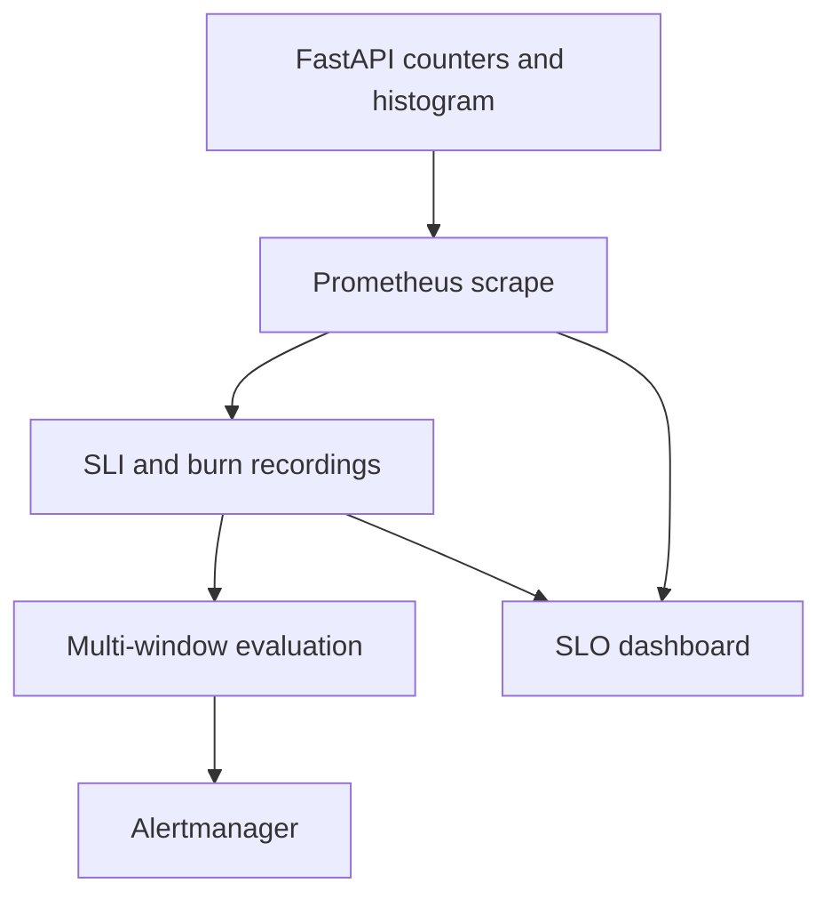

# Lab 26: Multi-Window Burn Rates and the SLO Operations Dashboard

## Purpose and Scope

> **Primary Objective:** Detect fast and slow budget consumption using Lab 25’s SLI contracts, test the actual alert expressions and provision an operational SLO dashboard.

An objective tells you what good service means. A burn rate tells you how quickly observed bad service is consuming its allowance. This lab adds eight recording rules, two alert definitions, deterministic fixtures and a 16-panel dashboard.

The local three-day retention still cannot prove a complete 30-day objective. No Loki, traces, profiling or external notification integration starts here. The controlled alert experiment uses virtual time rather than hours of real dependency downtime.

## 1. Inherited State and Starting Checks

```bash
source lab-notes/session.sh
source lab-notes/evidence.sh
source lab-notes/raw-metrics.sh
source lab-notes/metrics-session.sh
metrics_check
start_lab 26
```

Complete [Lab 25](Lab-25.md). Use the same Linux Docker host, Bash session and repository root. Keep credentials, named volumes and the checkpoint item. Required host tools remain Docker Compose, Python 3, curl, jq, Git and ripgrep. Stop at a failed check and resolve it before proceeding. Nine services and six scrape jobs remain active.

## 2. Learning Objectives and Evidence Boundaries

You will preserve an SLI population, calculate dimensionless burn, join long/short windows correctly, test recovery and missing data, control duplicate notifications and investigate ratios alongside traffic and collection health.



Metrics still enter Prometheus only through `/metrics`. Grafana displays queries; Prometheus owns rule state. A request failure, a changed rule, a firing alert and a delivered notification are separate events.

## 3. Preserve the Two Contracts and Save a Checkpoint

```bash
source lab-notes/alertmanager-session.sh
test -f lab-notes/slo-policy.md
test -f lab-notes/prometheus/slo-recording-rules.yml
test -f config/grafana/learning/dashboards/lab20-red.json
cp lab-notes/prometheus/prometheus.yml "$LAB_DIR/prometheus-before.yml"
cp lab-notes/alertmanager/alertmanager.yml "$LAB_DIR/alertmanager-before.yml"
api -fsS "$PROM_URL/api/v1/rules" > "$LAB_DIR/rules-before.json"
```

| SLI | Eligible population | Bad events | Allowance |
|---|---|---|---:|
| Availability, 99.5% | Completed Items 2xx, 3xx, 5xx | 5xx | 0.005 |
| Latency, 99% within 250 ms | All completed Items responses, including 4xx | Duration above 0.25 s | 0.01 |

The histogram has no status dimension. A fast 503 can meet latency and fail availability. Health, metrics, demo and unmatched routes remain excluded. Do not silently change denominators to make a dashboard look better.

For window W, `burn(W) = bad_fraction(W) / allowed_bad_fraction`. Availability failures of 8% yield `0.08/0.005 = 16`; 2% slow responses yield `0.02/0.01 = 2`. Burn is neither requests/second nor an exact remaining monthly budget.

## 4. Choose and Predict the Multi-Window Policy

| Alert | Long window | Short window | Both burns exceed | Local severity |
|---|---|---|---:|---|
| ItemsSLOBurnFast | 1 h | 5 min | 14.4 | critical |
| ItemsSLOBurnSlow | 6 h | 30 min | 6 | warning |

The long window measures sustained impact; the short window confirms that consumption remains elevated. Use AND within a pair. Each alert evaluates availability and latency separately through the bounded `sli` label.

For a 30-day reference period, `14.4×1/720=2%` and `6×6/720=5%`. These calibrations assume a reference traffic model. They do not measure an exact fraction of a real monthly request budget when traffic varies. The [SRE workbook](https://sre.google/workbook/alerting-on-slos/) explains the paired-window approach. This local policy assigns the slower tier warning; production urgency requires an explicit owner and response agreement.

There is no additional `for`: the windows qualify the signal. A long hold timer is not a substitute for an event-weighted long-window ratio. Zero traffic is undefined; very low traffic can produce a large burn from one failure. Record your expected alert state for a short spike, an old recovered incident and both windows high before running the tests.

## 5. Install the Complete Burn Recordings

```bash
cat > lab-notes/prometheus/slo-burn-recording.yml <<'YAML'
groups:
- name: items-slo-burn
  interval: 15s
  rules:
  - record: service:slo_items:burnrate
    expr: service:slo_items_availability_error:ratio5m / 0.005
    labels:
      window: 5m
      sli: availability
  - record: service:slo_items:burnrate
    expr: service:slo_items_latency_error:ratio5m / 0.01
    labels:
      window: 5m
      sli: latency
  - record: service:slo_items:burnrate
    expr: ((sum by (environment, service) (rate(application_http_server_errors_total{job="fastapi",route=~"/api/v1/items(/\\{item_id\\})?"}[30m]))
      / sum by (environment, service) (rate(application_http_requests_total{job="fastapi",route=~"/api/v1/items(/\\{item_id\\})?",status_code=~"2..|3..|5.."}[30m])))
      / 0.005) and on (environment, service) (sum by (environment, service) (rate(application_http_requests_total{job="fastapi",route=~"/api/v1/items(/\\{item_id\\})?",status_code=~"2..|3..|5.."}[30m]))
      > 0)
    labels:
      window: 30m
      sli: availability
  - record: service:slo_items:burnrate
    expr: (((sum by (environment, service) (rate(application_http_request_duration_seconds_count{job="fastapi",route=~"/api/v1/items(/\\{item_id\\})?"}[30m]))
      - sum by (environment, service) (rate(application_http_request_duration_seconds_bucket{job="fastapi",route=~"/api/v1/items(/\\{item_id\\})?",le="0.25"}[30m])))
      / sum by (environment, service) (rate(application_http_request_duration_seconds_count{job="fastapi",route=~"/api/v1/items(/\\{item_id\\})?"}[30m])))
      / 0.01) and on (environment, service) (sum by (environment, service) (rate(application_http_request_duration_seconds_count{job="fastapi",route=~"/api/v1/items(/\\{item_id\\})?"}[30m]))
      > 0)
    labels:
      window: 30m
      sli: latency
  - record: service:slo_items:burnrate
    expr: ((sum by (environment, service) (rate(application_http_server_errors_total{job="fastapi",route=~"/api/v1/items(/\\{item_id\\})?"}[1h]))
      / sum by (environment, service) (rate(application_http_requests_total{job="fastapi",route=~"/api/v1/items(/\\{item_id\\})?",status_code=~"2..|3..|5.."}[1h])))
      / 0.005) and on (environment, service) (sum by (environment, service) (rate(application_http_requests_total{job="fastapi",route=~"/api/v1/items(/\\{item_id\\})?",status_code=~"2..|3..|5.."}[1h]))
      > 0)
    labels:
      window: 1h
      sli: availability
  - record: service:slo_items:burnrate
    expr: (((sum by (environment, service) (rate(application_http_request_duration_seconds_count{job="fastapi",route=~"/api/v1/items(/\\{item_id\\})?"}[1h]))
      - sum by (environment, service) (rate(application_http_request_duration_seconds_bucket{job="fastapi",route=~"/api/v1/items(/\\{item_id\\})?",le="0.25"}[1h])))
      / sum by (environment, service) (rate(application_http_request_duration_seconds_count{job="fastapi",route=~"/api/v1/items(/\\{item_id\\})?"}[1h])))
      / 0.01) and on (environment, service) (sum by (environment, service) (rate(application_http_request_duration_seconds_count{job="fastapi",route=~"/api/v1/items(/\\{item_id\\})?"}[1h]))
      > 0)
    labels:
      window: 1h
      sli: latency
  - record: service:slo_items:burnrate
    expr: ((sum by (environment, service) (rate(application_http_server_errors_total{job="fastapi",route=~"/api/v1/items(/\\{item_id\\})?"}[6h]))
      / sum by (environment, service) (rate(application_http_requests_total{job="fastapi",route=~"/api/v1/items(/\\{item_id\\})?",status_code=~"2..|3..|5.."}[6h])))
      / 0.005) and on (environment, service) (sum by (environment, service) (rate(application_http_requests_total{job="fastapi",route=~"/api/v1/items(/\\{item_id\\})?",status_code=~"2..|3..|5.."}[6h]))
      > 0)
    labels:
      window: 6h
      sli: availability
  - record: service:slo_items:burnrate
    expr: (((sum by (environment, service) (rate(application_http_request_duration_seconds_count{job="fastapi",route=~"/api/v1/items(/\\{item_id\\})?"}[6h]))
      - sum by (environment, service) (rate(application_http_request_duration_seconds_bucket{job="fastapi",route=~"/api/v1/items(/\\{item_id\\})?",le="0.25"}[6h])))
      / sum by (environment, service) (rate(application_http_request_duration_seconds_count{job="fastapi",route=~"/api/v1/items(/\\{item_id\\})?"}[6h])))
      / 0.01) and on (environment, service) (sum by (environment, service) (rate(application_http_request_duration_seconds_count{job="fastapi",route=~"/api/v1/items(/\\{item_id\\})?"}[6h]))
      > 0)
    labels:
      window: 6h
      sli: latency
YAML
```

These eight rules share one family and bounded `window`/`sli` labels. Five-minute values reuse Lab 25 recordings. Longer windows compute reset-aware rates from raw counters before aggregation. Averaging successive percentages would weight quiet and busy periods incorrectly.

Separate rule groups may observe a one-evaluation delay. The offline fixture specifies group order where exact timing matters.

## 6. Install the Complete Alert Rules

```bash
cat > lab-notes/prometheus/slo-burn-alerts.yml <<'YAML'
groups:
- name: items-slo-burn-alerts
  interval: 15s
  rules:
  - alert: ItemsSLOBurnFast
    expr: (max by (environment, service, sli) (service:slo_items:burnrate{window="1h"}) > 14.4) and on (environment,
      service, sli) (max by (environment, service, sli) (service:slo_items:burnrate{window="5m"}) > 14.4)
    labels:
      severity: critical
      team: platform
    annotations:
      summary: Items SLO fast budget burn
      description: Both 1h and 5m burn exceed 14.4x. SLI={{ $labels.sli }}, service={{ $labels.service }}, environment={{
        $labels.environment }}. Check traffic and coverage.
      runbook: labs/Lab-26.md
  - alert: ItemsSLOBurnSlow
    expr: (max by (environment, service, sli) (service:slo_items:burnrate{window="6h"}) > 6) and on (environment,
      service, sli) (max by (environment, service, sli) (service:slo_items:burnrate{window="30m"}) > 6)
    labels:
      severity: warning
      team: platform
    annotations:
      summary: Items SLO slow budget burn
      description: Both 6h and 30m burn exceed 6x. SLI={{ $labels.sli }}, service={{ $labels.service }}, environment={{
        $labels.environment }}. Check traffic and coverage.
      runbook: labs/Lab-26.md
YAML
```

```bash
python3 - <<'PYTHON'
from pathlib import Path
p=Path("lab-notes/prometheus/prometheus.yml");t=p.read_text()
anchor="- /etc/prometheus/labs/slo-recording-rules.yml\n"
addition="- /etc/prometheus/labs/slo-burn-recording.yml\n- /etc/prometheus/labs/slo-burn-alerts.yml\n"
if addition not in t:
    assert t.count(anchor)==1,"Expected the completed Lab 25 configuration"
    t=t.replace(anchor,anchor+addition)
p.write_text(t)
PYTHON
chmod 644 lab-notes/prometheus/slo-burn-recording.yml lab-notes/prometheus/slo-burn-alerts.yml
```

The `max by` removes `window` before matching. Retaining it in a default join prevents `1h` from matching `5m`; discarding `sli` could join unrelated objectives. Service and environment must also match. No unbounded request/event IDs appear in rule labels.

## 7. Create and Run the Deterministic Tests

```bash
cat > lab-notes/build_burn_tests.py <<'PYTHON'
"""JSON-formatted YAML fixtures; Python standard library only."""
import json
from pathlib import Path
out=Path("lab-notes/prometheus")
def gauge(w,value,sli="availability",service="fastapi-items"):
    return {"series":f'service:slo_items:burnrate{{environment="local",service="{service}",sli="{sli}",window="{w}"}}',"values":value}
def expected(fast,sli):
    long,short,threshold=("1h","5m","14.4") if fast else ("6h","30m","6")
    return {"exp_labels":{"environment":"local","service":"fastapi-items","sli":sli,"team":"platform","severity":"critical" if fast else "warning"},"exp_annotations":{"summary":f'Items SLO {"fast" if fast else "slow"} budget burn',"description":f"Both {long} and {short} burn exceed {threshold}x. SLI={sli}, service=fastapi-items, environment=local. Check traffic and coverage.","runbook":"labs/Lab-26.md"}}
tests=[]
def case(name,series,fast=False,slow=False,sli="availability"):
    tests.append({"name":name,"interval":"15s","input_series":series,"alert_rule_test":[{"eval_time":"1m","alertname":"ItemsSLOBurnFast" if kind else "ItemsSLOBurnSlow","exp_alerts":[expected(kind,sli)] if active else []} for kind,active in [(True,fast),(False,slow)]]})
case("healthy",[gauge(w,"0+0x4") for w in ["5m","30m","1h","6h"]])
case("short spike only",[gauge("5m","20+0x4"),gauge("1h","2+0x4")])
case("old incident only",[gauge("5m","0+0x4"),gauge("1h","20+0x4")])
case("fast confirmed",[gauge("5m","20+0x4"),gauge("1h","20+0x4")],fast=True)
case("slow confirmed",[gauge("30m","8+0x4"),gauge("6h","8+0x4")],slow=True)
case("both",[gauge(w,"20+0x4") for w in ["5m","30m","1h","6h"]],fast=True,slow=True)
case("recovery",[gauge("5m","20 20 0 0 0"),gauge("1h","20+0x4")])
case("strict threshold",[gauge("5m","14.4+0x4"),gauge("1h","14.4+0x4")])
case("different service",[gauge("5m","20+0x4",service="other-items"),gauge("1h","20+0x4")])
case("latency identity",[gauge("5m","20+0x4",sli="latency"),gauge("1h","20+0x4",sli="latency")],fast=True,sli="latency")
case("missing data",[])
(out/"burn-alert-tests.yml").write_text(json.dumps({"rule_files":["slo-burn-alerts.yml"],"evaluation_interval":"15s","tests":tests},indent=2)+"\n")
scope='environment="local",service="fastapi-items"'
def counter(metric,extra,step):
    return {"series":f'{metric}{{job="fastapi",{scope},route="/api/v1/items",method="GET"{extra}}}',"values":f"0+{step}x1440"}
inputs=[counter("application_http_requests_total",',status_code="200"',92),counter("application_http_requests_total",',status_code="503"',8),counter("application_http_server_errors_total","",8),counter("application_http_request_duration_seconds_count","",100),counter("application_http_request_duration_seconds_bucket",',le="0.25"',98)]
checks=[{"expr":f'round(service:slo_items:burnrate{{window="{w}",sli="{sli}"}},0.000001)',"eval_time":"6h","exp_samples":[{"labels":f'{{{scope},sli="{sli}",window="{w}"}}',"value":burn}]} for w in ["5m","30m","1h","6h"] for sli,burn in [("availability",16),("latency",2)]]
suite={"rule_files":["slo-recording-rules.yml","slo-burn-recording.yml"],"evaluation_interval":"15s","fuzzy_compare":True,"group_eval_order":["items-sli-learning","items-slo-burn"],"tests":[{"name":"raw counter contract","interval":"15s","input_series":inputs,"promql_expr_test":checks},{"name":"idle is undefined","interval":"15s","input_series":[{**s,"values":"0+0x1440"} for s in inputs],"promql_expr_test":[{"expr":"service:slo_items:burnrate","eval_time":"6h","exp_samples":[]}]}]}
(out/"burn-recording-tests.yml").write_text(json.dumps(suite,indent=2)+"\n")
print("Wrote both burn rule test suites")
PYTHON
```

```bash
python3 lab-notes/build_burn_tests.py
chmod 644 lab-notes/prometheus/burn-alert-tests.yml lab-notes/prometheus/burn-recording-tests.yml
dm run --rm -T --no-deps --entrypoint promtool prometheus test rules \
  /etc/prometheus/labs/slo-tests.yml \
  /etc/prometheus/labs/burn-recording-tests.yml \
  /etc/prometheus/labs/burn-alert-tests.yml > "$LAB_DIR/burn-tests.txt" 2>&1
cat "$LAB_DIR/burn-tests.txt"
```

Expected: all suites report SUCCESS. JSON syntax is valid YAML, so the generator needs only standard Python. The recording suite advances six hours of virtual time through real raw-counter expressions. The alert suite isolates threshold and join behavior using recording inputs.

| Case | Expected |
|---|---|
| Short high, long low | No fast alert |
| Long high, short recovered | No fast alert |
| Both fast windows high | Fast alert |
| Both slow windows high | Slow alert |
| Both pairs high | Both alert definitions fire |
| Exactly 14.4 | No fast alert: comparison is strict |
| Different service identities | No cross-service join |
| Idle population | Burn absent, no claim of success |

The raw fixture yields availability burn 16 and latency burn 2 in all windows. These are semantic tests, not proof of live scraping, dashboard rendering or external delivery.

## 8. Prove a Wrong Threshold Fails the Tests

```bash
python3 - <<'PYTHON'
import json
from pathlib import Path
p=Path("lab-notes/prometheus")
rule=(p/"slo-burn-alerts.yml").read_text();assert "> 14.4" in rule
(p/"burn-broken.yml").write_text(rule.replace("> 14.4","> 100"))
test=json.loads((p/"burn-alert-tests.yml").read_text());test["rule_files"]=["burn-broken.yml"]
(p/"burn-negative-tests.yml").write_text(json.dumps(test,indent=2)+"\n")
PYTHON
chmod 644 lab-notes/prometheus/burn-broken.yml lab-notes/prometheus/burn-negative-tests.yml
if dm run --rm -T --no-deps --entrypoint promtool prometheus test rules \
  /etc/prometheus/labs/burn-negative-tests.yml > "$LAB_DIR/expected-failure.txt" 2>&1; then
  echo 'Unexpected pass; inspect the negative control' >&2
  false
else
  cat "$LAB_DIR/expected-failure.txt"
fi
rm lab-notes/prometheus/burn-broken.yml lab-notes/prometheus/burn-negative-tests.yml
```

Confirm that missing expected alerts cause the failure; a syntax error is not the intended result. The broken file is never referenced by the running server. This keeps the experiment bounded and the application available.

## 9. Apply Notification Control and Load the Rules

```bash
python3 - <<'PYTHON'
from pathlib import Path
p=Path("lab-notes/alertmanager/alertmanager.yml");t=p.read_text()
addition="""  - source_matchers: ['alertname="ItemsSLOBurnFast"']
    target_matchers: ['alertname="ItemsSLOBurnSlow"']
    equal: [service, environment, sli]
"""
if addition not in t:
    assert t.count("templates:\n")==1 and "inhibit_rules:" in t
    t=t.replace("templates:\n",addition+"templates:\n")
p.write_text(t)
PYTHON
am check-config /etc/alertmanager/alertmanager.yml
dm kill -s HUP alertmanager
record_change 'activate paired-window Items burn rules' planned
reload_prometheus
wait_prometheus
api -fsS "$PROM_URL/api/v1/rules" > "$LAB_DIR/rules-after.json"
jq -e '[.data.groups[].rules[]|select(.health!="ok")]|length==0' "$LAB_DIR/rules-after.json"
record_change 'activate paired-window Items burn rules' completed
```

Repeat the API check after an evaluation cycle if the new groups are not yet visible. Expect 20 recording rules and seven alert definitions, including the earlier five operational alerts. Alert instances can be more numerous because SLIs/services differ.

Inhibition matches service, environment and SLI: a fast availability burn must not suppress slow latency evidence. It controls notifications, not Prometheus state. Existing local receivers route without real external credentials.

## 10. Build the SLO Operations Dashboard

```bash
cat > lab-notes/build_slo_dashboard.py <<'PYTHON'
import json
from pathlib import Path
from dashboard_factory import panel,save
s='environment=~"${environment:regex}",service=~"${service:regex}"'
routes=',route=~'+json.dumps(r'/api/v1/items(/\{item_id\})?')
def count(metric,extra=""):
    return f'sum by (environment, service) (increase({metric}{{job="fastapi",{s}{routes}{extra}}}[1h]))'
eligible=count("application_http_requests_total",',status_code=~"2..|3..|5.."')
bad=count("application_http_server_errors_total")
total=count("application_http_request_duration_seconds_count")
good=count("application_http_request_duration_seconds_bucket",',le="0.25"')
a=f'({bad} / {eligible})';lat=f'(({total} - {good}) / {total})'
panels=[]
def add(title,queries,unit,description,kind="timeseries"):
    panels.append(panel(len(panels)+1,title,queries,unit,description,kind))
add("Proposed availability objective",[("vector(0.995)","Target")],"percentunit","Configured 30-day policy target, not measured compliance.","stat")
add("Proposed latency objective",[("vector(0.99)","Target")],"percentunit","99% within 250ms, all completed Items responses.","stat")
add("Availability — observed 1h",[(f'(1-{a}) and on (environment,service) ({eligible}>0)',"Availability")],"percentunit","Uses available history and the 2xx/3xx/5xx population.","stat")
add("Latency — observed 1h",[(f'(1-{lat}) and on (environment,service) ({total}>0)',"Within 250ms")],"percentunit","All completed Items responses, including 4xx.","stat")
add("Availability budget headroom — observed 1h",[(f'(1-{a}/0.005) and on (environment,service) ({eligible}>0)',"Remaining fraction")],"none","Normalized to observed 1h population, not the monthly budget; preserve negative values.","stat")
add("Latency budget headroom — observed 1h",[(f'(1-{lat}/0.01) and on (environment,service) ({total}>0)',"Remaining fraction")],"none","1 full; 0 exhausted; negative overspent. Not 30-day compliance.","stat")
for sli in ["availability","latency"]:
    add(sli.title()+" burn by window",[(f'service:slo_items:burnrate{{{s},sli="{sli}"}}',"{{window}}")],"none","Compare the long and short windows together; burn is dimensionless.")
add("Eligible traffic — 5m rate",[(f'service:slo_items_eligible_requests:rate5m{{{s}}}',"Availability"),(f'service:slo_items_latency_observations:rate5m{{{s}}}',"Latency")],"reqps","Different populations are intentional; missing is not zero.")
add("Availability event estimates — 1h",[(eligible,"Eligible"),(bad,"Bad")],"short","Extrapolated estimates, not a transaction ledger.")
add("Application dependencies",[(f'application_dependency_up{{job="fastapi",{s}}}',"{{dependency}}")],"none","Latest app probe: 1 healthy, 0 unavailable, absent unknown.")
add("Server dependencies",[('pg_up{job="postgres"}',"Postgres"),('redis_up{job="redis"}',"Redis")],"none","Single configured database/cache servers; app variables do not select new servers.")
add("Successful stored scrapes — 1h",[(f'avg by (environment,service) (avg_over_time(up{{job="fastapi",{s}}}[1h]))',"Success fraction")],"percentunit","Fraction of available samples, not proof of full coverage.")
add("Stored scrape coverage estimate — 1h",[(f'clamp_max(avg by (environment,service) (count_over_time(up{{job="fastapi",{s}}}[1h]))/240,1)',"Stored / expected")],"percentunit","About 240 samples at 15s cadence. up=0 still counts; this is only a heuristic.")
add("Active SLO alerts",[(f'ALERTS{{{s},alertname=~"ItemsSLOBurnFast|ItemsSLOBurnSlow"}}',"{{alertname}} {{sli}} {{alertstate}}")],"none","Empty may mean no active alerts or absent evaluation data.")
add("Rule evaluation failures",[('sum(rate(prometheus_rule_evaluation_failures_total{job="prometheus"}[5m]))',"Failures/s")],"ops","Global evaluation health; identify the affected group through the rules API.")
out=Path("config/grafana/learning/dashboards/lab26-slo.json")
save(out,"lab26-slo","Lab 26 — Items SLO operations",panels)
d=json.loads(out.read_text());d["templating"]=json.loads(Path("config/grafana/learning/dashboards/lab20-red.json").read_text())["templating"]
d["description"]="Three-day retention cannot prove 30-day compliance. Operational windows may have partial history; inspect coverage and traffic."
d["links"]=[{"title":title,"type":"link","url":"/d/"+uid,"includeVars":True,"keepTime":True,"targetBlank":False} for uid,title in [("lab20-red","Application RED"),("lab21-use","Host and dependencies")]]
out.write_text(json.dumps(d,indent=2)+"\n")
PYTHON
```

```bash
python3 lab-notes/build_slo_dashboard.py
chmod 644 config/grafana/learning/dashboards/lab26-slo.json
python3 -m json.tool config/grafana/learning/dashboards/lab26-slo.json > /dev/null
wait_grafana
```

The Lab 22 provider watches this directory. After its polling interval, open **Lab 26 — Items SLO operations**, UID `lab26-slo`. It reuses bounded environment/service variables and links to RED and USE dashboards with time/variables preserved.

Target panels are explicitly configured constants. One-hour headroom describes the observed one-hour population, not the rolling monthly budget. Negative values remain visible. Scrape-count coverage is only an estimate: stored `up=0` samples do not provide application counter observations.

## 11. Observe the Live System and Capture Evidence

```bash
for number in {1..40}; do
  api -fsS "$APP_URL/api/v1/items" > /dev/null
  sleep 0.25
done
pq 'service:slo_items:burnrate' > "$LAB_DIR/live-burn.json"
pq 'service:slo_items_eligible_requests:rate5m' > "$LAB_DIR/live-traffic.json"
api -fsS "$APP_URL/health/ready" > "$LAB_DIR/readiness.json"
api -fsS "$PROM_URL/api/v1/alerts" > "$LAB_DIR/prometheus-alerts.json"
api -fsS "$ALERTMANAGER_URL/api/v2/alerts" > "$LAB_DIR/alertmanager-alerts.json"
capture_app_logs
```

Allow two successful scrapes/evaluations when series are newly created. Earlier Lab 25 failures can remain in longer windows. Healthy traffic does not erase history immediately, and a six-hour query can compute from much less than six hours after startup.

Compare both windows of each pair. Correlate the selected SLI, traffic volume, dependency state and collection/rule health before escalating. Save the dashboard UTC range alongside API responses and request logs. Empty data is not automatically zero burn.

## 12. Recovery and Troubleshooting

| Symptom | Inspect | Action |
|---|---|---|
| High curves, no alert | Join labels and strict thresholds | Compare service/environment/SLI and rule health |
| Burn absent | Traffic and source series | Distinguish idle from missing collection |
| High burn after startup | Small population, partial history | Qualify impact using counts and coverage |
| Slow alert still firing | Alertmanager inhibition | Suppression does not edit Prometheus state |
| Dashboard missing | Provider mount and permissions | Verify JSON path and Grafana logs |
| Negative headroom | Budget consumption | Preserve the breach and state its window |

```bash
metrics_check
api -fsS "$PROM_URL/api/v1/rules" > "$LAB_DIR/final-rules.json"
jq -e '[.data.groups[].rules[]|select(.health!="ok")]|length==0' "$LAB_DIR/final-rules.json"
git diff --check
```

Keep the correct rules/dashboard. If configuration rollback is required, restore the two backed-up files, validate them and send HUP. Remove the new dashboard if its recordings are no longer active. Unreferenced rule files do not execute. Do not delete volumes to recover a configuration fault.

## 13. Knowledge Check

1. Why AND within each pair?
2. Why is a high burn incomplete evidence?
3. Why not replace a long window with for?
4. Why match sli in inhibition?

### Answer Guide

1. It confirms sustained impact is still active.
2. Traffic may be tiny and history incomplete; unobserved attempts are missing.
3. A timer measures uninterrupted truth, not event-weighted history.
4. Availability and latency describe different outcomes.

## 14. Professional Scenario Exercise

A release has an 18x hourly burn and a 0.4x five-minute burn. Write an update separating historical impact, current recovery, traffic and coverage confidence. Explain how your conclusion changes if recent traffic is absent.

## 15. Lab Notebook Template

Create a notebook in the evidence directory for this run:

```bash
test -e "$LAB_DIR/notebook.md" || printf '# Lab 26 Evidence\n' > "$LAB_DIR/notebook.md"
```

Use these headings and fill them with your predictions, commands, observed results and conclusions:

```markdown
# Lab 26 Evidence

## Starting state and operational question
## Prediction before the experiment
## Commands and UTC timestamps
## Observed results and source evidence
## Unexpected findings and troubleshooting
## Recovery proof and remaining limitations
```

## 16. Observable Completion Criteria

- [ ] Both SLI populations are unchanged.
- [ ] Eight recordings and two alert definitions pass positive and negative tests.
- [ ] Window joins preserve service/environment/SLI identity.
- [ ] Notification inhibition cannot cross SLIs.
- [ ] All 16 panels have real sources and honest coverage labels.
- [ ] Nine services and six jobs remain healthy.

## 17. Production Implications

Set objectives, urgency, low-volume and missing-data policies with owners. Retain sufficient history and monitor rule failures before using reports for release decisions. Completed-response metrics do not cover every edge/client failure.

## 18. End State and Transition

Keep nine services, six jobs, 20 recordings, seven alert definitions and three dashboards. [Lab 27](Lab-27.md) introduces individual event-record investigation through Loki.
