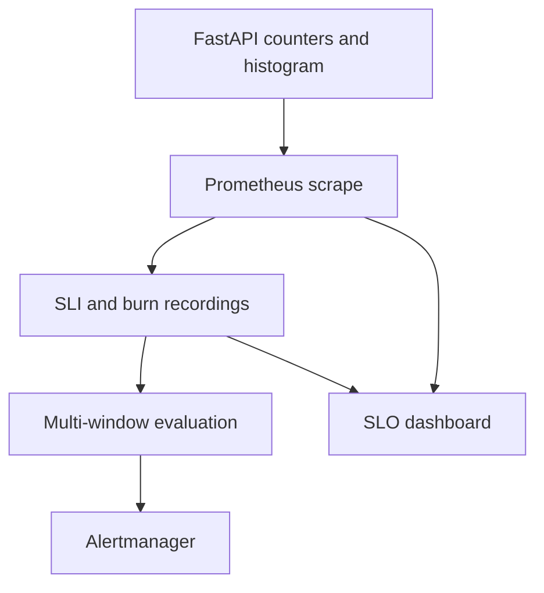

# Lab 26: Multi-Window Burn Rates and the SLO Operations Dashboard

## 1. Purpose and Learning Outcomes

**In Plain Language:** You will use the SLO definitions to calculate burn rates and create alerts. Burn rate compares the observed fraction of bad events with the fraction the objective allows. A long window checks sustained impact, while a short window checks whether the problem is still happening. Fixed test fixtures let you examine hours of behavior using simulated time instead of running a real outage for hours.

> **Primary Objective:** Detect fast and slow use of the error budget with Lab 25's SLI definitions, test the actual alert expressions, and provision a dashboard for investigating the results.

An objective defines good service. Burn rate shows how quickly observed bad outcomes are using the permitted allowance. This lab adds eight recording rules, two alert definitions, fixed tests, and a 16-panel dashboard.

The local three-day history still cannot prove a complete 30-day result. No Loki, tracing, profiling, or external notification integration starts here. The controlled tests advance virtual time instead of keeping a real dependency down for hours.

## 2. Starting Point and Lab Map

Open the complete application repository before using this guide. Unless a step says otherwise, run commands in Bash from the repository's top-level folder. Follow the starting checks in order because later commands depend on the helper functions and running services they prepare.

Read each explanation before running its commands. Run one complete code block, check the result, and then continue. In your notebook, save the commands, what happened, why you think it happened, and anything that differed from the expected result.

### Key Terms

| **Term**               | **Explanation**                                                                      |
| ---------------------- | ------------------------------------------------------------------------------------ |
| Burn rate              | The observed bad-event fraction divided by the bad-event fraction the SLO allows.    |
| Multi-window condition | A condition requiring both a long and a short window to exceed their threshold.      |
| Join labels            | Labels that must agree when pairing a long-window result with a short-window result. |

### Lab Map

The arrows show how the parts connect and where a request can take different paths. Use this map to understand the design. It is not a recording of a request that actually ran.


```mermaid
flowchart TD
    A["FastAPI counters and histogram"] --> P["Prometheus scrape"]
    P --> R["SLI and burn recordings"]
    R --> E["Multi-window evaluation"]
    E --> M["Alertmanager"]
    R --> G["SLO dashboard"]
    P --> G
```

## 3. Guided Walkthrough

### Step 01. Inherited State and Starting Checks

**What You Are Doing:** Check the existing alerting and SLI stage before adding burn calculations. Keep the definitions of good service unchanged while adding the new alert policy.

**Practical Walkthrough:** Verify SLI recordings, alert rules, and notification health. Burn calculations use the availability and latency allowances already defined in Lab 25. They should not introduce a hidden change to which events count as bad.

Confirm the recording and alert paths are healthy. Preserve eligible and good-event definitions. Burn rate compares the resulting bad fraction with an allowance; it must not quietly select a different set of requests.

```bash
source lab-notes/session.sh
source lab-notes/evidence.sh
source lab-notes/raw-metrics.sh
source lab-notes/metrics-session.sh
metrics_check
start_lab 26
```

Complete [Lab 25](Lab-25.md). Use the same Linux Docker host, Bash session, and repository root. Keep credentials, named volumes, and the checkpoint item. The host still needs Docker Compose, Python 3, curl, jq, Git, and ripgrep. Resolve any failed check before continuing. Nine services and six scrape jobs remain active.

**Understanding the Result:** Changing the service objective differs from changing how you alert on it. This lab adds alert behavior while keeping the existing objectives.

### Step 02. Learning Objectives and Evidence Boundaries

**What You Are Doing:** Follow request measurements through SLI results, burn calculations, and alert evaluation. Each stage needs fresh inputs describing the same intended requests.

**Practical Walkthrough:** Trace request data through SLI ratios, burn recordings, paired-window alerts, and notifications. If a panel is empty, check traffic and rule health first. Missing output does not prove that no budget is being used.

Inspect intermediate values and labels when a result is missing or unexpected. Follow the path through traffic, SLI ratio, burn calculation, alert matching, and notification handling to identify where the result changed or disappeared.

You will keep the same SLI request sets, calculate burn without physical units, pair windows correctly, test recovery and missing inputs, control duplicate notifications, and read ratios alongside traffic and collection health.

The lab map in Section 2 shows this relationship.

Metrics still enter Prometheus only through `/metrics`. Grafana displays query results, and Prometheus manages rule state. A failed request, rule edit, firing alert, and delivered notification are different events.

**Understanding the Result:** A missing burn value may start with an upstream problem. Keep source-health evidence available while investigating.

### Step 03. Preserve the Two Contracts and Save a Checkpoint

**What You Are Doing:** Save the current configuration and calculate each SLI's allowed bad fraction. Dividing by that fraction converts the observed bad fraction into burn rate.

**Practical Walkthrough:** Save the working files and restate both allowances. A burn of one means the observed bad fraction equals the fraction permitted by that objective. Keep availability and latency separate because their allowances and eligible requests differ.

Back up the approved configuration before adding rules. Calculate each allowance separately and use it as the divisor. Keep service, environment, and SLI labels attached so numerically similar burn values from different budgets are not confused.

```bash
source lab-notes/alertmanager-session.sh
test -f lab-notes/slo-policy.md
test -f lab-notes/prometheus/slo-recording-rules.yml
test -f config/grafana/learning/dashboards/lab20-red.json
cp lab-notes/prometheus/prometheus.yml "$LAB_DIR/prometheus-before.yml"
cp lab-notes/alertmanager/alertmanager.yml "$LAB_DIR/alertmanager-before.yml"
api -fsS "$PROM_URL/api/v1/rules" > "$LAB_DIR/rules-before.json"
```

| **SLI**                    | **Eligible Population**                      | **Bad Events**        | **Allowance** |
| -------------------------- | -------------------------------------------- | --------------------- | ------------: |
| Availability, 99.5%        | Completed Items 2xx, 3xx, and 5xx responses  | 5xx responses         | 0.005         |
| Latency, 99% within 250 ms | All completed Items responses, including 4xx | Duration above 0.25 s | 0.01          |

The histogram has no status label. A quick 503 can pass latency and fail availability. Health, metrics, demo, and unmatched routes remain excluded. Do not change denominators simply to improve the dashboard's appearance.

For window W, `burn(W) = bad_fraction(W) / allowed_bad_fraction`. An 8% availability failure fraction gives `0.08/0.005 = 16`. A 2% slow-response fraction gives `0.02/0.01 = 2`. Burn is not requests per second or an exact measure of the monthly budget remaining.

**Understanding the Result:** Burn has no physical unit. Its value depends on the allowance for the specific SLI being measured.

### Step 04. Choose and Predict the Multi-Window Policy

**What You Are Doing:** Predict how the two windows work together. The long window checks sustained impact, and the short window checks whether elevated consumption continues.

**Practical Walkthrough:** Read each pair as one policy: 1 hour and 5 minutes at 14.4, or 6 hours and 30 minutes at 6. Both conditions must apply to the same SLI identity. A high result in only one window does not satisfy the pair.

Check each range and threshold before predicting the alert state. The longer range provides impact history, while the shorter range checks recent behavior. Do not treat one high input as proof that both conditions are met.

| **Alert**        | **Long Window** | **Short Window** | **Both Burns Exceed** | **Local Severity** |
| ---------------- | --------------- | ---------------- | --------------------: | ------------------ |
| ItemsSLOBurnFast | 1 h             | 5 min            | 14.4                  | critical           |
| ItemsSLOBurnSlow | 6 h             | 30 min           | 6                     | warning            |

Use AND within each window pair. The long result describes sustained impact and the short result checks that consumption is still elevated. Each alert evaluates availability and latency separately using the limited set of `sli` values.

For a 30-day reference period, `14.4×1/720=2%` and `6×6/720=5%`. These calibrations assume a reference traffic model. With varying traffic, they do not directly measure the exact share of a real monthly request budget consumed. The [SRE workbook](https://sre.google/workbook/alerting-on-slos/) explains paired windows. This lab makes the slower tier a warning; production urgency needs an owner and an agreed response.

There is no extra `for` period because the windows already qualify the signal. A long hold timer does not replace a long-window ratio weighted by actual events. No traffic gives an undefined ratio, and one failure at very low volume can give a large burn. Predict the outcomes for a short spike, an old recovered incident, and two high windows before testing.

**Understanding the Result:** Recent recovery can make the short condition false while the long window still contains failures. The policy is designed to recognize that difference.

### Step 05. Install the Complete Burn Recordings

**What You Are Doing:** Add the full set of windowed recordings. Calculate each longer ratio from the eligible and bad events, not an unweighted average of earlier percentages.

**Practical Walkthrough:** Use the event populations for each selected range. A quiet interval and a busy interval should not automatically get equal weight. Keep the window label on intermediate output so you can inspect the individual calculations.

Check eligible and bad-event selections for every window. Calculate each ratio from those inputs and preserve its window label. Averaging short-period ratios would give low-traffic and high-traffic periods equal influence, misrepresenting the combined requests.

```bash
cat > lab-notes/prometheus/slo-burn-recording.yml <<'YAML'
groups:
- name: items-slo-burn
  interval: 15s
  rules:
  - record: service:slo_items:burnrate
    expr: service:slo_items_availability_error:ratio5m / 0.005
    labels:
      window: 5m
      sli: availability
  - record: service:slo_items:burnrate
    expr: service:slo_items_latency_error:ratio5m / 0.01
    labels:
      window: 5m
      sli: latency
  - record: service:slo_items:burnrate
    expr: ((sum by (environment, service) (rate(application_http_server_errors_total{job="fastapi",route=~"/api/v1/items(/\\{item_id\\})?"}[30m]))
      / sum by (environment, service) (rate(application_http_requests_total{job="fastapi",route=~"/api/v1/items(/\\{item_id\\})?",status_code=~"2..|3..|5.."}[30m])))
      / 0.005) and on (environment, service) (sum by (environment, service) (rate(application_http_requests_total{job="fastapi",route=~"/api/v1/items(/\\{item_id\\})?",status_code=~"2..|3..|5.."}[30m]))
      > 0)
    labels:
      window: 30m
      sli: availability
  - record: service:slo_items:burnrate
    expr: (((sum by (environment, service) (rate(application_http_request_duration_seconds_count{job="fastapi",route=~"/api/v1/items(/\\{item_id\\})?"}[30m]))
      - sum by (environment, service) (rate(application_http_request_duration_seconds_bucket{job="fastapi",route=~"/api/v1/items(/\\{item_id\\})?",le="0.25"}[30m])))
      / sum by (environment, service) (rate(application_http_request_duration_seconds_count{job="fastapi",route=~"/api/v1/items(/\\{item_id\\})?"}[30m])))
      / 0.01) and on (environment, service) (sum by (environment, service) (rate(application_http_request_duration_seconds_count{job="fastapi",route=~"/api/v1/items(/\\{item_id\\})?"}[30m]))
      > 0)
    labels:
      window: 30m
      sli: latency
  - record: service:slo_items:burnrate
    expr: ((sum by (environment, service) (rate(application_http_server_errors_total{job="fastapi",route=~"/api/v1/items(/\\{item_id\\})?"}[1h]))
      / sum by (environment, service) (rate(application_http_requests_total{job="fastapi",route=~"/api/v1/items(/\\{item_id\\})?",status_code=~"2..|3..|5.."}[1h])))
      / 0.005) and on (environment, service) (sum by (environment, service) (rate(application_http_requests_total{job="fastapi",route=~"/api/v1/items(/\\{item_id\\})?",status_code=~"2..|3..|5.."}[1h]))
      > 0)
    labels:
      window: 1h
      sli: availability
  - record: service:slo_items:burnrate
    expr: (((sum by (environment, service) (rate(application_http_request_duration_seconds_count{job="fastapi",route=~"/api/v1/items(/\\{item_id\\})?"}[1h]))
      - sum by (environment, service) (rate(application_http_request_duration_seconds_bucket{job="fastapi",route=~"/api/v1/items(/\\{item_id\\})?",le="0.25"}[1h])))
      / sum by (environment, service) (rate(application_http_request_duration_seconds_count{job="fastapi",route=~"/api/v1/items(/\\{item_id\\})?"}[1h])))
      / 0.01) and on (environment, service) (sum by (environment, service) (rate(application_http_request_duration_seconds_count{job="fastapi",route=~"/api/v1/items(/\\{item_id\\})?"}[1h]))
      > 0)
    labels:
      window: 1h
      sli: latency
  - record: service:slo_items:burnrate
    expr: ((sum by (environment, service) (rate(application_http_server_errors_total{job="fastapi",route=~"/api/v1/items(/\\{item_id\\})?"}[6h]))
      / sum by (environment, service) (rate(application_http_requests_total{job="fastapi",route=~"/api/v1/items(/\\{item_id\\})?",status_code=~"2..|3..|5.."}[6h])))
      / 0.005) and on (environment, service) (sum by (environment, service) (rate(application_http_requests_total{job="fastapi",route=~"/api/v1/items(/\\{item_id\\})?",status_code=~"2..|3..|5.."}[6h]))
      > 0)
    labels:
      window: 6h
      sli: availability
  - record: service:slo_items:burnrate
    expr: (((sum by (environment, service) (rate(application_http_request_duration_seconds_count{job="fastapi",route=~"/api/v1/items(/\\{item_id\\})?"}[6h]))
      - sum by (environment, service) (rate(application_http_request_duration_seconds_bucket{job="fastapi",route=~"/api/v1/items(/\\{item_id\\})?",le="0.25"}[6h])))
      / sum by (environment, service) (rate(application_http_request_duration_seconds_count{job="fastapi",route=~"/api/v1/items(/\\{item_id\\})?"}[6h])))
      / 0.01) and on (environment, service) (sum by (environment, service) (rate(application_http_request_duration_seconds_count{job="fastapi",route=~"/api/v1/items(/\\{item_id\\})?"}[6h]))
      > 0)
    labels:
      window: 6h
      sli: latency
YAML
```

**Command Note:** `<<'YAML'` writes the following text literally until the closing `YAML`. The quoted delimiter prevents Bash from expanding `$variables` inside the file. Creating the file and running it are separate steps.

The eight rules use one family with bounded `window` and `sli` labels. Five-minute values reuse Lab 25 recordings. Longer ranges calculate reset-aware rates from raw counters before aggregation. Averaging successive percentages would weight quiet and busy periods incorrectly.

Separate rule groups can introduce a delay of one evaluation. The offline fixture specifies group order where exact timing needs to be checked.

**Understanding the Result:** A long-window ratio must account for how many events occurred. An unweighted average can distort the effect of busy and quiet periods.

### Step 06. Install the Complete Alert Rules

**What You Are Doing:** Install the paired-window alerts and inspect their matching labels. Exclude the differing window label from pairing while keeping service, environment, and SLI identity.

**Practical Walkthrough:** Read the vector matching in each alert. A long and short window must be paired for the same service, environment, and objective. If high inputs combine to an empty result, run each side separately and compare labels.

Inspect both operands before their join. Confirm that window is deliberately removed from matching while the other identity labels remain. Investigate labels and source availability before lowering thresholds just to make an alert appear.

```bash
cat > lab-notes/prometheus/slo-burn-alerts.yml <<'YAML'
groups:
- name: items-slo-burn-alerts
  interval: 15s
  rules:
  - alert: ItemsSLOBurnFast
    expr: (max by (environment, service, sli) (service:slo_items:burnrate{window="1h"}) > 14.4) and on (environment,
      service, sli) (max by (environment, service, sli) (service:slo_items:burnrate{window="5m"}) > 14.4)
    labels:
      severity: critical
      team: platform
    annotations:
      summary: Items SLO fast budget burn
      description: Both 1h and 5m burn exceed 14.4x. SLI={{ $labels.sli }}, service={{ $labels.service }}, environment={{
        $labels.environment }}. Check traffic and coverage.
      runbook: labs/Lab-26.md
  - alert: ItemsSLOBurnSlow
    expr: (max by (environment, service, sli) (service:slo_items:burnrate{window="6h"}) > 6) and on (environment,
      service, sli) (max by (environment, service, sli) (service:slo_items:burnrate{window="30m"}) > 6)
    labels:
      severity: warning
      team: platform
    annotations:
      summary: Items SLO slow budget burn
      description: Both 6h and 30m burn exceed 6x. SLI={{ $labels.sli }}, service={{ $labels.service }}, environment={{
        $labels.environment }}. Check traffic and coverage.
      runbook: labs/Lab-26.md
YAML
```

```bash
python3 - <<'PYTHON'
from pathlib import Path
p=Path("lab-notes/prometheus/prometheus.yml");t=p.read_text()
anchor="- /etc/prometheus/labs/slo-recording-rules.yml\n"
addition="- /etc/prometheus/labs/slo-burn-recording.yml\n- /etc/prometheus/labs/slo-burn-alerts.yml\n"
if addition not in t:
    assert t.count(anchor)==1,"Expected the completed Lab 25 configuration"
    t=t.replace(anchor,anchor+addition)
p.write_text(t)
PYTHON
chmod 644 lab-notes/prometheus/slo-burn-recording.yml lab-notes/prometheus/slo-burn-alerts.yml
```

`max by` removes `window` before matching. If kept in a default join, `1h` cannot match `5m`. Removing `sli` could instead pair unrelated objectives. Service and environment must also agree. The rule labels contain no unbounded request or event IDs.

**Understanding the Result:** Both windows must refer to the same policy and request set. Incompatible labels can eliminate the comparison without producing a syntax error.

### Step 07. Create and Run the Deterministic Tests

**What You Are Doing:** Use virtual-time fixtures to test the real recordings and alerts. Include recovery, missing inputs, and matching behavior as well as high burn.

**Practical Walkthrough:** Advance the fixtures through the long cases, including six hours, without creating a six-hour real outage. Check expected labels and values for all cases. These tests exercise the actual expressions with controlled data.

Read the recovery and missing-input cases along with the high-burn cases. The tests make long-window behavior repeatable without waiting for live history or interrupting a real dependency for hours.

```bash
cat > lab-notes/build_burn_tests.py <<'PYTHON'
"""JSON-formatted YAML fixtures; Python standard library only."""
import json
from pathlib import Path
out=Path("lab-notes/prometheus")
def gauge(w,value,sli="availability",service="items-info"):
    return {"series":f'service:slo_items:burnrate{{environment="local",service="{service}",sli="{sli}",window="{w}"}}',"values":value}
def expected(fast,sli):
    long,short,threshold=("1h","5m","14.4") if fast else ("6h","30m","6")
    return {"exp_labels":{"environment":"local","service":"items-info","sli":sli,"team":"platform","severity":"critical" if fast else "warning"},"exp_annotations":{"summary":f'Items SLO {"fast" if fast else "slow"} budget burn',"description":f"Both {long} and {short} burn exceed {threshold}x. SLI={sli}, service=items-info, environment=local. Check traffic and coverage.","runbook":"labs/Lab-26.md"}}
tests=[]
def case(name,series,fast=False,slow=False,sli="availability"):
    tests.append({"name":name,"interval":"15s","input_series":series,"alert_rule_test":[{"eval_time":"1m","alertname":"ItemsSLOBurnFast" if kind else "ItemsSLOBurnSlow","exp_alerts":[expected(kind,sli)] if active else []} for kind,active in [(True,fast),(False,slow)]]})
case("healthy",[gauge(w,"0+0x4") for w in ["5m","30m","1h","6h"]])
case("short spike only",[gauge("5m","20+0x4"),gauge("1h","2+0x4")])
case("old incident only",[gauge("5m","0+0x4"),gauge("1h","20+0x4")])
case("fast confirmed",[gauge("5m","20+0x4"),gauge("1h","20+0x4")],fast=True)
case("slow confirmed",[gauge("30m","8+0x4"),gauge("6h","8+0x4")],slow=True)
case("both",[gauge(w,"20+0x4") for w in ["5m","30m","1h","6h"]],fast=True,slow=True)
case("recovery",[gauge("5m","20 20 0 0 0"),gauge("1h","20+0x4")])
case("strict threshold",[gauge("5m","14.4+0x4"),gauge("1h","14.4+0x4")])
case("different service",[gauge("5m","20+0x4",service="other-items"),gauge("1h","20+0x4")])
case("latency identity",[gauge("5m","20+0x4",sli="latency"),gauge("1h","20+0x4",sli="latency")],fast=True,sli="latency")
case("missing data",[])
(out/"burn-alert-tests.yml").write_text(json.dumps({"rule_files":["slo-burn-alerts.yml"],"evaluation_interval":"15s","tests":tests},indent=2)+"\n")
scope='environment="local",service="items-info"'
def counter(metric,extra,step):
    return {"series":f'{metric}{{job="fastapi",{scope},route="/api/v1/items",method="GET"{extra}}}',"values":f"0+{step}x1440"}
inputs=[counter("application_http_requests_total",',status_code="200"',92),counter("application_http_requests_total",',status_code="503"',8),counter("application_http_server_errors_total","",8),counter("application_http_request_duration_seconds_count","",100),counter("application_http_request_duration_seconds_bucket",',le="0.25"',98)]
checks=[{"expr":f'round(service:slo_items:burnrate{{window="{w}",sli="{sli}"}},0.000001)',"eval_time":"6h","exp_samples":[{"labels":f'{{{scope},sli="{sli}",window="{w}"}}',"value":burn}]} for w in ["5m","30m","1h","6h"] for sli,burn in [("availability",16),("latency",2)]]
suite={"rule_files":["slo-recording-rules.yml","slo-burn-recording.yml"],"evaluation_interval":"15s","fuzzy_compare":True,"group_eval_order":["items-sli-learning","items-slo-burn"],"tests":[{"name":"raw counter contract","interval":"15s","input_series":inputs,"promql_expr_test":checks},{"name":"idle is undefined","interval":"15s","input_series":[{**s,"values":"0+0x1440"} for s in inputs],"promql_expr_test":[{"expr":"service:slo_items:burnrate","eval_time":"6h","exp_samples":[]}]}]}
(out/"burn-recording-tests.yml").write_text(json.dumps(suite,indent=2)+"\n")
print("Wrote both burn rule test suites")
PYTHON
```

```bash
python3 lab-notes/build_burn_tests.py
chmod 644 lab-notes/prometheus/burn-alert-tests.yml lab-notes/prometheus/burn-recording-tests.yml
dm run --rm -T --no-deps --entrypoint promtool prometheus test rules \
  /etc/prometheus/labs/slo-tests.yml \
  /etc/prometheus/labs/burn-recording-tests.yml \
  /etc/prometheus/labs/burn-alert-tests.yml > "$LAB_DIR/burn-tests.txt" 2>&1
cat "$LAB_DIR/burn-tests.txt"
```

**Expected Result:** All suites report SUCCESS. JSON is valid YAML, so the generator uses only standard Python. The recording tests advance six hours of virtual time through real raw-counter expressions. The alert tests supply recordings directly to isolate thresholds and matching.

| **Case**                     | **Expected**                                       |
| ---------------------------- | -------------------------------------------------- |
| Short high, long low         | No fast alert                                      |
| Long high, short recovered   | No fast alert                                      |
| Both fast windows high       | The fast alert fires                               |
| Both slow windows high       | The slow alert fires                               |
| Both pairs high              | Both alert definitions fire                        |
| Exactly 14.4                 | No fast alert; the value must exceed the threshold |
| Different service identities | Results are not paired across services             |
| Idle population              | Burn is absent; no success claim is made           |

The raw fixture produces availability burn 16 and latency burn 2 for all windows. It tests expression meaning, not live scraping, dashboard display, or external notification delivery.

**Understanding the Result:** Virtual time checks rule behavior efficiently. It does not create six hours of real operational evidence.

### Step 08. Prove a Wrong Threshold Fails the Tests

**What You Are Doing:** Confirm that an incorrect threshold makes the intended test assertion fail. Keep this candidate separate from the running configuration.

**Practical Walkthrough:** Run the deliberately wrong threshold and inspect the failed expectation. Verify the fixture parsed and reached the calculation. This shows that the test detects a policy error without changing live alerts.

Keep the bad candidate isolated. Its failure should be the expected behavioral assertion, not missing input or invalid syntax. Only that planned failure demonstrates that the test can catch incorrect burn thresholds.

```bash
python3 - <<'PYTHON'
import json
from pathlib import Path
p=Path("lab-notes/prometheus")
rule=(p/"slo-burn-alerts.yml").read_text();assert "> 14.4" in rule
(p/"burn-broken.yml").write_text(rule.replace("> 14.4","> 100"))
test=json.loads((p/"burn-alert-tests.yml").read_text());test["rule_files"]=["burn-broken.yml"]
(p/"burn-negative-tests.yml").write_text(json.dumps(test,indent=2)+"\n")
PYTHON
chmod 644 lab-notes/prometheus/burn-broken.yml lab-notes/prometheus/burn-negative-tests.yml
if dm run --rm -T --no-deps --entrypoint promtool prometheus test rules \
  /etc/prometheus/labs/burn-negative-tests.yml > "$LAB_DIR/expected-failure.txt" 2>&1; then
  echo 'Unexpected pass; inspect the negative control' >&2
  false
else
  cat "$LAB_DIR/expected-failure.txt"
fi
rm lab-notes/prometheus/burn-broken.yml lab-notes/prometheus/burn-negative-tests.yml
```

Confirm the failure reports missing expected alerts. A syntax error would be a different result. The running server never references this file, so the test remains isolated and the app stays available.

**Understanding the Result:** Failing for the intended numeric reason demonstrates useful test coverage. An unrelated parsing failure would not.

### Step 09. Apply Notification Control and Load the Rules

**What You Are Doing:** Load the notification policy and rules, then inspect runtime state. Reducing duplicate messages does not stop the underlying rules from firing.

**Practical Walkthrough:** Apply validated files, check that they loaded, and inspect evaluation health. Read firing and suppression states separately. Inhibition or deduplication may reduce notifications while both rule conditions remain active.

Confirm accepted configuration and successful evaluations after loading. Do not use a lower message count as proof of resolution. It may only show that notification controls are working.

```bash
python3 - <<'PYTHON'
from pathlib import Path
p=Path("lab-notes/alertmanager/alertmanager.yml");t=p.read_text()
addition="""  - source_matchers: ['alertname="ItemsSLOBurnFast"']
    target_matchers: ['alertname="ItemsSLOBurnSlow"']
    equal: [service, environment, sli]
"""
if addition not in t:
    assert t.count("templates:\n")==1 and "inhibit_rules:" in t
    t=t.replace("templates:\n",addition+"templates:\n")
p.write_text(t)
PYTHON
am check-config /etc/alertmanager/alertmanager.yml
dm kill -s HUP alertmanager
record_change 'activate paired-window Items burn rules' planned
reload_prometheus
wait_prometheus
api -fsS "$PROM_URL/api/v1/rules" > "$LAB_DIR/rules-after.json"
jq -e '[.data.groups[].rules[]|select(.health!="ok")]|length==0' "$LAB_DIR/rules-after.json"
record_change 'activate paired-window Items burn rules' completed
```

If the groups are not visible yet, repeat the API check after an evaluation cycle. Expect 20 recordings and seven alert definitions, including the original five operational alerts. There may be more alert instances because different SLIs and services produce separate identities.

Inhibition matches service, environment, and SLI. A fast availability alert must not hide slow latency evidence. It changes notifications, not Prometheus state. Existing local receivers still use no external credentials.

**Understanding the Result:** Notification policy changes delivery. It does not change measured burn or make the source condition false.

### Step 10. Build the SLO Operations Dashboard

**What You Are Doing:** Show burn beside traffic volume and collection health. These supporting measurements help explain large ratios and missing results.

**Practical Walkthrough:** Provision the panels and verify the SLI and window labels. A high ratio based on a few requests needs a different interpretation from an absent curve caused by missing data. Keep that context near the burn value.

Check units and missing-data behavior. Display the objective, window, burn, and request volume together. Sparse traffic and unavailable inputs can mean very different things, even when neither creates a large sustained curve.

```bash
cat > lab-notes/build_slo_dashboard.py <<'PYTHON'
import json
from pathlib import Path
from dashboard_factory import panel,save
s='environment=~"${environment:regex}",service=~"${service:regex}"'
routes=',route=~'+json.dumps(r'/api/v1/items(/\{item_id\})?')
def count(metric,extra=""):
    return f'sum by (environment, service) (increase({metric}{{job="fastapi",{s}{routes}{extra}}}[1h]))'
eligible=count("application_http_requests_total",',status_code=~"2..|3..|5.."')
bad=count("application_http_server_errors_total")
total=count("application_http_request_duration_seconds_count")
good=count("application_http_request_duration_seconds_bucket",',le="0.25"')
a=f'({bad} / {eligible})';lat=f'(({total} - {good}) / {total})'
panels=[]
def add(title,queries,unit,description,kind="timeseries"):
    panels.append(panel(len(panels)+1,title,queries,unit,description,kind))
add("Proposed availability objective",[("vector(0.995)","Target")],"percentunit","Configured 30-day policy target, not measured compliance.","stat")
add("Proposed latency objective",[("vector(0.99)","Target")],"percentunit","99% within 250ms, all completed Items responses.","stat")
add("Availability — observed 1h",[(f'(1-{a}) and on (environment,service) ({eligible}>0)',"Availability")],"percentunit","Uses available history and the 2xx/3xx/5xx population.","stat")
add("Latency — observed 1h",[(f'(1-{lat}) and on (environment,service) ({total}>0)',"Within 250ms")],"percentunit","All completed Items responses, including 4xx.","stat")
add("Availability budget headroom — observed 1h",[(f'(1-{a}/0.005) and on (environment,service) ({eligible}>0)',"Remaining fraction")],"none","Normalized to observed 1h population, not the monthly budget; preserve negative values.","stat")
add("Latency budget headroom — observed 1h",[(f'(1-{lat}/0.01) and on (environment,service) ({total}>0)',"Remaining fraction")],"none","1 full; 0 exhausted; negative overspent. Not 30-day compliance.","stat")
for sli in ["availability","latency"]:
    add(sli.title()+" burn by window",[(f'service:slo_items:burnrate{{{s},sli="{sli}"}}',"{{window}}")],"none","Compare the long and short windows together; burn is dimensionless.")
add("Eligible traffic — 5m rate",[(f'service:slo_items_eligible_requests:rate5m{{{s}}}',"Availability"),(f'service:slo_items_latency_observations:rate5m{{{s}}}',"Latency")],"reqps","Different populations are intentional; missing is not zero.")
add("Availability event estimates — 1h",[(eligible,"Eligible"),(bad,"Bad")],"short","Extrapolated estimates, not a transaction ledger.")
add("Application dependencies",[(f'application_dependency_up{{job="fastapi",{s}}}',"{{dependency}}")],"none","Latest app probe: 1 healthy, 0 unavailable, absent unknown.")
add("Server dependencies",[('pg_up{job="postgres"}',"Postgres"),('redis_up{job="redis"}',"Redis")],"none","Single configured database/cache servers; app variables do not select new servers.")
add("Successful stored scrapes — 1h",[(f'avg by (environment,service) (avg_over_time(up{{job="fastapi",{s}}}[1h]))',"Success fraction")],"percentunit","Fraction of available samples, not proof of full coverage.")
add("Stored scrape coverage estimate — 1h",[(f'clamp_max(avg by (environment,service) (count_over_time(up{{job="fastapi",{s}}}[1h]))/240,1)',"Stored / expected")],"percentunit","About 240 samples at 15s cadence. up=0 still counts; this is only a heuristic.")
add("Active SLO alerts",[(f'ALERTS{{{s},alertname=~"ItemsSLOBurnFast|ItemsSLOBurnSlow"}}',"{{alertname}} {{sli}} {{alertstate}}")],"none","Empty may mean no active alerts or absent evaluation data.")
add("Rule evaluation failures",[('sum(rate(prometheus_rule_evaluation_failures_total{job="prometheus"}[5m]))',"Failures/s")],"ops","Global evaluation health; identify the affected group through the rules API.")
out=Path("config/grafana/learning/dashboards/lab26-slo.json")
save(out,"lab26-slo","Lab 26 — Items SLO operations",panels)
d=json.loads(out.read_text());d["templating"]=json.loads(Path("config/grafana/learning/dashboards/lab20-red.json").read_text())["templating"]
d["description"]="Three-day retention cannot prove 30-day compliance. Operational windows may have partial history; inspect coverage and traffic."
d["links"]=[{"title":title,"type":"link","url":"/d/"+uid,"includeVars":True,"keepTime":True,"targetBlank":False} for uid,title in [("lab20-red","Application RED"),("lab21-use","Host and dependencies")]]
out.write_text(json.dumps(d,indent=2)+"\n")
PYTHON
```

```bash
python3 lab-notes/build_slo_dashboard.py
chmod 644 config/grafana/learning/dashboards/lab26-slo.json
python3 -m json.tool config/grafana/learning/dashboards/lab26-slo.json > /dev/null
wait_grafana
```

The Lab 22 provider watches this directory. After its poll, open **Lab 26 — Items SLO operations**, UID `lab26-slo`. It reuses limited environment and service variables, with links that keep time and selections when opening RED and USE dashboards.

Target panels are explicitly configured constants. One-hour headroom describes the requests observed in that hour, not the rolling monthly budget. Keep negative values visible. Scrape-count coverage is only an estimate: stored `up=0` samples do not provide app counter observations.

**Understanding the Result:** Interpret burn with request volume and source health. The ratio alone does not show the full operational impact.

### Step 11. Observe the Live System and Capture Evidence

**What You Are Doing:** Inspect the live windows and available history. Earlier failures can remain in long ranges after recovery, and a requested range does not prove full coverage.

**Practical Walkthrough:** Record how much history actually exists. Compare recent behavior with old failures still inside longer windows. Do not claim complete long-term coverage if those observations were never collected or retained.

State the available history beside every long-window result. A query accepting one hour or six hours may use less history than requested. Explain the difference when comparing current recovery with older failures.

```bash
for number in {1..40}; do
  api -fsS "$APP_URL/api/v1/items" > /dev/null
  sleep 0.25
done
pq 'service:slo_items:burnrate' > "$LAB_DIR/live-burn.json"
pq 'service:slo_items_eligible_requests:rate5m' > "$LAB_DIR/live-traffic.json"
api -fsS "$APP_URL/health/ready" > "$LAB_DIR/readiness.json"
api -fsS "$PROM_URL/api/v1/alerts" > "$LAB_DIR/prometheus-alerts.json"
api -fsS "$ALERTMANAGER_URL/api/v2/alerts" > "$LAB_DIR/alertmanager-alerts.json"
capture_app_logs
```

New series need time for two successful scrapes and evaluations. Lab 25 failures can remain in long windows, and healthy traffic does not erase them immediately. Just after startup, a six-hour query may calculate from much less than six hours of data.

Compare both windows, then inspect SLI identity, traffic, dependency state, and source and rule health before escalating. Save the dashboard's UTC interval with API responses and logs. Empty output is not automatically zero burn.

**Understanding the Result:** Live results have collection, retention, and timing limits. A successful query alone does not establish complete SLO history.

### Step 12. Recovery and Troubleshooting

**What You Are Doing:** Diagnose burn through its source traffic, rules, and matching labels. Remove temporary changes while keeping the intended new policy active.

**Practical Walkthrough:** Trace unexpected results through eligible traffic, collection, rule evaluation, and joins. Keep the approved recordings, alerts, and dashboards. Check fresh business success and healthy monitoring after cleaning up test inputs.

Verify source, recording, and alert evaluations along with a current successful request. For unusual burn, inspect eligibility, traffic volume, labels, and range. Remove only temporary candidates or fault inputs rather than undoing the intended policy.

| **Symptom**             | **Inspect**                           | **Action**                                              |
| ----------------------- | ------------------------------------- | ------------------------------------------------------- |
| High curves, no alert   | Matching labels and strict thresholds | Compare service, environment, and SLI, then rule health |
| Burn absent             | Traffic and required source series    | Distinguish inactivity from failed collection           |
| High burn after startup | Few requests or partial history       | Explain the result with counts and actual coverage      |
| Slow alert still firing | Alertmanager inhibition               | Suppression does not change Prometheus's firing state   |
| Dashboard missing       | Provider mount and permissions        | Check the JSON path and Grafana logs                    |
| Negative headroom       | Consumption above the allowance       | Keep the breach visible and identify its window         |

```bash
metrics_check
api -fsS "$PROM_URL/api/v1/rules" > "$LAB_DIR/final-rules.json"
jq -e '[.data.groups[].rules[]|select(.health!="ok")]|length==0' "$LAB_DIR/final-rules.json"
git diff --check
```

Keep the correct new rules and dashboard. If rollback is necessary, restore the two backed-up files, validate, and send HUP. Remove the new dashboard if its recordings are no longer active. Unreferenced rule files do not run. Do not delete volumes to fix configuration.

**Understanding the Result:** A healthy final stage retains the intended policy. Historical burn remains valid evidence for its original windows.

## 4. Troubleshooting and Diagnosis

Begin with the first result that differed from your prediction. Save the exact error or symptom and identify which service or command produced it. Use the checks below, make the needed fix, and repeat the original check to confirm the problem is resolved.

Use the recovery and troubleshooting checks in Step 12.

## 5. Review and Practice

Answer the questions in your own words before reading the answers. For the scenario, say what you would inspect and exactly what each result would tell you.

### Knowledge Check

1. Why AND within each pair?
2. Why is a high burn incomplete evidence?
3. Why not replace a long window with for?
4. Why match sli in inhibition?

#### Answer Guide

1. Both conditions must hold: the long window shows sustained impact and the short window shows it is still recent.
2. The request count may be small, history may be partial, and some client attempts may never be observed.
3. A hold timer measures continuously active evaluations, not the event-weighted history inside a long range.
4. Availability and latency measure different outcomes, so suppression for one must not hide the other.

### Professional Scenario Exercise

After a release, hourly burn is 18x while five-minute burn is 0.4x. Write an update distinguishing earlier impact from recent recovery, and state traffic and coverage limits. Explain how the conclusion changes if no recent traffic exists.

## 6. Completion Checklist

Tick an item only when you can show its result or saved evidence. Finish the cleanup instructions before starting the next lab.

### Observable Completion Criteria

- [ ] Both SLI eligibility definitions remain unchanged.
- [ ] The eight recordings and two alerts pass the positive and deliberate-failure tests.
- [ ] Window joins retain service, environment, and SLI identity.
- [ ] Inhibition cannot suppress a different SLI.
- [ ] All 16 panels use real sources and clearly state coverage limits.
- [ ] Nine services and six jobs remain healthy.

## 7. Production Context and Next Lab

### Production Implications

Agree on objectives, urgency, low-volume behavior, and missing-data handling with the responsible owners. Keep enough history and monitor rule failures before using reports for release decisions. Completed-response metrics do not cover every failure at the client or network edge.

### End State and Transition

Keep nine services, six jobs, 20 recordings, seven alert definitions, and three dashboards. [Lab 27](Lab-27.md) begins investigation of individual event records in Loki.
