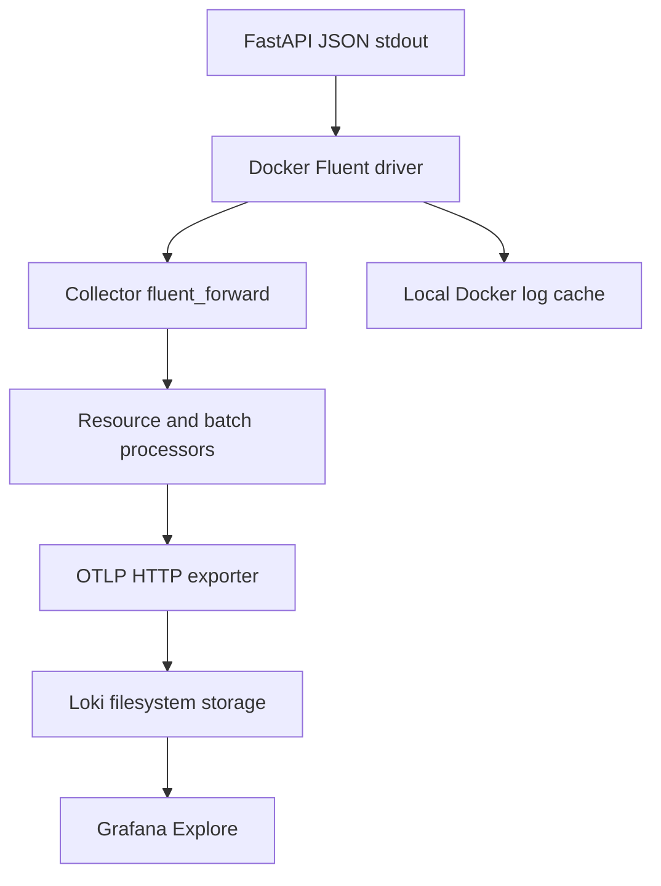

# Lab 27: Loki Architecture and Log Ingestion

## Purpose and Scope

> **Primary Objective:** Follow a real JSON record from FastAPI stdout through Docker and the Collector into Loki, then find that request in Grafana.

Metrics expose aggregate symptoms; retained event records let you investigate an individual request. This lab enables a logs-only Collector pipeline and a single-node Loki deployment, then proves end-to-end delivery with a unique canary.

Trace instrumentation, Tempo, profiling, log alerts and shipping-failure experiments remain in later roadmap stages. No second agent or application logging SDK is introduced.

## 1. Inherited State and Starting Checks

```bash
source lab-notes/session.sh
source lab-notes/evidence.sh
source lab-notes/raw-metrics.sh
source lab-notes/metrics-session.sh
metrics_check
start_lab 27
```

Complete [Lab 26](Lab-26.md). Use the same Linux Docker host, Bash session and repository root. Keep credentials, named volumes and the checkpoint item. Required host tools remain Docker Compose, Python 3, curl, jq, Git and ripgrep. Stop at a failed check and resolve it before proceeding. Nine services and six scrape jobs remain active.

## 2. Learning Objectives and Checkpoint

```bash
cp lab-notes/metrics-session.sh "$LAB_DIR/metrics-session-before.sh"
cp lab-notes/prometheus/prometheus.yml "$LAB_DIR/prometheus-before.yml"
capture_app_logs
install -d -m 755 lab-notes/logs
install -d -m 755 config/grafana/learning/provisioning/datasources
```

You will identify transport boundaries, explain stream/index/chunk roles, validate configuration before startup, keep one collection path, distinguish health from actual delivery and correlate a response with local and retained records.

Predict: will yesterday's `json-file` logs appear automatically? Does Collector health prove the canary arrived? Can a request ID exist without a trace? Record predictions before changing the driver. The Docker daemon must be on the same Linux host whose loopback endpoint is published below; a remote context refers to the remote daemon host.

## 3. Architecture and Transport Choice



Docker's built-in Fluentd logging driver speaks Fluent Forward directly to the Collector. There is no Fluentd server, Promtail, Alloy, filelog receiver or second shipper. This infrastructure-level transport avoids mounting the Docker socket or container-log directories.

The daemon sends to host `127.0.0.1:8006`, forwarded to the Collector's `0.0.0.0:8006`. The Collector sends to `http://loki:3100/otlp`; its OTLP HTTP exporter appends `/v1/logs`. Loki remains internal to Docker networking.

The [Docker driver documentation](https://docs.docker.com/engine/logging/drivers/fluentd/) describes its `log`, `source` and container fields. Collector contrib 0.160.0 maps `log` into the log body and the other fields into attributes. The body is therefore the original application JSON, not a Docker JSON-file wrapper.

## 4. Understand the Single-Node Storage Model

| Role/state | Responsibility |
|---|---|
| Distributor | Accepts OTLP records and checks limits/mapping |
| Ingester | Buffers and chunks records in the write path |
| TSDB index | Locates streams using labels and time |
| Filesystem chunks | Retain record content in the Loki volume |
| Query frontend/querier | Execute searches over recent/stored records |
| Compactor | Compacts state and performs retention cleanup |
| In-memory ring, replication factor 1 | Single-process coordination with no redundant copy |

One process contains these roles. A label set identifies a stream; Loki does not index every JSON word. Schema v13, TSDB and structured metadata support native OTLP ingestion.

The named volume survives container recreation, but host loss or volume deletion loses that copy. Seventy-two-hour retention is asynchronous cleanup, not a precise deletion deadline or a backup. This is not an HA deployment.

## 5. Install the Complete Loki Configuration

```bash
cat > lab-notes/logs/loki.yml <<'YAML'
auth_enabled: false
server:
  http_listen_address: 0.0.0.0
  http_listen_port: 3100
  grpc_listen_port: 9096
common:
  instance_addr: 127.0.0.1
  path_prefix: /loki
  replication_factor: 1
  ring:
    kvstore:
      store: inmemory
  storage:
    filesystem:
      chunks_directory: /loki/chunks
      rules_directory: /loki/rules
schema_config:
  configs:
    - from: 2024-01-01
      store: tsdb
      object_store: filesystem
      schema: v13
      index:
        prefix: index_
        period: 24h
storage_config:
  tsdb_shipper:
    active_index_directory: /loki/index
    cache_location: /loki/index-cache
compactor:
  working_directory: /loki/compactor
  retention_enabled: true
  delete_request_store: filesystem
limits_config:
  retention_period: 72h
  allow_structured_metadata: true
  ingestion_rate_mb: 4
  ingestion_burst_size_mb: 8
  otlp_config:
    resource_attributes:
      ignore_defaults: true
      attributes_config:
        - action: index_label
          attributes: [service.name, deployment.environment.name]
query_range:
  results_cache:
    cache:
      embedded_cache:
        enabled: true
        max_size_mb: 32
analytics:
  reporting_enabled: false
YAML
```

Only `service.name` and `deployment.environment.name` are indexed, normalized to `service_name` and `deployment_environment_name`. Other attributes can become structured metadata. Lab 28 inspects that distinction in detail.

Authentication is disabled for this private Docker learning network. Do not publish this endpoint directly to the internet. The explicit allowlist avoids accidental indexing of container or request identity.

## 6. Install the Logs-Only Collector Configuration

```bash
cat > lab-notes/logs/collector.yml <<'YAML'
extensions:
  health_check:
    endpoint: 0.0.0.0:13133
  file_storage:
    directory: /var/lib/otelcol/queue
    create_directory: true
receivers:
  fluent_forward:
    endpoint: 0.0.0.0:8006
processors:
  memory_limiter:
    check_interval: 1s
    limit_mib: 192
    spike_limit_mib: 48
  resource/logs:
    attributes:
    - key: service.name
      value: ${env:SERVICE_NAME}
      action: upsert
    - key: deployment.environment.name
      value: ${env:ENVIRONMENT}
      action: upsert
  batch:
    timeout: 1s
    send_batch_size: 512
    send_batch_max_size: 1024
exporters:
  otlp_http/loki:
    endpoint: http://loki:3100/otlp
    timeout: 5s
    sending_queue:
      enabled: true
      queue_size: 512
      storage: file_storage
    retry_on_failure:
      enabled: true
      initial_interval: 1s
      max_interval: 10s
      max_elapsed_time: 300s
service:
  extensions:
  - health_check
  - file_storage
  telemetry:
    logs:
      level: info
    metrics:
      readers:
      - pull:
          exporter:
            prometheus:
              host: 0.0.0.0
              port: 8888
  pipelines:
    logs:
      receivers:
      - fluent_forward
      processors:
      - memory_limiter
      - resource/logs
      - batch
      exporters:
      - otlp_http/loki
YAML
```

The pinned contrib distribution contains every receiver, processor, extension and exporter used here. Keep its version: exporter component names in older examples differ.

Resource identity comes from Compose environment settings because only FastAPI uses this receiver. Sending unrelated services into this fixed-identity pipeline would mislabel them. There is no app metric exporter and no trace pipeline.

The persistent export queue protects Collector-accepted batches within its limits. It does not make the full path lossless: Docker buffers are bounded, queues fill, retries expire and non-retryable rejects can lose records. The local Docker cache supports inspection, not a second network ingestion path.

## 7. Install the Compose Overlay

```bash
cat > lab-notes/compose.logs.yaml <<'YAML'
services:
  app:
    logging: !override
      driver: fluentd
      options:
        fluentd-address: 127.0.0.1:8006
        fluentd-async: "true"
        fluentd-buffer-limit: "8192"
        fluentd-sub-second-precision: "true"
        fluentd-write-timeout: "3s"
        tag: fastapi.app
        mode: non-blocking
        max-buffer-size: 4m
        cache-max-size: 10m
        cache-max-file: "3"
  otel-collector:
    volumes:
      - ./lab-notes/logs/collector.yml:/etc/otelcol-contrib/config.yaml:ro
  loki:
    volumes:
      - ./lab-notes/logs/loki.yml:/etc/loki/config.yaml:ro
YAML
```

This replaces only the app's baseline `json-file` driver. Other containers keep local logging, so the Collector cannot collect its own output recursively. Async connection and non-blocking delivery favor application progress during logging faults; finite buffers bound resource use and can drop records.

The base Compose file already supplies Loki 3.7.7, Collector contrib 0.160.0, non-root runtime users, persistent volumes, memory limits, busybox-based health probes and loopback port 8006. The overlay replaces matching config mounts without duplicating volumes or adding public Loki ports. Driver options are strings as required by Docker.

## 8. Extend Helpers and Platform Scrapes

```bash
cat > lab-notes/patch_logs_stage.py <<'PYTHON'
from pathlib import Path
p=Path("lab-notes/metrics-session.sh");t=p.read_text()
anchor='for extra in grafana alertmanager; do'
if 'for extra in grafana alertmanager logs; do' not in t:
    assert t.count(anchor)==2,"Expected the Lab 24 helper; review local edits"
    t=t.replace(anchor,'for extra in grafana alertmanager logs; do',1)
extra='  if [[ -f "$LAB_ROOT/lab-notes/compose.logs.yaml" ]]; then\n    expected+=$\'\\nloki\\notel-collector\'\n  fi\n'
anchor='  actual=$(dm ps --services --status running | sort)'
if extra not in t:
    assert t.count(anchor)==1
    t=t.replace(anchor,extra+anchor)
p.write_text(t)
p=Path("lab-notes/prometheus/prometheus.yml");t=p.read_text()
addition='''- job_name: loki
  static_configs:
  - targets:
    - loki:3100
- job_name: otel-collector
  static_configs:
  - targets:
    - otel-collector:8888
'''
if '- job_name: otel-collector\n' not in t:
    assert t.count('rule_files:\n')==1 and '- job_name: loki\n' not in t
    t=t.replace('rule_files:\n',addition+'rule_files:\n')
p.write_text(t)
print("Extended Compose helper, active inventory and platform scrape jobs")
PYTHON
```

```bash
python3 lab-notes/patch_logs_stage.py
source lab-notes/metrics-session.sh
chmod 644 lab-notes/logs/*.yml lab-notes/compose.logs.yaml
dm config --format json | jq '{
  app_driver:.services.app.logging.driver,
  app_otel:.services.app.environment.OTEL_ENABLED,
  app_profiling:.services.app.environment.PYROSCOPE_ENABLED,
  collector_ports:.services["otel-collector"].ports,
  loki_ports:(.services.loki.ports // [])
}' > "$LAB_DIR/config-summary.json"
cat "$LAB_DIR/config-summary.json"
```

Expected: Fluentd driver, tracing/profiling false, loopback Collector port 8006 and no Loki port. The guarded patch adds the overlay to `dm`, updates the active inventory and adds actual Loki/Collector `/metrics` targets.

The final stage has eleven services and eight scrape jobs. Collector internal metrics are platform telemetry; application metrics still use only FastAPI `/metrics`. Do not save the entire rendered Compose configuration as public evidence because it includes interpolated secrets.

## 9. Install Internal Query and Health Helpers

```bash
cat > lab-notes/loki_api.py <<'PYTHON'
"""Read internal Loki endpoints from the app container using standard Python."""
import sys
from urllib.error import HTTPError,URLError
from urllib.parse import urlencode
from urllib.request import urlopen
if len(sys.argv)<2 or not sys.argv[1].startswith("/"):
    raise SystemExit("Usage: loki_api.py /path [key=value ...]")
pairs=[]
for arg in sys.argv[2:]:
    key,sep,value=arg.partition("=")
    if not sep:raise SystemExit("Parameters must use key=value")
    pairs.append((key,value))
url="http://loki:3100"+sys.argv[1]+("?"+urlencode(pairs) if pairs else "")
try:
    with urlopen(url,timeout=15) as response:print(response.read().decode())
except HTTPError as error:
    print(f"Loki HTTP {error.code}: {error.read().decode()}",file=sys.stderr)
    raise SystemExit(1)
except (URLError,TimeoutError) as error:
    print(f"Loki request failed: {type(error).__name__}",file=sys.stderr)
    raise SystemExit(1)
PYTHON
```

```bash
cat > lab-notes/logs-session.sh <<'BASH'
# Source after session.sh, evidence.sh, raw-metrics.sh and metrics-session.sh.
lk() { dm exec -T app python - "$@" < "$LAB_ROOT/lab-notes/loki_api.py"; }
logs_window() {
  local minutes="${1:-15}"
  [[ "$minutes" =~ ^[1-9][0-9]*$ ]] || return 1
  read -r LOG_START_NS LOG_END_NS < <(python3 - "$minutes" <<'PYTHON'
import sys,time
end=time.time_ns()
print(end-int(sys.argv[1])*60*10**9,end)
PYTHON
  )
  export LOG_START_NS LOG_END_NS
}
log_scope() {
  LOG_SELECTOR=$(python3 - "$LAB_SERVICE" "$LAB_ENVIRONMENT" <<'PYTHON'
import json,sys
print('{service_name='+json.dumps(sys.argv[1])+',deployment_environment_name='+json.dumps(sys.argv[2])+'}')
PYTHON
  ) || return 1
  export LOG_SELECTOR
}
lrange() {
  : "${LOG_START_NS:?Run logs_window first}"
  : "${LOG_END_NS:?Run logs_window first}"
  lk /loki/api/v1/query_range "query=$1" "start=${2:-$LOG_START_NS}" \
    "end=${3:-$LOG_END_NS}" 'limit=1000' 'direction=forward'
}
lq() { lk /loki/api/v1/query "query=$1" "time=${2:-$(date +%s)}"; }
wait_loki() {
  local attempt
  for attempt in {1..60}; do
    if lk /ready >/dev/null 2>&1; then return 0; fi
    sleep 1
  done
  echo 'Loki readiness deadline exceeded' >&2
  return 1
}
wait_log_request() {
  local rid="$1" attempt result
  [[ "$rid" =~ ^[A-Za-z0-9._-]{1,64}$ ]] || return 1
  for attempt in {1..45}; do
    logs_window 15
    result=$(lrange "$LOG_SELECTOR |= \"$rid\"") || return 1
    if jq -e '[.data.result[].values[]]|length>0' <<<"$result" >/dev/null; then
      printf '%s\n' "$result"
      return 0
    fi
    sleep 1
  done
  echo 'Request log delivery deadline exceeded' >&2
  return 1
}
logs_check() {
  metrics_check && log_scope && wait_loki || return 1
  dm exec -T app python -c \
    'import urllib.request; urllib.request.urlopen("http://otel-collector:13133/",timeout=3).read()' || return 1
  wait_target loki && wait_target otel-collector || return 1
  echo 'Eleven services and eight scrape jobs are ready'
}
BASH
```

`lk` runs a small standard-library HTTP reader in the existing app container, where `loki` resolves through Docker DNS. No extra query container or host port is necessary. `lrange` uses a bounded time interval and a 1,000-record limit; `lq` is for instant metric queries. A limit-truncated response is not a complete event population.

## 10. Validate, Start and Recreate the Application

```bash
source lab-notes/logs-session.sh
dm build loki otel-collector
dm run --rm -T --no-deps loki -config.file=/etc/loki/config.yaml -verify-config=true
dm run --rm -T --no-deps otel-collector validate --config=/etc/otelcol-contrib/config.yaml
dm up -d --no-deps loki otel-collector
wait_loki
dm exec -T app python -c \
  'import urllib.request; urllib.request.urlopen("http://otel-collector:13133/",timeout=3).read()'
record_change 'recreate app with Fluent Forward log transport' planned
dm up -d --no-deps --force-recreate app
wait_ready
load_app_settings
log_scope
reload_prometheus
logs_check
record_change 'recreate app with Fluent Forward log transport' completed
```

A restart does not replace a container's logging driver; recreation is intentional. PostgreSQL and Redis volumes remain, while app counters reset with the process. Prometheus rate functions handle resets, but a brief observation gap still matters.

Old `json-file` history is not backfilled. This is why you captured local evidence before recreation and must generate a fresh canary now. Component readiness does not establish delivery of any particular record.

## 11. Prove Canary Delivery Across Layers

```bash
CANARY_ID="lab27-$(new_uuid)"
api -fsS -D "$LAB_DIR/canary-headers.txt" -H "X-Request-ID: $CANARY_ID" \
  "$APP_URL/api/v1/items" > "$LAB_DIR/canary-response.json"
wait_log_request "$CANARY_ID" > "$LAB_DIR/canary-loki.json"
capture_app_logs
jq -r '.data.result[].values[][1]' "$LAB_DIR/canary-loki.json" \
  | jq -c --arg rid "$CANARY_ID" 'select(.request_id==$rid)' > "$LAB_DIR/canary-records.jsonl"
jq -s -e --arg rid "$CANARY_ID" \
  'any(.[]; .event_name=="request_completed" and .request_id==$rid and .["http.status_code"]==200)' \
  "$LAB_DIR/canary-records.jsonl"
```

Find the accepted ID in the response header and the completion record in Docker output and Loki. Compare the same `event_id` and HTTP fields. A successful canary proves that record's delivery; it does not prove exactly-once historical delivery.

Loki's timestamp comes from Docker's forwarded event timestamp; the body's timestamp is application record creation time. Queue delay and clock errors can separate creation, observation and query arrival. Trace/span IDs are normally absent while tracing is disabled; request ID correlation still works.

## 12. Provision Grafana and Query the Same Record

```bash
cat > config/grafana/learning/provisioning/datasources/loki.yml <<'YAML'
apiVersion: 1
prune: false
datasources:
  - name: Loki
    uid: loki
    type: loki
    access: proxy
    url: http://loki:3100
    editable: false
    jsonData:
      maxLines: 1000
YAML
```

```bash
chmod 644 config/grafana/learning/provisioning/datasources/loki.yml
dm restart grafana
wait_grafana
printf '%s |= "%s"\n' "$LOG_SELECTOR" "$CANARY_ID"
```

Open Grafana Explore, choose Loki, set the last 15 minutes and paste the printed query. Expand its JSON body and record the UTC interval and event ID. The selector narrows the indexed stream; the line filter finds the ID inside it.

Grafana's backend resolves `http://loki:3100`. Browser localhost would refer to the wrong network context. The `loki` datasource UID is stable, and the existing Prometheus datasource remains default. Tempo navigation is not provisioned yet because this curriculum stage has no corresponding trace storage.

## 13. Inspect Each Transport Boundary

```bash
dm ps
dm logs --since 5m --no-color --tail 100 otel-collector > "$LAB_DIR/collector-output.txt"
dm logs --since 5m --no-color --tail 100 loki > "$LAB_DIR/loki-output.txt"
pq 'up{job=~"loki|otel-collector"}' > "$LAB_DIR/log-platform-scrapes.json"
dm exec -T app python -c \
  'import urllib.request; print(urllib.request.urlopen("http://otel-collector:8888/metrics",timeout=3).read().decode())' \
  > "$LAB_DIR/collector-metrics.txt"
rg '^# (HELP|TYPE) otelcol_(receiver|exporter)' "$LAB_DIR/collector-metrics.txt"
```

Inspect the exposed accepted/exported/failed log-record metrics before inventing a query. Receiver acceptance, exporter delivery and Loki queryability are different observations. Partial rejection and retries can complicate conclusions; retain event IDs as independent evidence. Treat infrastructure error output as potentially sensitive because rejected payload details may be included.

## 14. Troubleshooting and Bounded Rollback

| Symptom | Inspect | Action |
|---|---|---|
| Loki healthy, no canary | App driver and fresh request | Recreate app; old history is not replayed |
| Driver connection failure | Daemon host and port 8006 | Use daemon-host loopback, not container DNS |
| Collector ready, export failing | Exporter log and Loki health | Verify `/otlp`, permissions and limits |
| Doubly wrapped body | Receiver mapping | Do not add a Docker file parser to Fluent Forward |
| Grafana cannot query | Datasource URL/mount | Use internal Loki DNS and the learning provisioning mount |
| Container permission error | Parent traversal and file modes | Non-secret directories 755, config files 644 |
| Missing trace ID | App telemetry flags | Expected here; use the request ID |

If rollback is needed, preserve the error evidence, then restore only this stage:

```bash
cp "$LAB_DIR/metrics-session-before.sh" lab-notes/metrics-session.sh
cp "$LAB_DIR/prometheus-before.yml" lab-notes/prometheus/prometheus.yml
mv lab-notes/compose.logs.yaml "$LAB_DIR/compose.logs-disabled.yaml"
rm -f config/grafana/learning/provisioning/datasources/loki.yml
source lab-notes/metrics-session.sh
dm up -d --no-deps --force-recreate app
dm stop otel-collector loki
reload_prometheus
dm restart grafana
metrics_check
```

This restores nine services and the prior driver without deleting volumes. The normal completion state keeps Loki/Collector active. After correcting a fault, reapply the overlay/helper/datasource steps and prove a new canary.

## 15. Knowledge Check

1. Why host loopback for the driver but service DNS for Loki?
2. Does health prove canary delivery?
3. Does the local cache duplicate ingestion?
4. Why are old logs absent?

### Answer Guide

1. The driver executes in daemon-host context; the exporter executes on the Docker network.
2. No; query the record across the transport boundaries.
3. No; it provides local retrieval rather than a second network shipper.
4. Changing the driver does not replay the old container’s json-file history.

## 16. Professional Scenario Exercise

The API and Prometheus are healthy but a request is missing from Loki. Build a boundary-by-boundary investigation using its response ID, Docker output, driver config, receiver/exporter errors, Loki readiness and query scope.

## 17. Lab Notebook Template

Create a notebook in the evidence directory for this run:

```bash
test -e "$LAB_DIR/notebook.md" || printf '# Lab 27 Evidence\n' > "$LAB_DIR/notebook.md"
```

Use these headings and fill them with your predictions, commands, observed results and conclusions:

```markdown
# Lab 27 Evidence

## Starting state and operational question
## Prediction before the experiment
## Commands and UTC timestamps
## Observed results and source evidence
## Unexpected findings and troubleshooting
## Recovery proof and remaining limitations
```

## 18. Observable Completion Criteria

- [ ] Both pinned backend configurations validate.
- [ ] Only app logs use one Docker → Collector → Loki path.
- [ ] App traces/profiles stay disabled; metrics remain direct-scraped.
- [ ] Eleven services and eight scrape jobs are healthy.
- [ ] Response, local log and Loki record share a canary identity.
- [ ] Grafana Explore uses the provisioned internal datasource.
- [ ] No-backfill and bounded-delivery limitations are documented.

## 19. Production Implications

Production needs authenticated/encrypted access, capacity planning, backups and an explicit durability policy. A local persistent queue protects only one part of the path; one Loki replica offers no host-failure resilience.

## 20. End State and Transition

Keep eleven services, eight scrape jobs and the logs-only pipeline. [Lab 28](Lab-28.md) enriches selected structured metadata while keeping request/event IDs out of the index.
