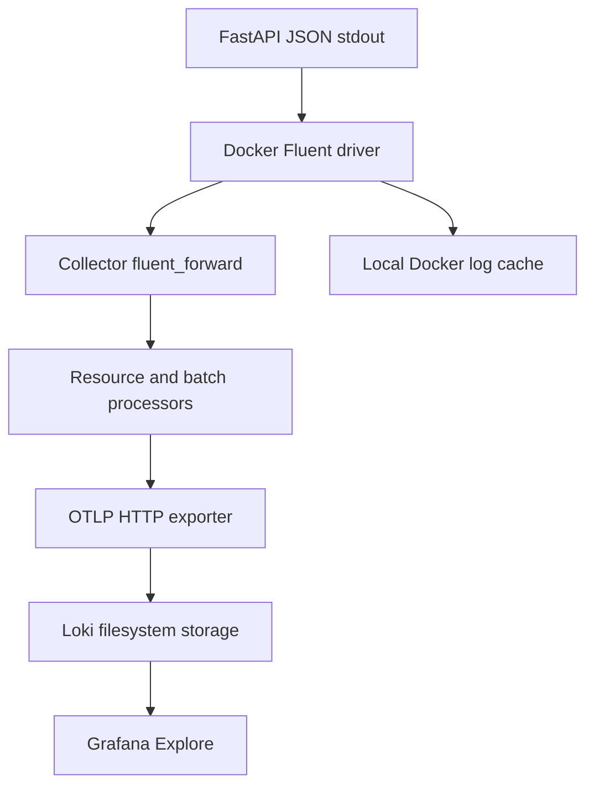

# Lab 27: Loki Architecture and Log Ingestion

## 1. Purpose and Learning Outcomes

**In Plain Language:** You will add a path that stores logs and follow one known request through it. The app writes JSON to stdout, Docker forwards the record to the Collector, and the Collector sends it to Loki. You will then find it in Grafana. A uniquely identifiable test record, called a canary, checks actual end-to-end delivery more directly than service health checks alone.

> **Primary Objective:** Follow a real JSON record from FastAPI stdout through Docker and the Collector into Loki, then find the same request in Grafana.

Metrics show combined symptoms across requests. Stored event records let you investigate one request in detail. This lab enables a logs-only Collector pipeline and a single-node Loki service, then checks delivery with a unique canary record.

Tracing, Tempo, profiling, log alerts, and shipping-failure experiments come later. This stage adds no second logging agent or application logging SDK.

## 2. Starting Point and Lab Map

Open the complete application repository before using this guide. Unless a step says otherwise, run commands in Bash from the repository's top-level folder. Follow the starting checks in order because later commands depend on the helper functions and running services they prepare.

Read each explanation before running its commands. Run one complete code block, check the result, and then continue. In your notebook, save the commands, what happened, why you think it happened, and anything that differed from the expected result.

### Key Terms

| **Term**           | **Explanation**                                                              |
| ------------------ | ---------------------------------------------------------------------------- |
| Log stream         | Records sharing the same indexed label set in Loki.                          |
| Collector pipeline | The ordered receiver, processing, and exporter stages that handle telemetry. |
| Canary             | A known, identifiable test event used to check the whole delivery path.      |

### Lab Map

The arrows show how the parts connect and where a request can take different paths. Use this map to understand the design. It is not a recording of a request that actually ran.


```mermaid
flowchart TD
    A["FastAPI JSON stdout"] --> D["Docker Fluent driver"]
    D --> C["Collector fluent_forward"]
    C --> B["Resource and batch processors"]
    B --> O["OTLP HTTP exporter"]
    O --> L["Loki filesystem storage"]
    L --> G["Grafana Explore"]
    D --> R["Local Docker log cache"]
```

## 3. Guided Walkthrough

### Step 01. Inherited State and Starting Checks

**What You Are Doing:** Check the existing stage before adding log transport. Local structured logs and metrics provide separate evidence if forwarding does not work.

**Practical Walkthrough:** Verify current metrics and local log records before adding remote storage. Leave tracing and profiling disabled so this change introduces only the logging path. The working local source will help locate failures later.

Confirm that a fresh structured record appears locally. If Loki is empty afterward, this proves the app emitted the record and helps narrow the problem to transport, storage, or querying. Keep tracing and profiling disabled throughout this stage.

```bash
source lab-notes/session.sh
source lab-notes/evidence.sh
source lab-notes/raw-metrics.sh
source lab-notes/metrics-session.sh
metrics_check
start_lab 27
```

Complete [Lab 26](Lab-26.md). Use the same Linux Docker host, Bash session, and repository root. Keep credentials, named volumes, and the checkpoint item. Required tools remain Docker Compose, Python 3, curl, jq, Git, and ripgrep. Resolve failed checks before continuing. Nine services and six scrape jobs remain active.

**Understanding the Result:** A verified source makes transport failures easier to locate. A backend cannot recover a record that the app never emitted.

### Step 02. Learning Objectives and Checkpoint

**What You Are Doing:** Save the current configuration and predict which records the new path will collect. Starting forwarding does not automatically import old Docker logs.

**Practical Walkthrough:** Save a recovery point and mark when forwarding starts. Use a fresh request after that time to prove the new path. This transport handles new output rather than replaying yesterday's local history.

Back up the helper and Prometheus configuration before the change. Record the activation time and use later events for delivery checks. Searching for an old Docker event would not test whether this newly enabled path works.

```bash
cp lab-notes/metrics-session.sh "$LAB_DIR/metrics-session-before.sh"
cp lab-notes/prometheus/prometheus.yml "$LAB_DIR/prometheus-before.yml"
capture_app_logs
install -d -m 755 lab-notes/logs
install -d -m 755 config/grafana/learning/provisioning/datasources
```

You will identify each transport step, explain streams, indexes, and chunks, validate files before startup, maintain one collection path, separate health from actual delivery, and match a response with local and stored records.

Predict whether yesterday's `json-file` logs will appear automatically, whether Collector health proves canary delivery, and whether a request ID can exist without a trace. Write your answers before changing the driver. The Docker daemon must run on the Linux host whose loopback endpoint is published below; a remote Docker context means the remote daemon host.

**Understanding the Result:** An absent historical record may predate collection rather than have been lost. Record the time forwarding became active.

### Step 03. Architecture and Transport Choice

**What You Are Doing:** Follow the one chosen logging route step by step. Multiple shippers could store duplicate copies and make one event look like several.

**Practical Walkthrough:** Trace JSON stdout through Docker's Fluentd driver, the Collector's Fluent Forward receiver, and OTLP/HTTP export to Loki. Identify what each step receives and forwards. Keep only this route active so duplicate collection does not distort event counts.

Name the steps and protocols before reading the settings: stdout, Docker logging driver, Fluent Forward receiver, and OTLP/HTTP exporter. More than one ingestion path could create extra copies of a single event and mislead later counts derived from logs.

The lab map in Section 2 shows this relationship.

Docker's built-in Fluentd driver speaks Fluent Forward directly to the Collector. There is no Fluentd server, Promtail, Alloy, filelog receiver, or second shipper. This transport also avoids mounting the Docker socket or container-log directories.

The daemon connects to host `127.0.0.1:8006`, forwarded to Collector `0.0.0.0:8006`. The Collector sends to `http://loki:3100/otlp`, and its OTLP HTTP exporter adds `/v1/logs`. Loki is reachable only inside Docker networking.

The [Docker driver documentation](https://docs.docker.com/engine/logging/drivers/fluentd/) describes the `log`, `source`, and container fields. Collector contrib 0.160.0 puts `log` in the record body and the other fields in attributes. The body therefore contains the app's original JSON, not an extra Docker JSON-file wrapper.

**Understanding the Result:** Track the same event ID through each stage. A total record count alone cannot distinguish duplicate shipping from genuinely different events.

### Step 04. Understand the Single-Node Storage Model

**What You Are Doing:** Learn the separate roles of the index, chunks, and persistent volume. This single-node setup supports stored lab logs without proving replication or high availability.

**Practical Walkthrough:** The index helps locate streams, while chunks store record content. Read the relevant paths and mounts to see where these live. Persistence in this local configuration is different from replicated storage or automatic failover.

Identify the mount that stores chunks and the settings for indexing and retention. A successful query or restart confirms only the tested single-node behavior. It does not demonstrate redundant copies or recovery from host failure.

| **Role/State**                       | **Responsibility**                                        |
| ------------------------------------ | --------------------------------------------------------- |
| Distributor                          | Accepts OTLP records and checks limits and field mappings |
| Ingester                             | Buffers incoming records and forms storage chunks         |
| TSDB index                           | Finds streams using labels and time                       |
| Filesystem chunks                    | Store record content in the Loki volume                   |
| Query frontend/querier               | Search recent and stored records                          |
| Compactor                            | Combines stored state and performs retention cleanup      |
| In-memory ring, replication factor 1 | Coordinates one process without a redundant data copy     |

One process contains all these roles. A label set defines a stream; Loki does not index every word in the JSON body. Schema v13, TSDB, and structured metadata support native OTLP ingestion.

The named volume survives container recreation, but losing the host or deleting the volume loses this copy. Seventy-two-hour retention is asynchronous cleanup, not an exact deletion deadline or backup. The deployment is not highly available.

**Understanding the Result:** Identify the volume that keeps data across recreation. A healthy process alone does not demonstrate redundant storage.

### Step 05. Install the Complete Loki Configuration

**What You Are Doing:** Install the full Loki configuration and its limited indexed-label policy. These settings determine storage, access, and how records can be found.

**Practical Walkthrough:** Use the supplied storage paths and label allowlist. Compare paths with active mounts and validate before startup. Unique record IDs stay outside the index so every request does not create a new stream.

Check the complete file and its actual storage mounts. Review exactly which attributes may become indexed labels. Stable service dimensions identify streams, while unique request and event identities remain outside the index.

```bash
cat > lab-notes/logs/loki.yml <<'YAML'
auth_enabled: false
server:
  http_listen_address: 0.0.0.0
  http_listen_port: 3100
  grpc_listen_port: 9096
common:
  instance_addr: 127.0.0.1
  path_prefix: /loki
  replication_factor: 1
  ring:
    kvstore:
      store: inmemory
  storage:
    filesystem:
      chunks_directory: /loki/chunks
      rules_directory: /loki/rules
schema_config:
  configs:
    - from: 2024-01-01
      store: tsdb
      object_store: filesystem
      schema: v13
      index:
        prefix: index_
        period: 24h
storage_config:
  tsdb_shipper:
    active_index_directory: /loki/index
    cache_location: /loki/index-cache
compactor:
  working_directory: /loki/compactor
  retention_enabled: true
  delete_request_store: filesystem
limits_config:
  retention_period: 72h
  allow_structured_metadata: true
  ingestion_rate_mb: 4
  ingestion_burst_size_mb: 8
  otlp_config:
    resource_attributes:
      ignore_defaults: true
      attributes_config:
        - action: index_label
          attributes: [service.name, deployment.environment.name]
query_range:
  results_cache:
    cache:
      embedded_cache:
        enabled: true
        max_size_mb: 32
analytics:
  reporting_enabled: false
YAML
```

**Command Note:** `<<'YAML'` writes the following text literally until the closing `YAML`. The quoted delimiter prevents Bash from expanding `$variables` inside the file. Creation and execution are separate actions.

Only `service.name` and `deployment.environment.name` become index labels, normalized to `service_name` and `deployment_environment_name`. Other attributes may be stored as structured metadata. Lab 28 examines this difference.

Authentication is disabled only for this private Docker learning network. Do not expose the endpoint directly to the internet. The explicit allowlist prevents accidental indexing of container and request identities.

**Understanding the Result:** Storage and field placement shape later queries. Keep the selected policy instead of replacing it with a generic example.

### Step 06. Install the Logs-Only Collector Configuration

**What You Are Doing:** Configure a logs-only Collector pipeline using the specified distribution. Identify its input, resource labels, batching, and Loki export stages.

**Practical Walkthrough:** Read the receiver, resource processor, batch processor, and exporter in order. Confirm the selected Collector distribution includes them. Keep the pipeline limited to logs; Collector readiness does not imply that tracing is active.

Check each configured component against the selected distribution. Receiving, processing, batching, and exporting are separate stages. A healthy process is only a readiness check; a fresh record will later test the complete path.

```bash
cat > lab-notes/logs/collector.yml <<'YAML'
extensions:
  health_check:
    endpoint: 0.0.0.0:13133
  file_storage:
    directory: /var/lib/otelcol/queue
    create_directory: true
receivers:
  fluent_forward:
    endpoint: 0.0.0.0:8006
processors:
  memory_limiter:
    check_interval: 1s
    limit_mib: 192
    spike_limit_mib: 48
  resource/logs:
    attributes:
    - key: service.name
      value: ${env:SERVICE_NAME}
      action: upsert
    - key: deployment.environment.name
      value: ${env:ENVIRONMENT}
      action: upsert
  batch:
    timeout: 1s
    send_batch_size: 512
    send_batch_max_size: 1024
exporters:
  otlp_http/loki:
    endpoint: http://loki:3100/otlp
    timeout: 5s
    sending_queue:
      enabled: true
      queue_size: 512
      storage: file_storage
    retry_on_failure:
      enabled: true
      initial_interval: 1s
      max_interval: 10s
      max_elapsed_time: 300s
service:
  extensions:
  - health_check
  - file_storage
  telemetry:
    logs:
      level: info
    metrics:
      readers:
      - pull:
          exporter:
            prometheus:
              host: 0.0.0.0
              port: 8888
  pipelines:
    logs:
      receivers:
      - fluent_forward
      processors:
      - memory_limiter
      - resource/logs
      - batch
      exporters:
      - otlp_http/loki
YAML
```

The pinned contrib distribution includes every receiver, processor, extension, and exporter used here. Keep that version because older examples can use different component names.

The pipeline assigns resource identity from Compose environment settings because only FastAPI sends to this receiver. Other services would be mislabeled if sent through this fixed-identity path. There is no app metric exporter or trace pipeline here.

The persistent queue protects batches the Collector has accepted, within its configured limits. It does not guarantee lossless delivery: Docker buffers and queues can fill, retries can expire, and permanent rejections can drop records. Docker's local cache supports inspection; it is not another network ingestion path.

**Understanding the Result:** Configured components define the real route. Process readiness does not prove that records complete every stage.

### Step 07. Install the Compose Overlay

**What You Are Doing:** Change only the app's logging transport with a Compose overlay. Limited buffers favor continued app work, so logging delivery still needs its own checks during failures.

**Practical Walkthrough:** Apply the logging-driver settings and read the finite, nonblocking buffers carefully. They let the app continue during some Collector failures, but delivery can be lost when buffers fill. Treat this as a tradeoff to measure, not a guarantee that every log is retained.

Inspect the app's effective driver and buffer settings after merging overlays. Nonblocking transport can protect request progress while exhausted buffers lose records. Keep business success separate from evidence that logs reached storage.

```bash
cat > lab-notes/compose.logs.yaml <<'YAML'
services:
  app:
    logging: !override
      driver: fluentd
      options:
        fluentd-address: 127.0.0.1:8006
        fluentd-async: "true"
        fluentd-buffer-limit: "8192"
        fluentd-sub-second-precision: "true"
        fluentd-write-timeout: "3s"
        tag: fastapi.app
        mode: non-blocking
        max-buffer-size: 4m
        cache-max-size: 10m
        cache-max-file: "3"
  otel-collector:
    volumes:
      - ./lab-notes/logs/collector.yml:/etc/otelcol-contrib/config.yaml:ro
  loki:
    volumes:
      - ./lab-notes/logs/loki.yml:/etc/loki/config.yaml:ro
YAML
```

Only the app's original `json-file` driver is replaced. Other containers keep local logging, which avoids the Collector forwarding its own output in a loop. Asynchronous connection and nonblocking delivery favor app progress, while finite buffers limit resource use and can drop records.

The base configuration already supplies Loki 3.7.7, Collector contrib 0.160.0, non-root users, persistent volumes, memory limits, busybox health probes, and loopback port 8006. The overlay replaces matching config mounts without duplicate volumes or public Loki ports. Docker requires logging-driver option values to be strings.

**Understanding the Result:** A business request can succeed while its log fails to reach Loki. These are separate outcomes to verify.

### Step 08. Extend Helpers and Platform Scrapes

**What You Are Doing:** Extend the helper and monitoring jobs without losing previous overlays. Check the new driver and confirm tracing and profiling remain disabled.

**Practical Walkthrough:** Update the cumulative helper and scrape inventory, then inspect effective settings before startup. Use the new helper afterward so an older command does not recreate the app with its previous logging driver.

Review the updated helper and jobs to confirm earlier stages remain. Check the app's effective logging settings and disabled tracing and profiling flags. Use this same helper consistently for later operations.

```bash
cat > lab-notes/patch_logs_stage.py <<'PYTHON'
from pathlib import Path
p=Path("lab-notes/metrics-session.sh");t=p.read_text()
anchor='for extra in grafana alertmanager; do'
if 'for extra in grafana alertmanager logs; do' not in t:
    assert t.count(anchor)==2,"Expected the Lab 24 helper; review local edits"
    t=t.replace(anchor,'for extra in grafana alertmanager logs; do',1)
extra='  if [[ -f "$LAB_ROOT/lab-notes/compose.logs.yaml" ]]; then\n    expected+=$\'\\nloki\\notel-collector\'\n  fi\n'
anchor='  actual=$(dm ps --services --status running | sort)'
if extra not in t:
    assert t.count(anchor)==1
    t=t.replace(anchor,extra+anchor)
p.write_text(t)
p=Path("lab-notes/prometheus/prometheus.yml");t=p.read_text()
addition='''- job_name: loki
  static_configs:
  - targets:
    - loki:3100
- job_name: otel-collector
  static_configs:
  - targets:
    - otel-collector:8888
'''
if '- job_name: otel-collector\n' not in t:
    assert t.count('rule_files:\n')==1 and '- job_name: loki\n' not in t
    t=t.replace('rule_files:\n',addition+'rule_files:\n')
p.write_text(t)
print("Extended Compose helper, active inventory and platform scrape jobs")
PYTHON
```

```bash
python3 lab-notes/patch_logs_stage.py
source lab-notes/metrics-session.sh
chmod 644 lab-notes/logs/*.yml lab-notes/compose.logs.yaml
dm config --format json | jq '{
  app_driver:.services.app.logging.driver,
  app_otel:.services.app.environment.OTEL_ENABLED,
  app_profiling:.services.app.environment.PYROSCOPE_ENABLED,
  collector_ports:.services["otel-collector"].ports,
  loki_ports:(.services.loki.ports // [])
}' > "$LAB_DIR/config-summary.json"
cat "$LAB_DIR/config-summary.json"
```

**Expected Result:** The app uses the Fluentd driver, tracing and profiling are false, Collector port 8006 is loopback-only, and Loki has no host port. The guarded patch adds the overlay to `dm`, updates the active inventory, and adds real Loki and Collector `/metrics` targets.

The final stage has eleven services and eight scrape jobs. Collector internal metrics describe the platform; app metrics still come only from FastAPI `/metrics`. Do not publish the full rendered Compose configuration because expanded settings include secrets.

**Understanding the Result:** Use the active helper consistently. After activation, confirm the intended eleven services and eight jobs.

### Step 09. Install Internal Query and Health Helpers

**What You Are Doing:** Add limited query helpers that run from the existing app container. They can resolve Loki's service name without exposing another host port.

**Practical Walkthrough:** Install the helpers and use the documented container network context. Keep time ranges and result counts limited to the experiment. This provides internal Loki access without dumping all retained records or creating an external listener.

Check where the helper runs and which Loki endpoint it uses. State the stream selector, interval, and record limit explicitly. A Docker service name is meaningful from that network context, not automatically from the browser.

```bash
cat > lab-notes/loki_api.py <<'PYTHON'
"""Read internal Loki endpoints from the app container using standard Python."""
import sys
from urllib.error import HTTPError,URLError
from urllib.parse import urlencode
from urllib.request import urlopen
if len(sys.argv)<2 or not sys.argv[1].startswith("/"):
    raise SystemExit("Usage: loki_api.py /path [key=value ...]")
pairs=[]
for arg in sys.argv[2:]:
    key,sep,value=arg.partition("=")
    if not sep:raise SystemExit("Parameters must use key=value")
    pairs.append((key,value))
url="http://loki:3100"+sys.argv[1]+("?"+urlencode(pairs) if pairs else "")
try:
    with urlopen(url,timeout=15) as response:print(response.read().decode())
except HTTPError as error:
    print(f"Loki HTTP {error.code}: {error.read().decode()}",file=sys.stderr)
    raise SystemExit(1)
except (URLError,TimeoutError) as error:
    print(f"Loki request failed: {type(error).__name__}",file=sys.stderr)
    raise SystemExit(1)
PYTHON
```

```bash
cat > lab-notes/logs-session.sh <<'BASH'
# Source after session.sh, evidence.sh, raw-metrics.sh and metrics-session.sh.
lk() { dm exec -T app python - "$@" < "$LAB_ROOT/lab-notes/loki_api.py"; }
logs_window() {
  local minutes="${1:-15}"
  [[ "$minutes" =~ ^[1-9][0-9]*$ ]] || return 1
  read -r LOG_START_NS LOG_END_NS < <(python3 - "$minutes" <<'PYTHON'
import sys,time
end=time.time_ns()
print(end-int(sys.argv[1])*60*10**9,end)
PYTHON
  )
  export LOG_START_NS LOG_END_NS
}
log_scope() {
  LOG_SELECTOR=$(python3 - "$LAB_SERVICE" "$LAB_ENVIRONMENT" <<'PYTHON'
import json,sys
print('{service_name='+json.dumps(sys.argv[1])+',deployment_environment_name='+json.dumps(sys.argv[2])+'}')
PYTHON
  ) || return 1
  export LOG_SELECTOR
}
lrange() {
  : "${LOG_START_NS:?Run logs_window first}"
  : "${LOG_END_NS:?Run logs_window first}"
  lk /loki/api/v1/query_range "query=$1" "start=${2:-$LOG_START_NS}" \
    "end=${3:-$LOG_END_NS}" 'limit=1000' 'direction=forward'
}
lq() { lk /loki/api/v1/query "query=$1" "time=${2:-$(date +%s)}"; }
wait_loki() {
  local attempt
  for attempt in {1..60}; do
    if lk /ready >/dev/null 2>&1; then return 0; fi
    sleep 1
  done
  echo 'Loki readiness deadline exceeded' >&2
  return 1
}
wait_log_request() {
  local rid="$1" attempt result
  [[ "$rid" =~ ^[A-Za-z0-9._-]{1,64}$ ]] || return 1
  for attempt in {1..45}; do
    logs_window 15
    result=$(lrange "$LOG_SELECTOR |= \"$rid\"") || return 1
    if jq -e '[.data.result[].values[]]|length>0' <<<"$result" >/dev/null; then
      printf '%s\n' "$result"
      return 0
    fi
    sleep 1
  done
  echo 'Request log delivery deadline exceeded' >&2
  return 1
}
logs_check() {
  metrics_check && log_scope && wait_loki || return 1
  dm exec -T app python -c \
    'import urllib.request; urllib.request.urlopen("http://otel-collector:13133/",timeout=3).read()' || return 1
  wait_target loki && wait_target otel-collector || return 1
  echo 'Eleven services and eight scrape jobs are ready'
}
BASH
```

`lk` runs a small standard-library HTTP client inside the existing app container, where Docker DNS resolves `loki`. It needs no extra container or host port. `lrange` uses a fixed time interval and a 1,000-record limit; `lq` runs instant metric queries. If the result hits its limit, it is not proof of the complete event set.

**Understanding the Result:** Interpret addresses from the caller's network. An internal service name may not be accessible directly in a browser.

### Step 10. Validate, Start and Recreate the Application

**What You Are Doing:** Validate the files, start the backends, and recreate the app to change its logging driver. Record its counter reset and distinguish old local history from new forwarded records.

**Practical Walkthrough:** Start Loki and the Collector after validation, then recreate the app. A simple process restart cannot change settings assigned when the container was created. Note the new process lifetime and generate fresh forwarding evidence afterward.

Apply the container-level logging change through recreation after both backends are ready. Record the process boundary because in-memory counters reset. Keep records produced before and after activation separate.

```bash
source lab-notes/logs-session.sh
dm build loki otel-collector
dm run --rm -T --no-deps loki -config.file=/etc/loki/config.yaml -verify-config=true
dm run --rm -T --no-deps otel-collector validate --config=/etc/otelcol-contrib/config.yaml
dm up -d --no-deps loki otel-collector
wait_loki
dm exec -T app python -c \
  'import urllib.request; urllib.request.urlopen("http://otel-collector:13133/",timeout=3).read()'
record_change 'recreate app with Fluent Forward log transport' planned
dm up -d --no-deps --force-recreate app
wait_ready
load_app_settings
log_scope
reload_prometheus
logs_check
record_change 'recreate app with Fluent Forward log transport' completed
```

A restart does not replace a container's driver, so recreation is intentional. PostgreSQL and Redis volumes stay intact, while app counters reset. Prometheus rate functions account for observed resets, but a brief collection gap still limits evidence.

Old `json-file` history is not backfilled. That is why you saved local evidence before recreation and now need a fresh canary. Ready components do not prove that any particular record arrived.

**Understanding the Result:** Recreation changes both transport and process-local telemetry. Establish new baselines afterward.

### Step 11. Prove Canary Delivery Across Layers

**What You Are Doing:** Send a known request and match it across the response, local log, and Loki. The same event identity and content provide evidence of its delivery.

**Practical Walkthrough:** Keep the request's correlation value, response, and local record. After allowing time for forwarding, find the same event in Loki. Matching identity and content is stronger proof than finding an unrelated recent log.

Save the response ID and identify the local structured event before querying Loki. Compare the returned event ID and HTTP fields. The test should establish that this specific record crossed the configured route.

```bash
CANARY_ID="lab27-$(new_uuid)"
api -fsS -D "$LAB_DIR/canary-headers.txt" -H "X-Request-ID: $CANARY_ID" \
  "$APP_URL/api/v1/items" > "$LAB_DIR/canary-response.json"
wait_log_request "$CANARY_ID" > "$LAB_DIR/canary-loki.json"
capture_app_logs
jq -r '.data.result[].values[][1]' "$LAB_DIR/canary-loki.json" \
  | jq -c --arg rid "$CANARY_ID" 'select(.request_id==$rid)' > "$LAB_DIR/canary-records.jsonl"
jq -s -e --arg rid "$CANARY_ID" \
  'any(.[]; .event_name=="request_completed" and .request_id==$rid and .["http.status_code"]==200)' \
  "$LAB_DIR/canary-records.jsonl"
```

**Command Note:** `jq --arg` passes a shell value as a JSON-query string variable without inserting it into the query text. When used, `-e` makes a false or null final result return a failing exit status.

Find the accepted response-header ID and the matching completion in Docker output and Loki. Compare `event_id` and HTTP fields. Success proves delivery of that record, not exactly-once delivery of all historical records.

Loki uses Docker's forwarded event timestamp, while the body contains the app's record-creation time. Queues and clock differences can separate creation, observation, and arrival. Trace and span IDs are normally absent with tracing disabled, but request-ID correlation still works.

**Understanding the Result:** One canary proves one record's delivery. It does not establish completeness for earlier traffic.

### Step 12. Provision Grafana and Query the Same Record

**What You Are Doing:** Provision Loki as a Grafana source and find the same canary in Explore. Save its stream selection, time interval, and event identity.

**Practical Walkthrough:** Use the correct source, stream, and interval in Explore. Compare the canary with the internal API result. This checks Grafana's query path separately from ingestion into Loki.

Verify Loki's source UID and internal URL, then query the same canary and time range in Explore. Matching the API result confirms the additional visualization path.

```bash
cat > config/grafana/learning/provisioning/datasources/loki.yml <<'YAML'
apiVersion: 1
prune: false
datasources:
  - name: Loki
    uid: loki
    type: loki
    access: proxy
    url: http://loki:3100
    editable: false
    jsonData:
      maxLines: 1000
YAML
```

```bash
chmod 644 config/grafana/learning/provisioning/datasources/loki.yml
dm restart grafana
wait_grafana
printf '%s |= "%s"\n' "$LOG_SELECTOR" "$CANARY_ID"
```

In Grafana Explore, choose Loki, select the last 15 minutes, and paste the printed query. Expand the JSON body and save the UTC interval and event ID. The selector chooses indexed streams, and the line filter finds the ID inside their records.

Grafana's backend resolves `http://loki:3100`; browser localhost refers to another network context. The `loki` datasource UID stays stable, and Prometheus remains the default source. Tempo links are not added yet because this stage has no trace storage.

**Understanding the Result:** Grafana access is another stage to verify. Save selection and time settings so the result can be repeated.

### Step 13. Inspect Each Transport Boundary

**What You Are Doing:** Check record acceptance, export, and retrieval separately. Healthy endpoints alone cannot prove complete delivery.

**Practical Walkthrough:** A component may accept a record that is delayed or lost later. Inspect receiver, exporter, and query evidence for known events. Use IDs and an expected request set when checking completeness rather than relying only on health status.

Compare receiver acceptance, export results, and Loki retrieval for the same interval. One successful stage does not guarantee later retention. Expected event IDs help identify specific missing records that aggregate health counters cannot name.

```bash
dm ps
dm logs --since 5m --no-color --tail 100 otel-collector > "$LAB_DIR/collector-output.txt"
dm logs --since 5m --no-color --tail 100 loki > "$LAB_DIR/loki-output.txt"
pq 'up{job=~"loki|otel-collector"}' > "$LAB_DIR/log-platform-scrapes.json"
dm exec -T app python -c \
  'import urllib.request; print(urllib.request.urlopen("http://otel-collector:8888/metrics",timeout=3).read().decode())' \
  > "$LAB_DIR/collector-metrics.txt"
rg '^# (HELP|TYPE) otelcol_(receiver|exporter)' "$LAB_DIR/collector-metrics.txt"
```

Inspect the actual accepted, exported, and failed-record metrics before writing queries. Acceptance, delivery, and queryability are separate facts. Retries and partial rejections can complicate totals, so retain IDs as independent evidence. Review infrastructure errors before sharing; they may include rejected payload details.

**Understanding the Result:** State the last stage proven for each record. Do not turn a component health check into a guarantee of end-to-end completeness.

## 4. Troubleshooting and Diagnosis

Begin with the first result that differed from your prediction. Save the exact error or symptom and identify which service or command produced it. Use the checks below, make the needed fix, and repeat the original check to confirm the problem is resolved.

### Troubleshooting and Bounded Rollback

| **Symptom**                     | **Inspect**                              | **Action**                                                |
| ------------------------------- | ---------------------------------------- | --------------------------------------------------------- |
| Loki healthy, no canary         | Effective app driver and a fresh request | Recreate the app as required; old history is not replayed |
| Driver connection failure       | Docker daemon host and port 8006         | Use daemon-host loopback, not container service DNS       |
| Collector ready, export failing | Exporter errors and Loki health          | Check `/otlp`, permissions, and limits                    |
| Doubly wrapped body             | Receiver's field mapping                 | Do not apply a Docker file parser to Fluent Forward       |
| Grafana cannot query            | Source URL and provisioning mount        | Use internal Loki DNS and the learning mount              |
| Container permission error      | Parent-directory access and file modes   | Use 755 for nonsecret directories and 644 for configs     |
| Missing trace ID                | App telemetry flags                      | Expected at this stage; correlate with the request ID     |

If rollback is needed, save the error evidence and restore only this stage:

```bash
cp "$LAB_DIR/metrics-session-before.sh" lab-notes/metrics-session.sh
cp "$LAB_DIR/prometheus-before.yml" lab-notes/prometheus/prometheus.yml
mv lab-notes/compose.logs.yaml "$LAB_DIR/compose.logs-disabled.yaml"
rm -f config/grafana/learning/provisioning/datasources/loki.yml
source lab-notes/metrics-session.sh
dm up -d --no-deps --force-recreate app
dm stop otel-collector loki
reload_prometheus
dm restart grafana
metrics_check
```

Rollback restores nine services and the earlier driver without deleting volumes. Normal completion keeps Loki and the Collector running. After fixing the issue, reapply the overlay, helper, and source steps, then prove delivery with a new canary.

## 5. Review and Practice

Answer the questions in your own words before reading the answers. For the scenario, say what you would inspect and exactly what each result would tell you.

### Knowledge Check

1. Why host loopback for the driver but service DNS for Loki?
2. Does health prove canary delivery?
3. Does the local cache duplicate ingestion?
4. Why are old logs absent?

#### Answer Guide

1. The logging driver runs in the Docker daemon host's context, while the Collector exporter uses the Docker network.
2. No. Find the specific record across the path to prove its delivery.
3. No. The cache supports local retrieval; it is not another network shipper.
4. A new driver does not replay the previous container's json-file history.

### Professional Scenario Exercise

The app and Prometheus are healthy, but one request is missing from Loki. Investigate each step using the response ID, Docker output, driver settings, receiver and exporter errors, Loki readiness, and query selection.

## 6. Completion Checklist

Tick an item only when you can show its result or saved evidence. Finish the cleanup instructions before starting the next lab.

### Observable Completion Criteria

- [ ] Both pinned backend configurations validate.
- [ ] Only app logs use the single Docker → Collector → Loki route.
- [ ] App tracing and profiling remain disabled, and metrics are still scraped directly.
- [ ] Eleven services and eight scrape jobs are healthy.
- [ ] The response, local log, and Loki record match the same canary identity.
- [ ] Grafana Explore uses the provisioned internal Loki source.
- [ ] I have documented the lack of historical backfill and the limits of delivery guarantees.

## 7. Production Context and Next Lab

### Production Implications

Production needs authentication, encryption, capacity planning, backups, and a clear durability policy. A persistent local queue protects only part of the route. One Loki replica does not protect against losing its host.

### End State and Transition

Keep eleven services, eight jobs, and the logs-only pipeline. [Lab 28](Lab-28.md) adds selected structured metadata while keeping request and event IDs outside the index.
