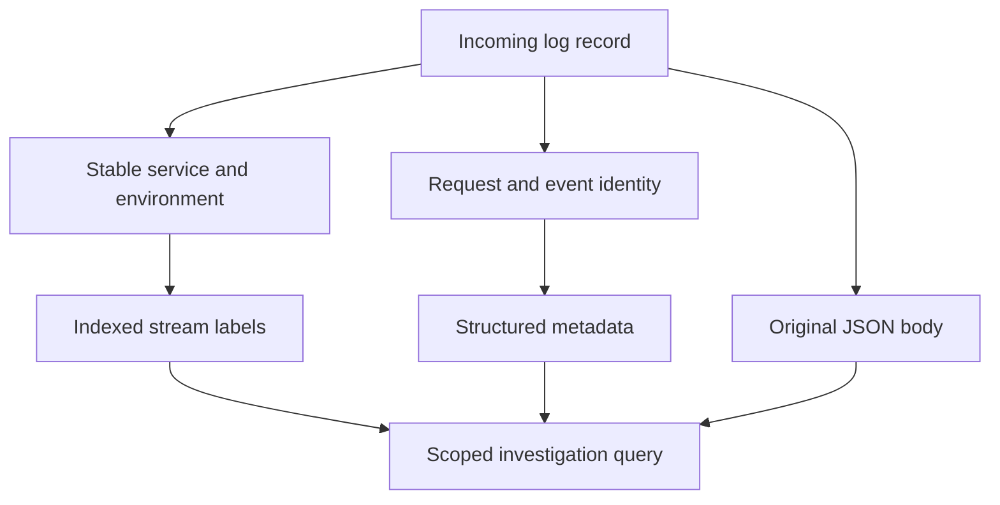

# Lab 28: Loki Labels, Structured Metadata, and Cardinality

## 1. Purpose and Learning Outcomes

**In Plain Language:** You will make request-level fields searchable without creating a large Loki index. Stable service and environment labels identify streams, while unique request and event IDs stay with each record as metadata and in its body. Check the mapping with new events, then simulate what would happen if every unique ID became an index label.

> **Primary Objective:** Search individual record IDs and operational fields without creating a separate indexed stream for every value.

Log transport is working. Now you will decide explicitly where fields belong: stable values used to select streams go in the index, while individual request and event identities stay with records.

You will enrich new records, compare metadata with unchanged bodies, inspect indexed streams, and run a twenty-request experiment. The high-cardinality design, which creates many distinct streams, is simulated locally rather than installed in Loki. No app code or new service is added.

## 2. Starting Point and Lab Map

Open the complete application repository before using this guide. Unless a step says otherwise, run commands in Bash from the repository's top-level folder. Follow the starting checks in order because later commands depend on the helper functions and running services they prepare.

Read each explanation before running its commands. Run one complete code block, check the result, and then continue. In your notebook, save the commands, what happened, why you think it happened, and anything that differed from the expected result.

### Key Terms

| **Term**            | **Explanation**                                                                    |
| ------------------- | ---------------------------------------------------------------------------------- |
| Indexed label       | A field whose value helps identify and find a Loki stream.                         |
| Structured metadata | Searchable fields attached to each record without making every value a new stream. |
| Query-time field    | A field extracted when a query reads records, rather than stored in the index.     |

### Lab Map

The arrows show how the parts connect and where a request can take different paths. Use this map to understand the design. It is not a recording of a request that actually ran.



## 3. Guided Walkthrough

### Step 01. Inherited State and Starting Checks

**What You Are Doing:** Start with working log delivery and save the Collector configuration. The experiment changes how fields are stored, not how the app handles requests.

**Practical Walkthrough:** Verify a fresh delivered record and back up the working configuration. The app keeps emitting the same JSON body. The changes occur downstream, letting you investigate mapping mistakes separately from source behavior.

Save the Collector file and verify a new event before editing field mappings. Keep the app's output unchanged. This gives you a stable source record for checking any unexpected metadata.

```bash
source lab-notes/session.sh
source lab-notes/evidence.sh
source lab-notes/raw-metrics.sh
source lab-notes/metrics-session.sh
source lab-notes/logs-session.sh
logs_check
start_lab 28
```

Complete [Lab 27](Lab-27.md). Use the same Linux Docker host, Bash session, and repository root. Keep credentials, named volumes, and the checkpoint item. Required tools remain Docker Compose, Python 3, curl, jq, Git, and ripgrep. Resolve failed checks before continuing. Eleven services and eight jobs remain active.

**Understanding the Result:** Keep the source body as your reference. Establish delivery first so you can focus on where fields appear and what they mean.

### Step 02. Objectives and Baseline Evidence

**What You Are Doing:** Save an example stream and record before enrichment. Predict whether the added metadata should change the indexed stream count.

**Practical Walkthrough:** Capture stream labels and body fields. Decide which values should remain indexed and which should become metadata. Unique IDs should help find requests without multiplying stream identities in this design.

Save both the label object and original body. Predict where each selected field will go. Finding an ID is only part of the check; verify that it is searchable in the intended place rather than added to the index.

```bash
cp lab-notes/logs/collector.yml "$LAB_DIR/collector-before.yml"
logs_window 15
lk /loki/api/v1/series "match[]=$LOG_SELECTOR" "start=$LOG_START_NS" "end=$LOG_END_NS" \
  > "$LAB_DIR/index-before.json"
cat "$LAB_DIR/index-before.json"
```

You will classify index labels, metadata, and body fields; calculate how label combinations grow; filter IDs without indexing them; distinguish query fields from index labels; and explain why old records do not gain new metadata automatically.

Predict whether this change creates a new indexed stream, resets app counters, or rewrites yesterday's records. Save before-and-after index evidence and the source configuration so you can verify the answers.

**Understanding the Result:** Compare the index using the same service selection before and after. New metadata does not automatically mean a new indexed label.

### Step 03. Choose Field Placement Deliberately

**What You Are Doing:** Choose index, metadata, or body placement based on each field's purpose and possible values. Useful investigation IDs do not need to become index dimensions.

**Practical Walkthrough:** Consider how many values each field can take over sustained traffic. Service and environment have a limited set of values. Unique request details belong in metadata and the retained body. Do not judge growth only from this small test.

A field with twenty values today may gain one new value per future request. Use bounded, stable fields for stream selection and keep individual identities outside the index. Estimate possible growth before choosing labels.

| **Field**                                  | **Placement**                                                 | **Reason**                                                   |
| ------------------------------------------ | ------------------------------------------------------------- | ------------------------------------------------------------ |
| Service, environment                       | Indexed resource labels                                       | Stable values with a limited set of useful search scopes     |
| Request ID, event ID                       | Metadata and the existing body                                | Find individual events without creating new index streams    |
| Trace/span ID                              | Body once tracing is enabled; native mapping comes later      | Correlate requests without using IDs as general index labels |
| Event name, method, route, status          | Metadata and body                                             | Useful filters that do not need to multiply streams here     |
| Duration, operation, exception class       | Metadata when present                                         | Add numeric or diagnostic context to an event                |
| Container ID/name                          | Metadata                                                      | These values can change when containers are recreated        |
| Password, token, cookie, sensitive payload | Neither                                                       | Storing a value as metadata does not make it secret          |

Two environments and three services allow up to six combinations. Adding five log levels allows thirty. If every event has a unique indexed ID, every record can create a stream. The actual count depends on combinations that occur, not only the theoretical product.

Even a field with a limited set of values is not automatically worth indexing. Status and level still multiply combinations and affect chunk sizes. Choose labels for useful selection, stability, and acceptable cost.

**Understanding the Result:** Cardinality means the number of distinct values or combinations. A helpful field can remain searchable without increasing indexed stream identities.

### Step 04. Understand OTLP Mapping and Query-Time Fields

**What You Are Doing:** Follow resource and log attributes through OTLP mapping into Loki. A field visible in query output is not necessarily part of the index.

**Practical Walkthrough:** Inspect the final labels and metadata after mapping. A flattened response can display several kinds of fields together, so do not infer index membership from visibility alone.

Compare resource attributes, record attributes, and the stored Loki representation. Use index inspection together with metadata and body evidence to decide where an ID lives. Being available to a query does not prove it is indexed.

Collector resource keys `service.name` and `deployment.environment.name` become `service_name` and `deployment_environment_name` in Loki. Only those two are indexed by the allowlist. Record attributes become structured metadata. See [Loki's native OTLP mapping](https://grafana.com/docs/loki/latest/send-data/otel/).

Grafana and query responses can show metadata and parsed fields as labels too. A response's `stream` map may include request or event IDs while `/series` still reports only the two indexed keys. Inspect the appropriate evidence before classifying the field.

Use the [series API](https://grafana.com/docs/loki/latest/reference/loki-http-api/#query-streams) to inspect the index. Use bodies and query fields for per-record content. A UI calling something a label does not establish that it is indexed.

```bash
rg -n -A 8 'otlp_config:' lab-notes/logs/loki.yml
lk /loki/api/v1/labels "query=$LOG_SELECTOR" "start=$LOG_START_NS" "end=$LOG_END_NS" \
  > "$LAB_DIR/index-label-names.json"
jq -e 'all(.data[]; (keys-["service_name","deployment_environment_name"]|length)==0)' \
  "$LAB_DIR/index-before.json"
```

With clean course history, expect only the two allowed index keys. Older configurations may have left streams that remain until retention removes them. A new configuration does not rewrite old storage, so inspect history before deleting anything.

**Understanding the Result:** A field can be visible and searchable without being indexed. Verify placement using the correct backend view.

### Step 05. Install the Complete Metadata-Enrichment Pipeline

**What You Are Doing:** Copy selected safe fields into metadata while retaining the original JSON body. Compare the two representations to verify the transformation.

**Practical Walkthrough:** Add only the selected attributes and keep their exact names and types. Later filters depend on this mapping. Leaving the body intact gives you an independent reference for checking the copied values.

For every assignment, check the source key, destination name, and type. A syntactically valid transform can still put the wrong value under a familiar name. Compare with the unchanged body before trusting later filters.

```bash
cat > lab-notes/logs/collector.yml <<'YAML'
extensions:
  health_check:
    endpoint: 0.0.0.0:13133
  file_storage:
    directory: /var/lib/otelcol/queue
    create_directory: true
receivers:
  fluent_forward:
    endpoint: 0.0.0.0:8006
processors:
  memory_limiter:
    check_interval: 1s
    limit_mib: 192
    spike_limit_mib: 48
  resource/logs:
    attributes:
    - key: service.name
      value: ${env:SERVICE_NAME}
      action: upsert
    - key: deployment.environment.name
      value: ${env:ENVIRONMENT}
      action: upsert
  batch:
    timeout: 1s
    send_batch_size: 512
    send_batch_max_size: 1024
  transform/metadata:
    error_mode: ignore
    log_statements:
    - context: log
      statements:
      - keep_keys(log.attributes, ["fluent.tag", "source", "container_id", "container_name"])
      - merge_maps(log.cache, ParseJSON(log.body), "upsert") where IsString(log.body) and IsMatch(log.body, "^[{]")
      - set(log.severity_text, log.cache["level"]) where log.cache["level"] != nil
      - set(log.attributes["schema_version"], log.cache["schema_version"]) where log.cache["schema_version"] !=
        nil
      - set(log.attributes["event_name"], log.cache["event_name"]) where log.cache["event_name"] != nil
      - set(log.attributes["event_id"], log.cache["event_id"]) where log.cache["event_id"] != nil
      - set(log.attributes["request_id"], log.cache["request_id"]) where log.cache["request_id"] != nil
      - set(log.attributes["http.method"], log.cache["http.method"]) where log.cache["http.method"] != nil
      - set(log.attributes["http.route"], log.cache["http.route"]) where log.cache["http.route"] != nil
      - set(log.attributes["http.status_code"], log.cache["http.status_code"]) where log.cache["http.status_code"]
        != nil
      - set(log.attributes["duration_ms"], log.cache["duration_ms"]) where log.cache["duration_ms"] != nil
      - set(log.attributes["operation"], log.cache["operation"]) where log.cache["operation"] != nil
      - set(log.attributes["error_type"], log.cache["error_type"]) where log.cache["error_type"] != nil
exporters:
  otlp_http/loki:
    endpoint: http://loki:3100/otlp
    timeout: 5s
    sending_queue:
      enabled: true
      queue_size: 512
      storage: file_storage
    retry_on_failure:
      enabled: true
      initial_interval: 1s
      max_interval: 10s
      max_elapsed_time: 300s
service:
  extensions:
  - health_check
  - file_storage
  telemetry:
    logs:
      level: info
    metrics:
      readers:
      - pull:
          exporter:
            prometheus:
              host: 0.0.0.0
              port: 8888
  pipelines:
    logs:
      receivers:
      - fluent_forward
      processors:
      - memory_limiter
      - resource/logs
      - transform/metadata
      - batch
      exporters:
      - otlp_http/loki
YAML
```

**Command Note:** `<<'YAML'` writes the following text literally until the closing `YAML`. The quoted delimiter prevents Bash from expanding `$variables` in the file. Creation and execution are separate steps.

The transform first keeps only the Docker attributes used here. `ParseJSON` reads the body into an OTTL cache, then selected safe fields are copied into record attributes. The original body remains available for comparison and queries spanning earlier history.

`error_mode: ignore` allows malformed or non-JSON lines to continue instead of failing the batch. It does not validate or sanitize their contents. Inspect warnings and query errors as needed. An attribute allowlist does not remove a secret already written into the body.

Resource identity still comes from the Collector environment rather than an override in the body. Send only the intended app to this fixed-identity receiver.

**Understanding the Result:** Enrichment should preserve the event's meaning. Matching body and metadata values are the key validation.

### Step 06. Validate and Apply Only This Change

**What You Are Doing:** Validate the change and restart only the Collector. New records gain metadata, while stored historical records keep their existing representation.

**Practical Walkthrough:** Leave the app process and driver unchanged. Validate and restart the Collector, then generate new records to test the transform. Pipeline changes do not add fields to data already stored in Loki.

Check the file and restart only that component. Use a fresh known request after activation. An earlier record with the old schema is not a valid test of the new transformation.

```bash
chmod 644 lab-notes/logs/collector.yml
dm run --rm -T --no-deps otel-collector validate --config=/etc/otelcol-contrib/config.yaml
record_change 'add selected structured log metadata' planned
dm restart otel-collector
logs_check
record_change 'add selected structured log metadata' completed
```

**Expected Result:** Only the Collector restarts. The app keeps running and its counters do not reset. Brief buffering or delay is possible. New records receive metadata, while old records stay unchanged. Use a fresh canary to verify delivery beyond receiver health.

**Understanding the Result:** Check when a record was ingested before diagnosing absent metadata. An old record does not prove that the new mapping failed.

### Step 07. Prove Metadata and Body Agree

**What You Are Doing:** Select new records by metadata and compare exact values with the original body. This checks the mapping, not just whether matching text exists somewhere.

**Practical Walkthrough:** Query the fresh request by its metadata field, parse its body independently, and compare the chosen fields. Check the known request and event identities structurally rather than relying on a broad text match.

Use the intended metadata field to select the record, then compare exact body values. Matching identity and status tests both current delivery and correct field mapping.

```bash
RID="lab28-$(new_uuid)"
api -fsS -H "X-Request-ID: $RID" "$APP_URL/api/v1/items" > /dev/null
wait_log_request "$RID" > "$LAB_DIR/new-record.json"
logs_window 15
lrange "$LOG_SELECTOR | request_id=\"$RID\" | event_name=\"request_completed\"" \
  > "$LAB_DIR/metadata-filter.json"
python3 - "$LAB_DIR/metadata-filter.json" "$RID" <<'PYTHON'
import json,sys
result=json.load(open(sys.argv[1]));records=[]
for stream in result["data"]["result"]:
    for row in stream["values"]:
        record=json.loads(row[1])
        assert record["request_id"]==sys.argv[2] and record["event_name"]=="request_completed"
        assert record["http.status_code"]==200
        records.append({"event_id":record["event_id"],"request_id":record["request_id"],"query_fields":sorted(stream["stream"])})
assert records,"No matching completion record"
print(json.dumps(records,indent=2))
PYTHON
```

These filters do not need a JSON parser stage because they use newly stored metadata. The verifier separately parses the original body and checks the same identity and status.

Put `| request_id="lab28-example"` after a limited stream selector; do not put the request ID inside `{...}`. The selector addresses indexed streams, while the pipeline filters entries. Repeated identical event IDs should trigger a duplication check, not be assumed to represent separate business operations.

**Understanding the Result:** A successful text search does not establish where a value is stored. Compare explicit fields in each representation.

### Step 08. Generate Twenty Distinct Identities

**What You Are Doing:** Generate twenty unique requests within one service scope and verify every expected identity. Seeing the last canary does not prove all earlier events arrived.

**Practical Walkthrough:** Run the twenty-request sequence once and keep the full expected set. Requery that same interval while delivery settles. Sending another workload after an early empty query would change the set you are trying to verify.

Save all twenty expected IDs before querying. Recheck the same population rather than creating more traffic. This keeps delivery delay distinguishable from genuinely missing records.

```bash
PREFIX="lab28-many-$(new_uuid)"
: > "$LAB_DIR/request-ids.txt"
for number in {1..20}; do
  rid="$PREFIX-$number"
  printf '%s\n' "$rid" >> "$LAB_DIR/request-ids.txt"
  api -fsS -H "X-Request-ID: $rid" "$APP_URL/api/v1/items" > /dev/null
  sleep 0.1
done
wait_log_request "$PREFIX-20" > "$LAB_DIR/final-canary.json"
logs_window 15
lrange "$LOG_SELECTOR |= \"$PREFIX-\" | event_name=\"request_completed\"" \
  > "$LAB_DIR/twenty-records.json"
lk /loki/api/v1/series "match[]=$LOG_SELECTOR" "start=$LOG_START_NS" "end=$LOG_END_NS" \
  > "$LAB_DIR/index-after.json"
```

Expect twenty unique request and event IDs without twenty new indexed streams. The final canary is only a progress signal; compare the complete set next. If records are still arriving, briefly requery the same prefix instead of sending new requests.

**Understanding the Result:** The last event arriving does not prove complete delivery. Compare all expected identities with all observed identities.

### Step 09. Measure the Index and Simulate the Bad Design

**What You Are Doing:** Inspect the real index and separately simulate indexing unique IDs. The comparison shows stream growth without applying a harmful design to Loki.

**Practical Walkthrough:** First measure the real limited-label index. Then calculate the hypothetical stream count when unique IDs become labels. Keep this as a separate simulation so the live policy remains unchanged.

Clearly label measured counts and simulated counts in your notes. The simulation demonstrates identity multiplication; it should not change actual indexing or generate an ingestion flood.

```bash
python3 - "$LAB_DIR" <<'PYTHON'
import json,sys
from pathlib import Path
p=Path(sys.argv[1]);expected=set((p/"request-ids.txt").read_text().splitlines())
data=json.loads((p/"twenty-records.json").read_text())
records=[json.loads(row[1]) for stream in data["data"]["result"] for row in stream["values"]]
observed={r["request_id"] for r in records}
assert observed==expected,{"missing":sorted(expected-observed),"unexpected":sorted(observed-expected)}
ids={r["event_id"] for r in records}
before=json.loads((p/"index-before.json").read_text())["data"]
after=json.loads((p/"index-after.json").read_text())["data"]
assert after and all(set(s)=={"service_name","deployment_environment_name"} for s in after)
summary={"records":len(records),"unique_requests":len(observed),"unique_event_ids":len(ids),
         "index_streams_before":len(before),"index_streams_after":len(after),
         "simulated_bounded_streams":len({(r["service"],r["environment"]) for r in records}),
         "simulated_event_id_streams":len({(r["service"],r["environment"],r["event_id"]) for r in records})}
(p/"cardinality-proof.json").write_text(json.dumps(summary,indent=2)+"\n")
print(json.dumps(summary,indent=2))
PYTHON
```

Normal delivery should give twenty records, requests, and event IDs. The simulation gives one stream for the bounded labels and twenty streams when IDs are indexed. Clean course history has one indexed service/environment combination. Earlier configuration can raise that count, but IDs should not become index keys.

The bad design is calculated offline. Metadata still uses storage and query work, so a small index does not guarantee a cheap query if you group by every unique per-record ID.

**Understanding the Result:** The simulation explains how series combinations grow. It is not a direct measurement of production storage capacity.

### Step 10. Handle Historical Records and Field Collisions

**What You Are Doing:** Account for old record formats and naming collisions during parsing. Use explicit extraction when a general JSON parser would make a field ambiguous.

**Practical Walkthrough:** Check record age and extraction paths when metadata is missing or a field has an unexpected name. Parsing can collide with existing labels or metadata. Use the provided explicit extraction to select the body field you intend.

Investigate both event age and exact field location. A parsed body value can share a name with existing metadata. Explicit aliases make it clear which representation a query reads.

Old Lab 27 records may have event name only in the body, so a metadata-only filter can miss them. Parse the body explicitly when searching across versions. Enrichment does not alter earlier stored records.

A generic `| json` stage can collide with metadata names and create `_extracted` fields. Use aliases such as `body_event` or `status` when comparing representations. Literal dotted body keys require bracket syntax: `http.status_code` is a single key in this envelope, not a nested object.

Do not index `container_id` merely to identify recreations. Larger deployments need considered rules for stream size, ordering, and identity. This single-app design is not a universal production template.

**Understanding the Result:** An old schema and a field-name collision are different problems. Check both before deciding a record is missing or corrupt.

### Step 11. Recovery and Troubleshooting

**What You Are Doing:** Confirm current delivery and the intended index policy after enrichment. Check ingestion time before interpreting missing metadata as loss.

**Practical Walkthrough:** Generate a fresh request, verify body and metadata agreement, and inspect index labels. Keep the approved configuration and its recovery copy. Describe historical records using their actual schema instead of assuming all history was updated.

Check fresh delivery, exact copied values, and current index keys. Preserve the enrichment and backup. Older records retain the representation they had at ingestion, which later queries must account for.

| **Symptom**                        | **Inspect**                                    | **Action**                                                      |
| ---------------------------------- | ---------------------------------------------- | --------------------------------------------------------------- |
| Body has ID, metadata filter empty | Record time compared with activation time      | Test a new record and parse the bodies of old records           |
| ID appears in a query response     | `/series` output                               | Distinguish query-visible fields from actual index labels       |
| ID actually appears in `/series`   | Resource mapping and earlier history           | Correct future mapping; existing history is not rewritten       |
| Transform rejected                 | Statement syntax and pinned version            | Validate the complete configuration before restarting           |
| Missing experiment IDs             | Queue delay, query times, and transport errors | Requery the same limited request set                            |
| Sensitive metadata                 | Source body and copied-field allowlist         | Prevent or redact the value; metadata is not private by default |

```bash
logs_check
capture_app_logs
dm logs --since 5m --no-color --tail 100 otel-collector > "$LAB_DIR/collector-after.txt"
git diff --check
```

If needed, restore `collector-before.yml` over the learning configuration, validate it, and restart only the Collector. This changes future processing without erasing old bodies or metadata. Normal completion keeps enrichment enabled.

**Understanding the Result:** Verify delivery and limited indexing separately. Added metadata should preserve the same event identity and body content.

## 4. Troubleshooting and Diagnosis

Begin with the first result that differed from your prediction. Save the exact error or symptom and identify which service or command produced it. Use the checks below, make the needed fix, and repeat the original check to confirm the problem is resolved.

Use the recovery and troubleshooting checks in Step 11.

## 5. Review and Practice

Answer the questions in your own words before reading the answers. For the scenario, say what you would inspect and exactly what each result would tell you.

### Knowledge Check

1. Can request_id be a query field without being indexed?
2. Why not index every bounded field?
3. Does allowlisting sanitize an unsafe body?
4. Why do old records behave differently?

#### Answer Guide

1. Yes. Metadata and parsed body values can be queried without becoming indexed stream labels.
2. Even bounded fields multiply combinations. Index only values that provide useful stream selection.
3. No. Prevent sensitive values or redact them at the appropriate source or processing stage.
4. Only newly processed records pass through the updated transform; stored history is unchanged.

### Professional Scenario Exercise

A teammate wants to label streams with service, environment, status, user ID, request ID, and container ID. Choose a placement for each, estimate the possible combinations, and show how to find one request without indexing its identity.

## 6. Completion Checklist

Tick an item only when you can show its result or saved evidence. Finish the cleanup instructions before starting the next lab.

### Observable Completion Criteria

- [ ] Field placement is documented and the original body remains unchanged.
- [ ] Metadata filters and body checks agree for a new canary.
- [ ] Twenty unique request IDs remain outside the index.
- [ ] An offline comparison demonstrates the stream growth of the bad design.
- [ ] I have verified historical-schema differences and query-field versus index-field placement.
- [ ] Eleven services and eight jobs remain healthy.

## 7. Production Context and Next Lab

### Production Implications

Version the field definitions and consider combinations, not labels one by one. Metadata still has size limits, query costs, and access implications. Prevent secrets from entering either bodies or attributes.

### End State and Transition

Keep the enriched logs-only pipeline. [Lab 29](Lab-29.md) uses these field definitions for efficient LogQL searches and reconstruction of event evidence.
