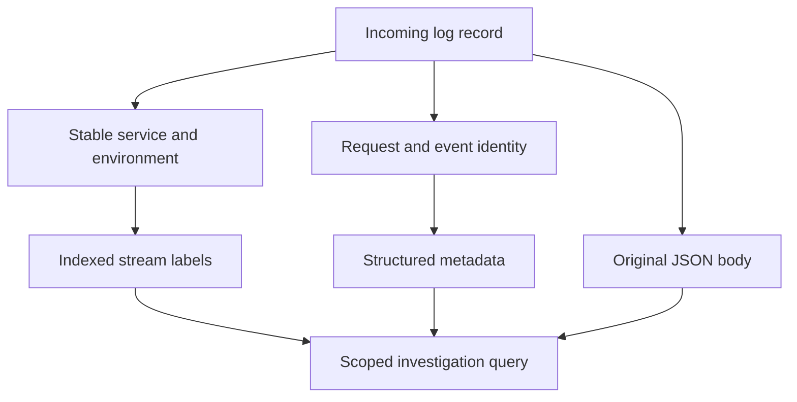

# Lab 28: Loki Labels, Structured Metadata, and Cardinality

## 1. Purpose and Learning Outcomes

**In Plain Language:** You will make request-level log fields searchable while keeping Loki's index small. Stable service and environment values define the stream; unique request and event IDs stay in metadata and the body. Verify the mapping with new records, then compare the intended design with a simulated index that includes every unique identity.

> **Primary Objective:** Make per-record identity and operational fields searchable without multiplying indexed streams.

Transport now works. This lab makes field placement an explicit storage/query contract: stable stream scope belongs in the index; individual request/event identity belongs with records.

You will enrich new records, compare metadata with unchanged bodies, inspect actual indexed series and run a twenty-request experiment. The bad high-cardinality design is simulated locally rather than installed into Loki. No application code or new service is added.

## 2. Starting Point and Lab Map

Use this guide inside the complete application repository. Run commands from the repository root in Bash unless a step says otherwise. Work through the starting checks in order; they load the helpers and state this lab needs.

Read the explanation before each step, run one complete code block at a time, and compare the actual result with the stated expectation. Save commands, observations, explanations, and unexpected results in your notebook.

### Key Terms

| **Term**            | **Plain-Language Meaning**                                                      |
| ------------------- | ------------------------------------------------------------------------------- |
| Indexed label       | A field used to identify and locate a Loki stream.                              |
| Structured metadata | Per-record fields queryable without making each unique value a stream identity. |
| Query-time field    | A field extracted while reading records rather than added to the stored index.  |

### Lab Map

The arrows show the flow or dependency being studied. Branches identify paths to compare; this is a conceptual map, not a captured runtime trace.



## 3. Guided Walkthrough

### Step 01. Inherited State and Starting Checks

**What You Are Doing:** Begin with the working log-delivery path and a recoverable Collector configuration. This experiment changes field placement, not the source request behavior.

**Practical Walkthrough:** Check fresh delivery and save the working Collector configuration before changing field placement. The application continues emitting the same structured body; this experiment enriches how records are represented downstream. A recovery copy lets you isolate mapping errors without altering source behavior.

Save the working Collector configuration and verify a fresh event before editing field mapping. Keep application output unchanged. This isolates downstream representation changes, so an unexpected metadata result can be investigated without simultaneously changing the source record schema.

```bash
source lab-notes/session.sh
source lab-notes/evidence.sh
source lab-notes/raw-metrics.sh
source lab-notes/metrics-session.sh
source lab-notes/logs-session.sh
logs_check
start_lab 28
```

Complete [Lab 27](Lab-27.md). Use the same Linux Docker host, Bash session and repository root. Keep credentials, named volumes and the checkpoint item. Required host tools remain Docker Compose, Python 3, curl, jq, Git and ripgrep. Stop at a failed check and resolve it before proceeding. Eleven services and eight scrape jobs remain active.

**Understanding the Result:** Keep the source record as a reference. Transport health should already be established before testing metadata semantics.

### Step 02. Objectives and Baseline Evidence

**What You Are Doing:** Capture the current stream and record evidence before enrichment. Predict whether metadata changes should create new indexed streams.

**Practical Walkthrough:** Capture a current stream and example record, including labels and body fields. Predict which attributes should remain indexed and which will become metadata. Unique request and event IDs should help searches without multiplying stream identities in the approved design.

Capture both the stream label object and the original body. Predict the destination of each selected field before enrichment. Unique identities should remain searchable without becoming indexed stream dimensions; checking where a field appears is therefore as important as checking whether it appears.

```bash
cp lab-notes/logs/collector.yml "$LAB_DIR/collector-before.yml"
logs_window 15
lk /loki/api/v1/series "match[]=$LOG_SELECTOR" "start=$LOG_START_NS" "end=$LOG_END_NS" \
  > "$LAB_DIR/index-before.json"
cat "$LAB_DIR/index-before.json"
```

You will classify index labels, metadata and body fields; calculate combination growth; filter identities without indexing them; distinguish query labels from indexed labels; and explain why enrichment is not retroactive.

Predict whether adding metadata will create a new index stream, restart app counters or rewrite yesterday's records. Keep the source configuration and before/after index evidence so the answer is demonstrable.

**Understanding the Result:** Compare the index before and after using the same service scope. New metadata is not automatically a new indexed label.

### Step 03. Choose Field Placement Deliberately

**What You Are Doing:** Assign each field to the index, metadata, or body according to its purpose and possible values. Unique identities are useful for investigations without becoming index dimensions.

**Practical Walkthrough:** Assign each field according to its purpose and potential number of values. Bounded service and environment values support indexing; unique identities belong in metadata and the retained body. Think about growth over many requests, not just the handful of values present in this run.

Estimate how many values each field can acquire over sustained traffic. Choose index labels for bounded grouping and metadata or body fields for individual identity. A field with only twenty values in this experiment may still be effectively unbounded if every future request creates another value.

| **Field**                                  | **Placement**                                                 | **Reason**                                               |
| ------------------------------------------ | ------------------------------------------------------------- | -------------------------------------------------------- |
| Service, environment                       | Indexed resource labels                                       | Stable, bounded investigation scope                      |
| Request ID, event ID                       | Metadata plus existing body                                   | Unique identity without index growth                     |
| Trace/span ID                              | Body when later tracing is active; native mapping comes later | Per-request correlation, never a general index dimension |
| Event name, method, route, status          | Metadata/body                                                 | Useful filters; no need to multiply streams here         |
| Duration, operation, exception class       | Metadata when present                                         | Numeric or diagnostic event context                      |
| Container ID/name                          | Metadata                                                      | Changes during recreation                                |
| Password, token, cookie, sensitive payload | Neither                                                       | Metadata is not a secrecy boundary                       |

Two environments × three services gives up to six combinations. Adding five levels permits thirty. A unique event ID can create a stream per record. Actual cardinality depends on combinations that occur, not just a product on paper.

A bounded field is not automatically worth indexing. Even status and level multiply stream combinations and influence chunk size. Choose labels based on scope, selectivity, stability and cost.

**Understanding the Result:** Cardinality risk follows possible distinct values. A field useful for investigation does not necessarily belong in the index.

### Step 04. Understand OTLP Mapping and Query-Time Fields

**What You Are Doing:** Trace resource and record attributes into Loki's stored representation. A field visible in query output is not necessarily an indexed label.

**Practical Walkthrough:** Trace resource attributes and log-record attributes through the OTLP mapping into Loki. Inspect the final label and metadata locations rather than inferring them from a flattened query response. A field can be filterable or visible without being part of the stream's indexed identity.

Inspect resource and log-record attributes separately, then compare the final Loki representation. Query-time visibility does not prove indexing. Use the index inspection and returned metadata/body structure together before claiming a request ID became a stream label or remained outside the index.

The Collector resource keys `service.name` and `deployment.environment.name` become Loki's `service_name` and `deployment_environment_name`. The configured allowlist indexes only those two. Log attributes become structured metadata. See [Loki's native OTLP mapping](https://grafana.com/docs/loki/latest/send-data/otel/).

A label displayed in Grafana or in a query response is not necessarily indexed. Structured metadata and parser output are also exposed to LogQL. A query result's `stream` map can contain request IDs and event IDs even while `/series` shows only the two indexed keys.

Use the [series API](https://grafana.com/docs/loki/latest/reference/loki-http-api/#query-streams) for index structure. Use record bodies and query fields for entry-level content. Never conclude that a field is indexed merely because the UI calls it a label.

```bash
rg -n -A 8 'otlp_config:' lab-notes/logs/loki.yml
lk /loki/api/v1/labels "query=$LOG_SELECTOR" "start=$LOG_START_NS" "end=$LOG_END_NS" \
  > "$LAB_DIR/index-label-names.json"
jq -e 'all(.data[]; (keys-["service_name","deployment_environment_name"]|length)==0)' \
  "$LAB_DIR/index-before.json"
```

For clean course history, expect only the two allowlisted indexed keys. Earlier experiments can leave historical streams until retention removes them; a configuration change does not rewrite old storage. Inspect history before deleting anything.

**Understanding the Result:** Field visibility and index membership are different properties. Verify placement through the appropriate backend evidence.

### Step 05. Install the Complete Metadata-Enrichment Pipeline

**What You Are Doing:** Add selected safe fields as metadata while preserving the original JSON body. The body gives you an independent representation for checking the transform.

**Practical Walkthrough:** Add the selected safe attributes through the transform while keeping the original JSON body intact. This creates two representations that can be compared for consistency. Preserve the exact key names and types because later metadata filters rely on that mapping.

Review every transform assignment for exact source key, destination name, and type. Keep the original JSON body intact so the copied attributes can be checked against it. A mapping that produces a familiar field name with the wrong value would remain syntactically valid but break later filtering.

```bash
cat > lab-notes/logs/collector.yml <<'YAML'
extensions:
  health_check:
    endpoint: 0.0.0.0:13133
  file_storage:
    directory: /var/lib/otelcol/queue
    create_directory: true
receivers:
  fluent_forward:
    endpoint: 0.0.0.0:8006
processors:
  memory_limiter:
    check_interval: 1s
    limit_mib: 192
    spike_limit_mib: 48
  resource/logs:
    attributes:
    - key: service.name
      value: ${env:SERVICE_NAME}
      action: upsert
    - key: deployment.environment.name
      value: ${env:ENVIRONMENT}
      action: upsert
  batch:
    timeout: 1s
    send_batch_size: 512
    send_batch_max_size: 1024
  transform/metadata:
    error_mode: ignore
    log_statements:
    - context: log
      statements:
      - keep_keys(log.attributes, ["fluent.tag", "source", "container_id", "container_name"])
      - merge_maps(log.cache, ParseJSON(log.body), "upsert") where IsString(log.body) and IsMatch(log.body, "^[{]")
      - set(log.severity_text, log.cache["level"]) where log.cache["level"] != nil
      - set(log.attributes["schema_version"], log.cache["schema_version"]) where log.cache["schema_version"] !=
        nil
      - set(log.attributes["event_name"], log.cache["event_name"]) where log.cache["event_name"] != nil
      - set(log.attributes["event_id"], log.cache["event_id"]) where log.cache["event_id"] != nil
      - set(log.attributes["request_id"], log.cache["request_id"]) where log.cache["request_id"] != nil
      - set(log.attributes["http.method"], log.cache["http.method"]) where log.cache["http.method"] != nil
      - set(log.attributes["http.route"], log.cache["http.route"]) where log.cache["http.route"] != nil
      - set(log.attributes["http.status_code"], log.cache["http.status_code"]) where log.cache["http.status_code"]
        != nil
      - set(log.attributes["duration_ms"], log.cache["duration_ms"]) where log.cache["duration_ms"] != nil
      - set(log.attributes["operation"], log.cache["operation"]) where log.cache["operation"] != nil
      - set(log.attributes["error_type"], log.cache["error_type"]) where log.cache["error_type"] != nil
exporters:
  otlp_http/loki:
    endpoint: http://loki:3100/otlp
    timeout: 5s
    sending_queue:
      enabled: true
      queue_size: 512
      storage: file_storage
    retry_on_failure:
      enabled: true
      initial_interval: 1s
      max_interval: 10s
      max_elapsed_time: 300s
service:
  extensions:
  - health_check
  - file_storage
  telemetry:
    logs:
      level: info
    metrics:
      readers:
      - pull:
          exporter:
            prometheus:
              host: 0.0.0.0
              port: 8888
  pipelines:
    logs:
      receivers:
      - fluent_forward
      processors:
      - memory_limiter
      - resource/logs
      - transform/metadata
      - batch
      exporters:
      - otlp_http/loki
YAML
```

**Command Note:** `<<'YAML'` writes the following block literally until `YAML`. Quoting the delimiter prevents Bash from expanding `$variables` inside the generated file; creation and execution are separate steps.

The transform first retains only used Docker attributes. `ParseJSON` copies the body into an OTTL cache, then copies selected safe fields into log attributes. The original body is preserved for comparison and historical query compatibility.

`error_mode: ignore` lets non-JSON or malformed lines continue rather than failing a batch. It does not validate or sanitize them. Review processing warnings and query errors where needed. Field allowlisting does not remove a secret already interpolated into the body.

Resource identity still comes from the Collector's environment, not a body override. Keep this fixed-identity receiver restricted to the intended application.

**Understanding the Result:** Enrichment should not rewrite the underlying event meaning. Body-to-metadata agreement is the useful validation target.

### Step 06. Validate and Apply Only This Change

**What You Are Doing:** Validate and restart only the Collector for this change. New records gain enrichment; historical records retain their previous representation.

**Practical Walkthrough:** Validate and restart only the Collector to activate the transform. Keep the app process and logging driver unchanged, then create fresh records. Older Loki records retain their previous representation; changing the pipeline does not retroactively add metadata to stored history.

Validate the Collector configuration and restart only that component. Generate new records after activation while retaining the app process. Earlier stored records keep their original schema, so test the new transform with a fresh known request rather than expecting historical metadata to change retroactively.

```bash
chmod 644 lab-notes/logs/collector.yml
dm run --rm -T --no-deps otel-collector validate --config=/etc/otelcol-contrib/config.yaml
record_change 'add selected structured log metadata' planned
dm restart otel-collector
logs_check
record_change 'add selected structured log metadata' completed
```

**Expected Result:** only the Collector restarts; the app remains running and counters do not reset. Brief queueing/delay is possible. New records receive the metadata; old records are not changed. Receiver health still needs a fresh delivery canary.

**Understanding the Result:** Use ingestion timing when diagnosing missing metadata. An old record is not evidence that the new transform failed.

### Step 07. Prove Metadata and Body Agree

**What You Are Doing:** Filter new records by metadata and compare their fields with the original body. Agreement verifies the mapping rather than merely proving some text can be found.

**Practical Walkthrough:** Query fresh records by metadata, then compare selected fields with the preserved JSON body and known request identity. Check values structurally rather than only finding matching text somewhere in a line. This proves the intended mapping as well as current delivery.

Select the fresh request by the intended metadata field, then parse the body and compare exact values. Check request and event identities rather than a substring match anywhere in the line. This simultaneously tests delivery and correct mapping of the chosen attributes.

```bash
RID="lab28-$(new_uuid)"
api -fsS -H "X-Request-ID: $RID" "$APP_URL/api/v1/items" > /dev/null
wait_log_request "$RID" > "$LAB_DIR/new-record.json"
logs_window 15
lrange "$LOG_SELECTOR | request_id=\"$RID\" | event_name=\"request_completed\"" \
  > "$LAB_DIR/metadata-filter.json"
python3 - "$LAB_DIR/metadata-filter.json" "$RID" <<'PYTHON'
import json,sys
result=json.load(open(sys.argv[1]));records=[]
for stream in result["data"]["result"]:
    for row in stream["values"]:
        record=json.loads(row[1])
        assert record["request_id"]==sys.argv[2] and record["event_name"]=="request_completed"
        assert record["http.status_code"]==200
        records.append({"event_id":record["event_id"],"request_id":record["request_id"],"query_fields":sorted(stream["stream"])})
assert records,"No matching completion record"
print(json.dumps(records,indent=2))
PYTHON
```

No JSON parser stage is required: the filters use newly ingested structured metadata. The verifier independently parses the original body and confirms the same identity/status.

Use `| request_id="lab28-example"` after a bounded selector; do not add request ID inside `{...}`. The selector addresses index streams; the pipeline addresses entries. Multiple identical event IDs should prompt a duplication investigation, not an assumption of multiple business operations.

**Understanding the Result:** A successful text search alone cannot identify the storage location of the matched value. Compare explicit fields.

### Step 08. Generate Twenty Distinct Identities

**What You Are Doing:** Generate twenty distinct identities under one bounded service scope. Verify the whole expected set because the last observed canary does not prove all earlier records arrived.

**Practical Walkthrough:** Generate the twenty distinct request identities once and retain the complete expected set. Query the same population until delivery settles, then compare every expected identity. Avoid issuing a new workload merely because one query was early; that would change the population under examination.

Preserve the complete twenty-ID expected set before querying. Requery that same interval and population while delivery settles. Reissuing traffic would create additional identities and make an early missing result harder to distinguish from a genuinely incomplete delivery set.

```bash
PREFIX="lab28-many-$(new_uuid)"
: > "$LAB_DIR/request-ids.txt"
for number in {1..20}; do
  rid="$PREFIX-$number"
  printf '%s\n' "$rid" >> "$LAB_DIR/request-ids.txt"
  api -fsS -H "X-Request-ID: $rid" "$APP_URL/api/v1/items" > /dev/null
  sleep 0.1
done
wait_log_request "$PREFIX-20" > "$LAB_DIR/final-canary.json"
logs_window 15
lrange "$LOG_SELECTOR |= \"$PREFIX-\" | event_name=\"request_completed\"" \
  > "$LAB_DIR/twenty-records.json"
lk /loki/api/v1/series "match[]=$LOG_SELECTOR" "start=$LOG_START_NS" "end=$LOG_END_NS" \
  > "$LAB_DIR/index-after.json"
```

Predict twenty unique request/event IDs without twenty new indexed streams. Waiting for the final canary is only a progress signal; verify the entire expected set next. If ingestion is still arriving, requery this prefix briefly instead of generating a new population.

**Understanding the Result:** The final canary arriving does not prove all earlier records arrived. Completeness requires a set comparison.

### Step 09. Measure the Index and Simulate the Bad Design

**What You Are Doing:** Inspect the real index and separately simulate indexing the unique IDs. This demonstrates the growth risk without applying the bad design to the live backend.

**Practical Walkthrough:** Inspect the real bounded index, then run the separate simulation that treats unique IDs as labels. Compare stream growth without applying the bad design to Loki. The simulation explains the identity multiplication while keeping the working backend policy intact.

Inspect the real index first, then compare it with the separate hypothetical bad-design calculation. The simulation should demonstrate identity multiplication without changing live label policy. Keep measured stream counts and simulated counts clearly distinguished in the resulting explanation.

```bash
python3 - "$LAB_DIR" <<'PYTHON'
import json,sys
from pathlib import Path
p=Path(sys.argv[1]);expected=set((p/"request-ids.txt").read_text().splitlines())
data=json.loads((p/"twenty-records.json").read_text())
records=[json.loads(row[1]) for stream in data["data"]["result"] for row in stream["values"]]
observed={r["request_id"] for r in records}
assert observed==expected,{"missing":sorted(expected-observed),"unexpected":sorted(observed-expected)}
ids={r["event_id"] for r in records}
before=json.loads((p/"index-before.json").read_text())["data"]
after=json.loads((p/"index-after.json").read_text())["data"]
assert after and all(set(s)=={"service_name","deployment_environment_name"} for s in after)
summary={"records":len(records),"unique_requests":len(observed),"unique_event_ids":len(ids),
         "index_streams_before":len(before),"index_streams_after":len(after),
         "simulated_bounded_streams":len({(r["service"],r["environment"]) for r in records}),
         "simulated_event_id_streams":len({(r["service"],r["environment"],r["event_id"]) for r in records})}
(p/"cardinality-proof.json").write_text(json.dumps(summary,indent=2)+"\n")
print(json.dumps(summary,indent=2))
PYTHON
```

Expected normal delivery: twenty records/requests/event IDs, one simulated bounded stream and twenty simulated ID-indexed streams. Actual clean course history remains one indexed service/environment combination. Historical configuration can increase the absolute count; no ID should become an index key.

The bad design is an offline calculation, not an ingestion flood. Metadata still consumes storage and query work. A small index does not guarantee a cheap query if the query groups by every per-record identity.

**Understanding the Result:** Simulation results illustrate cardinality mechanics. They are not a direct benchmark of production storage capacity.

### Step 10. Handle Historical Records and Field Collisions

**What You Are Doing:** Account for old records and parser-field collisions in investigations. Use explicit extraction when a generic JSON stage would make the selected field ambiguous.

**Practical Walkthrough:** Check record age and extraction paths when metadata appears missing or a parsed field has an unexpected name. Generic parsing can collide with existing labels or metadata. Use the explicit extraction shown in the guide to select the intended body field unambiguously.

Check event age and the exact extraction path when a field is absent or renamed. Existing labels and parsed body fields can collide. Use the explicit body extraction supplied by the guide so the query selects the intended value instead of relying on a flattened field name.

Older Lab 27 records may contain event name only in their JSON body. A metadata-only filter can therefore omit them. Parse the body explicitly for cross-version investigation; enrichment is not retroactive.

Generic `| json` extraction can collide with metadata names and create `_extracted` fields. Prefer aliases such as `body_event` or `status` when comparing the two representations. Literal dotted body keys need bracket syntax; `http.status_code` is not a nested object in this envelope.

Do not add `container_id` as an index label merely to distinguish recreations. Larger deployments need deliberate stream sizing, ordering and identity policies; this single-app contract is not a universal production template.

**Understanding the Result:** Historical representation and field collisions are different causes. Inspect both before concluding the record was lost or corrupted.

### Step 11. Recovery and Troubleshooting

**What You Are Doing:** Verify current delivery and the intended index policy after enrichment. Diagnose missing metadata in relation to ingestion time before assuming that a record was lost.

**Practical Walkthrough:** Send a fresh request, verify its metadata and body agreement, and inspect the current indexed-label set. Retain the approved enrichment configuration and baseline recovery copy. Document older records as having their original schema rather than trying to normalize history through query assumptions.

Send a fresh request and verify its metadata/body consistency and current index labels. Keep the approved enrichment and recovery copy. Describe historical records according to the schema they actually retain, rather than assuming all records acquired the latest pipeline mapping.

| **Symptom**                        | **Inspect**                                  | **Action**                                                   |
| ---------------------------------- | -------------------------------------------- | ------------------------------------------------------------ |
| Body has ID, metadata filter empty | Record time and change time                  | Generate a new record; parse old bodies                      |
| ID appears in a query response     | `/series` output                             | Separate query fields from index fields                      |
| ID actually appears in `/series`   | Resource mapping and retained history        | Correct future mapping; history is not rewritten             |
| Transform rejected                 | Statement syntax and pinned version          | Validate before restarting                                   |
| Missing experiment IDs             | Queue delay, time scope and transport errors | Requery the same bounded population                          |
| Sensitive metadata                 | Source record and allowlist                  | Fix prevention/redaction; metadata is not private by default |

```bash
logs_check
capture_app_logs
dm logs --since 5m --no-color --tail 100 otel-collector > "$LAB_DIR/collector-after.txt"
git diff --check
```

If needed, restore `collector-before.yml` over the learning config, validate and restart only the Collector. That changes future processing; it does not erase old metadata/bodies. Normal completion keeps enrichment active.

**Understanding the Result:** Finish with current delivery and bounded indexing proven separately. Metadata changes should preserve event identity and body content.

## 4. Troubleshooting and Diagnosis

Start with the first unexpected result. Record the exact symptom, identify which component produced it, and use the checks below before repeating the experiment. After a fix, repeat the original check and confirm recovery.

Use the recovery and troubleshooting checks in Step 11.

## 5. Review and Practice

Answer the knowledge questions in your own words before reading the answer guide. For the scenario, name the evidence you would collect and the conclusion each observation would support.

### Knowledge Check

1. Can request_id be a query field without being indexed?
2. Why not index every bounded field?
3. Does allowlisting sanitize an unsafe body?
4. Why do old records behave differently?

#### Answer Guide

1. Yes; metadata and parser outputs are query-time fields.
2. Their combinations still multiply streams; index only useful scope.
3. No; prevent or redact sensitive values at an appropriate source/processing boundary.
4. Only new records pass through the updated transformation.

### Professional Scenario Exercise

A teammate proposes service, environment, status, user ID, request ID and container ID as labels. Classify them, estimate combinations and show how you would find one request without indexing its identity.

## 6. Completion Checklist

Mark each item only after you can point to its result or evidence file. Complete any cleanup shown here before moving on.

### Observable Completion Criteria

- [ ] Field placement is documented and the original body is preserved.
- [ ] Metadata queries and body assertions agree for a fresh canary.
- [ ] Twenty unique IDs do not become index labels.
- [ ] An offline calculation demonstrates the bad index design.
- [ ] Historical-data and query-field/index-field distinctions are verified.
- [ ] Eleven services and eight jobs remain healthy.

## 7. Production Context and Next Lab

### Production Implications

Version the field contract and assess combinations, not labels in isolation. Metadata has size/query limits and security implications. Avoid leaking secrets through either body or attributes.

### End State and Transition

Keep the enriched logs-only pipeline. [Lab 29](Lab-29.md) uses this contract for efficient LogQL investigation and evidence reconstruction.
