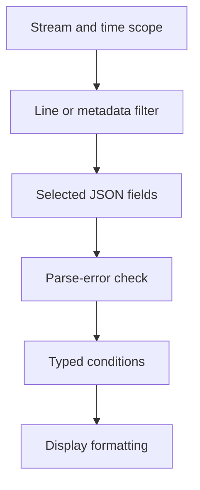

# Lab 29: LogQL Selectors, Filters, and Parsing

## Purpose and Scope

> **Primary Objective:** Reconstruct real CRUD activity with scoped LogQL queries, independently verify the returned population and distinguish query faults from application failures.

The index/metadata contract from Lab 28 now becomes an investigation workflow. You will create temporary Items, preserve a client ledger, narrow searches, parse dotted JSON keys and deliberately break a query stage without changing stored data.

No service, application feature or alert rule is added. The temporary workload owns and deletes only its own rows; the course checkpoint item remains untouched.

## 1. Inherited State and Starting Checks

```bash
source lab-notes/session.sh
source lab-notes/evidence.sh
source lab-notes/raw-metrics.sh
source lab-notes/metrics-session.sh
source lab-notes/logs-session.sh
logs_check
start_lab 29
```

Complete [Lab 28](Lab-28.md). Use the same Linux Docker host, Bash session and repository root. Keep credentials, named volumes and the checkpoint item. Required host tools remain Docker Compose, Python 3, curl, jq, Git and ripgrep. Stop at a failed check and resolve it before proceeding. Eleven services and eight scrape jobs remain active.

## 2. Objectives and Query Execution Order

You will select streams/time efficiently, choose exact versus regex filters, extract typed fields, format results without discarding source evidence, expose pipeline errors and prove a request population against independent client observations.



The selector uses the index; subsequent stages process selected entries. Filter before parsing when that preserves meaning. Pipeline errors describe query processing and are not automatically application exceptions. `line_format` changes query output, not the stored record.

## 3. Predict the Event Population

| Step per cycle | Response | Additional business event |
|---|---:|---|
| POST temporary item | 201 | item_created |
| GET item | 200 | none |
| GET again | 200 | none |
| PUT updated values | 200 | item_updated |
| GET updated item | 200 | none |
| DELETE temporary item | 204 | item_deleted |
| GET deleted item | 404 | none |
| POST invalid values | 422 | none |

Each request also emits `request_completed`. Predict the counts for three cycles: 24 completions and nine mutation records, totaling 33. The 404 and 422 responses are expected client-error behavior, not server failures.

Read-success logs do not identify the cache source. Use cache metrics if you need proof of hit/miss behavior; the absence of a database log is insufficient.

## 4. Install the Bounded Workload

```bash
cat > lab-notes/log_workload.py <<'PYTHON'
"""Bounded CRUD traffic and independent client ledger; standard library only."""
import argparse,json,time
from pathlib import Path
from urllib.error import HTTPError
from urllib.request import Request,urlopen
from uuid import uuid4
p=argparse.ArgumentParser()
p.add_argument("--url",required=True)
p.add_argument("--out",type=Path,required=True)
p.add_argument("--cycles",type=int,default=3)
args=p.parse_args()
if not 1<=args.cycles<=10:p.error("cycles must be between 1 and 10")
args.out.mkdir(parents=True,exist_ok=True)
ledger=(args.out/"client.jsonl").open("x")
prefix="loglab-"+uuid4().hex[:12]
(args.out/"prefix.txt").write_text(prefix+"\n")
(args.out/"start-ns.txt").write_text(str(time.time_ns())+"\n")
sequence=0
def call(method,path,payload,expected,business=None,cleanup=False):
    global sequence
    sequence+=1;rid=f"{prefix}-{sequence:03d}"
    headers={"X-Request-ID":rid};body=None
    if payload is not None:
        headers["Content-Type"]="application/json";body=json.dumps(payload).encode()
    start=time.time_ns()
    request=Request(args.url.rstrip("/")+path,data=body,headers=headers,method=method)
    try:response=urlopen(request,timeout=15)
    except HTTPError as error:response=error
    with response:
        status=response.status;raw=response.read();returned=response.headers.get("X-Request-ID")
    row={"request_id":rid,"method":method,"status":status,"expected":expected,
         "route":"/api/v1/items" if path=="/api/v1/items" else "/api/v1/items/{item_id}",
         "started_ns":start,"ended_ns":time.time_ns(),"business_event":business if status==expected else None,"cleanup":cleanup}
    ledger.write(json.dumps(row)+"\n");ledger.flush()
    assert status==expected,(method,path,status,expected)
    assert returned==rid,"Request ID was not preserved"
    time.sleep(.2)
    return json.loads(raw) if raw else None
try:
    for _ in range(args.cycles):
        item_id=None
        try:
            item=call("POST","/api/v1/items",{"name":"Log lab item","description":"temporary learning record","price":"12.50"},201,"item_created")
            item_id=item["id"];path=f"/api/v1/items/{item_id}"
            call("GET",path,None,200)
            call("GET",path,None,200)
            call("PUT",path,{"name":"Updated log lab item","description":"temporary learning record","price":"13.50"},200,"item_updated")
            call("GET",path,None,200)
            call("DELETE",path,None,204,"item_deleted");item_id=None
            call("GET",path,None,404)
            call("POST","/api/v1/items",{"name":"","price":"-1"},422)
        finally:
            if item_id is not None:call("DELETE",f"/api/v1/items/{item_id}",None,204,"item_deleted",cleanup=True)
finally:
    ledger.close();(args.out/"end-ns.txt").write_text(str(time.time_ns())+"\n")
print(json.dumps({"prefix":prefix,"requests":sequence,"expected_requests":args.cycles*8,"expected_business_events":args.cycles*3},indent=2))
PYTHON
```

The client creates a unique prefix, accepts only one to ten cycles, times out each request and asserts status plus response request ID. Its ledger stores no sensitive body. An exclusive file open prevents overwriting an earlier run's ledger.

The cleanup path deletes a known temporary row after a later failure. If connectivity prevents cleanup or a create response is lost after commit, inspect server evidence before removing anything; never delete unrelated rows to clean up a fixture.

## 5. Run and Capture the Workload

```bash
python3 lab-notes/log_workload.py --url "$APP_URL" --out "$LAB_DIR/workload" --cycles 3 \
  > "$LAB_DIR/workload-summary.json"
cat "$LAB_DIR/workload-summary.json"
PREFIX=$(cat "$LAB_DIR/workload/prefix.txt")
LAST_RID=$(tail -n 1 "$LAB_DIR/workload/client.jsonl" | jq -er '.request_id')
wait_log_request "$LAST_RID" > "$LAB_DIR/last-request-loki.json"
capture_app_logs
```

Expected: 24 requests and nine expected business events. The client ledger is independent of Loki and can expose missing/duplicated records. Waiting for the final ID does not prove that all prior records arrived; the full verification remains necessary.

Repeat experiments in a fresh `start_lab 29` evidence directory rather than mixing populations. Each run uses different IDs.

## 6. Generate Correctly Escaped LogQL

```bash
cat > lab-notes/build_log_queries.py <<'PYTHON'
import json,re,sys
if len(sys.argv)!=4 or not re.fullmatch(r"loglab-[a-f0-9]{12}",sys.argv[3]):
    raise SystemExit("Usage: build_log_queries.py SERVICE ENVIRONMENT PREFIX")
service,environment,prefix=sys.argv[1:]
s='{service_name='+json.dumps(service)+',deployment_environment_name='+json.dumps(environment)+'}'
base=s+' |= '+json.dumps(prefix)
parse=' | json status='+json.dumps('["http.status_code"]')+', route='+json.dumps('["http.route"]')+', method='+json.dumps('["http.method"]')
q={"all":base,"completions":base+' | event_name="request_completed"',
   "first_request":s+' | request_id='+json.dumps(prefix+'-001'),
   "client_errors":base+' | event_name="request_completed"'+parse+' | __error__="" | status>=400 | status<500',
   "mutations":base+' | event_name=~"item_created|item_updated|item_deleted"',
   "successful_gets":base+' | event_name="request_completed"'+parse+' | __error__="" | method="GET" | status=200 | route="/api/v1/items/{item_id}"',
   "formatted":base+' | event_name="request_completed"'+parse+' | __error__="" | line_format "{{.method}} {{.route}} -> {{.status}} request={{.request_id}}"',
   "filter_first":base+' | json body_event="event_name" | __error__="" | body_event="request_completed"',
   "parse_first":s+' | json body_event="event_name" | __error__="" | body_event="request_completed" |= '+json.dumps(prefix),
   "wrong_path":base+' | event_name="request_completed" | json wrong="http.status_code" | __error__="" | wrong=""',
   "parse_error":base+' | line_format "not-json" | json | __error__!=""',
   "error_filtered":base+' | line_format "not-json" | json | __error__=""'}
print(json.dumps(q,indent=2))
PYTHON
```

```bash
python3 lab-notes/build_log_queries.py "$LAB_SERVICE" "$LAB_ENVIRONMENT" "$PREFIX" \
  > "$LAB_DIR/queries.json"
jq -r '.all,.completions,.client_errors' "$LAB_DIR/queries.json"
logs_window 15
lrange "$(jq -r '.all' "$LAB_DIR/queries.json")" > "$LAB_DIR/all-events.json"
lrange "$(jq -r '.completions' "$LAB_DIR/queries.json")" > "$LAB_DIR/completions.json"
```

The generator uses `json.dumps` for selector values and field expressions, avoiding shell/backslash mistakes. These are ordinary LogQL queries ready for Grafana Explore.

The body key `http.status_code` contains a literal dot. Bracket extraction addresses that literal key; a path like `http.status_code` navigates a nested `http` object that does not exist here. Explicit aliases also avoid collisions with metadata fields. Consult the [LogQL pipeline reference](https://grafana.com/docs/loki/latest/query/log_queries/).

## 7. Follow One Request and Separate Event Types

```bash
lrange "$(jq -r '.first_request' "$LAB_DIR/queries.json")" > "$LAB_DIR/one-request.json"
lrange "$(jq -r '.mutations' "$LAB_DIR/queries.json")" > "$LAB_DIR/mutations.json"
jq -r '.data.result[].values[][1]' "$LAB_DIR/one-request.json" \
  | jq -c '{timestamp,event_name,event_id,request_id}'
```

The first POST should have an `item_created` and `request_completed` record sharing one request ID but different event IDs. They describe different boundaries of one request. Counting both as requests would double-count the create operation.

`|=` is literal line containment; `|~` is a line regex. Metadata equality compares a field, while its regex matcher matches the full value. These operations are not interchangeable. The mutation query uses a bounded three-event alternation inside a narrow service/environment and prefix scope.

## 8. Filter Typed Fields and Test a Wrong Path

```bash
lrange "$(jq -r '.client_errors' "$LAB_DIR/queries.json")" > "$LAB_DIR/client-errors.json"
lrange "$(jq -r '.successful_gets' "$LAB_DIR/queries.json")" > "$LAB_DIR/successful-gets.json"
jq '[.data.result[].values[]]|length' "$LAB_DIR/client-errors.json" "$LAB_DIR/successful-gets.json"
lrange "$(jq -r '.wrong_path' "$LAB_DIR/queries.json")" > "$LAB_DIR/wrong-path-evidence.json"
```

Expected: six client-error completions and nine successful item GETs. Count entries across all `values` arrays, not the number of result groups. Metadata can produce many query groups without adding index streams.

The wrong-path query should find an empty extracted field even though the body contains status. That is a query/schema mismatch. A successful parser stage alone does not prove that the requested field exists.

Parser errors are filtered before numeric comparisons. Numeric conversion can create later errors too; this envelope uses integer status, but arbitrary producers need validation after the conversion stage as well.

## 9. Format Readable Output While Keeping the Source

```bash
lrange "$(jq -r '.formatted' "$LAB_DIR/queries.json")" > "$LAB_DIR/formatted.json"
jq -r '.data.result[].values[][1]' "$LAB_DIR/formatted.json"
```

Example: `GET /api/v1/items/{item_id} -> 200 request=loglab-0123456789ab-002`. Your run will use its own full ID.

Keep `all-events.json` for verification: formatted lines no longer contain the complete envelope and must not be passed to the JSON verifier. Stored records remain unchanged. Equal timestamps and asynchronous shipping also mean displayed order alone is not proof of distributed causality.

## 10. Compare Query Order Without Inventing a Benchmark

```bash
lrange "$(jq -r '.filter_first' "$LAB_DIR/queries.json")" > "$LAB_DIR/filter-first.json"
lrange "$(jq -r '.parse_first' "$LAB_DIR/queries.json")" > "$LAB_DIR/parse-first.json"
python3 - "$LAB_DIR/filter-first.json" "$LAB_DIR/parse-first.json" <<'PYTHON'
import json,sys
def load(path):
    value=json.load(open(path))
    ids={json.loads(row[1])["event_id"] for stream in value["data"]["result"] for row in stream["values"]}
    return value,ids
a,ai=load(sys.argv[1]);b,bi=load(sys.argv[2])
assert ai==bi and ai,"Equivalent filters selected different populations"
print(json.dumps({"matching_events":len(ai),"filter_first_stats":a["data"].get("stats",{}),"parse_first_stats":b["data"].get("stats",{})},indent=2))
PYTHON
```

The same 24 IDs should be selected. Early filtering can reduce parsing work, though both queries may read the same chunks. Save query statistics but do not claim a performance improvement from two tiny runs: cache and scheduler effects can dominate. The defensible result is semantic equivalence and a better execution order.

## 11. Break a Query Stage and Prove Recovery

```bash
lrange "$(jq -r '.parse_error' "$LAB_DIR/queries.json")" > "$LAB_DIR/parser-errors.json"
lrange "$(jq -r '.error_filtered' "$LAB_DIR/queries.json")" > "$LAB_DIR/errors-filtered.json"
jq '[.data.result[].values[]]|length' "$LAB_DIR/parser-errors.json" "$LAB_DIR/errors-filtered.json"
lrange "$(jq -r '.all' "$LAB_DIR/queries.json")" > "$LAB_DIR/all-events.json"
```

The deliberately wrong pipeline rewrites query output to `not-json` and then parses it. Expect parser-error rows; filtering those errors out produces an empty result. No stored log was modified.

Recover by removing the bad stages. The final ordinary query should still return the original records. Do not restart services to fix a query-only error. Empty results can be caused by filters, parsing, scope or data loss; they do not automatically prove no event occurred.

## 12. Verify Every Event Against the Client Ledger

```bash
cat > lab-notes/verify_event_ledger.py <<'PYTHON'
import argparse,json
from collections import Counter
from pathlib import Path
p=argparse.ArgumentParser();p.add_argument("--ledger",type=Path,required=True);p.add_argument("--logs",type=Path,required=True);args=p.parse_args()
ledger=[json.loads(line) for line in args.ledger.read_text().splitlines()]
assert ledger and all(r["status"]==r["expected"] and not r["cleanup"] for r in ledger),"Failed workload or cleanup path"
clients={r["request_id"]:r for r in ledger};assert len(clients)==len(ledger)
response=json.loads(args.logs.read_text());assert response["status"]=="success" and response["data"]["resultType"]=="streams"
records=[json.loads(row[1]) for s in response["data"]["result"] for row in s["values"]]
assert len(records)<1000,"Query limit reached; narrow or paginate"
assert all(r["request_id"] in clients for r in records),"Unexpected request"
ids=[r["event_id"] for r in records];assert len(ids)==len(set(ids)),"Repeated event ID; investigate duplicate delivery"
expected=Counter((r["request_id"],"request_completed") for r in ledger)
expected.update((r["request_id"],r["business_event"]) for r in ledger if r["business_event"])
actual=Counter((r["request_id"],r["event_name"]) for r in records)
assert actual==expected,{"missing":list((expected-actual).items()),"unexpected":list((actual-expected).items())}
for r in records:
    assert r["schema_version"]==1
    if r["event_name"]=="request_completed":
        client=clients[r["request_id"]]
        assert (r["http.status_code"],r["http.method"],r["http.route"])==(client["status"],client["method"],client["route"])
        assert r["duration_ms"]>=0
print(json.dumps({"client_requests":len(ledger),"log_records":len(records),"unique_event_ids":len(set(ids)),"event_counts":dict(Counter(r["event_name"] for r in records)),"status_counts":dict(Counter(str(r["status"]) for r in ledger)),"population_matches":True},indent=2))
PYTHON
```

```bash
python3 lab-notes/verify_event_ledger.py \
  --ledger "$LAB_DIR/workload/client.jsonl" --logs "$LAB_DIR/all-events.json" \
  > "$LAB_DIR/population-proof.json"
cat "$LAB_DIR/population-proof.json"
```

Expected: `population_matches: true`, 24 requests, 33 records and 33 unique event IDs. There are 24 completions and three each of create/update/delete. Status totals are 12×200 and three each of 201, 204, 404 and 422.

If verification fails, inspect missing/unexpected pairs before generating more traffic. Requery the same window/prefix if ingestion is still arriving. Do not silently deduplicate repeated event IDs and claim delivery was correct. New event IDs under one request ID can be legitimate different event types.

## 13. Troubleshooting and Final Recovery

| Symptom | Investigate | Action |
|---|---|---|
| No records | Scope, UTC time, prefix | Start with the bounded stream; add filters one at a time |
| Missing extracted fields | Literal versus nested keys | Use bracket paths and distinct aliases |
| `_extracted` fields | Metadata/parser collision | Name body fields explicitly |
| Successful query with error rows | `__error__` | Correct the stage before excluding its errors |
| Too few records | Shipping delay and output limit | Requery narrowly; do not accept truncation |
| More records than requests | Multiple event boundaries | Select completions for request questions |
| Different timings, same results | Cache/query overhead | Avoid tiny-run benchmark claims |

```bash
logs_check
api -fsS "$APP_URL/health/ready" > "$LAB_DIR/final-readiness.json"
CHECKPOINT_ID=$(cat lab-notes/checkpoint-item-id.txt)
api -fsS "$APP_URL/api/v1/items/$CHECKPOINT_ID" > /dev/null
```

Successful cycles deleted temporary rows. The checkpoint item persists, original log bodies remain and query-only errors need no rollback of application code.

## 14. Knowledge Check

1. Why can one request have two event IDs?
2. Why keep IDs out of the selector?
3. Does line_format change storage?
4. Does an empty result prove no event?

### Answer Guide

1. Each log record describes its own boundary and has a unique identity.
2. They are entry metadata, not indexed stream dimensions.
3. No; it changes query output only.
4. No; rule out scope, timing, parser filters and transport gaps.

## 15. Professional Scenario Exercise

A teammate counts every line containing an item ID and reports too many requests. Replace that query with an explicit completion-event population and explain the roles of request ID, event ID and route.

## 16. Lab Notebook Template

Create a notebook in the evidence directory for this run:

```bash
test -e "$LAB_DIR/notebook.md" || printf '# Lab 29 Evidence\n' > "$LAB_DIR/notebook.md"
```

Use these headings and fill them with your predictions, commands, observed results and conclusions:

```markdown
# Lab 29 Evidence

## Starting state and operational question
## Prediction before the experiment
## Commands and UTC timestamps
## Observed results and source evidence
## Unexpected findings and troubleshooting
## Recovery proof and remaining limitations
```

## 17. Observable Completion Criteria

- [ ] Three CRUD cycles produce an independent client ledger.
- [ ] Queries use bounded service/environment, time and a unique prefix.
- [ ] Metadata and literal dotted-field parsing work.
- [ ] Error, mutation and successful-GET subsets match predictions.
- [ ] Equivalent queries return identical event IDs.
- [ ] Parser failure is recovered without altering stored data.
- [ ] The full 24-request/33-record population matches.

## 18. Production Implications

Keep source evidence before presentation transforms. Stable event schemas, bounded queries and explicit populations are necessary for useful operational logs. Ordinary logs do not automatically become a complete, durable audit ledger.

## 19. End State and Transition

Keep eleven services, eight jobs and the workload/query/verifier helpers. [Lab 30](Lab-30.md) derives rates and duration summaries from selected events and compares them with direct application metrics.
