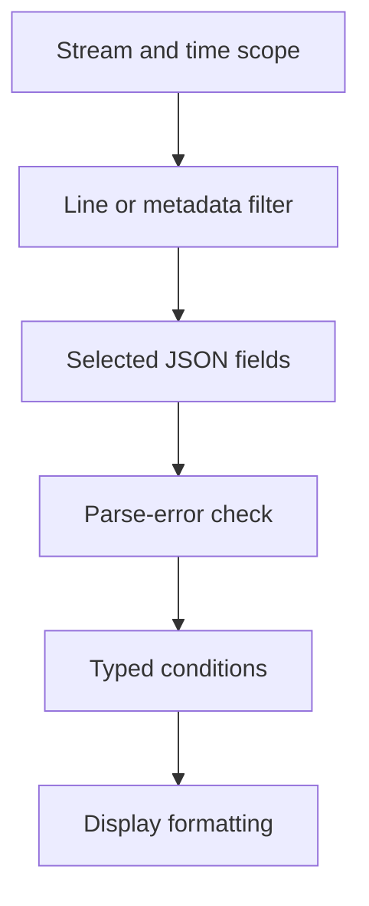

# Lab 29: LogQL Selectors, Filters, and Parsing

## 1. Purpose and Learning Outcomes

**In Plain Language:** You will reconstruct a known CRUD workload from retained logs. Begin with a narrow stream and time range, then filter and parse only the fields needed for the question. A client ledger checks every expected request and event, while deliberately broken query stages show how query errors can resemble missing application evidence.

> **Primary Objective:** Reconstruct real CRUD activity with scoped LogQL queries, independently verify the returned population and distinguish query faults from application failures.

The index/metadata contract from Lab 28 now becomes an investigation workflow. You will create temporary Items, preserve a client ledger, narrow searches, parse dotted JSON keys and deliberately break a query stage without changing stored data.

No service, application feature or alert rule is added. The temporary workload owns and deletes only its own rows; the course checkpoint item remains untouched.

## 2. Starting Point and Lab Map

Use this guide inside the complete application repository. Run commands from the repository root in Bash unless a step says otherwise. Work through the starting checks in order; they load the helpers and state this lab needs.

Read the explanation before each step, run one complete code block at a time, and compare the actual result with the stated expectation. Save commands, observations, explanations, and unexpected results in your notebook.

### Key Terms

| **Term**          | **Plain-Language Meaning**                                                             |
| ----------------- | -------------------------------------------------------------------------------------- |
| LogQL pipeline    | An ordered sequence that selects, filters, parses, and formats log results.            |
| Literal field key | A JSON key whose punctuation is part of its name, such as a dot in `http.status_code`. |
| Event population  | The exact records that should be included for the question being answered.             |

### Lab Map

The arrows show the flow or dependency being studied. Branches identify paths to compare; this is a conceptual map, not a captured runtime trace.


```mermaid
flowchart TD
    S["Stream and time scope"] --> F["Line or metadata filter"]
    F --> P["Selected JSON fields"]
    P --> E["Parse-error check"]
    E --> C["Typed conditions"]
    C --> O["Display formatting"]
```

## 3. Guided Walkthrough

### Step 01. Inherited State and Starting Checks

**What You Are Doing:** Verify fresh log delivery and preserve the current metadata mapping. Query exercises need a working source path before they can isolate selection mistakes.

**Practical Walkthrough:** Verify a fresh known record reaches Loki with the current metadata mapping before exploring query syntax. Keep the existing stream policy unchanged. This lets the following exercises isolate selection and parsing behavior instead of mixing them with an unresolved ingestion failure.

Find one fresh known record with the expected metadata before experimenting with syntax. Keep ingestion policy fixed. Otherwise a valid but empty query could be caused by undelivered data rather than the selector or parser behavior the exercise intends to isolate.

```bash
source lab-notes/session.sh
source lab-notes/evidence.sh
source lab-notes/raw-metrics.sh
source lab-notes/metrics-session.sh
source lab-notes/logs-session.sh
logs_check
start_lab 29
```

Complete [Lab 28](Lab-28.md). Use the same Linux Docker host, Bash session and repository root. Keep credentials, named volumes and the checkpoint item. Required host tools remain Docker Compose, Python 3, curl, jq, Git and ripgrep. Stop at a failed check and resolve it before proceeding. Eleven services and eight scrape jobs remain active.

**Understanding the Result:** An empty query is easier to diagnose when source delivery has independent proof. Retain that canary as a control.

### Step 02. Objectives and Query Execution Order

**What You Are Doing:** Read query stages in execution order. Stream and time selection narrow the data before later filters and field extraction act on it.

**Practical Walkthrough:** Read each query from left to right: stream and time selection establish the initial population, then filters and parsers narrow or reshape it. A later stage cannot recover records excluded earlier. State the intended population before adding formatting or numeric conditions.

Read the query from left to right and name the population after each stage. Early stream and time selection constrain everything that follows. Compare intermediate results before adding formatting or numeric filters so you can identify the exact stage that excluded an expected record.

You will select streams/time efficiently, choose exact versus regex filters, extract typed fields, format results without discarding source evidence, expose pipeline errors and prove a request population against independent client observations.

The lab map in Section 2 shows this relationship.

The selector uses the index; subsequent stages process selected entries. Filter before parsing when that preserves meaning. Pipeline errors describe query processing and are not automatically application exceptions. `line_format` changes query output, not the stored record.

**Understanding the Result:** Query-stage order affects both results and work performed. Begin with the smallest correct scope, not an arbitrary broad search.

### Step 03. Predict the Event Population

**What You Are Doing:** Predict request-completion and business-event counts for one cycle. Multiple records can belong to one request, so total lines are not automatically total requests.

**Practical Walkthrough:** Count completion events and business events separately for one CRUD cycle. A successful mutation can emit both, while reads and rejected operations have different event populations. Use these predictions to explain why total retained lines exceed completed requests without assuming duplication.

Predict completion records and committed-mutation records as separate sets for each CRUD action. Shared request context can connect two different events without making them duplicates. Use event IDs and event types to explain the expected line total rather than assuming one request always means one retained line.

| **Step per Cycle**    | **Response** | **Additional Business Event** |
| --------------------- | -----------: | ----------------------------- |
| POST temporary item   | 201          | item_created                  |
| GET item              | 200          | none                          |
| GET again             | 200          | none                          |
| PUT updated values    | 200          | item_updated                  |
| GET updated item      | 200          | none                          |
| DELETE temporary item | 204          | item_deleted                  |
| GET deleted item      | 404          | none                          |
| POST invalid values   | 422          | none                          |

Each request also emits `request_completed`. Predict the counts for three cycles: 24 completions and nine mutation records, totaling 33. The 404 and 422 responses are expected client-error behavior, not server failures.

Read-success logs do not identify the cache source. Use cache metrics if you need proof of hit/miss behavior; the absence of a database log is insufficient.

**Understanding the Result:** The three-cycle workload expects 24 requests and 33 records under the stated contract. Event type determines which total is appropriate.

### Step 04. Install the Bounded Workload

**What You Are Doing:** Install a bounded workload with unique identities, status checks, and cleanup. Its independent ledger becomes the reference for verifying retained records.

**Practical Walkthrough:** Install the finite workload helper and review its request IDs, response assertions, and cleanup. Its ledger provides expected identities independently of Loki. Preserve those identities throughout the query exercises so each expression can be judged against a known population.

Read the helper's finite cycle count, response assertions, and cleanup before installation. Its client ledger defines expected requests independently of the backend. Preserve the generated prefix and IDs so all later selectors refer to the same population rather than whatever recent traffic happens to be visible.

```bash
cat > lab-notes/log_workload.py <<'PYTHON'
"""Bounded CRUD traffic and independent client ledger; standard library only."""
import argparse,json,time
from pathlib import Path
from urllib.error import HTTPError
from urllib.request import Request,urlopen
from uuid import uuid4
p=argparse.ArgumentParser()
p.add_argument("--url",required=True)
p.add_argument("--out",type=Path,required=True)
p.add_argument("--cycles",type=int,default=3)
args=p.parse_args()
if not 1<=args.cycles<=10:p.error("cycles must be between 1 and 10")
args.out.mkdir(parents=True,exist_ok=True)
ledger=(args.out/"client.jsonl").open("x")
prefix="loglab-"+uuid4().hex[:12]
(args.out/"prefix.txt").write_text(prefix+"\n")
(args.out/"start-ns.txt").write_text(str(time.time_ns())+"\n")
sequence=0
def call(method,path,payload,expected,business=None,cleanup=False):
    global sequence
    sequence+=1;rid=f"{prefix}-{sequence:03d}"
    headers={"X-Request-ID":rid};body=None
    if payload is not None:
        headers["Content-Type"]="application/json";body=json.dumps(payload).encode()
    start=time.time_ns()
    request=Request(args.url.rstrip("/")+path,data=body,headers=headers,method=method)
    try:response=urlopen(request,timeout=15)
    except HTTPError as error:response=error
    with response:
        status=response.status;raw=response.read();returned=response.headers.get("X-Request-ID")
    row={"request_id":rid,"method":method,"status":status,"expected":expected,
         "route":"/api/v1/items" if path=="/api/v1/items" else "/api/v1/items/{item_id}",
         "started_ns":start,"ended_ns":time.time_ns(),"business_event":business if status==expected else None,"cleanup":cleanup}
    ledger.write(json.dumps(row)+"\n");ledger.flush()
    assert status==expected,(method,path,status,expected)
    assert returned==rid,"Request ID was not preserved"
    time.sleep(.2)
    return json.loads(raw) if raw else None
try:
    for _ in range(args.cycles):
        item_id=None
        try:
            item=call("POST","/api/v1/items",{"name":"Log lab item","description":"temporary learning record","price":"12.50"},201,"item_created")
            item_id=item["id"];path=f"/api/v1/items/{item_id}"
            call("GET",path,None,200)
            call("GET",path,None,200)
            call("PUT",path,{"name":"Updated log lab item","description":"temporary learning record","price":"13.50"},200,"item_updated")
            call("GET",path,None,200)
            call("DELETE",path,None,204,"item_deleted");item_id=None
            call("GET",path,None,404)
            call("POST","/api/v1/items",{"name":"","price":"-1"},422)
        finally:
            if item_id is not None:call("DELETE",f"/api/v1/items/{item_id}",None,204,"item_deleted",cleanup=True)
finally:
    ledger.close();(args.out/"end-ns.txt").write_text(str(time.time_ns())+"\n")
print(json.dumps({"prefix":prefix,"requests":sequence,"expected_requests":args.cycles*8,"expected_business_events":args.cycles*3},indent=2))
PYTHON
```

**Command Note:** `<<'PYTHON'` writes the following block literally until `PYTHON`. Quoting the delimiter prevents Bash from expanding `$variables` inside the generated file; creation and execution are separate steps.

The client creates a unique prefix, accepts only one to ten cycles, times out each request and asserts status plus response request ID. Its ledger stores no sensitive body. An exclusive file open prevents overwriting an earlier run's ledger.

The cleanup path deletes a known temporary row after a later failure. If connectivity prevents cleanup or a create response is lost after commit, inspect server evidence before removing anything; never delete unrelated rows to clean up a fixture.

**Understanding the Result:** A controlled workload makes query correctness testable. Cleanup should remove only its disposable items, not its evidence.

### Step 05. Run and Capture the Workload

**What You Are Doing:** Run the selected cycles once and preserve the ledger. If ingestion is delayed, requery that population instead of generating new work that changes the expected result.

**Practical Walkthrough:** Run the prescribed cycles once and save the resulting ledger. Allow ingestion time, then requery those same IDs if early results are incomplete. Repeating the workload creates a different population and makes it harder to distinguish delayed delivery from changed expectations.

Execute the workload once and inspect its actual ledger outcomes. Allow ingestion to settle, then repeat queries against those same IDs if needed. A second workload is a new experiment, so do not use it to conceal delayed or missing records from the first run.

```bash
python3 lab-notes/log_workload.py --url "$APP_URL" --out "$LAB_DIR/workload" --cycles 3 \
  > "$LAB_DIR/workload-summary.json"
cat "$LAB_DIR/workload-summary.json"
PREFIX=$(cat "$LAB_DIR/workload/prefix.txt")
LAST_RID=$(tail -n 1 "$LAB_DIR/workload/client.jsonl" | jq -er '.request_id')
wait_log_request "$LAST_RID" > "$LAB_DIR/last-request-loki.json"
capture_app_logs
```

**Expected Result:** 24 requests and nine expected business events. The client ledger is independent of Loki and can expose missing/duplicated records. Waiting for the final ID does not prove that all prior records arrived; the full verification remains necessary.

Repeat experiments in a fresh `start_lab 29` evidence directory rather than mixing populations. Each run uses different IDs.

**Understanding the Result:** Use the actual run's IDs and time bounds. Do not silently combine several attempts into one expected count.

### Step 06. Generate Correctly Escaped LogQL

**What You Are Doing:** Generate expressions with correct quoting and explicit field extraction. Literal dotted keys need different handling from nested object paths.

**Practical Walkthrough:** Use the expression generator to preserve quoting across shell strings, LogQL, and JSON extraction. A literal key containing a dot is different from a nested object path. Read the generated expression so the escaping has a clear purpose instead of manually removing characters that look redundant.

Inspect generated expressions after the helper writes them. Quoting must survive the shell, LogQL, and JSON-path layers, especially for dotted keys. Preserve the deliberate escaping unless you can explain its role; removing an apparently extra quote can change the selected field or invalidate the query.

```bash
cat > lab-notes/build_log_queries.py <<'PYTHON'
import json,re,sys
if len(sys.argv)!=4 or not re.fullmatch(r"loglab-[a-f0-9]{12}",sys.argv[3]):
    raise SystemExit("Usage: build_log_queries.py SERVICE ENVIRONMENT PREFIX")
service,environment,prefix=sys.argv[1:]
s='{service_name='+json.dumps(service)+',deployment_environment_name='+json.dumps(environment)+'}'
base=s+' |= '+json.dumps(prefix)
parse=' | json status='+json.dumps('["http.status_code"]')+', route='+json.dumps('["http.route"]')+', method='+json.dumps('["http.method"]')
q={"all":base,"completions":base+' | event_name="request_completed"',
   "first_request":s+' | request_id='+json.dumps(prefix+'-001'),
   "client_errors":base+' | event_name="request_completed"'+parse+' | __error__="" | status>=400 | status<500',
   "mutations":base+' | event_name=~"item_created|item_updated|item_deleted"',
   "successful_gets":base+' | event_name="request_completed"'+parse+' | __error__="" | method="GET" | status=200 | route="/api/v1/items/{item_id}"',
   "formatted":base+' | event_name="request_completed"'+parse+' | __error__="" | line_format "{{.method}} {{.route}} -> {{.status}} request={{.request_id}}"',
   "filter_first":base+' | json body_event="event_name" | __error__="" | body_event="request_completed"',
   "parse_first":s+' | json body_event="event_name" | __error__="" | body_event="request_completed" |= '+json.dumps(prefix),
   "wrong_path":base+' | event_name="request_completed" | json wrong="http.status_code" | __error__="" | wrong=""',
   "parse_error":base+' | line_format "not-json" | json | __error__!=""',
   "error_filtered":base+' | line_format "not-json" | json | __error__=""'}
print(json.dumps(q,indent=2))
PYTHON
```

```bash
python3 lab-notes/build_log_queries.py "$LAB_SERVICE" "$LAB_ENVIRONMENT" "$PREFIX" \
  > "$LAB_DIR/queries.json"
jq -r '.all,.completions,.client_errors' "$LAB_DIR/queries.json"
logs_window 15
lrange "$(jq -r '.all' "$LAB_DIR/queries.json")" > "$LAB_DIR/all-events.json"
lrange "$(jq -r '.completions' "$LAB_DIR/queries.json")" > "$LAB_DIR/completions.json"
```

The generator uses `json.dumps` for selector values and field expressions, avoiding shell/backslash mistakes. These are ordinary LogQL queries ready for Grafana Explore.

The body key `http.status_code` contains a literal dot. Bracket extraction addresses that literal key; a path like `http.status_code` navigates a nested `http` object that does not exist here. Explicit aliases also avoid collisions with metadata fields. Consult the [LogQL pipeline reference](https://grafana.com/docs/loki/latest/query/log_queries/).

**Understanding the Result:** Correct escaping selects the intended field. A syntactically valid expression can still address the wrong path.

### Step 07. Follow One Request and Separate Event Types

**What You Are Doing:** Follow one request and distinguish its business event from its completion event. Shared request identity connects them while separate event IDs keep their meanings distinct.

**Practical Walkthrough:** Choose one request ID from the ledger and inspect all related event types. Compare their distinct event IDs and shared request context. The business record describes a committed action, while completion describes the HTTP outcome; neither should be counted interchangeably without naming the population.

Choose an ID from the ledger, retrieve its related events, and compare shared request context with distinct event identities. Count completion and mutation records according to their own meanings. A committed business record and an HTTP completion are complementary observations, not interchangeable units for every query.

```bash
lrange "$(jq -r '.first_request' "$LAB_DIR/queries.json")" > "$LAB_DIR/one-request.json"
lrange "$(jq -r '.mutations' "$LAB_DIR/queries.json")" > "$LAB_DIR/mutations.json"
jq -r '.data.result[].values[][1]' "$LAB_DIR/one-request.json" \
  | jq -c '{timestamp,event_name,event_id,request_id}'
```

The first POST should have an `item_created` and `request_completed` record sharing one request ID but different event IDs. They describe different boundaries of one request. Counting both as requests would double-count the create operation.

`|=` is literal line containment; `|~` is a line regex. Metadata equality compares a field, while its regex matcher matches the full value. These operations are not interchangeable. The mutation query uses a bounded three-event alternation inside a narrow service/environment and prefix scope.

**Understanding the Result:** Correlation connects records without making them duplicates. Separate event identity from request identity when reconciling counts.

### Step 08. Filter Typed Fields and Test a Wrong Path

**What You Are Doing:** Apply typed conditions and compare a correct field path with an intentionally wrong one. Count returned entries rather than mistaking query groups for individual events.

**Practical Walkthrough:** Apply numeric or typed filters to explicitly extracted fields, then compare with the deliberately wrong path. Count individual returned entries rather than the number of response groups. A query may group many entries under one stream while still representing numerous events.

Inspect the extracted field's type and exact path before applying numeric comparisons. Compare the deliberately wrong-path result with the known population. Count entries inside returned streams rather than stream objects, because one stream can contain many matching records.

```bash
lrange "$(jq -r '.client_errors' "$LAB_DIR/queries.json")" > "$LAB_DIR/client-errors.json"
lrange "$(jq -r '.successful_gets' "$LAB_DIR/queries.json")" > "$LAB_DIR/successful-gets.json"
jq '[.data.result[].values[]]|length' "$LAB_DIR/client-errors.json" "$LAB_DIR/successful-gets.json"
lrange "$(jq -r '.wrong_path' "$LAB_DIR/queries.json")" > "$LAB_DIR/wrong-path-evidence.json"
```

**Expected Result:** six client-error completions and nine successful item GETs. Count entries across all `values` arrays, not the number of result groups. Metadata can produce many query groups without adding index streams.

The wrong-path query should find an empty extracted field even though the body contains status. That is a query/schema mismatch. A successful parser stage alone does not prove that the requested field exists.

Parser errors are filtered before numeric comparisons. Numeric conversion can create later errors too; this envelope uses integer status, but arbitrary producers need validation after the conversion stage as well.

**Understanding the Result:** Empty output from a wrong path is a query result, not proof that the recorded duration or status was zero.

### Step 09. Format Readable Output While Keeping the Source

**What You Are Doing:** Format readable lines for investigation while retaining the full source response. Display formatting changes the query result's presentation, not the stored record.

**Practical Walkthrough:** Apply line formatting to make selected fields easier to read while retaining the original query response as evidence. Formatting affects how results are displayed; it does not modify Loki's stored body. Return to raw fields whenever abbreviated output hides information needed for verification.

Keep the original structured query result before applying display formatting. The formatted line is a readable projection and may omit fields required for verification. Return to raw bodies and metadata for identity checks; formatting a result does not rewrite the record stored in Loki.

```bash
lrange "$(jq -r '.formatted' "$LAB_DIR/queries.json")" > "$LAB_DIR/formatted.json"
jq -r '.data.result[].values[][1]' "$LAB_DIR/formatted.json"
```

Example: `GET /api/v1/items/{item_id} -> 200 request=loglab-0123456789ab-002`. Your run will use its own full ID.

Keep `all-events.json` for verification: formatted lines no longer contain the complete envelope and must not be passed to the JSON verifier. Stored records remain unchanged. Equal timestamps and asynchronous shipping also mean displayed order alone is not proof of distributed causality.

**Understanding the Result:** Readable presentation and complete evidence serve different purposes. Preserve both without treating formatted text as the original record.

### Step 10. Compare Query Order without Inventing a Benchmark

**What You Are Doing:** Compare query stage orders using the same expected IDs. Record statistics without claiming a benchmark from a tiny run affected by caches and scheduling.

**Practical Walkthrough:** Compare alternative stage orders against the same expected IDs and time interval. Inspect statistics to understand work performed, but avoid calling a tiny run a performance benchmark. Caches, scheduling, and prior queries can affect elapsed time without changing correctness.

Use identical IDs, range, and expected results for both stage orders. Compare correctness first and query statistics second. A small elapsed-time difference can reflect caches or scheduling, so describe observed query work without presenting one tiny run as a general performance benchmark.

```bash
lrange "$(jq -r '.filter_first' "$LAB_DIR/queries.json")" > "$LAB_DIR/filter-first.json"
lrange "$(jq -r '.parse_first' "$LAB_DIR/queries.json")" > "$LAB_DIR/parse-first.json"
python3 - "$LAB_DIR/filter-first.json" "$LAB_DIR/parse-first.json" <<'PYTHON'
import json,sys
def load(path):
    value=json.load(open(path))
    ids={json.loads(row[1])["event_id"] for stream in value["data"]["result"] for row in stream["values"]}
    return value,ids
a,ai=load(sys.argv[1]);b,bi=load(sys.argv[2])
assert ai==bi and ai,"Equivalent filters selected different populations"
print(json.dumps({"matching_events":len(ai),"filter_first_stats":a["data"].get("stats",{}),"parse_first_stats":b["data"].get("stats",{})},indent=2))
PYTHON
```

The same 24 IDs should be selected. Early filtering can reduce parsing work, though both queries may read the same chunks. Save query statistics but do not claim a performance improvement from two tiny runs: cache and scheduler effects can dominate. The defensible result is semantic equivalence and a better execution order.

**Understanding the Result:** First verify equivalent populations. Performance observations are only interpretable after the expressions are shown to answer the same question.

### Step 11. Break a Query Stage and Prove Recovery

**What You Are Doing:** Introduce a parser error inside the query pipeline and observe its error evidence. Remove the bad stages to prove recovery without modifying stored logs.

**Practical Walkthrough:** Add the intentional parser mistake in the query and inspect the resulting error labels or response evidence. Remove the bad stage and rerun against the same stored records. This isolates a query-time defect without editing or regenerating source logs.

Inspect where the intentional parser stage introduces error evidence, then remove that stage and query the same stored events. No new workload is required to recover from a query-only defect. This separates bad interpretation from damaged or missing source records.

```bash
lrange "$(jq -r '.parse_error' "$LAB_DIR/queries.json")" > "$LAB_DIR/parser-errors.json"
lrange "$(jq -r '.error_filtered' "$LAB_DIR/queries.json")" > "$LAB_DIR/errors-filtered.json"
jq '[.data.result[].values[]]|length' "$LAB_DIR/parser-errors.json" "$LAB_DIR/errors-filtered.json"
lrange "$(jq -r '.all' "$LAB_DIR/queries.json")" > "$LAB_DIR/all-events.json"
```

The deliberately wrong pipeline rewrites query output to `not-json` and then parses it. Expect parser-error rows; filtering those errors out produces an empty result. No stored log was modified.

Recover by removing the bad stages. The final ordinary query should still return the original records. Do not restart services to fix a query-only error. Empty results can be caused by filters, parsing, scope or data loss; they do not automatically prove no event occurred.

**Understanding the Result:** Parser failure does not imply corrupt stored events. Recovery of the corrected query demonstrates where the failure occurred.

### Step 12. Verify Every Event Against the Client Ledger

**What You Are Doing:** Reconcile every request and event ID with the client ledger. This checks the entire expected population rather than relying on one successful search result.

**Practical Walkthrough:** Compare the complete set of expected request and event identities with returned records, including duplicates or missing entries. Use the ledger's event-type expectations rather than only the total number of lines. Preserve discrepancies and query settings so another reader can reproduce the check.

Compare complete expected and observed identity sets, including duplicate event IDs and missing events. Reconcile event types with the client ledger instead of accepting a matching grand total. Different missing and duplicate records can cancel numerically while still leaving the retained evidence incorrect.

```bash
cat > lab-notes/verify_event_ledger.py <<'PYTHON'
import argparse,json
from collections import Counter
from pathlib import Path
p=argparse.ArgumentParser();p.add_argument("--ledger",type=Path,required=True);p.add_argument("--logs",type=Path,required=True);args=p.parse_args()
ledger=[json.loads(line) for line in args.ledger.read_text().splitlines()]
assert ledger and all(r["status"]==r["expected"] and not r["cleanup"] for r in ledger),"Failed workload or cleanup path"
clients={r["request_id"]:r for r in ledger};assert len(clients)==len(ledger)
response=json.loads(args.logs.read_text());assert response["status"]=="success" and response["data"]["resultType"]=="streams"
records=[json.loads(row[1]) for s in response["data"]["result"] for row in s["values"]]
assert len(records)<1000,"Query limit reached; narrow or paginate"
assert all(r["request_id"] in clients for r in records),"Unexpected request"
ids=[r["event_id"] for r in records];assert len(ids)==len(set(ids)),"Repeated event ID; investigate duplicate delivery"
expected=Counter((r["request_id"],"request_completed") for r in ledger)
expected.update((r["request_id"],r["business_event"]) for r in ledger if r["business_event"])
actual=Counter((r["request_id"],r["event_name"]) for r in records)
assert actual==expected,{"missing":list((expected-actual).items()),"unexpected":list((actual-expected).items())}
for r in records:
    assert r["schema_version"]==1
    if r["event_name"]=="request_completed":
        client=clients[r["request_id"]]
        assert (r["http.status_code"],r["http.method"],r["http.route"])==(client["status"],client["method"],client["route"])
        assert r["duration_ms"]>=0
print(json.dumps({"client_requests":len(ledger),"log_records":len(records),"unique_event_ids":len(set(ids)),"event_counts":dict(Counter(r["event_name"] for r in records)),"status_counts":dict(Counter(str(r["status"]) for r in ledger)),"population_matches":True},indent=2))
PYTHON
```

```bash
python3 lab-notes/verify_event_ledger.py \
  --ledger "$LAB_DIR/workload/client.jsonl" --logs "$LAB_DIR/all-events.json" \
  > "$LAB_DIR/population-proof.json"
cat "$LAB_DIR/population-proof.json"
```

**Expected Result:** `population_matches: true`, 24 requests, 33 records and 33 unique event IDs. There are 24 completions and three each of create/update/delete. Status totals are 12×200 and three each of 201, 204, 404 and 422.

If verification fails, inspect missing/unexpected pairs before generating more traffic. Requery the same window/prefix if ingestion is still arriving. Do not silently deduplicate repeated event IDs and claim delivery was correct. New event IDs under one request ID can be legitimate different event types.

**Understanding the Result:** One successful lookup proves one record is searchable. Full reconciliation supports a stronger claim about this bounded workload.

## 4. Troubleshooting and Diagnosis

Start with the first unexpected result. Record the exact symptom, identify which component produced it, and use the checks below before repeating the experiment. After a fix, repeat the original check and confirm recovery.

### Troubleshooting and Final Recovery

| **Symptom**                      | **Investigate**                 | **Action**                                               |
| -------------------------------- | ------------------------------- | -------------------------------------------------------- |
| No records                       | Scope, UTC time, prefix         | Start with the bounded stream; add filters one at a time |
| Missing extracted fields         | Literal versus nested keys      | Use bracket paths and distinct aliases                   |
| `_extracted` fields              | Metadata/parser collision       | Name body fields explicitly                              |
| Successful query with error rows | `__error__`                     | Correct the stage before excluding its errors            |
| Too few records                  | Shipping delay and output limit | Requery narrowly; do not accept truncation               |
| More records than requests       | Multiple event boundaries       | Select completions for request questions                 |
| Different timings, same results  | Cache/query overhead            | Avoid tiny-run benchmark claims                          |

```bash
logs_check
api -fsS "$APP_URL/health/ready" > "$LAB_DIR/final-readiness.json"
CHECKPOINT_ID=$(cat lab-notes/checkpoint-item-id.txt)
api -fsS "$APP_URL/api/v1/items/$CHECKPOINT_ID" > /dev/null
```

Successful cycles deleted temporary rows. The checkpoint item persists, original log bodies remain and query-only errors need no rollback of application code.

## 5. Review and Practice

Answer the knowledge questions in your own words before reading the answer guide. For the scenario, name the evidence you would collect and the conclusion each observation would support.

### Knowledge Check

1. Why can one request have two event IDs?
2. Why keep IDs out of the selector?
3. Does line_format change storage?
4. Does an empty result prove no event?

#### Answer Guide

1. Each log record describes its own boundary and has a unique identity.
2. They are entry metadata, not indexed stream dimensions.
3. No; it changes query output only.
4. No; rule out scope, timing, parser filters and transport gaps.

### Professional Scenario Exercise

A teammate counts every line containing an item ID and reports too many requests. Replace that query with an explicit completion-event population and explain the roles of request ID, event ID and route.

## 6. Completion Checklist

Mark each item only after you can point to its result or evidence file. Complete any cleanup shown here before moving on.

### Observable Completion Criteria

- [ ] Three CRUD cycles produce an independent client ledger.
- [ ] Queries use bounded service/environment, time and a unique prefix.
- [ ] Metadata and literal dotted-field parsing work.
- [ ] Error, mutation and successful-GET subsets match predictions.
- [ ] Equivalent queries return identical event IDs.
- [ ] Parser failure is recovered without altering stored data.
- [ ] The full 24-request/33-record population matches.

## 7. Production Context and Next Lab

### Production Implications

Keep source evidence before presentation transforms. Stable event schemas, bounded queries and explicit populations are necessary for useful operational logs. Ordinary logs do not automatically become a complete, durable audit ledger.

### End State and Transition

Keep eleven services, eight jobs and the workload/query/verifier helpers. [Lab 30](Lab-30.md) derives rates and duration summaries from selected events and compares them with direct application metrics.
