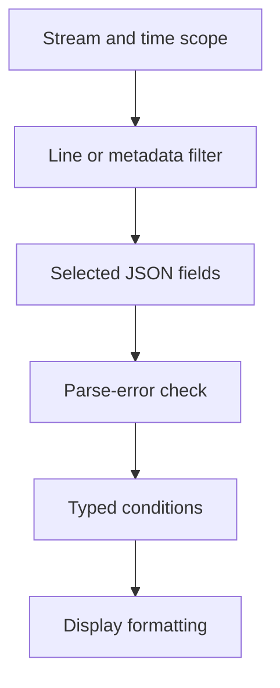

# Lab 29: LogQL Selectors, Filters, and Parsing

## 1. Purpose and Learning Outcomes

**In Plain Language:** You will reconstruct a known create, read, update, and delete workload from stored logs. Start with a narrow stream selection and time interval, then filter and parse only the fields needed. Compare every expected request and event with a separate client ledger. Deliberately broken query stages will show how a query mistake can look like missing application evidence.

> **Primary Objective:** Reconstruct real CRUD activity with clearly scoped LogQL queries, verify the complete expected event set independently, and distinguish query problems from app failures.

You will use Lab 28's index and metadata design for investigation. Create temporary Items, keep a client ledger, narrow searches, extract dotted JSON keys, and intentionally break one query stage without changing stored records.

This lab adds no service, app feature, or alert rule. The workload creates and deletes only its own temporary rows. Keep the course checkpoint item unchanged.

## 2. Starting Point and Lab Map

Open the complete application repository before using this guide. Unless a step says otherwise, run commands in Bash from the repository's top-level folder. Follow the starting checks in order because later commands depend on the helper functions and running services they prepare.

Read each explanation before running its commands. Run one complete code block, check the result, and then continue. In your notebook, save the commands, what happened, why you think it happened, and anything that differed from the expected result.

### Key Terms

| **Term**          | **Explanation**                                                                              |
| ----------------- | -------------------------------------------------------------------------------------------- |
| LogQL pipeline    | Query stages that select streams, filter entries, parse fields, and format results in order. |
| Literal field key | A JSON key whose punctuation belongs to its name, such as the dot in `http.status_code`.     |
| Event population  | The exact set of records that should count toward the question you are answering.            |

### Lab Map

The arrows show how the parts connect and where a request can take different paths. Use this map to understand the design. It is not a recording of a request that actually ran.


```mermaid
flowchart TD
    S["Stream and time scope"] --> F["Line or metadata filter"]
    F --> P["Selected JSON fields"]
    P --> E["Parse-error check"]
    E --> C["Typed conditions"]
    C --> O["Display formatting"]
```

## 3. Guided Walkthrough

### Step 01. Inherited State and Starting Checks

**What You Are Doing:** Verify fresh log delivery with the current metadata mapping. A working source lets you study query selection without mixing in collection problems.

**Practical Walkthrough:** Find a fresh known event in Loki before experimenting with syntax. Keep the stream policy unchanged so later differences come from query selection and parsing rather than an unresolved ingestion failure.

Confirm the expected metadata on one new record. Without independent delivery evidence, a valid empty query could mean either missing data or a query mistake. Keep this known event as a control.

```bash
source lab-notes/session.sh
source lab-notes/evidence.sh
source lab-notes/raw-metrics.sh
source lab-notes/metrics-session.sh
source lab-notes/logs-session.sh
logs_check
start_lab 29
```

Complete [Lab 28](Lab-28.md). Use the same Linux Docker host, Bash session, and repository root. Keep credentials, named volumes, and the checkpoint item. Required tools remain Docker Compose, Python 3, curl, jq, Git, and ripgrep. Resolve failed checks before continuing. Eleven services and eight jobs remain active.

**Understanding the Result:** An empty result is easier to explain when you already know the source record arrived. Retain the canary as that reference.

### Step 02. Objectives and Query Execution Order

**What You Are Doing:** Read a query in stage order. Stream and time selection define the initial records, and later filters and parsers act only on those records.

**Practical Walkthrough:** Follow the expression from left to right and describe the remaining record set at each step. A later stage cannot recover an entry removed earlier. Define the intended events before adding formatting or numeric conditions.

Compare intermediate results as you add stages. Start with stream and time limits, then identify exactly which filter or parser removes an expected record. This makes both query meaning and work easier to understand.

You will choose limited streams and time ranges, compare exact and regex filters, extract typed fields, format readable output while keeping originals, expose query errors, and verify events against the client ledger.

The lab map in Section 2 shows this relationship.

The selector uses Loki's index; later stages process the selected entries. Filter before parsing when that keeps the intended meaning. Pipeline errors concern query processing and are not automatically app exceptions. `line_format` changes returned text, not the stored body.

**Understanding the Result:** Stage order changes both results and processing work. Start with the smallest selection that still includes the intended evidence.

### Step 03. Predict the Event Population

**What You Are Doing:** Predict completion records and business-event records separately for one cycle. A request can emit several records, so total lines do not automatically equal requests.

**Practical Walkthrough:** Count each event type for the planned CRUD actions. A committed mutation can produce a business event and an HTTP completion. Reads and rejected requests have different expected records. This explains extra lines without immediately assuming duplicates.

Build separate expectations for completions and committed changes. Two events may share a request ID but have different event IDs and meanings. Use those identities and types to explain the total.

| **Step per Cycle**    | **Response** | **Additional Business Event** |
| --------------------- | -----------: | ----------------------------- |
| POST temporary item   | 201          | item_created                  |
| GET item              | 200          | none                          |
| GET again             | 200          | none                          |
| PUT updated values    | 200          | item_updated                  |
| GET updated item      | 200          | none                          |
| DELETE temporary item | 204          | item_deleted                  |
| GET deleted item      | 404          | none                          |
| POST invalid values   | 422          | none                          |

Every request also emits `request_completed`. Three cycles should produce 24 completions and nine mutation records, for 33 records overall. The 404 and 422 responses are expected client-error outcomes, not server failures.

A successful-read log does not identify whether cache supplied the result. Use cache metrics to establish hits and misses; the absence of a database log is not enough.

**Understanding the Result:** This three-cycle workload expects 24 requests and 33 records. Choose the total that matches the event type your question concerns.

### Step 04. Install the Bounded Workload

**What You Are Doing:** Install a limited workload with unique IDs, response checks, and cleanup. Its client ledger will be the independent reference for retained logs.

**Practical Walkthrough:** Review the helper's IDs, status assertions, and cleanup before using it. Keep its complete expected identities throughout the exercise so each query can be checked against the same known set.

Confirm the allowed cycle count and how failed requests are handled. Preserve the generated prefix and IDs. Later queries should select this run, not whichever recent traffic happens to be visible.

```bash
cat > lab-notes/log_workload.py <<'PYTHON'
"""Bounded CRUD traffic and independent client ledger; standard library only."""
import argparse,json,time
from pathlib import Path
from urllib.error import HTTPError
from urllib.request import Request,urlopen
from uuid import uuid4
p=argparse.ArgumentParser()
p.add_argument("--url",required=True)
p.add_argument("--out",type=Path,required=True)
p.add_argument("--cycles",type=int,default=3)
args=p.parse_args()
if not 1<=args.cycles<=10:p.error("cycles must be between 1 and 10")
args.out.mkdir(parents=True,exist_ok=True)
ledger=(args.out/"client.jsonl").open("x")
prefix="loglab-"+uuid4().hex[:12]
(args.out/"prefix.txt").write_text(prefix+"\n")
(args.out/"start-ns.txt").write_text(str(time.time_ns())+"\n")
sequence=0
def call(method,path,payload,expected,business=None,cleanup=False):
    global sequence
    sequence+=1;rid=f"{prefix}-{sequence:03d}"
    headers={"X-Request-ID":rid};body=None
    if payload is not None:
        headers["Content-Type"]="application/json";body=json.dumps(payload).encode()
    start=time.time_ns()
    request=Request(args.url.rstrip("/")+path,data=body,headers=headers,method=method)
    try:response=urlopen(request,timeout=15)
    except HTTPError as error:response=error
    with response:
        status=response.status;raw=response.read();returned=response.headers.get("X-Request-ID")
    row={"request_id":rid,"method":method,"status":status,"expected":expected,
         "route":"/api/v1/items" if path=="/api/v1/items" else "/api/v1/items/{item_id}",
         "started_ns":start,"ended_ns":time.time_ns(),"business_event":business if status==expected else None,"cleanup":cleanup}
    ledger.write(json.dumps(row)+"\n");ledger.flush()
    assert status==expected,(method,path,status,expected)
    assert returned==rid,"Request ID was not preserved"
    time.sleep(.2)
    return json.loads(raw) if raw else None
try:
    for _ in range(args.cycles):
        item_id=None
        try:
            item=call("POST","/api/v1/items",{"name":"Log lab item","description":"temporary learning record","price":"12.50"},201,"item_created")
            item_id=item["id"];path=f"/api/v1/items/{item_id}"
            call("GET",path,None,200)
            call("GET",path,None,200)
            call("PUT",path,{"name":"Updated log lab item","description":"temporary learning record","price":"13.50"},200,"item_updated")
            call("GET",path,None,200)
            call("DELETE",path,None,204,"item_deleted");item_id=None
            call("GET",path,None,404)
            call("POST","/api/v1/items",{"name":"","price":"-1"},422)
        finally:
            if item_id is not None:call("DELETE",f"/api/v1/items/{item_id}",None,204,"item_deleted",cleanup=True)
finally:
    ledger.close();(args.out/"end-ns.txt").write_text(str(time.time_ns())+"\n")
print(json.dumps({"prefix":prefix,"requests":sequence,"expected_requests":args.cycles*8,"expected_business_events":args.cycles*3},indent=2))
PYTHON
```

**Command Note:** `<<'PYTHON'` writes the following text literally until the closing `PYTHON`. The quoted delimiter prevents Bash from expanding `$variables` in the file. Creation and execution are separate actions.

The client creates a unique prefix, permits only one to ten cycles, applies a timeout to every request, and checks both status and returned request ID. The ledger stores no sensitive body. Exclusive file creation prevents overwriting a previous run's evidence.

Cleanup deletes a known temporary row if a later step fails. If a connection failure prevents cleanup, or a create response is lost after commit, inspect server evidence before removing data. Never delete unrelated rows to tidy the fixture.

**Understanding the Result:** A controlled workload makes query results verifiable. Cleanup should remove its temporary items while preserving its evidence.

### Step 05. Run and Capture the Workload

**What You Are Doing:** Run the cycles once and keep the ledger. If records arrive late, requery the same run instead of creating a new expected set.

**Practical Walkthrough:** Save the prescribed run's actual outcomes and allow time for ingestion. Repeat queries using those same IDs if early output is incomplete. Sending the workload again creates a different experiment and does not prove the first run was delivered.

Inspect the ledger after execution. Wait briefly and requery the original population as needed. Do not use a new run to conceal delayed or missing evidence from this one.

```bash
python3 lab-notes/log_workload.py --url "$APP_URL" --out "$LAB_DIR/workload" --cycles 3 \
  > "$LAB_DIR/workload-summary.json"
cat "$LAB_DIR/workload-summary.json"
PREFIX=$(cat "$LAB_DIR/workload/prefix.txt")
LAST_RID=$(tail -n 1 "$LAB_DIR/workload/client.jsonl" | jq -er '.request_id')
wait_log_request "$LAST_RID" > "$LAB_DIR/last-request-loki.json"
capture_app_logs
```

**Expected Result:** The workload has 24 requests and nine expected business events. Its independent ledger can reveal missing or duplicate logs. Seeing the final ID arrive is only a progress check; you still need to verify the full set.

For a new experiment, use a fresh `start_lab 29` evidence directory. Each run has different IDs, so do not mix them into one expected population.

**Understanding the Result:** Use this run's actual IDs and time range. Combining several attempts would change the expected counts.

### Step 06. Generate Correctly Escaped LogQL

**What You Are Doing:** Generate correctly quoted LogQL with explicit field paths. A key containing a literal dot is different from a nested object path.

**Practical Walkthrough:** Use the generator to preserve quoting through the shell, LogQL, and JSON extraction layers. Read the final expression and understand why each escape is present before changing it.

Inspect the generated expressions, especially dotted-key paths. An apparently extra quote or backslash may be needed by another parsing layer. Removing it can change the selected field or break the query.

```bash
cat > lab-notes/build_log_queries.py <<'PYTHON'
import json,re,sys
if len(sys.argv)!=4 or not re.fullmatch(r"loglab-[a-f0-9]{12}",sys.argv[3]):
    raise SystemExit("Usage: build_log_queries.py SERVICE ENVIRONMENT PREFIX")
service,environment,prefix=sys.argv[1:]
s='{service_name='+json.dumps(service)+',deployment_environment_name='+json.dumps(environment)+'}'
base=s+' |= '+json.dumps(prefix)
parse=' | json status='+json.dumps('["http.status_code"]')+', route='+json.dumps('["http.route"]')+', method='+json.dumps('["http.method"]')
q={"all":base,"completions":base+' | event_name="request_completed"',
   "first_request":s+' | request_id='+json.dumps(prefix+'-001'),
   "client_errors":base+' | event_name="request_completed"'+parse+' | __error__="" | status>=400 | status<500',
   "mutations":base+' | event_name=~"item_created|item_updated|item_deleted"',
   "successful_gets":base+' | event_name="request_completed"'+parse+' | __error__="" | method="GET" | status=200 | route="/api/v1/items/{item_id}"',
   "formatted":base+' | event_name="request_completed"'+parse+' | __error__="" | line_format "{{.method}} {{.route}} -> {{.status}} request={{.request_id}}"',
   "filter_first":base+' | json body_event="event_name" | __error__="" | body_event="request_completed"',
   "parse_first":s+' | json body_event="event_name" | __error__="" | body_event="request_completed" |= '+json.dumps(prefix),
   "wrong_path":base+' | event_name="request_completed" | json wrong="http.status_code" | __error__="" | wrong=""',
   "parse_error":base+' | line_format "not-json" | json | __error__!=""',
   "error_filtered":base+' | line_format "not-json" | json | __error__=""'}
print(json.dumps(q,indent=2))
PYTHON
```

```bash
python3 lab-notes/build_log_queries.py "$LAB_SERVICE" "$LAB_ENVIRONMENT" "$PREFIX" \
  > "$LAB_DIR/queries.json"
jq -r '.all,.completions,.client_errors' "$LAB_DIR/queries.json"
logs_window 15
lrange "$(jq -r '.all' "$LAB_DIR/queries.json")" > "$LAB_DIR/all-events.json"
lrange "$(jq -r '.completions' "$LAB_DIR/queries.json")" > "$LAB_DIR/completions.json"
```

The generator uses `json.dumps` to quote selector values and field expressions, avoiding manual shell and backslash mistakes. Its output is ordinary LogQL ready to paste into Grafana Explore.

The body key `http.status_code` contains a literal dot. Bracket extraction selects that one key. A path such as `http.status_code` instead looks inside a nested `http` object that is absent here. Explicit aliases also avoid collisions with metadata names. See the [LogQL pipeline reference](https://grafana.com/docs/loki/latest/query/log_queries/).

**Understanding the Result:** Correct quoting and paths select the intended value. Valid syntax can still point at the wrong field.

### Step 07. Follow One Request and Separate Event Types

**What You Are Doing:** Follow one request and distinguish its business event from its completion. The request ID links them; separate event IDs identify the different records.

**Practical Walkthrough:** Pick a ledger request and inspect all related event types. A business record describes a committed action, while a completion describes its HTTP outcome. Count each according to its meaning rather than treating both as requests.

Compare the shared request context with the different event identities. These observations complement each other, but are not interchangeable units for every question.

```bash
lrange "$(jq -r '.first_request' "$LAB_DIR/queries.json")" > "$LAB_DIR/one-request.json"
lrange "$(jq -r '.mutations' "$LAB_DIR/queries.json")" > "$LAB_DIR/mutations.json"
jq -r '.data.result[].values[][1]' "$LAB_DIR/one-request.json" \
  | jq -c '{timestamp,event_name,event_id,request_id}'
```

The first POST should produce an `item_created` record and a `request_completed` record. They share a request ID but have different event IDs because they describe different stages. Counting both as requests would count the create request twice.

`|=` searches for literal text anywhere in the line, while `|~` applies a line regex. Metadata equality checks a particular field, and its regex matcher matches the complete field value. Keep these meanings separate. The mutation query limits its alternatives to three event names within the chosen service, environment, and run prefix.

**Understanding the Result:** Related records are not necessarily duplicates. Separate event identity from request identity when checking totals.

### Step 08. Filter Typed Fields and Test a Wrong Path

**What You Are Doing:** Apply typed filters and compare a correct path with a deliberately wrong one. Count individual returned entries, not just response groups.

**Practical Walkthrough:** Use explicit field extraction before numeric comparisons. Check both the field type and its path. One returned stream can hold many entries, so its object count does not tell you how many events matched.

Compare the wrong-path result with the known request set. Count entries inside every stream rather than treating stream groups as individual records.

```bash
lrange "$(jq -r '.client_errors' "$LAB_DIR/queries.json")" > "$LAB_DIR/client-errors.json"
lrange "$(jq -r '.successful_gets' "$LAB_DIR/queries.json")" > "$LAB_DIR/successful-gets.json"
jq '[.data.result[].values[]]|length' "$LAB_DIR/client-errors.json" "$LAB_DIR/successful-gets.json"
lrange "$(jq -r '.wrong_path' "$LAB_DIR/queries.json")" > "$LAB_DIR/wrong-path-evidence.json"
```

**Expected Result:** Six client-error completions and nine successful item GETs should match. Add entries across all `values` arrays, not just result groups. Metadata can create additional query groups without creating indexed streams.

The wrong path should leave the extracted field empty even though status exists in the body. This is a mismatch between the query and schema. A parser stage succeeding does not prove that the requested path exists.

The query removes parser-error rows before numeric comparisons. Conversion can create errors at a later stage too. This envelope uses integer statuses, but other producers may also require checks after conversion.

**Understanding the Result:** A wrong path returning nothing does not mean the stored status or duration was zero.

### Step 09. Format Readable Output While Keeping the Source

**What You Are Doing:** Format selected fields for readability while keeping the complete source result. Formatting changes presentation, not the record stored in Loki.

**Practical Walkthrough:** Save the original structured response before applying line formatting. Use the shortened display for reading, but return to raw fields whenever omitted details are needed for verification.

A formatted line is only a selected view of the record. Keep bodies and metadata for identity checks. Changing query output does not rewrite the stored source.

```bash
lrange "$(jq -r '.formatted' "$LAB_DIR/queries.json")" > "$LAB_DIR/formatted.json"
jq -r '.data.result[].values[][1]' "$LAB_DIR/formatted.json"
```

Example: `GET /api/v1/items/{item_id} -> 200 request=loglab-0123456789ab-002`. Use the complete ID from your own run.

Retain `all-events.json` for validation. Formatted lines omit parts of the envelope and must not be sent to the JSON verifier. The stored records remain unchanged. Equal timestamps and asynchronous delivery also mean display order alone cannot prove the order of causes across the system.

**Understanding the Result:** Readable text and complete evidence have different purposes. Preserve both and label which representation you are using.

### Step 10. Compare Query Order without Inventing a Benchmark

**What You Are Doing:** Compare two stage orders on the same events. Record query statistics without presenting this small, cache-sensitive run as a general benchmark.

**Practical Walkthrough:** Use identical IDs and times for both queries and check their outputs first. Then inspect processing statistics. Caches, scheduling, and previous queries can change elapsed time without changing correctness.

Keep expected records and selection fixed. A small timing difference may reflect local overhead rather than a general improvement. Explain the work observed instead of claiming performance from one tiny comparison.

```bash
lrange "$(jq -r '.filter_first' "$LAB_DIR/queries.json")" > "$LAB_DIR/filter-first.json"
lrange "$(jq -r '.parse_first' "$LAB_DIR/queries.json")" > "$LAB_DIR/parse-first.json"
python3 - "$LAB_DIR/filter-first.json" "$LAB_DIR/parse-first.json" <<'PYTHON'
import json,sys
def load(path):
    value=json.load(open(path))
    ids={json.loads(row[1])["event_id"] for stream in value["data"]["result"] for row in stream["values"]}
    return value,ids
a,ai=load(sys.argv[1]);b,bi=load(sys.argv[2])
assert ai==bi and ai,"Equivalent filters selected different populations"
print(json.dumps({"matching_events":len(ai),"filter_first_stats":a["data"].get("stats",{}),"parse_first_stats":b["data"].get("stats",{})},indent=2))
PYTHON
```

Both queries should select the same 24 IDs. Filtering early can reduce parsing even if both still read the same chunks. Save statistics, but do not claim a speedup from two small runs where caches and scheduling may dominate. The useful finding is equivalent results with an order that can avoid unnecessary parsing.

**Understanding the Result:** Establish equivalent event sets before comparing performance. Otherwise, a faster query may simply answer a different question.

### Step 11. Break a Query Stage and Prove Recovery

**What You Are Doing:** Add a deliberate parser mistake and inspect its error evidence. Correct the query against the same stored records to show recovery without changing data.

**Practical Walkthrough:** Run the bad query stages, inspect the resulting errors, then remove them and repeat the search. This isolates a query-time defect without editing logs or regenerating requests.

Identify the stage that introduces the error. No new workload is needed to recover from a query-only problem. Reusing the same events distinguishes incorrect processing from damaged or missing records.

```bash
lrange "$(jq -r '.parse_error' "$LAB_DIR/queries.json")" > "$LAB_DIR/parser-errors.json"
lrange "$(jq -r '.error_filtered' "$LAB_DIR/queries.json")" > "$LAB_DIR/errors-filtered.json"
jq '[.data.result[].values[]]|length' "$LAB_DIR/parser-errors.json" "$LAB_DIR/errors-filtered.json"
lrange "$(jq -r '.all' "$LAB_DIR/queries.json")" > "$LAB_DIR/all-events.json"
```

The bad pipeline changes query output to `not-json`, then tries to parse it as JSON. Expect parser-error rows. Filtering those errors out gives an empty result, even though no stored log was changed.

Remove the bad stages to recover. The ordinary query should find the original records again. Do not restart services to fix a query-only error. Empty results may come from selection, parsing, time limits, or loss; they do not automatically prove the event never happened.

**Understanding the Result:** Parser errors do not establish corrupt source data. The corrected query shows that the defect was in query processing.

### Step 12. Verify Every Event Against the Client Ledger

**What You Are Doing:** Match every expected request and event with the ledger. This checks the whole experiment rather than relying on one successful lookup.

**Practical Walkthrough:** Compare complete identity sets, event types, duplicates, and missing entries. Preserve discrepancies and query settings. A matching line total alone is not enough to verify delivery.

Check all expected and observed IDs. Missing records and duplicates can cancel each other in a grand total, so inspect their identities and types instead of accepting the count alone.

```bash
cat > lab-notes/verify_event_ledger.py <<'PYTHON'
import argparse,json
from collections import Counter
from pathlib import Path
p=argparse.ArgumentParser();p.add_argument("--ledger",type=Path,required=True);p.add_argument("--logs",type=Path,required=True);args=p.parse_args()
ledger=[json.loads(line) for line in args.ledger.read_text().splitlines()]
assert ledger and all(r["status"]==r["expected"] and not r["cleanup"] for r in ledger),"Failed workload or cleanup path"
clients={r["request_id"]:r for r in ledger};assert len(clients)==len(ledger)
response=json.loads(args.logs.read_text());assert response["status"]=="success" and response["data"]["resultType"]=="streams"
records=[json.loads(row[1]) for s in response["data"]["result"] for row in s["values"]]
assert len(records)<1000,"Query limit reached; narrow or paginate"
assert all(r["request_id"] in clients for r in records),"Unexpected request"
ids=[r["event_id"] for r in records];assert len(ids)==len(set(ids)),"Repeated event ID; investigate duplicate delivery"
expected=Counter((r["request_id"],"request_completed") for r in ledger)
expected.update((r["request_id"],r["business_event"]) for r in ledger if r["business_event"])
actual=Counter((r["request_id"],r["event_name"]) for r in records)
assert actual==expected,{"missing":list((expected-actual).items()),"unexpected":list((actual-expected).items())}
for r in records:
    assert r["schema_version"]==1
    if r["event_name"]=="request_completed":
        client=clients[r["request_id"]]
        assert (r["http.status_code"],r["http.method"],r["http.route"])==(client["status"],client["method"],client["route"])
        assert r["duration_ms"]>=0
print(json.dumps({"client_requests":len(ledger),"log_records":len(records),"unique_event_ids":len(set(ids)),"event_counts":dict(Counter(r["event_name"] for r in records)),"status_counts":dict(Counter(str(r["status"]) for r in ledger)),"population_matches":True},indent=2))
PYTHON
```

```bash
python3 lab-notes/verify_event_ledger.py \
  --ledger "$LAB_DIR/workload/client.jsonl" --logs "$LAB_DIR/all-events.json" \
  > "$LAB_DIR/population-proof.json"
cat "$LAB_DIR/population-proof.json"
```

**Expected Result:** `population_matches: true`, with 24 requests, 33 records, and 33 unique event IDs. The records contain 24 completions and three each of create, update, and delete. Completion statuses total 12×200 and three each of 201, 204, 404, and 422.

If checks fail, inspect missing and unexpected pairs before sending more traffic. Requery the same prefix and time window while ingestion settles. Do not silently remove duplicate event IDs and call delivery correct. Different event IDs under one request ID can legitimately describe different event types.

**Understanding the Result:** One lookup proves one record is searchable. Complete reconciliation supports a stronger claim about this specific limited workload.

## 4. Troubleshooting and Diagnosis

Begin with the first result that differed from your prediction. Save the exact error or symptom and identify which service or command produced it. Use the checks below, make the needed fix, and repeat the original check to confirm the problem is resolved.

### Troubleshooting and Final Recovery

| **Symptom**                      | **Investigate**                        | **Action**                                                 |
| -------------------------------- | -------------------------------------- | ---------------------------------------------------------- |
| No records                       | Stream selection, UTC time, and prefix | Start with the bounded stream and add one filter at a time |
| Missing extracted fields         | Literal keys versus nested paths       | Use bracket paths and distinct aliases                     |
| `_extracted` fields              | Colliding metadata and parser names    | Give body fields explicit names                            |
| Successful query with error rows | `__error__`                            | Fix the failing stage before filtering out its errors      |
| Too few records                  | Delivery delay and result limit        | Requery narrowly and check for truncated output            |
| More records than requests       | Multiple event types for one request   | Select completion events for request-count questions       |
| Different timings, same results  | Caching and query overhead             | Avoid general benchmark claims from tiny runs              |

```bash
logs_check
api -fsS "$APP_URL/health/ready" > "$LAB_DIR/final-readiness.json"
CHECKPOINT_ID=$(cat lab-notes/checkpoint-item-id.txt)
api -fsS "$APP_URL/api/v1/items/$CHECKPOINT_ID" > /dev/null
```

Successful cycles deleted their temporary rows. The checkpoint remains, original log bodies are unchanged, and query-only failures need no application rollback.

## 5. Review and Practice

Answer the questions in your own words before reading the answers. For the scenario, say what you would inspect and exactly what each result would tell you.

### Knowledge Check

1. Why can one request have two event IDs?
2. Why keep IDs out of the selector?
3. Does line_format change storage?
4. Does an empty result prove no event?

#### Answer Guide

1. One request can produce several records at different stages. Each record has its own event ID.
2. They belong to individual entries as metadata, not to the indexed stream selection.
3. No. It changes only the text returned by that query.
4. No. First check selection, times, parsing and filters, and gaps in delivery.

### Professional Scenario Exercise

A teammate counts every line containing an item ID and reports too many requests. Replace it with a query selecting request-completion events explicitly. Explain the different roles of request ID, event ID, and route in the corrected result.

## 6. Completion Checklist

Tick an item only when you can show its result or saved evidence. Finish the cleanup instructions before starting the next lab.

### Observable Completion Criteria

- [ ] Three CRUD cycles have a separate client ledger.
- [ ] Queries select the intended service, environment, time range, and unique run prefix.
- [ ] Metadata filters and literal dotted-key extraction work.
- [ ] Client-error, mutation, and successful-GET subsets match the expected counts.
- [ ] Equivalent query orders return the same event IDs.
- [ ] The parser mistake is corrected without changing stored records.
- [ ] The complete 24-request, 33-record set matches the ledger.

## 7. Production Context and Next Lab

### Production Implications

Keep original evidence before formatting it for display. Useful operational logs need stable schemas, limited searches, and explicit event sets. Ordinary logs are not automatically a complete and durable audit ledger.

### End State and Transition

Keep eleven services, eight jobs, and the workload, query, and verification helpers. [Lab 30](Lab-30.md) calculates rates and duration summaries from selected log events and compares them with direct app metrics.
