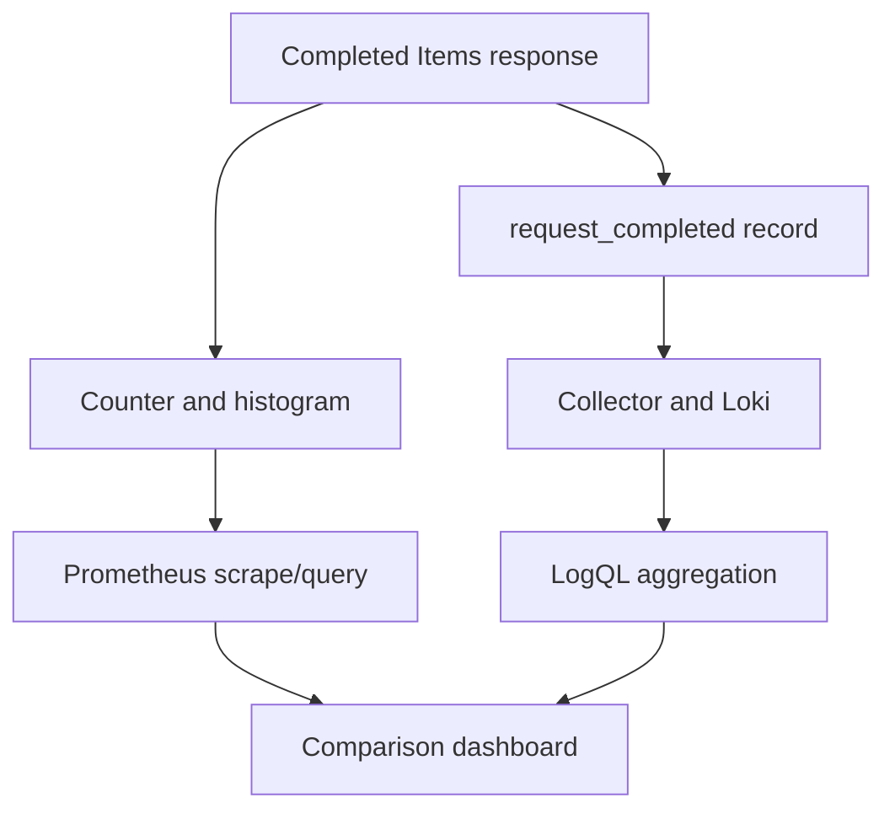

# Lab 30: Metrics from Log Events

## Purpose and Scope

> **Primary Objective:** Derive counts, rates and latency summaries from explicit log-event populations, then compare them with direct instrumentation and independent client evidence.

One request can create several log records. Choosing the right event boundary determines whether a derived metric means anything.

This lab adds LogQL metric queries and an eight-panel comparison dashboard, then checks one isolated workload against client observations, retained records and raw application-counter deltas. Derived values stay in Loki; application metrics stay in Prometheus. There is no remote write or duplicate ingestion. Log-based alerts begin in Lab 31.

## 1. Inherited State and Starting Checks

```bash
source lab-notes/session.sh
source lab-notes/evidence.sh
source lab-notes/raw-metrics.sh
source lab-notes/metrics-session.sh
source lab-notes/logs-session.sh
logs_check
start_lab 30
```

Complete [Lab 29](Lab-29.md). Use the same Linux Docker host, Bash session and repository root. Keep credentials, named volumes and the checkpoint item. Required host tools remain Docker Compose, Python 3, curl, jq, Git and ripgrep. Stop at a failed check and resolve it before proceeding. Eleven services and eight scrape jobs remain active.

## 2. Objectives and Measurement Boundaries

You will distinguish log counts from counter increases, calculate windowed record rates, limit query-label cardinality, unwrap numeric fields, handle undefined traffic/errors and explain why logs supplement explicit metric contracts.



A missed log need not remove a counter increment. A missed scrape need not remove a retained event. A failure before either observation can be absent from both. During the exact-delta experiment, stop other Items clients and load generators; health probes and metric scrapes may continue because the middleware excludes their routes.

## 3. Define the Derived Metric Contract

| Result | Selected population | Operation | Limitation |
|---|---|---|---|
| Request count | Items completion records | count_over_time | Retained records can be missing or duplicated |
| Request rate | Same | rate over log range | Window average, not instantaneous burst throughput |
| Status counts | Same, bounded status | Count grouped by status | Do not preserve per-event IDs in grouping |
| 5xx fraction | 5xx over all completed Items responses | Count ratio | RED ratio, not Lab 25's 4xx-excluding availability SLI |
| Mutation count | create/update/delete event names | Count by event name | Commit logs are not durable transaction evidence |
| Duration summaries | Completion duration_ms | unwrap plus aggregation | Retained, rounded observations can be biased |

LogQL `rate(log-range)` counts entries per second. PromQL `rate(counter-range)` estimates reset-aware counter growth with extrapolation. Similar function names do not imply the same inputs or calculation. The [Loki metric-query reference](https://grafana.com/docs/loki/latest/query/metric_queries/) describes log and unwrapped range aggregations.

Three workload cycles generate 24 requests but 33 records. Counting every line as a request is wrong. Applying counter-style reasoning to an already windowed log count is also wrong.

## 4. Install the Complete Query Generator

```bash
cat > lab-notes/build_log_metrics.py <<'PYTHON'
import json,re,sys
if len(sys.argv) not in (3,4):raise SystemExit("Usage: build_log_metrics.py SERVICE ENVIRONMENT [PREFIX]")
service,environment=sys.argv[1:3];prefix=sys.argv[3] if len(sys.argv)==4 else None
if prefix and not re.fullmatch(r"loglab-[a-f0-9]{12}",prefix):raise SystemExit("Invalid prefix")
s='{service_name='+json.dumps(service)+',deployment_environment_name='+json.dumps(environment)+'}'
base=s+(' |= '+json.dumps(prefix) if prefix else '')
requests=base+' | event_name="request_completed" | http_route=~'+json.dumps(r'/api/v1/items(/\{item_id\})?')
bounded=requests+' | keep service_name, deployment_environment_name, http_route, http_status_code'
group='service_name, deployment_environment_name'
total=f'sum by ({group}) (count_over_time({bounded} [5m]))'
errors=f'sum by ({group}) (count_over_time({bounded} | http_status_code>=500 | __error__="" [5m]))'
duration=requests+' | keep service_name, deployment_environment_name, http_route, duration_ms | unwrap duration_ms | __error__=""'
mutations=base+' | event_name=~"item_created|item_updated|item_deleted" | keep service_name, deployment_environment_name, event_name'
q={"all_log_count":f'sum(count_over_time({base} [5m]))',"request_count":total,
   "request_rate":f'sum by ({group}) (rate({bounded} [5m]))',
   "request_rate_by_route":f'sum by (http_route) (rate({bounded} [5m]))',
   "status_counts":f'sum by (http_status_code) (count_over_time({bounded} [5m]))',
   "server_error_ratio":f'(({errors} or on ({group}) (0*{total}))/{total}) and on ({group}) ({total}>0)',
   "mutation_counts":f'sum by (event_name) (count_over_time({mutations} [5m]))',
   "p95_ms":f'quantile_over_time(0.95, {duration} [5m]) by ({group})',
   "mean_ms":f'avg_over_time({duration} [5m]) by ({group})',
   "bad_unwrap":f'sum(sum_over_time({requests} | json not_numeric="message" | unwrap not_numeric [5m]))',
   "bad_unwrap_filtered":f'sum(sum_over_time({requests} | json not_numeric="message" | unwrap not_numeric | __error__="" [5m]))'}
print(json.dumps(q,indent=2))
PYTHON
```

The request population is restricted to the two normalized Items routes. `keep` retains only fields needed for the result before aggregation. This prevents unique metadata from unnecessarily expanding query-result cardinality even though the index is bounded.

An absent 5xx numerator receives zero only when a real denominator exists, using `0 * total`. Positive traffic is required; no log population is not reported as 100% successful. Missing shipping can still masquerade as low traffic, so query results must be paired with collection evidence.

Latency uses every completed Items response, matching the histogram's available dimensions. Its milliseconds must not be compared directly to seconds without conversion.

## 5. Install the Exact Raw-Counter Verifier

```bash
cat > lab-notes/verify_metric_ledger.py <<'PYTHON'
import argparse,json,re,math
from collections import Counter
from pathlib import Path
p=argparse.ArgumentParser()
for name in ["before","after","ledger"]:p.add_argument("--"+name,type=Path,required=True)
args=p.parse_args()
line_re=re.compile(r'^([a-zA-Z_:][a-zA-Z0-9_:]*)(?:\{(.*)\})?\s+([^\s]+)(?:\s+\d+)?$')
label_re=re.compile(r'([a-zA-Z_][a-zA-Z0-9_]*)="((?:\\.|[^"\\])*)"')
metrics={"application_http_requests_total","application_http_request_duration_seconds_count","application_items_mutations_total"}
def read(path):
    values={}
    for line in path.read_text().splitlines():
        if line.startswith("#"):continue
        m=line_re.fullmatch(line)
        if not m or m[1] not in metrics:continue
        labels={k:json.loads('"'+v+'"') for k,v in label_re.findall(m[2] or "")}
        if m[1]!="application_items_mutations_total" and labels.get("route") not in {"/api/v1/items","/api/v1/items/{item_id}"}:continue
        value=float(m[3]);assert math.isfinite(value)
        values[(m[1],tuple(sorted(labels.items())))]=value
    return values
before,after=read(args.before),read(args.after);deltas={}
for key in before.keys()|after.keys():
    assert key in after,"Series disappeared"
    value=after[key]-before.get(key,0);assert value>=0,"Counter reset; repeat isolated experiment"
    deltas[key]=value
ledger=[json.loads(line) for line in args.ledger.read_text().splitlines()]
assert ledger and all(r["status"]==r["expected"] and not r["cleanup"] for r in ledger)
statuses=Counter();mutations=Counter();latency=0
for (name,labels),value in deltas.items():
    labels=dict(labels)
    if name=="application_http_requests_total":statuses[labels["status_code"]]+=value
    elif name=="application_items_mutations_total":mutations[labels["operation"]]+=value
    else:latency+=value
mapping={"item_created":"create","item_updated":"update","item_deleted":"delete"}
assert statuses==Counter(str(r["status"]) for r in ledger),statuses
assert mutations==Counter(mapping[r["business_event"]] for r in ledger if r["business_event"]),mutations
assert latency==len(ledger),latency
print(json.dumps({"client_requests":len(ledger),"raw_status_deltas":dict(statuses),"raw_mutation_deltas":dict(mutations),"raw_latency_observations":latency,"population_matches":True},indent=2))
PYTHON
```

This verifier compares raw snapshots with an isolated client ledger, including per-status requests, mutation operations and histogram observation count. It rejects disappeared series, counter decreases and mismatched populations.

This is an exact within-process observation test, separate from Prometheus `increase()`. A fractional extrapolated increase is legitimate but cannot serve as an exact transaction ledger. Do not restart/recreate the app between snapshots.

## 6. Provision the Comparison Dashboard

```bash
cat > lab-notes/build_log_dashboard.py <<'PYTHON'
import json,subprocess,sys
from pathlib import Path
from dashboard_factory import panel,save
q=json.loads(subprocess.check_output([sys.executable,"lab-notes/build_log_metrics.py","fastapi-items","local"],text=True))
q={k:v.replace('service_name="fastapi-items"','service_name=~"${service:regex}"').replace('deployment_environment_name="local"','deployment_environment_name=~"${environment:regex}"') for k,v in q.items()}
s='environment=~"${environment:regex}",service=~"${service:regex}"'
r=',route=~'+json.dumps(r'/api/v1/items(/\{item_id\})?')
panels=[]
def loki(title,key,unit,description):
    p=panel(len(panels)+1,title,[(q[key],title)],unit,description)
    ds={"type":"loki","uid":"loki"};p["datasource"]=ds
    p["targets"]=[{"refId":"A","datasource":ds,"expr":q[key],"queryType":"range","editorMode":"code","legendFormat":"{{service_name}} {{event_name}}"}]
    panels.append(p)
def prom(title,query,unit,description):panels.append(panel(len(panels)+1,title,[(query,title)],unit,description))
loki("Items requests/s — logs","request_rate","reqps","Completed Items records over 5m, affected by delivery and schema.")
prom("Items requests/s — direct metrics",f'sum(rate(application_http_requests_total{{job="fastapi",{s}{r}}}[5m]))',"reqps","Counter rate with reset handling and extrapolation.")
loki("Items completions — log count 5m","request_count","short","Retained records; inspect duplication, delay and coverage.")
prom("Items requests — counter increase 5m",f'sum(increase(application_http_requests_total{{job="fastapi",{s}{r}}}[5m]))',"short","Extrapolated increase may be fractional.")
loki("Items duration p95 — log values","p95_ms","ms","Retained duration_ms values rounded by the logger.")
prom("Items duration p95 — histogram",f'1000*histogram_quantile(0.95,sum by (le) (rate(application_http_request_duration_seconds_bucket{{job="fastapi",{s}{r}}}[5m])))',"ms","Bucket interpolation converted from seconds to milliseconds.")
loki("Mutation records — logs 5m","mutation_counts","short","Counts by bounded event name, never by identity.")
prom("Mutation increase — direct metrics",f'sum by (operation) (increase(application_items_mutations_total{{job="fastapi",{s}}}[5m]))',"short","create/update/delete correspond to item_created/item_updated/item_deleted.")
out=Path("config/grafana/learning/dashboards/lab30-log-metrics.json")
save(out,"lab30-log-metrics","Lab 30 — Logs and direct metrics",panels)
d=json.loads(out.read_text());d["templating"]=json.loads(Path("config/grafana/learning/dashboards/lab20-red.json").read_text())["templating"]
d["description"]="Independent observations of the same Items routes. Time windows, rounding, delivery and estimators matter. No duplicate ingestion."
d["links"]=[{"title":"SLO operations","type":"link","url":"/d/lab26-slo","includeVars":True,"keepTime":True,"targetBlank":False}]
out.write_text(json.dumps(d,indent=2)+"\n")
PYTHON
```

```bash
python3 lab-notes/build_log_dashboard.py
chmod 644 config/grafana/learning/dashboards/lab30-log-metrics.json
python3 -m json.tool config/grafana/learning/dashboards/lab30-log-metrics.json > /dev/null
wait_grafana
```

Open **Lab 30 — Logs and direct metrics**, UID `lab30-log-metrics`, after the provider polling interval. Four panel pairs compare rate, count, p95 duration and mutations. Loki panels use UID `loki`; direct metric panels use `prometheus`.

The inherited bounded variables map to Loki's service/environment resource labels and Prometheus's scrape labels. Both sides select the same Items routes. The dashboard may include earlier traffic in its five-minute range; the unique-prefix experiment below is the exact-population proof.

## 7. Run and Verify an Isolated Population

```bash
api -fsS "$APP_URL/metrics" > "$LAB_DIR/before.prom"
record_change 'run isolated log-versus-counter population' planned
python3 lab-notes/log_workload.py --url "$APP_URL" --out "$LAB_DIR/workload" --cycles 3 \
  > "$LAB_DIR/workload-summary.json"
api -fsS "$APP_URL/metrics" > "$LAB_DIR/after.prom"
record_change 'run isolated log-versus-counter population' completed
PREFIX=$(cat "$LAB_DIR/workload/prefix.txt")
LAST_RID=$(tail -n 1 "$LAB_DIR/workload/client.jsonl" | jq -er '.request_id')
wait_log_request "$LAST_RID" > "$LAB_DIR/final-request-loki.json"
python3 lab-notes/build_log_metrics.py "$LAB_SERVICE" "$LAB_ENVIRONMENT" "$PREFIX" \
  > "$LAB_DIR/log-metric-queries.json"
LOG_START_NS=$(python3 - "$LAB_DIR/workload/start-ns.txt" <<'PYTHON'
import sys
print(int(open(sys.argv[1]).read())-10**9)
PYTHON
)
LOG_END_NS=$(python3 -c 'import time; print(time.time_ns())')
lrange "$LOG_SELECTOR |= \"$PREFIX\"" > "$LAB_DIR/workload-loki.json"
python3 lab-notes/verify_event_ledger.py --ledger "$LAB_DIR/workload/client.jsonl" \
  --logs "$LAB_DIR/workload-loki.json" > "$LAB_DIR/log-population-proof.json"
python3 lab-notes/verify_metric_ledger.py --ledger "$LAB_DIR/workload/client.jsonl" \
  --before "$LAB_DIR/before.prom" --after "$LAB_DIR/after.prom" > "$LAB_DIR/metric-population-proof.json"
cat "$LAB_DIR/log-population-proof.json" "$LAB_DIR/metric-population-proof.json"
```

Predict 24 completions, 24 histogram observations, three increments each for create/update/delete and 33 retained records. Both proofs should report `population_matches: true`.

If logs are still arriving, refresh `LOG_END_NS`, requery this prefix and rerun only the log verifier. Keep the original counter snapshots and ledger. Counter mismatches may indicate other Items clients or a process restart; preserve failed evidence and repeat in a fresh isolated run instead of adjusting expected counts.

## 8. Freeze Time and Assert the LogQL Results

```bash
METRIC_AT=$(python3 -c 'import time; print(time.time_ns())')
printf '%s\n' "$METRIC_AT" > "$LAB_DIR/evaluation-ns.txt"
python3 - "$LAB_DIR/workload/start-ns.txt" "$METRIC_AT" <<'PYTHON'
import sys
age=(int(sys.argv[2])-int(open(sys.argv[1]).read()))/1e9
assert 0<=age<240,"Run too old for the 5m fixture; repeat in a fresh evidence directory"
PYTHON
for name in all_log_count request_count request_rate status_counts mutation_counts server_error_ratio p95_ms mean_ms; do
  lq "$(jq -r --arg key "$name" '.[$key]' "$LAB_DIR/log-metric-queries.json")" "$METRIC_AT" \
    > "$LAB_DIR/log-$name.json"
done
python3 - "$LAB_DIR" <<'PYTHON'
import json,math,sys
from pathlib import Path
p=Path(sys.argv[1])
def result(name):
    data=json.loads((p/f"log-{name}.json").read_text());assert data["status"]=="success"
    return data["data"]["result"]
def one(name):
    values=result(name);assert len(values)==1,(name,values)
    return float(values[0]["value"][1])
assert one("all_log_count")==33 and one("request_count")==24
assert math.isclose(one("request_rate"),24/300,rel_tol=1e-9)
assert one("server_error_ratio")==0
statuses={r["metric"]["http_status_code"]:float(r["value"][1]) for r in result("status_counts")}
assert statuses=={"200":12,"201":3,"204":3,"404":3,"422":3},statuses
mutations={r["metric"]["event_name"]:float(r["value"][1]) for r in result("mutation_counts")}
assert mutations=={"item_created":3,"item_updated":3,"item_deleted":3},mutations
assert one("p95_ms")>=0 and one("mean_ms")>=0
print("Verified 33 records, 24 completions, 0.08 requests/s, bounded status and mutation counts")
PYTHON
```

The five-minute rate is `24/300=0.08 requests/s`, including idle time. It is not the short burst's instantaneous throughput. The count of all lines, 33, demonstrates the wrong denominator.

The fixed nanosecond evaluation timestamp prevents later queries silently shifting the window. If you paused before freezing time, create a fresh run; do not change the range and retain the old rate expectation. Query time and log event timestamps determine inclusion, not when the command finishes.

## 9. Interpret Unwrapped Durations Correctly

`unwrap duration_ms` converts each selected record value into a numeric sample. `quantile_over_time` and `avg_over_time` then summarize retained values. The logger rounds durations to three decimal places in milliseconds.

Prometheus histogram quantiles interpolate within cumulative buckets. The dashboard multiplies the seconds-based estimate by 1,000 for comparison. Different estimators, rounding, time boundaries and scrape extrapolation can produce legitimate differences even with perfect delivery. Missing or duplicate records can additionally bias the log estimate.

Do not average per-route p95s into a service p95. Do not replace the SLO's histogram-threshold ratio with p95: a percentile is a different question from the fraction of requests meeting 250 ms.

## 10. Expose a Numeric Error and Recover

```bash
if lq "$(jq -r '.bad_unwrap' "$LAB_DIR/log-metric-queries.json")" "$METRIC_AT" \
  > "$LAB_DIR/bad-unwrap.json" 2> "$LAB_DIR/bad-unwrap-error.txt"; then
  echo 'Unexpected success; confirm matching completion records exist' >&2
  false
else
  cat "$LAB_DIR/bad-unwrap-error.txt"
fi
lq "$(jq -r '.bad_unwrap_filtered' "$LAB_DIR/log-metric-queries.json")" "$METRIC_AT" \
  > "$LAB_DIR/invalid-values-excluded.json"
lq "$(jq -r '.p95_ms' "$LAB_DIR/log-metric-queries.json")" "$METRIC_AT" \
  > "$LAB_DIR/restored-duration-query.json"
```

The wrong query unwraps the text `request_completed` as a number. Expect a SampleExtraction/pipeline error. The error filter must follow `unwrap`, because conversion creates the error after parsing.

Filtering all invalid samples yields no usable measurement, not zero latency. Recovery uses the correct numeric field. Excluding malformed data may be justified, but investigate schema failure separately so an apparently clean metric does not hide broken producers.

## 11. Compare the Three Observation Layers

```bash
api -fsS --get --data-urlencode \
  'query=sum(increase(application_http_requests_total{job="fastapi",route=~"/api/v1/items(/\\{item_id\\})?"}[5m]))' \
  "$PROM_URL/api/v1/query" > "$LAB_DIR/prometheus-items-increase.json"
capture_app_logs
logs_check
```

The raw snapshots isolate this run exactly. The Prometheus query covers all matching Items traffic in its five-minute window and may include earlier calls. A scrape immediately after the workload may not have happened yet; repeat after two successful scrapes if needed and record the new evaluation time.

Compare all four dashboard pairs with the same environment/service. Diagnose population/time differences first, delivery/collection second, estimator behavior third. Visual agreement is useful but does not replace the ledger proof.

Mutation labels have different vocabularies: `create` maps to `item_created`, `update` to `item_updated`, and `delete` to `item_deleted`. Match semantics, not identical strings.

## 12. Demonstrate Selection Bias Without Losing Real Logs

```bash
ORIGINAL_QUERY=$(jq -r '.request_count' "$LAB_DIR/log-metric-queries.json")
ERROR_QUERY="$LOG_SELECTOR |= \"$PREFIX\" | event_name=\"request_completed\" | http_status_code>=400 | __error__=\"\""
lq "sum(count_over_time($ERROR_QUERY [5m]))" "$METRIC_AT" > "$LAB_DIR/client-errors-only.json"
lq "$ORIGINAL_QUERY" "$METRIC_AT" > "$LAB_DIR/restored-completion-count.json"
jq '.data.result[].value[1]' "$LAB_DIR/client-errors-only.json" "$LAB_DIR/restored-completion-count.json"
```

Expected: six versus 24. Selecting only intentional client errors would be the wrong denominator for all traffic. Source records and direct counters are unchanged; restoring the correct query recovers the measurement.

Shipping outages, buffering, retention and cost experiments belong to Lab 32. This exercise demonstrates selection bias without deliberately dropping telemetry.

## 13. Troubleshooting and Proof of Recovery

| Symptom | Inspect | Action |
|---|---|---|
| 33 requests instead of 24 | Event-name selection | Count completions rather than every record |
| Log count below ledger | Window, delay, filters, output limit | Requery the same prefix and compare event IDs |
| Many metric result series | Metadata/parser dimensions | Keep/group only bounded useful fields |
| Numeric pipeline error | Field and stage order | Correct the field; filter after conversion |
| Empty error ratio | Denominator and shipping health | Do not blanket-fill missing data with zero |
| Raw counter mismatch | Extra traffic or reset | Repeat an isolated run; preserve failed evidence |
| Different p95 values | Units, estimator, timing and delivery | Compare like populations and explain estimators |

```bash
logs_check
api -fsS "$APP_URL/health/ready" > "$LAB_DIR/final-readiness.json"
git diff --check
```

Keep the correct queries and dashboard. Temporary rows were deleted, storage/index settings are unchanged and query-only faults need no service restart.

## 14. Knowledge Check

1. Why 33 records for 24 requests?
2. What does 0.08 requests/s represent?
3. Why filter errors after unwrap?
4. Why retain direct instrumentation?

### Answer Guide

1. Nine mutation records accompany 24 completion records.
2. The average record rate over the whole five-minute range.
3. Conversion can introduce a new error after parsing succeeded.
4. It preserves explicit metric contracts without adding log schema, scan and delivery dependencies.

## 15. Professional Scenario Exercise

A team replaces its error counter with a count of ERROR-level lines. A log-level change makes the metric zero while users receive 503s. Identify the population mistake, compare independent evidence and restore a user-outcome metric without duplicate ingestion.

## 16. Lab Notebook Template

Create a notebook in the evidence directory for this run:

```bash
test -e "$LAB_DIR/notebook.md" || printf '# Lab 30 Evidence\n' > "$LAB_DIR/notebook.md"
```

Use these headings and fill them with your predictions, commands, observed results and conclusions:

```markdown
# Lab 30 Evidence

## Starting state and operational question
## Prediction before the experiment
## Commands and UTC timestamps
## Observed results and source evidence
## Unexpected findings and troubleshooting
## Recovery proof and remaining limitations
```

## 17. Observable Completion Criteria

- [ ] Each derived metric has an explicit population.
- [ ] No duplicate metric ingestion is introduced.
- [ ] Client ledger, retained bodies and raw counter deltas agree.
- [ ] Fixed-time LogQL verifies 24 completions, 33 records and 0.08 requests/s.
- [ ] Status/mutation grouping excludes per-event identity.
- [ ] Numeric conversion failure and recovery are observed.
- [ ] All eight dashboard panels query real data with matched Items scope.

## 18. Production Implications

Log-derived metrics are useful for exploratory or rare-event questions and poorly instrumented producers. They depend on schema stability, retained data and transport behavior; repeated scans can be expensive. Keep explicit RED/SLO instruments as the primary metric source and treat derived values as additional evidence.

## 19. End State and Transition

Keep eleven services, eight jobs, four learning dashboards and the enriched pipeline. [Lab 31](Lab-31.md) will add selected log-based alerts while controlling noise, query cost and duplicate notifications. No Lab 31 implementation is included here.
