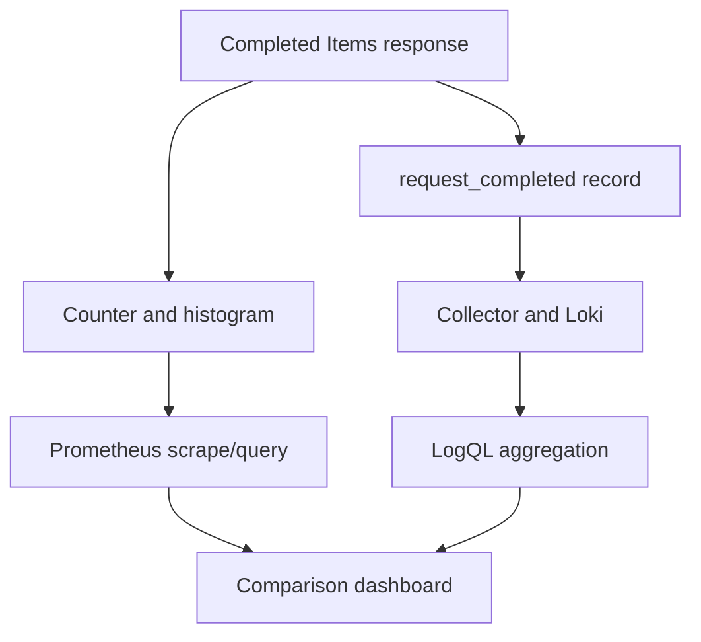

# Lab 30: Metrics from Log Events

## 1. Purpose and Learning Outcomes

**In Plain Language:** You will derive counts, rates, and duration summaries from request-completion logs, then compare them with native metrics. Both views describe related work, but their retention, selection, and timing differ. A known workload and fixed evaluation time make those differences visible without confusing total log lines with total requests.

> **Primary Objective:** Derive counts, rates and latency summaries from explicit log-event populations, then compare them with direct instrumentation and independent client evidence.

One request can create several log records. Choosing the right event boundary determines whether a derived metric means anything.

This lab adds LogQL metric queries and an eight-panel comparison dashboard, then checks one isolated workload against client observations, retained records and raw application-counter deltas. Derived values stay in Loki; application metrics stay in Prometheus. There is no remote write or duplicate ingestion. Log-based alerts begin in Lab 31.

## 2. Starting Point and Lab Map

Use this guide inside the complete application repository. Run commands from the repository root in Bash unless a step says otherwise. Work through the starting checks in order; they load the helpers and state this lab needs.

Read the explanation before each step, run one complete code block at a time, and compare the actual result with the stated expectation. Save commands, observations, explanations, and unexpected results in your notebook.

### Key Terms

| **Term**           | **Plain-Language Meaning**                                                              |
| ------------------ | --------------------------------------------------------------------------------------- |
| Log-derived metric | A numeric result calculated from a selected set of retained log records.                |
| Unwrap             | Converting a selected log field into a numeric sample for aggregation.                  |
| Selection bias     | A result distorted because the chosen records do not represent the intended population. |

### Lab Map

The arrows show the flow or dependency being studied. Branches identify paths to compare; this is a conceptual map, not a captured runtime trace.


```mermaid
flowchart TD
    R["Completed Items response"] --> C["Counter and histogram"]
    R --> L["request_completed record"]
    C --> P["Prometheus scrape/query"]
    L --> K["Collector and Loki"]
    K --> Q["LogQL aggregation"]
    P --> G["Comparison dashboard"]
    Q --> G
```

## 3. Guided Walkthrough

### Step 01. Inherited State and Starting Checks

**What You Are Doing:** Start with the verified CRUD ledger and query helpers. Keep the application process stable so exact raw-counter differences remain meaningful.

**Practical Walkthrough:** Load the verified workload and query helpers and keep the app process stable during raw-counter comparisons. Confirm fresh log delivery before deriving metrics from records. This provides independent native and retained-log views of the same controlled requests.

Verify fresh Loki delivery and stable app process identity before taking native-counter snapshots. The workload helper and query helpers must refer to the same run prefix. These prerequisites make later differences attributable to observation paths rather than mixed runs or an unrecorded reset.

```bash
source lab-notes/session.sh
source lab-notes/evidence.sh
source lab-notes/raw-metrics.sh
source lab-notes/metrics-session.sh
source lab-notes/logs-session.sh
logs_check
start_lab 30
```

Complete [Lab 29](Lab-29.md). Use the same Linux Docker host, Bash session and repository root. Keep credentials, named volumes and the checkpoint item. Required host tools remain Docker Compose, Python 3, curl, jq, Git and ripgrep. Stop at a failed check and resolve it before proceeding. Eleven services and eight scrape jobs remain active.

**Understanding the Result:** A process reset invalidates simple raw subtraction. A delivery gap can affect log-derived results independently of native counters.

### Step 02. Objectives and Measurement Boundaries

**What You Are Doing:** Separate direct instrumentation from retained-record calculations. A log-delivery gap can affect one representation without removing an already updated application counter.

**Practical Walkthrough:** Follow one request into direct instrument updates and separately into emitted, transported, retained logs. The native counter can increase even if the corresponding log is later lost. A disagreement therefore needs investigation across both paths rather than assuming the two calculations must always be identical.

Trace native metric updates and log delivery as separate branches after the same request. A counter can advance while transport later loses its corresponding record. Compare both against the client ledger before deciding which branch explains a disagreement or assuming their values must match automatically.

You will distinguish log counts from counter increases, calculate windowed record rates, limit query-label cardinality, unwrap numeric fields, handle undefined traffic/errors and explain why logs supplement explicit metric contracts.

The lab map in Section 2 shows this relationship.

A missed log need not remove a counter increment. A missed scrape need not remove a retained event. A failure before either observation can be absent from both. During the exact-delta experiment, stop other Items clients and load generators; health probes and metric scrapes may continue because the middleware excludes their routes.

**Understanding the Result:** Define the last proven boundary on each path. The same source event can have different retained evidence.

### Step 03. Define the Derived Metric Contract

**What You Are Doing:** Define the event type, route population, units, and window for each derived result. The definition determines whether you are measuring requests, business events, or all records.

**Practical Walkthrough:** Specify event type, route scope, duration units, and window before writing each derived query. Counting completion records measures requests; counting all records also includes business events. Keep the contract beside the expression so a convenient total is not mistaken for the intended population.

Define the event type and selected routes before counting records. Completion events represent completed requests; additional business events describe other occurrences. Keep duration units and range length beside each derived expression so a plausible numeric result cannot obscure a different underlying population.

| **Result**         | **Selected Population**                | **Operation**           | **Limitation**                                         |
| ------------------ | -------------------------------------- | ----------------------- | ------------------------------------------------------ |
| Request count      | Items completion records               | count_over_time         | Retained records can be missing or duplicated          |
| Request rate       | Same                                   | rate over log range     | Window average, not instantaneous burst throughput     |
| Status counts      | Same, bounded status                   | Count grouped by status | Do not preserve per-event IDs in grouping              |
| 5xx fraction       | 5xx over all completed Items responses | Count ratio             | RED ratio, not Lab 25's 4xx-excluding availability SLI |
| Mutation count     | create/update/delete event names       | Count by event name     | Commit logs are not durable transaction evidence       |
| Duration summaries | Completion duration_ms                 | unwrap plus aggregation | Retained, rounded observations can be biased           |

LogQL `rate(log-range)` counts entries per second. PromQL `rate(counter-range)` estimates reset-aware counter growth with extrapolation. Similar function names do not imply the same inputs or calculation. The [Loki metric-query reference](https://grafana.com/docs/loki/latest/query/metric_queries/) describes log and unwrapped range aggregations.

Three workload cycles generate 24 requests but 33 records. Counting every line as a request is wrong. Applying counter-style reasoning to an already windowed log count is also wrong.

**Understanding the Result:** The denominator follows event selection. More records do not necessarily mean more requests.

### Step 04. Install the Complete Query Generator

**What You Are Doing:** Generate expressions that keep only the required query dimensions. Unique metadata can expand intermediate query results even when the stored index remains bounded.

**Practical Walkthrough:** Generate expressions with explicit dimensions and remove high-cardinality extracted identities from the final grouping where they are unnecessary. Metadata avoids index expansion but can still create many intermediate query groups. Preserve only labels needed for the operational question.

Inspect which extracted dimensions survive aggregation and remove individual identities from final metric grouping when unnecessary. Metadata avoids indexed-stream expansion, but extracted values can still multiply query result groups. Bounded final dimensions are therefore a query-design decision as well as an ingestion-design decision.

```bash
cat > lab-notes/build_log_metrics.py <<'PYTHON'
import json,re,sys
if len(sys.argv) not in (3,4):raise SystemExit("Usage: build_log_metrics.py SERVICE ENVIRONMENT [PREFIX]")
service,environment=sys.argv[1:3];prefix=sys.argv[3] if len(sys.argv)==4 else None
if prefix and not re.fullmatch(r"loglab-[a-f0-9]{12}",prefix):raise SystemExit("Invalid prefix")
s='{service_name='+json.dumps(service)+',deployment_environment_name='+json.dumps(environment)+'}'
base=s+(' |= '+json.dumps(prefix) if prefix else '')
requests=base+' | event_name="request_completed" | http_route=~'+json.dumps(r'/api/v1/items(/\{item_id\})?')
bounded=requests+' | keep service_name, deployment_environment_name, http_route, http_status_code'
group='service_name, deployment_environment_name'
total=f'sum by ({group}) (count_over_time({bounded} [5m]))'
errors=f'sum by ({group}) (count_over_time({bounded} | http_status_code>=500 | __error__="" [5m]))'
duration=requests+' | keep service_name, deployment_environment_name, http_route, duration_ms | unwrap duration_ms | __error__=""'
mutations=base+' | event_name=~"item_created|item_updated|item_deleted" | keep service_name, deployment_environment_name, event_name'
q={"all_log_count":f'sum(count_over_time({base} [5m]))',"request_count":total,
   "request_rate":f'sum by ({group}) (rate({bounded} [5m]))',
   "request_rate_by_route":f'sum by (http_route) (rate({bounded} [5m]))',
   "status_counts":f'sum by (http_status_code) (count_over_time({bounded} [5m]))',
   "server_error_ratio":f'(({errors} or on ({group}) (0*{total}))/{total}) and on ({group}) ({total}>0)',
   "mutation_counts":f'sum by (event_name) (count_over_time({mutations} [5m]))',
   "p95_ms":f'quantile_over_time(0.95, {duration} [5m]) by ({group})',
   "mean_ms":f'avg_over_time({duration} [5m]) by ({group})',
   "bad_unwrap":f'sum(sum_over_time({requests} | json not_numeric="message" | unwrap not_numeric [5m]))',
   "bad_unwrap_filtered":f'sum(sum_over_time({requests} | json not_numeric="message" | unwrap not_numeric | __error__="" [5m]))'}
print(json.dumps(q,indent=2))
PYTHON
```

**Command Note:** `<<'PYTHON'` writes the following block literally until `PYTHON`. Quoting the delimiter prevents Bash from expanding `$variables` inside the generated file; creation and execution are separate steps.

The request population is restricted to the two normalized Items routes. `keep` retains only fields needed for the result before aggregation. This prevents unique metadata from unnecessarily expanding query-result cardinality even though the index is bounded.

An absent 5xx numerator receives zero only when a real denominator exists, using `0 * total`. Positive traffic is required; no log population is not reported as 100% successful. Missing shipping can still masquerade as low traffic, so query results must be paired with collection evidence.

Latency uses every completed Items response, matching the histogram's available dimensions. Its milliseconds must not be compared directly to seconds without conversion.

**Understanding the Result:** Bounded storage indexing does not guarantee every query is cheap. Extraction and grouping also determine query cardinality.

### Step 05. Install the Exact Raw-Counter Verifier

**What You Are Doing:** Install the raw-counter verifier as an independent check of the workload. It rejects resets and disappeared series instead of treating an invalid comparison as an exact delta.

**Practical Walkthrough:** Install the verifier and read its guards for resets and missing series. It compares matching raw observations around the workload rather than estimating a moving window. If a guard rejects the run, establish a new valid baseline instead of interpreting the invalid subtraction as an exact event count.

Read the verifier's rejection conditions for absent series and resets. Its subtraction is exact only within a valid controlled process interval. If a guard fails, preserve the failed run and establish a new baseline instead of silently converting missing input or negative deltas into zero.

```bash
cat > lab-notes/verify_metric_ledger.py <<'PYTHON'
import argparse,json,re,math
from collections import Counter
from pathlib import Path
p=argparse.ArgumentParser()
for name in ["before","after","ledger"]:p.add_argument("--"+name,type=Path,required=True)
args=p.parse_args()
line_re=re.compile(r'^([a-zA-Z_:][a-zA-Z0-9_:]*)(?:\{(.*)\})?\s+([^\s]+)(?:\s+\d+)?$')
label_re=re.compile(r'([a-zA-Z_][a-zA-Z0-9_]*)="((?:\\.|[^"\\])*)"')
metrics={"application_http_requests_total","application_http_request_duration_seconds_count","application_items_mutations_total"}
def read(path):
    values={}
    for line in path.read_text().splitlines():
        if line.startswith("#"):continue
        m=line_re.fullmatch(line)
        if not m or m[1] not in metrics:continue
        labels={k:json.loads('"'+v+'"') for k,v in label_re.findall(m[2] or "")}
        if m[1]!="application_items_mutations_total" and labels.get("route") not in {"/api/v1/items","/api/v1/items/{item_id}"}:continue
        value=float(m[3]);assert math.isfinite(value)
        values[(m[1],tuple(sorted(labels.items())))]=value
    return values
before,after=read(args.before),read(args.after);deltas={}
for key in before.keys()|after.keys():
    assert key in after,"Series disappeared"
    value=after[key]-before.get(key,0);assert value>=0,"Counter reset; repeat isolated experiment"
    deltas[key]=value
ledger=[json.loads(line) for line in args.ledger.read_text().splitlines()]
assert ledger and all(r["status"]==r["expected"] and not r["cleanup"] for r in ledger)
statuses=Counter();mutations=Counter();latency=0
for (name,labels),value in deltas.items():
    labels=dict(labels)
    if name=="application_http_requests_total":statuses[labels["status_code"]]+=value
    elif name=="application_items_mutations_total":mutations[labels["operation"]]+=value
    else:latency+=value
mapping={"item_created":"create","item_updated":"update","item_deleted":"delete"}
assert statuses==Counter(str(r["status"]) for r in ledger),statuses
assert mutations==Counter(mapping[r["business_event"]] for r in ledger if r["business_event"]),mutations
assert latency==len(ledger),latency
print(json.dumps({"client_requests":len(ledger),"raw_status_deltas":dict(statuses),"raw_mutation_deltas":dict(mutations),"raw_latency_observations":latency,"population_matches":True},indent=2))
PYTHON
```

This verifier compares raw snapshots with an isolated client ledger, including per-status requests, mutation operations and histogram observation count. It rejects disappeared series, counter decreases and mismatched populations.

This is an exact within-process observation test, separate from Prometheus `increase()`. A fractional extrapolated increase is legitimate but cannot serve as an exact transaction ledger. Do not restart/recreate the app between snapshots.

**Understanding the Result:** A rejected comparison protects the evidence contract. It is not a measurement of zero activity.

### Step 06. Provision the Comparison Dashboard

**What You Are Doing:** Provision paired panels for logs and native metrics. Matching panel questions make disagreements easier to investigate, while source and units stay visible.

**Practical Walkthrough:** Provision paired log and native-metric panels that answer the same question with explicit source and units. Align their route scope and time context while retaining their different observation boundaries. This makes discrepancies visible without disguising one source as a duplicate of the other.

Check both panel sources, units, label scope, and evaluation windows after provisioning. Similar-looking charts should answer the same operational question while clearly identifying their distinct measurement paths. Keep source differences visible so delayed or missing logs do not become indistinguishable from native instrument behavior.

```bash
cat > lab-notes/build_log_dashboard.py <<'PYTHON'
import json,subprocess,sys
from pathlib import Path
from dashboard_factory import panel,save
q=json.loads(subprocess.check_output([sys.executable,"lab-notes/build_log_metrics.py","items-info","local"],text=True))
q={k:v.replace('service_name="items-info"','service_name=~"${service:regex}"').replace('deployment_environment_name="local"','deployment_environment_name=~"${environment:regex}"') for k,v in q.items()}
s='environment=~"${environment:regex}",service=~"${service:regex}"'
r=',route=~'+json.dumps(r'/api/v1/items(/\{item_id\})?')
panels=[]
def loki(title,key,unit,description):
    p=panel(len(panels)+1,title,[(q[key],title)],unit,description)
    ds={"type":"loki","uid":"loki"};p["datasource"]=ds
    p["targets"]=[{"refId":"A","datasource":ds,"expr":q[key],"queryType":"range","editorMode":"code","legendFormat":"{{service_name}} {{event_name}}"}]
    panels.append(p)
def prom(title,query,unit,description):panels.append(panel(len(panels)+1,title,[(query,title)],unit,description))
loki("Items requests/s — logs","request_rate","reqps","Completed Items records over 5m, affected by delivery and schema.")
prom("Items requests/s — direct metrics",f'sum(rate(application_http_requests_total{{job="fastapi",{s}{r}}}[5m]))',"reqps","Counter rate with reset handling and extrapolation.")
loki("Items completions — log count 5m","request_count","short","Retained records; inspect duplication, delay and coverage.")
prom("Items requests — counter increase 5m",f'sum(increase(application_http_requests_total{{job="fastapi",{s}{r}}}[5m]))',"short","Extrapolated increase may be fractional.")
loki("Items duration p95 — log values","p95_ms","ms","Retained duration_ms values rounded by the logger.")
prom("Items duration p95 — histogram",f'1000*histogram_quantile(0.95,sum by (le) (rate(application_http_request_duration_seconds_bucket{{job="fastapi",{s}{r}}}[5m])))',"ms","Bucket interpolation converted from seconds to milliseconds.")
loki("Mutation records — logs 5m","mutation_counts","short","Counts by bounded event name, never by identity.")
prom("Mutation increase — direct metrics",f'sum by (operation) (increase(application_items_mutations_total{{job="fastapi",{s}}}[5m]))',"short","create/update/delete correspond to item_created/item_updated/item_deleted.")
out=Path("config/grafana/learning/dashboards/lab30-log-metrics.json")
save(out,"lab30-log-metrics","Lab 30 — Logs and direct metrics",panels)
d=json.loads(out.read_text());d["templating"]=json.loads(Path("config/grafana/learning/dashboards/lab20-red.json").read_text())["templating"]
d["description"]="Independent observations of the same Items routes. Time windows, rounding, delivery and estimators matter. No duplicate ingestion."
d["links"]=[{"title":"SLO operations","type":"link","url":"/d/lab26-slo","includeVars":True,"keepTime":True,"targetBlank":False}]
out.write_text(json.dumps(d,indent=2)+"\n")
PYTHON
```

```bash
python3 lab-notes/build_log_dashboard.py
chmod 644 config/grafana/learning/dashboards/lab30-log-metrics.json
python3 -m json.tool config/grafana/learning/dashboards/lab30-log-metrics.json > /dev/null
wait_grafana
```

Open **Lab 30 — Logs and direct metrics**, UID `lab30-log-metrics`, after the provider polling interval. Four panel pairs compare rate, count, p95 duration and mutations. Loki panels use UID `loki`; direct metric panels use `prometheus`.

The inherited bounded variables map to Loki's service/environment resource labels and Prometheus's scrape labels. Both sides select the same Items routes. The dashboard may include earlier traffic in its five-minute range; the unique-prefix experiment below is the exact-population proof.

**Understanding the Result:** Matching presentation helps comparison. It does not remove delivery, sampling, or representation differences.

### Step 07. Run and Verify an Isolated Population

**What You Are Doing:** Run one isolated population and verify both direct measurements and retained events. Wait for late records within the same run rather than changing the population.

**Practical Walkthrough:** Run one isolated workload and preserve its ledger, before-and-after counters, and expected log identities. Wait for the same run's delayed records rather than generating replacement traffic. Verify the exact population before interpreting either time-window calculation.

Run the isolated workload once and retain ledger, raw snapshots, and log identities together. Verify actual response outcomes before querying rates. Requery delayed records from this run without generating replacement traffic, preserving the fixed population needed for meaningful cross-source comparison.

```bash
api -fsS "$APP_URL/metrics" > "$LAB_DIR/before.prom"
record_change 'run isolated log-versus-counter population' planned
python3 lab-notes/log_workload.py --url "$APP_URL" --out "$LAB_DIR/workload" --cycles 3 \
  > "$LAB_DIR/workload-summary.json"
api -fsS "$APP_URL/metrics" > "$LAB_DIR/after.prom"
record_change 'run isolated log-versus-counter population' completed
PREFIX=$(cat "$LAB_DIR/workload/prefix.txt")
LAST_RID=$(tail -n 1 "$LAB_DIR/workload/client.jsonl" | jq -er '.request_id')
wait_log_request "$LAST_RID" > "$LAB_DIR/final-request-loki.json"
python3 lab-notes/build_log_metrics.py "$LAB_SERVICE" "$LAB_ENVIRONMENT" "$PREFIX" \
  > "$LAB_DIR/log-metric-queries.json"
LOG_START_NS=$(python3 - "$LAB_DIR/workload/start-ns.txt" <<'PYTHON'
import sys
print(int(open(sys.argv[1]).read())-10**9)
PYTHON
)
LOG_END_NS=$(python3 -c 'import time; print(time.time_ns())')
lrange "$LOG_SELECTOR |= \"$PREFIX\"" > "$LAB_DIR/workload-loki.json"
python3 lab-notes/verify_event_ledger.py --ledger "$LAB_DIR/workload/client.jsonl" \
  --logs "$LAB_DIR/workload-loki.json" > "$LAB_DIR/log-population-proof.json"
python3 lab-notes/verify_metric_ledger.py --ledger "$LAB_DIR/workload/client.jsonl" \
  --before "$LAB_DIR/before.prom" --after "$LAB_DIR/after.prom" > "$LAB_DIR/metric-population-proof.json"
cat "$LAB_DIR/log-population-proof.json" "$LAB_DIR/metric-population-proof.json"
```

Predict 24 completions, 24 histogram observations, three increments each for create/update/delete and 33 retained records. Both proofs should report `population_matches: true`.

If logs are still arriving, refresh `LOG_END_NS`, requery this prefix and rerun only the log verifier. Keep the original counter snapshots and ledger. Counter mismatches may indicate other Items clients or a process restart; preserve failed evidence and repeat in a fresh isolated run instead of adjusting expected counts.

**Understanding the Result:** Stable identity and scope make reconciliation possible. Repeated workloads would change both counters and expected retained records.

### Step 08. Freeze Time and Assert the LogQL Results

**What You Are Doing:** Fix the evaluation timestamp before asserting windowed results. A window-average rate includes its idle time and is not the short burst's instantaneous throughput.

**Practical Walkthrough:** Freeze the evaluation timestamp and use the specified five-minute window for the assertions. With 24 completion records fully inside 300 seconds, the window-average rate is 0.08 requests per second. This average includes idle time and differs from throughput during the brief active burst.

Read back the saved evaluation timestamp and use it unchanged for count, rate, and duration queries. Check that the workload's first and last records lie inside the selected five-minute interval. If a record falls outside, a smaller count can be a correct time selection; generating more requests or moving the end time would change the population being asserted.

```bash
METRIC_AT=$(python3 -c 'import time; print(time.time_ns())')
printf '%s\n' "$METRIC_AT" > "$LAB_DIR/evaluation-ns.txt"
python3 - "$LAB_DIR/workload/start-ns.txt" "$METRIC_AT" <<'PYTHON'
import sys
age=(int(sys.argv[2])-int(open(sys.argv[1]).read()))/1e9
assert 0<=age<240,"Run too old for the 5m fixture; repeat in a fresh evidence directory"
PYTHON
for name in all_log_count request_count request_rate status_counts mutation_counts server_error_ratio p95_ms mean_ms; do
  lq "$(jq -r --arg key "$name" '.[$key]' "$LAB_DIR/log-metric-queries.json")" "$METRIC_AT" \
    > "$LAB_DIR/log-$name.json"
done
python3 - "$LAB_DIR" <<'PYTHON'
import json,math,sys
from pathlib import Path
p=Path(sys.argv[1])
def result(name):
    data=json.loads((p/f"log-{name}.json").read_text());assert data["status"]=="success"
    return data["data"]["result"]
def one(name):
    values=result(name);assert len(values)==1,(name,values)
    return float(values[0]["value"][1])
assert one("all_log_count")==33 and one("request_count")==24
assert math.isclose(one("request_rate"),24/300,rel_tol=1e-9)
assert one("server_error_ratio")==0
statuses={r["metric"]["http_status_code"]:float(r["value"][1]) for r in result("status_counts")}
assert statuses=={"200":12,"201":3,"204":3,"404":3,"422":3},statuses
mutations={r["metric"]["event_name"]:float(r["value"][1]) for r in result("mutation_counts")}
assert mutations=={"item_created":3,"item_updated":3,"item_deleted":3},mutations
assert one("p95_ms")>=0 and one("mean_ms")>=0
print("Verified 33 records, 24 completions, 0.08 requests/s, bounded status and mutation counts")
PYTHON
```

**Command Note:** `jq --arg` passes a shell value as a JSON-query string variable without inserting it into the query text. Where used, `-e` turns a false or null final result into a failing exit status.

The five-minute rate is `24/300=0.08 requests/s`, including idle time. It is not the short burst's instantaneous throughput. The count of all lines, 33, demonstrates the wrong denominator.

The fixed nanosecond evaluation timestamp prevents later queries silently shifting the window. If you paused before freezing time, create a fresh run; do not change the range and retain the old rate expectation. Query time and log event timestamps determine inclusion, not when the command finishes.

**Understanding the Result:** Count the intended completion events, not all 33 records. Save the fixed timestamp with the rate assertion.

### Step 09. Interpret Unwrapped Durations Correctly

**What You Are Doing:** Interpret unwrapped log durations in their recorded units and precision. Their distribution summary differs from a quantile interpolated from Prometheus histogram buckets.

**Practical Walkthrough:** Extract the recorded duration as a numeric value and keep its millisecond unit explicit. A quantile over retained individual log values differs from interpolation over Prometheus's histogram buckets. Align populations and convert units before comparing the two summaries.

Check the extracted duration field is numeric and retain its millisecond unit until explicit conversion. Log quantiles use retained individual values, whereas classic histogram quantiles estimate within buckets. Align event population and time interval before attributing a numerical difference to either implementation.

`unwrap duration_ms` converts each selected record value into a numeric sample. `quantile_over_time` and `avg_over_time` then summarize retained values. The logger rounds durations to three decimal places in milliseconds.

Prometheus histogram quantiles interpolate within cumulative buckets. The dashboard multiplies the seconds-based estimate by 1,000 for comparison. Different estimators, rounding, time boundaries and scrape extrapolation can produce legitimate differences even with perfect delivery. Missing or duplicate records can additionally bias the log estimate.

Do not average per-route p95s into a service p95. Do not replace the SLO's histogram-threshold ratio with p95: a percentile is a different question from the fraction of requests meeting 250 ms.

**Understanding the Result:** Different representations retain different precision. A numeric disagreement is not automatically a measurement bug.

### Step 10. Expose a Numeric Error and Recover

**What You Are Doing:** Attempt an invalid numeric extraction and inspect the error after conversion. Filtering all failed conversions produces no usable measurement, not a demonstrated zero duration.

**Practical Walkthrough:** Attempt the invalid numeric extraction and inspect errors after the unwrap conversion stage. Error filtering must occur where conversion errors exist, not only before conversion. If every value is rejected, the result is an empty usable population rather than demonstrated zero duration.

Inspect errors created by the unwrap stage itself and place filtering after that conversion as shown. A pre-parser filter cannot remove errors that do not exist yet. If conversion rejects every record, describe the result as no usable observations rather than a measured duration of zero.

```bash
if lq "$(jq -r '.bad_unwrap' "$LAB_DIR/log-metric-queries.json")" "$METRIC_AT" \
  > "$LAB_DIR/bad-unwrap.json" 2> "$LAB_DIR/bad-unwrap-error.txt"; then
  echo 'Unexpected success; confirm matching completion records exist' >&2
  false
else
  cat "$LAB_DIR/bad-unwrap-error.txt"
fi
lq "$(jq -r '.bad_unwrap_filtered' "$LAB_DIR/log-metric-queries.json")" "$METRIC_AT" \
  > "$LAB_DIR/invalid-values-excluded.json"
lq "$(jq -r '.p95_ms' "$LAB_DIR/log-metric-queries.json")" "$METRIC_AT" \
  > "$LAB_DIR/restored-duration-query.json"
```

The wrong query unwraps the text `request_completed` as a number. Expect a SampleExtraction/pipeline error. The error filter must follow `unwrap`, because conversion creates the error after parsing.

Filtering all invalid samples yields no usable measurement, not zero latency. Recovery uses the correct numeric field. Excluding malformed data may be justified, but investigate schema failure separately so an apparently clean metric does not hide broken producers.

**Understanding the Result:** Parser success and numeric conversion success are separate checks. Inspect both when an aggregate disappears.

### Step 11. Compare the Three Observation Layers

**What You Are Doing:** Compare ledger, exact raw deltas, and time-window queries at their own boundaries. Prior traffic and scrape timing can explain differences without implying the instruments are wrong.

**Practical Walkthrough:** Compare the client ledger, exact raw deltas, and fixed-window queries as three distinct evidence layers. Explain inclusion of earlier traffic, scrape timing, and retained-log delay where relevant. Keep units and selected event types beside each result so the comparison remains meaningful.

Compare client attempts, raw process-local deltas, and fixed-window estimates separately. State the population and units for each. Earlier traffic, scrape boundaries, delayed ingestion, and retained-log coverage can affect the latter calculations without changing the exact ledger of this controlled run.

```bash
api -fsS --get --data-urlencode \
  'query=sum(increase(application_http_requests_total{job="fastapi",route=~"/api/v1/items(/\\{item_id\\})?"}[5m]))' \
  "$PROM_URL/api/v1/query" > "$LAB_DIR/prometheus-items-increase.json"
capture_app_logs
logs_check
```

The raw snapshots isolate this run exactly. The Prometheus query covers all matching Items traffic in its five-minute window and may include earlier calls. A scrape immediately after the workload may not have happened yet; repeat after two successful scrapes if needed and record the new evaluation time.

Compare all four dashboard pairs with the same environment/service. Diagnose population/time differences first, delivery/collection second, estimator behavior third. Visual agreement is useful but does not replace the ledger proof.

Mutation labels have different vocabularies: `create` maps to `item_created`, `update` to `item_updated`, and `delete` to `item_deleted`. Match semantics, not identical strings.

**Understanding the Result:** Agreement is strongest when boundaries align. Remaining differences need scoped explanations, not a blanket assumption that one source is wrong.

### Step 12. Demonstrate Selection Bias without Losing Real Logs

**What You Are Doing:** Select only a biased subset to demonstrate a wrong denominator, then restore the correct query. The source records remain unchanged throughout the exercise.

**Practical Walkthrough:** Apply the deliberately biased selection and observe how its denominator changes the apparent rate or fraction. Then restore the approved population and compare against the ledger. This alters only query selection; the stored records and original request outcomes remain unchanged.

Work through a small denominator example before running the biased query: two errors among ten completion records represent 20%, but selecting only those two errors first makes the selected population appear to be 100% errors. Identify the equivalent exclusion in the supplied selector. Compare returned identities with the full ledger, then rerun the original expression at the same saved evaluation time.

```bash
ORIGINAL_QUERY=$(jq -r '.request_count' "$LAB_DIR/log-metric-queries.json")
ERROR_QUERY="$LOG_SELECTOR |= \"$PREFIX\" | event_name=\"request_completed\" | http_status_code>=400 | __error__=\"\""
lq "sum(count_over_time($ERROR_QUERY [5m]))" "$METRIC_AT" > "$LAB_DIR/client-errors-only.json"
lq "$ORIGINAL_QUERY" "$METRIC_AT" > "$LAB_DIR/restored-completion-count.json"
jq '.data.result[].value[1]' "$LAB_DIR/client-errors-only.json" "$LAB_DIR/restored-completion-count.json"
```

**Expected Result:** six versus 24. Selecting only intentional client errors would be the wrong denominator for all traffic. Source records and direct counters are unchanged; restoring the correct query recovers the measurement.

Shipping outages, buffering, retention and cost experiments belong to Lab 32. This exercise demonstrates selection bias without deliberately dropping telemetry.

**Understanding the Result:** A query can produce a convincing but misleading number from valid data. Population choice is part of correctness.

## 4. Troubleshooting and Diagnosis

Start with the first unexpected result. Record the exact symptom, identify which component produced it, and use the checks below before repeating the experiment. After a fix, repeat the original check and confirm recovery.

### Troubleshooting and Proof of Recovery

| **Symptom**               | **Inspect**                           | **Action**                                       |
| ------------------------- | ------------------------------------- | ------------------------------------------------ |
| 33 requests instead of 24 | Event-name selection                  | Count completions rather than every record       |
| Log count below ledger    | Window, delay, filters, output limit  | Requery the same prefix and compare event IDs    |
| Many metric result series | Metadata/parser dimensions            | Keep/group only bounded useful fields            |
| Numeric pipeline error    | Field and stage order                 | Correct the field; filter after conversion       |
| Empty error ratio         | Denominator and shipping health       | Do not blanket-fill missing data with zero       |
| Raw counter mismatch      | Extra traffic or reset                | Repeat an isolated run; preserve failed evidence |
| Different p95 values      | Units, estimator, timing and delivery | Compare like populations and explain estimators  |

```bash
logs_check
api -fsS "$APP_URL/health/ready" > "$LAB_DIR/final-readiness.json"
git diff --check
```

Keep the correct queries and dashboard. Temporary rows were deleted, storage/index settings are unchanged and query-only faults need no service restart.

## 5. Review and Practice

Answer the knowledge questions in your own words before reading the answer guide. For the scenario, name the evidence you would collect and the conclusion each observation would support.

### Knowledge Check

1. Why 33 records for 24 requests?
2. What does 0.08 requests/s represent?
3. Why filter errors after unwrap?
4. Why retain direct instrumentation?

#### Answer Guide

1. Nine mutation records accompany 24 completion records.
2. The average record rate over the whole five-minute range.
3. Conversion can introduce a new error after parsing succeeded.
4. It preserves explicit metric contracts without adding log schema, scan and delivery dependencies.

### Professional Scenario Exercise

A team replaces its error counter with a count of ERROR-level lines. A log-level change makes the metric zero while users receive 503s. Identify the population mistake, compare independent evidence and restore a user-outcome metric without duplicate ingestion.

## 6. Completion Checklist

Mark each item only after you can point to its result or evidence file. Complete any cleanup shown here before moving on.

### Observable Completion Criteria

- [ ] Each derived metric has an explicit population.
- [ ] No duplicate metric ingestion is introduced.
- [ ] Client ledger, retained bodies and raw counter deltas agree.
- [ ] Fixed-time LogQL verifies 24 completions, 33 records and 0.08 requests/s.
- [ ] Status/mutation grouping excludes per-event identity.
- [ ] Numeric conversion failure and recovery are observed.
- [ ] All eight dashboard panels query real data with matched Items scope.

## 7. Production Context and Next Lab

### Production Implications

Log-derived metrics are useful for exploratory or rare-event questions and poorly instrumented producers. They depend on schema stability, retained data and transport behavior; repeated scans can be expensive. Keep explicit RED/SLO instruments as the primary metric source and treat derived values as additional evidence.

### End State and Transition

Keep eleven services, eight jobs, four learning dashboards and the enriched pipeline. [Lab 31](Lab-31.md) will add selected log-based alerts while controlling noise, query cost and duplicate notifications. No Lab 31 implementation is included here.
