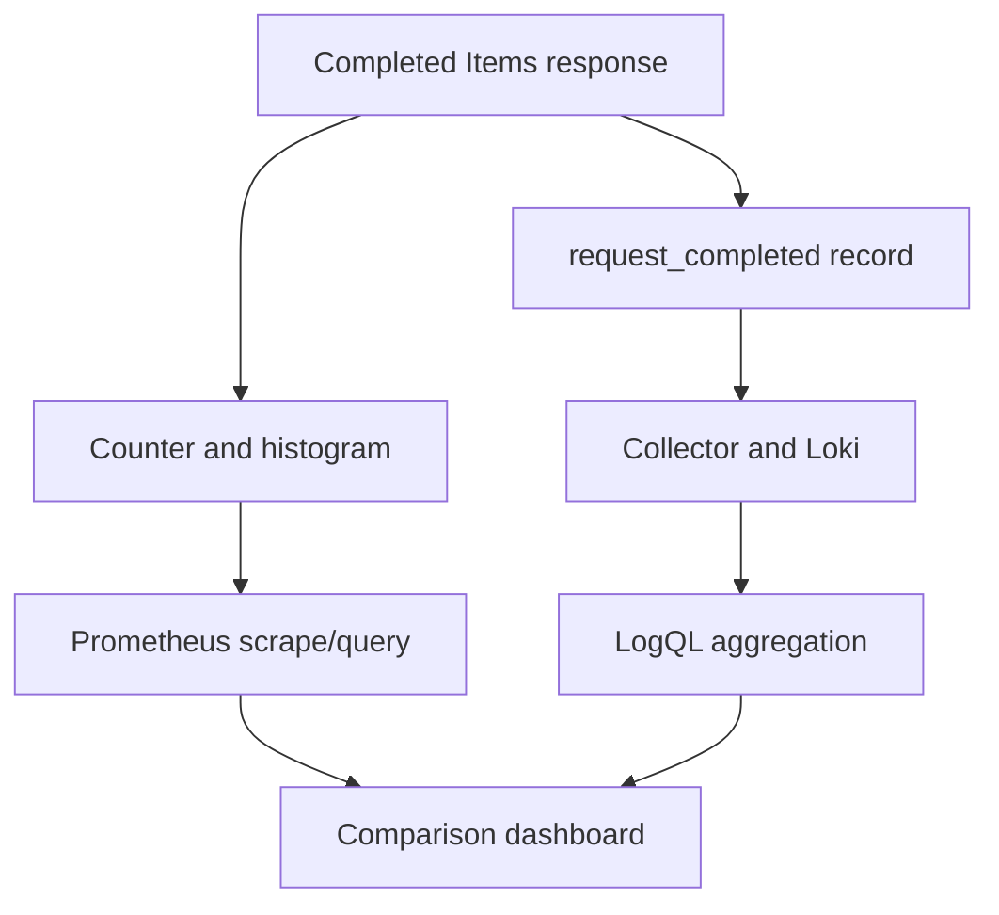

# Lab 30: Metrics from Log Events

## 1. Purpose and Learning Outcomes

**In Plain Language:** You will use request-completion logs to calculate request counts, request rates, and summaries of request duration. You will then compare these results with metrics recorded directly by the application. Both sources describe the application's work, but they collect, store, and select observations differently. By running a known workload and keeping the query evaluation time fixed, you can see those differences clearly. You will also learn why counting all log lines does not give the number of requests.

> **Primary Objective:** Calculate counts, rates and latency summaries from clearly defined groups of log events. Compare them with metrics recorded directly by the application and with the client's independent record of the requests it sent.

One request can produce several log records. Before calculating a metric, decide which event represents the thing you want to count. For example, a request-completion event can represent one completed request, while a separate business-event record describes another part of that same request.

In this lab, you will add LogQL metric queries and a dashboard with eight comparison panels. You will run one isolated workload and compare three sources of evidence: the client's results, the stored log records, and the changes in the application's raw counters. Log-derived results stay in Loki, and application metrics stay in Prometheus. You will not add remote write or send the same metric through a second ingestion path. Log-based alerts begin in Lab 31.

## 2. Starting Point and Lab Map

Open the complete application repository before using this guide. Unless a step says otherwise, run commands in Bash from the repository's top-level folder. Follow the starting checks in order because later commands depend on the helper functions and running services they prepare.

Read each explanation before running its commands. Run one complete code block, check the result, and then continue. In your notebook, save the commands, what happened, why you think it happened, and anything that differed from the expected result.

### Key Terms

| **Term**           | **Explanation**                                                                                                                   |
| ------------------ | --------------------------------------------------------------------------------------------------------------------------------- |
| Log-derived metric | A number calculated from a selected group of log records that are still stored and available to query.                            |
| Unwrap             | Reading a field from a log record and converting its value into a number that a query can count, average, or otherwise summarize. |
| Selection bias     | A misleading result caused by choosing records that do not fairly represent the group you intended to measure.                    |

### Lab Map

The arrows show how the parts connect and where a request can take different paths. Use this map to understand the design. It is not a recording of a request that actually ran.


```mermaid
flowchart TD
    R["Completed Items response"] --> C["Counter and histogram"]
    R --> L["request_completed record"]
    C --> P["Prometheus scrape/query"]
    L --> K["Collector and Loki"]
    K --> Q["LogQL aggregation"]
    P --> G["Comparison dashboard"]
    Q --> G
```

## 3. Guided Walkthrough

### Step 01. Inherited State and Starting Checks

**What You Are Doing:** Load the verified CRUD workload ledger and the query helpers. Keep the application running as the same process so that subtracting its before-and-after raw counters remains a valid comparison.

**Practical Walkthrough:** Load the helpers used to run and check the workload. Confirm that new logs reach Loki before calculating anything from them. Keep the application process stable while comparing raw counters. These checks let you compare the application's measurements and the stored logs for the same controlled set of requests.

Before saving the first counter snapshot, check that new logs reach Loki and that the application process identity is stable. Make sure the workload helper and query helpers use the same run prefix. Otherwise, an apparent mismatch could come from mixing different runs or from a counter reset, rather than from a difference between the two collection paths.

```bash
source lab-notes/session.sh
source lab-notes/evidence.sh
source lab-notes/raw-metrics.sh
source lab-notes/metrics-session.sh
source lab-notes/logs-session.sh
logs_check
start_lab 30
```

Complete [Lab 29](Lab-29.md) first. Continue on the same Linux Docker host, in the same Bash session and repository root. Keep the existing credentials, named volumes and checkpoint item. You still need Docker Compose, Python 3, curl, jq, Git and ripgrep on the host. If any starting check fails, fix it before continuing. The existing eleven services and eight scrape jobs should remain active.

**Understanding the Result:** Restarting the application resets its process counters and makes a simple before-and-after subtraction invalid. A gap in log delivery can also change the log-derived result even when the application counters were updated correctly.

### Step 02. Objectives and Measurement Boundaries

**What You Are Doing:** Separate measurements recorded directly by the application from calculations based on stored logs. Losing a log during delivery does not undo a counter increase that already happened in the application.

**Practical Walkthrough:** Follow the same request through two paths: the application updates its instruments, and it also emits a log that must be transported and stored. The counter can increase even if the log is lost later. If the results disagree, inspect both paths instead of assuming they must always produce identical numbers.

Trace the native metric update and the log-delivery steps separately. Compare the evidence from each path with the client's workload ledger, which records what the client observed. Use that comparison to locate the disagreement. Do not assume that a missing stored log means the application never counted the request.

You will learn how a log count differs from a counter increase, calculate average record rates over a time window, and keep the number of query-label combinations under control. You will also turn log fields into numeric samples, handle cases where traffic or error ratios cannot be determined, and explain why logs add useful evidence alongside explicitly defined application metrics.

The lab map in Section 2 shows this relationship.

A missing log does not necessarily mean a counter increase is missing. A missed metrics scrape does not necessarily mean a stored log event is missing. A failure before either measurement happens may appear in neither source. For the exact-counter-difference experiment, stop other Items clients and load generators. Health probes and metrics scrapes may continue because the middleware excludes those routes from these measurements.

**Understanding the Result:** For each collection path, identify the last step you can prove succeeded. Even when both paths begin with the same request, they may leave different stored evidence.

### Step 03. Define the Derived Metric Contract

**What You Are Doing:** Define which event type, routes, units, and time window each derived metric uses. These choices determine whether you are counting requests, business events, or every log record.

**Practical Walkthrough:** Before writing a query, state which events and routes belong in its result, which units it uses, and how long its window is. Counting completion records measures completed requests. Counting all records also includes separate business events. Keep this definition beside the query so you can check that the result measures what you intended.

Choose the event type and routes before counting records. Completion events describe completed requests; business events may describe other actions within those requests. For duration queries, also state the duration unit and the time-window length. A number can look reasonable while still describing the wrong group of events.

| **Result**         | **Selected Population**                                | **Operation**           | **Limitation**                                                                             |
| ------------------ | ------------------------------------------------------ | ----------------------- | ------------------------------------------------------------------------------------------ |
| Request count      | Items completion records                               | count_over_time         | The stored records may include gaps or duplicates                                          |
| Request rate       | Same                                                   | rate over log range     | An average over the full window, not the speed of a brief traffic burst                    |
| Status counts      | Same, using a limited set of status values             | Count grouped by status | Do not group by IDs that are unique to individual events                                   |
| 5xx fraction       | 5xx responses divided by all completed Items responses | Count ratio             | A RED error ratio; unlike the availability SLI in Lab 25, its total includes 4xx responses |
| Mutation count     | create/update/delete event names                       | Count by event name     | A commit log message is not a durable record proving a database transaction                |
| Duration summaries | Completion duration_ms                                 | unwrap plus aggregation | Missing, duplicated, or rounded stored observations can affect the result                  |

LogQL `rate(log-range)` calculates the number of log entries per second over the selected window. PromQL `rate(counter-range)` estimates how quickly a counter grows, accounts for counter resets, and extrapolates to the window boundaries. The similar names do not mean the functions use the same inputs or method. The [Loki metric-query reference](https://grafana.com/docs/loki/latest/query/metric_queries/) explains aggregations over log records and over numeric values extracted from them.

Three workload cycles produce 24 requests and 33 log records because some requests also produce business-event records. Counting all 33 lines as requests gives the wrong result. A log count already describes a selected time window, so do not treat it as though it were a continuously increasing application counter.

**Understanding the Result:** The records you select determine what belongs in the total used by a ratio. More log records do not automatically mean more requests.

### Step 04. Install the Complete Query Generator

**What You Are Doing:** Generate queries that keep only the labels needed to answer the question. Unique metadata values can create many groups during a query even when they do not enlarge the stored index.

**Practical Walkthrough:** Generate expressions with a clear set of dimensions, or fields used to separate results into groups. Remove extracted IDs with many possible values when the final grouping does not need them. Storing these values as metadata avoids expanding the index, but using them in query groups can still create a large amount of work.

Check which extracted fields remain after aggregation. Remove individual request or event identities from the final grouping when they are unnecessary. Metadata can keep the number of indexed streams under control while still producing many query-result groups if every unique value is retained. Control both what you index and what you group by.

```bash
cat > lab-notes/build_log_metrics.py <<'PYTHON'
import json,re,sys
if len(sys.argv) not in (3,4):raise SystemExit("Usage: build_log_metrics.py SERVICE ENVIRONMENT [PREFIX]")
service,environment=sys.argv[1:3];prefix=sys.argv[3] if len(sys.argv)==4 else None
if prefix and not re.fullmatch(r"loglab-[a-f0-9]{12}",prefix):raise SystemExit("Invalid prefix")
s='{service_name='+json.dumps(service)+',deployment_environment_name='+json.dumps(environment)+'}'
base=s+(' |= '+json.dumps(prefix) if prefix else '')
requests=base+' | event_name="request_completed" | http_route=~'+json.dumps(r'/api/v1/items(/\{item_id\})?')
bounded=requests+' | keep service_name, deployment_environment_name, http_route, http_status_code'
group='service_name, deployment_environment_name'
total=f'sum by ({group}) (count_over_time({bounded} [5m]))'
errors=f'sum by ({group}) (count_over_time({bounded} | http_status_code>=500 | __error__="" [5m]))'
duration=requests+' | keep service_name, deployment_environment_name, http_route, duration_ms | unwrap duration_ms | __error__=""'
mutations=base+' | event_name=~"item_created|item_updated|item_deleted" | keep service_name, deployment_environment_name, event_name'
q={"all_log_count":f'sum(count_over_time({base} [5m]))',"request_count":total,
   "request_rate":f'sum by ({group}) (rate({bounded} [5m]))',
   "request_rate_by_route":f'sum by (http_route) (rate({bounded} [5m]))',
   "status_counts":f'sum by (http_status_code) (count_over_time({bounded} [5m]))',
   "server_error_ratio":f'(({errors} or on ({group}) (0*{total}))/{total}) and on ({group}) ({total}>0)',
   "mutation_counts":f'sum by (event_name) (count_over_time({mutations} [5m]))',
   "p95_ms":f'quantile_over_time(0.95, {duration} [5m]) by ({group})',
   "mean_ms":f'avg_over_time({duration} [5m]) by ({group})',
   "bad_unwrap":f'sum(sum_over_time({requests} | json not_numeric="message" | unwrap not_numeric [5m]))',
   "bad_unwrap_filtered":f'sum(sum_over_time({requests} | json not_numeric="message" | unwrap not_numeric | __error__="" [5m]))'}
print(json.dumps(q,indent=2))
PYTHON
```

**Command Note:** `<<'PYTHON'` writes the following block exactly as shown until the closing `PYTHON`. The quotes prevent Bash from expanding `$variables` inside the file being created. This command creates the file; running the file is a separate step.

The queries select only the two normalized Items routes. Before aggregation, `keep` retains just the fields needed for the result. This stops unique metadata values from creating unnecessary result groups, even though those values have not increased the number of indexed streams.

A missing 5xx count becomes zero only if a real total request count exists; the expression uses `0 * total` for this. Traffic must be greater than zero before the ratio is meaningful. An absent log population must not appear as 100% success. Also check log collection: missing delivery can look like low traffic even when requests are occurring.

Latency queries include every completed Items response, matching the dimensions available in the histogram. Log durations are in milliseconds, while the native histogram uses seconds. Convert the units before comparing the values.

**Understanding the Result:** Keeping the storage index small does not make every query inexpensive. The fields you extract and the groups you create also affect how many results the query must handle.

### Step 05. Install the Exact Raw-Counter Verifier

**What You Are Doing:** Install a verifier that compares raw application counters with the expected workload. It rejects counter resets and series that disappear, because these conditions make a simple exact-difference check invalid.

**Practical Walkthrough:** Install the verifier and read the checks that reject resets and missing series. It subtracts matching raw counter readings taken before and after the workload. It does not estimate activity over a moving window. If a check fails, save the evidence and start again with a valid baseline rather than treating the rejected subtraction as an exact count.

Read the conditions under which the verifier rejects a comparison. Its subtraction is exact only for a controlled interval in the same application process. If a series disappears or a counter resets, keep the failed run's evidence and establish a new baseline. Do not silently replace missing inputs or negative differences with zero.

```bash
cat > lab-notes/verify_metric_ledger.py <<'PYTHON'
import argparse,json,re,math
from collections import Counter
from pathlib import Path
p=argparse.ArgumentParser()
for name in ["before","after","ledger"]:p.add_argument("--"+name,type=Path,required=True)
args=p.parse_args()
line_re=re.compile(r'^([a-zA-Z_:][a-zA-Z0-9_:]*)(?:\{(.*)\})?\s+([^\s]+)(?:\s+\d+)?$')
label_re=re.compile(r'([a-zA-Z_][a-zA-Z0-9_]*)="((?:\\.|[^"\\])*)"')
metrics={"application_http_requests_total","application_http_request_duration_seconds_count","application_items_mutations_total"}
def read(path):
    values={}
    for line in path.read_text().splitlines():
        if line.startswith("#"):continue
        m=line_re.fullmatch(line)
        if not m or m[1] not in metrics:continue
        labels={k:json.loads('"'+v+'"') for k,v in label_re.findall(m[2] or "")}
        if m[1]!="application_items_mutations_total" and labels.get("route") not in {"/api/v1/items","/api/v1/items/{item_id}"}:continue
        value=float(m[3]);assert math.isfinite(value)
        values[(m[1],tuple(sorted(labels.items())))]=value
    return values
before,after=read(args.before),read(args.after);deltas={}
for key in before.keys()|after.keys():
    assert key in after,"Series disappeared"
    value=after[key]-before.get(key,0);assert value>=0,"Counter reset; repeat isolated experiment"
    deltas[key]=value
ledger=[json.loads(line) for line in args.ledger.read_text().splitlines()]
assert ledger and all(r["status"]==r["expected"] and not r["cleanup"] for r in ledger)
statuses=Counter();mutations=Counter();latency=0
for (name,labels),value in deltas.items():
    labels=dict(labels)
    if name=="application_http_requests_total":statuses[labels["status_code"]]+=value
    elif name=="application_items_mutations_total":mutations[labels["operation"]]+=value
    else:latency+=value
mapping={"item_created":"create","item_updated":"update","item_deleted":"delete"}
assert statuses==Counter(str(r["status"]) for r in ledger),statuses
assert mutations==Counter(mapping[r["business_event"]] for r in ledger if r["business_event"]),mutations
assert latency==len(ledger),latency
print(json.dumps({"client_requests":len(ledger),"raw_status_deltas":dict(statuses),"raw_mutation_deltas":dict(mutations),"raw_latency_observations":latency,"population_matches":True},indent=2))
PYTHON
```

The verifier compares raw before-and-after snapshots with the isolated client's ledger. It checks request counts for each status, mutation operations, and the number of histogram observations. It rejects comparisons when a series disappears, a counter decreases, or the selected groups of events do not match.

This test checks exact observed counter differences within one running process. It is separate from Prometheus `increase()`, which estimates growth over a time window and may correctly return a fractional value. That estimate is not an exact transaction ledger. Do not restart or recreate the application between the snapshots.

**Understanding the Result:** When the verifier rejects a comparison, it is telling you that the evidence is not valid for an exact count. It is not telling you that zero activity occurred.

### Step 06. Provision the Comparison Dashboard

**What You Are Doing:** Add dashboard panels that pair a log-derived measurement with a native metric. Give each pair the same question, and keep each source and its units clearly visible so differences are easier to investigate.

**Practical Walkthrough:** Provision the paired panels and make sure each pair answers the same operational question. Match the selected routes and time context, and show the source and units clearly. Remember that logs and native metrics still pass through different collection steps, even when they appear beside each other on a dashboard.

After provisioning, check each panel's data source, unit, labels, and evaluation window. Similar-looking charts should cover the same question, but their labels should still show how each measurement was collected. This helps you distinguish delayed or missing logs from changes in the application's own instruments.

```bash
cat > lab-notes/build_log_dashboard.py <<'PYTHON'
import json,subprocess,sys
from pathlib import Path
from dashboard_factory import panel,save
q=json.loads(subprocess.check_output([sys.executable,"lab-notes/build_log_metrics.py","items-info","local"],text=True))
q={k:v.replace('service_name="items-info"','service_name=~"${service:regex}"').replace('deployment_environment_name="local"','deployment_environment_name=~"${environment:regex}"') for k,v in q.items()}
s='environment=~"${environment:regex}",service=~"${service:regex}"'
r=',route=~'+json.dumps(r'/api/v1/items(/\{item_id\})?')
panels=[]
def loki(title,key,unit,description):
    p=panel(len(panels)+1,title,[(q[key],title)],unit,description)
    ds={"type":"loki","uid":"loki"};p["datasource"]=ds
    p["targets"]=[{"refId":"A","datasource":ds,"expr":q[key],"queryType":"range","editorMode":"code","legendFormat":"{{service_name}} {{event_name}}"}]
    panels.append(p)
def prom(title,query,unit,description):panels.append(panel(len(panels)+1,title,[(query,title)],unit,description))
loki("Items requests/s — logs","request_rate","reqps","Completed Items records over 5m, affected by delivery and schema.")
prom("Items requests/s — direct metrics",f'sum(rate(application_http_requests_total{{job="fastapi",{s}{r}}}[5m]))',"reqps","Counter rate with reset handling and extrapolation.")
loki("Items completions — log count 5m","request_count","short","Retained records; inspect duplication, delay and coverage.")
prom("Items requests — counter increase 5m",f'sum(increase(application_http_requests_total{{job="fastapi",{s}{r}}}[5m]))',"short","Extrapolated increase may be fractional.")
loki("Items duration p95 — log values","p95_ms","ms","Retained duration_ms values rounded by the logger.")
prom("Items duration p95 — histogram",f'1000*histogram_quantile(0.95,sum by (le) (rate(application_http_request_duration_seconds_bucket{{job="fastapi",{s}{r}}}[5m])))',"ms","Bucket interpolation converted from seconds to milliseconds.")
loki("Mutation records — logs 5m","mutation_counts","short","Counts by bounded event name, never by identity.")
prom("Mutation increase — direct metrics",f'sum by (operation) (increase(application_items_mutations_total{{job="fastapi",{s}}}[5m]))',"short","create/update/delete correspond to item_created/item_updated/item_deleted.")
out=Path("config/grafana/learning/dashboards/lab30-log-metrics.json")
save(out,"lab30-log-metrics","Lab 30 — Logs and direct metrics",panels)
d=json.loads(out.read_text());d["templating"]=json.loads(Path("config/grafana/learning/dashboards/lab20-red.json").read_text())["templating"]
d["description"]="Independent observations of the same Items routes. Time windows, rounding, delivery and estimators matter. No duplicate ingestion."
d["links"]=[{"title":"SLO operations","type":"link","url":"/d/lab26-slo","includeVars":True,"keepTime":True,"targetBlank":False}]
out.write_text(json.dumps(d,indent=2)+"\n")
PYTHON
```

```bash
python3 lab-notes/build_log_dashboard.py
chmod 644 config/grafana/learning/dashboards/lab30-log-metrics.json
python3 -m json.tool config/grafana/learning/dashboards/lab30-log-metrics.json > /dev/null
wait_grafana
```

After waiting for the dashboard provider's polling interval, open **Lab 30 — Logs and direct metrics**, UID `lab30-log-metrics`. The four panel pairs compare request rate, request count, p95 duration and mutations. The Loki panels use data source UID `loki`; the direct-metric panels use `prometheus`.

The inherited variables have a limited set of values. They select Loki's service/environment resource labels and the corresponding Prometheus scrape labels. Both sides select the same Items routes. The dashboard's five-minute window can include earlier traffic, so use the unique-prefix experiment below to prove the results for one exact workload.

**Understanding the Result:** Matching the panels' presentation makes comparison easier. It does not remove differences in delivery, sampling, or how each source represents the measurements.

### Step 07. Run and Verify an Isolated Population

**What You Are Doing:** Run one isolated workload and verify its direct measurements and stored log events. If logs arrive late, wait for that same run's records instead of sending more requests.

**Practical Walkthrough:** Run the isolated workload once. Save its client ledger, before-and-after counter snapshots, and expected log identities. If records are delayed, query for the same run again. Confirm that the expected events are present before interpreting either source's time-window calculations.

Keep the workload ledger, raw snapshots, and log identities together. Check the actual response results before querying rates. If logs are still arriving, repeat the query for this run without generating replacement traffic. That keeps the group of requests fixed so the two measurement sources remain comparable.

```bash
api -fsS "$APP_URL/metrics" > "$LAB_DIR/before.prom"
record_change 'run isolated log-versus-counter population' planned
python3 lab-notes/log_workload.py --url "$APP_URL" --out "$LAB_DIR/workload" --cycles 3 \
  > "$LAB_DIR/workload-summary.json"
api -fsS "$APP_URL/metrics" > "$LAB_DIR/after.prom"
record_change 'run isolated log-versus-counter population' completed
PREFIX=$(cat "$LAB_DIR/workload/prefix.txt")
LAST_RID=$(tail -n 1 "$LAB_DIR/workload/client.jsonl" | jq -er '.request_id')
wait_log_request "$LAST_RID" > "$LAB_DIR/final-request-loki.json"
python3 lab-notes/build_log_metrics.py "$LAB_SERVICE" "$LAB_ENVIRONMENT" "$PREFIX" \
  > "$LAB_DIR/log-metric-queries.json"
LOG_START_NS=$(python3 - "$LAB_DIR/workload/start-ns.txt" <<'PYTHON'
import sys
print(int(open(sys.argv[1]).read())-10**9)
PYTHON
)
LOG_END_NS=$(python3 -c 'import time; print(time.time_ns())')
lrange "$LOG_SELECTOR |= \"$PREFIX\"" > "$LAB_DIR/workload-loki.json"
python3 lab-notes/verify_event_ledger.py --ledger "$LAB_DIR/workload/client.jsonl" \
  --logs "$LAB_DIR/workload-loki.json" > "$LAB_DIR/log-population-proof.json"
python3 lab-notes/verify_metric_ledger.py --ledger "$LAB_DIR/workload/client.jsonl" \
  --before "$LAB_DIR/before.prom" --after "$LAB_DIR/after.prom" > "$LAB_DIR/metric-population-proof.json"
cat "$LAB_DIR/log-population-proof.json" "$LAB_DIR/metric-population-proof.json"
```

Before checking the results, predict 24 completion records, 24 histogram observations, three increases for each of create/update/delete, and 33 stored log records in total. Both verification results should report `population_matches: true`.

If logs are still arriving, update `LOG_END_NS`, query the same run prefix again, and rerun only the log verifier. Keep the original counter snapshots and client ledger. A counter mismatch can mean another Items client sent traffic or the application restarted. Save the failed evidence, then repeat the experiment as a new isolated run. Do not adjust the expected counts to make the failed run pass.

**Understanding the Result:** You can compare the evidence reliably when the run identity and selected requests stay fixed. Running the workload again would increase the counters and create additional log records that also need to be accounted for.

### Step 08. Freeze Time and Assert the LogQL Results

**What You Are Doing:** Fix the query evaluation time before checking window-based results. A rate averaged over a full window includes idle time, so it differs from the speed of the short burst when requests were actually being sent.

**Practical Walkthrough:** Save one evaluation timestamp and use the specified five-minute window for every assertion. If all 24 completion records fall inside those 300 seconds, the average rate is 0.08 requests per second. The calculation includes time with no requests, so it is lower than the throughput during the short active burst.

Read the saved evaluation timestamp and reuse it unchanged for count, rate, and duration queries. Confirm that the workload's first and last records both fall inside the selected five-minute interval. If a record is outside the window, a lower count may be correct for that interval. Sending more requests or moving the end time changes the group of records you are trying to verify.

```bash
METRIC_AT=$(python3 -c 'import time; print(time.time_ns())')
printf '%s\n' "$METRIC_AT" > "$LAB_DIR/evaluation-ns.txt"
python3 - "$LAB_DIR/workload/start-ns.txt" "$METRIC_AT" <<'PYTHON'
import sys
age=(int(sys.argv[2])-int(open(sys.argv[1]).read()))/1e9
assert 0<=age<240,"Run too old for the 5m fixture; repeat in a fresh evidence directory"
PYTHON
for name in all_log_count request_count request_rate status_counts mutation_counts server_error_ratio p95_ms mean_ms; do
  lq "$(jq -r --arg key "$name" '.[$key]' "$LAB_DIR/log-metric-queries.json")" "$METRIC_AT" \
    > "$LAB_DIR/log-$name.json"
done
python3 - "$LAB_DIR" <<'PYTHON'
import json,math,sys
from pathlib import Path
p=Path(sys.argv[1])
def result(name):
    data=json.loads((p/f"log-{name}.json").read_text());assert data["status"]=="success"
    return data["data"]["result"]
def one(name):
    values=result(name);assert len(values)==1,(name,values)
    return float(values[0]["value"][1])
assert one("all_log_count")==33 and one("request_count")==24
assert math.isclose(one("request_rate"),24/300,rel_tol=1e-9)
assert one("server_error_ratio")==0
statuses={r["metric"]["http_status_code"]:float(r["value"][1]) for r in result("status_counts")}
assert statuses=={"200":12,"201":3,"204":3,"404":3,"422":3},statuses
mutations={r["metric"]["event_name"]:float(r["value"][1]) for r in result("mutation_counts")}
assert mutations=={"item_created":3,"item_updated":3,"item_deleted":3},mutations
assert one("p95_ms")>=0 and one("mean_ms")>=0
print("Verified 33 records, 24 completions, 0.08 requests/s, bounded status and mutation counts")
PYTHON
```

**Command Note:** `jq --arg` passes a shell value into a JSON query as a string variable, without inserting the value directly into the query text. Where the commands use `-e`, a final result of false or null makes the command return a failure status.

The five-minute average is `24/300=0.08 requests/s`. It includes idle time and does not describe the throughput during the brief request burst. Counting all 33 log lines would use the wrong total because only 24 of them represent completed requests.

Keeping the nanosecond evaluation timestamp fixed prevents later queries from silently using a different window. If you paused too long before fixing the time, create a fresh run. Do not change the window length and keep the old expected rate. A record is included according to its event timestamp and the query's evaluation time, not the time when the command finishes.

**Understanding the Result:** Count the 24 intended completion events rather than all 33 log records. Save the fixed evaluation timestamp with the evidence for your rate assertion so the calculation can be reproduced.

### Step 09. Interpret Unwrapped Durations Correctly

**What You Are Doing:** Read extracted log durations using the units and precision in which they were recorded. A percentile calculated from individual stored log values differs from a percentile estimated using Prometheus histogram buckets.

**Practical Walkthrough:** Convert the recorded duration field into a number and keep its millisecond unit visible. A log quantile uses individual retained values, while a Prometheus histogram quantile estimates a value from buckets that group observations into ranges. Select matching events and convert the units before comparing the two results.

Check that the extracted duration field contains numbers. Keep the values in milliseconds until you explicitly convert them. Log quantiles use individual stored observations; classic histogram quantiles estimate values within bucket ranges. Before investigating a numeric difference, make sure the two queries cover matching events and time intervals.

`unwrap duration_ms` converts the field value in each selected record into a numeric sample. Functions such as `quantile_over_time` and `avg_over_time` then summarize those stored values. The logger records durations in milliseconds rounded to three decimal places, so the log values already have that precision limit.

Prometheus estimates histogram quantiles by interpolating within cumulative buckets. The dashboard multiplies its estimate in seconds by 1,000 to show milliseconds. Even with complete log delivery, the two results can differ because they use different estimation methods, rounding, time boundaries, and scrape extrapolation. Missing or duplicate logs can further distort the log-based estimate.

Do not average the p95 values of separate routes to produce a service-wide p95; those route percentiles do not combine that way. Also keep the SLO's histogram-threshold ratio. A p95 asks about a percentile of the duration distribution, while the SLO ratio asks what fraction of requests finished within 250 ms.

**Understanding the Result:** Logs and histograms store duration information in different forms and with different precision. A difference between their numbers is a reason to inspect the comparison, but it does not automatically prove that either measurement is broken.

### Step 10. Expose a Numeric Error and Recover

**What You Are Doing:** Try converting a nonnumeric field into a number and inspect the resulting error. If you filter out every failed conversion, no usable observations remain. That is different from measuring a duration of zero.

**Practical Walkthrough:** Run the invalid numeric extraction and inspect the error after the unwrap stage. Place the error filter after the conversion that creates the error. A filter before conversion cannot remove an error that has not happened yet. If all values fail, the query has no usable samples from which to calculate a duration.

Inspect errors produced by the unwrap stage and put the filter after that stage, as shown in the commands. A filter before parsing or conversion cannot catch errors created later. If every record is rejected, report that there are no usable duration observations. Do not describe the empty result as zero latency.

```bash
if lq "$(jq -r '.bad_unwrap' "$LAB_DIR/log-metric-queries.json")" "$METRIC_AT" \
  > "$LAB_DIR/bad-unwrap.json" 2> "$LAB_DIR/bad-unwrap-error.txt"; then
  echo 'Unexpected success; confirm matching completion records exist' >&2
  false
else
  cat "$LAB_DIR/bad-unwrap-error.txt"
fi
lq "$(jq -r '.bad_unwrap_filtered' "$LAB_DIR/log-metric-queries.json")" "$METRIC_AT" \
  > "$LAB_DIR/invalid-values-excluded.json"
lq "$(jq -r '.p95_ms' "$LAB_DIR/log-metric-queries.json")" "$METRIC_AT" \
  > "$LAB_DIR/restored-duration-query.json"
```

The incorrect query tries to convert the text `request_completed` into a number. Expect a SampleExtraction or pipeline error. Put the error filter after `unwrap`, because this error is created during numeric conversion, after parsing has already happened.

Filtering out every invalid sample leaves no usable measurement; it does not prove that latency was zero. Recover by selecting the correct numeric field. Filtering malformed data can be reasonable, but also investigate why the producer emitted an unexpected field value or format. A clean-looking aggregate should not hide a broken log schema.

**Understanding the Result:** A record can parse successfully and still fail numeric conversion. If an aggregate disappears, inspect both stages to find where usable observations were lost.

### Step 11. Compare the Three Observation Layers

**What You Are Doing:** Compare the client's ledger, exact raw counter differences, and time-window queries according to what each one measures. Earlier traffic and scrape timing can explain differences even when the instruments are working correctly.

**Practical Walkthrough:** Treat the client ledger, raw counter differences, and fixed-window query results as three separate sources of evidence. State the event types, units, and time scope beside each result. Where they disagree, consider earlier traffic, scrape timing, and delays before logs become available.

Compare the requests attempted by the client, the raw counter differences within the running process, and the fixed-window estimates separately. State which requests and units each result covers. Earlier traffic, scrape boundaries, ingestion delays, and missing stored logs can affect the query results without changing the client's exact record of this controlled run.

```bash
api -fsS --get --data-urlencode \
  'query=sum(increase(application_http_requests_total{job="fastapi",route=~"/api/v1/items(/\\{item_id\\})?"}[5m]))' \
  "$PROM_URL/api/v1/query" > "$LAB_DIR/prometheus-items-increase.json"
capture_app_logs
logs_check
```

The raw snapshots isolate the changes caused by this run. The Prometheus query covers all matching Items traffic in its five-minute window, which may include earlier calls. Prometheus may also not have scraped the latest counters yet. If needed, wait for two successful scrapes, repeat the query, and record its new evaluation time.

Use the same environment and service when comparing all four dashboard pairs. First check whether the event selections and times match. Then check delivery and collection. Finally, consider how the two sources estimate the result. Similar-looking charts are useful supporting evidence, but they do not replace verification against the client's ledger.

The two sources use different labels for the same mutation actions: `create` corresponds to `item_created`, `update` to `item_updated`, and `delete` to `item_deleted`. Match the meaning of the action even when the label text differs.

**Understanding the Result:** The comparison is strongest when both measurements cover matching events and times. Explain any remaining differences using the specific collection or calculation step involved, rather than assuming an entire source is wrong.

### Step 12. Demonstrate Selection Bias without Losing Real Logs

**What You Are Doing:** Deliberately query an incomplete group of records to show how choosing the wrong total produces a misleading result. Then restore the correct query. The stored records stay unchanged throughout this exercise.

**Practical Walkthrough:** Run the deliberately biased selection and inspect how the selected total changes the apparent rate or fraction. Restore the intended group of events and compare the result with the client ledger. Only the query selection changes; the stored logs and the actual request outcomes remain the same.

Start with a small example: two errors among ten completed requests means a 20% error rate. If you first select only the two errors and then calculate the fraction within that group, it appears to be 100%. Find the similar exclusion in the supplied selector. Compare the returned event identities with the complete ledger, then run the original expression again at the same saved evaluation time.

```bash
ORIGINAL_QUERY=$(jq -r '.request_count' "$LAB_DIR/log-metric-queries.json")
ERROR_QUERY="$LOG_SELECTOR |= \"$PREFIX\" | event_name=\"request_completed\" | http_status_code>=400 | __error__=\"\""
lq "sum(count_over_time($ERROR_QUERY [5m]))" "$METRIC_AT" > "$LAB_DIR/client-errors-only.json"
lq "$ORIGINAL_QUERY" "$METRIC_AT" > "$LAB_DIR/restored-completion-count.json"
jq '.data.result[].value[1]' "$LAB_DIR/client-errors-only.json" "$LAB_DIR/restored-completion-count.json"
```

**Expected Result:** The restricted query returns six records, compared with 24 completions in the full selection. Selecting only intentional client errors gives the wrong total for a metric about all traffic. The stored records and direct counters have not changed. Restoring the correct query restores the intended measurement.

Lab 32 covers shipping outages, buffering, retention and cost experiments. Here, you are demonstrating how record selection can distort a result while keeping the collected telemetry intact.

**Understanding the Result:** A query can return a believable number from valid data and still answer the wrong question. Choosing the correct group of events is part of making the metric correct.

## 4. Troubleshooting and Diagnosis

Begin with the first result that differed from your prediction. Save the exact error or symptom and identify which service or command produced it. Use the checks below, make the needed fix, and repeat the original check to confirm the problem is resolved.

### Troubleshooting and Proof of Recovery

| **Symptom**               | **Inspect**                                                           | **Action**                                                                                          |
| ------------------------- | --------------------------------------------------------------------- | --------------------------------------------------------------------------------------------------- |
| 33 requests instead of 24 | Check which event names the query selects                             | Select completion events so that separate business-event records do not count as requests           |
| Log count below ledger    | Check the window, delivery delay, filters and output limit            | Query the same run prefix again and compare event IDs with the ledger                               |
| Many metric result series | Check the dimensions retained from metadata and parsers               | Keep and group by only the useful fields with a limited set of values                               |
| Numeric pipeline error    | Check the selected field and the order of query stages                | Select the numeric field and filter conversion errors after conversion                              |
| Empty error ratio         | Check whether a real total exists and whether log delivery is healthy | Investigate missing traffic or data instead of automatically replacing every empty result with zero |
| Raw counter mismatch      | Check for other traffic or an application reset                       | Save the failed evidence, then repeat the workload as a new isolated run                            |
| Different p95 values      | Check units, estimation methods, timing and delivery                  | Compare matching groups of events and explain how each source estimates p95                         |

```bash
logs_check
api -fsS "$APP_URL/health/ready" > "$LAB_DIR/final-readiness.json"
git diff --check
```

Keep the correct queries and the dashboard. The temporary rows have been deleted, and the storage and index settings are unchanged. The deliberate faults affected only queries, so recovering from them does not require a service restart.

## 5. Review and Practice

Answer the questions in your own words before reading the answers. For the scenario, say what you would inspect and exactly what each result would tell you.

### Knowledge Check

1. Why 33 records for 24 requests?
2. What does 0.08 requests/s represent?
3. Why filter errors after unwrap?
4. Why retain direct instrumentation?

#### Answer Guide

1. Each request produces one completion record, giving 24 completion records. The workload also produces nine mutation records: three each for create, update and delete. Together, these make 33 records for 24 requests.
2. It is the average rate of completion records over the entire five-minute window: 24 divided by 300 seconds. It includes idle time, so it does not show how quickly requests arrived during the brief active burst.
3. Parsing can succeed even when a field cannot be converted into a number. Unwrap creates that conversion error, so a filter must follow unwrap to remove it.
4. Direct instrumentation records metrics with explicitly defined meanings. It does not add the log-schema, log-scanning, and log-delivery dependencies that a log-derived calculation needs. Log-derived results provide additional evidence alongside those instruments.

### Professional Scenario Exercise

A team replaces its error counter with a count of ERROR-level log lines. After a log-level change, the metric shows zero even though users are still receiving 503 responses. Explain why ERROR-level lines do not reliably represent failed user requests. Compare the client outcomes, direct metrics, and stored logs, then restore a metric that measures user outcomes without sending the same metric through a second ingestion path.

## 6. Completion Checklist

Tick an item only when you can show its result or saved evidence. Finish the cleanup instructions before starting the next lab.

### Observable Completion Criteria

- [ ] Each derived metric clearly states which group of events it measures.
- [ ] The setup does not ingest the same metric through an additional path.
- [ ] The client ledger, stored log bodies and raw counter differences agree for the isolated workload.
- [ ] LogQL queries at the fixed evaluation time verify 24 completions, 33 records and 0.08 requests/s.
- [ ] Status and mutation results are grouped without IDs unique to individual events.
- [ ] The numeric conversion failure has been observed, explained and successfully corrected.
- [ ] All eight dashboard panels show real query results and select matching Items routes.

## 7. Production Context and Next Lab

### Production Implications

Log-derived metrics help answer exploratory questions, investigate rare events, and study applications that have few direct instruments. Their results depend on stable log formats, available stored data, and successful delivery. Repeatedly scanning logs can also be expensive. Keep explicitly instrumented RED and SLO metrics as the primary metric source, and use log-derived values as additional evidence.

### End State and Transition

Keep the eleven services, eight scrape jobs, four learning dashboards and enriched log pipeline running. In [Lab 31](Lab-31.md), you will add selected log-based alerts and control unnecessary alerts, query cost and duplicate notifications. The Lab 31 implementation is not part of this lab.
