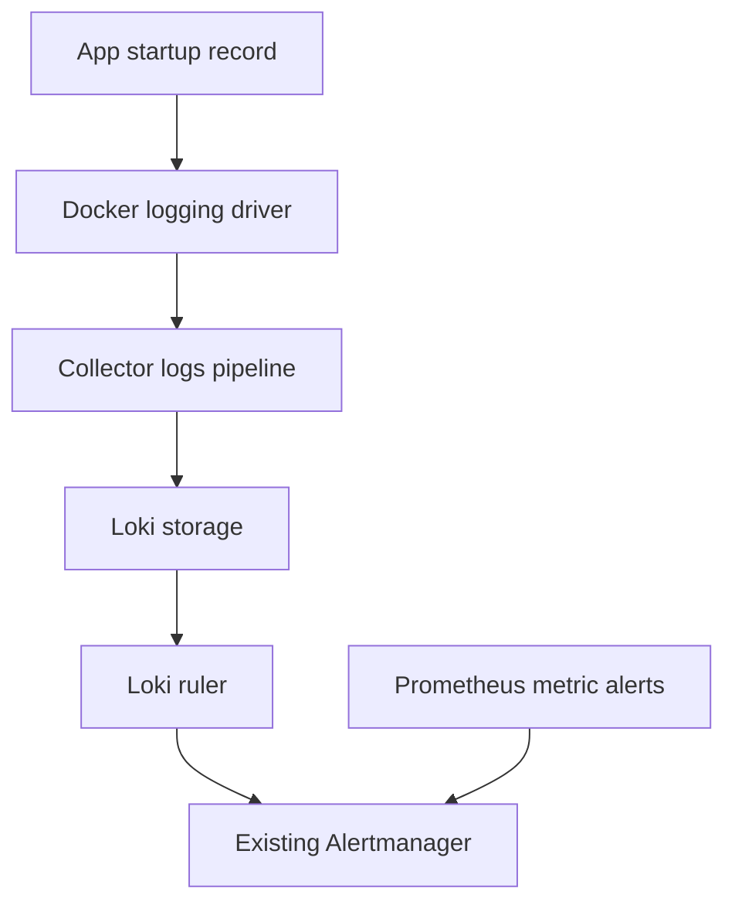

# Lab 31: Log-Based Alerts

## Purpose and Scope

> **Primary Objective:** Create one Loki-owned lifecycle alert, prove its condition and delivery, and avoid duplicate or high-cardinality alert instances.

A log record can describe a significant event that a request-rate graph does not explain: a process starting repeatedly, for example. In this lab Loki evaluates a structured-event query and sends a warning to the existing Alertmanager.

You will deliberately restart only the Items application, preserve PostgreSQL/Redis data, inspect the Loki ruler and Alertmanager separately, and prove that the warning clears. You will not create a second 5xx alert, introduce Grafana-managed alerting, send external notifications, or enable traces yet.

## 1. Inherited State and Starting Checks

Complete [Lab 30](Lab-30.md). The inherited stack has eleven long-running services and eight Prometheus scrape jobs. Loki already receives application JSON through Docker's built-in Fluentd logging driver and the Collector. App tracing and profiling remain disabled. Four learning dashboards should remain provisioned.

Run from the repository root in Bash. Keep other load generators stopped during the restart experiment.

```bash
source lab-notes/session.sh
source lab-notes/evidence.sh
source lab-notes/metrics-session.sh
load_app_settings
start_lab 31
wait_ready
mkdir -p lab-notes/loki-alerts
python3 -m venv lab-notes/.tools
lab-notes/.tools/bin/python -m pip install 'PyYAML==6.0.3'
```

The small host-side virtual environment parses YAML when extending existing configurations. It is not installed into the application image. PyYAML is pinned because these editing commands should not depend on an arbitrary system package.

Install these two operational helpers. They are the only new common helpers in this set of labs; subsequent guides source them instead of repeating the setup.

```bash
cat > lab-notes/platform-session.sh <<'BASH'
# Source after session.sh, evidence.sh and metrics-session.sh, from repository root.
dp() {
  local name
  local -a files=(-f "$LAB_ROOT/docker-compose.yml" -f "$LAB_ROOT/lab-notes/compose.baseline.yaml" -f "$LAB_ROOT/lab-notes/compose.metrics.yaml")
  if [[ -f "$LAB_ROOT/lab-notes/compose.node-exporter.yaml" ]]; then
    LAB_NODE_BIND_IP=$(cat "$LAB_ROOT/lab-notes/node-exporter-address.txt") || return 1
    export LAB_NODE_BIND_IP
    files+=(-f "$LAB_ROOT/lab-notes/compose.node-exporter.yaml")
  fi
  for name in db-exporters grafana alertmanager logs log-alerts traces auto-tracing downstream; do
    if [[ -f "$LAB_ROOT/lab-notes/compose.$name.yaml" ]]; then
      files+=(-f "$LAB_ROOT/lab-notes/compose.$name.yaml")
    fi
  done
  docker compose --project-directory "$LAB_ROOT" --env-file "$LAB_ROOT/.env" "${files[@]}" "$@"
}
# Old request, readiness, Prometheus and Alertmanager helpers use this same stack.
dm() { dp "$@"; }
backend() {
  dp exec -T app python - "$@" < "$LAB_ROOT/lab-notes/backend_api.py"
}
loki_query() { backend loki:3100 /loki/api/v1/query query "$1"; }
log_select() {
  python3 - "$LAB_SERVICE" "$LAB_ENVIRONMENT" <<'PYTHON'
import json, sys
print('{service_name='+json.dumps(sys.argv[1])+',deployment_environment_name='+json.dumps(sys.argv[2])+'}')
PYTHON
}
wait_backend() {
  local address="$1" path="$2" attempt
  for attempt in {1..60}; do
    if backend "$address" "$path" >/dev/null 2>&1; then return 0; fi
    sleep 1
  done
  printf 'Readiness timeout: %s%s\n' "$address" "$path" >&2
  return 1
}
# Read only mounted configuration paths; never print the resolved secret environment.
mounted_config() {
  dp config --format json | python3 -c '
import json, sys
service, target = sys.argv[1:]
matches = [v["source"] for v in json.load(sys.stdin)["services"][service]["volumes"] if v["target"] == target and v["type"] == "bind"]
assert len(matches) == 1, (service, target, "expected one bind mount")
print(matches[0])
' "$1" "$2"
}
BASH
```

```bash
cat > lab-notes/backend_api.py <<'PYTHON'
"""GET a fixed internal backend through the running app container; no extra host ports."""
import json
import sys
import urllib.error
import urllib.parse
import urllib.request

address, path, *pairs = sys.argv[1:]
assert address in {'loki:3100', 'otel-collector:8888', 'otel-collector:13133', 'tempo:3200', 'lab-downstream:8001'}
assert path.startswith('/') and len(pairs) % 2 == 0
query = urllib.parse.urlencode(list(zip(pairs[::2], pairs[1::2])))
url = 'http://' + address + path + ('?' + query if query else '')
request = urllib.request.Request(url, headers={'Accept': 'application/json'})
try:
    with urllib.request.urlopen(request, timeout=15) as response:
        sys.stdout.buffer.write(response.read())
except urllib.error.HTTPError as exc:
    print(f'HTTP {exc.code}', file=sys.stderr)
    print(exc.read().decode(errors='replace')[:2000], file=sys.stderr)
    raise SystemExit(1)
except urllib.error.URLError as exc:
    print(f'Backend unavailable: {type(exc.reason).__name__}', file=sys.stderr)
    raise SystemExit(1)
PYTHON
```

```bash
source lab-notes/platform-session.sh
dp config --quiet
dp ps -a
wait_backend loki:3100 /ready
wait_backend otel-collector:13133 /
api -fsS http://127.0.0.1:9093/-/ready
```

`backend` runs an HTTP GET from the app container to a fixed allowlist of internal services. It neither publishes Loki's port nor forwards application secrets. `mounted_config` prints only a selected bind-mount path; avoid saving full `dp config` output because resolved configuration includes credentials.

## 2. Learning Objectives and Alert Ownership

By completion you should be able to:

- State why a lifecycle event is useful alongside RED metrics.
- Select stable `event_name` values instead of matching a changing English message.
- Distinguish a LogQL result, a pending/firing ruler state, and an Alertmanager alert.
- Explain how a lookback window and `for` interact.
- Keep labels bounded and preserve one owner for each notification condition.



Grafana remains a viewer. Loki owns this log rule; Prometheus owns the existing metric and burn-rate rules. The same condition must not also be installed as a Grafana-managed or Prometheus alert.

## 3. Define the Event Contract and Predict the Result

The rule counts `application_started` records for the selected service/environment. Three or more records in five minutes, continuously qualifying for 30 seconds, produce a warning.

| Choice | Reason and limitation |
|---|---|
| `event_name="application_started"` | Stable semantic field; ordinary requests and changed message text do not match. |
| One service/environment selector | Small, deliberate index scope; no global scan. |
| Three records in five minutes | Easy to demonstrate locally; planned deployments can also match. |
| `for: 30s` | Requires persistence across evaluations; it does not wait for three *additional* starts. |
| Warning severity | Investigate lifecycle changes before concluding there is a crash loop. |
| Aggregate before alerting | Event IDs, request IDs, container names and timestamps do not become alert labels. |

Write a prediction: after three successful starts, when should the rule first qualify, become firing, and clear? Include the 15-second evaluation interval and asynchronous shipping delay. A three-start record count is not proof of three crashes, nor an exactly-once count if transport duplicates records.

## 4. Configure the Loki Ruler Without Replacing Storage

Save the active configuration before adding an overlay. The helper discovers the actual mounted file from the inherited stack, so it preserves the schema, retention and label policy from Labs 27–28.

```bash
ACTIVE_LOKI_CONFIG=$(mounted_config loki /etc/loki/config.yaml)
cp "$ACTIVE_LOKI_CONFIG" "$LAB_DIR/loki-before.yml"
```

```bash
cat > lab-notes/loki-alerts/configure_ruler.py <<'PYTHON'
"""Copy the active Loki config and add one local-file ruler; preserve retention/schema."""
import json
import os
from pathlib import Path
import sys
import yaml

source = Path(sys.argv[1])
config = yaml.safe_load(source.read_text())
config['ruler'] = {
    'storage': {'type': 'local', 'local': {'directory': '/etc/loki/rules'}},
    'rule_path': '/loki/ruler-work',
    'alertmanager_url': 'http://alertmanager:9093',
    'enable_alertmanager_v2': True,
    'enable_api': True,
    'evaluation_interval': '15s',
    'poll_interval': '15s',
    'ring': {'kvstore': {'store': 'inmemory'}},
}
root = Path('lab-notes/loki-alerts')
(root / 'rules/fake').mkdir(parents=True, exist_ok=True)
(root / 'loki.yml').write_text(yaml.safe_dump(config, sort_keys=False))
service, environment = os.environ['LAB_SERVICE'], os.environ['LAB_ENVIRONMENT']
selector = '{service_name='+json.dumps(service)+',deployment_environment_name='+json.dumps(environment)+'}'
expr = 'sum by (service_name, deployment_environment_name) (count_over_time('+selector+' | json event="event_name" | __error__="" | event="application_started" [5m])) >= 3'
rules = {'groups': [{'name':'application-lifecycle', 'interval':'15s', 'rules':[{
    'alert':'ApplicationRestartBurst', 'expr':expr, 'for':'30s',
    'labels':{'severity':'warning', 'team':'platform', 'signal':'logs',
              'service':'{{ $labels.service_name }}', 'environment':'{{ $labels.deployment_environment_name }}'},
    'annotations':{'summary':'Repeated application starts',
                   'description':'At least three application_started records in five minutes. Inspect deployment history and process exit reasons; this is a learning threshold, not a confirmed crash loop.'}
}]}]}
(root / 'rules/fake/lifecycle.yml').write_text(yaml.safe_dump(rules, sort_keys=False))
print(expr)
PYTHON
```

```bash
lab-notes/.tools/bin/python lab-notes/loki-alerts/configure_ruler.py   "$ACTIVE_LOKI_CONFIG" | tee "$LAB_DIR/alert-expression.txt"
```

```bash
cat > lab-notes/compose.log-alerts.yaml <<'YAML'
services:
  loki:
    volumes:
      - ./lab-notes/loki-alerts/loki.yml:/etc/loki/config.yaml:ro
      - ./lab-notes/loki-alerts/rules:/etc/loki/rules:ro
YAML
```

```bash
dp config --quiet
dp run --rm -T --no-deps loki -config.file=/etc/loki/config.yaml -verify-config=true
dp up -d --no-deps --force-recreate loki
wait_backend loki:3100 /ready
dp logs --tail=80 --no-color loki
```

With Loki authentication disabled, the local rule tenant directory is `fake`. The rules mount is read-only; the ruler's working directory is on `/loki`, the existing writable named volume. `enable_api: true` enables the ruler API used to inspect evaluated state. Rules are managed as local files on a read-only mount, and Loki remains accessible only on the Docker network; this lab does not use API-based rule changes.

`alertmanager_url` uses internal service DNS. Alertmanager v2 is selected explicitly. The existing warning receiver accepts alerts locally without credentials; receipt in Alertmanager does not imply an email or Slack notification was sent. Do not change that routing for this experiment.

Configuration validation checks syntax. The next step checks actual rule loading and evaluation.

## 5. Inspect the Loaded Rule and Establish a Negative Control

```bash
backend loki:3100 /prometheus/api/v1/rules > "$LAB_DIR/rules-before.json"
jq '.data.groups[] | {name, rules: [.rules[] | {name, state, health, lastError}]}'   "$LAB_DIR/rules-before.json"
EXPR=$(cat "$LAB_DIR/alert-expression.txt")
loki_query "$EXPR" | tee "$LAB_DIR/query-before.json"
for n in {1..5}; do
  api -fsS "$APP_URL/api/v1/items?limit=1" >/dev/null
done
```

Expected rule health is `ok` with an empty `lastError`. At a quiet starting state the query result is empty, not a synthetic zero, and the alert is inactive. If recent earlier starts already satisfy the window, let them age out before proceeding. Five successful reads should not increase the startup-event count.

The expression filters parsed JSON by `event_name`, removes parser errors, counts a bounded window, then aggregates by the two indexed labels. This prevents one alert instance per record. An empty result can also indicate broken shipping: use a current request canary and backend health before interpreting it as normal operation.

## 6. Run Three Controlled Application Starts

**Prediction checkpoint:** PostgreSQL and Redis remain running. Items remain durable. The app process and its in-memory Prometheus counters restart; liveness briefly disappears. Startup logs are newly emitted, not reconstructed from metrics.

```bash
RESTART_START=$(date -u +%Y-%m-%dT%H:%M:%SZ)
for n in 1 2 3; do
  printf 'Restart %s at %s
' "$n" "$(date -u +%FT%TZ)" | tee -a "$LAB_DIR/restarts.txt"
  dp restart app
  wait_ready || break
  api -fsS "$APP_URL/api/v1/items?limit=1" > "$LAB_DIR/items-after-$n.json"
done
dp logs --since "$RESTART_START" --no-color --no-log-prefix app > "$LAB_DIR/restart-logs.jsonl"
python3 - "$LAB_DIR/restart-logs.jsonl" <<'PYTHON'
import json, sys
rows=[]
for line in open(sys.argv[1]):
    try: row=json.loads(line)
    except json.JSONDecodeError: continue
    if row.get('event_name')=='application_started': rows.append(row)
print({'start_records':len(rows),'unique_event_ids':len({r['event_id'] for r in rows})})
assert len(rows)>=3, 'Investigate startup before interpreting the alert'
PYTHON
```

This is a local lifecycle experiment. Do not run this loop against a shared deployment. Three `application_started` records prove that the application passed its startup path three times; they do not prove an unplanned crash or a user-visible outage of a particular duration.

## 7. Prove Query, Rule State, and Alertmanager Receipt

```bash
for attempt in {1..75}; do
  backend loki:3100 /prometheus/api/v1/alerts > "$LAB_DIR/ruler-alerts.json"
  if jq -e 'any(.data.alerts[]; .labels.alertname=="ApplicationRestartBurst" and .state=="firing")'     "$LAB_DIR/ruler-alerts.json" >/dev/null; then break; fi
  sleep 2
done
jq -e 'any(.data.alerts[]; .labels.alertname=="ApplicationRestartBurst" and .state=="firing")'   "$LAB_DIR/ruler-alerts.json"
loki_query "$EXPR" > "$LAB_DIR/query-firing.json"
for attempt in {1..45}; do
  api -fsS http://127.0.0.1:9093/api/v2/alerts > "$LAB_DIR/alertmanager-alerts.json"
  if jq -e 'any(.[]; .labels.alertname=="ApplicationRestartBurst")'     "$LAB_DIR/alertmanager-alerts.json" >/dev/null; then break; fi
  sleep 1
done
jq -e '[.[] | select(.labels.alertname=="ApplicationRestartBurst")] | length==1'   "$LAB_DIR/alertmanager-alerts.json"
jq '.[] | select(.labels.alertname=="ApplicationRestartBurst") | {labels, status, startsAt}'   "$LAB_DIR/alertmanager-alerts.json"
```

Inspect `service`, `environment`, `severity`, `signal` and `team`; there should be no per-request or per-event labels. A suppressed Alertmanager alert was received but is inhibited or silenced; that differs from a rule failing to evaluate. Do not delete unrelated silences to force your preferred state.

Compare the application's process start metric and Prometheus `up` history with the recorded restart timestamps. `up=1` now does not establish that no restart occurred; a scrape may miss a short gap. Loki supplies the recorded lifecycle evidence.

## 8. Recovery and Proof of Recovery

Stop restarting the app and leave it serving reads. Preserve evidence before the five-minute event window expires. No data-volume cleanup is needed.

```bash
for attempt in {1..180}; do
  backend loki:3100 /prometheus/api/v1/alerts > "$LAB_DIR/ruler-recovery.json"
  if jq -e 'all(.data.alerts[]; .labels.alertname!="ApplicationRestartBurst")'     "$LAB_DIR/ruler-recovery.json" >/dev/null; then break; fi
  sleep 2
done
jq -e 'all(.data.alerts[]; .labels.alertname!="ApplicationRestartBurst")' "$LAB_DIR/ruler-recovery.json"
wait_ready
api -fsS "$APP_URL/api/v1/items?limit=1" > "$LAB_DIR/items-recovered.json"
api -fsS http://127.0.0.1:9093/api/v2/alerts > "$LAB_DIR/alertmanager-recovery.json"
```

The rule clears when fewer than three startup records remain in the window. Alertmanager removal can follow later because rule evaluation and notification delivery are asynchronous. Recheck until the alert is absent; record actual timestamps instead of assuming immediate resolution.

If the ruler configuration prevents Loki from starting, remove only the new overlay and restore the earlier stage:

```bash
# Recovery only: keep the overlay in your evidence directory, not in the active include path.
mv lab-notes/compose.log-alerts.yaml "$LAB_DIR/compose.log-alerts.disabled.yaml"
dp up -d --no-deps --force-recreate loki
wait_backend loki:3100 /ready
```

After diagnosing a mistake, restore the overlay, revalidate, and repeat the proof. The successful end state keeps the rule enabled and inactive.

## 9. Troubleshooting Paths

| Symptom | Check and interpretation |
|---|---|
| Rule file does not appear | Verify the `fake` tenant directory and `/etc/loki/rules` bind mount; inspect Loki startup logs. |
| Rule health is `err` | Read `lastError`; run the exact expression through `loki_query` before changing `for`. |
| Local starts exist but Loki count stays empty | Check shipping, time range, service/environment selector and schema. Restarting the ruler does not repair missing records. |
| Firing in Loki, absent in Alertmanager | Check `alertmanager:9093` networking and Loki notification errors. |
| Alert received but no external message | Expected with local empty receivers; receiving and delivering externally are different stages. |
| One alert per request/event | Inspect final query grouping and labels; aggregate away unbounded fields. |
| Repeated starts caused by operator work | Correlate change records and exit status before calling it an incident. |

Treat [Loki ruler documentation](https://grafana.com/docs/loki/latest/alert/) as the upstream reference. This lab uses the repository's pinned Loki 3.7.7, not an unpinned image upgrade.

## 10. Knowledge Check

1. Why does this warning not prove a crash loop?
2. Does an empty result establish healthy log transport?
3. Why omit event_id from alert labels?
4. What does for add to the five-minute range?

### Answer Guide

1. A planned restart emits the same lifecycle event; inspect exit and change evidence.
2. No. Independently prove a recent record reached Loki.
3. It would create a separate alert identity for each event and defeat grouping.
4. The condition must stay true across evaluations for 30 seconds.

## 11. Professional Scenario Exercise

A release restarts the app three times and pages the team even though users see no errors. Explain what this rule knows, what it does not know, and whether severity, threshold, routing or maintenance policy should change. Do not solve noise by excluding every startup event.

## 12. Lab Notebook Template

Create a notebook in the evidence directory for this run:

```bash
test -e "$LAB_DIR/notebook.md" || printf '# Lab 31 Evidence\n' > "$LAB_DIR/notebook.md"
```

Use these headings and fill them with your predictions, commands, observed results and conclusions:

```markdown
# Lab 31 Evidence

## Starting state and operational question
## Prediction before the change
## Commands and timestamps
## Observed results and source evidence
## Unexpected findings and troubleshooting
## Recovery proof and remaining limitations
```

## 13. Observable Completion Criteria

- [ ] Rule health is ok and the exact event selector is documented.
- [ ] Normal CRUD traffic does not create a startup alert.
- [ ] Three controlled starts produce one bounded firing alert in Alertmanager.
- [ ] Data persists; the app recovers and the rule becomes inactive.
- [ ] No duplicate Grafana/Prometheus rule was added.

## 14. Production Implications

Use a log alert only when its event semantics add actionable information. Query cost grows with selected streams, time range and parse work; keep scope narrow and evaluate at a useful cadence. Duplicate/lost logs limit event-count accuracy. A production policy needs ownership, runbook context, change-aware routing and a retention/delivery contract. Local warning receivers demonstrate plumbing rather than an on-call service.

## 15. End State and Transition

Eleven long-running services and eight scrape jobs remain. One Loki rule is active and currently inactive; the four dashboards and prior Prometheus rules are preserved. [Lab 32](Lab-32.md) breaks shipping deliberately to show why missing alerts or logs cannot automatically be read as healthy behavior.
