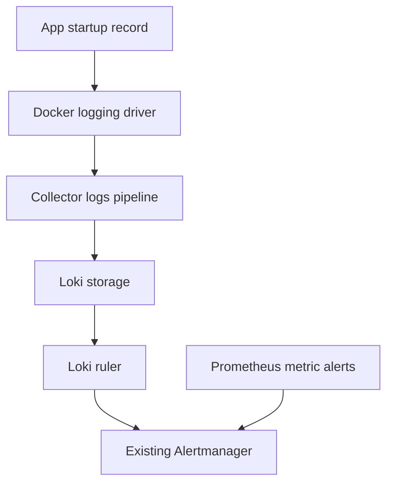

# Lab 31: Log-Based Alerts

## 1. Purpose and Learning Outcomes

You will create an alert for repeated application starts, using lifecycle records that already reach Loki. Check three things separately: the event query, the Loki ruler's alert state, and receipt in Alertmanager. Planned restarts give you a known condition to test. Normal reads act as a negative control: they should work without increasing the number of startup events.

> **Primary Objective:** Create one lifecycle alert evaluated by Loki, prove that its condition occurs and reaches Alertmanager, and avoid duplicate alerts or labels that create a separate alert for every event.

A log can explain an important event that a request-rate graph does not show clearly, such as a process starting repeatedly. In this lab, Loki checks a query for structured startup events and sends a warning to the existing Alertmanager when the condition is met.

You will restart only the Items application and keep the PostgreSQL and Redis data. Check the Loki ruler and Alertmanager separately, then prove that the warning clears. Keep the existing 5xx alert as the only owner of that condition. This lab does not add Grafana-managed alerts, external notifications, or tracing.

## 2. Starting Point and Lab Map

Open the complete application repository before using this guide. Unless a step says otherwise, run commands in Bash from the repository's top-level folder. Follow the starting checks in order because later commands depend on the helper functions and running services they prepare.

Read each explanation before running its commands. Run one complete code block, check the result, and then continue. In your notebook, save the commands, what happened, why you think it happened, and anything that differed from the expected result.

### Key Terms

| **Term**        | **Explanation**                                                                                                    |
| --------------- | ------------------------------------------------------------------------------------------------------------------ |
| Loki ruler      | The part of Loki that regularly evaluates recording rules and alert rules.                                         |
| Lookback window | The recent time interval searched for records that count toward the alert condition.                               |
| Alert ownership | The component responsible for checking a condition and tracking whether its alert is inactive, pending, or firing. |

### Lab Map

The arrows show how the parts connect and where a request can take different paths. Use this map to understand the design. It is not a recording of a request that actually ran.


```mermaid
flowchart TD
    A["App startup record"] --> D["Docker logging driver"]
    D --> C["Collector logs pipeline"]
    C --> L["Loki storage"]
    L --> R["Loki ruler"]
    R --> M["Existing Alertmanager"]
    P["Prometheus metric alerts"] --> M
```

## 3. Guided Walkthrough

### Step 01. Inherited State and Starting Checks

**What You Are Doing:** Load the helpers in the stated order and check the existing eleven services. The helpers must include the active configuration overlays, which add settings to the base stack, so later commands keep earlier lab changes in place.

**Practical Walkthrough:** Source the helper files in the documented order, then inspect the stage-aware `dp` configuration. This wrapper must include the current overlays when it runs service commands. Confirm that all eleven expected services and fresh log delivery work before adding the ruler.

Load the helper dependencies first. Then load the stage-aware wrapper and inspect `dp config` to confirm that it includes the active overlays. This prevents a later service command from accidentally reverting the logging setup. Check the service list and a newly delivered log before investigating any failure as a ruler problem.

Complete [Lab 30](Lab-30.md) first. You should have eleven long-running services, eight Prometheus scrape jobs, and four provisioned learning dashboards. Application JSON logs already travel through Docker's built-in Fluentd logging driver and the Collector into Loki. Keep application tracing and profiling disabled.

Run the commands in Bash from the repository root. Stop other load generators for the restart experiment so their traffic does not complicate your observations.

```bash
source lab-notes/session.sh
source lab-notes/evidence.sh
source lab-notes/metrics-session.sh
load_app_settings
start_lab 31
wait_ready
mkdir -p lab-notes/loki-alerts
python3 -m venv lab-notes/.tools
lab-notes/.tools/bin/python -m pip install 'PyYAML==6.0.3'
```

The small virtual environment on the host provides a YAML parser for extending existing configuration files. It is separate from the application image. The commands pin the PyYAML version so the edits use a known package version instead of whichever version happens to be installed on the host.

Install the following two operational helpers. These are the only new shared helpers in this set of labs. Later guides load them rather than asking you to repeat their setup.

```bash
cat > lab-notes/platform-session.sh <<'BASH'
# Source after session.sh, evidence.sh and metrics-session.sh, from repository root.
dp() {
  local name
  local -a files=(-f "$LAB_ROOT/docker-compose.yml" -f "$LAB_ROOT/lab-notes/compose.baseline.yaml" -f "$LAB_ROOT/lab-notes/compose.metrics.yaml")
  if [[ -f "$LAB_ROOT/lab-notes/compose.node-exporter.yaml" ]]; then
    LAB_NODE_BIND_IP=$(cat "$LAB_ROOT/lab-notes/node-exporter-address.txt") || return 1
    export LAB_NODE_BIND_IP
    files+=(-f "$LAB_ROOT/lab-notes/compose.node-exporter.yaml")
  fi
  for name in db-exporters grafana alertmanager logs log-alerts traces auto-tracing downstream; do
    if [[ -f "$LAB_ROOT/lab-notes/compose.$name.yaml" ]]; then
      files+=(-f "$LAB_ROOT/lab-notes/compose.$name.yaml")
    fi
  done
  docker compose --project-directory "$LAB_ROOT" --env-file "$LAB_ROOT/.env" "${files[@]}" "$@"
}
# Old request, readiness, Prometheus and Alertmanager helpers use this same stack.
dm() { dp "$@"; }
backend() {
  dp exec -T app python - "$@" < "$LAB_ROOT/lab-notes/backend_api.py"
}
loki_query() { backend loki:3100 /loki/api/v1/query query "$1"; }
log_select() {
  python3 - "$LAB_SERVICE" "$LAB_ENVIRONMENT" <<'PYTHON'
import json, sys
print('{service_name='+json.dumps(sys.argv[1])+',deployment_environment_name='+json.dumps(sys.argv[2])+'}')
PYTHON
}
wait_backend() {
  local address="$1" path="$2" attempt
  for attempt in {1..60}; do
    if backend "$address" "$path" >/dev/null 2>&1; then return 0; fi
    sleep 1
  done
  printf 'Readiness timeout: %s%s\n' "$address" "$path" >&2
  return 1
}
# Read only mounted configuration paths; never print the resolved secret environment.
mounted_config() {
  dp config --format json | python3 -c '
import json, sys
service, target = sys.argv[1:]
matches = [v["source"] for v in json.load(sys.stdin)["services"][service]["volumes"] if v["target"] == target and v["type"] == "bind"]
assert len(matches) == 1, (service, target, "expected one bind mount")
print(matches[0])
' "$1" "$2"
}
BASH
```

**Command Note:** `<<'BASH'` writes the following block exactly as shown until the closing `BASH`. Quoting the delimiter prevents Bash from expanding `$variables` inside the file being created. Creating the file and running it are separate actions.

```bash
cat > lab-notes/backend_api.py <<'PYTHON'
"""GET a fixed internal backend through the running app container; no extra host ports."""
import json
import sys
import urllib.error
import urllib.parse
import urllib.request

address, path, *pairs = sys.argv[1:]
assert address in {'loki:3100', 'otel-collector:8888', 'otel-collector:13133', 'tempo:3200', 'lab-downstream:8001'}
assert path.startswith('/') and len(pairs) % 2 == 0
query = urllib.parse.urlencode(list(zip(pairs[::2], pairs[1::2])))
url = 'http://' + address + path + ('?' + query if query else '')
request = urllib.request.Request(url, headers={'Accept': 'application/json'})
try:
    with urllib.request.urlopen(request, timeout=15) as response:
        sys.stdout.buffer.write(response.read())
except urllib.error.HTTPError as exc:
    print(f'HTTP {exc.code}', file=sys.stderr)
    print(exc.read().decode(errors='replace')[:2000], file=sys.stderr)
    raise SystemExit(1)
except urllib.error.URLError as exc:
    print(f'Backend unavailable: {type(exc.reason).__name__}', file=sys.stderr)
    raise SystemExit(1)
PYTHON
```

```bash
source lab-notes/platform-session.sh
dp config --quiet
dp ps -a
wait_backend loki:3100 /ready
wait_backend otel-collector:13133 /
api -fsS http://127.0.0.1:9093/-/ready
```

`backend` sends an HTTP GET from the application container to a fixed list of allowed internal services. It does not publish Loki's port or forward application secrets. `mounted_config` prints only the chosen bind-mount path. Avoid saving the full `dp config` output because its resolved configuration contains credentials.

**Understanding the Result:** The helpers loaded in your shell determine which configuration the commands use. Load the correct files again whenever you open a new terminal.

### Step 02. Learning Objectives and Alert Ownership

**What You Are Doing:** Separate startup-event evidence from request-rate evidence. Loki's ruler evaluates this alert condition. Alertmanager handles the alert after receiving it from Loki.

**Practical Walkthrough:** Follow the startup query through Loki's ruler and then into Alertmanager. HTTP request-rate queries answer a different question. If the warning does not appear, first check whether Loki evaluated and fired the rule, then check whether Alertmanager received it.

Identify which component owns each step: Loki evaluates the log condition, and Alertmanager handles the resulting notifications. Inspect the query result, ruler state, and Alertmanager receipt separately. This lets you locate a missing warning instead of treating every notification problem as a failed query.

By completion you should be able to:

- Explain what lifecycle events tell you that RED metrics alone may not show.
- Select stable `event_name` values instead of searching for English message text that may change.
- Distinguish a LogQL query result, a pending or firing ruler state, and an alert received by Alertmanager.
- Explain how the lookback window selects events and how `for` requires the condition to remain true.
- Use labels with a limited set of values and keep one evaluator responsible for each notification condition.

The lab map in Section 2 shows this relationship.

Grafana continues to display the data. Loki owns this log-based rule, while Prometheus owns the existing metric and burn-rate rules. Do not install another version of this same condition in Grafana or Prometheus, because that would create duplicate alert ownership.

**Understanding the Result:** This lifecycle alert describes startup events that were stored in Loki. It does not directly count every process exit or business failure.

### Step 03. Define the Event Contract and Predict the Result

**What You Are Doing:** Define the startup event, count threshold, lookback window, and required hold time together. Ordinary request-completion records must stay outside this count, even when they have the same service labels.

**Practical Walkthrough:** Read the rule as one complete condition: at least three startup records within five minutes, with the condition remaining true for 30 seconds. Only the specified application-start event counts. A large number of ordinary completion logs must not trigger it.

First select the startup event within the five-minute range, then apply the threshold and hold time. Use normal request-completion traffic to test that unrelated events do not trigger the rule. The service label limits which service is searched; the event filter decides which of that service's records count.

The rule counts `application_started` records for the selected service and environment. It produces a warning when at least three records are present in the five-minute window and that condition stays true for 30 seconds.

| **Choice**                         | **Reason and Limitation**                                                                                                 |
| ---------------------------------- | ------------------------------------------------------------------------------------------------------------------------- |
| `event_name="application_started"` | Selects a stable field with a defined meaning. Normal requests and changes to message wording do not match it.            |
| One service/environment selector   | Limits the search to a small, intentional set of indexed streams instead of scanning everything.                          |
| Three records in five minutes      | Easy to demonstrate locally, but planned deployments can also produce this count.                                         |
| `for: 30s`                         | The condition must remain true across evaluations. It does not require three *additional* starts during those 30 seconds. |
| Warning severity                   | Prompts investigation of lifecycle changes without claiming that a crash loop has been proved.                            |
| Aggregate before alerting          | Combines results so event IDs, request IDs, container names, and timestamps do not create separate alert identities.      |

Write down when you expect the rule to first qualify, start firing, and clear after three successful starts. Account for the 15-second evaluation interval and the delay while logs are delivered. Three startup records do not prove three crashes. If transport duplicates a record, the count may also differ from the actual number of starts.

**Understanding the Result:** The selected event gives the alert its meaning. Startup counts, request volume, and application counter resets describe different things and should be interpreted separately.

### Step 04. Configure the Loki Ruler without Replacing Storage

**What You Are Doing:** Add ruler settings to the Loki configuration file that is actually in use. Keep its existing storage and label policy so the working log-ingestion setup remains intact.

**Practical Walkthrough:** Extend the active Loki configuration with the ruler settings, then validate the whole file and overlay before applying them. A standalone example could point Loki at different storage or remove settings needed by the current ingestion path.

Find the configuration path mounted by the active stack. Preserve its storage, schema, and label settings when generating the extended file. Validate the complete result before starting Loki with it. The change should add rule evaluation to the backend you already verified.

Save the active configuration before adding the overlay. The helper finds the file actually mounted by the inherited stack, allowing it to retain the schema, retention settings, and label policy established in Labs 27–28.

```bash
ACTIVE_LOKI_CONFIG=$(mounted_config loki /etc/loki/config.yaml)
cp "$ACTIVE_LOKI_CONFIG" "$LAB_DIR/loki-before.yml"
```

```bash
cat > lab-notes/loki-alerts/configure_ruler.py <<'PYTHON'
"""Copy the active Loki config and add one local-file ruler; preserve retention/schema."""
import json
import os
from pathlib import Path
import sys
import yaml

source = Path(sys.argv[1])
config = yaml.safe_load(source.read_text())
config['ruler'] = {
    'storage': {'type': 'local', 'local': {'directory': '/etc/loki/rules'}},
    'rule_path': '/loki/ruler-work',
    'alertmanager_url': 'http://alertmanager:9093',
    'enable_alertmanager_v2': True,
    'enable_api': True,
    'evaluation_interval': '15s',
    'poll_interval': '15s',
    'ring': {'kvstore': {'store': 'inmemory'}},
}
root = Path('lab-notes/loki-alerts')
(root / 'rules/fake').mkdir(parents=True, exist_ok=True)
(root / 'loki.yml').write_text(yaml.safe_dump(config, sort_keys=False))
service, environment = os.environ['LAB_SERVICE'], os.environ['LAB_ENVIRONMENT']
selector = '{service_name='+json.dumps(service)+',deployment_environment_name='+json.dumps(environment)+'}'
expr = 'sum by (service_name, deployment_environment_name) (count_over_time('+selector+' | json event="event_name" | __error__="" | event="application_started" [5m])) >= 3'
rules = {'groups': [{'name':'application-lifecycle', 'interval':'15s', 'rules':[{
    'alert':'ApplicationRestartBurst', 'expr':expr, 'for':'30s',
    'labels':{'severity':'warning', 'team':'platform', 'signal':'logs',
              'service':'{{ $labels.service_name }}', 'environment':'{{ $labels.deployment_environment_name }}'},
    'annotations':{'summary':'Repeated application starts',
                   'description':'At least three application_started records in five minutes. Inspect deployment history and process exit reasons; this is a learning threshold, not a confirmed crash loop.'}
}]}]}
(root / 'rules/fake/lifecycle.yml').write_text(yaml.safe_dump(rules, sort_keys=False))
print(expr)
PYTHON
```

```bash
lab-notes/.tools/bin/python lab-notes/loki-alerts/configure_ruler.py   "$ACTIVE_LOKI_CONFIG" | tee "$LAB_DIR/alert-expression.txt"
```

```bash
cat > lab-notes/compose.log-alerts.yaml <<'YAML'
services:
  loki:
    volumes:
      - ./lab-notes/loki-alerts/loki.yml:/etc/loki/config.yaml:ro
      - ./lab-notes/loki-alerts/rules:/etc/loki/rules:ro
YAML
```

```bash
dp config --quiet
dp run --rm -T --no-deps loki -config.file=/etc/loki/config.yaml -verify-config=true
dp up -d --no-deps --force-recreate loki
wait_backend loki:3100 /ready
dp logs --tail=80 --no-color loki
```

With Loki authentication disabled, local rules belong under the tenant directory `fake`. The rules are mounted read-only. The ruler uses `/loki`, the existing writable named volume, for its working files. Setting `enable_api: true` lets you inspect evaluated state through the ruler API. Continue managing rules as local files; this lab does not change them through the API. Loki remains reachable only inside the Docker network.

`alertmanager_url` points to Alertmanager using internal service DNS, and the configuration explicitly selects Alertmanager v2. The existing warning receiver accepts alerts locally without credentials. Receipt in Alertmanager proves that stage of delivery; it does not mean an email or Slack message was sent. Keep the existing routing for this experiment.

Configuration validation checks whether the settings have valid syntax. The next step checks whether the running ruler actually loads and evaluates the rule.

**Understanding the Result:** Edit the file mounted by the active helper, then inspect the running ruler to confirm that it loaded the rule. A valid file alone does not prove runtime evaluation.

### Step 05. Inspect the Loaded Rule and Establish a Negative Control

**What You Are Doing:** Check rule health and send ordinary reads that should not affect the startup count. Let old startup events leave the lookback window before beginning your controlled restart sequence.

**Practical Walkthrough:** Inspect ruler health, then run normal reads as a negative control. These requests should not create startup events. If earlier restarts already satisfy the condition, wait for those events to age out so you can clearly attribute the later result to the planned starts.

Check the loaded rule before sending the control reads. Look for startup events left over from earlier work inside the five-minute window. Wait for them to leave naturally. Otherwise, you could incorrectly blame ordinary reads or the new experiment for an alert caused by earlier starts.

```bash
backend loki:3100 /prometheus/api/v1/rules > "$LAB_DIR/rules-before.json"
jq '.data.groups[] | {name, rules: [.rules[] | {name, state, health, lastError}]}'   "$LAB_DIR/rules-before.json"
EXPR=$(cat "$LAB_DIR/alert-expression.txt")
loki_query "$EXPR" | tee "$LAB_DIR/query-before.json"
for n in {1..5}; do
  api -fsS "$APP_URL/api/v1/items?limit=1" >/dev/null
done
```

The rule should report health `ok` and an empty `lastError`. In a quiet starting state, the query returns an empty result rather than a manufactured zero, and the alert is inactive. Let earlier starts age out if they already satisfy the condition. Five successful reads should leave the startup-event count unchanged.

The query parses JSON, selects `event_name`, removes parser errors, counts records within the window, and groups the result by the two indexed labels. Grouping prevents a separate alert for each record. An empty result can also mean shipping is broken, so verify a fresh request canary and backend health before calling the quiet state normal.

**Understanding the Result:** A rule may already be firing because of valid earlier events. Start from a clean window before deciding whether the control reads changed its state.

### Step 06. Run Three Controlled Application Starts

**What You Are Doing:** Perform the planned application starts while PostgreSQL and Redis keep running. Each restart emits new lifecycle evidence and resets in-memory application counters, but it does not delete durable Items data.

**Practical Walkthrough:** Carry out exactly the documented starts and save their timestamps. Leave PostgreSQL and Redis running. Each new application process should produce a startup record and begin with new in-memory counters. Avoid extra restarts because they would add events to the expected count.

Record each of the three starts and confirm readiness between actions as instructed. Keep the data services running and the checkpoint row intact. This gives the ruler a known set of startup events while deliberately changing only the application's process-local telemetry.

**Prediction Checkpoint:** PostgreSQL and Redis keep running, and the Items data remains stored. The application process and its in-memory Prometheus counters restart, with a brief gap in liveness. Each startup log is a newly emitted record, not an event reconstructed from metrics.

```bash
RESTART_START=$(date -u +%Y-%m-%dT%H:%M:%SZ)
for n in 1 2 3; do
  printf 'Restart %s at %s
' "$n" "$(date -u +%FT%TZ)" | tee -a "$LAB_DIR/restarts.txt"
  dp restart app
  wait_ready || break
  api -fsS "$APP_URL/api/v1/items?limit=1" > "$LAB_DIR/items-after-$n.json"
done
dp logs --since "$RESTART_START" --no-color --no-log-prefix app > "$LAB_DIR/restart-logs.jsonl"
python3 - "$LAB_DIR/restart-logs.jsonl" <<'PYTHON'
import json, sys
rows=[]
for line in open(sys.argv[1]):
    try: row=json.loads(line)
    except json.JSONDecodeError: continue
    if row.get('event_name')=='application_started': rows.append(row)
print({'start_records':len(rows),'unique_event_ids':len({r['event_id'] for r in rows})})
assert len(rows)>=3, 'Investigate startup before interpreting the alert'
PYTHON
```

Run this loop only in the local lab, not against a shared deployment. Three `application_started` records show that the application reached its startup logging point three times. They do not prove unplanned crashes or establish how long users experienced an outage.

**Understanding the Result:** Use the emitted startup records as proof. A successful restart command alone does not prove that the new process reached the point where startup is logged.

### Step 07. Prove Query, Rule State, and Alertmanager Receipt

**What You Are Doing:** Check the event count, ruler state, and Alertmanager receipt independently. Inspect the stable labels and distinguish an alert suppressed after receipt from a rule that failed to evaluate.

**Practical Walkthrough:** Query the stored startup count, inspect whether the rule is pending or firing, and find the alert in Alertmanager. Compare the stable labels at each step. If receipt is confirmed but no notification appears, investigate routing and suppression next.

Save the event count, ruler state, and Alertmanager alert as separate evidence. Match them using the same stable labels. An alert received by Alertmanager can still be inhibited, silenced, or routed in a way that produces no receiver message; those are later steps in the path.

```bash
for attempt in {1..75}; do
  backend loki:3100 /prometheus/api/v1/alerts > "$LAB_DIR/ruler-alerts.json"
  if jq -e 'any(.data.alerts[]; .labels.alertname=="ApplicationRestartBurst" and .state=="firing")'     "$LAB_DIR/ruler-alerts.json" >/dev/null; then break; fi
  sleep 2
done
jq -e 'any(.data.alerts[]; .labels.alertname=="ApplicationRestartBurst" and .state=="firing")'   "$LAB_DIR/ruler-alerts.json"
loki_query "$EXPR" > "$LAB_DIR/query-firing.json"
for attempt in {1..45}; do
  api -fsS http://127.0.0.1:9093/api/v2/alerts > "$LAB_DIR/alertmanager-alerts.json"
  if jq -e 'any(.[]; .labels.alertname=="ApplicationRestartBurst")'     "$LAB_DIR/alertmanager-alerts.json" >/dev/null; then break; fi
  sleep 1
done
jq -e '[.[] | select(.labels.alertname=="ApplicationRestartBurst")] | length==1'   "$LAB_DIR/alertmanager-alerts.json"
jq '.[] | select(.labels.alertname=="ApplicationRestartBurst") | {labels, status, startsAt}'   "$LAB_DIR/alertmanager-alerts.json"
```

Inspect `service`, `environment`, `severity`, `signal` and `team`. Labels unique to individual requests or events should be absent. A suppressed Alertmanager alert has been received but is inhibited or silenced. That is different from failed rule evaluation. Leave unrelated silences in place.

Compare the application's process-start metric and Prometheus `up` history with your recorded restart times. A current value of `up=1` does not prove that no restart occurred: a short gap may fall between scrapes. Loki provides separate evidence through the stored lifecycle events.

**Understanding the Result:** Event count, rule evaluation, Alertmanager receipt, and notification delivery are separate claims. Save evidence for each step that your conclusion relies on.

### Step 08. Recovery and Proof of Recovery

**What You Are Doing:** Stop creating startup events and let older events move outside the lookback window. Check that normal business requests work, and record rule recovery separately from later notification changes.

**Practical Walkthrough:** Leave the application running and let time move the earlier startups outside the window. Continue normal business checks while watching the rule return to inactive. Alertmanager and notification state may update later, so record their timing separately.

Stop generating starts and check business health while the old events age out. Use the documented fallback only if the new configuration prevents recovery, and save its disabled overlay as evidence. Do not infer that every downstream notification state changed at the same moment as the ruler.

Stop restarting the application and leave it serving reads. Save your evidence before the five-minute event window expires. You do not need to delete or clean any data volumes.

```bash
for attempt in {1..180}; do
  backend loki:3100 /prometheus/api/v1/alerts > "$LAB_DIR/ruler-recovery.json"
  if jq -e 'all(.data.alerts[]; .labels.alertname!="ApplicationRestartBurst")'     "$LAB_DIR/ruler-recovery.json" >/dev/null; then break; fi
  sleep 2
done
jq -e 'all(.data.alerts[]; .labels.alertname!="ApplicationRestartBurst")' "$LAB_DIR/ruler-recovery.json"
wait_ready
api -fsS "$APP_URL/api/v1/items?limit=1" > "$LAB_DIR/items-recovered.json"
api -fsS http://127.0.0.1:9093/api/v2/alerts > "$LAB_DIR/alertmanager-recovery.json"
```

The rule clears once fewer than three startup records remain in the window. Removal from Alertmanager can happen later because evaluation and delivery run asynchronously. Recheck until the alert is absent and save the actual timestamps instead of assuming immediate resolution.

If the ruler configuration stops Loki from starting, remove only the new overlay and return to the earlier stage:

```bash
# Recovery only: keep the overlay in your evidence directory, not in the active include path.
mv lab-notes/compose.log-alerts.yaml "$LAB_DIR/compose.log-alerts.disabled.yaml"
dp up -d --no-deps --force-recreate loki
wait_backend loki:3100 /ready
```

After finding and fixing the mistake, restore the overlay, validate again, and repeat the checks. At successful completion, the rule remains enabled but its alert state is inactive.

**Understanding the Result:** The alert recovers when the selected event count drops below the threshold. Historical logs can remain stored; deleting them is unnecessary.

## 4. Troubleshooting and Diagnosis

Begin with the first result that differed from your prediction. Save the exact error or symptom and identify which service or command produced it. Use the checks below, make the needed fix, and repeat the original check to confirm the problem is resolved.

### Troubleshooting Paths

| **Symptom**                                   | **Check and Interpretation**                                                                                                             |
| --------------------------------------------- | ---------------------------------------------------------------------------------------------------------------------------------------- |
| Rule file does not appear                     | Check the `fake` tenant directory and `/etc/loki/rules` bind mount, then inspect Loki's startup logs.                                    |
| Rule health is `err`                          | Read `lastError` and test the exact expression with `loki_query`. Changing `for` does not fix a query error.                             |
| Local starts exist but Loki count stays empty | Check shipping, the time range, the service/environment selector, and the schema. Restarting the ruler will not restore missing records. |
| Firing in Loki, absent in Alertmanager        | Check connectivity to `alertmanager:9093` and look for Loki notification errors.                                                         |
| Alert received but no external message        | This is expected with local empty receivers. External notification is a separate step from Alertmanager receipt.                         |
| One alert per request/event                   | Check the final grouping and labels. Aggregate away fields with unique or unlimited values.                                              |
| Repeated starts caused by operator work       | Compare the starts with change records and exit status before treating them as an incident.                                              |

Use the [Loki ruler documentation](https://grafana.com/docs/loki/latest/alert/) as the upstream reference. This lab keeps the repository's pinned Loki 3.7.7 image; it does not require an image upgrade.

## 5. Review and Practice

Answer the questions in your own words before reading the answers. For the scenario, say what you would inspect and exactly what each result would tell you.

### Knowledge Check

1. Why does this warning not prove a crash loop?
2. Does an empty result establish healthy log transport?
3. Why omit event_id from alert labels?
4. What does for add to the five-minute range?

#### Answer Guide

1. Planned restarts produce the same startup event. Check exit information and change records to decide whether crashes occurred.
2. No. An empty query may mean no matching events or failed delivery. Independently prove that a recent known record reached Loki.
3. A unique event_id would create a different alert identity for each event, preventing the intended grouping into one alert.
4. The selected count must keep satisfying the threshold across evaluations for 30 seconds. The five-minute window chooses the events; the hold time checks that the condition persists.

### Professional Scenario Exercise

A release restarts the application three times and pages the team, although users see no errors. Explain what the startup records prove and what they leave unknown. Decide whether the severity, threshold, routing, or maintenance policy should change, using that evidence. Do not remove all startup events from consideration just to make the alerts quiet.

## 6. Completion Checklist

Tick an item only when you can show its result or saved evidence. Finish the cleanup instructions before starting the next lab.

### Observable Completion Criteria

- [ ] Rule health is ok, and the exact event selector is recorded.
- [ ] Normal CRUD traffic does not trigger the startup alert.
- [ ] Three controlled starts produce one firing alert in Alertmanager with only the intended limited labels.
- [ ] Stored data survives, the application recovers, and the rule returns to inactive.
- [ ] No duplicate rule for this condition was added in Grafana or Prometheus.

## 7. Production Context and Next Lab

### Production Implications

Use a log alert when the selected event gives someone useful information they can act on. Query work grows with the number of selected streams, the time range, and parsing, so keep the scope narrow and the evaluation interval appropriate. Lost or duplicate logs limit count accuracy. A production alert also needs an owner, a runbook, routing that accounts for planned changes, and clear expectations for retention and delivery. The local warning receiver demonstrates the connection between components; it is not a complete on-call service.

### End State and Transition

Keep eleven long-running services, eight scrape jobs, four dashboards, and the earlier Prometheus rules. The new Loki rule stays enabled with an inactive alert state. [Lab 32](Lab-32.md) deliberately breaks shipping to show why absent logs or alerts do not automatically mean the application is healthy.
