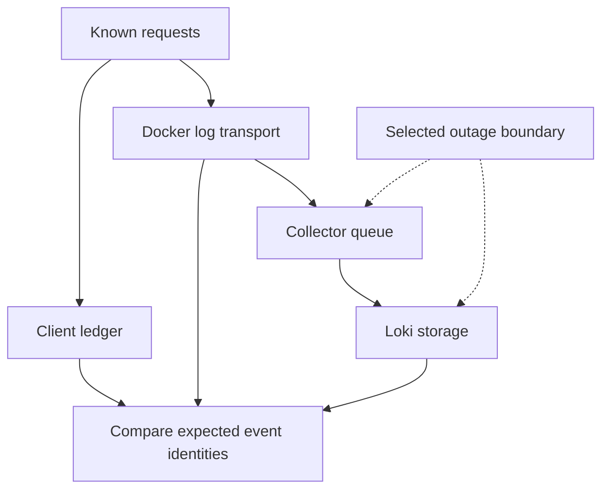

# Lab 32: Log Shipping Failure, Retention, and Cost

## 1. Purpose and Learning Outcomes

**In Plain Language:** You will test two different breaks in log delivery: Loki unavailable while the Collector runs, and the Collector itself unavailable. Keep a client ledger and reconcile record identities after each recovery. This measures what survived each boundary instead of assuming that healthy processes or successful business requests guarantee complete retained logs.

> **Primary Objective:** Measure what the application, Docker driver, Collector and Loki retain during two bounded outages, then reconcile event identities after recovery.

An available application can produce logs that never reach the search backend. Conversely, a healthy Collector process does not prove that its exporter is delivering records.

This lab interrupts Loki first, then the Collector, while sending only twenty read-only requests per experiment. You will inspect finite buffers, compare the same completion events at three observation points, and calculate a transparent storage estimate. You will not fill a disk, delete production logs, shorten retention to destroy existing history, or claim exactly-once delivery.

## 2. Starting Point and Lab Map

Use this guide inside the complete application repository. Run commands from the repository root in Bash unless a step says otherwise. Work through the starting checks in order; they load the helpers and state this lab needs.

Read the explanation before each step, run one complete code block at a time, and compare the actual result with the stated expectation. Save commands, observations, explanations, and unexpected results in your notebook.

### Key Terms

| **Term**       | **Plain-Language Meaning**                                                       |
| -------------- | -------------------------------------------------------------------------------- |
| Buffer         | Finite temporary storage for telemetry waiting to move to the next component.    |
| Reconciliation | Comparing expected and observed identities to find missing or duplicate records. |
| Retention      | How long stored evidence is kept under the backend's policy.                     |

### Lab Map

The arrows show the flow or dependency being studied. Branches identify paths to compare; this is a conceptual map, not a captured runtime trace.



## 3. Guided Walkthrough

### Step 01. Inherited State and Starting Checks

**What You Are Doing:** Start with normal delivery, an inactive restart alert, and no competing workload. Avoid app restarts so the delivery experiments do not also change source-process identity.

**Practical Walkthrough:** Verify normal delivery and an inactive startup alert, then keep the application running throughout the transport faults. Stop unrelated workloads so each twenty-read experiment has a known population. Avoid restarts that would also change counters, logger identity, or lifecycle-alert input.

Keep the app process unchanged and confirm the startup alert is inactive before transport faults. Use exactly the bounded twenty-read population for each experiment. An app restart would introduce new lifecycle events, reset counters, and change buffering state, making the intended transport comparison harder to interpret.

Complete [Lab 31](Lab-31.md) first. Run every command from the repository root in the same Bash session. Retain the credentials, named volumes and existing application checkpoint item. Keep the Lab 31 restart alert inactive. Avoid app restarts and other load during both experiments.

```bash
source lab-notes/session.sh
source lab-notes/evidence.sh
source lab-notes/metrics-session.sh
source lab-notes/platform-session.sh
load_app_settings
start_lab 32
dp config --quiet
dp ps -a
wait_ready
wait_backend loki:3100 /ready
wait_backend otel-collector:13133 /
```

`dp` is the stage-aware Compose helper introduced in Lab 31. It reads the same project and named volumes, adding only the overlays that exist. Use it throughout these labs: running plain `docker compose up` would enable the original full-stack settings instead of the learning stage. `start_lab` creates a fresh evidence directory and sets `LAB_DIR`; keep that directory for this run.

```bash
backend loki:3100 /prometheus/api/v1/alerts > "$LAB_DIR/alerts-before.json"
backend otel-collector:8888 /metrics > "$LAB_DIR/collector-before.prom"
ACTIVE_COLLECTOR_CONFIG=$(mounted_config otel-collector /etc/otelcol-contrib/config.yaml)
ACTIVE_LOKI_CONFIG=$(mounted_config loki /etc/loki/config.yaml)
cp "$ACTIVE_COLLECTOR_CONFIG" "$LAB_DIR/collector-before.yml"
cp "$ACTIVE_LOKI_CONFIG" "$LAB_DIR/loki-before.yml"
```

**Understanding the Result:** A stable source isolates transport behavior. Record its identity before introducing the first downstream outage.

### Step 02. Learning Objectives and Failure Boundaries

**What You Are Doing:** Map what each transport boundary can retain and lose. Application success and telemetry completeness are separate results to measure.

**Practical Walkthrough:** Mark each handoff from app output to Docker buffering, Collector processing, export, and Loki storage. Identify which component can retain pending work at each boundary. Business responses can remain successful while telemetry is delayed or dropped, so collect evidence for both outcomes.

Mark which component has accepted each record at every handoff. A downstream queue cannot protect data that never reached it. Compare business outcomes with telemetry outcomes separately so successful requests remain distinguishable from complete delivery, delayed delivery, and observed loss.

You will distinguish process readiness from delivery, explain what each buffer can lose, compare unique event identities after recovery, and estimate retention cost without treating raw JSON size as compressed disk size.

| **Boundary**                      | **What Can Survive**                                                             | **What Can Still Be Lost**                                                         |
| --------------------------------- | -------------------------------------------------------------------------------- | ---------------------------------------------------------------------------------- |
| App stdout → Docker               | Docker can continue accepting output in non-blocking mode                        | Finite non-blocking buffer overflow; abrupt process/host failure                   |
| Docker Fluentd driver → Collector | Driver retries/asynchronous buffering during a short disconnect                  | Finite driver buffer; daemon restart; connection errors                            |
| Collector → Loki                  | Persistent exporter queue can retain accepted batches                            | Queue full, disk full, retry expiry, records not yet admitted, permanent rejection |
| Loki → local storage              | Accepted records become queryable and persistent under the storage configuration | Single disk/host failure, retention deletion, corruption                           |
| Docker local log cache            | Recent records remain readable through `docker logs`                             | Rotation removes old records; cache is not a replay source for the driver          |

A Collector queue is not the Docker driver buffer. Stopping the Collector prevents it from accepting new records into its queue. This distinction is the core of the second experiment.

**Understanding the Result:** Application availability does not imply complete telemetry delivery. Treat them as separate experiment results.

### Step 03. Inspect the Actual Buffer and Retention Policy

**What You Are Doing:** Inspect actual buffer, queue, retry, and retention settings. State their units: a queued batch is not necessarily one event or one byte.

**Practical Walkthrough:** Inspect the effective buffer capacities, retry duration, queue persistence, and retention settings. Note their units before comparing them: a batch or queued request may contain several records. A finite buffer only protects a bounded backlog under the configured failure conditions.

Read capacities with their configured units: requests, batches, bytes, or records are not interchangeable. Note whether queues persist across process loss and how retries expire. Those limits define a bounded protection window; the presence of a queue alone does not establish lossless shipping.

```bash
dp config --format json | python3 -c '
import json, sys
c=json.load(sys.stdin)
print(json.dumps(c["services"]["app"]["logging"],indent=2))
' > "$LAB_DIR/app-logging-policy.json"
cat "$LAB_DIR/app-logging-policy.json"
lab-notes/.tools/bin/python - "$ACTIVE_COLLECTOR_CONFIG" "$ACTIVE_LOKI_CONFIG" <<'PYTHON'
import sys, yaml, json
c=yaml.safe_load(open(sys.argv[1])); l=yaml.safe_load(open(sys.argv[2]))
print(json.dumps({'log_exporter':c['exporters']['otlp_http/loki'],
                 'file_storage':c['extensions']['file_storage'],
                 'retention':l['limits_config']['retention_period'],
                 'compactor':l['compactor'],
                 'index_policy':l['limits_config']['otlp_config']},indent=2))
PYTHON
```

Record the actual values: asynchronous driver delivery, non-blocking buffer size, driver buffer limit, queue capacity, retry expiry, file-storage directory and Loki retention. Queue capacity is measured in the exporter's configured units—normally queued requests/batches here—not individual JSON lines or megabytes. Record batch sizes as well before estimating capacity.

The inherited Loki policy retains 72 hours with a compactor and structured metadata. Retention requires the compactor to run and deletion is asynchronous. A five-minute lab cannot prove a 72-hour retention cycle; reading configuration is policy evidence, not deletion proof.

**Prediction Checkpoint:** stopping Loki should increase delivery failures or queue occupancy while the Collector stays reachable. Stopping the Collector instead moves pressure toward Docker. Twenty small records may fit comfortably in both cases; absence of loss here does not prove durability under a longer outage.

**Understanding the Result:** Do not convert queue capacity directly into event capacity without knowing batching behavior. Configuration describes limits, not guaranteed survival for every workload.

### Step 04. Install a Bounded Workload and Identity Comparison

**What You Are Doing:** Install a finite read workload and comparison tool using request and event IDs. The ledger provides expected work independently of either log storage location.

**Practical Walkthrough:** Install the finite workload and ID-based verifier before causing an outage. The client ledger establishes expected requests, while local and remote records show different retention boundaries. Keep the same run identity for capture and reconciliation so records from other attempts cannot satisfy the check accidentally.

Install the workload and identity comparison before stopping services. Preserve independent client, local-log, and Loki observations for the same prefix. This makes missing and duplicate records measurable instead of inferring delivery completeness from queue depth, endpoint health, or a few visible sample lines.

The workload performs GET requests only, validates each 200 response and echoed request ID, and writes a client ledger before the next request. It generates no arbitrary item names and deletes nothing.

```bash
cat > lab-notes/bounded_reads.py <<'PYTHON'
"""Twenty read-only requests, fixed timeout and bounded arrival rate; preserve client evidence."""
import json, os, time, urllib.error, urllib.request, uuid
from pathlib import Path
import sys

output = Path(sys.argv[1])
assert not output.exists(), 'Choose a fresh evidence filename'
prefix = 'shipping-' + uuid.uuid4().hex[:12]
url = os.environ.get('APP_URL', 'http://127.0.0.1:8000') + '/api/v1/items?limit=1'
with output.open('x') as stream:
    for number in range(20):
        request_id = f'{prefix}-{number:02}'
        request = urllib.request.Request(url, headers={'X-Request-ID':request_id})
        started = time.time_ns()
        try:
            with urllib.request.urlopen(request, timeout=5) as response:
                status = response.status
                returned = response.headers.get('X-Request-ID')
                response.read()
        except urllib.error.HTTPError as exc:
            status, returned = exc.code, exc.headers.get('X-Request-ID')
        record = {'request_id':request_id, 'status':status, 'returned_id':returned, 'time_ns':started}
        stream.write(json.dumps(record)+'\n'); stream.flush()
        assert status == 200 and returned == request_id, record
        time.sleep(0.2)
print(prefix)
PYTHON
```

**Command Note:** `<<'PYTHON'` writes the following block literally until `PYTHON`. Quoting the delimiter prevents Bash from expanding `$variables` inside the generated file; creation and execution are separate steps.

```bash
cat > lab-notes/compare_shipping.py <<'PYTHON'
"""Compare completion-event identities at client, Docker and Loki; report evidence gaps."""
import collections, json, sys
from pathlib import Path

client = [json.loads(line) for line in Path(sys.argv[1]).read_text().splitlines()]
expected = {r['request_id'] for r in client}
def records(lines):
    output = []
    for line in lines:
        try: row = json.loads(line)
        except json.JSONDecodeError: continue
        if row.get('request_id') in expected and row.get('event_name') == 'request_completed': output.append(row)
    return output
local = records(Path(sys.argv[2]).read_text().splitlines())
response = json.loads(Path(sys.argv[3]).read_text())
assert response['status'] == 'success'
remote = records(v[1] for stream in response['data']['result'] for v in stream['values'])
def summarize(rows):
    counts = collections.Counter(r['request_id'] for r in rows)
    ids = [r['event_id'] for r in rows]
    return {'records':len(rows), 'missing_request_ids':sorted(expected-set(counts)),
            'repeated_request_ids':{k:v for k,v in counts.items() if v>1},
            'unique_event_ids':len(set(ids))}
print(json.dumps({'client_requests':len(client), 'docker':summarize(local), 'loki':summarize(remote),
                  'docker_events_missing_from_loki':sorted({r['event_id'] for r in local}-{r['event_id'] for r in remote}),
                  'same_unique_events':{r['event_id'] for r in local} == {r['event_id'] for r in remote}}, indent=2))
PYTHON
```

The comparison reads `event_id` and `request_id` from the original JSON body. It reports missing and repeated records separately. A set comparison alone would hide duplicates; the report therefore includes raw record counts and unique identities.

**Understanding the Result:** Completeness is a comparison of expected and observed identities. Total line counts alone can hide duplicates and missing records.

### Step 05. Experiment a: Stop Loki While the Collector Runs

**What You Are Doing:** Stop Loki while leaving its upstream Collector running. Record successful requests and export behavior during the outage before restoring the backend.

**Practical Walkthrough:** Stop Loki while leaving Collector and the app active, then run the prescribed twenty reads. Capture response outcomes and exporter queue or retry evidence during the outage. Restore Loki and allow delivery to resume before checking the complete expected record set.

Keep Collector and app running while only Loki is stopped, and record the interval around the twenty reads. Capture exporter failure and queue evidence during the fault. After Loki returns, allow the bounded recovery interval before reconciling identities, since acceptance and eventual backend visibility occur at different times.

```bash
SHIP_START=$(date -u +%Y-%m-%dT%H:%M:%SZ)
# Restores both components if you leave this shell before completing recovery.
trap 'dp start loki otel-collector >/dev/null' EXIT
dp stop loki
api -fsS "$APP_URL/health/live"
api -fsS "$APP_URL/health/ready"
wait_backend otel-collector:13133 /
PREFIX_A=$(python3 lab-notes/bounded_reads.py "$LAB_DIR/client-a.jsonl")
backend otel-collector:8888 /metrics > "$LAB_DIR/collector-loki-down.prom"
dp logs --tail=100 --no-color otel-collector > "$LAB_DIR/collector-loki-down.log"
dp start loki
wait_backend loki:3100 /ready
```

**Command Note:** `trap ... EXIT` schedules cleanup when that shell exits. Keep it in the same block as the fault; the explicit recovery checks afterward confirm that restoration actually succeeded.

**Expected Result:** the client ledger contains twenty successful responses while Loki is unavailable. The Collector health endpoint can still return success. Inspect the exporter logs and its actual exposed metric families:

```bash
rg 'otelcol_exporter_(queue|send_failed|sent|enqueue_failed).*'   "$LAB_DIR/collector-loki-down.prom" | head -n 35
```

A queue gauge may already have drained by the time you capture it; a small workload and short outage can make the peak brief. A failure counter rising does not equal the number of permanently lost records: retried batches can fail multiple attempts. Do not add guessed metric names to alert rules.

**Understanding the Result:** This tests a downstream export interruption. The upstream Collector remains available to exercise its configured buffering behavior.

### Step 06. Reconcile the First Experiment After Recovery

**What You Are Doing:** Compare the entire expected identity set after delivery has had time to recover. A drained queue or one visible record does not establish completeness of the whole run.

**Practical Walkthrough:** Compare every expected identity after the recovery interval, reporting missing and duplicate records explicitly. A queue returning to zero can mean successful delivery or dropped work depending on other evidence. Use backend identity reconciliation to establish what actually arrived.

Compare the full expected identity set with retained local and remote records. Report missing and duplicate entries independently. A queue becoming empty cannot distinguish successful delivery from dropped or expired work without backend evidence showing which records actually arrived.

```bash
SCOPE=$(log_select)
QUERY_A="$SCOPE | json rid="request_id",event="event_name" | __error__="" | rid=~"$PREFIX_A-.*" | event="request_completed""
for attempt in {1..60}; do
  backend loki:3100 /loki/api/v1/query_range query "$QUERY_A" since 30m limit 1000 direction forward     > "$LAB_DIR/loki-a.json"
  if jq -e '[.data.result[].values[]] | length>=20' "$LAB_DIR/loki-a.json" >/dev/null; then break; fi
  sleep 2
done
dp logs --since "$SHIP_START" --no-color --no-log-prefix app > "$LAB_DIR/docker-a.jsonl"
python3 lab-notes/compare_shipping.py "$LAB_DIR/client-a.jsonl" "$LAB_DIR/docker-a.jsonl" "$LAB_DIR/loki-a.json"   | tee "$LAB_DIR/comparison-a.json"
backend otel-collector:8888 /metrics > "$LAB_DIR/collector-after-a.prom"
```

If all layers match, expect twenty client requests, twenty completion records in each source, twenty unique event IDs, and no missing IDs. The script reports evidence instead of silently treating a mismatch as success.

If fewer records arrive, inspect retry time limits, collector errors and clock/time bounds before concluding permanent loss. Save the initial mismatch and repeat the query later; delayed arrival is different from permanent absence. The 30-minute search window must still include the experiment.

**Understanding the Result:** A drained queue and one visible canary are insufficient completeness proofs. Retain the full set comparison.

### Step 07. Experiment B: Stop the Collector

**What You Are Doing:** Stop the Collector to test the earlier Docker-to-Collector boundary. Report measured survival or loss without imposing a delivery guarantee the finite-buffer configuration does not provide.

**Practical Walkthrough:** Stop Collector for the second bounded workload to test the earlier Docker-to-Collector boundary. Keep app requests and the expected identity ledger unchanged in method. After restoring Collector, measure which records survived rather than assuming its downstream queue could protect records it never received.

Use a new fixed prefix for the second twenty-read population and stop only Collector. This tests the earlier handoff before its exporter queue. After restoration, reconcile the same expected IDs rather than assuming downstream buffering protected records the Collector never accepted.

```bash
SHIP_START_B=$(date -u +%Y-%m-%dT%H:%M:%SZ)
dp stop otel-collector
PREFIX_B=$(python3 lab-notes/bounded_reads.py "$LAB_DIR/client-b.jsonl")
api -fsS "$APP_URL/health/ready"
dp logs --since "$SHIP_START_B" --no-color --no-log-prefix app > "$LAB_DIR/docker-b.jsonl"
dp start otel-collector
wait_backend otel-collector:13133 /
QUERY_B="$SCOPE | json rid="request_id",event="event_name" | __error__="" | rid=~"$PREFIX_B-.*" | event="request_completed""
for attempt in {1..60}; do
  backend loki:3100 /loki/api/v1/query_range query "$QUERY_B" since 30m limit 1000 direction forward     > "$LAB_DIR/loki-b.json"
  if jq -e '[.data.result[].values[]] | length>=20' "$LAB_DIR/loki-b.json" >/dev/null; then break; fi
  sleep 2
done
python3 lab-notes/compare_shipping.py "$LAB_DIR/client-b.jsonl" "$LAB_DIR/docker-b.jsonl" "$LAB_DIR/loki-b.json"   | tee "$LAB_DIR/comparison-b.json"
```

There is deliberately no assertion that all twenty records *must* survive this boundary. Record what this Docker version and driver do. The non-blocking configuration favors application availability under telemetry failure; finite buffers create a loss risk.

If recovery yields all twenty records, you demonstrated successful buffering for this small outage. You did not prove that a daemon restart, full buffer, long outage or host power loss preserves them. Do not prolong the outage until the host is unstable just to force a dramatic graph.

**Understanding the Result:** Different outage locations exercise different buffers. Report observed loss or survival without extending it into an unsupported guarantee.

### Step 08. Evaluate Retention, Cardinality, and Cost

**What You Are Doing:** Estimate raw log-body volume separately from measured storage usage. Compression, index data, metadata, and other overhead keep the projection from being a capacity measurement.

**Practical Walkthrough:** Measure raw record-body sizes and project their volume using the documented assumptions. Keep this separate from backend storage usage, which includes compression, metadata, indexes, and other overhead. The projection estimates emitted content, not the exact disk capacity Loki needs.

Measure body bytes and record the event-rate assumptions before projecting daily volume. Keep this emitted-content estimate separate from Loki disk usage, which includes compression and storage overhead. Inspect stream cardinality independently because additional identities can affect indexing cost beyond raw message size.

```bash
SERIES_START=$(python3 -c 'import time; print(time.time_ns()-1800*10**9)')
backend loki:3100 /loki/api/v1/series 'match[]' "$SCOPE" start "$SERIES_START" > "$LAB_DIR/indexed-streams.json"
jq '.data' "$LAB_DIR/indexed-streams.json"
dp exec -T loki /usr/local/bin/busybox du -sk /loki > "$LAB_DIR/loki-disk-kib.txt"
dp exec -T otel-collector /usr/local/bin/busybox du -sk /var/lib/otelcol > "$LAB_DIR/queue-disk-kib.txt"
python3 - "$LAB_DIR/loki-a.json" <<'PYTHON'
import json, sys
rows=[v[1] for stream in json.load(open(sys.argv[1]))['data']['result'] for v in stream['values']]
assert rows, 'Need observed log bodies for this estimate'
average=sum(len(s.encode()) for s in rows)/len(rows)
rate=10
print({'sample_records':len(rows),'mean_body_bytes':round(average,1),
       'hypothetical_records_per_second':rate,
       'raw_body_GiB_per_day':round(average*rate*86400/1024**3,3),
       'raw_body_GiB_for_72h':round(average*rate*86400*3/1024**3,3)})
PYTHON
```

The projection assumes ten records/second and the observed mean body size. It excludes compression, indexes, structured metadata, WAL, compactor work, replication and filesystem overhead. Label it as a raw-body projection, never measured capacity.

`/series` reports indexed streams. Request IDs and event IDs remain metadata/body fields; inspect this policy after changes. More unique indexed combinations mean more streams, generally more index/chunk overhead and poorer compression opportunities. Narrow selectors and shorter investigation windows reduce query work; a broad regex over every stream does the opposite.

No file deletion is part of this exercise. Back up and test a retention-policy change in a separate environment before it can remove irreplaceable history.

**Understanding the Result:** State the measured quantity and assumptions. Raw bytes per event cannot alone determine retained-storage cost.

### Step 09. Recovery and Final Canary

**What You Are Doing:** Send a fresh canary to prove the current path works again. Keep that result distinct from whether every earlier record was recovered.

**Practical Walkthrough:** Send a new canary after all services recover and verify its complete current path. Keep that success separate from reconciliation of earlier outage records. Confirm the normal stage is healthy and retain both experiments' ledgers and transport evidence.

Generate a fresh uniquely identified canary after both services recover and verify it end to end. Then retain the earlier outage reconciliation separately. New delivery proves current functionality; it does not establish that every record from either outage was recovered.

```bash
dp start loki otel-collector
wait_backend loki:3100 /ready
wait_backend otel-collector:13133 /
wait_ready
FINAL_ID="shipping-recovery-$(new_uuid)"
api -fsS -H "X-Request-ID: $FINAL_ID" "$APP_URL/api/v1/items?limit=1" >/dev/null
FINAL_QUERY="$SCOPE | json rid="request_id" | __error__="" | rid="$FINAL_ID""
for attempt in {1..45}; do
  backend loki:3100 /loki/api/v1/query_range query "$FINAL_QUERY" since 5m limit 100     > "$LAB_DIR/recovery-canary.json"
  if jq -e '[.data.result[].values[]]|length>0' "$LAB_DIR/recovery-canary.json" >/dev/null; then break; fi
  sleep 1
done
jq -e '[.data.result[].values[]]|length>0' "$LAB_DIR/recovery-canary.json"
backend loki:3100 /prometheus/api/v1/rules > "$LAB_DIR/rules-recovered.json"
trap - EXIT
```

The current canary proves restored delivery. Reconciliation of the earlier IDs answers the separate question of historical completeness. Preserve both answers, including any unresolved gaps.

**Understanding the Result:** Fresh delivery proves current recovery. Earlier losses remain part of the experiment even when the new canary succeeds.

## 4. Troubleshooting and Diagnosis

Start with the first unexpected result. Record the exact symptom, identify which component produced it, and use the checks below before repeating the experiment. After a fix, repeat the original check and confirm recovery.

### Troubleshooting Paths

| **Evidence**                                  | **Investigate Next**                                                                                     |
| --------------------------------------------- | -------------------------------------------------------------------------------------------------------- |
| App unavailable during Loki outage            | Check app logs and dependencies; a telemetry failure should not gate business readiness.                 |
| Collector healthy, queue rising               | Exporter reachability/rejection and retry logs, not only the health extension.                           |
| Local Docker log exists, Loki record missing  | Upstream buffer loss, collector acceptance, queue/retry expiry, Loki rejection and query bounds.         |
| Client ledger exists, Docker record missing   | Logging middleware, Docker cache rotation and process termination; the client alone cannot locate loss.  |
| Loki record repeats with the same event ID    | Delivery duplication or duplicate ingestion path; compare unique identities before counting occurrences. |
| Queue files remain after recovery             | Persistent storage can retain allocation; a nonempty directory does not imply pending records.           |
| Disk does not shrink after retention interval | Compactor/deletion delay, WAL and active chunks; inspect policy and compactor health.                    |

See the [Docker Fluentd driver](https://docs.docker.com/engine/logging/drivers/fluentd/), [Collector resiliency](https://opentelemetry.io/docs/collector/resiliency/) and [Loki retention](https://grafana.com/docs/loki/latest/operations/storage/retention/) documentation for the relevant boundaries.

## 5. Review and Practice

Answer the knowledge questions in your own words before reading the answer guide. For the scenario, name the evidence you would collect and the conclusion each observation would support.

### Knowledge Check

1. Why can Collector health succeed during a Loki outage?
2. Does Docker logs provide automatic replay after recovery?
3. Does send failure count equal permanently lost events?
4. What does a successful twenty-record test prove?

#### Answer Guide

1. Health reports the process/pipeline endpoint, not successful downstream delivery.
2. No. The local cache is readable evidence, not a driver replay queue.
3. No; retries can count repeated failures of the same batch.
4. Only that this bounded workload survived this observed outage and recovery.

### Professional Scenario Exercise

During an incident you have 200 successful client responses, 200 local completion records and 160 Loki records. Write a timeline and a next-step investigation that distinguishes late arrival, query truncation, duplicated records and permanent loss without blaming the application from one number.

## 6. Completion Checklist

Mark each item only after you can point to its result or evidence file. Complete any cleanup shown here before moving on.

### Observable Completion Criteria

- [ ] Both outages used twenty bounded read-only requests.
- [ ] Client, Docker and Loki identities were compared; gaps and duplicates were preserved as evidence.
- [ ] Actual buffers, retry policy and retention were recorded.
- [ ] Storage estimate states assumptions and does not claim compressed disk capacity.
- [ ] Backends recovered and a new completion record arrived in Loki.

## 7. Production Context and Next Lab

### Production Implications

Persistent queues improve resilience but do not supply end-to-end exactly-once delivery. Monitor queue occupancy, refusal/drop counters, export failures, disk and fresh canary arrival together. Keep retention, ingestion volume, stream cardinality and query cost in one capacity model. The single VM remains one failure domain.

### End State and Transition

Eleven services, eight scrape jobs and the existing dashboards remain; no data was intentionally deleted. The same log pipeline stays active in [Lab 33](Lab-33.md), while a separate OTLP trace pipeline and Tempo are introduced.
