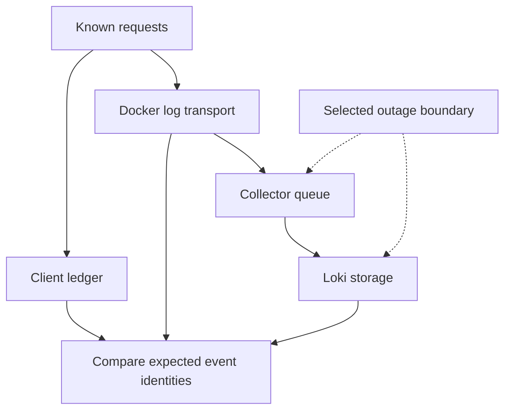

# Lab 32: Log Shipping Failure, Retention, and Cost

## 1. Purpose and Learning Outcomes

You will test two separate failures in log delivery. First, stop Loki while the Collector keeps running. Then stop the Collector itself. Keep an independent client ledger and compare record identities after each recovery. This shows which records survived each handoff, rather than assuming that healthy processes or successful business requests mean all logs were stored.

> **Primary Objective:** Measure which records the application, Docker driver, Collector, and Loki keep during two limited outages. After recovery, compare event identities to find missing or duplicate records.

An application can keep serving requests while its logs fail to reach the search backend. A Collector can also report that its process is healthy even while its exporter cannot deliver records. Check application health and log delivery separately.

You will stop Loki first and the Collector second, sending only twenty read-only requests in each experiment. Inspect the limited buffers, compare the same completion events at three points, and calculate a storage estimate with clear assumptions. The exercise does not fill disks, delete production logs, or shorten retention to remove history. Its results cannot establish exactly-once delivery.

## 2. Starting Point and Lab Map

Open the complete application repository before using this guide. Unless a step says otherwise, run commands in Bash from the repository's top-level folder. Follow the starting checks in order because later commands depend on the helper functions and running services they prepare.

Read each explanation before running its commands. Run one complete code block, check the result, and then continue. In your notebook, save the commands, what happened, why you think it happened, and anything that differed from the expected result.

### Key Terms

| **Term**       | **Explanation**                                                                                                    |
| -------------- | ------------------------------------------------------------------------------------------------------------------ |
| Buffer         | Temporary storage that holds telemetry waiting for the next component. Its capacity is limited.                    |
| Reconciliation | Comparing expected record identities with observed ones to find records that are missing or appear more than once. |
| Retention      | The length of time the backend's policy keeps stored evidence before it is eligible for removal.                   |

### Lab Map

The arrows show how the parts connect and where a request can take different paths. Use this map to understand the design. It is not a recording of a request that actually ran.



## 3. Guided Walkthrough

### Step 01. Inherited State and Starting Checks

**What You Are Doing:** Begin with working log delivery, an inactive startup alert, and no competing workload. Keep the application process running so the tests change the transport path without also changing the source process.

**Practical Walkthrough:** Verify fresh delivery and confirm that the startup alert is inactive. Stop unrelated workloads, then keep the application running throughout both faults. Each experiment should contain the known set of twenty reads. A restart would reset counters, change logger identity, and add lifecycle events.

Record the stable application process and inactive startup alert before stopping downstream services. Use only the prescribed twenty reads in each experiment. Restarting the app would change its counters, lifecycle events, and buffering state at the same time, making the delivery results harder to explain.

Complete [Lab 31](Lab-31.md) first. Run every command from the repository root in the same Bash session. Retain the credentials, named volumes, and checkpoint item. Keep the Lab 31 restart alert inactive, and avoid application restarts or unrelated load during both experiments.

```bash
source lab-notes/session.sh
source lab-notes/evidence.sh
source lab-notes/metrics-session.sh
source lab-notes/platform-session.sh
load_app_settings
start_lab 32
dp config --quiet
dp ps -a
wait_ready
wait_backend loki:3100 /ready
wait_backend otel-collector:13133 /
```

Use `dp`, the stage-aware Compose helper from Lab 31, throughout these labs. It keeps the same project and named volumes and includes only the overlays that exist. Plain `docker compose up` would activate the original full-stack settings instead of this learning stage. `start_lab` creates a new evidence directory and sets `LAB_DIR`; preserve that directory for this run.

```bash
backend loki:3100 /prometheus/api/v1/alerts > "$LAB_DIR/alerts-before.json"
backend otel-collector:8888 /metrics > "$LAB_DIR/collector-before.prom"
ACTIVE_COLLECTOR_CONFIG=$(mounted_config otel-collector /etc/otelcol-contrib/config.yaml)
ACTIVE_LOKI_CONFIG=$(mounted_config loki /etc/loki/config.yaml)
cp "$ACTIVE_COLLECTOR_CONFIG" "$LAB_DIR/collector-before.yml"
cp "$ACTIVE_LOKI_CONFIG" "$LAB_DIR/loki-before.yml"
```

**Understanding the Result:** Keeping the source process unchanged helps isolate transport behavior. Save its identity before the first downstream outage so later comparisons refer to the same process.

### Step 02. Learning Objectives and Failure Boundaries

**What You Are Doing:** Identify what each handoff can store and where records can still be lost. Measure application success separately from the completeness of its telemetry.

**Practical Walkthrough:** Follow a record from application output through Docker's buffers, Collector processing and export, and Loki storage. At each step, identify which component can hold pending work. Requests may still succeed while their logs are delayed or dropped, so record both business and telemetry outcomes.

For each record, ask which component has actually accepted it. A queue farther downstream cannot protect a record that never reached that queue. Compare successful requests with complete, delayed, and missing log delivery as separate results.

You will distinguish process readiness from successful delivery, explain the limits of each buffer, and compare unique event identities after recovery. You will also estimate retention cost while keeping raw JSON size separate from compressed disk usage.

| **Boundary**                      | **What Can Survive**                                                                  | **What Can Still Be Lost**                                                                                 |
| --------------------------------- | ------------------------------------------------------------------------------------- | ---------------------------------------------------------------------------------------------------------- |
| App stdout → Docker               | Docker can keep accepting output in non-blocking mode                                 | Its limited non-blocking buffer can overflow; abrupt process or host failure can also lose records         |
| Docker Fluentd driver → Collector | Retries and asynchronous buffering can cover a short disconnect                       | The driver buffer is finite; daemon restarts and connection errors can still cause loss                    |
| Collector → Loki                  | A persistent exporter queue can keep batches it has accepted                          | Full queues or disks, expired retries, permanent rejection, and records not yet admitted remain loss risks |
| Loki → local storage              | Accepted records become searchable and persist according to the storage configuration | A disk or host failure, retention deletion, or corruption can remove stored evidence                       |
| Docker local log cache            | Recent records remain available through `docker logs`                                 | Rotation removes older records, and the driver does not use this cache to replay them                      |

The Collector's queue and the Docker driver's buffer are different storage points. When the Collector is stopped, it cannot accept new records into its queue. The second experiment tests this earlier handoff and shows why the downstream queue cannot protect every record.

**Understanding the Result:** Application availability and complete telemetry delivery are different outcomes. Report both instead of using successful requests as proof that every log arrived.

### Step 03. Inspect the Actual Buffer and Retention Policy

**What You Are Doing:** Inspect the real buffer, queue, retry, and retention settings. Record their units, because one queued batch can contain many events and has no fixed size in bytes.

**Practical Walkthrough:** Read the effective buffer capacities, retry duration, queue-persistence settings, and retention policy. Check the unit attached to each capacity before comparing them. A queued request or batch can contain several log records, and every finite buffer protects only a limited backlog.

Distinguish limits measured in requests, batches, bytes, or records. Note which queues survive process loss and when retries expire. These details determine how much interruption the setup may absorb. A queue's existence alone does not guarantee lossless delivery.

```bash
dp config --format json | python3 -c '
import json, sys
c=json.load(sys.stdin)
print(json.dumps(c["services"]["app"]["logging"],indent=2))
' > "$LAB_DIR/app-logging-policy.json"
cat "$LAB_DIR/app-logging-policy.json"
lab-notes/.tools/bin/python - "$ACTIVE_COLLECTOR_CONFIG" "$ACTIVE_LOKI_CONFIG" <<'PYTHON'
import sys, yaml, json
c=yaml.safe_load(open(sys.argv[1])); l=yaml.safe_load(open(sys.argv[2]))
print(json.dumps({'log_exporter':c['exporters']['otlp_http/loki'],
                 'file_storage':c['extensions']['file_storage'],
                 'retention':l['limits_config']['retention_period'],
                 'compactor':l['compactor'],
                 'index_policy':l['limits_config']['otlp_config']},indent=2))
PYTHON
```

Record asynchronous driver delivery, the non-blocking buffer size, driver buffer limit, queue capacity, retry expiry, file-storage directory, and Loki retention. The exporter's queue here is normally measured in queued requests or batches, not JSON lines or megabytes. Record batch sizes too before estimating how many events the queue can hold.

The inherited Loki configuration keeps logs for 72 hours and uses a compactor and structured metadata. The compactor must run for retention processing, and deletion happens asynchronously. Reading this configuration proves the intended policy. A five-minute experiment cannot prove that the full 72-hour deletion cycle works.

**Prediction Checkpoint:** With Loki stopped, export failures or queue occupancy should rise while the Collector remains reachable. With the Collector stopped, buffering pressure moves back toward Docker. Twenty small records may fit in both cases. A loss-free short test does not prove that a longer outage would be safe.

**Understanding the Result:** You need to know how records are batched before translating queue capacity into event capacity. Configuration states the limits; it does not guarantee that every possible workload survives them.

### Step 04. Install a Bounded Workload and Identity Comparison

**What You Are Doing:** Install a fixed-size read workload and a comparison tool that uses request and event IDs. The client's ledger defines the expected requests independently of either log-storage location.

**Practical Walkthrough:** Install the workload and ID-based verifier before stopping a service. The client ledger records expected requests, while local and remote logs show what reached each storage point. Use the same run identity when capturing and comparing records so another run cannot accidentally satisfy the check.

Prepare the workload and comparison tools first. Save the client ledger, local Docker logs, and Loki records for the same prefix. Comparing identities can reveal both missing and duplicate records, which endpoint health, queue depth, or a few sample lines cannot prove on their own.

The workload sends only GET requests. It checks each 200 response and echoed request ID, then writes the result to the client ledger before sending the next request. It does not generate arbitrary item names or delete any items.

```bash
cat > lab-notes/bounded_reads.py <<'PYTHON'
"""Twenty read-only requests, fixed timeout and bounded arrival rate; preserve client evidence."""
import json, os, time, urllib.error, urllib.request, uuid
from pathlib import Path
import sys

output = Path(sys.argv[1])
assert not output.exists(), 'Choose a fresh evidence filename'
prefix = 'shipping-' + uuid.uuid4().hex[:12]
url = os.environ.get('APP_URL', 'http://127.0.0.1:8000') + '/api/v1/items?limit=1'
with output.open('x') as stream:
    for number in range(20):
        request_id = f'{prefix}-{number:02}'
        request = urllib.request.Request(url, headers={'X-Request-ID':request_id})
        started = time.time_ns()
        try:
            with urllib.request.urlopen(request, timeout=5) as response:
                status = response.status
                returned = response.headers.get('X-Request-ID')
                response.read()
        except urllib.error.HTTPError as exc:
            status, returned = exc.code, exc.headers.get('X-Request-ID')
        record = {'request_id':request_id, 'status':status, 'returned_id':returned, 'time_ns':started}
        stream.write(json.dumps(record)+'\n'); stream.flush()
        assert status == 200 and returned == request_id, record
        time.sleep(0.2)
print(prefix)
PYTHON
```

**Command Note:** `<<'PYTHON'` writes the following block exactly as shown until the closing `PYTHON`. The quotes prevent Bash from expanding `$variables` inside the file. Writing the file does not execute it; execution is a separate step.

```bash
cat > lab-notes/compare_shipping.py <<'PYTHON'
"""Compare completion-event identities at client, Docker and Loki; report evidence gaps."""
import collections, json, sys
from pathlib import Path

client = [json.loads(line) for line in Path(sys.argv[1]).read_text().splitlines()]
expected = {r['request_id'] for r in client}
def records(lines):
    output = []
    for line in lines:
        try: row = json.loads(line)
        except json.JSONDecodeError: continue
        if row.get('request_id') in expected and row.get('event_name') == 'request_completed': output.append(row)
    return output
local = records(Path(sys.argv[2]).read_text().splitlines())
response = json.loads(Path(sys.argv[3]).read_text())
assert response['status'] == 'success'
remote = records(v[1] for stream in response['data']['result'] for v in stream['values'])
def summarize(rows):
    counts = collections.Counter(r['request_id'] for r in rows)
    ids = [r['event_id'] for r in rows]
    return {'records':len(rows), 'missing_request_ids':sorted(expected-set(counts)),
            'repeated_request_ids':{k:v for k,v in counts.items() if v>1},
            'unique_event_ids':len(set(ids))}
print(json.dumps({'client_requests':len(client), 'docker':summarize(local), 'loki':summarize(remote),
                  'docker_events_missing_from_loki':sorted({r['event_id'] for r in local}-{r['event_id'] for r in remote}),
                  'same_unique_events':{r['event_id'] for r in local} == {r['event_id'] for r in remote}}, indent=2))
PYTHON
```

The comparison reads `event_id` and `request_id` from each original JSON body. It reports missing records separately from repeated records. Comparing only sets would hide duplicates, so the report includes both total record counts and unique identities.

**Understanding the Result:** To prove completeness, compare which identities were expected with which were observed. Equal line counts can still hide a missing record that has been replaced by a duplicate of another record.

### Step 05. Experiment a: Stop Loki While the Collector Runs

**What You Are Doing:** Stop Loki while its upstream Collector stays running. Record request success and exporter behavior during the outage, then restore Loki.

**Practical Walkthrough:** Leave the application and Collector active, stop only Loki, and send the prescribed twenty reads. Save the response results and any queue or retry evidence while the fault is active. Restore Loki and allow delivery to resume before checking all expected identities.

Record the outage interval around the twenty reads. While Loki is stopped, capture export failures and queue behavior. After it returns, allow the specified recovery interval before comparing identities. A record can be accepted upstream before it becomes visible in a backend query.

```bash
SHIP_START=$(date -u +%Y-%m-%dT%H:%M:%SZ)
# Restores both components if you leave this shell before completing recovery.
trap 'dp start loki otel-collector >/dev/null' EXIT
dp stop loki
api -fsS "$APP_URL/health/live"
api -fsS "$APP_URL/health/ready"
wait_backend otel-collector:13133 /
PREFIX_A=$(python3 lab-notes/bounded_reads.py "$LAB_DIR/client-a.jsonl")
backend otel-collector:8888 /metrics > "$LAB_DIR/collector-loki-down.prom"
dp logs --tail=100 --no-color otel-collector > "$LAB_DIR/collector-loki-down.log"
dp start loki
wait_backend loki:3100 /ready
```

**Command Note:** `trap ... EXIT` schedules cleanup when the current shell exits. Keep it in the same block as the fault. The explicit recovery checks afterward confirm that the services actually returned to a working state.

**Expected Result:** The client ledger shows twenty successful responses during the Loki outage. The Collector health endpoint may still report success. Inspect its exporter logs and the metric families it actually exposes:

```bash
rg 'otelcol_exporter_(queue|send_failed|sent|enqueue_failed).*'   "$LAB_DIR/collector-loki-down.prom" | head -n 35
```

The queue may drain before you capture its gauge, especially with a small workload and short outage. A rising failure counter does not directly count permanently lost records: the same batch can fail several retry attempts. Use the observed metric names instead of inventing names for alert rules.

**Understanding the Result:** This experiment interrupts export to the downstream backend. The Collector stays available, so records can exercise its configured buffering and retry behavior.

### Step 06. Reconcile the First Experiment After Recovery

**What You Are Doing:** After allowing recovery time, compare every expected identity. An empty queue or one visible record does not prove that the whole run reached Loki.

**Practical Walkthrough:** Compare the complete expected set and report missing and duplicate records separately. A queue can reach zero after successful delivery, dropped work, or expired retries. Use the backend records to determine which events actually arrived.

Match all expected identities against both local and remote retained records. Save missing and repeated entries as separate findings. Queue emptiness describes current backlog, while the identity comparison shows whether the intended records were delivered.

```bash
SCOPE=$(log_select)
QUERY_A="$SCOPE | json rid="request_id",event="event_name" | __error__="" | rid=~"$PREFIX_A-.*" | event="request_completed""
for attempt in {1..60}; do
  backend loki:3100 /loki/api/v1/query_range query "$QUERY_A" since 30m limit 1000 direction forward     > "$LAB_DIR/loki-a.json"
  if jq -e '[.data.result[].values[]] | length>=20' "$LAB_DIR/loki-a.json" >/dev/null; then break; fi
  sleep 2
done
dp logs --since "$SHIP_START" --no-color --no-log-prefix app > "$LAB_DIR/docker-a.jsonl"
python3 lab-notes/compare_shipping.py "$LAB_DIR/client-a.jsonl" "$LAB_DIR/docker-a.jsonl" "$LAB_DIR/loki-a.json"   | tee "$LAB_DIR/comparison-a.json"
backend otel-collector:8888 /metrics > "$LAB_DIR/collector-after-a.prom"
```

If the layers agree, expect twenty client requests, twenty completion records in each log source, twenty unique event IDs, and no missing IDs. The script reports the evidence and any mismatch rather than quietly treating incomplete delivery as success.

If records are missing, first inspect retry limits, Collector errors, and clock or query-window boundaries. Save the first mismatch and query again later to distinguish delayed arrival from continued absence. Ensure that the 30-minute search window still contains the experiment before interpreting the result as loss.

**Understanding the Result:** Keep the full identity comparison as your completeness evidence. A drained queue and a single successful canary cannot establish that every record from the run arrived.

### Step 07. Experiment B: Stop the Collector

**What You Are Doing:** Stop the Collector to test the earlier Docker-to-Collector handoff. Measure which records survive without assuming that limited buffers guarantee delivery.

**Practical Walkthrough:** Use the same workload method and independent ledger, but stop the Collector for this second experiment. After restoring it, compare the expected and observed records. Its downstream exporter queue could not hold records that the stopped Collector never received.

Choose a new fixed prefix for the second group of twenty reads and stop only the Collector. After recovery, compare the identities belonging to that same run. This isolates the handoff before the exporter queue and avoids confusing new traffic with recovered records.

```bash
SHIP_START_B=$(date -u +%Y-%m-%dT%H:%M:%SZ)
dp stop otel-collector
PREFIX_B=$(python3 lab-notes/bounded_reads.py "$LAB_DIR/client-b.jsonl")
api -fsS "$APP_URL/health/ready"
dp logs --since "$SHIP_START_B" --no-color --no-log-prefix app > "$LAB_DIR/docker-b.jsonl"
dp start otel-collector
wait_backend otel-collector:13133 /
QUERY_B="$SCOPE | json rid="request_id",event="event_name" | __error__="" | rid=~"$PREFIX_B-.*" | event="request_completed""
for attempt in {1..60}; do
  backend loki:3100 /loki/api/v1/query_range query "$QUERY_B" since 30m limit 1000 direction forward     > "$LAB_DIR/loki-b.json"
  if jq -e '[.data.result[].values[]] | length>=20' "$LAB_DIR/loki-b.json" >/dev/null; then break; fi
  sleep 2
done
python3 lab-notes/compare_shipping.py "$LAB_DIR/client-b.jsonl" "$LAB_DIR/docker-b.jsonl" "$LAB_DIR/loki-b.json"   | tee "$LAB_DIR/comparison-b.json"
```

The lab deliberately does not require all twenty records to survive this handoff. Record what your Docker version and driver actually do. Non-blocking logging helps keep the application available during a telemetry failure, but its finite buffers can still lose records.

If all twenty records arrive, you have shown successful buffering for this small outage. That result does not cover a daemon restart, full buffer, prolonged outage, or host power loss. Keep the experiment bounded rather than extending it until the host becomes unstable.

**Understanding the Result:** Stopping different components tests different buffers. Report the observed survival or loss and the conditions of the test, without turning a small experiment into a broad delivery guarantee.

### Step 08. Evaluate Retention, Cardinality, and Cost

**What You Are Doing:** Estimate the volume of raw log bodies separately from measured storage usage. Compression, indexes, metadata, and other overhead mean these quantities will differ.

**Practical Walkthrough:** Measure the size of the record bodies and project their volume using the stated assumptions. Loki's actual disk use also depends on compression and storage structures. Label the calculation as an estimate of emitted content, not the exact disk capacity the backend requires.

Record the measured body size and assumed event rate before calculating daily volume. Inspect the number of indexed streams separately, because stream identities can increase storage and indexing costs even when individual messages stay the same size.

```bash
SERIES_START=$(python3 -c 'import time; print(time.time_ns()-1800*10**9)')
backend loki:3100 /loki/api/v1/series 'match[]' "$SCOPE" start "$SERIES_START" > "$LAB_DIR/indexed-streams.json"
jq '.data' "$LAB_DIR/indexed-streams.json"
dp exec -T loki /usr/local/bin/busybox du -sk /loki > "$LAB_DIR/loki-disk-kib.txt"
dp exec -T otel-collector /usr/local/bin/busybox du -sk /var/lib/otelcol > "$LAB_DIR/queue-disk-kib.txt"
python3 - "$LAB_DIR/loki-a.json" <<'PYTHON'
import json, sys
rows=[v[1] for stream in json.load(open(sys.argv[1]))['data']['result'] for v in stream['values']]
assert rows, 'Need observed log bodies for this estimate'
average=sum(len(s.encode()) for s in rows)/len(rows)
rate=10
print({'sample_records':len(rows),'mean_body_bytes':round(average,1),
       'hypothetical_records_per_second':rate,
       'raw_body_GiB_per_day':round(average*rate*86400/1024**3,3),
       'raw_body_GiB_for_72h':round(average*rate*86400*3/1024**3,3)})
PYTHON
```

The calculation assumes ten records per second and uses the observed mean body size. It excludes compression, indexes, structured metadata, WAL, compactor work, replication, and filesystem overhead. Describe it as a projection of raw log-body volume, not a measured storage-capacity requirement.

`/series` reports indexed streams. Check that request IDs and event IDs remain metadata or body fields after any changes. More unique indexed label combinations create more streams, usually adding index and chunk overhead and reducing compression opportunities. Narrow selectors and shorter investigation windows reduce query work; a broad regex across every stream increases it.

This exercise does not delete files. Before a retention-policy change can remove irreplaceable history, back up the data and test the change in a separate environment.

**Understanding the Result:** State exactly what you measured and which assumptions you used. Raw bytes per event are only one input to the cost of keeping logs.

### Step 09. Recovery and Final Canary

**What You Are Doing:** Send a fresh, identifiable canary to prove the current delivery path works again. Keep this result separate from the question of whether every earlier outage record was recovered.

**Practical Walkthrough:** Once both services recover, send a new canary and find it at the end of the delivery path. Confirm normal stage health and preserve both experiments' ledgers and transport evidence. A successful new record does not resolve any gaps found in the earlier runs.

Use a fresh unique identity for the final canary and verify its delivery end to end. Retain the earlier reconciliation reports separately. Current delivery proves that the path works now; only the earlier ID comparisons can show what happened to records created during the outages.

```bash
dp start loki otel-collector
wait_backend loki:3100 /ready
wait_backend otel-collector:13133 /
wait_ready
FINAL_ID="shipping-recovery-$(new_uuid)"
api -fsS -H "X-Request-ID: $FINAL_ID" "$APP_URL/api/v1/items?limit=1" >/dev/null
FINAL_QUERY="$SCOPE | json rid="request_id" | __error__="" | rid="$FINAL_ID""
for attempt in {1..45}; do
  backend loki:3100 /loki/api/v1/query_range query "$FINAL_QUERY" since 5m limit 100     > "$LAB_DIR/recovery-canary.json"
  if jq -e '[.data.result[].values[]]|length>0' "$LAB_DIR/recovery-canary.json" >/dev/null; then break; fi
  sleep 1
done
jq -e '[.data.result[].values[]]|length>0' "$LAB_DIR/recovery-canary.json"
backend loki:3100 /prometheus/api/v1/rules > "$LAB_DIR/rules-recovered.json"
trap - EXIT
```

The new canary answers whether delivery has recovered now. The earlier identity comparisons answer whether the outage records are complete. Save both conclusions, including any gaps you could not resolve.

**Understanding the Result:** A successful fresh canary proves current recovery. Missing records from the earlier experiments remain part of your findings even after new records arrive normally.

## 4. Troubleshooting and Diagnosis

Begin with the first result that differed from your prediction. Save the exact error or symptom and identify which service or command produced it. Use the checks below, make the needed fix, and repeat the original check to confirm the problem is resolved.

### Troubleshooting Paths

| **Evidence**                                  | **Investigate Next**                                                                                                                                   |
| --------------------------------------------- | ------------------------------------------------------------------------------------------------------------------------------------------------------ |
| App unavailable during Loki outage            | Inspect application logs and dependencies. A telemetry failure should not determine business readiness.                                                |
| Collector healthy, queue rising               | Check whether the exporter can reach the backend, whether requests are rejected, and what retry logs show. The health extension alone is insufficient. |
| Local Docker log exists, Loki record missing  | Check upstream buffers, Collector acceptance, queue and retry expiry, Loki rejection, and query time boundaries.                                       |
| Client ledger exists, Docker record missing   | Inspect logging middleware, local cache rotation, and process termination. The client result alone cannot locate where the log was lost.               |
| Loki record repeats with the same event ID    | Investigate duplicate delivery or a second ingestion path. Compare unique identities before counting the events.                                       |
| Queue files remain after recovery             | Persistent storage may keep allocated files after draining. A nonempty directory does not prove that records are still waiting.                        |
| Disk does not shrink after retention interval | Check compactor health, deletion delays, the retention policy, WAL, and active chunks before expecting immediate disk reclamation.                     |

The [Docker Fluentd driver](https://docs.docker.com/engine/logging/drivers/fluentd/), [Collector resiliency](https://opentelemetry.io/docs/collector/resiliency/) and [Loki retention](https://grafana.com/docs/loki/latest/operations/storage/retention/) documentation explain the behavior and limits at these different handoffs.

## 5. Review and Practice

Answer the questions in your own words before reading the answers. For the scenario, say what you would inspect and exactly what each result would tell you.

### Knowledge Check

1. Why can Collector health succeed during a Loki outage?
2. Does Docker logs provide automatic replay after recovery?
3. Does send failure count equal permanently lost events?
4. What does a successful twenty-record test prove?

#### Answer Guide

1. The health endpoint reports the Collector process or pipeline endpoint, not proof that its exporter successfully delivered records to Loki.
2. No. Docker's local cache lets you read recent evidence, but it is not an automatic replay queue for the driver.
3. No. Repeated retries can count several failures for the same batch, even if that batch is eventually delivered.
4. It proves that this limited workload survived the outage and recovery you observed. It does not prove survival under longer outages or different failure conditions.

### Professional Scenario Exercise

An incident produces 200 successful client responses and 200 local completion records, but only 160 records appear in Loki. Build a timeline and explain your next checks. Distinguish delayed delivery, query-result limits, duplicates, and permanent loss before assigning a cause. One count alone cannot prove that the application is responsible.

## 6. Completion Checklist

Tick an item only when you can show its result or saved evidence. Finish the cleanup instructions before starting the next lab.

### Observable Completion Criteria

- [ ] Each outage experiment used exactly twenty read-only requests.
- [ ] Client, Docker, and Loki identities were compared, with missing and duplicate records saved as evidence.
- [ ] The actual buffer limits, retry policy, and retention settings were recorded.
- [ ] The storage estimate states its assumptions and does not claim to measure compressed disk capacity.
- [ ] The backends recovered, and a new completion record reached Loki.

## 7. Production Context and Next Lab

### Production Implications

Persistent queues help survive interruptions, but they do not guarantee end-to-end exactly-once delivery. Watch queue occupancy, refusal and drop counters, export failures, disk use, and fresh canary delivery together. Plan capacity using retention, ingestion volume, indexed stream count, and query cost. All services still share one VM, so one host failure can affect the whole setup.

### End State and Transition

Keep the eleven services, eight scrape jobs, and existing dashboards. No data was intentionally deleted. [Lab 33](Lab-33.md) keeps this log pipeline active and adds a separate OTLP trace pipeline with Tempo.
