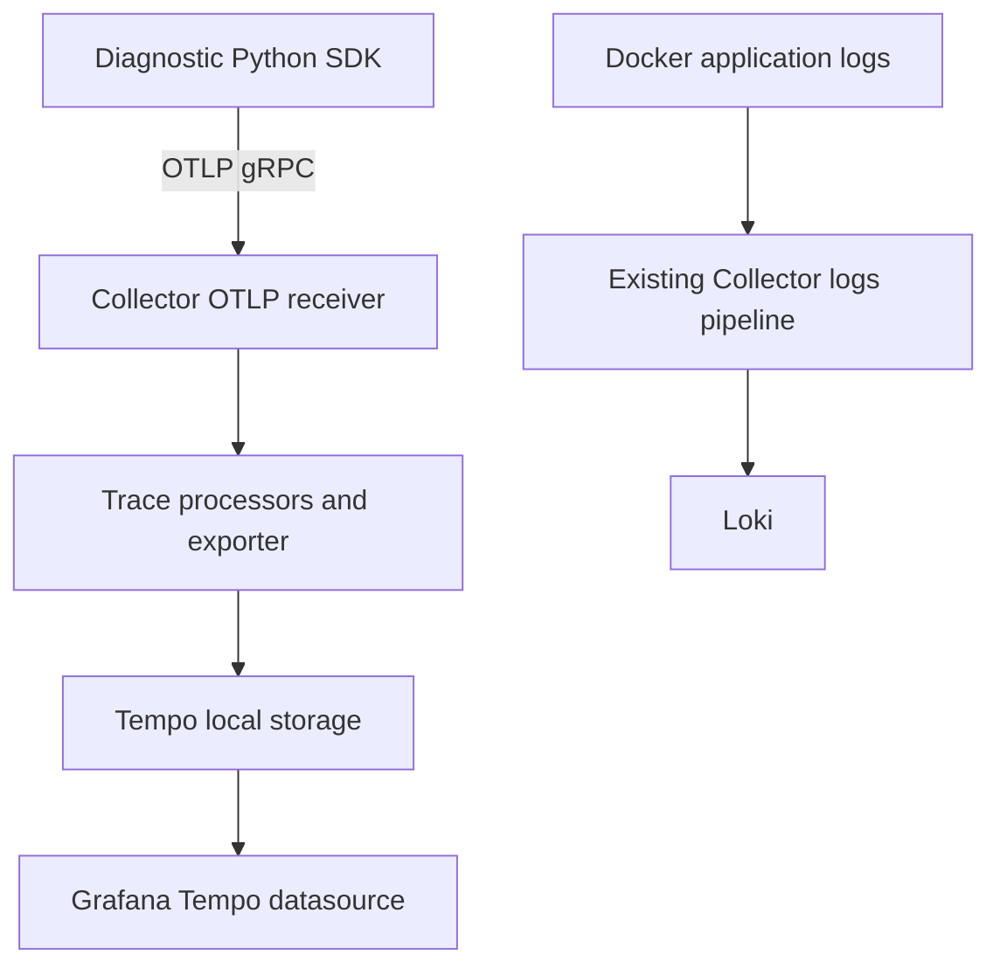

# Lab 33: OpenTelemetry Tracing Fundamentals

## Purpose and Scope

> **Primary Objective:** Produce a two-span trace, inspect its identity and resource metadata, and deliver it through the Collector to Tempo while preserving metrics and logs.

A trace represents one operation as related spans. OpenTelemetry creates and transports that data; Tempo stores and retrieves it; Grafana displays it. Those responsibilities are separate.

You will first inspect a trace locally, then enable a new Collector trace pipeline and look up the same exported trace by ID. The Items app remains uninstrumented in this lab so transport fundamentals are visible before automatic framework spans arrive in Lab 34. Head/tail sampling experiments, TraceQL exploration, custom business events and profiling remain later topics.

## 1. Inherited State and Starting Checks

Complete [Lab 32](Lab-32.md) first. Run every command from the repository root in the same Bash session. Retain the credentials, named volumes and existing application checkpoint item. Confirm both Lab 32 outage experiments are recovered and the final canary is queryable.

```bash
source lab-notes/session.sh
source lab-notes/evidence.sh
source lab-notes/metrics-session.sh
source lab-notes/platform-session.sh
load_app_settings
start_lab 33
dp config --quiet
dp ps -a
wait_ready
wait_backend loki:3100 /ready
wait_backend otel-collector:13133 /
```

`dp` is the stage-aware Compose helper introduced in Lab 31. It reads the same project and named volumes, adding only the overlays that exist. Use it throughout these labs: running plain `docker compose up` would enable the original full-stack settings instead of the learning stage. `start_lab` creates a fresh evidence directory and sets `LAB_DIR`; keep that directory for this run.

```bash
dp exec -T app python - <<'PYTHON'
from importlib.metadata import version
from app.config import Settings
s=Settings()
print({'otel_enabled':s.otel_enabled,'pyroscope_enabled':s.pyroscope_enabled})
for name in ['opentelemetry-api','opentelemetry-sdk','opentelemetry-exporter-otlp-proto-grpc','opentelemetry-instrumentation-fastapi']:
    print(name,version(name))
assert not s.otel_enabled and not s.pyroscope_enabled
PYTHON
mkdir -p lab-notes/tracing
```

The inherited runtime pins the OTel API/SDK/exporter to 1.44.0 and instrumentation to 0.65b0. Keep that release family together. This guide reuses Collector contrib 0.160.0 and Tempo 3.0.3 from the original repository; it does not upgrade images.

## 2. Learning Objectives and Signal Paths

You will identify a trace ID, span ID, parent span ID, resource, instrumentation scope and span kind; explain OTLP's role; distinguish SDK flush from backend retrieval; and keep application metrics on the existing Prometheus scrape path.



The two Collector pipelines share a process but route different signals. Tempo OTLP receivers listen on internal ports 4317/4318; its query API uses 3200. Neither needs a published host port. Application metrics still flow directly from `/metrics` to Prometheus; no OTel metrics pipeline is added.

## 3. Inspect a Trace Before Sending It Anywhere

```bash
cat > lab-notes/tracing/manual_trace.py <<'PYTHON'
"""A two-span diagnostic trace; does not enable the Items application's instrumentation."""
import argparse, json, os, socket, time
from opentelemetry.exporter.otlp.proto.grpc.trace_exporter import OTLPSpanExporter
from opentelemetry.sdk.resources import Resource
from opentelemetry.sdk.trace import TracerProvider
from opentelemetry.sdk.trace.export import BatchSpanProcessor, ConsoleSpanExporter, SimpleSpanProcessor
from opentelemetry.sdk.trace.sampling import ParentBased, TraceIdRatioBased

parser = argparse.ArgumentParser()
parser.add_argument('--console', action='store_true')
args = parser.parse_args()
provider = TracerProvider(resource=Resource.create({
    'service.name':'lab33-probe', 'service.version':'1.0.0',
    'deployment.environment.name':os.environ.get('ENVIRONMENT','local'),
    'service.instance.id':socket.gethostname()}), sampler=ParentBased(TraceIdRatioBased(1.0)))
if args.console:
    provider.add_span_processor(SimpleSpanProcessor(ConsoleSpanExporter()))
else:
    provider.add_span_processor(BatchSpanProcessor(OTLPSpanExporter(endpoint='http://otel-collector:4317', insecure=True, timeout=3), schedule_delay_millis=500))
tracer = provider.get_tracer('lab33.manual', '1.0.0')
try:
    with tracer.start_as_current_span('lab33.operation') as root:
        with tracer.start_as_current_span('lab33.wait') as child:
            time.sleep(0.02)
            child_id = f'{child.get_span_context().span_id:016x}'
        root_id = f'{root.get_span_context().span_id:016x}'
        trace_id = f'{root.get_span_context().trace_id:032x}'
    flushed = provider.force_flush(timeout_millis=5000)
    print(json.dumps({'trace_id':trace_id,'root_span_id':root_id,'child_span_id':child_id,'sdk_flush_completed':flushed}))
finally:
    provider.shutdown()
PYTHON
```

```bash
dp exec -T app python - --console < lab-notes/tracing/manual_trace.py   > "$LAB_DIR/console-trace.txt"
cat "$LAB_DIR/console-trace.txt"
```

The console output contains two span documents followed by one identity summary. Values change each run. Check that both spans share one 32-hex-character trace ID, their 16-character span IDs differ, and the child's parent ID equals the root ID.

| Field | Meaning in this experiment |
|---|---|
| Resource `service.name` | `lab33-probe`, the process emitting the diagnostic spans |
| Resource environment/version/instance | Deployment identity; the instance distinguishes the running container |
| Scope `lab33.manual` | The code/library that produced these spans |
| Root `lab33.operation` | The overall diagnostic operation |
| Child `lab33.wait` | A 20 ms wait contained in that operation |
| Kind `INTERNAL` | No HTTP client/server boundary is claimed here |
| Status `UNSET` | No failure was recorded; it is not an HTTP status code |

The sleep makes nesting visible; it is not a performance benchmark. Console export is temporary diagnostic output from `docker exec`, not the primary application logging transport. It does not pass through the container's main stdout logging driver into Loki.

**Prediction checkpoint:** in the exported version, IDs still relate the same way. The exporter moves completed spans; it does not invent their parent-child relationship.

## 4. Add the Trace Pipeline While Preserving Logs

```bash
ACTIVE_COLLECTOR_CONFIG=$(mounted_config otel-collector /etc/otelcol-contrib/config.yaml)
cp "$ACTIVE_COLLECTOR_CONFIG" "$LAB_DIR/collector-before-traces.yml"
```

```bash
cat > lab-notes/tracing/configure_traces.py <<'PYTHON'
"""Extend the active log Collector configuration. Do not replace its logs pipeline."""
from pathlib import Path
import sys
import yaml

config = yaml.safe_load(Path(sys.argv[1]).read_text())
assert 'logs' in config['service']['pipelines'], 'Complete the Loki labs first'
assert not any(k.startswith('otlp') for k in config['receivers']), 'This step expects the Lab 32 logs-only Collector'
config['receivers']['otlp'] = {'protocols': {'grpc': {'endpoint':'0.0.0.0:4317'}, 'http':{'endpoint':'0.0.0.0:4318'}}}
config['processors']['transform/traces'] = {'error_mode':'ignore', 'trace_statements':[
    {'context':'span', 'statements':[
        'delete_key(span.attributes, "db.statement")',
        'delete_key(span.attributes, "db.query.text")',
        'delete_key(span.attributes, "http.url")',
        'delete_key(span.attributes, "http.target")',
        'delete_key(span.attributes, "url.full")',
        'delete_key(span.attributes, "url.query")',
        'set(span.status.message, "")']},
    {'context':'spanevent', 'statements':[
        'delete_key(spanevent.attributes, "exception.message")',
        'delete_key(spanevent.attributes, "exception.stacktrace")']} ]}
config['exporters']['otlp_grpc/tempo'] = {
    'endpoint':'tempo:4317', 'tls':{'insecure':True}, 'timeout':'5s',
    'sending_queue':{'enabled':True, 'queue_size':512, 'storage':'file_storage'},
    'retry_on_failure':{'enabled':True, 'initial_interval':'1s', 'max_interval':'10s', 'max_elapsed_time':'300s'}}
config['service']['pipelines']['traces'] = {
    'receivers':['otlp'], 'processors':['memory_limiter','transform/traces','batch'], 'exporters':['otlp_grpc/tempo']}
assert 'metrics' not in config['service']['pipelines']
out=Path('lab-notes/tracing'); out.mkdir(exist_ok=True)
(out/'collector.yml').write_text(yaml.safe_dump(config, sort_keys=False))
print('Preserved logs; added OTLP traces to Tempo. No application-metrics pipeline.')
PYTHON
```

```bash
lab-notes/.tools/bin/python lab-notes/tracing/configure_traces.py "$ACTIVE_COLLECTOR_CONFIG"
```

```bash
cat > lab-notes/tracing/tempo.yml <<'YAML'
# Tempo 3 monolithic mode: no Kafka and no generated application metrics.
target: all
stream_over_http_enabled: true
server:
  http_listen_address: 0.0.0.0
  http_listen_port: 3200
  grpc_listen_port: 9095
  log_level: info
distributor:
  receivers:
    otlp:
      protocols:
        grpc:
          endpoint: 0.0.0.0:4317
        http:
          endpoint: 0.0.0.0:4318
storage:
  trace:
    backend: local
    wal:
      path: /var/tempo/wal
    local:
      path: /var/tempo/blocks
backend_scheduler:
  local_work_path: /var/tempo/work
usage_report:
  reporting_enabled: false
# Scheduler/worker retention is set by version-verified flags in Compose.
YAML
```

```bash
cat > lab-notes/compose.traces.yaml <<'YAML'
services:
  otel-collector:
    volumes:
      - ./lab-notes/tracing/collector.yml:/etc/otelcol-contrib/config.yaml:ro
  tempo:
    volumes:
      - ./lab-notes/tracing/tempo.yml:/etc/tempo/tempo.yaml:ro
YAML
```

```bash
dp config --quiet
dp run --rm -T --no-deps otel-collector validate --config=/etc/otelcol-contrib/config.yaml
dp up -d --no-deps --build tempo otel-collector
wait_backend tempo:3200 /ready
wait_backend otel-collector:13133 /
dp logs --tail=70 --no-color tempo otel-collector
```

The patch refuses an unexpected pre-existing OTLP receiver rather than quietly double-instrumenting the stage. It copies the active log pipeline and adds OTLP receivers, trace processing and `otlp_grpc/tempo`. The pinned Collector uses that exporter name; older snippets may use different aliases.

Both receivers explicitly bind to `0.0.0.0` for container-to-container traffic. The Tempo service retains its existing named volume, non-root image wrapper and version-specific retention flags from `docker-compose.yml`. All-in-one local Tempo 3 runs without Kafka in this repository.

The trace processor removes SQL statements, complete URLs/query strings, exception messages/stack traces and span status text before storage. Instrumentation can create sensitive attributes before that stage; this is a limited local policy, not comprehensive data-loss prevention. Business-span enrichment and a deeper redaction policy belong to Lab 36.

The SDK and exporter queues are finite. A telemetry backend outage should not gate Items readiness. A successful Collector validation proves component/configuration acceptance; it does not prove Tempo is reachable.

## 5. Provision Tempo and Observe Its Scrape Target

```bash
cat > config/grafana/learning/provisioning/datasources/tempo.yml <<'YAML'
apiVersion: 1
datasources:
  - name: Tempo
    uid: tempo
    type: tempo
    access: proxy
    url: http://tempo:3200
    editable: false
YAML
```

```bash
cp lab-notes/prometheus/prometheus.yml "$LAB_DIR/prometheus-before-tempo.yml"
lab-notes/.tools/bin/python - <<'PYTHON'
from pathlib import Path
import os, yaml
p=Path('lab-notes/prometheus/prometheus.yml'); c=yaml.safe_load(p.read_text())
assert not any(j['job_name']=='tempo' for j in c['scrape_configs']), 'Tempo job already exists; inspect it first'
c['scrape_configs'].append({'job_name':'tempo','static_configs':[{
    'targets':['tempo:3200'],'labels':{'environment':os.environ['LAB_ENVIRONMENT'],'service':'tempo'}}]})
p.write_text(yaml.safe_dump(c,sort_keys=False))
PYTHON
reload_prometheus
wait_target tempo
dp restart grafana
wait_grafana
pq 'up{job="tempo"}' > "$LAB_DIR/tempo-up.json"
```

Expected `up{job="tempo"}` is 1. This observes Tempo's Prometheus endpoint; it does not create application metrics from traces. The stage now has twelve long-running services and nine scrape jobs. The app's `OTEL_ENABLED` remains false.

In Grafana, open **Explore**, select **Tempo**, and use trace-ID lookup in the next step. The datasource URL is `http://tempo:3200`, resolved inside the Docker network; entering `localhost:3200` would point at Grafana's own container.

## 6. Export and Retrieve One Trace

```bash
cat > lab-notes/tracing/inspect_trace.py <<'PYTHON'
"""Normalize Tempo's OTLP JSON into an inspectable span table; accepts hex or base64 IDs."""
import base64, json, re, sys
from pathlib import Path

def hex_id(value, size):
    if not value: return ''
    if re.fullmatch('[0-9a-fA-F]{'+str(size*2)+'}', value): return value.lower()
    decoded=base64.b64decode(value, validate=True)
    assert len(decoded)==size
    return decoded.hex()
def attrs(values):
    return {a['key']:next(iter(a['value'].values())) for a in values}
def flatten(document):
    output=[]
    for batch in document.get('batches', document.get('resourceSpans', [])):
        resource=attrs(batch.get('resource',{}).get('attributes',[]))
        for scope in batch.get('scopeSpans', batch.get('instrumentationLibrarySpans',[])):
            scope_name=scope.get('scope',scope.get('instrumentationLibrary',{})).get('name','')
            for span in scope.get('spans',[]):
                output.append({'service':resource.get('service.name'), 'environment':resource.get('deployment.environment.name'),
                    'scope':scope_name,'name':span['name'], 'kind':span.get('kind'),
                    'trace_id':hex_id(span['traceId'],16), 'span_id':hex_id(span['spanId'],8),
                    'parent_span_id':hex_id(span.get('parentSpanId',''),8),
                    'duration_ms':(int(span['endTimeUnixNano'])-int(span['startTimeUnixNano']))/1e6,
                    'status':span.get('status',{}), 'attributes':attrs(span.get('attributes',[]))})
    return output
if __name__=='__main__':
    rows=flatten(json.loads(Path(sys.argv[1]).read_text()))
    assert rows, 'No spans: inspect the raw response and repeat the bounded Tempo lookup'
    print(json.dumps(rows,indent=2))
PYTHON
```

```bash
cat > lab-notes/traces-session.sh <<'BASH'
# Source after platform-session.sh.
fetch_trace() {
  local trace_id="$1" output="$2" attempt
  [[ "$trace_id" =~ ^[0-9a-f]{32}$ ]] || { echo 'Expected 32 lowercase hex characters' >&2; return 2; }
  for attempt in {1..45}; do
    if backend tempo:3200 "/api/traces/$trace_id" > "$output.tmp" 2> "$output.error"; then
      if python3 "$LAB_ROOT/lab-notes/tracing/inspect_trace.py" "$output.tmp" >/dev/null 2>&1; then
        mv "$output.tmp" "$output"
        return 0
      fi
    fi
    sleep 1
  done
  echo 'Trace lookup deadline exceeded; inspect SDK, Collector and Tempo evidence' >&2
  return 1
}
BASH
```

```bash
source lab-notes/traces-session.sh
dp exec -T app python - < lab-notes/tracing/manual_trace.py > "$LAB_DIR/export-result.json"
cat "$LAB_DIR/export-result.json"
TRACE_ID=$(jq -r '.trace_id' "$LAB_DIR/export-result.json")
fetch_trace "$TRACE_ID" "$LAB_DIR/tempo-trace.json"
python3 lab-notes/tracing/inspect_trace.py "$LAB_DIR/tempo-trace.json" > "$LAB_DIR/spans.json"
jq '.[] | {service,scope,name,kind,trace_id,span_id,parent_span_id,duration_ms}' "$LAB_DIR/spans.json"
python3 - "$LAB_DIR/export-result.json" "$LAB_DIR/spans.json" <<'PYTHON'
import json,sys
expected=json.load(open(sys.argv[1])); rows=json.load(open(sys.argv[2]))
assert len(rows)==2, 'Retry retrieval if a partial trace is still arriving'
root=next(r for r in rows if r['name']=='lab33.operation')
child=next(r for r in rows if r['name']=='lab33.wait')
assert root['trace_id']==child['trace_id']==expected['trace_id']
assert child['parent_span_id']==root['span_id']==expected['root_span_id']
assert child['span_id']==expected['child_span_id']
assert root['service']==child['service']=='lab33-probe'
assert not root['parent_span_id'] or int(root['parent_span_id'],16)==0
print('Two spans, one trace and the expected parent edge verified')
PYTHON
```

Paste `TRACE_ID` into Grafana's Tempo trace-ID lookup. Expand the resource, scope and span details. The parent duration should include the child's wait and small SDK/Python overhead; do not expect exactly 20.000 ms.

`force_flush` waits for the SDK processor to finish its export work within its deadline. A successful flush is not a durable-storage receipt. Retrieving the trace from Tempo is the independent downstream proof. Even then, local disk storage on one VM is not a replicated durability guarantee.

## 7. Validate Signal Separation and a Negative Lookup

```bash
lab-notes/.tools/bin/python - <<'PYTHON'
import yaml
c=yaml.safe_load(open('lab-notes/tracing/collector.yml'))
print(c['service']['pipelines'])
assert set(c['service']['pipelines'])=={'logs','traces'}
assert c['service']['pipelines']['logs']['receivers']==['fluent_forward']
assert c['service']['pipelines']['traces']['exporters']==['otlp_grpc/tempo']
PYTHON
MISSING_TRACE=$(python3 -c 'from uuid import uuid4; print(uuid4().hex)')
if backend tempo:3200 "/api/traces/$MISSING_TRACE" > "$LAB_DIR/missing-trace.json" 2> "$LAB_DIR/missing-trace.error"; then
  echo 'Unexpected match; inspect the result'
else
  cat "$LAB_DIR/missing-trace.error"
fi
api -fsS "$APP_URL/metrics" > "$LAB_DIR/app-metrics-after.prom"
api -fsS "$APP_URL/api/v1/items?limit=1" >/dev/null
backend otel-collector:8888 /metrics > "$LAB_DIR/collector-after.prom"
```

A random ID should normally return HTTP 404. This differs from connection refusal or an exporter failure. Do not manufacture an all-zero ID: invalid-ID validation would test another boundary.

Recheck a recent `request_completed` record in Loki through the Lab 32 canary procedure. Log shipping must survive the added trace pipeline. The Items app still has no server spans; the only new traces are deliberate diagnostic probes.

## 8. Recovery and Troubleshooting

| Symptom | First useful check |
|---|---|
| Console spans exist but no Tempo trace | SDK export errors, Collector accepted/exported spans, Tempo readiness, then lookup bounds. |
| Collector cannot bind OTLP | Validate duplicate receiver definitions and the container endpoint; do not publish ports to fix internal DNS. |
| Tempo startup fails | Inspect pinned-version config and persistent-volume permissions; retain the original Compose retention flags. |
| Root and child appear in separate traces | A context was not current across creation, or unrelated probe runs were compared. |
| IDs look base64 encoded in raw API JSON | Use the provided normalizer; OTLP JSON representations differ from displayed hexadecimal IDs. |
| Grafana reports a datasource error | Check `tempo:3200` from the network and whether provisioning loaded UID `tempo`. |
| Only part of a trace appears | Re-fetch after the async exporter delay before diagnosing missing instrumentation. |

If the new Collector config is invalid, remove `lab-notes/compose.traces.yaml` from the active include path, recreate the Collector to restore its inherited log config, and recover logs before retrying. To fully return to Lab 32, stop Tempo, restore `prometheus-before-tempo.yml`, reload Prometheus, remove the newly added Tempo datasource file, and restart Grafana. Do not remove the Tempo named volume.

The intended end state keeps both pipelines healthy and Tempo provisioned. The [OTel trace model](https://opentelemetry.io/docs/concepts/signals/traces/), [Collector configuration](https://opentelemetry.io/docs/collector/configuration/) and [Tempo documentation](https://grafana.com/docs/tempo/latest/) provide further reference.

## 9. Knowledge Check

1. How does a span ID differ from a trace ID?
2. What is an instrumentation scope?
3. Why does a completed SDK flush not prove persistence?
4. Why is app tracing still disabled?

### Answer Guide

1. The trace ID is shared by an operation; each span has its own ID and a parent edge.
2. The library/code identity producing spans, separate from the emitting service resource.
3. Export completion and downstream durable retention are different observation boundaries.
4. The lab isolates data transport before framework instrumentation is introduced.

## 10. Professional Scenario Exercise

An operator says “OpenTelemetry is healthy because the health endpoint returns 200.” List the additional evidence needed to prove that one specific trace was created, accepted, exported, stored and retrieved. Identify which steps can fail independently.

## 11. Lab Notebook Template

Create a notebook in the evidence directory for this run:

```bash
test -e "$LAB_DIR/notebook.md" || printf '# Lab 33 Evidence\n' > "$LAB_DIR/notebook.md"
```

Use these headings and fill them with your predictions, commands, observed results and conclusions:

```markdown
# Lab 33 Evidence

## Starting state and operational question
## Prediction before the change
## Commands and timestamps
## Observed results and source evidence
## Unexpected findings and troubleshooting
## Recovery proof and remaining limitations
```

## 12. Observable Completion Criteria

- [ ] The two-span console trace has correct parentage.
- [ ] A second trace reaches Tempo through the Collector and its IDs match the SDK output.
- [ ] Resources, scope and span kind can be explained from actual evidence.
- [ ] Tempo is provisioned in Grafana and its scrape target is up.
- [ ] Logs continue flowing and no OTel application-metrics pipeline was created.

## 13. Production Implications

Resources enable stable attribution; scopes identify instrumentation. Sampling, queues and shutdown affect diagnostic completeness. Keep telemetry exporters off the business-critical response path, apply privacy policy before storage, and retain explicit transport boundaries. Sampling at 100% here is a bounded learning choice, not a production recommendation.

## 14. End State and Transition

Twelve services and nine scrape jobs are active. Tempo and the OTLP trace pipeline are available; Items app instrumentation and Pyroscope are still disabled. [Lab 34](Lab-34.md) enables automatic FastAPI, SQLAlchemy, Redis and HTTP-client instrumentation and compares cache-miss and cache-hit trace shapes.
