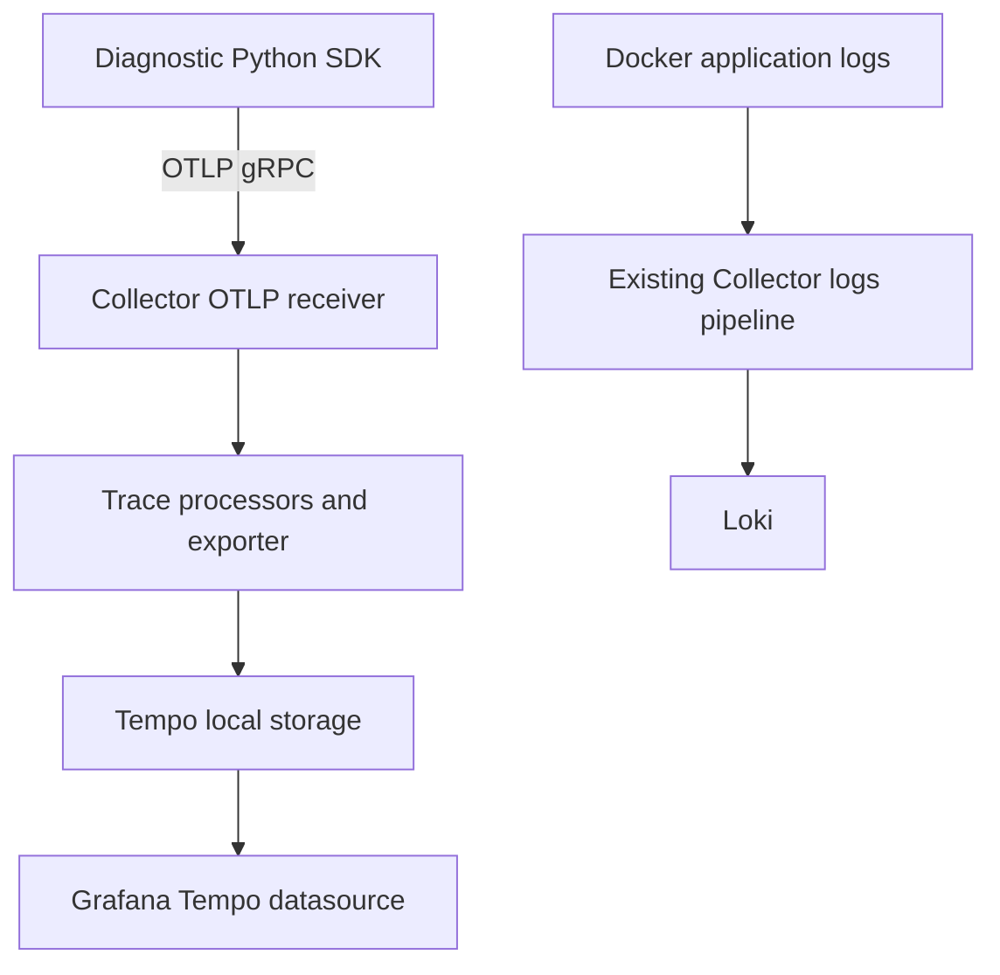

# Lab 33: OpenTelemetry Tracing Fundamentals

## 1. Purpose and Learning Outcomes

You will create a small trace, inspect its structure locally, and then send a trace through the Collector and retrieve it from Tempo. Two related spans make trace IDs and parent-child relationships easy to see before you enable instrumentation across the application. You will add tracing alongside the existing log pipeline, showing how signals can share a Collector while still following separate collection paths.

> **Primary Objective:** Create a trace with two spans, inspect its IDs and resource metadata, and send it through the Collector to Tempo while keeping the existing metrics and logs working.

A trace describes an operation through related spans, each representing a timed piece of work. OpenTelemetry creates and transports those spans. Tempo stores and retrieves them, and Grafana displays them. Knowing these separate responsibilities helps you locate problems.

Start by inspecting a trace locally. Then enable a Collector trace pipeline, export a diagnostic trace, and retrieve that exported trace by ID. The Items application remains uninstrumented so you can understand transport before Lab 34 adds automatic framework spans. Sampling experiments, TraceQL searches, custom business events, and profiling come later.

## 2. Starting Point and Lab Map

Open the complete application repository before using this guide. Unless a step says otherwise, run commands in Bash from the repository's top-level folder. Follow the starting checks in order because later commands depend on the helper functions and running services they prepare.

Read each explanation before running its commands. Run one complete code block, check the result, and then continue. In your notebook, save the commands, what happened, why you think it happened, and anything that differed from the expected result.

### Key Terms

| **Term** | **Explanation**                                                                                          |
| -------- | -------------------------------------------------------------------------------------------------------- |
| Trace    | A group of related spans showing the work done during an operation and how those pieces of work connect. |
| Span     | One named operation with a start and end time, its own ID, parent context, and descriptive attributes.   |
| OTLP     | The OpenTelemetry protocol used to send telemetry from one component to another.                         |

### Lab Map

The arrows show how the parts connect and where a request can take different paths. Use this map to understand the design. It is not a recording of a request that actually ran.


```mermaid
flowchart TD
    P["Diagnostic Python SDK"] -->|"OTLP gRPC"| C["Collector OTLP receiver"]
    C --> T["Trace processors and exporter"]
    T --> B["Tempo local storage"]
    B --> G["Grafana Tempo datasource"]
    D["Docker application logs"] --> L["Existing Collector logs pipeline"]
    L --> K["Loki"]
```

## 3. Guided Walkthrough

### Step 01. Inherited State and Starting Checks

**What You Are Doing:** Confirm that the log-delivery failures from the previous lab are fully recovered. Use the working log pipeline as the baseline before adding tracing to the Collector.

**Practical Walkthrough:** Find a fresh delivered log and confirm recovery from the earlier outages. Save the current Collector configuration. Adding a new signal should preserve the logging path you already proved, so you retain independent evidence if tracing fails.

Verify the log path and save the active Collector settings before extending them. Check application readiness separately. If tracing setup fails, the unchanged logging path should still help you investigate instead of disappearing because its configuration was replaced.

Complete [Lab 32](Lab-32.md) first. Continue from the repository root in the same Bash session, keeping the credentials, named volumes, and checkpoint item. Confirm recovery from both Lab 32 outages and retrieve its final canary before proceeding.

```bash
source lab-notes/session.sh
source lab-notes/evidence.sh
source lab-notes/metrics-session.sh
source lab-notes/platform-session.sh
load_app_settings
start_lab 33
dp config --quiet
dp ps -a
wait_ready
wait_backend loki:3100 /ready
wait_backend otel-collector:13133 /
```

Use `dp`, the stage-aware Compose helper from Lab 31, throughout these labs. It keeps the same project and named volumes and includes only the overlays that exist. Plain `docker compose up` would activate the original full-stack settings instead of this learning stage. `start_lab` creates a new evidence directory and sets `LAB_DIR`; preserve that directory for this run.

```bash
dp exec -T app python - <<'PYTHON'
from importlib.metadata import version
from app.config import Settings
s=Settings()
print({'otel_enabled':s.otel_enabled,'pyroscope_enabled':s.pyroscope_enabled})
for name in ['opentelemetry-api','opentelemetry-sdk','opentelemetry-exporter-otlp-proto-grpc','opentelemetry-instrumentation-fastapi']:
    print(name,version(name))
assert not s.otel_enabled and not s.pyroscope_enabled
PYTHON
mkdir -p lab-notes/tracing
```

The inherited environment pins the OTel API, SDK, and exporter to 1.44.0 and instrumentation to 0.65b0. Keep these related releases together. This lab also keeps the repository's Collector contrib 0.160.0 and Tempo 3.0.3 images; it does not upgrade them.

**Understanding the Result:** A working existing pipeline provides a control for the new change. Keep its configuration and fresh canary result so you can distinguish a tracing problem from a broader failure.

### Step 02. Learning Objectives and Signal Paths

**What You Are Doing:** Identify the separate jobs of the SDK, Collector, and Tempo. The application's native metrics continue to use Prometheus scraping throughout this tracing experiment.

**Practical Walkthrough:** Follow spans along their path: the SDK creates and exports them, the Collector receives and processes them, and Tempo stores them for queries. Application metrics still follow their existing Prometheus scrape path. Adding tracing does not move every signal into the same transport.

Keep span creation, SDK export, Collector processing, and Tempo retrieval as separate steps in your explanation. Native counters remain on their existing metrics path with the same measurement definitions. Enabling OpenTelemetry tracing does not automatically route them through the Collector.

You will identify trace IDs, span IDs, parent span IDs, resources, instrumentation scopes, and span kinds. You will also explain OTLP, distinguish an SDK flush from backend retrieval, and confirm that application metrics remain on the existing Prometheus scrape path.

The lab map in Section 2 shows this relationship.

The log and trace pipelines share a Collector process but handle different signals. Tempo receives OTLP on internal ports 4317/4318 and serves queries on port 3200; none of these needs a published host port. Application metrics still travel directly from `/metrics` to Prometheus. This lab adds no OTel metrics pipeline.

**Understanding the Result:** One signal path can fail while another works. Identify which path you are checking before treating a service's health as proof that a particular signal arrived.

### Step 03. Inspect a Trace Before Sending It Anywhere

**What You Are Doing:** Create and print one root span and one child span locally before using a backend. Compare their trace IDs, span IDs, and parent IDs to see exactly how they connect.

**Practical Walkthrough:** Run the local diagnostic and inspect both spans. They should share one trace ID but have different span IDs. The child's parent ID should equal the root span's ID. These values let you verify the relationship directly without relying on a diagram in Grafana.

Use the console output to check the shared trace ID, unique span IDs, and parent-child link. This proves the structure of the local diagnostic trace. It does not yet prove application auto-instrumentation, successful network transport, or storage in Tempo.

```bash
cat > lab-notes/tracing/manual_trace.py <<'PYTHON'
"""A two-span diagnostic trace; does not enable the Items application's instrumentation."""
import argparse, json, os, socket, time
from opentelemetry.exporter.otlp.proto.grpc.trace_exporter import OTLPSpanExporter
from opentelemetry.sdk.resources import Resource
from opentelemetry.sdk.trace import TracerProvider
from opentelemetry.sdk.trace.export import BatchSpanProcessor, ConsoleSpanExporter, SimpleSpanProcessor
from opentelemetry.sdk.trace.sampling import ParentBased, TraceIdRatioBased

parser = argparse.ArgumentParser()
parser.add_argument('--console', action='store_true')
args = parser.parse_args()
provider = TracerProvider(resource=Resource.create({
    'service.name':'lab33-probe', 'service.version':'1.0.0',
    'deployment.environment.name':os.environ.get('ENVIRONMENT','local'),
    'service.instance.id':socket.gethostname()}), sampler=ParentBased(TraceIdRatioBased(1.0)))
if args.console:
    provider.add_span_processor(SimpleSpanProcessor(ConsoleSpanExporter()))
else:
    provider.add_span_processor(BatchSpanProcessor(OTLPSpanExporter(endpoint='http://otel-collector:4317', insecure=True, timeout=3), schedule_delay_millis=500))
tracer = provider.get_tracer('lab33.manual', '1.0.0')
try:
    with tracer.start_as_current_span('lab33.operation') as root:
        with tracer.start_as_current_span('lab33.wait') as child:
            time.sleep(0.02)
            child_id = f'{child.get_span_context().span_id:016x}'
        root_id = f'{root.get_span_context().span_id:016x}'
        trace_id = f'{root.get_span_context().trace_id:032x}'
    flushed = provider.force_flush(timeout_millis=5000)
    print(json.dumps({'trace_id':trace_id,'root_span_id':root_id,'child_span_id':child_id,'sdk_flush_completed':flushed}))
finally:
    provider.shutdown()
PYTHON
```

**Command Note:** `<<'PYTHON'` writes the following block exactly as shown until the closing `PYTHON`. Quoting the delimiter prevents Bash from expanding `$variables` inside the generated file. Creating the file and executing it are separate steps.

```bash
dp exec -T app python - --console < lab-notes/tracing/manual_trace.py   > "$LAB_DIR/console-trace.txt"
cat "$LAB_DIR/console-trace.txt"
```

The console prints two span documents and then an identity summary. The generated values change on each run. Confirm that both spans share one 32-hex-character trace ID, have different 16-character span IDs, and that the child's parent ID matches the root span ID.

| **Field**                             | **Meaning in This Experiment**                                                    |
| ------------------------------------- | --------------------------------------------------------------------------------- |
| Resource `service.name`               | `lab33-probe`, the name of the process producing these diagnostic spans           |
| Resource environment/version/instance | Describes the deployment; the instance value distinguishes this running container |
| Scope `lab33.manual`                  | Identifies the code or library that created the spans                             |
| Root `lab33.operation`                | Represents the complete diagnostic operation                                      |
| Child `lab33.wait`                    | Represents a 20 ms wait inside the parent operation                               |
| Kind `INTERNAL`                       | Describes internal work without claiming an HTTP client or server boundary        |
| Status `UNSET`                        | Means no failure status was recorded; it is separate from an HTTP status code     |

The sleep makes the nesting easy to see; it is not a performance benchmark. Console export is temporary diagnostic output from `docker exec`. It does not use the main application stdout logging driver and does not travel through that path into Loki.

**Prediction Checkpoint:** Exporting the spans should preserve the same ID relationships. The exporter transports completed spans; the parent-child relationship is established when the spans are created.

**Understanding the Result:** A trace ID groups related spans, while parent IDs define how the spans connect. Sharing a trace ID alone does not tell you which span is the parent of another.

### Step 04. Add the Trace Pipeline While Preserving Logs

**What You Are Doing:** Add an OTLP receiver and trace pipeline while retaining the active log configuration. Stop and inspect any unexpected existing receiver settings because they may conflict with the intended setup.

**Practical Walkthrough:** Extend the configuration with tracing while keeping the complete log pipeline. Follow the guard that checks for unexpected prior receiver configuration. Confirm that the selected Collector distribution contains all the components named in the new pipeline before activating it.

Review the guarded edit and preserve the existing log pipeline exactly. Validate the named receivers, processors, and exporters. If the guard finds earlier configuration that it does not expect, inspect the difference rather than forcing an edit that could overwrite working settings or duplicate receivers.

```bash
ACTIVE_COLLECTOR_CONFIG=$(mounted_config otel-collector /etc/otelcol-contrib/config.yaml)
cp "$ACTIVE_COLLECTOR_CONFIG" "$LAB_DIR/collector-before-traces.yml"
```

```bash
cat > lab-notes/tracing/configure_traces.py <<'PYTHON'
"""Extend the active log Collector configuration. Do not replace its logs pipeline."""
from pathlib import Path
import sys
import yaml

config = yaml.safe_load(Path(sys.argv[1]).read_text())
assert 'logs' in config['service']['pipelines'], 'Complete the Loki labs first'
assert not any(k.startswith('otlp') for k in config['receivers']), 'This step expects the Lab 32 logs-only Collector'
config['receivers']['otlp'] = {'protocols': {'grpc': {'endpoint':'0.0.0.0:4317'}, 'http':{'endpoint':'0.0.0.0:4318'}}}
config['processors']['transform/traces'] = {'error_mode':'ignore', 'trace_statements':[
    {'context':'span', 'statements':[
        'delete_key(span.attributes, "db.statement")',
        'delete_key(span.attributes, "db.query.text")',
        'delete_key(span.attributes, "http.url")',
        'delete_key(span.attributes, "http.target")',
        'delete_key(span.attributes, "url.full")',
        'delete_key(span.attributes, "url.query")',
        'set(span.status.message, "")']},
    {'context':'spanevent', 'statements':[
        'delete_key(spanevent.attributes, "exception.message")',
        'delete_key(spanevent.attributes, "exception.stacktrace")']} ]}
config['exporters']['otlp_grpc/tempo'] = {
    'endpoint':'tempo:4317', 'tls':{'insecure':True}, 'timeout':'5s',
    'sending_queue':{'enabled':True, 'queue_size':512, 'storage':'file_storage'},
    'retry_on_failure':{'enabled':True, 'initial_interval':'1s', 'max_interval':'10s', 'max_elapsed_time':'300s'}}
config['service']['pipelines']['traces'] = {
    'receivers':['otlp'], 'processors':['memory_limiter','transform/traces','batch'], 'exporters':['otlp_grpc/tempo']}
assert 'metrics' not in config['service']['pipelines']
out=Path('lab-notes/tracing'); out.mkdir(exist_ok=True)
(out/'collector.yml').write_text(yaml.safe_dump(config, sort_keys=False))
print('Preserved logs; added OTLP traces to Tempo. No application-metrics pipeline.')
PYTHON
```

```bash
lab-notes/.tools/bin/python lab-notes/tracing/configure_traces.py "$ACTIVE_COLLECTOR_CONFIG"
```

```bash
cat > lab-notes/tracing/tempo.yml <<'YAML'
# Tempo 3 monolithic mode: no Kafka and no generated application metrics.
target: all
stream_over_http_enabled: true
server:
  http_listen_address: 0.0.0.0
  http_listen_port: 3200
  grpc_listen_port: 9095
  log_level: info
distributor:
  receivers:
    otlp:
      protocols:
        grpc:
          endpoint: 0.0.0.0:4317
        http:
          endpoint: 0.0.0.0:4318
storage:
  trace:
    backend: local
    wal:
      path: /var/tempo/wal
    local:
      path: /var/tempo/blocks
backend_scheduler:
  local_work_path: /var/tempo/work
usage_report:
  reporting_enabled: false
# Scheduler/worker retention is set by version-verified flags in Compose.
YAML
```

```bash
cat > lab-notes/compose.traces.yaml <<'YAML'
services:
  otel-collector:
    volumes:
      - ./lab-notes/tracing/collector.yml:/etc/otelcol-contrib/config.yaml:ro
  tempo:
    volumes:
      - ./lab-notes/tracing/tempo.yml:/etc/tempo/tempo.yaml:ro
YAML
```

```bash
dp config --quiet
dp run --rm -T --no-deps otel-collector validate --config=/etc/otelcol-contrib/config.yaml
dp up -d --no-deps --build tempo otel-collector
wait_backend tempo:3200 /ready
wait_backend otel-collector:13133 /
dp logs --tail=70 --no-color tempo otel-collector
```

The patch stops if it finds an unexpected existing OTLP receiver. It copies the active log pipeline and adds OTLP receivers, trace processing, and `otlp_grpc/tempo`. That is the exporter name used by the pinned Collector; examples written for older versions may use different aliases.

Both receivers bind explicitly to `0.0.0.0` so other containers can connect. Tempo keeps its existing named volume, non-root image wrapper, and version-specific retention flags from `docker-compose.yml`. The repository's all-in-one local Tempo 3 setup runs without Kafka.

Before storage, the trace processor removes SQL statements, full URLs and query strings, exception messages and stack traces, and span-status text. Instrumentation may still create sensitive attributes before this processing stage. This is a limited local filtering policy, not comprehensive data-loss prevention. Lab 36 covers business-span enrichment and a deeper redaction policy.

The SDK and exporter queues have limited capacity. A telemetry backend failure should not make Items fail its business-readiness check. Collector validation confirms that it accepts the components and configuration, but it does not prove a live connection to Tempo.

**Understanding the Result:** Add tracing to the active configuration while preserving logging. A traces-only example would remove the already working signal path instead of extending it.

### Step 05. Provision Tempo and Observe Its Scrape Target

**What You Are Doing:** Add Tempo as a Grafana data source and monitor its endpoint. A successful scrape proves endpoint reachability, while a trace-specific lookup is still needed to prove that your trace arrived.

**Practical Walkthrough:** Provision the Tempo data source and scrape job, then verify the expanded stage of twelve services and nine jobs. The metrics endpoint checks collection reachability, and the data source provides query access. Neither check alone proves that the diagnostic spans reached storage.

Check Tempo readiness, the Prometheus target, and the Grafana data-source identity separately. Then use the known trace ID in the next step to prove that an exported trace can actually be read from the backend.

```bash
cat > config/grafana/learning/provisioning/datasources/tempo.yml <<'YAML'
apiVersion: 1
datasources:
  - name: Tempo
    uid: tempo
    type: tempo
    access: proxy
    url: http://tempo:3200
    editable: false
YAML
```

```bash
cp lab-notes/prometheus/prometheus.yml "$LAB_DIR/prometheus-before-tempo.yml"
lab-notes/.tools/bin/python - <<'PYTHON'
from pathlib import Path
import os, yaml
p=Path('lab-notes/prometheus/prometheus.yml'); c=yaml.safe_load(p.read_text())
assert not any(j['job_name']=='tempo' for j in c['scrape_configs']), 'Tempo job already exists; inspect it first'
c['scrape_configs'].append({'job_name':'tempo','static_configs':[{
    'targets':['tempo:3200'],'labels':{'environment':os.environ['LAB_ENVIRONMENT'],'service':'tempo'}}]})
p.write_text(yaml.safe_dump(c,sort_keys=False))
PYTHON
reload_prometheus
wait_target tempo
dp restart grafana
wait_grafana
pq 'up{job="tempo"}' > "$LAB_DIR/tempo-up.json"
```

Expect `up{job="tempo"}` to equal 1. This reports the Tempo metrics endpoint's scrape state; it does not generate application metrics from traces. There should now be twelve long-running services and nine scrape jobs. The application's `OTEL_ENABLED` setting remains false.

In Grafana, open **Explore**, choose **Tempo**, and prepare to use trace-ID lookup. The data source uses `http://tempo:3200`, which resolves on the Docker network. Using `localhost:3200` would point Grafana back at its own container instead of the Tempo container.

**Understanding the Result:** Save separate evidence for endpoint health and retrieval of a particular trace. The next step checks whether the diagnostic data itself arrived.

### Step 06. Export and Retrieve One Trace

**What You Are Doing:** Export the diagnostic spans and retrieve the trace using its known ID. Save both the SDK flush result and the backend lookup because they verify different stages of delivery.

**Practical Walkthrough:** Export the trace, explicitly flush the SDK, and query Tempo with the saved trace ID. Allow the specified ingestion interval and verify both expected spans. Flushing checks completion of SDK-side export work; retrieval checks that the backend can return the data.

Save the emitted ID before querying. Let the SDK complete its documented flush, then poll for that same ID within the stated time limit. Verify both spans and their relationship. The flush belongs to the producer-side check, while the returned span tree proves backend queryability.

```bash
cat > lab-notes/tracing/inspect_trace.py <<'PYTHON'
"""Normalize Tempo's OTLP JSON into an inspectable span table; accepts hex or base64 IDs."""
import base64, json, re, sys
from pathlib import Path

def hex_id(value, size):
    if not value: return ''
    if re.fullmatch('[0-9a-fA-F]{'+str(size*2)+'}', value): return value.lower()
    decoded=base64.b64decode(value, validate=True)
    assert len(decoded)==size
    return decoded.hex()
def attrs(values):
    return {a['key']:next(iter(a['value'].values())) for a in values}
def flatten(document):
    output=[]
    for batch in document.get('batches', document.get('resourceSpans', [])):
        resource=attrs(batch.get('resource',{}).get('attributes',[]))
        for scope in batch.get('scopeSpans', batch.get('instrumentationLibrarySpans',[])):
            scope_name=scope.get('scope',scope.get('instrumentationLibrary',{})).get('name','')
            for span in scope.get('spans',[]):
                output.append({'service':resource.get('service.name'), 'environment':resource.get('deployment.environment.name'),
                    'scope':scope_name,'name':span['name'], 'kind':span.get('kind'),
                    'trace_id':hex_id(span['traceId'],16), 'span_id':hex_id(span['spanId'],8),
                    'parent_span_id':hex_id(span.get('parentSpanId',''),8),
                    'duration_ms':(int(span['endTimeUnixNano'])-int(span['startTimeUnixNano']))/1e6,
                    'status':span.get('status',{}), 'attributes':attrs(span.get('attributes',[]))})
    return output
if __name__=='__main__':
    rows=flatten(json.loads(Path(sys.argv[1]).read_text()))
    assert rows, 'No spans: inspect the raw response and repeat the bounded Tempo lookup'
    print(json.dumps(rows,indent=2))
PYTHON
```

```bash
cat > lab-notes/traces-session.sh <<'BASH'
# Source after platform-session.sh.
fetch_trace() {
  local trace_id="$1" output="$2" attempt
  [[ "$trace_id" =~ ^[0-9a-f]{32}$ ]] || { echo 'Expected 32 lowercase hex characters' >&2; return 2; }
  for attempt in {1..45}; do
    if backend tempo:3200 "/api/traces/$trace_id" > "$output.tmp" 2> "$output.error"; then
      if python3 "$LAB_ROOT/lab-notes/tracing/inspect_trace.py" "$output.tmp" >/dev/null 2>&1; then
        mv "$output.tmp" "$output"
        return 0
      fi
    fi
    sleep 1
  done
  echo 'Trace lookup deadline exceeded; inspect SDK, Collector and Tempo evidence' >&2
  return 1
}
BASH
```

```bash
source lab-notes/traces-session.sh
dp exec -T app python - < lab-notes/tracing/manual_trace.py > "$LAB_DIR/export-result.json"
cat "$LAB_DIR/export-result.json"
TRACE_ID=$(jq -r '.trace_id' "$LAB_DIR/export-result.json")
fetch_trace "$TRACE_ID" "$LAB_DIR/tempo-trace.json"
python3 lab-notes/tracing/inspect_trace.py "$LAB_DIR/tempo-trace.json" > "$LAB_DIR/spans.json"
jq '.[] | {service,scope,name,kind,trace_id,span_id,parent_span_id,duration_ms}' "$LAB_DIR/spans.json"
python3 - "$LAB_DIR/export-result.json" "$LAB_DIR/spans.json" <<'PYTHON'
import json,sys
expected=json.load(open(sys.argv[1])); rows=json.load(open(sys.argv[2]))
assert len(rows)==2, 'Retry retrieval if a partial trace is still arriving'
root=next(r for r in rows if r['name']=='lab33.operation')
child=next(r for r in rows if r['name']=='lab33.wait')
assert root['trace_id']==child['trace_id']==expected['trace_id']
assert child['parent_span_id']==root['span_id']==expected['root_span_id']
assert child['span_id']==expected['child_span_id']
assert root['service']==child['service']=='lab33-probe'
assert not root['parent_span_id'] or int(root['parent_span_id'],16)==0
print('Two spans, one trace and the expected parent edge verified')
PYTHON
```

Paste `TRACE_ID` into Grafana's Tempo trace-ID lookup and expand the resource, scope, and span details. The parent duration includes the child's wait plus some SDK and Python overhead. Do not expect it to equal exactly 20.000 ms.

`force_flush` waits up to its deadline for the SDK processor's export work to finish. A successful result is not an acknowledgment of durable storage. Retrieving the trace from Tempo supplies independent downstream evidence. The single VM's local disk still does not provide a replicated durability guarantee.

**Understanding the Result:** Keep both the flush and retrieval results. A successful flush alone cannot prove that someone can read the trace from Tempo.

### Step 07. Validate Signal Separation and a Negative Lookup

**What You Are Doing:** Compare lookup of a known trace with lookup of a valid random ID, then check fresh log delivery. A genuine not-found response differs from invalid input or a failed network connection.

**Practical Walkthrough:** Retrieve the known ID and try a valid random trace ID as a negative control. Then send a new log canary. The random ID demonstrates ordinary not-found behavior, while the canary checks that adding tracing preserved the previous logging path.

Record the response type for each lookup. The known ID should return the expected spans; the random valid ID should produce the backend's not-found result. If both fail in the same way, inspect the query path first. Find the fresh log canary by its unique identity so an older record cannot accidentally pass the log-preservation check.

```bash
lab-notes/.tools/bin/python - <<'PYTHON'
import yaml
c=yaml.safe_load(open('lab-notes/tracing/collector.yml'))
print(c['service']['pipelines'])
assert set(c['service']['pipelines'])=={'logs','traces'}
assert c['service']['pipelines']['logs']['receivers']==['fluent_forward']
assert c['service']['pipelines']['traces']['exporters']==['otlp_grpc/tempo']
PYTHON
MISSING_TRACE=$(python3 -c 'from uuid import uuid4; print(uuid4().hex)')
if backend tempo:3200 "/api/traces/$MISSING_TRACE" > "$LAB_DIR/missing-trace.json" 2> "$LAB_DIR/missing-trace.error"; then
  echo 'Unexpected match; inspect the result'
else
  cat "$LAB_DIR/missing-trace.error"
fi
api -fsS "$APP_URL/metrics" > "$LAB_DIR/app-metrics-after.prom"
api -fsS "$APP_URL/api/v1/items?limit=1" >/dev/null
backend otel-collector:8888 /metrics > "$LAB_DIR/collector-after.prom"
```

A random valid trace ID should normally return HTTP 404. That result differs from connection refusal or an exporter error. Do not use an all-zero ID: invalid-ID validation would test a different condition.

Use the Lab 32 canary procedure to find a recent `request_completed` record in Loki. Logging must still work after the trace pipeline is added. The Items application has no server spans yet; the only new traces should come from the deliberate diagnostic probes.

**Understanding the Result:** Empty results and failed requests can have different causes. Inspect the response status and error details before concluding that trace data was lost.

### Step 08. Recovery and Troubleshooting

**What You Are Doing:** Follow export and lookup problems through the pipeline in order, then recheck the existing signals. Keep the trace infrastructure ready for application instrumentation in the next lab.

**Practical Walkthrough:** Check SDK output, receiver acceptance, exporter behavior, and Tempo retrieval in sequence. After a repair, verify business readiness and a fresh log. Leave the trace infrastructure active so Lab 34 can add real application instrumentation to a path that is already tested.

Start at the producer and work outward: did it create spans, did the receiver accept them, did the exporter send them, and can Tempo return the known ID? After fixing the issue, repeat a business request and fresh log check. This keeps the next lab focused on instrumentation rather than unresolved transport problems.

| **Symptom**                              | **First Useful Check**                                                                                                              |
| ---------------------------------------- | ----------------------------------------------------------------------------------------------------------------------------------- |
| Console spans exist but no Tempo trace   | Check SDK export errors, accepted and exported span evidence in the Collector, Tempo readiness, and then lookup boundaries.         |
| Collector cannot bind OTLP               | Check for duplicate receiver definitions and an incorrect container endpoint. Publishing host ports does not repair internal DNS.   |
| Tempo startup fails                      | Inspect configuration for the pinned version and persistent-volume permissions. Keep the original Compose retention flags.          |
| Root and child appear in separate traces | Check whether the intended context was current when each span was created and whether you compared spans from different probe runs. |
| IDs look base64 encoded in raw API JSON  | Use the supplied normalizer. Raw OTLP JSON can represent IDs differently from the displayed hexadecimal form.                       |
| Grafana reports a datasource error       | Check access to `tempo:3200` on the network and confirm that provisioning loaded UID `tempo`.                                       |
| Only part of a trace appears             | Allow the asynchronous exporter delay and retrieve it again before blaming missing instrumentation.                                 |

If the new Collector configuration is invalid, remove `lab-notes/compose.traces.yaml` from the active include path and recreate the Collector with its inherited log configuration. Recover logging before retrying. To return fully to Lab 32, stop Tempo, restore `prometheus-before-tempo.yml`, reload Prometheus, remove the new Tempo data-source file, and restart Grafana. Keep the Tempo named volume.

At successful completion, both pipelines work and Tempo remains provisioned. For further detail, consult the [OTel trace model](https://opentelemetry.io/docs/concepts/signals/traces/), [Collector configuration](https://opentelemetry.io/docs/collector/configuration/) and [Tempo documentation](https://grafana.com/docs/tempo/latest/).

**Understanding the Result:** Finish with working logs and traces, each verified independently. The manual diagnostic gives you the transport baseline needed to interpret later application traces.

## 4. Troubleshooting and Diagnosis

Begin with the first result that differed from your prediction. Save the exact error or symptom and identify which service or command produced it. Use the checks below, make the needed fix, and repeat the original check to confirm the problem is resolved.

Use the troubleshooting and recovery procedure in Step 08 to locate the failure and verify the repair.

## 5. Review and Practice

Answer the questions in your own words before reading the answers. For the scenario, say what you would inspect and exactly what each result would tell you.

### Knowledge Check

1. How does a span ID differ from a trace ID?
2. What is an instrumentation scope?
3. Why does a completed SDK flush not prove persistence?
4. Why is app tracing still disabled?

#### Answer Guide

1. Related spans share a trace ID. Each span also has its own span ID, and its parent ID links it to its parent when one exists.
2. An instrumentation scope identifies the code or library that produced a span. The resource separately identifies the service or process emitting it.
3. Completing SDK export work and keeping data durably downstream are separate steps. Retrieve the known trace from the backend to verify that it can be read.
4. Keeping app tracing disabled isolates the transport setup. Framework instrumentation is added only after that path is verified.

### Professional Scenario Exercise

An operator says, “OpenTelemetry is healthy because the health endpoint returns 200.” Explain what additional evidence would prove that one particular trace was created, accepted, exported, stored, and retrieved. Identify which of those steps can fail while the health endpoint still succeeds.

## 6. Completion Checklist

Tick an item only when you can show its result or saved evidence. Finish the cleanup instructions before starting the next lab.

### Observable Completion Criteria

- [ ] The two-span console trace shows the correct parent-child relationship.
- [ ] A second trace reaches Tempo through the Collector, and its IDs match the SDK output.
- [ ] Resource fields, instrumentation scope, and span kind can be explained using the observed trace.
- [ ] Tempo is available in Grafana, and its Prometheus scrape target is up.
- [ ] Fresh logs still arrive, and no OTel pipeline for application metrics was added.

## 7. Production Context and Next Lab

### Production Implications

Resources identify the service or process, while scopes identify the instrumentation that created the spans. Sampling, queues, and shutdown behavior affect how complete the diagnostic evidence is. Keep telemetry export from blocking business responses, filter sensitive data before storage, and check delivery at each handoff. Recording 100% here is a limited learning setup, not a production recommendation.

### End State and Transition

Keep twelve services and nine scrape jobs active. Tempo and the OTLP trace pipeline are available, while Items app instrumentation and Pyroscope remain disabled. [Lab 34](Lab-34.md) enables automatic instrumentation for FastAPI, SQLAlchemy, Redis, and HTTP clients, then compares traces for cache misses and cache hits.
