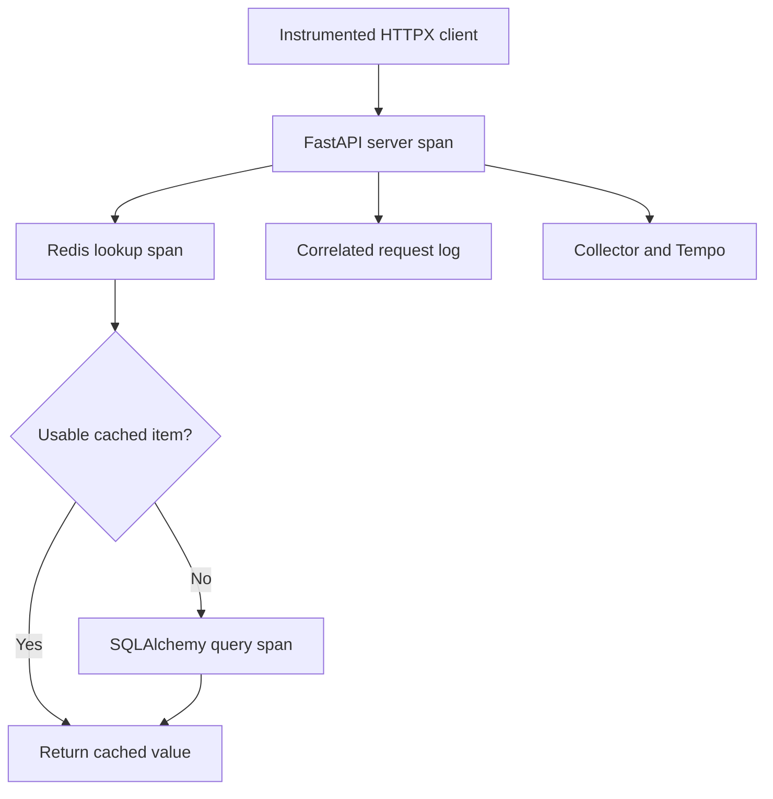

# Lab 34: Automatic FastAPI, SQLAlchemy, and Redis Instrumentation

## 1. Purpose and Learning Outcomes

**In Plain Language:** You will enable automatic tracing for the application and its dependency clients. Compare a forced cache miss with a prompt warm read and explain the operations visible in each trace. Then connect the stored trace to the corresponding JSON request record, checking both identity and the absence of fields the telemetry contract excludes.

> **Primary Objective:** Enable the existing framework and dependency instrumentation, add supported HTTPX instrumentation, and explain different trace shapes for a cache miss and hit.

Automatic instrumentation observes framework or client-library operations without adding span code to every route. It does not automatically understand business intent, and it should not duplicate an existing instrumentation layer.

This lab enables the repository's existing `Telemetry` implementation and instruments a real HTTPX client. You will compare a cold and warm GET for one lab-owned item, locate framework/dependency scopes, verify privacy filters and correlate completion logs with trace IDs. No new downstream service is introduced until Lab 35; the HTTPX probe here runs as a short-lived client process.

## 2. Starting Point and Lab Map

Use this guide inside the complete application repository. Run commands from the repository root in Bash unless a step says otherwise. Work through the starting checks in order; they load the helpers and state this lab needs.

Read the explanation before each step, run one complete code block at a time, and compare the actual result with the stated expectation. Save commands, observations, explanations, and unexpected results in your notebook.

### Key Terms

| **Term**                  | **Plain-Language Meaning**                                                              |
| ------------------------- | --------------------------------------------------------------------------------------- |
| Automatic instrumentation | Library integrations that create spans around supported framework or client operations. |
| Span kind                 | The role of an operation, such as SERVER, CLIENT, or INTERNAL.                          |
| Instrumentation owner     | The single setup path responsible for enabling an integration.                          |

### Lab Map

The arrows show the flow or dependency being studied. Branches identify paths to compare; this is a conceptual map, not a captured runtime trace.



## 3. Guided Walkthrough

### Step 01. Inherited State and Starting Checks

**What You Are Doing:** Start with the verified manual trace path and recovered log delivery. Automatic instrumentation should add application observations without changing the established business dependencies.

**Practical Walkthrough:** Check the manual trace canary and current log path before instrumenting the app. Preserve database, Redis, and persistent data state. The new spans should describe existing request behavior, so a business regression must be diagnosed separately from a missing instrumentation record.

Confirm the manual canary still reaches Tempo and fresh logs reach Loki before enabling application tracing. Preserve data-service state. A failed business request and a missing trace are different symptoms, so retain independent API evidence while introducing the new automatic spans.

Complete [Lab 33](Lab-33.md) first. Run every command from the repository root in the same Bash session. Retain the credentials, named volumes and existing application checkpoint item.

```bash
source lab-notes/session.sh
source lab-notes/evidence.sh
source lab-notes/metrics-session.sh
source lab-notes/platform-session.sh
load_app_settings
start_lab 34
dp config --quiet
dp ps -a
wait_ready
wait_backend loki:3100 /ready
wait_backend otel-collector:13133 /
```

`dp` is the stage-aware Compose helper introduced in Lab 31. It reads the same project and named volumes, adding only the overlays that exist. Use it throughout these labs: running plain `docker compose up` would enable the original full-stack settings instead of the learning stage. `start_lab` creates a fresh evidence directory and sets `LAB_DIR`; keep that directory for this run.

```bash
source lab-notes/traces-session.sh
wait_backend tempo:3200 /ready
cp app/requirements.in "$LAB_DIR/requirements.in.before"
cp app/requirements-dev.in "$LAB_DIR/requirements-dev.in.before"
cp app/requirements.txt "$LAB_DIR/requirements.txt.before"
cp app/requirements-dev.txt "$LAB_DIR/requirements-dev.txt.before"
cp app/app/telemetry.py "$LAB_DIR/telemetry.py.before"
```

Twelve services and nine scrape jobs should be active. Review `app/app/telemetry.py`: it already creates a resource and provider, a bounded batch processor, FastAPI instrumentation, SQLAlchemy instrumentation on `engine.sync_engine`, and Redis instrumentation on the pooled client. It passes a no-op meter provider where supported so Prometheus remains the owner of application metrics.

**Understanding the Result:** Known transport health narrows later investigation to application setup, sampling, or the specific request path.

### Step 02. Learning Objectives and Predicted Trace Shapes

**What You Are Doing:** Predict the cold and warm trace shapes from the cache behavior already tested. An absent item query can be the expected cache-hit path, not missing instrumentation.

**Practical Walkthrough:** Predict a cold read through cache lookup and PostgreSQL, then a warm read satisfied from cache. Identify which SQL work should disappear on the second path. A trace with fewer spans can be correct when the application performs less work, so use cache evidence to interpret structure.

Predict the cold and warm request trees using the known cache contract. Identify the SQL lookup expected only on the cold path and the Redis operation shared by both. A smaller warm trace can reflect avoided work, so span count alone is not a completeness test.

You will distinguish server/client/internal spans, recognize instrumentation scopes, explain why an async SQLAlchemy engine instruments its synchronous proxy, and compare dependency calls without treating every slow HTTP request as slow SQL.

| **Layer**                         | **Cold GET**                                         | **Warm GET**              |
| --------------------------------- | ---------------------------------------------------- | ------------------------- |
| Probe's instrumented HTTPX client | HTTP client span                                     | HTTP client span          |
| FastAPI                           | Server span                                          | Server span               |
| Existing `items.get` block        | Internal application span                            | Internal application span |
| Redis                             | Cache lookup; normally cache population after a miss | Cache lookup              |
| PostgreSQL/SQLAlchemy             | Item lookup on a miss                                | Normally no item query    |

**Prediction Checkpoint:** the warm request should return the same item, have a Redis lookup, and avoid the item database read. Its latency may be lower, but two requests are not statistically reliable latency evidence. Trace structure is the primary comparison.

The existing Items custom spans predate these labs. You are inspecting them, not extending business-span design; that is Lab 36. Excluding health URLs from FastAPI server instrumentation does not necessarily suppress separate Redis/SQL spans created by background probes. Compare the two known trace IDs rather than counting every span in the backend.

**Understanding the Result:** Missing work and missing instrumentation are different explanations. The controlled cold/warm pair distinguishes them.

### Step 03. Add the HTTPX Runtime Integration and Regenerate Locks

**What You Are Doing:** Add the matching HTTPX runtime integration and regenerate both lock files. The selected compatible package family matters more than independently choosing a latest version.

**Practical Walkthrough:** Add the compatible HTTPX instrumentation package and regenerate both supplied lock files through the documented workflow. Keep the selected OpenTelemetry family aligned rather than independently upgrading one package. The client integration is needed for outgoing HTTP spans and propagation, not for changing business logic.

Distinguish the dependency declaration from the generated locks: the declaration expresses the requested package constraint, while the locks record the resolved environment used by the build workflow. Review both lock diffs and the subsequent build result. Finding the package name in a source file alone does not establish that the running image contains the new integration.

```bash
python3 - <<'PYTHON'
from pathlib import Path
p=Path('app/requirements.in'); text=p.read_text()
for requirement in ['httpx==0.28.1','opentelemetry-instrumentation-httpx==0.65b0']:
    if requirement not in text.splitlines(): text += '\n'+requirement+'\n'
p.write_text(text)
PYTHON
docker run --rm --user "$(id -u):$(id -g)"   -v "$PWD/app:/work" -w /work python:3.12.14-slim-bookworm   sh -ec 'python -m venv /tmp/locks && /tmp/locks/bin/pip install --no-cache-dir pip-tools==7.5.0 && /tmp/locks/bin/pip-compile --generate-hashes --resolver=backtracking --output-file=requirements.txt requirements.in && /tmp/locks/bin/pip-compile --generate-hashes --resolver=backtracking --output-file=requirements-dev.txt requirements-dev.in'
```

HTTPX was previously a test dependency. It becomes a runtime dependency because the next lab makes a real outbound application call. The instrumentation pin matches the repository's 0.65b0 family; do not install a random latest version beside SDK 1.44.0. Regenerating both lock files retains the Dockerfile's hash-checked installation. The temporary lock container has no application credentials and writes the mounted files as your host UID.

Review the dependency diff before building. If your package index cannot supply a pin, stop at this compatibility gate and verify the available release family; do not bypass `--require-hashes`, copy invented hashes, or silently mix instrumentation versions.

**Understanding the Result:** Dependency files must agree with the runtime environment. A source import alone does not install the integration inside the rebuilt image.

### Step 04. Enable One Instrumentation Owner

**What You Are Doing:** Enable the existing instrumentation setup once and recreate the app for changed environment. A second setup mechanism could produce duplicate spans or confusing ownership.

**Practical Walkthrough:** Enable the existing instrumentation setup once and recreate the app for changed environment settings. Follow the application's provider and lifecycle ownership instead of adding another automatic setup mechanism. Duplicate setup can create overlapping spans or conflicting providers that make traces harder to interpret.

Locate the existing provider and instrumentation owner before enabling the configuration. Recreate the app for changed environment settings and verify the running state. Adding a second automatic setup path could instrument the same operation twice, so one owner should control initialization and shutdown.

```bash
cat > lab-notes/compose.auto-tracing.yaml <<'YAML'
services:
  app:
    environment:
      OTEL_ENABLED: "true"
      OTEL_EXPORTER_OTLP_ENDPOINT: http://otel-collector:4317
      TRACE_SAMPLE_RATIO: "1.0"
      PYROSCOPE_ENABLED: "false"
      OTEL_PROPAGATORS: tracecontext
YAML
```

**Command Note:** `<<'YAML'` writes the following block literally until `YAML`. Quoting the delimiter prevents Bash from expanding `$variables` inside the generated file; creation and execution are separate steps.

```bash
dp config --quiet
dp build app
dp up -d --no-deps --force-recreate app
wait_ready
dp exec -T app python - <<'PYTHON'
from importlib.metadata import version
from app.config import Settings
s=Settings()
assert s.otel_enabled and s.trace_sample_ratio==1.0 and not s.pyroscope_enabled
for name, expected in [('opentelemetry-sdk','1.44.0'),('opentelemetry-instrumentation-httpx','0.65b0'),('httpx','0.28.1')]:
    actual=version(name); print(name,actual); assert actual==expected
print('Tracing enabled; profiles remain disabled')
PYTHON
```

A recreate is required because `restart` does not reread changed container environment. One process still runs one Uvicorn worker. Preserve the app's ordinary readiness behavior; Tempo is not a required business dependency.

Do not additionally wrap Uvicorn in `opentelemetry-instrument`. The code already owns instrumentation and provider creation. Double wrapping can create duplicate spans, conflicting providers and confusing metrics. `ParentBased(TraceIdRatioBased(1.0))` keeps these small learning traces; the repository still supports configurable sampling for later labs.

**Understanding the Result:** One clear initialization owner makes the resulting spans explainable. Confirm the new process uses the intended environment.

### Step 05. Create One Item and Force One Cache Miss

**What You Are Doing:** Create one disposable item and remove only its cache key. This establishes a known miss without deleting the authoritative row.

**Practical Walkthrough:** Create the disposable item and delete only its cache key before the first read. The authoritative database row must remain so the cold path can refill successfully. Avoid broad cache flushes or deleting the item, which would change the experiment's meaning.

Verify successful creation and extract the returned UUID before deleting its exact derived key. Keep the PostgreSQL row intact. The JSON includes the required `price` as well as the descriptive fields. Check for a valid ID before proceeding, because a validation error would leave both cold and warm trace comparisons without a usable fixture.

```bash
api -fsS -X POST "$APP_URL/api/v1/items" -H 'Content-Type: application/json'   -d '{"name":"lab34-trace-item","description":"temporary tracing comparison","price":"34.00"}'   > "$LAB_DIR/item.json"
TRACE_ITEM_ID=$(jq -er '.id' "$LAB_DIR/item.json")
TRACE_CACHE_KEY=$(cache_key "$TRACE_ITEM_ID")
rcli DEL "$TRACE_CACHE_KEY"
```

`DEL` targets exactly the lab-owned item's namespaced cache key. It does not remove PostgreSQL state or flush other users' cached data. Creation may already have invalidated the key, so Redis can return 0; either 0 or 1 is consistent with the next GET being a miss.

The existing cache TTL is short. Run the next two reads together before expiration. Avoid a concurrent client updating/deleting this item.

**Understanding the Result:** A missing cache entry and a missing database row are different states. Verify the intended cold-cache fixture.

### Step 06. Generate Two Automatically Instrumented Client Requests

**What You Are Doing:** Send two requests through the instrumented client, keeping the second within the intended warm-cache interval. The client integration creates its span and propagates trace context.

**Practical Walkthrough:** Send the two instrumented client requests in order, keeping the second inside the warm-cache interval. Save response and trace identities for each. The client integration creates outgoing context and spans automatically, so the stored trace should connect client and server work without manually fabricating parent IDs.

Run the two client requests in order and preserve each response and trace ID separately. Keep the second inside the cache lifetime without intervening mutation. The HTTPX instrumentation should create the outgoing span and context, so parentage must be verified from the resulting trace rather than invented manually.

```bash
cat > lab-notes/tracing/trace_client.py <<'PYTHON'
"""Instrument one real HTTPX client. One output row per request, no sensitive response bodies."""
import argparse, json, os, socket, uuid
import httpx
from opentelemetry.exporter.otlp.proto.grpc.trace_exporter import OTLPSpanExporter
from opentelemetry.instrumentation.httpx import HTTPXClientInstrumentor
from opentelemetry.metrics import NoOpMeterProvider
from opentelemetry.sdk.resources import Resource
from opentelemetry.sdk.trace import TracerProvider
from opentelemetry.sdk.trace.export import BatchSpanProcessor
from opentelemetry.sdk.trace.sampling import ParentBased, TraceIdRatioBased

parser=argparse.ArgumentParser()
parser.add_argument('path'); parser.add_argument('--count', type=int, default=1)
args=parser.parse_args()
assert args.path.startswith('/api/v1/') and 1 <= args.count <= 5
provider=TracerProvider(resource=Resource.create({
    'service.name':'lab-http-client','service.version':'1.0.0',
    'deployment.environment.name':os.environ.get('ENVIRONMENT','local'),'service.instance.id':socket.gethostname()}),
    sampler=ParentBased(TraceIdRatioBased(1.0)))
provider.add_span_processor(BatchSpanProcessor(OTLPSpanExporter(endpoint='http://otel-collector:4317',insecure=True,timeout=3),schedule_delay_millis=500))
context={}
def request_hook(span, request):
    context['trace_id']=f'{span.get_span_context().trace_id:032x}'
    context['client_span_id']=f'{span.get_span_context().span_id:016x}'
try:
    with httpx.Client(base_url='http://app:8000', timeout=5, trust_env=False) as client:
        HTTPXClientInstrumentor.instrument_client(client,tracer_provider=provider,meter_provider=NoOpMeterProvider(),request_hook=request_hook)
        for _ in range(args.count):
            request_id='tracing-'+uuid.uuid4().hex[:16]
            response=client.get(args.path,headers={'X-Request-ID':request_id})
            print(json.dumps({**context,'request_id':request_id,'status':response.status_code,'returned_id':response.headers.get('X-Request-ID')}),flush=True)
            assert response.status_code==200 and response.headers.get('X-Request-ID')==request_id
        HTTPXClientInstrumentor.uninstrument_client(client)
    assert provider.force_flush(timeout_millis=5000), 'SDK flush timeout'
finally:
    provider.shutdown()
PYTHON
```

```bash
dp exec -T app python - "/api/v1/items/$TRACE_ITEM_ID" --count 2   < lab-notes/tracing/trace_client.py > "$LAB_DIR/client-traces.jsonl"
cat "$LAB_DIR/client-traces.jsonl"
COLD_TRACE=$(sed -n '1p' "$LAB_DIR/client-traces.jsonl" | jq -er '.trace_id')
WARM_TRACE=$(sed -n '2p' "$LAB_DIR/client-traces.jsonl" | jq -er '.trace_id')
fetch_trace "$COLD_TRACE" "$LAB_DIR/cold-trace.json"
fetch_trace "$WARM_TRACE" "$LAB_DIR/warm-trace.json"
python3 lab-notes/tracing/inspect_trace.py "$LAB_DIR/cold-trace.json" > "$LAB_DIR/cold-spans.json"
python3 lab-notes/tracing/inspect_trace.py "$LAB_DIR/warm-trace.json" > "$LAB_DIR/warm-spans.json"
```

The probe instruments one HTTPX client instance using the supported `HTTPXClientInstrumentor` API. Instrumentation creates the client span and injects W3C context; the request hook only records IDs for verification. A private tracer provider identifies the emitting probe as `lab-http-client`, distinct from the server process even though this diagnostic client runs through `docker exec`.

The normal application server extracts the propagated context. A new client span begins a trace for each GET because the probe has no enclosing current span. No manually copied `traceparent` string is needed.

**Understanding the Result:** Timing matters to the cache comparison. If the TTL expires, reestablish the fixture rather than calling the resulting SQL span unexpected.

### Step 07. Read the Cold and Warm Traces as Evidence

**What You Are Doing:** Inspect scopes, span kinds, and parent relationships in both traces. Relate actual Redis and SQL operations to the observed cache state instead of relying only on span names.

**Practical Walkthrough:** Inspect instrumentation scope, span kind, and parent ID alongside operation names. Compare Redis and SQL spans with the known cold and warm behavior. Names alone can be ambiguous; structural fields reveal which library created a span and how it fits into the request.

Compare span kind, instrumentation scope, IDs, and parent edges for the two traces. Relate SQL presence or absence to the independently established cache state. Names help navigation, but structural fields provide stronger evidence about which library produced the span and where it belongs in execution.

```bash
python3 - "$LAB_DIR/cold-spans.json" "$LAB_DIR/warm-spans.json" <<'PYTHON'
import json,sys
for file in sys.argv[1:]:
    rows=json.load(open(file))
    sql=[r for r in rows if 'sqlalchemy' in r['scope']]
    redis=[r for r in rows if 'redis' in r['scope']]
    httpx=[r for r in rows if 'httpx' in r['scope']]
    server=[r for r in rows if r['kind'] in (2,'SPAN_KIND_SERVER')]
    assert server and redis and httpx, 'Allow async batches to arrive; re-fetch before diagnosing'
    print(file, {'spans':len(rows),'sqlalchemy':len(sql),'redis':len(redis),'httpx':len(httpx),'server':len(server)})
    for row in rows:
        print(' ',row['service'],row['scope'],row['name'],round(row['duration_ms'],3),row['parent_span_id'])
PYTHON
```

**Expected Result:** both have an HTTPX CLIENT span, a FastAPI SERVER span, a Redis operation and the inherited `items.get` span. The cold trace normally includes SQLAlchemy spans; the warm trace normally does not include an item query. Connection spans or semantic-convention names can vary—use scope and attributes as well as the displayed span name.

If either trace is partial, fetch it again after a few seconds and regenerate its span table. If the warm trace queries PostgreSQL, investigate TTL expiration, Redis failure, serialization rejection or a concurrent invalidation. A trace is an observation of what happened; it is not obliged to match your prediction.

Open both IDs in Grafana. SQLAlchemy instruments `database.engine.sync_engine` because SQLAlchemy's async layer adapts the underlying engine's event hooks. The engine/pool is still created once, not per request. Redis instrumentation wraps the existing pooled client; it does not create a second cache connection strategy.

Do not sum every span duration to estimate wall time: parent and child spans overlap, and concurrent spans can overlap one another.

**Understanding the Result:** A warm hit may legitimately omit the item query. Verify actual operations rather than expecting equal span counts.

### Step 08. Prove Log Correlation and Stored-Trace Privacy

**What You Are Doing:** Join the completion record to the same trace and server span, then inspect retained fields. Correlation and privacy checks both require looking at stored evidence.

**Practical Walkthrough:** Find the completion record with the saved request context and compare its trace and server-span IDs with Tempo. Then inspect retained fields for the privacy contract. Correlation correctness and safe field content are separate checks, both requiring actual stored evidence.

Match the completion record's trace ID and active server-span ID with retrieved Tempo spans. Then inspect retained attributes against the stated privacy contract. Correct correlation does not prove safe content, and redacted content alone does not prove the log points to the right request span.

```bash
SCOPE=$(log_select)
TRACE_LOG_QUERY="$SCOPE | json tid="trace_id",event="event_name" | __error__="" | tid="$COLD_TRACE" | event="request_completed""
for attempt in {1..45}; do
  backend loki:3100 /loki/api/v1/query_range query "$TRACE_LOG_QUERY" since 10m limit 100     > "$LAB_DIR/correlated-log.json"
  if jq -e '[.data.result[].values[]]|length>0' "$LAB_DIR/correlated-log.json" >/dev/null; then break; fi
  sleep 1
done
jq -e '[.data.result[].values[]]|length>0' "$LAB_DIR/correlated-log.json"
python3 - "$LAB_DIR/cold-spans.json" "$LAB_DIR/warm-spans.json" <<'PYTHON'
import json,sys
for path in sys.argv[1:]:
    for span in json.load(open(path)):
        prohibited={'db.statement','db.query.text','http.url','http.target','url.full','url.query'}
        assert not prohibited.intersection(span['attributes']), span['name']
print('Selected sensitive attribute keys absent from stored span attributes')
PYTHON
```

Compare the record's request ID to the client ledger, its trace ID to Tempo, and its span ID to the server span table. The formatter reads active context; no logging SDK transport was added. Request IDs remain human-facing request correlation, while trace/span IDs encode execution relationships.

The privacy check covers the selected span-attribute keys only. It does not prove arbitrary data cannot leak through resource attributes, span names, events or logs. Do not use real credentials or sensitive request bodies in exercises.

**Understanding the Result:** A working log-to-trace join does not automatically establish redaction. Check the record contents as well as the identifiers.

### Step 09. Add Practical Logs-to-Traces Navigation

**What You Are Doing:** Add a Grafana link from the log's trace ID to Tempo and test it. A broken navigation expression is a different issue from a trace that cannot be retrieved by ID.

**Practical Walkthrough:** Add the Grafana derived link using the log's trace ID and test it with the known stored trace. Compare failed navigation with direct Tempo lookup. If direct lookup succeeds, investigate the extraction or link configuration rather than repeating application requests to repair the trace.

Open the matching completion record and compare the identifier extracted by the derived field with the complete trace ID already saved for that request. Follow the link and verify the destination uses the intended Tempo data source. A blank extraction, truncated ID, wrong source UID, and unavailable backend are separate failure points that should be checked in that order.

```bash
lab-notes/.tools/bin/python - <<'PYTHON'
from pathlib import Path
import yaml
root=Path('config/grafana/learning/provisioning/datasources')
found=[]
for path in root.glob('*.y*ml'):
    config=yaml.safe_load(path.read_text())
    for source in config.get('datasources',[]):
        if source.get('uid')=='loki':
            fields=source.setdefault('jsonData',{}).setdefault('derivedFields',[])
            fields[:]=[f for f in fields if f.get('name')!='TraceID']
            fields.append({'name':'TraceID','datasourceUid':'tempo',
                'matcherRegex':r'"trace_id"\s*:\s*"([0-9a-f]{32})"','url':'$${__value.raw}'})
            found.append(path)
            path.write_text(yaml.safe_dump(config,sort_keys=False))
assert len(found)==1, 'Expected exactly one active Loki datasource UID'
print(found[0])
PYTHON
dp restart grafana
wait_grafana
```

In Loki Explore, search the correlated completion record and expand it. The `TraceID` derived field should navigate to Tempo. The doubled dollar sign preserves Grafana's field expression through provisioning environment expansion. If the link fails, copy the exact ID into Tempo manually to separate datasource navigation from trace delivery.

**Understanding the Result:** Navigation is a separate user-interface layer. A broken link does not necessarily mean missing backend data.

### Step 10. Cleanup, Recovery, and Troubleshooting

**What You Are Doing:** Delete only the exercise item and confirm normal signals and readiness. Keep automatic tracing enabled for the cross-service propagation lab.

**Practical Walkthrough:** Delete only the disposable item and its scoped test state, then check readiness, fresh logs, and a new trace. Retain automatic instrumentation and the trace infrastructure because the next lab extends propagation to another service. Preserve the course checkpoint item.

Delete only the disposable tracing fixture and verify the protected checkpoint remains usable. Send a fresh request and check both log and trace delivery. Retain the approved automatic instrumentation and infrastructure so the next lab can extend the known path across a second service boundary.

```bash
api -fsS -X DELETE "$APP_URL/api/v1/items/$TRACE_ITEM_ID" -o /dev/null
wait_ready
pq 'up{job="fastapi"}' > "$LAB_DIR/fastapi-up-after.json"
make test
```

Only the lab-owned item is deleted. The application keeps tracing enabled for Lab 35. Existing database migrations, dependency behavior and Prometheus instrumentation are unchanged.

| **Symptom**                           | **Diagnostic Path**                                                                             |
| ------------------------------------- | ----------------------------------------------------------------------------------------------- |
| Instrumentation import fails          | Check matching locked packages inside the rebuilt image; a host pip install does not change it. |
| Duplicate server or Redis spans       | Remove an extra CLI/bootstrap wrapper; keep the existing code-owned provider.                   |
| SQL spans missing on a cold read      | Verify cache key/TTL and stored trace completeness before altering instrumentation.             |
| Warm read includes SQL                | Check Redis degradation, key invalidation and elapsed time.                                     |
| Completion log lacks trace ID         | Confirm app environment was recreated and the logger runs inside the active server context.     |
| Trace ID exists in logs but not Tempo | Sampling/export/storage can discard spans; a valid context does not guarantee retention.        |
| Outgoing HTTPX client adds metrics    | Ensure the no-op meter provider is passed and no metric exporter was added.                     |

If tracing causes a startup problem, move `compose.auto-tracing.yaml` out of the active path, recreate the app and prove readiness. Restore the saved requirement files and rebuild only when rolling back the added dependency. Do not remove unrelated application changes.

Upstream API references: [FastAPI](https://opentelemetry-python-contrib.readthedocs.io/en/latest/instrumentation/fastapi/fastapi.html), [SQLAlchemy](https://opentelemetry-python-contrib.readthedocs.io/en/latest/instrumentation/sqlalchemy/sqlalchemy.html), [Redis](https://opentelemetry-python-contrib.readthedocs.io/en/latest/instrumentation/redis/redis.html), and [HTTPX](https://opentelemetry-python-contrib.readthedocs.io/en/latest/instrumentation/httpx/httpx.html) instrumentation.

**Understanding the Result:** Cleanup removes the fixture, not the capability just added. Finish with normal business and signal paths verified.

## 4. Troubleshooting and Diagnosis

Start with the first unexpected result. Record the exact symptom, identify which component produced it, and use the checks below before repeating the experiment. After a fix, repeat the original check and confirm recovery.

Use the recovery and troubleshooting checks in Step 10.

## 5. Review and Practice

Answer the knowledge questions in your own words before reading the answer guide. For the scenario, name the evidence you would collect and the conclusion each observation would support.

### Knowledge Check

1. Why instrument sync_engine for an async SQLAlchemy engine?
2. Why should a warm GET normally lack item SQL?
3. Does summing span durations give response latency?
4. Can a trace ID in a log exist without a retained trace?

#### Answer Guide

1. SQLAlchemy async operations use the underlying synchronous engine event interface.
2. Redis should return the cached representation before a database lookup.
3. No; nested and concurrent spans overlap.
4. Yes; sampling and delivery/storage failures can remove the trace.

### Professional Scenario Exercise

A teammate observes a slow warm GET and proposes increasing PostgreSQL pool size. Use the actual span tree, cache result and HTTP client/server durations to decide whether that change addresses the observed delay. State what additional evidence you would require.

## 6. Completion Checklist

Mark each item only after you can point to its result or evidence file. Complete any cleanup shown here before moving on.

### Observable Completion Criteria

- [ ] Runtime pins and exactly one instrumentation owner were verified.
- [ ] A lab-owned item produced cold and warm trace evidence with client/framework/dependency spans.
- [ ] Actual cache behavior was explained rather than inferred from latency alone.
- [ ] A completion log correlates with the retrieved trace.
- [ ] The selected stored attributes pass the redaction check and the lab-owned item was cleaned up.

## 7. Production Context and Next Lab

### Production Implications

Automatic instrumentation provides consistent library-level boundaries, not a complete business model. Control capture, sample deliberately, watch overhead and prevent duplicate bootstrap. Rebuilding with coherent locks is part of instrumentation maintenance. Health-route exclusion and background dependency spans require separate consideration.

### End State and Transition

Twelve long-running services and nine scrape jobs remain. The Items app now exports traces through the Collector; HTTPX is a locked runtime dependency and the four existing dashboards remain. [Lab 35](Lab-35.md) adds a separate internal FastAPI service and proves W3C parentage across a real service boundary.
