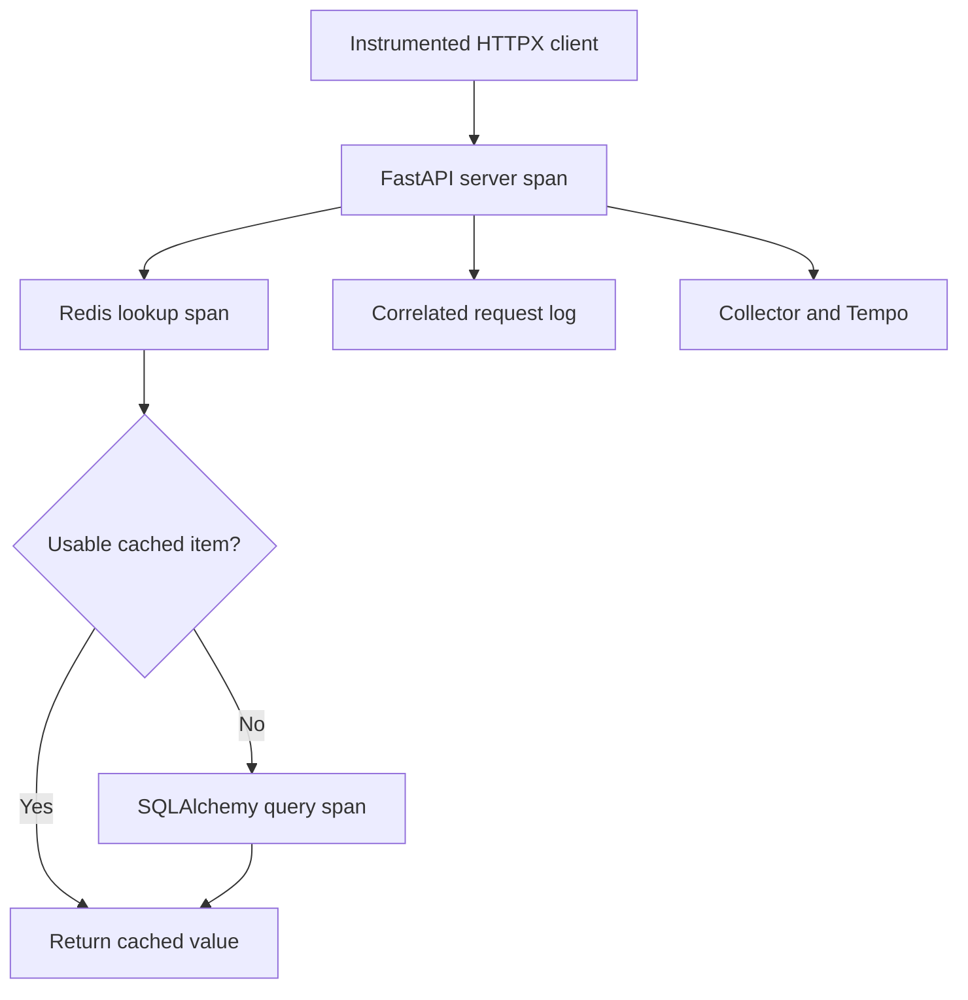

# Lab 34: Automatic FastAPI, SQLAlchemy, and Redis Instrumentation

## 1. Purpose and Learning Outcomes

You will enable automatic tracing for the application and the clients it uses to reach its dependencies. Force one cache miss, then immediately perform a warm read and compare the work shown in both traces. Finally, match each stored trace to its JSON request log and check that the fields excluded by the telemetry policy are absent.

> **Primary Objective:** Enable the existing framework and dependency instrumentation, add the supported HTTPX integration, and explain why a cache miss and a cache hit produce different trace structures.

Automatic instrumentation creates spans around supported framework and client-library operations, so you do not need to add span code to every route. It describes those technical operations, but it does not automatically know their business purpose. Enable each integration through one setup path to avoid duplicate instrumentation.

Enable the repository's existing `Telemetry` implementation and instrument a real HTTPX client. For one lab-owned item, compare cold and warm GET requests, identify the instrumentation that created each span, check privacy filters, and match completion logs to trace IDs. The HTTPX probe is a short-lived client process. A separate downstream service is added in Lab 35.

## 2. Starting Point and Lab Map

Open the complete application repository before using this guide. Unless a step says otherwise, run commands in Bash from the repository's top-level folder. Follow the starting checks in order because later commands depend on the helper functions and running services they prepare.

Read each explanation before running its commands. Run one complete code block, check the result, and then continue. In your notebook, save the commands, what happened, why you think it happened, and anything that differed from the expected result.

### Key Terms

| **Term**                  | **Explanation**                                                                                                                  |
| ------------------------- | -------------------------------------------------------------------------------------------------------------------------------- |
| Automatic instrumentation | Integrations that create spans around operations performed by supported frameworks and client libraries.                         |
| Span kind                 | The role a span represents, such as SERVER for handling a request, CLIENT for making one, or INTERNAL for work inside a process. |
| Instrumentation owner     | The one setup path responsible for enabling an integration and managing its lifecycle.                                           |

### Lab Map

The arrows show how the parts connect and where a request can take different paths. Use this map to understand the design. It is not a recording of a request that actually ran.



## 3. Guided Walkthrough

### Step 01. Inherited State and Starting Checks

**What You Are Doing:** Begin with verified manual trace transport and working log delivery. Automatic instrumentation should describe existing application work while preserving its established business dependencies.

**Practical Walkthrough:** Check the manual trace canary and a fresh log before enabling application tracing. Keep PostgreSQL, Redis, and persistent data intact. Save independent API results so you can distinguish a failed business operation from missing telemetry about an operation that succeeded.

Confirm that a manual canary reaches Tempo and fresh logs reach Loki. Preserve the data services while adding automatic spans. If something fails, compare the API result with the trace result: a missing trace and an unsuccessful request are different symptoms that need different checks.

Complete [Lab 33](Lab-33.md) first. Continue in the same Bash session from the repository root, retaining the credentials, named volumes, and checkpoint item.

```bash
source lab-notes/session.sh
source lab-notes/evidence.sh
source lab-notes/metrics-session.sh
source lab-notes/platform-session.sh
load_app_settings
start_lab 34
dp config --quiet
dp ps -a
wait_ready
wait_backend loki:3100 /ready
wait_backend otel-collector:13133 /
```

Use `dp`, the stage-aware Compose helper from Lab 31, throughout these labs. It keeps the same project and named volumes and includes only the overlays that exist. Plain `docker compose up` would activate the original full-stack settings instead of this learning stage. `start_lab` creates a new evidence directory and sets `LAB_DIR`; preserve that directory for this run.

```bash
source lab-notes/traces-session.sh
wait_backend tempo:3200 /ready
cp app/requirements.in "$LAB_DIR/requirements.in.before"
cp app/requirements-dev.in "$LAB_DIR/requirements-dev.in.before"
cp app/requirements.txt "$LAB_DIR/requirements.txt.before"
cp app/requirements-dev.txt "$LAB_DIR/requirements-dev.txt.before"
cp app/app/telemetry.py "$LAB_DIR/telemetry.py.before"
```

Expect twelve services and nine scrape jobs. Read `app/app/telemetry.py`: it already creates the resource, provider, and bounded batch processor. It also instruments FastAPI, SQLAlchemy through `engine.sync_engine`, and the pooled Redis client. Where supported, it supplies a no-op meter provider, which does not record metrics, so Prometheus remains the owner of application metrics.

**Understanding the Result:** Verified transport narrows a later missing-trace investigation to application setup, sampling, or the particular request path. Keep the transport canary as evidence for that baseline.

### Step 02. Learning Objectives and Predicted Trace Shapes

**What You Are Doing:** Predict the cold and warm traces from the cache behavior you already tested. A warm hit should avoid the item database query, so its absence may show correct behavior rather than missing instrumentation.

**Practical Walkthrough:** Predict a cold read that checks Redis and then queries PostgreSQL. Predict a warm read that returns the cached item. Identify which SQL work should disappear in the second trace. Fewer spans can mean less work was needed, so use cache evidence to interpret the difference.

Sketch the expected cold and warm request relationships using the known cache behavior. Both should contain a Redis lookup; the cold path should also contain the item SQL lookup. Do not use equal span counts as a completeness check when the two requests intentionally do different work.

You will distinguish server, client, and internal spans and identify the scopes that produced them. You will explain why an asynchronous SQLAlchemy engine is instrumented through its synchronous proxy and compare dependency calls without assuming that every slow HTTP request is caused by slow SQL.

| **Layer**                         | **Cold GET**                                                      | **Warm GET**                           |
| --------------------------------- | ----------------------------------------------------------------- | -------------------------------------- |
| Probe's instrumented HTTPX client | A span for the outgoing HTTP request                              | A span for the outgoing HTTP request   |
| FastAPI                           | A server span for handling the request                            | A server span for handling the request |
| Existing `items.get` block        | An internal span for application work                             | An internal span for application work  |
| Redis                             | Cache lookup, usually followed by cache population after the miss | Cache lookup                           |
| PostgreSQL/SQLAlchemy             | Item lookup after the cache miss                                  | Normally no query for the item         |

**Prediction Checkpoint:** The warm request should return the same item, perform a Redis lookup, and avoid reading the item from PostgreSQL. It may be faster, but two requests are not enough for a statistically reliable latency conclusion. Focus on the difference in trace structure.

The Items custom spans already exist; this lab inspects them, while Lab 36 extends their business meaning. Excluding health URLs from FastAPI server tracing does not necessarily stop separate Redis or SQL spans from background probes. Compare your two known trace IDs rather than every span stored in the backend.

**Understanding the Result:** Work that was avoided and work that was not instrumented are different explanations for an absent span. The controlled cache-miss and cache-hit pair helps you tell them apart.

### Step 03. Add the HTTPX Runtime Integration and Regenerate Locks

**What You Are Doing:** Add the HTTPX integration version that matches the existing OTel packages and regenerate both lock files. Keep the release family compatible instead of upgrading one package independently.

**Practical Walkthrough:** Add the compatible HTTPX instrumentation dependency, then use the documented process to regenerate both lock files. The integration provides outgoing HTTP spans and context propagation. It should not change the application's business logic or introduce a different OTel release family.

The dependency declaration states the package constraint you want. The generated locks record the resolved packages used by the build. Review both lock-file changes and the build result. Seeing an import or package name in source does not prove the running image contains the integration.

```bash
python3 - <<'PYTHON'
from pathlib import Path
p=Path('app/requirements.in'); text=p.read_text()
for requirement in ['httpx==0.28.1','opentelemetry-instrumentation-httpx==0.65b0']:
    if requirement not in text.splitlines(): text += '\n'+requirement+'\n'
p.write_text(text)
PYTHON
docker run --rm --user "$(id -u):$(id -g)"   -v "$PWD/app:/work" -w /work python:3.12.14-slim-bookworm   sh -ec 'python -m venv /tmp/locks && /tmp/locks/bin/pip install --no-cache-dir pip-tools==7.5.0 && /tmp/locks/bin/pip-compile --generate-hashes --resolver=backtracking --output-file=requirements.txt requirements.in && /tmp/locks/bin/pip-compile --generate-hashes --resolver=backtracking --output-file=requirements-dev.txt requirements-dev.in'
```

HTTPX moves from a test dependency to a runtime dependency because Lab 35 adds a real outbound application call. Its instrumentation pin matches the repository's 0.65b0 family beside SDK 1.44.0. Regenerate both lock files to preserve the Dockerfile's hash-checked installation. The temporary lock container receives no application credentials and writes the mounted files as your host UID.

Review the dependency changes before building. If the package index cannot provide a required pin, stop and check the compatible release family. Keep `--require-hashes`, use genuine generated hashes, and avoid silently mixing instrumentation versions.

**Understanding the Result:** The dependency declaration, lock files, and rebuilt image must agree. Adding a source import does not install the package inside a running container.

### Step 04. Enable One Instrumentation Owner

**What You Are Doing:** Enable the existing instrumentation setup once and recreate the app with its changed environment. Avoid a second setup mechanism that could create duplicate spans or competing providers.

**Practical Walkthrough:** Use the application's existing provider and lifecycle setup to enable tracing. Recreate the container so the changed environment takes effect. Keep one initialization and shutdown owner rather than adding another automatic bootstrap layer around the same operations.

Locate the existing provider and instrumentation owner first. Apply the environment change, recreate the app, and verify the new process. A second setup path could instrument the same operation twice, making span counts and parent relationships difficult to interpret.

```bash
cat > lab-notes/compose.auto-tracing.yaml <<'YAML'
services:
  app:
    environment:
      OTEL_ENABLED: "true"
      OTEL_EXPORTER_OTLP_ENDPOINT: http://otel-collector:4317
      TRACE_SAMPLE_RATIO: "1.0"
      PYROSCOPE_ENABLED: "false"
      OTEL_PROPAGATORS: tracecontext
YAML
```

**Command Note:** `<<'YAML'` writes the following block exactly as shown until the closing `YAML`. The quotes prevent Bash from expanding `$variables` inside the file being created. Writing the configuration and applying it are separate steps.

```bash
dp config --quiet
dp build app
dp up -d --no-deps --force-recreate app
wait_ready
dp exec -T app python - <<'PYTHON'
from importlib.metadata import version
from app.config import Settings
s=Settings()
assert s.otel_enabled and s.trace_sample_ratio==1.0 and not s.pyroscope_enabled
for name, expected in [('opentelemetry-sdk','1.44.0'),('opentelemetry-instrumentation-httpx','0.65b0'),('httpx','0.28.1')]:
    actual=version(name); print(name,actual); assert actual==expected
print('Tracing enabled; profiles remain disabled')
PYTHON
```

Recreate the container because `restart` does not reload a changed container environment. Continue using one Uvicorn worker in one process. Preserve ordinary business-readiness behavior: Tempo should not become a required dependency for serving Items requests.

Do not also wrap Uvicorn with `opentelemetry-instrument`. The application code already creates the provider and enables instrumentation. A second wrapper can cause duplicate spans, conflicting providers, and confusing metrics. `ParentBased(TraceIdRatioBased(1.0))` retains these small learning traces; later labs use the repository's configurable sampling support.

**Understanding the Result:** One setup owner makes initialization and the resulting spans easier to explain. Verify that the recreated process uses the intended tracing environment.

### Step 05. Create One Item and Force One Cache Miss

**What You Are Doing:** Create a disposable item and remove only its cache entry. Keep the authoritative database row so the next read is a known cache miss with valid data available in PostgreSQL.

**Practical Walkthrough:** Create the exercise item, then delete its exact cache key before reading it. The database row must remain available so the cold read can retrieve and cache it. A broad cache flush or deleted row would test a different situation.

Check that creation succeeded and extract the returned UUID before deriving the cache key. The JSON must include the required `price` along with its descriptive fields. If validation failed and no valid ID exists, fix creation first; otherwise the cold and warm trace comparison has no usable item.

```bash
api -fsS -X POST "$APP_URL/api/v1/items" -H 'Content-Type: application/json'   -d '{"name":"lab34-trace-item","description":"temporary tracing comparison","price":"34.00"}'   > "$LAB_DIR/item.json"
TRACE_ITEM_ID=$(jq -er '.id' "$LAB_DIR/item.json")
TRACE_CACHE_KEY=$(cache_key "$TRACE_ITEM_ID")
rcli DEL "$TRACE_CACHE_KEY"
```

`DEL` removes only the lab-owned item's namespaced cache key. PostgreSQL data and other users' cache entries remain untouched. Item creation may already have invalidated that key, so a Redis result of either 0 or 1 is consistent with the next GET being a miss.

The existing cache TTL is short. Run the next two reads together before it expires, and keep other clients from updating or deleting the exercise item between them.

**Understanding the Result:** A missing cache entry is different from a missing database row. Confirm that the item exists in PostgreSQL while its cache entry is absent before starting the cold read.

### Step 06. Generate Two Automatically Instrumented Client Requests

**What You Are Doing:** Send two requests through the instrumented HTTP client, keeping the second within the cache's warm interval. The integration creates a client span and sends trace context with the request.

**Practical Walkthrough:** Run the client requests in order and save each response and trace ID. Keep the second request inside the cache lifetime. HTTPX instrumentation should connect client and server work automatically, without you inventing or manually assigning parent IDs.

Preserve separate response and trace identities for the two reads. Avoid cache expiry or item changes between them. Then verify the actual parent relationships in the stored traces to confirm that the HTTPX integration created and propagated the expected context.

```bash
cat > lab-notes/tracing/trace_client.py <<'PYTHON'
"""Instrument one real HTTPX client. One output row per request, no sensitive response bodies."""
import argparse, json, os, socket, uuid
import httpx
from opentelemetry.exporter.otlp.proto.grpc.trace_exporter import OTLPSpanExporter
from opentelemetry.instrumentation.httpx import HTTPXClientInstrumentor
from opentelemetry.metrics import NoOpMeterProvider
from opentelemetry.sdk.resources import Resource
from opentelemetry.sdk.trace import TracerProvider
from opentelemetry.sdk.trace.export import BatchSpanProcessor
from opentelemetry.sdk.trace.sampling import ParentBased, TraceIdRatioBased

parser=argparse.ArgumentParser()
parser.add_argument('path'); parser.add_argument('--count', type=int, default=1)
args=parser.parse_args()
assert args.path.startswith('/api/v1/') and 1 <= args.count <= 5
provider=TracerProvider(resource=Resource.create({
    'service.name':'lab-http-client','service.version':'1.0.0',
    'deployment.environment.name':os.environ.get('ENVIRONMENT','local'),'service.instance.id':socket.gethostname()}),
    sampler=ParentBased(TraceIdRatioBased(1.0)))
provider.add_span_processor(BatchSpanProcessor(OTLPSpanExporter(endpoint='http://otel-collector:4317',insecure=True,timeout=3),schedule_delay_millis=500))
context={}
def request_hook(span, request):
    context['trace_id']=f'{span.get_span_context().trace_id:032x}'
    context['client_span_id']=f'{span.get_span_context().span_id:016x}'
try:
    with httpx.Client(base_url='http://app:8000', timeout=5, trust_env=False) as client:
        HTTPXClientInstrumentor.instrument_client(client,tracer_provider=provider,meter_provider=NoOpMeterProvider(),request_hook=request_hook)
        for _ in range(args.count):
            request_id='tracing-'+uuid.uuid4().hex[:16]
            response=client.get(args.path,headers={'X-Request-ID':request_id})
            print(json.dumps({**context,'request_id':request_id,'status':response.status_code,'returned_id':response.headers.get('X-Request-ID')}),flush=True)
            assert response.status_code==200 and response.headers.get('X-Request-ID')==request_id
        HTTPXClientInstrumentor.uninstrument_client(client)
    assert provider.force_flush(timeout_millis=5000), 'SDK flush timeout'
finally:
    provider.shutdown()
PYTHON
```

```bash
dp exec -T app python - "/api/v1/items/$TRACE_ITEM_ID" --count 2   < lab-notes/tracing/trace_client.py > "$LAB_DIR/client-traces.jsonl"
cat "$LAB_DIR/client-traces.jsonl"
COLD_TRACE=$(sed -n '1p' "$LAB_DIR/client-traces.jsonl" | jq -er '.trace_id')
WARM_TRACE=$(sed -n '2p' "$LAB_DIR/client-traces.jsonl" | jq -er '.trace_id')
fetch_trace "$COLD_TRACE" "$LAB_DIR/cold-trace.json"
fetch_trace "$WARM_TRACE" "$LAB_DIR/warm-trace.json"
python3 lab-notes/tracing/inspect_trace.py "$LAB_DIR/cold-trace.json" > "$LAB_DIR/cold-spans.json"
python3 lab-notes/tracing/inspect_trace.py "$LAB_DIR/warm-trace.json" > "$LAB_DIR/warm-spans.json"
```

The probe instruments one HTTPX client using the supported `HTTPXClientInstrumentor` API. The integration creates the client span and injects W3C context; the request hook only records IDs for checking. Its private tracer provider identifies the probe as `lab-http-client`, separate from the server process even though the probe runs through `docker exec`.

The application server extracts the context sent by the client. Because the probe has no surrounding current span, each GET starts a new trace through its client span. You do not need to copy a `traceparent` header manually.

**Understanding the Result:** The cache comparison depends on timing. If the TTL expires, set up the known cache-miss and warm-read pair again instead of assuming the resulting SQL span is an instrumentation error.

### Step 07. Read the Cold and Warm Traces as Evidence

**What You Are Doing:** Inspect scopes, span kinds, and parent IDs in both traces. Connect the observed Redis and SQL operations to the known cache state instead of relying only on displayed span names.

**Practical Walkthrough:** Read each span's scope, kind, and parent alongside its name. These fields show which library created the span and how it relates to the request. Compare Redis and SQL work with the predicted cold and warm paths.

Compare both traces using their IDs, parent links, span kinds, and instrumentation scopes. Use the independently established cache state to explain why SQL is present or absent. Names help you navigate, but the structural fields provide stronger evidence about who created each span and where it belongs.

```bash
python3 - "$LAB_DIR/cold-spans.json" "$LAB_DIR/warm-spans.json" <<'PYTHON'
import json,sys
for file in sys.argv[1:]:
    rows=json.load(open(file))
    sql=[r for r in rows if 'sqlalchemy' in r['scope']]
    redis=[r for r in rows if 'redis' in r['scope']]
    httpx=[r for r in rows if 'httpx' in r['scope']]
    server=[r for r in rows if r['kind'] in (2,'SPAN_KIND_SERVER')]
    assert server and redis and httpx, 'Allow async batches to arrive; re-fetch before diagnosing'
    print(file, {'spans':len(rows),'sqlalchemy':len(sql),'redis':len(redis),'httpx':len(httpx),'server':len(server)})
    for row in rows:
        print(' ',row['service'],row['scope'],row['name'],round(row['duration_ms'],3),row['parent_span_id'])
PYTHON
```

**Expected Result:** Both traces contain an HTTPX CLIENT span, a FastAPI SERVER span, a Redis operation, and the inherited `items.get` span. The cold trace normally includes SQLAlchemy work, while the warm trace normally has no item query. Connection spans and semantic-convention names may vary, so inspect scopes and attributes as well as names.

If a trace looks partial, wait a few seconds, retrieve it again, and regenerate its span table. If the warm request queried PostgreSQL, check cache expiry, Redis failure, serialization rejection, or concurrent invalidation. Explain what the trace records rather than forcing it to match the prediction.

Open both trace IDs in Grafana. SQLAlchemy instrumentation uses `database.engine.sync_engine` because the async layer adapts the underlying engine's event hooks. The engine and pool are still created once, not for every request. Redis instrumentation wraps the existing pooled client rather than introducing another connection strategy.

Do not add every span duration to calculate elapsed request time. Parent spans include time spent in children, and concurrent spans can overlap too, so summing them counts some time more than once.

**Understanding the Result:** A correct warm-cache hit can omit the item SQL query. Compare actual operations rather than expecting both traces to contain the same number of spans.

### Step 08. Prove Log Correlation and Stored-Trace Privacy

**What You Are Doing:** Match the completion log to its trace and server span, then inspect the stored fields. Correct correlation and correct privacy filtering are separate checks.

**Practical Walkthrough:** Find the completion record using the saved request identity. Compare its trace and server-span IDs with Tempo, then check its retained fields against the privacy policy. Both conclusions require actual stored evidence, not just configuration settings.

Match the completion record's trace ID and active server-span ID to the retrieved trace. Separately inspect retained attributes for excluded data. Correct IDs do not prove safe field contents, and redacted fields do not prove that a log points to the right span.

```bash
SCOPE=$(log_select)
TRACE_LOG_QUERY="$SCOPE | json tid="trace_id",event="event_name" | __error__="" | tid="$COLD_TRACE" | event="request_completed""
for attempt in {1..45}; do
  backend loki:3100 /loki/api/v1/query_range query "$TRACE_LOG_QUERY" since 10m limit 100     > "$LAB_DIR/correlated-log.json"
  if jq -e '[.data.result[].values[]]|length>0' "$LAB_DIR/correlated-log.json" >/dev/null; then break; fi
  sleep 1
done
jq -e '[.data.result[].values[]]|length>0' "$LAB_DIR/correlated-log.json"
python3 - "$LAB_DIR/cold-spans.json" "$LAB_DIR/warm-spans.json" <<'PYTHON'
import json,sys
for path in sys.argv[1:]:
    for span in json.load(open(path)):
        prohibited={'db.statement','db.query.text','http.url','http.target','url.full','url.query'}
        assert not prohibited.intersection(span['attributes']), span['name']
print('Selected sensitive attribute keys absent from stored span attributes')
PYTHON
```

Compare the log's request ID with the client ledger, its trace ID with Tempo, and its span ID with the server-span table. The formatter reads active context; this adds no logging SDK transport. Request IDs support human-facing request correlation, while trace and span IDs describe execution relationships.

This privacy check covers only the selected span-attribute keys. It does not prove that sensitive data is absent from every resource attribute, span name, event, or log. Use synthetic exercise data rather than real credentials or sensitive request bodies.

**Understanding the Result:** A working log-to-trace match proves correlation. Check the stored field contents separately before concluding that redaction also worked.

### Step 09. Add Practical Logs-to-Traces Navigation

**What You Are Doing:** Create and test a Grafana link from a log's trace ID to Tempo. A link-extraction problem is different from a backend that cannot retrieve the trace itself.

**Practical Walkthrough:** Add the derived link and try it with the known stored trace. If navigation fails, perform a direct Tempo lookup with the same ID. When direct lookup works, inspect the extraction and link configuration instead of sending more application traffic.

Expand the matching completion record and compare the derived field with the complete saved trace ID. Follow the link and check that it selects the intended Tempo data source. Check for blank extraction, a truncated ID, a wrong data-source UID, and an unavailable backend as separate possible failures.

```bash
lab-notes/.tools/bin/python - <<'PYTHON'
from pathlib import Path
import yaml
root=Path('config/grafana/learning/provisioning/datasources')
found=[]
for path in root.glob('*.y*ml'):
    config=yaml.safe_load(path.read_text())
    for source in config.get('datasources',[]):
        if source.get('uid')=='loki':
            fields=source.setdefault('jsonData',{}).setdefault('derivedFields',[])
            fields[:]=[f for f in fields if f.get('name')!='TraceID']
            fields.append({'name':'TraceID','datasourceUid':'tempo',
                'matcherRegex':r'"trace_id"\s*:\s*"([0-9a-f]{32})"','url':'$${__value.raw}'})
            found.append(path)
            path.write_text(yaml.safe_dump(config,sort_keys=False))
assert len(found)==1, 'Expected exactly one active Loki datasource UID'
print(found[0])
PYTHON
dp restart grafana
wait_grafana
```

In Loki Explore, find and expand the correlated completion record. The `TraceID` derived field should open Tempo. The doubled dollar sign protects Grafana's field expression from environment expansion during provisioning. If the link fails, paste the exact ID into Tempo manually to distinguish navigation failure from failed trace delivery.

**Understanding the Result:** Navigation adds a user-interface step on top of stored data. A broken link can occur even when the trace is present and directly retrievable.

### Step 10. Cleanup, Recovery, and Troubleshooting

**What You Are Doing:** Delete only the disposable exercise item and check readiness and fresh signals. Keep automatic tracing enabled for the next lab's cross-service propagation test.

**Practical Walkthrough:** Remove the exercise item and its scoped test state, then verify readiness, new logs, and a new trace. Preserve the course checkpoint item. Keep the instrumentation and trace infrastructure so the next lab can extend the same working path to another service.

Check that the protected checkpoint remains usable after deleting the disposable tracing item. Send a fresh request and verify log and trace delivery. Leave the approved automatic instrumentation active for the next lab.

```bash
api -fsS -X DELETE "$APP_URL/api/v1/items/$TRACE_ITEM_ID" -o /dev/null
wait_ready
pq 'up{job="fastapi"}' > "$LAB_DIR/fastapi-up-after.json"
make test
```

Only the lab-owned exercise item is deleted. Tracing remains enabled for Lab 35. The existing database migrations, dependency behavior, and Prometheus instrumentation remain unchanged.

| **Symptom**                           | **Diagnostic Path**                                                                                                              |
| ------------------------------------- | -------------------------------------------------------------------------------------------------------------------------------- |
| Instrumentation import fails          | Inspect matching locked packages inside the rebuilt image. Installing a package with pip on the host does not update that image. |
| Duplicate server or Redis spans       | Remove the extra CLI or bootstrap setup and keep the existing code-owned provider.                                               |
| SQL spans missing on a cold read      | Check the actual cache key, TTL, and trace completeness before changing instrumentation.                                         |
| Warm read includes SQL                | Investigate Redis degradation, cache-key invalidation, and time elapsed between reads.                                           |
| Completion log lacks trace ID         | Confirm that the app was recreated with the new environment and that logging happens inside the active server context.           |
| Trace ID exists in logs but not Tempo | Check sampling, export, and storage. Valid context can exist even when its spans are not retained.                               |
| Outgoing HTTPX client adds metrics    | Confirm that it receives the no-op meter provider and that no metric exporter was added.                                         |

If tracing prevents startup, move `compose.auto-tracing.yaml` out of the active path, recreate the application, and confirm readiness. Restore saved requirement files and rebuild only if you are also rolling back the added dependency. Preserve unrelated application changes.

For the upstream integration APIs, see the [FastAPI](https://opentelemetry-python-contrib.readthedocs.io/en/latest/instrumentation/fastapi/fastapi.html), [SQLAlchemy](https://opentelemetry-python-contrib.readthedocs.io/en/latest/instrumentation/sqlalchemy/sqlalchemy.html), [Redis](https://opentelemetry-python-contrib.readthedocs.io/en/latest/instrumentation/redis/redis.html), and [HTTPX](https://opentelemetry-python-contrib.readthedocs.io/en/latest/instrumentation/httpx/httpx.html) instrumentation references.

**Understanding the Result:** Cleanup removes the temporary item while retaining the tracing capability. Finish by verifying both normal business behavior and current signal delivery.

## 4. Troubleshooting and Diagnosis

Begin with the first result that differed from your prediction. Save the exact error or symptom and identify which service or command produced it. Use the checks below, make the needed fix, and repeat the original check to confirm the problem is resolved.

Use Step 10's troubleshooting and recovery checks, then repeat the failed check to confirm the repair.

## 5. Review and Practice

Answer the questions in your own words before reading the answers. For the scenario, say what you would inspect and exactly what each result would tell you.

### Knowledge Check

1. Why instrument sync_engine for an async SQLAlchemy engine?
2. Why should a warm GET normally lack item SQL?
3. Does summing span durations give response latency?
4. Can a trace ID in a log exist without a retained trace?

#### Answer Guide

1. SQLAlchemy's async operations use the underlying synchronous engine's event interface, so instrumentation attaches through that engine.
2. Redis should supply the cached representation before the application needs an item lookup in PostgreSQL.
3. No. Nested spans include overlapping time, and concurrent spans can overlap each other. Adding all durations would double-count some elapsed time.
4. Yes. Sampling can discard spans, and export or storage can fail after valid trace context has already been written to a log.

### Professional Scenario Exercise

A teammate sees a slow warm GET and suggests increasing the PostgreSQL pool size. Examine the actual span tree, cache result, and HTTP client/server durations. Explain whether the proposed change addresses the observed delay and what additional evidence you need before deciding.

## 6. Completion Checklist

Tick an item only when you can show its result or saved evidence. Finish the cleanup instructions before starting the next lab.

### Observable Completion Criteria

- [ ] Compatible runtime pins and exactly one instrumentation setup owner were verified.
- [ ] A lab-owned item produced cold and warm traces containing the expected client, framework, and dependency work.
- [ ] The cache behavior was explained using actual operations, not latency alone.
- [ ] A completion log matches the retrieved trace and its request identity.
- [ ] The selected stored attributes pass the redaction check, and the disposable item was removed.

## 7. Production Context and Next Lab

### Production Implications

Automatic instrumentation consistently records library-level operations, but it does not provide a complete description of business intent. Control which data is captured, choose sampling deliberately, monitor overhead, and prevent duplicate setup. Maintain compatible lock files when rebuilding. Treat excluded health routes and dependency spans created by background probes as separate considerations.

### End State and Transition

Keep twelve long-running services, nine scrape jobs, and the four existing dashboards. The Items app now exports traces through the Collector, and HTTPX is a locked runtime dependency. [Lab 35](Lab-35.md) adds a separate internal FastAPI service and verifies W3C parent-child relationships across a real service boundary.
