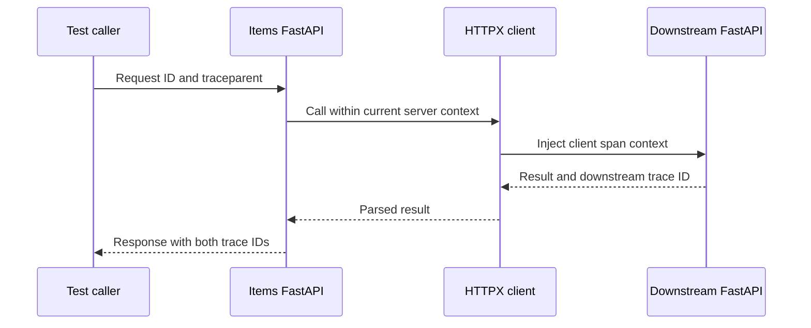

# Lab 35: Distributed Context Propagation

## Purpose and Scope

> **Primary Objective:** Follow one request across two running FastAPI services and prove the W3C client-to-server parent edge, then deliberately break and restore propagation.

A shared request ID helps find related records, but it does not encode a trace tree. Distributed tracing requires the current execution context to cross the network boundary and be extracted before the downstream server span begins.

This lab adds one small internal FastAPI service and a local-only demo route in the Items app. The services exchange bounded numeric input, use a pooled HTTP client and share no database credentials. You will prove the actual parent edge, remove incoming trace context at the downstream boundary, observe two traces despite one request ID, and restore propagation. Retries, business span events, baggage propagation and service graphs are excluded.

## 1. Inherited State and Starting Checks

Complete [Lab 34](Lab-34.md) first. Run every command from the repository root in the same Bash session. Retain the credentials, named volumes and existing application checkpoint item. 

```bash
source lab-notes/session.sh
source lab-notes/evidence.sh
source lab-notes/metrics-session.sh
source lab-notes/platform-session.sh
load_app_settings
start_lab 35
dp config --quiet
dp ps -a
wait_ready
wait_backend loki:3100 /ready
wait_backend otel-collector:13133 /
```

`dp` is the stage-aware Compose helper introduced in Lab 31. It reads the same project and named volumes, adding only the overlays that exist. Use it throughout these labs: running plain `docker compose up` would enable the original full-stack settings instead of the learning stage. `start_lab` creates a fresh evidence directory and sets `LAB_DIR`; keep that directory for this run.

```bash
source lab-notes/traces-session.sh
wait_backend tempo:3200 /ready
cp app/app/main.py "$LAB_DIR/main.py.before"
cp app/app/logging_config.py "$LAB_DIR/logging_config.py.before"
cp lab-notes/tracing/collector.yml "$LAB_DIR/collector.yml.before"
dp exec -T app python -c 'from opentelemetry.instrumentation.httpx import HTTPXClientInstrumentor; print("HTTPX integration is available")'
```

Complete the Lab 34 dependency compatibility gate before continuing. The app is already instrumented. Adding this route must preserve CRUD, migrations, readiness, cache fallback and the existing log/metric contracts.

## 2. Learning Objectives and the New Boundary

You will distinguish correlation from parentage, read W3C `traceparent`, show automatic injection/extraction, prove which client span parents the remote server span, and explain context trust at service boundaries.



The expected trace contains an upstream SERVER span, its HTTPX CLIENT child and the downstream SERVER child of that client span. `X-Request-ID` is forwarded explicitly for log investigation. W3C context is propagated by instrumentation; do not manually copy the inbound `traceparent` into the outgoing call, which would skip the new client span's identity.

`traceparent` has `version-trace_id-parent_id-flags`. This lab uses version `00`, a nonzero 32-hex trace ID, a nonzero 16-hex parent ID and sampled flag `01`. Trace flags are diagnostic context, never authentication or authorization.

## 3. Implement the Small Downstream Service

```bash
cat > app/app/downstream.py <<'PYTHON'
"""Small internal FastAPI service for a real, bounded HTTP propagation experiment."""
import asyncio
import json
import socket
from contextlib import asynccontextmanager
from datetime import datetime, timezone
from time import perf_counter
from typing import Annotated, Literal
from uuid import uuid4

from fastapi import FastAPI, Query, Request, Response
from opentelemetry import trace
from opentelemetry.exporter.otlp.proto.grpc.trace_exporter import OTLPSpanExporter
from opentelemetry.instrumentation.fastapi import FastAPIInstrumentor
from opentelemetry.metrics import NoOpMeterProvider
from opentelemetry.sdk.resources import Resource
from opentelemetry.sdk.trace import TracerProvider
from opentelemetry.sdk.trace.export import BatchSpanProcessor
from opentelemetry.sdk.trace.sampling import ParentBased, TraceIdRatioBased
from pydantic_settings import BaseSettings, SettingsConfigDict
from starlette.types import ASGIApp, Receive, Scope, Send

from app.logging_config import configure_logging
from app.middleware import SAFE_ID


class DownstreamSettings(BaseSettings):
    model_config = SettingsConfigDict(extra='ignore')
    service_name: Literal['lab-downstream'] = 'lab-downstream'
    environment: Literal['local', 'test'] = 'local'
    trust_trace_context: bool = True
    log_level: Literal['INFO', 'WARNING', 'ERROR'] = 'INFO'


class ContextBoundary:
    def __init__(self, app: ASGIApp, enabled: bool) -> None:
        self.app, self.enabled = app, enabled

    async def __call__(self, scope: Scope, receive: Receive, send: Send) -> None:
        if scope['type'] == 'http' and not self.enabled:
            scope = dict(scope)
            scope['headers'] = [(key, value) for key, value in scope.get('headers', [])
                                if key.lower() not in {b'traceparent', b'tracestate'}]
        await self.app(scope, receive, send)


def create_app() -> ASGIApp:
    settings = DownstreamSettings()
    configure_logging(settings)
    provider = TracerProvider(resource=Resource.create({
        'service.name': settings.service_name, 'service.version': '1.0.0',
        'deployment.environment.name': settings.environment, 'service.instance.id': socket.gethostname()}),
        sampler=ParentBased(TraceIdRatioBased(1.0)))
    provider.add_span_processor(BatchSpanProcessor(
        OTLPSpanExporter(endpoint='http://otel-collector:4317', insecure=True, timeout=3),
        max_queue_size=1024, schedule_delay_millis=1000))

    @asynccontextmanager
    async def lifespan(app: FastAPI):
        try:
            yield
        finally:
            await asyncio.to_thread(provider.shutdown)

    app = FastAPI(title='Trace context learning service', lifespan=lifespan)

    @app.get('/health/live')
    async def live() -> dict[str, str]:
        return {'status': 'alive'}

    @app.get('/evaluate')
    async def evaluate(request: Request, response: Response,
                       value: Annotated[int, Query(ge=0, le=100)] = 7,
                       delay_ms: Annotated[int, Query(ge=0, le=200)] = 25) -> dict[str, object]:
        started = perf_counter()
        values = request.headers.getlist('x-request-id')
        supplied = values[0] if len(values) == 1 else ''
        request_id = supplied if SAFE_ID.fullmatch(supplied) else str(uuid4())
        await asyncio.sleep(delay_ms / 1000)
        span_context = trace.get_current_span().get_span_context()
        trace_id, span_id = f'{span_context.trace_id:032x}', f'{span_context.span_id:016x}'
        response.headers['X-Request-ID'] = request_id
        print(json.dumps({
            'timestamp': datetime.now(timezone.utc).isoformat(), 'level':'INFO',
            'logger':'lab.downstream', 'service':settings.service_name, 'environment':settings.environment,
            'message':'request_completed','event_name':'request_completed','event_id':str(uuid4()),'schema_version':1,
            'request_id':request_id,'http.method':'GET','http.route':'/evaluate','http.status_code':200,
            'duration_ms':round((perf_counter()-started)*1000,3),
            'trace_id':trace_id,'span_id':span_id,'trace_sampled':span_context.trace_flags.sampled
        }, separators=(',', ':')), flush=True)
        return {'service': settings.service_name, 'result': value * 2, 'trace_id': trace_id}

    FastAPIInstrumentor.instrument_app(app, tracer_provider=provider, meter_provider=NoOpMeterProvider(),
        excluded_urls=r'.*/health/live$', exclude_spans=['receive', 'send'])
    return ContextBoundary(app, settings.trust_trace_context)
PYTHON
```

This factory creates no database or Redis client. `DownstreamSettings` deliberately accepts only local/test environments, and the process receives only its service/environment/context settings. Its `/evaluate` input and wait time are bounded. The shared JSON formatter is reused after a small typing change below, so lifecycle/runtime logs also retain the correct service identity.

`ContextBoundary` wraps the instrumented ASGI app. When the experiment disables trust, it removes `traceparent` and `tracestate` **before** FastAPI instrumentation extracts context. Removing headers inside the endpoint would be too late: the server span would already exist.

The diagnostic response includes a trace ID to make this exercise observable. Such a field is an intentional local learning interface, not a required production response schema.

## 4. Implement One Reusable HTTP Client and the Demo Route

```bash
cat > app/app/downstream_client.py <<'PYTHON'
"""One pooled HTTP client per process; only the local demo route calls it."""
import logging
from typing import Annotated

import httpx
from fastapi import APIRouter, HTTPException, Query, Request
from opentelemetry import trace
from opentelemetry.instrumentation.httpx import HTTPXClientInstrumentor
from opentelemetry.metrics import NoOpMeterProvider

router = APIRouter(prefix='/api/v1/demo', tags=['learning'])
logger = logging.getLogger(__name__)


async def start_downstream(app) -> None:
    if not app.state.settings.demo_enabled:
        return
    client = httpx.AsyncClient(base_url='http://lab-downstream:8001', trust_env=False,
        timeout=httpx.Timeout(2.0, connect=0.5), limits=httpx.Limits(max_connections=10, max_keepalive_connections=5))
    provider = app.state.telemetry.provider
    if provider is not None:
        HTTPXClientInstrumentor.instrument_client(client, tracer_provider=provider, meter_provider=NoOpMeterProvider())
    app.state.downstream_client = client


async def stop_downstream(app) -> None:
    client = getattr(app.state, 'downstream_client', None)
    if client is not None:
        HTTPXClientInstrumentor.uninstrument_client(client)
        await client.aclose()


@router.get('/downstream')
async def call_downstream(request: Request,
                          value: Annotated[int, Query(ge=0, le=100)] = 7) -> dict[str, object]:
    if not request.app.state.settings.demo_enabled:
        raise HTTPException(404, 'Not found')
    try:
        response = await request.app.state.downstream_client.get('/evaluate', params={'value':value},
            headers={'X-Request-ID':request.state.request_id})
        response.raise_for_status()
        result = response.json()
    except httpx.TimeoutException:
        logger.warning('downstream_timeout', extra={'operation':'evaluate'})
        raise HTTPException(504, 'Learning dependency timed out') from None
    except (httpx.HTTPError, ValueError):
        logger.warning('downstream_failed', extra={'operation':'evaluate'})
        raise HTTPException(502, 'Learning dependency unavailable') from None
    context = trace.get_current_span().get_span_context()
    return {'request_id':request.state.request_id, 'upstream_trace_id':f'{context.trace_id:032x}', 'downstream':result}
PYTHON
```

```bash
cat > lab-notes/tracing/install_downstream.py <<'PYTHON'
"""Extend the existing factory without replacing CRUD, migrations or health semantics."""
from pathlib import Path
import yaml

p=Path('app/app/main.py'); text=p.read_text()
patches=[
('from app.database import Database\n', 'from app.database import Database\nfrom app.downstream_client import router as downstream_router, start_downstream, stop_downstream\n'),
('            await telemetry.start_profiles()\n','            await telemetry.start_profiles()\n            await start_downstream(application)\n'),
('            await telemetry.close(application, cache)\n','            await stop_downstream(application)\n            await telemetry.close(application, cache)\n'),
('    app.include_router(router)\n','    app.include_router(router)\n    app.include_router(downstream_router)\n    app.state.telemetry = telemetry\n')]
for old,new in patches:
    if new in text: continue
    assert text.count(old)==1, 'Expected factory anchor missing: '+old
    text=text.replace(old,new)
p.write_text(text)
# Only a known second service may override the app resource on the log pipeline.
p=Path('lab-notes/tracing/collector.yml'); config=yaml.safe_load(p.read_text())
statements=config['processors']['transform/logs']['log_statements'][0]['statements']
rule='set(resource.attributes["service.name"], "lab-downstream") where log.cache["service"] == "lab-downstream"'
if rule not in statements: statements.append(rule)
p.write_text(yaml.safe_dump(config,sort_keys=False))

# The shared formatter needs only these three fields, not database credentials.
p=Path('app/app/logging_config.py'); text=p.read_text()
if 'class LoggingSettings(Protocol):' not in text:
    old='from app.config import Settings'
    new='from typing import Protocol\n\n\nclass LoggingSettings(Protocol):\n    service_name: str\n    environment: str\n    log_level: str'
    assert text.count(old)==1
    text=text.replace(old,new).replace('settings: Settings','settings: LoggingSettings')
    p.write_text(text)
PYTHON
```

```bash
lab-notes/.tools/bin/python lab-notes/tracing/install_downstream.py
```

The installer extends the existing lifespan: create one AsyncClient after startup, close it before shutting down telemetry, and expose the local demo router. It does not instantiate a new HTTP client for every request. Timeouts and pool limits bound pressure on the downstream service; automatic retries are intentionally absent so one request maps to one downstream attempt.

HTTPX instrumentation runs around the pooled client's transport, so it injects the active context automatically. Only the validated request ID is explicitly forwarded; authorization headers, cookies and arbitrary user headers are not copied. The destination is the fixed internal `lab-downstream` service, not a URL supplied by an API caller.

The shared logging formatter now accepts a small typed protocol containing service, environment and log level. This avoids inventing PostgreSQL/Redis credentials just to configure logging in the new process. The collector permits only the exact known `lab-downstream` service name to override the existing log resource; request IDs still cannot become indexed labels.

## 5. Add the Container Without Publishing Another Port

```bash
cat > lab-notes/compose.downstream.yaml <<'YAML'
services:
  app:
    environment:
      DEMO_ENABLED: "true"
  lab-downstream:
    image: ${COMPOSE_PROJECT_NAME:-fastapi-observability}-app:local
    command: [uvicorn, app.downstream:create_app, --factory, --host, 0.0.0.0, --port, "8001", --workers, "1", --no-access-log, --no-proxy-headers]
    user: "10001:10001"
    read_only: true
    restart: unless-stopped
    init: true
    stop_grace_period: 20s
    mem_limit: 192m
    networks: [platform]
    cap_drop: [ALL]
    security_opt: [no-new-privileges:true]
    environment:
      SERVICE_NAME: lab-downstream
      ENVIRONMENT: ${ENVIRONMENT:-local}
      TRUST_TRACE_CONTEXT: ${LAB_TRUST_TRACE_CONTEXT:-true}
      OTEL_PROPAGATORS: tracecontext
    tmpfs: [/tmp]
    healthcheck:
      test: [CMD, python, -c, "import urllib.request; urllib.request.urlopen('http://127.0.0.1:8001/health/live', timeout=2).read()"]
      interval: 10s
      timeout: 3s
      retries: 5
    logging:
      driver: fluentd
      options:
        fluentd-address: 127.0.0.1:8006
        fluentd-async: "true"
        fluentd-buffer-limit: "8192"
        tag: fastapi.downstream
        mode: non-blocking
        max-buffer-size: 4m
        cache-max-size: 10m
        cache-max-file: "3"
YAML
```

```bash
unset LAB_TRUST_TRACE_CONTEXT
dp config --quiet
dp run --rm -T --no-deps otel-collector validate --config=/etc/otelcol-contrib/config.yaml
dp build app
dp up -d --no-deps --force-recreate otel-collector
wait_backend otel-collector:13133 /
dp up -d --no-deps lab-downstream
dp up -d --no-deps --force-recreate app
wait_backend lab-downstream:8001 /health/live
wait_ready
make test
```

The downstream runs the same freshly built app image with a different factory and service name. It is a distinct process/container on the same Compose network; no additional compiler toolchain or public port is needed. It is non-root, read-only except `/tmp`, and uses the same single infrastructure log collection path.

The main app's `DEMO_ENABLED` is true only for this local learning stage. Its readiness still describes required Items functionality: the new optional demonstration route does not make a downstream outage invalidate PostgreSQL-backed CRUD readiness.

The stage now has thirteen long-running services and nine scrape jobs. The new service does not expose another application metric pipeline in this lab.

## 6. Send One Request With Explicit Remote Context

**Prediction checkpoint:** the two returned trace IDs should equal the test trace ID, while the two server spans have different span IDs. The downstream server's parent should be the HTTPX client span—not the upstream server span directly.

```bash
CALL_TRACE=$(python3 -c 'from uuid import uuid4; print(uuid4().hex)')
CALL_PARENT=$(python3 -c 'from secrets import token_hex; print(token_hex(8))')
CALL_REQUEST="boundary-$(new_uuid)"
api -fsS "$APP_URL/api/v1/demo/downstream?value=7"   -H "X-Request-ID: $CALL_REQUEST"   -H "traceparent: 00-$CALL_TRACE-$CALL_PARENT-01" > "$LAB_DIR/response-connected.json"
jq . "$LAB_DIR/response-connected.json"
jq -e --arg trace "$CALL_TRACE" --arg request "$CALL_REQUEST"   '.upstream_trace_id==$trace and .downstream.trace_id==$trace and .request_id==$request and .downstream.result==14'   "$LAB_DIR/response-connected.json"
```

The `curl` caller supplies valid synthetic remote-parent context but does not export a caller span. Therefore the upstream server references an intentionally unrecorded remote parent. Do not misdiagnose that known missing caller span as Collector loss. This is also why checking the downstream parent edge is stronger evidence than merely counting roots.

## 7. Prove Parentage From Tempo

```bash
cat > lab-notes/tracing/verify_boundary.py <<'PYTHON'
"""Prove the actual client-to-server parent edge, not only equal trace IDs."""
import json, sys
from pathlib import Path
from inspect_trace import flatten

rows=flatten(json.loads(Path(sys.argv[1]).read_text()))
children=[r for r in rows if r['service']=='lab-downstream' and r['kind'] in (2,'SPAN_KIND_SERVER')]
assert len(children)==1, ('expected one downstream server span',children)
child=children[0]
parents=[r for r in rows if r['span_id']==child['parent_span_id']]
assert len(parents)==1
parent=parents[0]
assert parent['kind'] in (3,'SPAN_KIND_CLIENT') and parent['service']!='lab-downstream'
assert parent['trace_id']==child['trace_id']
assert any(r['span_id']==parent['parent_span_id'] and r['kind'] in (2,'SPAN_KIND_SERVER') for r in rows)
print(json.dumps({'trace_id':child['trace_id'],'caller_client_span':parent['span_id'],
                  'downstream_server_span':child['span_id'],'parent_edge_valid':True},indent=2))
PYTHON
```

```bash
for attempt in {1..20}; do
  fetch_trace "$CALL_TRACE" "$LAB_DIR/connected-trace.json"
  if python3 lab-notes/tracing/verify_boundary.py "$LAB_DIR/connected-trace.json"     > "$LAB_DIR/parent-edge-proof.json" 2> "$LAB_DIR/parent-edge-pending.error"; then break; fi
  sleep 1
done
python3 lab-notes/tracing/verify_boundary.py "$LAB_DIR/connected-trace.json"
python3 lab-notes/tracing/inspect_trace.py "$LAB_DIR/connected-trace.json" > "$LAB_DIR/connected-spans.json"
jq '.[] | {service,name,kind,trace_id,span_id,parent_span_id,duration_ms}' "$LAB_DIR/connected-spans.json"
```

Both services export asynchronously, so an early lookup can be partial. The bounded polling checks the actual edge before proceeding. Expected output includes `parent_edge_valid: true`. In Grafana, expand the server → client → server chain and inspect the two service resources.

The downstream's 25 ms wait should be inside the HTTP client duration. Client duration can exceed the remote server span because DNS, connection handling, request/response transport and instrumentation overhead occur outside the remote server's recorded interval. Unsynchronized clocks across real hosts can complicate timeline alignment even when IDs are correct.

## 8. Find the Same Request in Both Log Streams

```bash
BOTH_SCOPE=$(python3 - "$LAB_SERVICE" "$LAB_ENVIRONMENT" <<'PYTHON'
import json,sys
print('{service_name=~'+json.dumps(sys.argv[1]+'|lab-downstream')+',deployment_environment_name='+json.dumps(sys.argv[2])+'}')
PYTHON
)
BOUNDARY_QUERY="$BOTH_SCOPE | json rid="request_id",event="event_name" | __error__="" | rid="$CALL_REQUEST" | event="request_completed""
for attempt in {1..45}; do
  backend loki:3100 /loki/api/v1/query_range query "$BOUNDARY_QUERY" since 10m limit 100     > "$LAB_DIR/connected-logs.json"
  if jq -e '[.data.result[].values[]]|length>=2' "$LAB_DIR/connected-logs.json" >/dev/null; then break; fi
  sleep 1
done
python3 - "$LAB_DIR/connected-logs.json" "$CALL_TRACE" "$LAB_SERVICE" <<'PYTHON'
import json,sys
rows=[json.loads(v[1]) for s in json.load(open(sys.argv[1]))['data']['result'] for v in s['values']]
assert {r['service'] for r in rows}=={sys.argv[3],'lab-downstream'}
assert all(r['trace_id']==sys.argv[2] for r in rows)
assert len({r['span_id'] for r in rows})==2
print('Two service log streams share a request and trace; their server span IDs differ')
PYTHON
```

Index scope contains two bounded service names. Request and trace IDs are query-time filters, not new indexed streams. One request ID can find both records, but only the trace's parent IDs prove the execution relationship.

## 9. Break Propagation at Exactly One Boundary

Keep the request ID forwarding intact. Recreate only the downstream container with context extraction disabled; do not stop the Collector or Tempo.

```bash
export LAB_TRUST_TRACE_CONTEXT=false
dp up -d --no-deps --force-recreate lab-downstream
wait_backend lab-downstream:8001 /health/live
BROKEN_TRACE=$(python3 -c 'from uuid import uuid4; print(uuid4().hex)')
BROKEN_PARENT=$(python3 -c 'from secrets import token_hex; print(token_hex(8))')
BROKEN_REQUEST="boundary-broken-$(new_uuid)"
api -fsS "$APP_URL/api/v1/demo/downstream?value=7"   -H "X-Request-ID: $BROKEN_REQUEST"   -H "traceparent: 00-$BROKEN_TRACE-$BROKEN_PARENT-01" > "$LAB_DIR/response-broken.json"
jq -e --arg trace "$BROKEN_TRACE" --arg request "$BROKEN_REQUEST"   '.upstream_trace_id==$trace and .downstream.trace_id!=$trace and .request_id==$request and .downstream.result==14'   "$LAB_DIR/response-broken.json"
DETACHED_TRACE=$(jq -er '.downstream.trace_id' "$LAB_DIR/response-broken.json")
fetch_trace "$BROKEN_TRACE" "$LAB_DIR/broken-upstream-trace.json"
fetch_trace "$DETACHED_TRACE" "$LAB_DIR/broken-downstream-trace.json"
```

The request still succeeds, but two traces exist. The upstream CLIENT span remains in the original trace; the downstream SERVER span begins a new one because the incoming parent was deliberately removed. This local trust switch discards both `traceparent` and `tracestate`; it does not rename or forge IDs.

Repeat the previous log query with `BROKEN_REQUEST`. Expect one request ID and two trace IDs. Save both records. This is a controlled counterexample to the claim that “the same request ID means distributed tracing works.”

Do not leave the fault active when moving on.

## 10. Restore Propagation and Prove Recovery

```bash
unset LAB_TRUST_TRACE_CONTEXT
dp up -d --no-deps --force-recreate lab-downstream
wait_backend lab-downstream:8001 /health/live
RECOVERY_REQUEST="boundary-recovered-$(new_uuid)"
api -fsS "$APP_URL/api/v1/demo/downstream?value=8"   -H "X-Request-ID: $RECOVERY_REQUEST" > "$LAB_DIR/response-recovered.json"
jq -e '.upstream_trace_id==.downstream.trace_id and .downstream.result==16' "$LAB_DIR/response-recovered.json"
RECOVERED_TRACE=$(jq -er '.upstream_trace_id' "$LAB_DIR/response-recovered.json")
for attempt in {1..20}; do
  fetch_trace "$RECOVERED_TRACE" "$LAB_DIR/recovered-trace.json"
  if python3 lab-notes/tracing/verify_boundary.py "$LAB_DIR/recovered-trace.json"; then break; fi
  sleep 1
done
python3 lab-notes/tracing/verify_boundary.py "$LAB_DIR/recovered-trace.json"
wait_ready
api -fsS "$APP_URL/api/v1/items?limit=1" > "$LAB_DIR/items-after.json"
```

This recovery request sends no caller trace context, so FastAPI creates a new root. The client and downstream server should still join that trace. Confirm both the response equality and Tempo parent edge; equal response fields alone are weaker evidence.

Optional malformed-header check: send `traceparent: invalid` on one fresh request. A conforming propagator should ignore invalid context and create valid new context, while the application still serves the request. Record the observed IDs; do not log arbitrary incoming header values.

## 11. Troubleshooting and Safe Rollback

| Symptom | Check |
|---|---|
| 404 on the demo route | `DEMO_ENABLED`, current overlay, rebuilt image and router registration. |
| 502/504 | Internal service DNS, downstream health, client timeout; confirm ordinary Items readiness separately. |
| One request ID but two traces | Extraction boundary, active context, client instrumentation and propagator selection. |
| Same trace ID but wrong parent edge | Outbound code may be copying the original inbound header rather than letting the new CLIENT span inject its context. |
| New service logs labeled as the app | Validate the bounded resource override, shared JSON formatter and actual record `service` value. |
| No downstream span in an early lookup | Wait for both SDK batches; verify collector export before changing propagation. |
| Fault survives a restart | Environment is fixed at container creation; unset the override and force-recreate. |
| Downstream fails due to DB credentials | It should not construct the main application Settings or Database; use its own factory. |

To roll back only this lab, stop and remove the `lab-downstream` container without deleting volumes; move `compose.downstream.yaml` out of the active include path; restore the saved `main.py`, `logging_config.py` and Collector YAML; remove only the two new Python modules after preserving evidence; rebuild/recreate the app and Collector. Keep Lab 34's HTTPX dependency and app tracing in place. Use saved files only if no unrelated edits have occurred since the checkpoint.

The intended end state retains the downstream service with propagation restored. See [W3C Trace Context](https://www.w3.org/TR/trace-context/) and [OTel context propagation](https://opentelemetry.io/docs/concepts/context-propagation/) for the protocol model.

## 12. Knowledge Check

1. Why is forwarding the inbound traceparent manually incorrect here?
2. Why remove context before ASGI instrumentation?
3. Does the request ID establish span parentage?
4. Should arbitrary external callers control trusted sampling or baggage policy?

### Answer Guide

1. A new CLIENT span must propagate its own span ID as the downstream parent.
2. Extraction and server span creation happen before the endpoint runs.
3. No; it is a correlation value, not a tree relationship.
4. No; define trust and capture policy at the boundary, and never treat context as identity.

## 13. Professional Scenario Exercise

A proxy strips traceparent but preserves X-Request-ID. Users report slow requests, and logs from both services can be found. Explain why the trace view is fragmented, show the exact evidence that locates the missing edge, and propose a bounded validation after fixing the proxy.

## 14. Lab Notebook Template

Create a notebook in the evidence directory for this run:

```bash
test -e "$LAB_DIR/notebook.md" || printf '# Lab 35 Evidence\n' > "$LAB_DIR/notebook.md"
```

Use these headings and fill them with your predictions, commands, observed results and conclusions:

```markdown
# Lab 35 Evidence

## Starting state and operational question
## Prediction before the change
## Commands and timestamps
## Observed results and source evidence
## Unexpected findings and troubleshooting
## Recovery proof and remaining limitations
```

## 15. Observable Completion Criteria

- [ ] A separate internal FastAPI service is running without shared database credentials or a published port.
- [ ] The connected trace contains the correct upstream-server → HTTP-client → downstream-server parent edges.
- [ ] Both log streams correlate by request ID and trace ID.
- [ ] A controlled extraction fault produces two traces while the request ID remains equal.
- [ ] Propagation is restored and both demo and Items endpoints pass recovery checks.

## 16. Production Implications

Propagated context is untrusted input. Use supported parsers, validate request IDs, avoid forwarding arbitrary headers, and decide where remote context and sampling decisions are accepted. Baggage can leak data across services and is deliberately not enabled here. One internal service on one Compose VM demonstrates a protocol boundary, not network isolation or high availability. Maintain bounded pools/timeouts and an explicit retry policy before extending this call path.

## 17. End State and Transition

Thirteen long-running services and nine scrape jobs remain; metrics, logs and traces preserve their existing ownership. Propagation is restored, and Pyroscope remains disabled. [Lab 36](Lab-36.md) will add carefully chosen business spans, span events, attributes and status while strengthening redaction; no Lab 36 implementation is included here.
