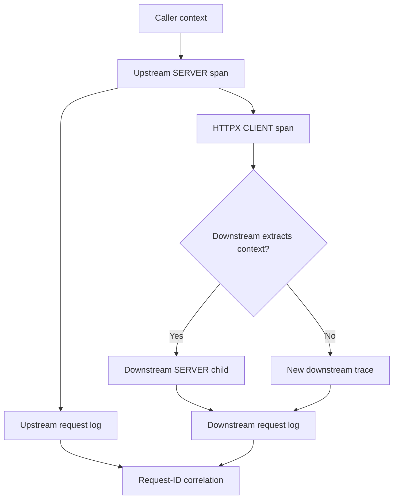

# Lab 35: Distributed Context Propagation

## 1. Purpose and Learning Outcomes

You will follow one request into a second running service and verify how its spans connect across the network. The outgoing HTTP client inserts trace context into the request, and the downstream server reads it. Then you will deliberately stop that extraction. The request ID will still link the logs, but the work will split into two traces, showing why a shared text ID does not prove a parent-child relationship.

> **Primary Objective:** Follow a request through two running FastAPI services, prove the W3C parent-child link from client to server, then deliberately break and restore context propagation.

A shared request ID helps you find related records, but it does not describe a trace tree. For distributed tracing to work, the current execution context must cross the network and be read before the downstream server span is created.

Add a small internal FastAPI service and a local-only demonstration route in Items. They exchange limited numeric inputs through a pooled HTTP client and do not share database credentials. Verify the real parent link, remove incoming trace context at the downstream boundary, observe two traces with one request ID, and restore the link. Retries, business events, baggage, and service graphs are outside this lab.

## 2. Starting Point and Lab Map

Open the complete application repository before using this guide. Unless a step says otherwise, run commands in Bash from the repository's top-level folder. Follow the starting checks in order because later commands depend on the helper functions and running services they prepare.

Read each explanation before running its commands. Run one complete code block, check the result, and then continue. In your notebook, save the commands, what happened, why you think it happened, and anything that differed from the expected result.

### Key Terms

| **Term**    | **Explanation**                                                                                |
| ----------- | ---------------------------------------------------------------------------------------------- |
| Propagation | Carrying the current trace context across a boundary, such as from an HTTP client to a server. |
| traceparent | The W3C header containing the trace ID, the sending parent span's ID, and trace flags.         |
| Parent edge | The link from a child span to the span that initiated its work.                                |

### Lab Map

The arrows show how the parts connect and where a request can take different paths. Use this map to understand the design. It is not a recording of a request that actually ran.


```mermaid
flowchart TD
    C["Caller context"] --> A["Upstream SERVER span"]
    A --> H["HTTPX CLIENT span"]
    H --> X{"Downstream extracts context?"}
    X -->|"Yes"| D["Downstream SERVER child"]
    X -->|"No"| N["New downstream trace"]
    A --> L["Upstream request log"]
    D --> R["Downstream request log"]
    N --> R
    L --> I["Request-ID correlation"]
    R --> I
```

## 3. Guided Walkthrough

### Step 01. Inherited State and Starting Checks

**What You Are Doing:** Check the automatically instrumented application before adding a second service. Preserve the current stage helpers, identities, and persistent data.

**Practical Walkthrough:** Verify the existing application, helpers, and stored data. Save a fresh trace and log canary as controls before adding the downstream service. This gives you a working starting point for distinguishing new propagation errors from existing transport problems.

Retrieve a new known trace and log before creating the service. Check the automatically instrumented app and checkpoint data. These controls help show whether a later missing cross-service trace comes from the new boundary or from an earlier export, storage, or query failure.

Complete [Lab 34](Lab-34.md) first. Use the same Bash session and repository root, and retain the credentials, named volumes, and existing checkpoint item.

```bash
source lab-notes/session.sh
source lab-notes/evidence.sh
source lab-notes/metrics-session.sh
source lab-notes/platform-session.sh
load_app_settings
start_lab 35
dp config --quiet
dp ps -a
wait_ready
wait_backend loki:3100 /ready
wait_backend otel-collector:13133 /
```

Use `dp`, the stage-aware Compose helper from Lab 31, throughout these labs. It keeps the same project and named volumes and includes only the overlays that exist. Plain `docker compose up` would activate the original full-stack settings instead of this learning stage. `start_lab` creates a new evidence directory and sets `LAB_DIR`; preserve that directory for this run.

```bash
source lab-notes/traces-session.sh
wait_backend tempo:3200 /ready
cp app/app/main.py "$LAB_DIR/main.py.before"
cp app/app/logging_config.py "$LAB_DIR/logging_config.py.before"
cp lab-notes/tracing/collector.yml "$LAB_DIR/collector.yml.before"
dp exec -T app python -c 'from opentelemetry.instrumentation.httpx import HTTPXClientInstrumentor; print("HTTPX integration is available")'
```

Finish Lab 34's dependency compatibility check before continuing. The application is already instrumented. Adding the route must preserve CRUD operations, migrations, readiness, cache fallback, and the established log and metric definitions.

**Understanding the Result:** Start with verified upstream instrumentation. Otherwise, a missing distributed trace may be caused by a failure that occurs before the new service is ever called.

### Step 02. Learning Objectives and the New Boundary

**What You Are Doing:** Predict the sequence of server, client, and server spans. The outgoing client span should be the direct parent of the downstream server span.

**Practical Walkthrough:** Follow the expected chain: an upstream SERVER span contains an outgoing HTTPX CLIENT span, which parents the downstream SERVER span. The client span represents the network call. Matching request IDs help correlate records, but they do not create this parent-child structure.

Compare the IDs as well as service names along the SERVER → CLIENT → SERVER chain. The downstream server's remote parent should be the outgoing client span. A shared request ID is useful evidence that records concern the same request, but it cannot establish that span relationship.

You will distinguish correlation from parentage, read W3C `traceparent`, and observe automatic context injection and extraction. You will prove which client span parents the remote server span and explain why services need a policy for trusting incoming context.

The lab map in Section 2 shows this relationship.

Expect an upstream SERVER span, its HTTPX CLIENT child, and a downstream SERVER child of that client. The application explicitly forwards `X-Request-ID` for log investigation. Instrumentation handles W3C context. Do not manually copy the incoming `traceparent` into the outgoing call, because that would skip the newly created client span's identity.

The `traceparent` format is `version-trace_id-parent_id-flags`. This exercise uses version `00`, a nonzero 32-hex trace ID, a nonzero 16-hex parent ID, and sampled flag `01`. These flags provide diagnostic context. They do not authenticate the caller or grant permission.

**Understanding the Result:** Matching trace or request IDs is not enough. Compare the parent ID with the expected client span ID to prove the stored execution link.

### Step 03. Implement the Small Downstream Service

**What You Are Doing:** Build a small downstream service with only the settings and behavior this experiment needs. Reuse the log formatter without giving the service unnecessary database dependencies.

**Practical Walkthrough:** Limit the downstream's inputs, behavior, and configuration to the exercise. Reuse the JSON formatter so its logs remain comparable, while keeping a distinct service identity. It does not need PostgreSQL or Redis access to demonstrate the HTTP boundary.

Review the allowed inputs, bounded responses, and separate service name. Keep database and cache clients out of this process. The purpose is to observe a real network handoff with consistent logs and traces, without adding unrelated persistence behavior.

```bash
cat > app/app/downstream.py <<'PYTHON'
"""Small internal FastAPI service for a real, bounded HTTP propagation experiment."""
import asyncio
import json
import socket
from contextlib import asynccontextmanager
from datetime import datetime, timezone
from time import perf_counter
from typing import Annotated, Literal
from uuid import uuid4

from fastapi import FastAPI, Query, Request, Response
from opentelemetry import trace
from opentelemetry.exporter.otlp.proto.grpc.trace_exporter import OTLPSpanExporter
from opentelemetry.instrumentation.fastapi import FastAPIInstrumentor
from opentelemetry.metrics import NoOpMeterProvider
from opentelemetry.sdk.resources import Resource
from opentelemetry.sdk.trace import TracerProvider
from opentelemetry.sdk.trace.export import BatchSpanProcessor
from opentelemetry.sdk.trace.sampling import ParentBased, TraceIdRatioBased
from pydantic_settings import BaseSettings, SettingsConfigDict
from starlette.types import ASGIApp, Receive, Scope, Send

from app.logging_config import configure_logging
from app.middleware import SAFE_ID


class DownstreamSettings(BaseSettings):
    model_config = SettingsConfigDict(extra='ignore')
    service_name: Literal['lab-downstream'] = 'lab-downstream'
    environment: Literal['local', 'test'] = 'local'
    trust_trace_context: bool = True
    log_level: Literal['INFO', 'WARNING', 'ERROR'] = 'INFO'


class ContextBoundary:
    def __init__(self, app: ASGIApp, enabled: bool) -> None:
        self.app, self.enabled = app, enabled

    async def __call__(self, scope: Scope, receive: Receive, send: Send) -> None:
        if scope['type'] == 'http' and not self.enabled:
            scope = dict(scope)
            scope['headers'] = [(key, value) for key, value in scope.get('headers', [])
                                if key.lower() not in {b'traceparent', b'tracestate'}]
        await self.app(scope, receive, send)


def create_app() -> ASGIApp:
    settings = DownstreamSettings()
    configure_logging(settings)
    provider = TracerProvider(resource=Resource.create({
        'service.name': settings.service_name, 'service.version': '1.0.0',
        'deployment.environment.name': settings.environment, 'service.instance.id': socket.gethostname()}),
        sampler=ParentBased(TraceIdRatioBased(1.0)))
    provider.add_span_processor(BatchSpanProcessor(
        OTLPSpanExporter(endpoint='http://otel-collector:4317', insecure=True, timeout=3),
        max_queue_size=1024, schedule_delay_millis=1000))

    @asynccontextmanager
    async def lifespan(app: FastAPI):
        try:
            yield
        finally:
            await asyncio.to_thread(provider.shutdown)

    app = FastAPI(title='Trace context learning service', lifespan=lifespan)

    @app.get('/health/live')
    async def live() -> dict[str, str]:
        return {'status': 'alive'}

    @app.get('/evaluate')
    async def evaluate(request: Request, response: Response,
                       value: Annotated[int, Query(ge=0, le=100)] = 7,
                       delay_ms: Annotated[int, Query(ge=0, le=200)] = 25) -> dict[str, object]:
        started = perf_counter()
        values = request.headers.getlist('x-request-id')
        supplied = values[0] if len(values) == 1 else ''
        request_id = supplied if SAFE_ID.fullmatch(supplied) else str(uuid4())
        await asyncio.sleep(delay_ms / 1000)
        span_context = trace.get_current_span().get_span_context()
        trace_id, span_id = f'{span_context.trace_id:032x}', f'{span_context.span_id:016x}'
        response.headers['X-Request-ID'] = request_id
        print(json.dumps({
            'timestamp': datetime.now(timezone.utc).isoformat(), 'level':'INFO',
            'logger':'lab.downstream', 'service':settings.service_name, 'environment':settings.environment,
            'message':'request_completed','event_name':'request_completed','event_id':str(uuid4()),'schema_version':1,
            'request_id':request_id,'http.method':'GET','http.route':'/evaluate','http.status_code':200,
            'duration_ms':round((perf_counter()-started)*1000,3),
            'trace_id':trace_id,'span_id':span_id,'trace_sampled':span_context.trace_flags.sampled
        }, separators=(',', ':')), flush=True)
        return {'service': settings.service_name, 'result': value * 2, 'trace_id': trace_id}

    FastAPIInstrumentor.instrument_app(app, tracer_provider=provider, meter_provider=NoOpMeterProvider(),
        excluded_urls=r'.*/health/live$', exclude_spans=['receive', 'send'])
    return ContextBoundary(app, settings.trust_trace_context)
PYTHON
```

**Command Note:** `<<'PYTHON'` writes the following block exactly as shown until the closing `PYTHON`. The quotes prevent Bash from expanding `$variables` inside the generated file. Creating the file and executing it are separate steps.

This factory creates neither a database client nor a Redis client. `DownstreamSettings` accepts only local/test environments, and the process receives only the service, environment, and context settings it needs. Both `/evaluate` input and wait time have limits. A small typing change below lets the shared JSON formatter retain this process's correct identity in lifecycle and runtime logs.

`ContextBoundary` wraps the instrumented ASGI application. When the fault disables trust, it removes `traceparent` and `tracestate` **before** FastAPI reads the context. Removing those headers inside the endpoint would be too late because the server span would already have been created.

The response deliberately includes a trace ID so you can verify the experiment. This is a local diagnostic interface, not a required field for production API responses.

**Understanding the Result:** A small independent service makes the network boundary easier to inspect. Sharing a formatter keeps the log format consistent while each process retains its own service identity.

### Step 04. Implement One Reusable HTTP Client and the Demo Route

**What You Are Doing:** Create one reusable outbound HTTP client during application startup and close it during shutdown. This gives connection pooling, timeouts, and instrumentation a clear lifecycle.

**Practical Walkthrough:** Add the shared HTTP client to the application lifespan and close it at shutdown. Requests should reuse the configured pool instead of creating unmanaged clients repeatedly. Attach instrumentation through the existing owner so the client spans describe the actual outbound calls.

Follow the client from creation in lifespan, through request handling, to closure at shutdown. Confirm that the established instrumentation setup covers it. Its CLIENT span should represent the real network operation and configured timeout, not a manually invented span disconnected from the call.

```bash
cat > app/app/downstream_client.py <<'PYTHON'
"""One pooled HTTP client per process; only the local demo route calls it."""
import logging
from typing import Annotated

import httpx
from fastapi import APIRouter, HTTPException, Query, Request
from opentelemetry import trace
from opentelemetry.instrumentation.httpx import HTTPXClientInstrumentor
from opentelemetry.metrics import NoOpMeterProvider

router = APIRouter(prefix='/api/v1/demo', tags=['learning'])
logger = logging.getLogger(__name__)


async def start_downstream(app) -> None:
    if not app.state.settings.demo_enabled:
        return
    client = httpx.AsyncClient(base_url='http://lab-downstream:8001', trust_env=False,
        timeout=httpx.Timeout(2.0, connect=0.5), limits=httpx.Limits(max_connections=10, max_keepalive_connections=5))
    provider = app.state.telemetry.provider
    if provider is not None:
        HTTPXClientInstrumentor.instrument_client(client, tracer_provider=provider, meter_provider=NoOpMeterProvider())
    app.state.downstream_client = client


async def stop_downstream(app) -> None:
    client = getattr(app.state, 'downstream_client', None)
    if client is not None:
        HTTPXClientInstrumentor.uninstrument_client(client)
        await client.aclose()


@router.get('/downstream')
async def call_downstream(request: Request,
                          value: Annotated[int, Query(ge=0, le=100)] = 7) -> dict[str, object]:
    if not request.app.state.settings.demo_enabled:
        raise HTTPException(404, 'Not found')
    try:
        response = await request.app.state.downstream_client.get('/evaluate', params={'value':value},
            headers={'X-Request-ID':request.state.request_id})
        response.raise_for_status()
        result = response.json()
    except httpx.TimeoutException:
        logger.warning('downstream_timeout', extra={'operation':'evaluate'})
        raise HTTPException(504, 'Learning dependency timed out') from None
    except (httpx.HTTPError, ValueError):
        logger.warning('downstream_failed', extra={'operation':'evaluate'})
        raise HTTPException(502, 'Learning dependency unavailable') from None
    context = trace.get_current_span().get_span_context()
    return {'request_id':request.state.request_id, 'upstream_trace_id':f'{context.trace_id:032x}', 'downstream':result}
PYTHON
```

```bash
cat > lab-notes/tracing/install_downstream.py <<'PYTHON'
"""Extend the existing factory without replacing CRUD, migrations or health semantics."""
from pathlib import Path
import yaml

p=Path('app/app/main.py'); text=p.read_text()
patches=[
('from app.database import Database\n', 'from app.database import Database\nfrom app.downstream_client import router as downstream_router, start_downstream, stop_downstream\n'),
('            await telemetry.start_profiles()\n','            await telemetry.start_profiles()\n            await start_downstream(application)\n'),
('            await telemetry.close(application, cache)\n','            await stop_downstream(application)\n            await telemetry.close(application, cache)\n'),
('    app.include_router(router)\n','    app.include_router(router)\n    app.include_router(downstream_router)\n    app.state.telemetry = telemetry\n')]
for old,new in patches:
    if new in text: continue
    assert text.count(old)==1, 'Expected factory anchor missing: '+old
    text=text.replace(old,new)
p.write_text(text)
# Only a known second service may override the app resource on the log pipeline.
p=Path('lab-notes/tracing/collector.yml'); config=yaml.safe_load(p.read_text())
statements=config['processors']['transform/logs']['log_statements'][0]['statements']
rule='set(resource.attributes["service.name"], "lab-downstream") where log.cache["service"] == "lab-downstream"'
if rule not in statements: statements.append(rule)
p.write_text(yaml.safe_dump(config,sort_keys=False))

# The shared formatter needs only these three fields, not database credentials.
p=Path('app/app/logging_config.py'); text=p.read_text()
if 'class LoggingSettings(Protocol):' not in text:
    old='from app.config import Settings'
    new='from typing import Protocol\n\n\nclass LoggingSettings(Protocol):\n    service_name: str\n    environment: str\n    log_level: str'
    assert text.count(old)==1
    text=text.replace(old,new).replace('settings: Settings','settings: LoggingSettings')
    p.write_text(text)
PYTHON
```

```bash
lab-notes/.tools/bin/python lab-notes/tracing/install_downstream.py
```

The installer extends the existing lifespan: it creates one AsyncClient after startup, closes it before telemetry shutdown, and exposes the local demo router. It does not create a client for every request. Pool limits and timeouts restrict pressure on the downstream. Retries are deliberately absent, so one request produces one downstream attempt.

HTTPX instrumentation wraps the pooled client's transport and automatically injects active trace context. The application explicitly forwards only the validated request ID, not authorization headers, cookies, or arbitrary user headers. Calls use the fixed internal `lab-downstream` destination rather than a URL supplied by an API caller.

The shared log formatter now accepts a small typed protocol with service, environment, and log-level fields. The new service therefore needs no invented PostgreSQL or Redis credentials just to configure logging. The Collector allows only the exact known `lab-downstream` name to override the existing log resource. Request IDs remain excluded from indexed labels.

**Understanding the Result:** Client creation, reuse, and cleanup each need one clear place in the application lifecycle. This makes both resource use and instrumentation easier to reason about.

### Step 05. Add the Container without Publishing Another Port

**What You Are Doing:** Run the downstream as its own internal container using the reviewed image. Give it a separate service identity so its spans and logs are distinguishable from Items.

**Practical Walkthrough:** Apply the reviewed image and overlay for the separate downstream container. Check its service name and connectivity from the upstream container's network. The browser does not need direct access to the downstream for this service-to-service request to work.

Inspect internal DNS and ports from the upstream container's perspective. Validate the overlay, apply it, and confirm connectivity before diagnosing a missing parent link as a tracing failure. No browser-facing downstream port is required.

```bash
cat > lab-notes/compose.downstream.yaml <<'YAML'
services:
  app:
    environment:
      DEMO_ENABLED: "true"
  lab-downstream:
    image: ${COMPOSE_PROJECT_NAME:-observability}-app:local
    command: [uvicorn, app.downstream:create_app, --factory, --host, 0.0.0.0, --port, "8001", --workers, "1", --no-access-log, --no-proxy-headers]
    user: "10001:10001"
    read_only: true
    restart: unless-stopped
    init: true
    stop_grace_period: 20s
    mem_limit: 192m
    networks: [platform]
    cap_drop: [ALL]
    security_opt: [no-new-privileges:true]
    environment:
      SERVICE_NAME: lab-downstream
      ENVIRONMENT: ${ENVIRONMENT:-local}
      TRUST_TRACE_CONTEXT: ${LAB_TRUST_TRACE_CONTEXT:-true}
      OTEL_PROPAGATORS: tracecontext
    tmpfs: [/tmp]
    healthcheck:
      test: [CMD, python, -c, "import urllib.request; urllib.request.urlopen('http://127.0.0.1:8001/health/live', timeout=2).read()"]
      interval: 10s
      timeout: 3s
      retries: 5
    logging:
      driver: fluentd
      options:
        fluentd-address: 127.0.0.1:8006
        fluentd-async: "true"
        fluentd-buffer-limit: "8192"
        tag: fastapi.downstream
        mode: non-blocking
        max-buffer-size: 4m
        cache-max-size: 10m
        cache-max-file: "3"
YAML
```

```bash
unset LAB_TRUST_TRACE_CONTEXT
dp config --quiet
dp run --rm -T --no-deps otel-collector validate --config=/etc/otelcol-contrib/config.yaml
dp build app
dp up -d --no-deps --force-recreate otel-collector
wait_backend otel-collector:13133 /
dp up -d --no-deps lab-downstream
dp up -d --no-deps --force-recreate app
wait_backend lab-downstream:8001 /health/live
wait_ready
make test
```

The downstream uses the freshly built app image but runs a different factory and service name in a separate container. It shares the Compose network and needs no extra compiler toolchain or public port. It runs as non-root, has a read-only filesystem except `/tmp`, and uses the existing single infrastructure log-collection path.

The main application's `DEMO_ENABLED` setting is true only for this local stage. Readiness still describes required Items functionality. An outage of the optional demonstration service should not make PostgreSQL-backed CRUD fail its readiness check.

There are now thirteen long-running services and nine scrape jobs. This lab does not add another application-metrics pipeline for the downstream service.

**Understanding the Result:** The service inventory has grown to thirteen, while the scrape inventory remains nine jobs. A container count and a scrape-job count measure different things.

### Step 06. Send One Request with Explicit Remote Context

**What You Are Doing:** Send a request with known synthetic remote context and save the returned identities. The known trace ID gives you an exact target for checking how the new spans connect.

**Practical Walkthrough:** Use the supplied test context and retain the response IDs. Compare the known parent and trace IDs with the stored spans to see how the server attaches its work. Keep this deliberate fixture separate from normal requests that arrive without trace context.

Save the generated trace ID, parent ID, and response together. These known inputs make the expected relationship testable. They represent an explicit propagation test, rather than an ordinary caller asking the server to create a new trace root.

**Prediction Checkpoint:** Both returned trace IDs should equal the test trace ID, but the server spans should have different span IDs. The downstream server's direct parent should be the HTTPX client span, rather than the upstream server span.

```bash
CALL_TRACE=$(python3 -c 'from uuid import uuid4; print(uuid4().hex)')
CALL_PARENT=$(python3 -c 'from secrets import token_hex; print(token_hex(8))')
CALL_REQUEST="boundary-$(new_uuid)"
api -fsS "$APP_URL/api/v1/demo/downstream?value=7"   -H "X-Request-ID: $CALL_REQUEST"   -H "traceparent: 00-$CALL_TRACE-$CALL_PARENT-01" > "$LAB_DIR/response-connected.json"
jq . "$LAB_DIR/response-connected.json"
jq -e --arg trace "$CALL_TRACE" --arg request "$CALL_REQUEST"   '.upstream_trace_id==$trace and .downstream.trace_id==$trace and .request_id==$request and .downstream.result==14'   "$LAB_DIR/response-connected.json"
```

**Command Note:** `jq --arg` passes a shell value into a JSON query as a string variable without inserting it directly into the query text. Where used, `-e` returns a failure status when the final result is false or null.

The `curl` caller sends valid synthetic remote-parent context but does not export a caller span. The upstream server therefore refers to a deliberately unrecorded parent. Do not mistake that known gap for Collector loss. Checking the downstream client-to-server link gives stronger evidence than simply counting roots.

**Understanding the Result:** The known input context lets you predict the IDs and relationships. Matching IDs echoed in a response do not yet prove that Tempo stored the complete path.

### Step 07. Prove Parentage from Tempo

**What You Are Doing:** Retrieve the trace until both services and the expected parent link appear. Verify the stored relationship rather than relying only on equal IDs in the response.

**Practical Walkthrough:** Poll within the stated time limit for both services' spans. Compare the downstream server's parent ID with the outgoing client span ID. A trace containing only one service or missing the expected link is still partial evidence.

Use the bounded polling loop to wait for the required spans and links. Shared trace membership is not enough: the downstream parent must match the intended client span. Continue treating the result as partial until that exact relationship is present.

```bash
cat > lab-notes/tracing/verify_boundary.py <<'PYTHON'
"""Prove the actual client-to-server parent edge, not only equal trace IDs."""
import json, sys
from pathlib import Path
from inspect_trace import flatten

rows=flatten(json.loads(Path(sys.argv[1]).read_text()))
children=[r for r in rows if r['service']=='lab-downstream' and r['kind'] in (2,'SPAN_KIND_SERVER')]
assert len(children)==1, ('expected one downstream server span',children)
child=children[0]
parents=[r for r in rows if r['span_id']==child['parent_span_id']]
assert len(parents)==1
parent=parents[0]
assert parent['kind'] in (3,'SPAN_KIND_CLIENT') and parent['service']!='lab-downstream'
assert parent['trace_id']==child['trace_id']
assert any(r['span_id']==parent['parent_span_id'] and r['kind'] in (2,'SPAN_KIND_SERVER') for r in rows)
print(json.dumps({'trace_id':child['trace_id'],'caller_client_span':parent['span_id'],
                  'downstream_server_span':child['span_id'],'parent_edge_valid':True},indent=2))
PYTHON
```

```bash
for attempt in {1..20}; do
  fetch_trace "$CALL_TRACE" "$LAB_DIR/connected-trace.json"
  if python3 lab-notes/tracing/verify_boundary.py "$LAB_DIR/connected-trace.json"     > "$LAB_DIR/parent-edge-proof.json" 2> "$LAB_DIR/parent-edge-pending.error"; then break; fi
  sleep 1
done
python3 lab-notes/tracing/verify_boundary.py "$LAB_DIR/connected-trace.json"
python3 lab-notes/tracing/inspect_trace.py "$LAB_DIR/connected-trace.json" > "$LAB_DIR/connected-spans.json"
jq '.[] | {service,name,kind,trace_id,span_id,parent_span_id,duration_ms}' "$LAB_DIR/connected-spans.json"
```

Both services export asynchronously, so the first lookup may be incomplete. The bounded loop checks the actual parent link before proceeding. Expect `parent_edge_valid: true`. In Grafana, expand the server → client → server chain and inspect each service's resource identity.

The downstream's 25 ms wait should fit within the HTTP client duration. The client can take longer than the remote server span because DNS, connection setup, transport, and instrumentation add time outside the server's recorded interval. On separate real hosts, clock differences can complicate timeline alignment even when the IDs connect correctly.

**Understanding the Result:** Finding a trace and proving its required spans are complete are separate checks. Save the actual IDs and parent relationships used by your assertion.

### Step 08. Find the Same Request in Both Log Streams

**What You Are Doing:** Find the corresponding logs in both service streams. Use request IDs to correlate records and span parent IDs to prove how execution moved between services.

**Practical Walkthrough:** Query both explicitly selected service streams and compare request, trace, and span identities. Request IDs connect the operational records. Parent IDs describe execution structure. Keep the service scope narrow so unrelated records cannot satisfy the check.

Search both service streams over the request interval. Compare the request ID, trace ID, and active span in each record separately. Retain the logs for correlation and the trace links for parentage; one type of ID cannot substitute for the other.

```bash
BOTH_SCOPE=$(python3 - "$LAB_SERVICE" "$LAB_ENVIRONMENT" <<'PYTHON'
import json,sys
print('{service_name=~'+json.dumps(sys.argv[1]+'|lab-downstream')+',deployment_environment_name='+json.dumps(sys.argv[2])+'}')
PYTHON
)
BOUNDARY_QUERY="$BOTH_SCOPE | json rid="request_id",event="event_name" | __error__="" | rid="$CALL_REQUEST" | event="request_completed""
for attempt in {1..45}; do
  backend loki:3100 /loki/api/v1/query_range query "$BOUNDARY_QUERY" since 10m limit 100     > "$LAB_DIR/connected-logs.json"
  if jq -e '[.data.result[].values[]]|length>=2' "$LAB_DIR/connected-logs.json" >/dev/null; then break; fi
  sleep 1
done
python3 - "$LAB_DIR/connected-logs.json" "$CALL_TRACE" "$LAB_SERVICE" <<'PYTHON'
import json,sys
rows=[json.loads(v[1]) for s in json.load(open(sys.argv[1]))['data']['result'] for v in s['values']]
assert {r['service'] for r in rows}=={sys.argv[3],'lab-downstream'}
assert all(r['trace_id']==sys.argv[2] for r in rows)
assert len({r['span_id'] for r in rows})==2
print('Two service log streams share a request and trace; their server span IDs differ')
PYTHON
```

The index includes only two known service names. Request and trace IDs are filters applied during querying, not extra indexed streams. One request ID can locate both records, while the parent IDs in the trace prove how the work is connected.

**Understanding the Result:** Use each ID for its intended purpose. Shared request context helps find records but does not prove that distributed span parentage is correct.

### Step 09. Break Propagation at Exactly One Boundary

**What You Are Doing:** Disable context extraction only at the downstream boundary while continuing to forward the request ID. A successful request split across two traces demonstrates a propagation failure separately from business or backend failure.

**Practical Walkthrough:** Disable only downstream extraction and repeat the call. Request-ID forwarding stays active, so logs still correlate and the business call can succeed. The downstream starts a separate trace because it no longer reads the incoming parent context.

Compare the upstream trace ID with the downstream ID returned by the faulty request, then find the matching service logs. The request ID should still connect them even though the trace tree no longer does. Save this mismatch before recovery; checking HTTP success alone would miss it.

Keep request-ID forwarding enabled. Recreate only the downstream container with context extraction disabled. Leave the Collector and Tempo running so the fault is isolated to propagation.

```bash
export LAB_TRUST_TRACE_CONTEXT=false
dp up -d --no-deps --force-recreate lab-downstream
wait_backend lab-downstream:8001 /health/live
BROKEN_TRACE=$(python3 -c 'from uuid import uuid4; print(uuid4().hex)')
BROKEN_PARENT=$(python3 -c 'from secrets import token_hex; print(token_hex(8))')
BROKEN_REQUEST="boundary-broken-$(new_uuid)"
api -fsS "$APP_URL/api/v1/demo/downstream?value=7"   -H "X-Request-ID: $BROKEN_REQUEST"   -H "traceparent: 00-$BROKEN_TRACE-$BROKEN_PARENT-01" > "$LAB_DIR/response-broken.json"
jq -e --arg trace "$BROKEN_TRACE" --arg request "$BROKEN_REQUEST"   '.upstream_trace_id==$trace and .downstream.trace_id!=$trace and .request_id==$request and .downstream.result==14'   "$LAB_DIR/response-broken.json"
DETACHED_TRACE=$(jq -er '.downstream.trace_id' "$LAB_DIR/response-broken.json")
fetch_trace "$BROKEN_TRACE" "$LAB_DIR/broken-upstream-trace.json"
fetch_trace "$DETACHED_TRACE" "$LAB_DIR/broken-downstream-trace.json"
```

The request succeeds but produces two traces. The upstream CLIENT span stays in the original trace, while the downstream SERVER span begins another after its incoming parent context is removed. The local trust switch drops both `traceparent` and `tracestate`; it does not rename or forge IDs.

Repeat the earlier log query using `BROKEN_REQUEST`. Expect one request ID shared by records with two different trace IDs. Save both records: they demonstrate that matching request IDs alone do not prove distributed tracing works.

Restore the extraction setting before continuing to the next lab.

**Understanding the Result:** HTTP success can coexist with broken trace continuity. The expected negative-control result is a working call whose work is split into two traces.

### Step 10. Restore Propagation and Prove Recovery

**What You Are Doing:** Restore extraction and send a new request without caller trace context. Verify that the server's new root connects through the HTTP client span to the downstream server.

**Practical Walkthrough:** Remove the fault and send a fresh ordinary request without synthetic parent context. Check the resulting root → client → downstream-server chain and both log streams. This proves propagation works after restoring the runtime setting.

Remove the temporary extraction fault, recreate the downstream as required, and make the new request. Verify the fresh span chain and matching logs. Removing an environment override alone is not proof of recovery; the new evidence must show that the relationship works again.

```bash
unset LAB_TRUST_TRACE_CONTEXT
dp up -d --no-deps --force-recreate lab-downstream
wait_backend lab-downstream:8001 /health/live
RECOVERY_REQUEST="boundary-recovered-$(new_uuid)"
api -fsS "$APP_URL/api/v1/demo/downstream?value=8"   -H "X-Request-ID: $RECOVERY_REQUEST" > "$LAB_DIR/response-recovered.json"
jq -e '.upstream_trace_id==.downstream.trace_id and .downstream.result==16' "$LAB_DIR/response-recovered.json"
RECOVERED_TRACE=$(jq -er '.upstream_trace_id' "$LAB_DIR/response-recovered.json")
for attempt in {1..20}; do
  fetch_trace "$RECOVERED_TRACE" "$LAB_DIR/recovered-trace.json"
  if python3 lab-notes/tracing/verify_boundary.py "$LAB_DIR/recovered-trace.json"; then break; fi
  sleep 1
done
python3 lab-notes/tracing/verify_boundary.py "$LAB_DIR/recovered-trace.json"
wait_ready
api -fsS "$APP_URL/api/v1/items?limit=1" > "$LAB_DIR/items-after.json"
```

With no caller trace context, FastAPI creates a new root span. The client and downstream server should join that trace. Check both the equal response trace IDs and the parent link stored in Tempo. Equal response fields alone are weaker evidence.

For an optional malformed-header check, send `traceparent: invalid` on a fresh request. A conforming propagator should ignore the invalid input and create valid new context while the application serves the request. Record the resulting IDs rather than logging arbitrary incoming header values.

**Understanding the Result:** Prove recovery with a new complete trace. An old correctly connected trace shows past behavior, not whether the restored configuration works now.

## 4. Troubleshooting and Diagnosis

Begin with the first result that differed from your prediction. Save the exact error or symptom and identify which service or command produced it. Use the checks below, make the needed fix, and repeat the original check to confirm the problem is resolved.

### Troubleshooting and Safe Rollback

| **Symptom**                            | **Check**                                                                                                            |
| -------------------------------------- | -------------------------------------------------------------------------------------------------------------------- |
| 404 on the demo route                  | Check `DEMO_ENABLED`, the active overlay, rebuilt image, and router registration.                                    |
| 502/504                                | Inspect internal DNS, downstream health, and client timeouts. Check ordinary Items readiness separately.             |
| One request ID but two traces          | Inspect extraction, active context, client instrumentation, and the selected propagator.                             |
| Same trace ID but wrong parent edge    | Check whether code copied the inbound header instead of letting the new CLIENT span inject its own context.          |
| New service logs labeled as the app    | Check the limited resource override, shared formatter, and actual record `service` value.                            |
| No downstream span in an early lookup  | Allow both SDK batches to arrive and verify Collector export before changing propagation.                            |
| Fault survives a restart               | Environment settings are fixed when the container is created. Unset the override and force-recreate it.              |
| Downstream fails due to DB credentials | Use its own factory. It should not construct the main application's Settings or Database.                            |

To undo only this lab, stop and remove the `lab-downstream` container while keeping volumes. Move `compose.downstream.yaml` out of the active include path. Restore the saved `main.py`, `logging_config.py`, and Collector YAML, preserve evidence, and remove only the two new Python modules. Then rebuild/recreate the app and Collector. Keep Lab 34's HTTPX dependency and app tracing. Use checkpoint files only if doing so will not overwrite unrelated edits made afterward.

The successful end state keeps the downstream running with propagation restored. The [W3C Trace Context](https://www.w3.org/TR/trace-context/) and [OTel context propagation](https://opentelemetry.io/docs/concepts/context-propagation/) references explain the protocol and context model.

## 5. Review and Practice

Answer the questions in your own words before reading the answers. For the scenario, say what you would inspect and exactly what each result would tell you.

### Knowledge Check

1. Why is forwarding the inbound traceparent manually incorrect here?
2. Why remove context before ASGI instrumentation?
3. Does the request ID establish span parentage?
4. Should arbitrary external callers control trusted sampling or baggage policy?

#### Answer Guide

1. The new CLIENT span must send its own span ID as the downstream parent. Copying the original incoming header would skip that client span in the relationship.
2. Instrumentation extracts context and creates the server span before the endpoint runs. Removing headers inside the endpoint cannot undo that earlier extraction.
3. No. A request ID is a value for finding related records; it does not encode a parent-child relationship between spans.
4. No. Define where incoming context, sampling decisions, and captured data are trusted. Trace context is not proof of caller identity or permission.

### Professional Scenario Exercise

A proxy removes traceparent but leaves X-Request-ID unchanged. Users report slow requests, and logs are available from both services. Explain why the trace view is split, identify the exact IDs and parent links that locate the break, and describe a limited verification run after fixing the proxy.

## 6. Completion Checklist

Tick an item only when you can show its result or saved evidence. Finish the cleanup instructions before starting the next lab.

### Observable Completion Criteria

- [ ] A separate internal FastAPI service runs without shared database credentials or a published port.
- [ ] The stored trace contains the correct upstream-server → HTTP-client → downstream-server parent links.
- [ ] Both services' log streams correlate using the request ID and trace ID.
- [ ] Disabling extraction produces two traces while the forwarded request ID stays the same.
- [ ] Propagation is restored, and both the demo and ordinary Items endpoints pass recovery checks.

## 7. Production Context and Next Lab

### Production Implications

Treat incoming context as untrusted input. Use supported parsers, validate request IDs, avoid copying arbitrary headers, and decide where remote context and sampling decisions are accepted. Baggage can carry data across services and is deliberately disabled here. A second internal service on one Compose VM demonstrates a protocol boundary, not high availability or network isolation. Keep pools and timeouts bounded and define a retry policy before expanding this call path.

### End State and Transition

Keep thirteen services and nine scrape jobs, with the established ownership of metrics, logs, and traces. Propagation is restored, and Pyroscope remains disabled. [Lab 36](Lab-36.md) adds selected business spans, events, attributes, status, and stronger redaction. Those changes are not implemented in this lab.
