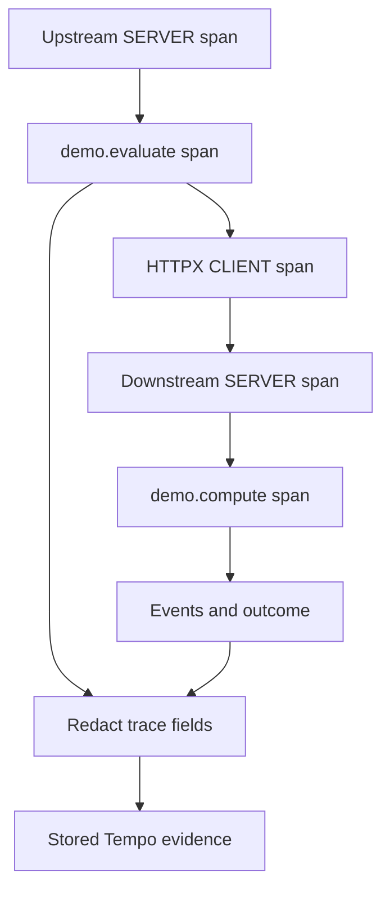

# Lab 36: Custom Spans, Events, Attributes, Status, and Redaction

## 1. Purpose and Learning Outcomes

You will add business meaning inside the request path that is already traced automatically. Two stable custom spans describe the upstream operation and downstream computation. Attributes, events, and status then explain normal, slow, and failed cases. You will also inspect stored telemetry after a redaction test to check what actually left the process and reached the backend.

> **Primary Objective:** Add useful diagnostic detail to the two-service trace, verify its parent-child structure, and confirm that the stored telemetry passes the redaction check.

Lab 35 established context propagation between services. A framework span can show that an HTTP call happened without explaining its application purpose. This lab adds two consistently named application spans, a limited set of diagnostic attributes, and timestamped events to that existing call.

Implement normal, slow, and deliberately failed scenarios. Compare a span event with a separately emitted log, and test the Collector's privacy rule with a harmless marker string. The route is only for local learning, not authentication or public fault injection. Existing CRUD, transactions, and caching remain unchanged. Labs 37–40 cover search, sampling, and Collector outages.

## 2. Starting Point and Lab Map

Open the complete application repository before using this guide. Unless a step says otherwise, run commands in Bash from the repository's top-level folder. Follow the starting checks in order because later commands depend on the helper functions and running services they prepare.

Read each explanation before running its commands. Run one complete code block, check the result, and then continue. In your notebook, save the commands, what happened, why you think it happened, and anything that differed from the expected result.

### Key Terms

| **Term**       | **Explanation**                                                                                                   |
| -------------- | ----------------------------------------------------------------------------------------------------------------- |
| Span attribute | A field that describes an operation, such as its scenario or outcome, chosen from a limited set of useful values. |
| Span event     | A named occurrence with a timestamp, attached to the span in which it happened.                                   |
| Redaction      | Removing selected sensitive fields before telemetry is exported onward.                                           |

### Lab Map

The arrows show how the parts connect and where a request can take different paths. Use this map to understand the design. It is not a recording of a request that actually ran.



## 3. Guided Walkthrough

### Step 01. Inherited State and Starting Checks

**What You Are Doing:** Verify the working two-service trace before adding nested application operations. Preserve the existing lifecycle hooks, helpers, and stored data.

**Practical Walkthrough:** Check business readiness and the current parent chain. Keep the provider setup, pooled HTTP client, and lifespan hooks under their existing ownership. The custom spans should add detail to the known trace rather than create a separate tracing setup.

Save the affected source files and verify the current cross-service parent links before editing. Preserve provider, lifespan, and client-pool ownership. The existing canary gives you a control for detecting unintended initialization or propagation changes when custom spans are added.

Complete [Lab 35](Lab-35.md) first. Work from the repository root in one Bash session. Retain the credentials, named volumes, checkpoint item, dashboards, and earlier evidence.

```bash
source lab-notes/session.sh
source lab-notes/evidence.sh
source lab-notes/metrics-session.sh
source lab-notes/platform-session.sh
source lab-notes/traces-session.sh
load_app_settings
start_lab 36
dp config --quiet
dp ps -a
wait_ready
wait_backend loki:3100 /ready
wait_backend tempo:3200 /ready
wait_backend otel-collector:13133 /
wait_backend lab-downstream:8001 /health/live
```

Use `dp`, the stage-aware helper from Lab 31, to preserve the current project and learning overlays. Plain `docker compose up` would use different settings. `start_lab` creates a fresh `LAB_DIR`; save this run's observations there. You still need Bash, Python 3, curl, and jq. YAML edits use the isolated `lab-notes/.tools/bin/python` environment installed in Lab 31.

The inherited platform has thirteen services, nine Prometheus scrape jobs, and four dashboards. No service or scrape job is added here. Pyroscope stays disabled until profiling. Native application metrics still go to Prometheus, traces go through the Collector, and Docker's Fluentd driver sends JSON stdout through the Collector to Loki.

```bash
unset LAB_TRUST_TRACE_CONTEXT
cp app/app/downstream.py "$LAB_DIR/downstream.py.before"
cp app/app/downstream_client.py "$LAB_DIR/downstream_client.py.before"
cp lab-notes/tracing/collector.yml "$LAB_DIR/collector.yml.before"
cp lab-notes/tracing/inspect_trace.py "$LAB_DIR/inspect_trace.py.before"
cp lab-notes/tracing/verify_boundary.py "$LAB_DIR/verify_boundary.py.before"
dp exec -T app python - <<'CHECK'
from app.config import Settings
s=Settings()
assert s.otel_enabled and s.demo_enabled and s.trace_sample_ratio == 1.0
assert not s.pyroscope_enabled
print('Learning route and full head sampling enabled')
CHECK
```

Restore Lab 35's context-extraction setting before proceeding. The new client checks that upstream and downstream trace IDs match. If they differ, recreate the downstream with `dp up -d --no-deps --force-recreate lab-downstream` to restore its configuration before investigating custom spans.

**Understanding the Result:** A verified propagation baseline lets you explain the new tree structure as added application work instead of confusing it with an existing broken link.

### Step 02. Learning Objectives and Design Predictions

**What You Are Doing:** Give each new span, attribute, and event a stable name and clear purpose. Describe useful work without creating a span for every loop iteration or putting unique IDs in names.

**Practical Walkthrough:** Use stable operation names and attributes with a limited set of values. Use spans for meaningful intervals and events for specific moments inside those intervals. Avoid detail that adds volume without helping you understand the operation.

Choose names that describe the kind of work, not the identity of a particular request. Use a span when its start and end are useful to measure, and an event when a single moment matters. Per-iteration spans should not be added merely because the code contains a loop.

Before editing, predict what each element will explain:

| **Element**              | **Purpose Here**                                     | **Value Discipline**                                             |
| ------------------------ | ---------------------------------------------------- | ---------------------------------------------------------------- |
| `demo.evaluate` span     | Measures the complete upstream operation             | Keep the name stable and leave request IDs out of it             |
| `demo.compute` span      | Measures the downstream computation                  | Create one span for the operation, not one per loop iteration    |
| `lab.scenario` attribute | Distinguishes normal, slow, and error work           | Use exactly the three defined values                             |
| `app.outcome` attribute  | States whether the operation succeeded or failed     | Use `success` or `failed`                                        |
| Span event               | Marks a useful moment inside an operation            | Use a fixed event name and safe attributes                       |
| Span status              | Makes failure visible to trace searches and policies | Set `ERROR` for failure; success may remain `UNSET`              |
| JSON log                 | Records completion independently of trace export     | Include correlation IDs while excluding payloads and credentials |

The intended chain is upstream SERVER → `demo.evaluate` INTERNAL → HTTPX CLIENT → downstream SERVER → `demo.compute` INTERNAL. Both custom spans belong to the same trace, so their trace IDs match. Their span IDs differ because each describes a separate operation.

**Prediction Checkpoint:** The slow case adds about 250 ms of downstream waiting. The error case returns 503 downstream and 502 upstream. An error event does not automatically set span status, and setting `ERROR` does not automatically emit a log. A harmless marker is enough to test redaction; no real secret is needed.

**Understanding the Result:** Decide what information you need before adding instrumentation. Every span or field should answer a specific investigation question.

### Step 03. Implement the Upstream Operation

**What You Are Doing:** Add the upstream operation through the existing tracer provider and pooled client. Preserve their lifecycle setup so the change does not create another provider, client, or instrumentation layer.

**Practical Walkthrough:** Create `demo.evaluate` around the intended upstream work using the application-owned tracer and pooled HTTP client. Keep startup and shutdown responsibilities unchanged. Work inside this scope can use the new INTERNAL span as its local parent.

Check exactly where `demo.evaluate` starts and ends around the outbound call. Reuse the current tracer and client so nested work inherits the right context. Keep provider and connection-pool creation outside individual requests; the span should measure work rather than create new infrastructure.

```bash
cat > app/app/downstream_client.py <<'PYTHON'
"""Bounded learning scenarios; one pooled, instrumented HTTP client per process."""
import logging
from typing import Annotated, Literal

import httpx
from fastapi import APIRouter, HTTPException, Query, Request, Response
from opentelemetry.instrumentation.httpx import HTTPXClientInstrumentor
from opentelemetry.metrics import NoOpMeterProvider
from opentelemetry.trace import Status, StatusCode

router = APIRouter(prefix='/api/v1/demo', tags=['learning'])
logger = logging.getLogger(__name__)
Scenario = Literal['normal', 'slow', 'error']


async def start_downstream(app) -> None:
    if not app.state.settings.demo_enabled:
        return
    client = httpx.AsyncClient(base_url='http://lab-downstream:8001', trust_env=False,
        timeout=httpx.Timeout(2.0, connect=0.5),
        limits=httpx.Limits(max_connections=10, max_keepalive_connections=5))
    provider = app.state.telemetry.provider
    if provider is not None:
        HTTPXClientInstrumentor.instrument_client(client, tracer_provider=provider,
                                                 meter_provider=NoOpMeterProvider())
    app.state.downstream_client = client


async def stop_downstream(app) -> None:
    client = getattr(app.state, 'downstream_client', None)
    if client is not None:
        HTTPXClientInstrumentor.uninstrument_client(client)
        await client.aclose()


@router.get('/downstream')
async def call_downstream(request: Request, response: Response,
        value: Annotated[int, Query(ge=0, le=100)] = 7,
        scenario: Scenario = 'normal') -> dict[str, object]:
    if not request.app.state.settings.demo_enabled:
        raise HTTPException(404, 'Not found')
    with request.app.state.tracer.start_as_current_span('demo.evaluate', attributes={
        'app.operation': 'evaluate', 'lab.scenario': scenario,
        'lab.secret_probe': 'LAB_ONLY_REMOVE_ME_36'},
        record_exception=False, set_status_on_exception=False) as span:
        span.add_event('downstream.requested', {'app.operation': 'evaluate'})
        result: dict[str, object] | None = None
        reason = 'none'
        status = 200
        try:
            downstream_response = await request.app.state.downstream_client.get(
                '/evaluate', params={'value': value, 'scenario': scenario},
                headers={'X-Request-ID': request.state.request_id})
            result = downstream_response.json()
            if not isinstance(result, dict):
                raise ValueError('Expected object')
            if downstream_response.status_code != 200:
                status, reason = 502, 'dependency_rejected'
        except httpx.TimeoutException:
            status, reason = 504, 'dependency_timeout'
        except (httpx.HTTPError, ValueError):
            status, reason = 502, 'dependency_unavailable'
        outcome = 'success' if status == 200 else 'failed'
        span.set_attribute('app.outcome', outcome)
        span.add_event('downstream.received', {'app.outcome': outcome, 'app.reason': reason})
        if status != 200:
            span.set_status(Status(StatusCode.ERROR))
        context = span.get_span_context()
        # Log while the custom span is current. No response body or exception string is logged.
        logger.log(logging.INFO if status == 200 else logging.WARNING,
            'demo_operation_completed', extra={'operation': 'evaluate', 'http.status_code': status})
        response.status_code = status
        return {'request_id': request.state.request_id,
            'upstream_trace_id': f'{context.trace_id:032x}',
            'trace_sampled': context.trace_flags.sampled, 'operation_recording': span.is_recording(),
            'scenario': scenario, 'outcome': outcome, 'downstream': result}
PYTHON
```

**Command Note:** `<<'PYTHON'` writes the following block exactly as shown until the closing `PYTHON`. Quoting the delimiter prevents Bash from expanding `$variables` inside the generated file. File creation and execution are separate steps.

The replacement Lab 35 module keeps its lifecycle function names, pooled client, and router. `main.py` already calls those functions, so do not add another client or setup layer. Use `app.state.tracer`, which belongs to the application's private provider. A module-level global tracer could use an unconfigured provider in this repository.

`record_exception=False` and `set_status_on_exception=False` stop this custom span context manager from automatically copying raw exception details. The code catches expected failures and uses fixed status and reason values. These flags do not provide universal redaction: review automatic instrumentation and the Collector filter too. Success remains `UNSET` so a later failure can set `ERROR`.

The local response exposes the trace ID and sampling flags for later experiments. They describe SDK context and recording decisions, not proof of storage in Tempo. `lab.secret_probe` contains a public artificial marker. Never replace it with an actual credential.

**Understanding the Result:** The custom span adds another level to the local tree. It must preserve the existing outgoing-client to downstream-server relationship.

### Step 04. Implement the Downstream Operation

**What You Are Doing:** Add limited normal, slow, and rejected scenarios to the downstream. Their predictable durations and outcomes provide known examples for later search and sampling tests.

**Practical Walkthrough:** Implement all three scenarios with the documented limits. The slow case waits 250 milliseconds, and the rejected case returns downstream 503, which becomes upstream 502. Keep these outcomes deliberate and finite so later queries can be checked against known examples.

Read each scenario's delay, downstream response, and upstream translation before running it. The rejection is an expected test outcome, not an accidental deployment failure. Fixed scenario labels and limits let you reproduce later TraceQL and sampling comparisons from the saved workload.

```bash
cat > app/app/downstream.py <<'PYTHON'
"""Internal two-service trace exercise; no database, credentials, or public port."""
import asyncio
import json
import socket
from contextlib import asynccontextmanager
from datetime import datetime, timezone
from time import perf_counter
from typing import Annotated, Literal
from uuid import uuid4

from fastapi import FastAPI, Query, Request, Response
from opentelemetry import trace
from opentelemetry.exporter.otlp.proto.grpc.trace_exporter import OTLPSpanExporter
from opentelemetry.instrumentation.fastapi import FastAPIInstrumentor
from opentelemetry.metrics import NoOpMeterProvider
from opentelemetry.sdk.resources import Resource
from opentelemetry.sdk.trace import TracerProvider
from opentelemetry.sdk.trace.export import BatchSpanProcessor
from opentelemetry.sdk.trace.sampling import ParentBased, TraceIdRatioBased
from opentelemetry.trace import Status, StatusCode
from pydantic_settings import BaseSettings, SettingsConfigDict
from starlette.types import ASGIApp, Receive, Scope, Send

from app.logging_config import configure_logging
from app.middleware import SAFE_ID


class DownstreamSettings(BaseSettings):
    model_config = SettingsConfigDict(extra='ignore')
    service_name: Literal['lab-downstream'] = 'lab-downstream'
    environment: Literal['local', 'test'] = 'local'
    trust_trace_context: bool = True
    log_level: Literal['INFO', 'WARNING', 'ERROR'] = 'INFO'


class ContextBoundary:
    def __init__(self, app: ASGIApp, enabled: bool) -> None:
        self.app, self.enabled = app, enabled

    async def __call__(self, scope: Scope, receive: Receive, send: Send) -> None:
        if scope['type'] == 'http' and not self.enabled:
            scope = dict(scope)
            scope['headers'] = [(key, value) for key, value in scope.get('headers', [])
                                if key.lower() not in {b'traceparent', b'tracestate'}]
        await self.app(scope, receive, send)


def create_app() -> ASGIApp:
    settings = DownstreamSettings()
    configure_logging(settings)
    provider = TracerProvider(resource=Resource.create({
        'service.name': settings.service_name, 'service.version': '1.0.0',
        'deployment.environment.name': settings.environment, 'service.instance.id': socket.gethostname()}),
        sampler=ParentBased(TraceIdRatioBased(1.0)))
    provider.add_span_processor(BatchSpanProcessor(
        OTLPSpanExporter(endpoint='http://otel-collector:4317', insecure=True, timeout=3),
        max_queue_size=1024, schedule_delay_millis=1000))
    tracer = provider.get_tracer('lab.downstream', '1.0.0')

    @asynccontextmanager
    async def lifespan(app: FastAPI):
        try:
            yield
        finally:
            await asyncio.to_thread(provider.shutdown)

    app = FastAPI(title='Trace context learning service', lifespan=lifespan)

    @app.get('/health/live')
    async def live() -> dict[str, str]:
        return {'status': 'alive'}

    @app.get('/evaluate')
    async def evaluate(request: Request, response: Response,
            value: Annotated[int, Query(ge=0, le=100)] = 7,
            scenario: Literal['normal', 'slow', 'error'] = 'normal') -> dict[str, object]:
        started = perf_counter()
        values = request.headers.getlist('x-request-id')
        supplied = values[0] if len(values) == 1 else ''
        request_id = supplied if SAFE_ID.fullmatch(supplied) else str(uuid4())
        status = 503 if scenario == 'error' else 200
        with tracer.start_as_current_span('demo.compute', attributes={
            'app.operation': 'double', 'lab.scenario': scenario},
            record_exception=False, set_status_on_exception=False) as span:
            span.add_event('work.started', {'app.stage': 'compute',
                                          'lab.secret_probe': 'LAB_ONLY_REMOVE_ME_36'})
            await asyncio.sleep(0.25 if scenario == 'slow' else 0.025)
            outcome = 'failed' if status == 503 else 'success'
            span.set_attribute('app.outcome', outcome)
            if status == 503:
                span.set_status(Status(StatusCode.ERROR))
                span.add_event('work.rejected', {'app.reason': 'controlled_failure'})
            else:
                span.add_event('work.completed', {'app.stage': 'compute'})
        # This completion log belongs to the enclosing server span, not the ended compute span.
        context = trace.get_current_span().get_span_context()
        trace_id = f'{context.trace_id:032x}'
        response.status_code = status
        response.headers['X-Request-ID'] = request_id
        print(json.dumps({
            'timestamp': datetime.now(timezone.utc).isoformat(),
            'level': 'WARNING' if status == 503 else 'INFO',
            'logger': 'lab.downstream', 'service': settings.service_name,
            'environment': settings.environment, 'message': 'request_completed',
            'event_name': 'request_completed', 'event_id': str(uuid4()), 'schema_version': 1,
            'request_id': request_id, 'http.method': 'GET', 'http.route': '/evaluate',
            'http.status_code': status, 'duration_ms': round((perf_counter()-started)*1000, 3),
            'trace_id': trace_id, 'span_id': f'{context.span_id:016x}',
            'trace_sampled': context.trace_flags.sampled}, separators=(',', ':')), flush=True)
        return {'service': settings.service_name, 'result': value * 2 if status == 200 else None,
                'trace_id': trace_id, 'trace_sampled': context.trace_flags.sampled}

    FastAPIInstrumentor.instrument_app(app, tracer_provider=provider, meter_provider=NoOpMeterProvider(),
        excluded_urls=r'.*/health/live$', exclude_spans=['receive', 'send'])
    return ContextBoundary(app, settings.trust_trace_context)
PYTHON
```

The limited `scenario` enum replaces the earlier arbitrary `delay_ms` parameter. Use `scenario=slow` for the controlled wait. `value` is still restricted to 0–100. These limits keep the experiment small and prevent requests for an indefinite sleep.

`work.rejected` is a span event with a fixed safe reason, not a raw Python exception dump. The downstream completion log is written after the compute span closes, so its span ID refers to the surrounding server span. The upstream operation log is emitted while `demo.evaluate` is current. Both choices are valid when their meaning is documented.

Under the formatter's existing event-name allowlist, `demo_operation_completed` may be classified as `application_log`. Find it through the JSON `message` field rather than adding a new indexed Loki label. The explicit downstream completion record keeps the existing `request_completed` event definition.

**Understanding the Result:** Deliberate error responses are valid experiment results. Keep their expected statuses in the evidence instead of treating every non-2xx response as a broken test runner.

### Step 05. Extend Redaction Before Export

**What You Are Doing:** Extend redaction to resource, span, and event fields without removing earlier filters. Validate and activate the Collector configuration so the rules actually run before export.

**Practical Walkthrough:** Add filters at all three attribute locations and preserve the existing privacy rules. Validate and apply the active configuration before generating test traces. Removing a value from one location does not prove that another location no longer contains it.

Review resource, span, and event filtering separately, then validate the full Collector pipeline. A key removed from span attributes may still appear in resource or event attributes if those locations are not covered. Generate evidence only after the new configuration is active.

```bash
cat > lab-notes/tracing/redact36.py <<'PYTHON'
"""Extend existing privacy filters; preserve every unrelated pipeline and policy."""
from pathlib import Path
import yaml

path = Path('lab-notes/tracing/collector.yml')
config = yaml.safe_load(path.read_text())
statements = config['processors']['transform/traces']['trace_statements']
for context, rule in [
    ('span', 'delete_key(span.attributes, "lab.secret_probe")'),
    ('span', 'delete_key(resource.attributes, "lab.secret_probe")'),
    ('spanevent', 'delete_key(spanevent.attributes, "lab.secret_probe")')]:
    group = next((g for g in statements if g['context'] == context), None)
    if group is None:
        group = {'context': context, 'statements': []}
        statements.append(group)
    if rule not in group['statements']:
        group['statements'].append(rule)
path.write_text(yaml.safe_dump(config, sort_keys=False))
PYTHON
```

```bash
lab-notes/.tools/bin/python lab-notes/tracing/redact36.py
dp run --rm -T --no-deps otel-collector validate --config=/etc/otelcol-contrib/config.yaml
dp up -d --no-deps --force-recreate otel-collector
wait_backend otel-collector:13133 /
dp build app lab-downstream
dp up -d --no-deps --force-recreate app lab-downstream
wait_ready
wait_backend lab-downstream:8001 /health/live
```

The installer adds deletion rules for resource, span, and span-event attributes while retaining the filters for SQL text, full URLs, and exception messages. Processing happens before export. Editing a bind-mounted file alone does not reload the Collector; validate the result and recreate the service to activate it.

Collector redaction is an additional layer of protection. The data already existed in the SDK and crossed the application-to-Collector connection. Avoiding sensitive capture at the source is the primary control. Trace transforms do not sanitize independent JSON log bodies, and they do not rewrite data already stored in Tempo. Check those paths separately.

**Understanding the Result:** Inspect the stored result after processing. Correct source code or configuration shows intent, but only the retained evidence shows whether this export was actually redacted.

### Step 06. Upgrade the Evidence Helpers for Nested Spans and Events

**What You Are Doing:** Update the evidence tools for the intentionally deeper tree. One local parent relationship changes, while the exact remote client-to-server relationship must remain correct.

**Practical Walkthrough:** Allow the new internal span to become the outgoing client's immediate parent. Keep checking that the client directly parents the downstream server. Change only the assertion affected by the added application operation.

Update the verifier for the added INTERNAL ancestor and inspect normalized attributes and events. Keep the remote parent-link check intact. Removing all parentage checks would hide a real propagation failure instead of accommodating the one intended local change.

```bash
cat > lab-notes/tracing/inspect_trace.py <<'PYTHON'
"""Normalize Tempo OTLP JSON, preserving the keys used by Labs 33-35."""
import base64
import json
import re
import sys
from pathlib import Path


def hex_id(value, size):
    if not value:
        return ''
    if re.fullmatch('[0-9a-fA-F]{'+str(size*2)+'}', value):
        return value.lower()
    decoded = base64.b64decode(value, validate=True)
    assert len(decoded) == size
    return decoded.hex()


def decode(value):
    key, result = next(iter(value.items()))
    if key == 'arrayValue':
        return [decode(item) for item in result.get('values', [])]
    if key == 'kvlistValue':
        return attrs(result.get('values', []))
    return int(result) if key == 'intValue' else result


def attrs(values):
    return {item['key']: decode(item['value']) for item in values}


def flatten(document):
    output = []
    for batch in document.get('batches', document.get('resourceSpans', [])):
        resource = attrs(batch.get('resource', {}).get('attributes', []))
        for scope in batch.get('scopeSpans', batch.get('instrumentationLibrarySpans', [])):
            scope_name = scope.get('scope', scope.get('instrumentationLibrary', {})).get('name', '')
            for span in scope.get('spans', []):
                start, end = int(span['startTimeUnixNano']), int(span['endTimeUnixNano'])
                output.append({'service': resource.get('service.name'),
                    'environment': resource.get('deployment.environment.name'), 'resource': resource,
                    'scope': scope_name, 'name': span['name'], 'kind': span.get('kind'),
                    'trace_id': hex_id(span['traceId'], 16), 'span_id': hex_id(span['spanId'], 8),
                    'parent_span_id': hex_id(span.get('parentSpanId', ''), 8),
                    'start_ns': start, 'end_ns': end, 'duration_ms': (end-start)/1e6,
                    'status': span.get('status', {}), 'attributes': attrs(span.get('attributes', [])),
                    'events': [{'name': e['name'], 'time_ns': int(e.get('timeUnixNano', 0)),
                                'attributes': attrs(e.get('attributes', []))}
                               for e in span.get('events', [])]})
    return output


if __name__ == '__main__':
    rows = flatten(json.loads(Path(sys.argv[1]).read_text()))
    assert rows, 'No spans: inspect the raw response and retry the bounded lookup'
    print(json.dumps(rows, indent=2))
PYTHON
```

```bash
cat > lab-notes/tracing/verify_boundary.py <<'PYTHON'
"""Prove remote parentage, allowing INTERNAL spans between server and HTTP client."""
import json
import sys
from pathlib import Path
from inspect_trace import flatten

rows = flatten(json.loads(Path(sys.argv[1]).read_text()))
by_id = {row['span_id']: row for row in rows}
children = [r for r in rows if r['service'] == 'lab-downstream' and r['kind'] in (2, 'SPAN_KIND_SERVER')]
assert len(children) == 1, 'Expected exactly one downstream server'
child = children[0]
parent = by_id[child['parent_span_id']]
assert parent['kind'] in (3, 'SPAN_KIND_CLIENT') and parent['service'] != 'lab-downstream'
assert parent['trace_id'] == child['trace_id']
ancestor, seen = parent, set()
while ancestor['kind'] not in (2, 'SPAN_KIND_SERVER'):
    assert ancestor['span_id'] not in seen, 'Parent cycle'
    seen.add(ancestor['span_id'])
    ancestor = by_id[ancestor['parent_span_id']]
assert ancestor['service'] == parent['service'] and ancestor['trace_id'] == child['trace_id']
print(json.dumps({'trace_id': child['trace_id'], 'caller_client_span': parent['span_id'],
    'downstream_server_span': child['span_id'], 'upstream_server_span': ancestor['span_id'],
    'parent_edge_valid': True}, indent=2))
PYTHON
```

The normalizer keeps Lab 33's keys and adds resource data, timestamps, and events. The verifier now follows INTERNAL ancestors to find the upstream SERVER. After adding `demo.evaluate`, the CLIENT is no longer necessarily a direct SERVER child, so that Lab 35 assertion must change. The remote CLIENT-to-SERVER parent link must still match exactly.

A first lookup can lack ancestors because separate SDK batches arrive at different times. Retry within the stated limit and validate the complete tree before diagnosing broken context propagation.

**Understanding the Result:** The deeper local relationship is intentional; a broken remote relationship is not. Keep the assertions precise enough to distinguish those cases.

### Step 07. Generate a Bounded, Reusable Workload

**What You Are Doing:** Run a finite workload that accepts the deliberately expected error responses. Preserve partial results if an unexpected status or propagation failure stops the run.

**Practical Walkthrough:** Save request IDs, trace IDs, and statuses for each scenario. Treat the documented rejection responses as valid results. If the runner stops on an unexpected outcome or broken relationship, keep its earlier rows instead of replacing them with a new attempt.

Run the fixed scenario sequence and preserve every ledger row, including expected failures. Partial results show what completed before the runner stopped. They help distinguish the application's observed outcomes from trace data that may be missing later.

```bash
cat > lab-notes/tracing/scenario_load.py <<'PYTHON'
"""Bounded standard-library caller. No traceparent: every request starts a new root."""
import argparse
import json
import time
import uuid
from urllib.error import HTTPError
from urllib.parse import urlencode
from urllib.request import ProxyHandler, Request, build_opener

parser = argparse.ArgumentParser()
parser.add_argument('base_url')
parser.add_argument('output')
parser.add_argument('--count', type=int, default=12)
parser.add_argument('--only', choices=['normal', 'slow', 'error'])
args = parser.parse_args()
assert 1 <= args.count <= 90, 'Bounded experiment: 1-90 requests'
opener = build_opener(ProxyHandler({}))
with open(args.output, 'x', encoding='utf-8') as output:
    for number in range(args.count):
        scenario = args.only or ('normal', 'slow', 'error')[number % 3]
        request_id = 'scenario-' + str(uuid.uuid4())
        url = args.base_url.rstrip('/') + '/api/v1/demo/downstream?' + urlencode({'scenario': scenario})
        request = Request(url, headers={'X-Request-ID': request_id})
        start = time.time_ns()
        try:
            response = opener.open(request, timeout=5)
        except HTTPError as error:
            response = error
        with response:
            status = response.status
            document = json.load(response)
        row = {'request_id': request_id, 'scenario': scenario, 'status': status,
               'start_ns': start, 'end_ns': time.time_ns(), 'response': document}
        output.write(json.dumps(row, separators=(',', ':')) + '\n')
        output.flush()
        expected = 502 if scenario == 'error' else 200
        assert status == expected, (scenario, status, document)
        assert document['request_id'] == request_id
        assert document['downstream']['trace_id'] == document['upstream_trace_id']
        assert document['downstream']['trace_sampled'] == document['trace_sampled']
        time.sleep(0.05)
print(json.dumps({'requests': args.count, 'file': args.output, 'complete': True}))
PYTHON
```

```bash
python3 lab-notes/tracing/scenario_load.py "$APP_URL" "$LAB_DIR/scenarios.jsonl" --count 9
jq -s 'group_by(.scenario) | map({scenario:.[0].scenario,requests:length,statuses:map(.status)|unique})' "$LAB_DIR/scenarios.jsonl"
```

Expect three requests per scenario: normal and slow return HTTP 200, and the deliberately failed dependency produces upstream 502. The generator accepts these expected errors rather than stopping as `curl -f` would. An unexpected status or broken propagation stops the run while preserving its partial ledger.

The ledger file is created exclusively, so rerunning with the same path fails instead of overwriting evidence. Choose a new filename for a new run. The caller sends a validated request ID but no `traceparent`, which matters for Lab 38's head-sampling experiment. Ninety requests is the enforced maximum, not the recommended default.

**Understanding the Result:** This workload checks application behavior and instrumentation together. Distinguish deliberate rejection from a failure that the experiment did not expect.

### Step 08. Inspect Events, Status and the Stored Redaction Result

**What You Are Doing:** Inspect custom spans, timestamps, status, and retained fields in Tempo. Then use the matching completion log to connect those details with the HTTP result.

**Practical Walkthrough:** Check duration, status, event timestamps, and stored attributes separately. Compare them with the matching completion log. A span event marks a moment; it does not automatically set error status or write an independent log, so verify each required signal explicitly.

Inspect the stored span's duration, status, events, and fields as distinct properties. Check the corresponding completion record independently. For a rejected case, use the actual status field and scenario definition rather than assuming an event's name makes the span an error.

```bash
TRACE_ID=$(jq -rs '[.[] | select(.scenario=="error")][0].response.upstream_trace_id' "$LAB_DIR/scenarios.jsonl")
for attempt in {1..8}; do
  fetch_trace "$TRACE_ID" "$LAB_DIR/error-trace.json"
  if python3 lab-notes/tracing/verify_boundary.py "$LAB_DIR/error-trace.json" > "$LAB_DIR/parent-proof.json"; then break; fi
  sleep 1
done
python3 lab-notes/tracing/verify_boundary.py "$LAB_DIR/error-trace.json"
python3 lab-notes/tracing/inspect_trace.py "$LAB_DIR/error-trace.json" > "$LAB_DIR/error-spans.json"
jq '.[] | select(.name=="demo.evaluate" or .name=="demo.compute") | {service,name,attributes,status,events}' "$LAB_DIR/error-spans.json"
python3 - "$LAB_DIR/error-trace.json" "$LAB_DIR/error-spans.json" <<'CHECK'
import json,sys
from pathlib import Path
raw=Path(sys.argv[1]).read_text(); spans=json.loads(Path(sys.argv[2]).read_text())
assert 'LAB_ONLY_REMOVE_ME_36' not in raw and 'lab.secret_probe' not in raw
custom=[s for s in spans if s['name'] in {'demo.evaluate','demo.compute'}]
assert len(custom)==2
assert all(s['status'].get('code') in (2,'STATUS_CODE_ERROR') for s in custom)
assert all(s['attributes']['app.outcome']=='failed' for s in custom)
assert any(e['name']=='work.rejected' for s in custom for e in s['events'])
print('Custom status, event and stored redaction verified')
CHECK
```

In Grafana Explore, select Tempo and open the known trace ID. Expand both custom spans and their events. Then switch to Loki and use the following query, replacing the example trace ID with your saved ID:

```logql
{service_name=~"items-info|lab-downstream", deployment_environment_name="local"}
  | json | trace_id="0123456789abcdef0123456789abcdef"
```

If your service or environment differs from the example, use the actual values of `$LAB_SERVICE` and `$LAB_ENVIRONMENT`. These labels are the normalized OTel resource labels established earlier. `trace_id` is extracted from JSON during querying, not indexed as a label. Use the existing derived field to open Tempo from the completion log.

Find the upstream `demo_operation_completed` message and downstream `request_completed` record. A `work.rejected` span event does not, by itself, create a separately shipped log. Compare the trace's ERROR statuses, the recorded 502/503 responses, and native HTTP metrics as separate signals describing the same controlled failure.

**Understanding the Result:** A span event, a span status, and an HTTP response are related but distinct evidence. Inspect each field instead of inferring one from another's name.

### Step 09. Recovery and Troubleshooting

**What You Are Doing:** Send a new healthy canary after the implementation and redaction changes. Keep the new behavior while verifying readiness and correct two-service propagation.

**Practical Walkthrough:** Check readiness, a fresh complete parent chain, and the stored-field policy with a healthy canary. Retain the custom implementation for the search and sampling labs. Remove only temporary fault inputs and keep the scenario evidence.

Run a new normal request after the edits and verify the full cross-service tree and allowed retained fields. Leave custom spans and the defined scenarios active for later exercises. Clearing temporary fault inputs should preserve the enriched trace model those labs require.

Keep the scenario route and redaction rules in the successful end state. Send this healthy canary:

```bash
api -fsS "$APP_URL/api/v1/demo/downstream?scenario=normal" | jq .
wait_ready
dp logs --since=3m --tail=100 --no-color app lab-downstream otel-collector > "$LAB_DIR/component-logs.txt"
```

| **Symptom**                             | **Evidence and Next Action**                                                                                                         |
| --------------------------------------- | ------------------------------------------------------------------------------------------------------------------------------------ |
| Custom spans absent                     | Check sampling 1.0, the active provider, the rebuilt image, and whether the complete trace has arrived.                              |
| Different trace IDs                     | Inspect `LAB_TRUST_TRACE_CONTEXT`, instrumentation ownership, and the environment in the recreated downstream container.             |
| Events visible but no Loki event record | This is expected: a span event travels with trace export and does not automatically produce an independent log.                      |
| Error response but custom status unset  | Check the explicit `set_status` call. Catching an exception does not automatically mark this custom span as failed.                  |
| Sentinel survives                       | Check the active mount, transform scope and order, and Collector recreation. Stop generating probe traces until the filter is fixed. |
| Route returns 422                       | Use one of the three allowed scenarios and a numeric value within the permitted range.                                               |
| Known trace missing                     | Inspect SDK export warnings, Collector export, and Tempo readiness before changing application code.                                 |

To undo this lab, restore the five `*.before` files to their original paths, validate and recreate the Collector, and rebuild/recreate both app services. Keep named volumes; deleting data does not undo a code or configuration change. If you roll back, stop before Lab 37 because later exercises need the custom operation schema.

**Understanding the Result:** A new complete trace proves current recovery. Earlier deliberate-error traces can remain as useful examples until normal retention removes them.

## 4. Troubleshooting and Diagnosis

Begin with the first result that differed from your prediction. Save the exact error or symptom and identify which service or command produced it. Use the checks below, make the needed fix, and repeat the original check to confirm the problem is resolved.

Use Step 09's troubleshooting and recovery checks, then verify the repair with fresh evidence.

## 5. Review and Practice

Answer the questions in your own words before reading the answers. For the scenario, say what you would inspect and exactly what each result would tell you.

### Knowledge Check

1. Why use the application-owned tracer rather than a new global provider?
2. Does adding an exception event necessarily set ERROR or create a log?
3. Why can a completion log point to a different span than the work event?
4. What does Collector-side redaction fail to protect?

#### Answer Guide

1. The application-owned tracer preserves the configured resource, sampler, and exporter ownership. It adds detail without introducing a second provider.
2. No. Recording a span event, setting span status, and emitting an independent log are separate actions.
3. The active span changes as nested scopes open and close. The work event and completion log can belong to different spans while still sharing one trace ID.
4. Collector filtering cannot undo sensitive capture in the source process, exposure before reaching the Collector, data in another pipeline, or information already stored.

### Professional Scenario Exercise

A reviewer proposes putting each item ID in the span name and every HTTP response body in an event. Design a safer version with fixed operation names, a limited set of outcomes, and explicitly allowed diagnostic fields. Prove one failure using the request ID, parent tree, span status, and completion log. Explain why a harmless marker can test redaction without a real password.

## 6. Completion Checklist

Tick an item only when you can show its result or saved evidence. Finish the cleanup instructions before starting the next lab.

### Observable Completion Criteria

- [ ] All three scenarios return the expected statuses and matching cross-service trace IDs.
- [ ] Tempo shows the five-span chain, including the two custom INTERNAL spans.
- [ ] Failed custom spans have explicit ERROR status and the expected safe event.
- [ ] The harmless marker is absent from stored resource, span, and event data.
- [ ] Completion logs correlate with traces, and span events are distinguished from independent logs.
- [ ] Normal readiness and the existing metric and log pipelines remain healthy.

## 7. Production Context and Next Lab

### Production Implications

Instrument meaningful work boundaries and limit the number of attributes and events. Span attributes do not automatically create Prometheus time series, but unlimited values still increase storage and privacy costs and may become labels in later derived metrics. Keep the fault route limited to learning environments. Review automatic instrumentation separately from custom code. See the [Python tracing API](https://opentelemetry-python.readthedocs.io/en/latest/api/trace.html) and [Collector transform processor](https://github.com/open-telemetry/opentelemetry-collector-contrib/tree/v0.160.0/processor/transformprocessor).

### End State and Transition

Keep the scenario route, updated evidence helpers, and redaction rules. Head sampling remains 1.0, with no tail sampler active. [Lab 37](Lab-37.md) uses these known operations to practice searches and explain which work determines request duration.
