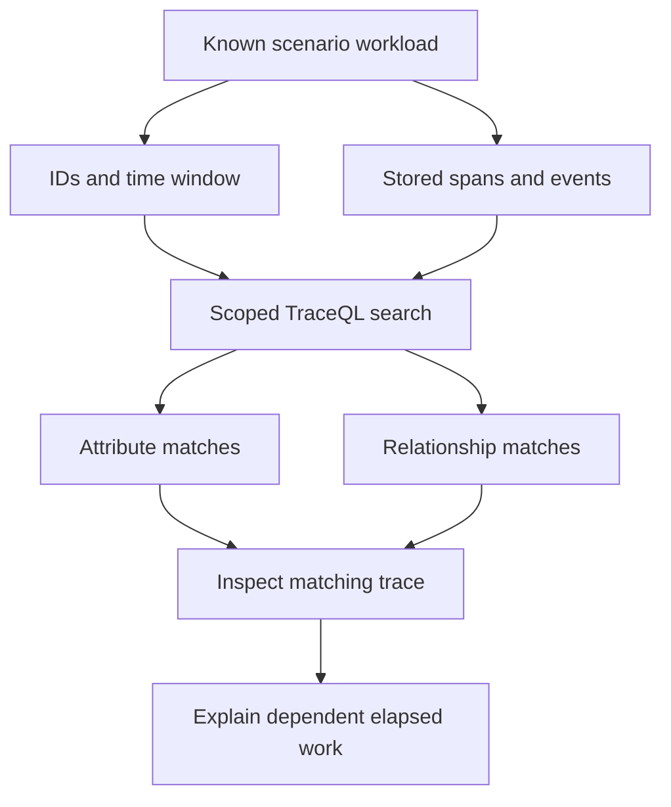

# Lab 37: Tempo Search and TraceQL

## 1. Purpose and Learning Outcomes

You will find traces by known properties of their operations, without needing a trace ID first. Generate a controlled set of normal, slow, and failed requests, then compare filters on fields with queries about span relationships. Open a matching slow trace and explain which awaited work delays completion, keeping elapsed waiting time separate from CPU work.

> **Primary Objective:** Use TraceQL to find known slow and failed requests, then inspect the actual traces to verify the dependency path.

A trace-ID lookup asks for one specific trace. A search asks which stored traces match selected properties. Using the span fields created in Lab 36, you will build searches and predict which known requests should match before running them.

Search by resource, operation, scenario, duration, status, event, and ancestry. Learn which conditions must match one span and which describe relationships between different spans. Use the waterfall to explain the work that determines completion time. Trace-derived metrics, service graphs, and exemplars come in Lab 41.

## 2. Starting Point and Lab Map

Open the complete application repository before using this guide. Unless a step says otherwise, run commands in Bash from the repository's top-level folder. Follow the starting checks in order because later commands depend on the helper functions and running services they prepare.

Read each explanation before running its commands. Run one complete code block, check the result, and then continue. In your notebook, save the commands, what happened, why you think it happened, and anything that differed from the expected result.

### Key Terms

| **Term**        | **Explanation**                                                                            |
| --------------- | ------------------------------------------------------------------------------------------ |
| TraceQL         | Tempo's language for finding traces using span properties and relationships between spans. |
| Attribute scope | The place a field belongs, such as a resource, a span, or an event.                        |
| Critical path   | The sequence of dependent work that must finish before the overall operation can complete. |

### Lab Map

The arrows show how the parts connect and where a request can take different paths. Use this map to understand the design. It is not a recording of a request that actually ran.



## 3. Guided Walkthrough

### Step 01. Inherited State and Starting Checks

**What You Are Doing:** Confirm the custom span fields and healthy signal paths before searching. Queries must refer to fields the application actually emits and the backend retains.

**Practical Walkthrough:** Inspect the current span names and attributes and verify delivery. Keep one known trace ID as a direct-lookup control. If a search returns nothing, this gives you another way to check whether the data exists.

Compare a stored trace with the expected Lab 36 schema before writing filters. Save its exact ID. If direct lookup succeeds while search is empty, investigate field location, query scope, and time range before concluding that the trace was lost.

Complete [Lab 36](Lab-36.md) first. Work from the repository root in one Bash session, keeping the credentials, named volumes, checkpoint item, dashboards, and earlier evidence.

```bash
source lab-notes/session.sh
source lab-notes/evidence.sh
source lab-notes/metrics-session.sh
source lab-notes/platform-session.sh
source lab-notes/traces-session.sh
load_app_settings
start_lab 37
dp config --quiet
dp ps -a
wait_ready
wait_backend loki:3100 /ready
wait_backend tempo:3200 /ready
wait_backend otel-collector:13133 /
wait_backend lab-downstream:8001 /health/live
```

Use `dp`, the stage-aware helper from Lab 31, to preserve the current project and learning overlays. Plain `docker compose up` would use different settings. `start_lab` creates a fresh `LAB_DIR`; save this run's observations there. You still need Bash, Python 3, curl, and jq. YAML edits use the isolated `lab-notes/.tools/bin/python` environment installed in Lab 31.

The inherited platform has thirteen services, nine Prometheus scrape jobs, and four dashboards. No service or scrape job is added here. Pyroscope stays disabled until profiling. Native application metrics still go to Prometheus, traces go through the Collector, and Docker's Fluentd driver sends JSON stdout through the Collector to Loki.

```bash
dp exec -T app python - <<'CHECK'
from app.config import Settings
assert Settings().trace_sample_ratio == 1.0
CHECK
lab-notes/.tools/bin/python - <<'CHECK'
import yaml
c=yaml.safe_load(open('lab-notes/tracing/collector.yml'))
assert not any(p.startswith('tail_sampling') for p in c['service']['pipelines']['traces']['processors'])
print('Search baseline: full head sampling, no tail policy')
CHECK
```

Record the current sampling settings alongside the search window. You cannot judge search completeness without knowing which traces were eligible for storage. A later lab deliberately changes this assumption.

**Understanding the Result:** An empty search and a missing stored trace are different possibilities. Direct lookup of a known ID helps you separate them.

### Step 02. Learning Objectives and Search Vocabulary

**What You Are Doing:** Learn where each queried field belongs and what it means. Even a correct value returns no matches if the query looks for it in the wrong scope.

**Practical Walkthrough:** Identify the scope of every predicate, including resource fields, span attributes, status, and events. Compare the syntax with the stored span structure. A value in a resource field does not automatically match a query for a span attribute with a similar name.

Read each condition's field type explicitly: resource, span attribute, built-in status, or event. Find the same field in the normalized trace output. Use its actual location to construct the expression rather than guessing from a familiar-looking name.

| **Expression**                         | **Meaning in This Repository**                                            |
| -------------------------------------- | ------------------------------------------------------------------------- |
| `resource.service.name`                | Identifies the process that emitted the span                              |
| `resource.deployment.environment.name` | Describes the environment in the resource, rather than in span attributes |
| `span:name`                            | The operation's stable name, such as `demo.evaluate`                      |
| `span.lab.scenario`                    | The custom scenario attribute added to spans in Lab 36                    |
| `span:duration`                        | The elapsed duration of the particular span being matched                 |
| `span:status`                          | The span's status value: `error`, `ok`, or `unset`                        |
| `event:name`                           | The name of an event attached to the matching span                        |
| `trace:duration`                       | The total start-to-end extent represented by the stored trace             |

TraceQL uses a colon for built-in fields, called intrinsics, and a dot for custom scoped attributes. Its syntax differs from PromQL and LogQL. Conditions inside one pair of braces must match the same span. Separate spansets, or groups of matching spans, let you express relationships across a trace.

**Prediction Checkpoint:** One span cannot be named both `demo.evaluate` and `demo.compute`. Error requests should match `span:status=error`. Successful custom spans may remain `unset`, so `status=ok` would miss valid successes in this setup.

**Understanding the Result:** A field's scope is part of its identity. Correct spelling alone is insufficient when the query looks in the wrong location.

### Step 03. Create a Known Search Population

**What You Are Doing:** Generate known scenarios and save their IDs and search interval. Allow time for asynchronous delivery before interpreting an early empty search as missing instrumentation.

**Practical Walkthrough:** Run four requests for each scenario and retain their trace IDs and search interval. Reuse this group throughout the searches. When a filter behaves unexpectedly, investigate it against the known records rather than generating another workload.

Save the twelve-request ledger and exact interval before querying. Expect four examples of each scenario only if the workload completed as directed. Allow delivery time, then refine queries against the same IDs so changing the test population does not hide a bad selector.

```bash
SEARCH_START=$(date +%s)
python3 lab-notes/tracing/scenario_load.py "$APP_URL" "$LAB_DIR/search-ledger.jsonl" --count 12
SEARCH_END=$(( $(date +%s) + 1 ))
printf '%s %s\n' "$SEARCH_START" "$SEARCH_END" > "$LAB_DIR/search-window.txt"
jq -rs '[.[] | {scenario,request_id,trace_id:.response.upstream_trace_id}]' "$LAB_DIR/search-ledger.jsonl" > "$LAB_DIR/known-traces.json"
TRACE_ID=$(jq -r '.[0].trace_id' "$LAB_DIR/known-traces.json")
fetch_trace "$TRACE_ID" "$LAB_DIR/known-trace.json"
```

There are four calls per scenario. Search timestamps are Unix seconds, not trace nanoseconds. The one-second upper margin includes the last request. Delivery and searchable visibility happen asynchronously: direct lookup of one known ID is a useful check, but it does not prove every search can immediately return all records.

Keep the search interval narrow and preserve the ledger. Tempo may also contain background dependency checks or another learner's traffic. Compare your known IDs rather than assuming the global result count must be exactly twelve.

**Understanding the Result:** Known IDs let you check which requests a query includes and excludes. An initially empty search may reflect visibility delay even when instrumentation worked.

### Step 04. Search the Operation through Tempo’s Real API

**What You Are Doing:** Send a properly encoded TraceQL query through Tempo's API and repeat it in Grafana. Use the same service selection and time window in both places.

**Practical Walkthrough:** Query the API, then reproduce the search in Grafana with matching scope. Use seconds for the helper's search-time bounds. Compare returned IDs with your ledger, not just the number displayed by the interface.

Use the helper's encoded query arguments and second-based timestamps. Verify which ledger IDs appear, then run the same search in Grafana. A familiar total can still contain the wrong records, so identity matching is the stronger check.

```bash
Q_ALL="{ resource.service.name = \"$LAB_SERVICE\" && resource.deployment.environment.name = \"$LAB_ENVIRONMENT\" && span:name = \"demo.evaluate\" }"
backend tempo:3200 /api/search q "$Q_ALL" start "$SEARCH_START" end "$SEARCH_END" limit 100 > "$LAB_DIR/search-all.json"
jq '{returned:(.traces // [] | length),metrics,traces}' "$LAB_DIR/search-all.json"
```

The existing `backend` helper sends an HTTP GET from the application container and URL-encodes every key/value pair. Do not place an unescaped TraceQL expression directly into a URL. Tempo remains internal at `tempo:3200`; no additional host port is required.

In Grafana Explore, select the provisioned Tempo data source and switch to TraceQL/code mode. Choose a recent time range containing the workload and paste the generated query. For service `items-info` in environment `local`, it is:

```traceql
{ resource.service.name = "items-info" && resource.deployment.environment.name = "local" && span:name = "demo.evaluate" }
```

`limit=100` caps the returned results; it does not count every matching request. Search ordering and backend work limits can also affect the response. Save response metrics and errors instead of treating a truncated or failed response as complete. If direct lookup works but the search is initially empty, retry within a bounded minute.

**Understanding the Result:** Align the API and interface query scope before comparing results. Incorrect encoding or timestamp units can hide traces that are stored correctly.

### Step 05. Add Duration, Outcome, Status and Event Predicates

**What You Are Doing:** Add duration, outcome, status, and event conditions one at a time. Predict which known scenarios each new condition should retain.

**Practical Walkthrough:** Use the Lab 36 implementation to predict the effect of each filter, then compare the remaining IDs. Adding one predicate at a time makes an unexpected empty result easier to locate than starting with a large compound expression.

After each added condition, compare the matching IDs with the known scenario outcomes. Check duration units, status meaning, and field location independently. This helps identify the particular predicate responsible when results disappear.

```bash
Q_SLOW="{ resource.service.name = \"$LAB_SERVICE\" && span:name = \"demo.evaluate\" && span.lab.scenario = \"slow\" && span:duration > 200ms }"
Q_ERROR="{ resource.service.name = \"$LAB_SERVICE\" && span:name = \"demo.evaluate\" && span:status = error }"
Q_OUTCOME="{ resource.service.name = \"$LAB_SERVICE\" && span:name = \"demo.evaluate\" && span.app.outcome = \"failed\" }"
Q_EVENT='{ resource.service.name = "lab-downstream" && span:name = "demo.compute" && event:name = "work.rejected" }'
backend tempo:3200 /api/search q "$Q_SLOW" start "$SEARCH_START" end "$SEARCH_END" limit 100 > "$LAB_DIR/search-slow.json"
backend tempo:3200 /api/search q "$Q_ERROR" start "$SEARCH_START" end "$SEARCH_END" limit 100 > "$LAB_DIR/search-error.json"
backend tempo:3200 /api/search q "$Q_OUTCOME" start "$SEARCH_START" end "$SEARCH_END" limit 100 > "$LAB_DIR/search-outcome.json"
backend tempo:3200 /api/search q "$Q_EVENT" start "$SEARCH_START" end "$SEARCH_END" limit 100 > "$LAB_DIR/search-event.json"
jq -r '.traces[]?.traceID' "$LAB_DIR/search-error.json"
```

These queries filter fields the code explicitly produces. `span.app.outcome` describes the application's operation outcome, while `span:status` is the general tracing status used by later tail-sampling policies. They agree for these deliberate failures, but other applications may use different error conventions.

The event query finds spans containing `work.rejected` and returns their matching traces; it does not search Loki. The slow query requires the upstream operation's known scenario and elapsed-duration threshold. It does not claim that the whole interval was spent executing on a CPU.

Check that the search includes the error trace IDs recorded in your ledger:

```bash
python3 - "$LAB_DIR" <<'CHECK'
import json,sys
from pathlib import Path
root=Path(sys.argv[1]); known=json.loads((root/'known-traces.json').read_text())
for name,scenario in [('slow','slow'),('error','error'),('outcome','error'),('event','error')]:
    expected={r['trace_id'] for r in known if r['scenario']==scenario}
    result=json.loads((root/f'search-{name}.json').read_text())
    found={r['traceID'].lower() for r in result.get('traces',[])}
    print(name, 'expected', len(expected), 'matched', len(expected & found))
    assert expected <= found, 'Retry the search window; inspect query errors/limits and trace arrival'
CHECK
```

If an assertion fails, investigate rather than expanding the time range without limit. Open one missing known ID, inspect the stored fields, and check time units, scope, API errors, and result caps. These checks can explain why an existing trace did not match.

**Understanding the Result:** Be able to explain why each condition includes or excludes a known request. Keep the original workload as the reference throughout the search exercises.

### Step 06. Prove Relationships, Not Just Co-Occurrence

**What You Are Doing:** Compare conditions on one span, the presence of multiple spans in one trace, and ancestry. Two spans in the same trace are not automatically an ancestor and descendant.

**Practical Walkthrough:** First test conditions that must hold on one span. Then allow different spans in the same trace to match separate conditions. Finally, use the descendant relationship to require an actual execution path between them.

Separate trace membership from tree structure. Two matching spans can coexist without one being beneath the other. An explicit relationship query checks ancestry, which provides stronger structural evidence than simply finding both names in a trace.

```bash
Q_IMPOSSIBLE='{ span:name = "demo.evaluate" && span:name = "demo.compute" }'
Q_BOTH='{ span:name = "demo.evaluate" } && { span:name = "demo.compute" }'
Q_DESCENDANT='{ span:name = "demo.evaluate" } >> { resource.service.name = "lab-downstream" && span:name = "demo.compute" }'
backend tempo:3200 /api/search q "$Q_IMPOSSIBLE" start "$SEARCH_START" end "$SEARCH_END" limit 100 > "$LAB_DIR/search-impossible.json"
backend tempo:3200 /api/search q "$Q_BOTH" start "$SEARCH_START" end "$SEARCH_END" limit 100 > "$LAB_DIR/search-both.json"
backend tempo:3200 /api/search q "$Q_DESCENDANT" start "$SEARCH_START" end "$SEARCH_END" limit 100 > "$LAB_DIR/search-descendant.json"
jq -e '(.traces // [] | length)==0' "$LAB_DIR/search-impossible.json"
```

The first query should return no matches because one span cannot have two different names. The second finds traces containing both span types without proving their ancestry. The third requires `demo.compute` to descend from `demo.evaluate` through the intermediate CLIENT and SERVER spans. Use descendant `>>`, not direct-child `>`, for this chain.

Use search to find candidates, then open a trace and run `verify_boundary.py` on its raw payload. This proves the specific CLIENT-to-SERVER link. Sharing a trace ID or a request ID is weaker evidence than verifying the actual parent relationship.

**Understanding the Result:** Choose the relationship that answers the question. Finding both spans anywhere in one trace does not prove the parent or descendant path between them.

### Step 07. Explain the Critical Path from a Known Slow Trace

**What You Are Doing:** Open a known slow trace and follow the downstream work the caller waits for. Parent durations already include nested elapsed time, so adding all span durations would count the same time repeatedly.

**Practical Walkthrough:** Follow the awaited path through the upstream and downstream operations. Use span start and end positions to see which work delays completion. Parent and child intervals overlap, so their durations cannot simply be added to get response time.

Inspect the start and end of each operation along the blocking path. Identify the work that must finish before the response can complete and the deliberate wait that lengthens it. Avoid summing nested intervals because they describe some of the same elapsed time.

```bash
SLOW_ID=$(jq -r '[.[] | select(.scenario=="slow")][0].trace_id' "$LAB_DIR/known-traces.json")
fetch_trace "$SLOW_ID" "$LAB_DIR/slow-trace.json"
python3 lab-notes/tracing/verify_boundary.py "$LAB_DIR/slow-trace.json"
python3 lab-notes/tracing/inspect_trace.py "$LAB_DIR/slow-trace.json" > "$LAB_DIR/slow-spans.json"
python3 - "$LAB_DIR/slow-spans.json" <<'CHECK'
import json,sys
spans=json.load(open(sys.argv[1])); origin=min(s['start_ns'] for s in spans)
for s in sorted(spans,key=lambda s:s['start_ns']):
    print(f"{(s['start_ns']-origin)/1e6:8.2f} ms start  {s['duration_ms']:8.2f} ms duration  {s['service']}  {s['name']}")
evaluate=next(s for s in spans if s['name']=='demo.evaluate')
compute=next(s for s in spans if s['name']=='demo.compute')
print('compute/evaluate duration ratio:', round(compute['duration_ms']/evaluate['duration_ms'],3))
CHECK
```

Open the trace in Grafana and expand its waterfall. This call is sequential and awaited, so the upstream cannot finish before the downstream compute interval ends. The injected `asyncio.sleep(0.25)` accounts for much of the elapsed delay while using little CPU. Scheduling, network, and framework work can explain the remainder.

The parent's duration includes its children's duration. Adding upstream SERVER, INTERNAL, CLIENT, downstream SERVER, and compute time would repeatedly count the same waiting interval. The calculated ratio describes this controlled nested call; it is neither a general critical-path algorithm nor a CPU-utilization measurement.

For parallel children, completion depends on the dependency that finishes last and blocks the parent, and summed child durations may exceed root duration. Clock skew between hosts can also distort timestamp ordering. Interpret the waterfall alongside parent links and application control flow instead of treating every visual overlap as proof of causation.

**Understanding the Result:** Elapsed duration includes waiting and is different from CPU time. A trace shows timed operations and their relationships, but it does not measure processor consumption by itself.

### Step 08. Correlate Search Findings with Logs and Metrics

**What You Are Doing:** Find the same failed request in logs and inspect the relevant metric interval. Use IDs for individual records while keeping counters and rates at their broader aggregate scope.

**Practical Walkthrough:** Locate the request by exact identities in logs and traces, then examine native metrics over the surrounding interval. The individual example can help explain a broader change, but the metric includes other requests too.

Connect individual records with their request and trace IDs. Compare the aggregate metric window separately, because its counters cannot identify that one request. Explain how the example fits the population without claiming that every request on the graph had the same cause.

Choose one matched error trace. In Loki, select the established service/environment labels, parse JSON, and filter by its exact `trace_id`. Verify upstream 502 and downstream 503 completion statuses. The derived link should open the same trace in Tempo.

In Prometheus, inspect the existing route-template HTTP counter and duration histogram. Compare their time window with the client ledger. Native metrics cover all business requests, while a search returns a capped selection of stored traces. Do not use that result list as a traffic total or SLO denominator.

Write an evidence statement explaining that the four ledger errors were found by outcome, status, and event queries, that their traces show downstream rejection, and that their logs show the mapped HTTP statuses. State the limits too: other traffic may exist, search is bounded, and tracing is currently fully sampled.

**Understanding the Result:** Do not add request IDs to metric labels just to force an exact join. Correlate each signal using evidence appropriate to its scope.

### Step 09. Recovery and Troubleshooting

**What You Are Doing:** Check readiness and current delivery, and keep the synthetic traces until normal retention removes them. Inspect search settings before assuming an unsuccessful query means the backend lost a trace.

**Practical Walkthrough:** Verify current trace delivery and application readiness. For unresolved searches, check timestamp units, selected scope, field location, and ingestion delay. One predicate returning nothing is not enough to diagnose storage loss.

Try current delivery and direct lookup before editing a failed search. Then inspect time units, resource selection, attribute names, and delay. Keep the failed expressions and known traces so you can reproduce the mismatch without replacing the workload.

This lab changes neither application configuration nor schema. Keep the evidence and verify normal readiness. Let the retention policy remove the synthetic traces in time; do not delete Tempo blocks for cleanup.

| **Symptom**                                   | **Check**                                                                                                |
| --------------------------------------------- | -------------------------------------------------------------------------------------------------------- |
| Trace-ID lookup works, search is empty        | Check the query window and units, search visibility delay, field scope, and result limits.               |
| Event query returns no errors                 | Inspect raw span events and confirm that Lab 36's implementation ran the failure scenario.               |
| `status=ok` omits normal work                 | Successful custom spans deliberately remain UNSET. Select them with `app.outcome="success"`.             |
| Both spans exist but direct-child query fails | The HTTP CLIENT and downstream SERVER lie between them, so use descendant `>>`.                          |
| Query syntax error                            | Use TraceQL syntax, scoped built-in fields, and quoted string values rather than PromQL or LogQL syntax. |
| Search count differs from request count       | Check sampling, caps, unrelated traffic, delayed arrival, and partial data. Compare known IDs first.     |
| Latency appears multiplied                    | Do not add parent and child durations that include overlapping time.                                     |

**Understanding the Result:** Check one possible failure point at a time to narrow the cause. Save corrected expressions alongside the known IDs they match.

## 4. Troubleshooting and Diagnosis

Begin with the first result that differed from your prediction. Save the exact error or symptom and identify which service or command produced it. Use the checks below, make the needed fix, and repeat the original check to confirm the problem is resolved.

Use Step 09's recovery and troubleshooting checks to investigate unexpected searches.

## 5. Review and Practice

Answer the questions in your own words before reading the answers. For the scenario, say what you would inspect and exactly what each result would tell you.

### Knowledge Check

1. How do resource attributes differ from span attributes?
2. Why is `{A} && {B}` weaker than `{A} >> {B}`?
3. Why can a trace search result count not establish a service error rate?
4. Does a 250 ms span prove 250 ms of CPU work?

#### Answer Guide

1. Resource attributes identify the emitting service or process. Span attributes describe the particular operation represented by one span.
2. The first only requires both matching spans to occur in the same trace. The second requires an ancestor-descendant relationship between them.
3. Sampling, search windows, result caps, and partial arrival affect which traces are returned. The result count is therefore not a complete traffic total.
4. No. The interval can include waiting, network delay, and scheduling. Later profiling labs examine CPU work directly.

### Professional Scenario Exercise

An incident report blames the database because the root HTTP span is long. Use the known slow scenario to demonstrate a dependency wait on the critical path. Then explain what additional evidence would be needed to blame SQL in a real incident. Include one useful TraceQL query and one misleading query, and explain what each actually asks.

## 6. Completion Checklist

Tick an item only when you can show its result or saved evidence. Finish the cleanup instructions before starting the next lab.

### Observable Completion Criteria

- [ ] The fixed workload ledger and limited search window are saved.
- [ ] Known slow and failed trace IDs are found using fields emitted by Lab 36.
- [ ] The contradictory same-span query returns nothing, while the ancestry query finds the expected chain.
- [ ] The slow waterfall is explained without adding overlapping durations.
- [ ] Logs and native HTTP metrics are compared without treating trace search results as total traffic.

## 7. Production Context and Next Lab

### Production Implications

Use stable attribute conventions so searches continue to work across releases. Limit broad, expensive queries and control trace access because metadata can contain sensitive information. Compare search findings with native request metrics that are not trace-sampled. See [TraceQL query construction](https://grafana.com/docs/tempo/latest/traceql/construct-traceql-queries/) and [Tempo HTTP API](https://grafana.com/docs/tempo/latest/api_docs/).

### End State and Transition

Keep the application and Collector in the Lab 36 configuration, with full head sampling and no tail sampler. [Lab 38](Lab-38.md) changes the sampling setting and measures how much diagnostic evidence is no longer retained.
