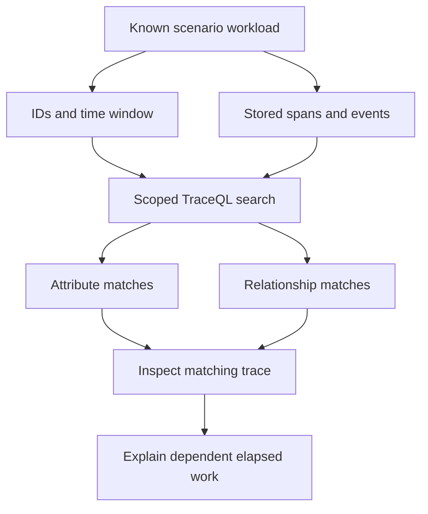

# Lab 37: Tempo Search and TraceQL

## 1. Purpose and Learning Outcomes

**In Plain Language:** You will search for traces by known operation properties instead of starting with a trace ID. Generate a controlled set of normal, slow, and failed requests, then compare attribute filters with relationship queries. Open a matching slow trace to explain the blocking path, keeping elapsed waiting time separate from CPU work.

> **Primary Objective:** Find known slow and failed requests using TraceQL, then verify the dependency path in the actual trace.

A trace ID lookup answers “show this trace.” Search answers “which stored traces match these properties?” This lab uses the span schema implemented in Lab 36 to build queries whose expected results are known in advance.

You will search by resource, operation, scenario, duration, status, event and ancestry. You will distinguish span-local predicates from relationships across spans and use a waterfall to reason about the critical path. Trace-derived metrics, service graphs and exemplars belong to Lab 41 and are excluded here.

## 2. Starting Point and Lab Map

Use this guide inside the complete application repository. Run commands from the repository root in Bash unless a step says otherwise. Work through the starting checks in order; they load the helpers and state this lab needs.

Read the explanation before each step, run one complete code block at a time, and compare the actual result with the stated expectation. Save commands, observations, explanations, and unexpected results in your notebook.

### Key Terms

| **Term**        | **Plain-Language Meaning**                                                           |
| --------------- | ------------------------------------------------------------------------------------ |
| TraceQL         | Tempo's query language for selecting traces using span properties and relationships. |
| Attribute scope | Whether a field belongs to a resource, span, or event.                               |
| Critical path   | The dependent sequence of work that determines completion time for the operation.    |

### Lab Map

The arrows show the flow or dependency being studied. Branches identify paths to compare; this is a conceptual map, not a captured runtime trace.



## 3. Guided Walkthrough

### Step 01. Inherited State and Starting Checks

**What You Are Doing:** Confirm the custom span schema and fully recovered signal paths. Search predicates must refer to fields the application actually emits.

**Practical Walkthrough:** Verify the custom span names, attributes, and current signal paths before constructing searches. TraceQL can only select fields actually emitted and retained under the current schema. Keep a known trace ID as a direct-lookup control when a broader search returns no results.

Compare current stored span fields with the expected Lab 36 schema before writing predicates. Retain one exact trace ID as a lookup control. If direct retrieval works while search is empty, inspect query scope, time range, and field location before diagnosing trace loss.

Complete [Lab 36](Lab-36.md) first. Run from the repository root in one Bash session; keep the existing credentials, named volumes, checkpoint item, dashboards and earlier evidence.

```bash
source lab-notes/session.sh
source lab-notes/evidence.sh
source lab-notes/metrics-session.sh
source lab-notes/platform-session.sh
source lab-notes/traces-session.sh
load_app_settings
start_lab 37
dp config --quiet
dp ps -a
wait_ready
wait_backend loki:3100 /ready
wait_backend tempo:3200 /ready
wait_backend otel-collector:13133 /
wait_backend lab-downstream:8001 /health/live
```

`dp` is the stage-aware Compose helper from Lab 31. It preserves the learning overlays and the current project. Plain `docker compose up` would use a different set of settings. `start_lab` creates a new `LAB_DIR`; all observations in this guide belong to that directory. Host tools remain Bash, Python 3, curl and jq; YAML edits use the isolated `lab-notes/.tools/bin/python` environment already installed in Lab 31.

The inherited platform has thirteen services, nine Prometheus scrape jobs and four existing dashboards. These labs add no service or scrape job. Pyroscope remains disabled until the profiling phase. The application still exposes native Prometheus metrics; traces travel through the Collector; Docker's fluentd logging driver sends JSON stdout to the same Collector and then Loki.

```bash
dp exec -T app python - <<'CHECK'
from app.config import Settings
assert Settings().trace_sample_ratio == 1.0
CHECK
lab-notes/.tools/bin/python - <<'CHECK'
import yaml
c=yaml.safe_load(open('lab-notes/tracing/collector.yml'))
assert not any(p.startswith('tail_sampling') for p in c['service']['pipelines']['traces']['processors'])
print('Search baseline: full head sampling, no tail policy')
CHECK
```

Search completeness cannot be judged without the sampling state. Record those checks alongside your query window; a later lab intentionally changes what Tempo retains.

**Understanding the Result:** Search failure and missing trace storage are different possibilities. Direct lookup helps separate them.

### Step 02. Learning Objectives and Search Vocabulary

**What You Are Doing:** Learn the scope and meaning of the fields used by the queries. A correct value under the wrong attribute scope can still produce no matches.

**Practical Walkthrough:** Read the field scope for each predicate, including resource identity, span attributes, status, and events. A value stored under one scope will not necessarily match an expression targeting another. Use the supplied vocabulary to connect query syntax to the actual stored span structure.

Read each predicate's scope explicitly: resource, span attribute, intrinsic status, or event. Match it to the normalized trace output. Similar field names at different scopes are not interchangeable, so the stored structure should guide the expression rather than a guessed name.

| **Expression**                         | **Meaning in This Repository**                 |
| -------------------------------------- | ---------------------------------------------- |
| `resource.service.name`                | Which process produced the span                |
| `resource.deployment.environment.name` | Environment identity, not a span attribute     |
| `span:name`                            | Stable operation name, such as `demo.evaluate` |
| `span.lab.scenario`                    | Custom span attribute set in Lab 36            |
| `span:duration`                        | Duration of that matching span                 |
| `span:status`                          | Span status enum: `error`, `ok` or `unset`     |
| `event:name`                           | Name of an event attached to a matching span   |
| `trace:duration`                       | End-to-end extent of the stored trace          |

TraceQL uses a colon for intrinsics and a dot for custom scoped attributes. This is not PromQL or LogQL. A condition inside one pair of braces must match the same span; separate spansets can express relationships across a trace.

**Prediction Checkpoint:** `demo.evaluate` and `demo.compute` cannot both be the name of one span. Error requests should match `span:status=error`; a normal success may be `unset`, so `status=ok` is not a reliable definition of success here.

**Understanding the Result:** Correct spelling alone is insufficient. Attribute scope is part of the field's identity.

### Step 03. Create a Known Search Population

**What You Are Doing:** Generate known scenarios and preserve their IDs and search interval. Allow for asynchronous ingestion before treating an early empty search as missing instrumentation.

**Practical Walkthrough:** Generate four requests for each scenario and retain their trace IDs and search interval. Allow asynchronous delivery before judging the first search. Reuse this known population throughout the exercises rather than creating more examples whenever a filter produces an unexpected result.

Save the twelve-request ledger and exact search interval before querying. Expect four examples per scenario only if the workload completed as prescribed. Allow asynchronous delivery and reuse these IDs for all refinements so a changed population cannot conceal a faulty selector.

```bash
SEARCH_START=$(date +%s)
python3 lab-notes/tracing/scenario_load.py "$APP_URL" "$LAB_DIR/search-ledger.jsonl" --count 12
SEARCH_END=$(( $(date +%s) + 1 ))
printf '%s %s\n' "$SEARCH_START" "$SEARCH_END" > "$LAB_DIR/search-window.txt"
jq -rs '[.[] | {scenario,request_id,trace_id:.response.upstream_trace_id}]' "$LAB_DIR/search-ledger.jsonl" > "$LAB_DIR/known-traces.json"
TRACE_ID=$(jq -r '.[0].trace_id' "$LAB_DIR/known-traces.json")
fetch_trace "$TRACE_ID" "$LAB_DIR/known-trace.json"
```

There are four calls per scenario. The saved timestamps are Unix seconds for the search API; they are not trace nanoseconds. A one-second upper margin includes the final request. Trace arrival and searchable visibility are asynchronous, so a successful known-ID lookup is a useful starting check rather than proof that every query has immediately indexed all results.

Keep the time window narrow and preserve the ledger. Background dependency checks and another learner's traffic can coexist in Tempo; comparing known IDs is more reliable than expecting a global result count of exactly twelve.

**Understanding the Result:** Known identities make inclusion and exclusion testable. An early empty search can reflect visibility delay rather than missing instrumentation.

### Step 04. Search the Operation through Tempo’s Real API

**What You Are Doing:** Send an encoded TraceQL query through Tempo's API and reproduce it in Grafana. Keep the same time window and service scope across both views.

**Practical Walkthrough:** Send the encoded query through Tempo's API and reproduce it in Grafana with the same service and time scope. Keep timestamp units as specified; search bounds use seconds where the helper expects them. Compare trace identities rather than relying only on a displayed result count.

Use the helper's expected second-based search bounds and encoded query arguments. Compare returned trace IDs with the ledger, then reproduce the same scope in Grafana. A familiar result count alone cannot prove the search selected the intended requests.

```bash
Q_ALL="{ resource.service.name = \"$LAB_SERVICE\" && resource.deployment.environment.name = \"$LAB_ENVIRONMENT\" && span:name = \"demo.evaluate\" }"
backend tempo:3200 /api/search q "$Q_ALL" start "$SEARCH_START" end "$SEARCH_END" limit 100 > "$LAB_DIR/search-all.json"
jq '{returned:(.traces // [] | length),metrics,traces}' "$LAB_DIR/search-all.json"
```

The existing `backend` helper runs an HTTP GET from the app container and URL-encodes each key/value pair. Do not concatenate an unescaped TraceQL expression into a URL. Tempo remains internal at `tempo:3200`; no new host port is needed.

In Grafana Explore, select the provisioned Tempo datasource, switch to the TraceQL/code query mode, set a recent time range covering the workload and paste the resulting query. If your service is `items-info` in `local`, the query is:

```traceql
{ resource.service.name = "items-info" && resource.deployment.environment.name = "local" && span:name = "demo.evaluate" }
```

`limit=100` is a result cap, not a count of all matching requests. Search ordering and backend work limits also matter. Record response metrics and any error rather than treating a truncated/failed response as complete evidence. Repeat within a bounded minute if the first search is empty while the known trace is retrievable.

**Understanding the Result:** API and UI comparisons need aligned scope. Encoding or time-unit mistakes can hide otherwise valid traces.

### Step 05. Add Duration, Outcome, Status and Event Predicates

**What You Are Doing:** Add duration, outcome, status, and event predicates one at a time. Each should narrow the known population in a way you can predict from the scenario implementation.

**Practical Walkthrough:** Add one predicate at a time and predict which known scenarios it should retain. Compare duration, outcome, status, and event conditions with the implementation from Lab 36. Gradual refinement makes an unexpectedly empty result easier to locate than one large untested expression.

Add one condition at a time and compare the remaining IDs with known scenario outcomes. Check duration units, status semantics, and attribute location separately. This makes an empty result attributable to a particular predicate rather than an unexplained failure of the whole compound query.

```bash
Q_SLOW="{ resource.service.name = \"$LAB_SERVICE\" && span:name = \"demo.evaluate\" && span.lab.scenario = \"slow\" && span:duration > 200ms }"
Q_ERROR="{ resource.service.name = \"$LAB_SERVICE\" && span:name = \"demo.evaluate\" && span:status = error }"
Q_OUTCOME="{ resource.service.name = \"$LAB_SERVICE\" && span:name = \"demo.evaluate\" && span.app.outcome = \"failed\" }"
Q_EVENT='{ resource.service.name = "lab-downstream" && span:name = "demo.compute" && event:name = "work.rejected" }'
backend tempo:3200 /api/search q "$Q_SLOW" start "$SEARCH_START" end "$SEARCH_END" limit 100 > "$LAB_DIR/search-slow.json"
backend tempo:3200 /api/search q "$Q_ERROR" start "$SEARCH_START" end "$SEARCH_END" limit 100 > "$LAB_DIR/search-error.json"
backend tempo:3200 /api/search q "$Q_OUTCOME" start "$SEARCH_START" end "$SEARCH_END" limit 100 > "$LAB_DIR/search-outcome.json"
backend tempo:3200 /api/search q "$Q_EVENT" start "$SEARCH_START" end "$SEARCH_END" limit 100 > "$LAB_DIR/search-event.json"
jq -r '.traces[]?.traceID' "$LAB_DIR/search-error.json"
```

These are explicit filters on fields the code produces. `span.app.outcome` describes the operation contract; `span:status` is the general trace status used by later tail policies. They should agree for these controlled failures, but arbitrary real applications can have different error conventions.

The event query selects spans with a `work.rejected` event and returns their matching traces. It does not query Loki. The slow query asks for an upstream operation with both the known scenario and sufficient elapsed time; it does not conclude that CPU execution consumed that time.

Verify the known error IDs are included:

```bash
python3 - "$LAB_DIR" <<'CHECK'
import json,sys
from pathlib import Path
root=Path(sys.argv[1]); known=json.loads((root/'known-traces.json').read_text())
for name,scenario in [('slow','slow'),('error','error'),('outcome','error'),('event','error')]:
    expected={r['trace_id'] for r in known if r['scenario']==scenario}
    result=json.loads((root/f'search-{name}.json').read_text())
    found={r['traceID'].lower() for r in result.get('traces',[])}
    print(name, 'expected', len(expected), 'matched', len(expected & found))
    assert expected <= found, 'Retry the search window; inspect query errors/limits and trace arrival'
CHECK
```

An assertion failure is an investigation trigger, not permission to increase the time window indefinitely. First open one missing known ID, inspect its stored fields, then check time units, matching scope, API errors and result limits.

**Understanding the Result:** Each predicate should have a reason for including or excluding an ID. Retain the known population as the reference.

### Step 06. Prove Relationships, Not Just Co-Occurrence

**What You Are Doing:** Compare same-span conditions, trace-wide co-occurrence, and ancestry. Two spans existing in one trace does not by itself establish that one descended from the other.

**Practical Walkthrough:** Compare conditions required on one span with conditions allowed on different spans in the same trace. Then test ancestry using the documented descendant relationship. Co-occurrence proves both spans exist, but does not establish that one operation caused or contained the other.

Distinguish two conditions on one span from separate spans satisfying conditions within one trace. Then inspect the explicit relationship query. Co-occurrence establishes membership, while ancestry establishes structure; neither should be described as the other when explaining the distributed operation.

```bash
Q_IMPOSSIBLE='{ span:name = "demo.evaluate" && span:name = "demo.compute" }'
Q_BOTH='{ span:name = "demo.evaluate" } && { span:name = "demo.compute" }'
Q_DESCENDANT='{ span:name = "demo.evaluate" } >> { resource.service.name = "lab-downstream" && span:name = "demo.compute" }'
backend tempo:3200 /api/search q "$Q_IMPOSSIBLE" start "$SEARCH_START" end "$SEARCH_END" limit 100 > "$LAB_DIR/search-impossible.json"
backend tempo:3200 /api/search q "$Q_BOTH" start "$SEARCH_START" end "$SEARCH_END" limit 100 > "$LAB_DIR/search-both.json"
backend tempo:3200 /api/search q "$Q_DESCENDANT" start "$SEARCH_START" end "$SEARCH_END" limit 100 > "$LAB_DIR/search-descendant.json"
jq -e '(.traces // [] | length)==0' "$LAB_DIR/search-impossible.json"
```

The first query should match nothing because a single name cannot equal two different strings. The second finds traces containing both kinds of span, without proving ancestry. The third requires `demo.compute` to be a descendant of `demo.evaluate`, crossing intermediate CLIENT and SERVER spans. Use `>>`, not direct-child `>`, for that chain.

Search narrows the investigation. Open a matching trace and run `verify_boundary.py` on its raw payload to prove the particular CLIENT-to-SERVER edge. Two spans sharing a trace, or sharing a request ID in logs, is weaker evidence than the actual parent relation.

**Understanding the Result:** Choose the relationship matching the question. Trace-wide presence is weaker evidence than a verified parent or descendant path.

### Step 07. Explain the Critical Path from a Known Slow Trace

**What You Are Doing:** Open a known slow trace and follow the awaited downstream work. Parent duration already contains nested elapsed intervals, so summing all span durations would double-count time.

**Practical Walkthrough:** Open a known slow trace and follow the critical awaited path through upstream and downstream operations. Parent elapsed time already contains its nested intervals, so adding all span durations double-counts overlapping work. Use start and end positions to understand where waiting extends the request.

Follow start and end positions along the awaited path instead of summing parent and child durations. Nested intervals overlap, so their simple sum double-counts time. Identify which operation extends the response's critical path and where a deliberate wait accounts for elapsed duration.

```bash
SLOW_ID=$(jq -r '[.[] | select(.scenario=="slow")][0].trace_id' "$LAB_DIR/known-traces.json")
fetch_trace "$SLOW_ID" "$LAB_DIR/slow-trace.json"
python3 lab-notes/tracing/verify_boundary.py "$LAB_DIR/slow-trace.json"
python3 lab-notes/tracing/inspect_trace.py "$LAB_DIR/slow-trace.json" > "$LAB_DIR/slow-spans.json"
python3 - "$LAB_DIR/slow-spans.json" <<'CHECK'
import json,sys
spans=json.load(open(sys.argv[1])); origin=min(s['start_ns'] for s in spans)
for s in sorted(spans,key=lambda s:s['start_ns']):
    print(f"{(s['start_ns']-origin)/1e6:8.2f} ms start  {s['duration_ms']:8.2f} ms duration  {s['service']}  {s['name']}")
evaluate=next(s for s in spans if s['name']=='demo.evaluate')
compute=next(s for s in spans if s['name']=='demo.compute')
print('compute/evaluate duration ratio:', round(compute['duration_ms']/evaluate['duration_ms'],3))
CHECK
```

Open this trace in Grafana and expand the full waterfall. In this sequential, awaited call, the downstream compute interval blocks completion of the upstream operation. The injected `asyncio.sleep(0.25)` explains much of the path's elapsed time while consuming little CPU. The remainder can include scheduling, network and framework work.

Parent duration includes child duration. Adding upstream SERVER + INTERNAL + CLIENT + downstream SERVER + compute durations double-counts the same waiting time repeatedly. The ratio above is descriptive for this controlled nested call, not a general critical-path algorithm or CPU-utilization measurement.

With parallel children, the slowest dependency that blocks completion matters; total child durations can exceed root duration. Across different hosts, clock skew complicates timestamp ordering. Use parentage and application control flow alongside the waterfall instead of assuming every visual overlap proves causation.

**Understanding the Result:** Elapsed duration is not CPU time. The trace identifies timed work and waiting relationships, not processor consumption by itself.

### Step 08. Correlate Search Findings with Logs and Metrics

**What You Are Doing:** Find the same failed request in logs and the relevant metric interval. Use exact identities for individual evidence while keeping aggregate counters at their broader population scope.

**Practical Walkthrough:** Find the same failed request in logs using exact identities, then examine native metrics over its broader interval. Logs and traces can identify that request; a counter or rate aggregates many requests. Keep these scopes distinct while explaining how the individual example fits the population-level change.

Use exact request and trace identities to connect individual records, then compare the broader metric interval separately. Aggregated counters cannot identify that request by themselves. Explain how the example fits the population without claiming every request in the rate curve had the same cause.

Select one matched error trace. In Loki, filter the established service/environment labels, parse JSON and filter its exact `trace_id`. Confirm the upstream completion status 502 and downstream 503. The derived trace link should return you to the same stored trace.

In Prometheus, inspect the application's existing route-template HTTP counter and duration histogram from the earlier metrics labs. Compare their time window with your client ledger. Those native measurements include all business requests; the query result list is a capped selection of stored traces and is not a request-rate or SLO denominator.

Write one evidence statement: “Four client-ledger errors in this run were found by outcome, status and event queries; their traces show the downstream rejection and their completion logs show the mapped HTTP statuses.” Add limits: other traffic may exist, the search is bounded, and tracing is presently fully sampled.

**Understanding the Result:** Do not add request IDs to metric labels to force an exact join. Use correlation evidence appropriate to each signal.

### Step 09. Recovery and Troubleshooting

**What You Are Doing:** Verify readiness and preserve the known synthetic traces under normal retention. Diagnose time units, visibility delay, and field scope before assuming the backend lost a trace.

**Practical Walkthrough:** Verify readiness and current trace delivery while preserving the scenario traces under normal retention. For unresolved searches, check time units, selected scope, attribute location, and ingestion delay in order. Do not assume the backend lost a trace solely because one predicate returned nothing.

Check current delivery and direct lookup before changing search predicates. For a remaining mismatch, inspect time units, resource scope, attribute names, and delivery delay. Preserve known scenario traces and failed expressions so the difference can be reproduced without generating a replacement workload.

This lab changes no application configuration or schema. Keep the evidence and verify normal readiness. Do not delete Tempo blocks to remove synthetic traces; the retention policy will age them out.

| **Symptom**                                   | **Check**                                                                                    |
| --------------------------------------------- | -------------------------------------------------------------------------------------------- |
| Trace-ID lookup works, search is empty        | Query window/units, search visibility delay, attribute scope and result limits.              |
| Event query returns no errors                 | Inspect raw span events; confirm Lab 36 code is running and the failure scenario executed.   |
| `status=ok` omits normal work                 | Successful custom spans intentionally remain UNSET; use `app.outcome="success"`.             |
| Both spans exist but direct-child query fails | Intermediate HTTP CLIENT and downstream SERVER spans require descendant `>>`.                |
| Query syntax error                            | Keep TraceQL distinct from PromQL/LogQL; use scoped intrinsics and quote string values.      |
| Search count differs from request count       | Sampling, limits, unrelated traffic, arrival delay or partial data; compare known IDs first. |
| Latency appears multiplied                    | Do not sum inclusive parent/child durations.                                                 |

**Understanding the Result:** A systematic boundary check narrows the cause. Record corrected expressions and their known matching IDs.

## 4. Troubleshooting and Diagnosis

Start with the first unexpected result. Record the exact symptom, identify which component produced it, and use the checks below before repeating the experiment. After a fix, repeat the original check and confirm recovery.

Use the recovery and troubleshooting checks in Step 09.

## 5. Review and Practice

Answer the knowledge questions in your own words before reading the answer guide. For the scenario, name the evidence you would collect and the conclusion each observation would support.

### Knowledge Check

1. How do resource attributes differ from span attributes?
2. Why is `{A} && {B}` weaker than `{A} >> {B}`?
3. Why can a trace search result count not establish a service error rate?
4. Does a 250 ms span prove 250 ms of CPU work?

#### Answer Guide

1. Resource attributes identify the emitter; span attributes describe one operation.
2. The first establishes same-trace presence; the second establishes an ancestor/descendant relationship.
3. Sampling, bounded windows, result caps and partial arrival change which traces are returned.
4. No. Elapsed time can include waiting, network delay and scheduling; profiling addresses CPU work later.

### Professional Scenario Exercise

An incident report says “the database is slow” because the root HTTP span is long. Use a known slow scenario to show a dependency wait on the critical path, then write what evidence would be needed before attributing a real incident to SQL. Include one useful TraceQL query, one misleading query and an explanation of each.

## 6. Completion Checklist

Mark each item only after you can point to its result or evidence file. Complete any cleanup shown here before moving on.

### Observable Completion Criteria

- [ ] A fixed workload ledger and bounded search window are saved.
- [ ] Known slow and failed IDs are located with fields actually produced in Lab 36.
- [ ] The same-span contradiction returns no matches; ancestry query finds the expected chain.
- [ ] A slow waterfall is explained without adding overlapping durations.
- [ ] Logs and native HTTP metrics are correlated without treating trace results as traffic totals.

## 7. Production Context and Next Lab

### Production Implications

Choose stable attribute conventions so searches survive releases. Limit expensive broad queries and protect trace access because metadata can still be sensitive. Correlate search evidence with unsampled native request metrics. See [TraceQL query construction](https://grafana.com/docs/tempo/latest/traceql/construct-traceql-queries/) and [Tempo HTTP API](https://grafana.com/docs/tempo/latest/api_docs/).

### End State and Transition

The application and Collector remain in the Lab 36 configuration, fully head-sampled with no tail sampler. [Lab 38](Lab-38.md) changes that assumption and measures the resulting diagnostic loss.
