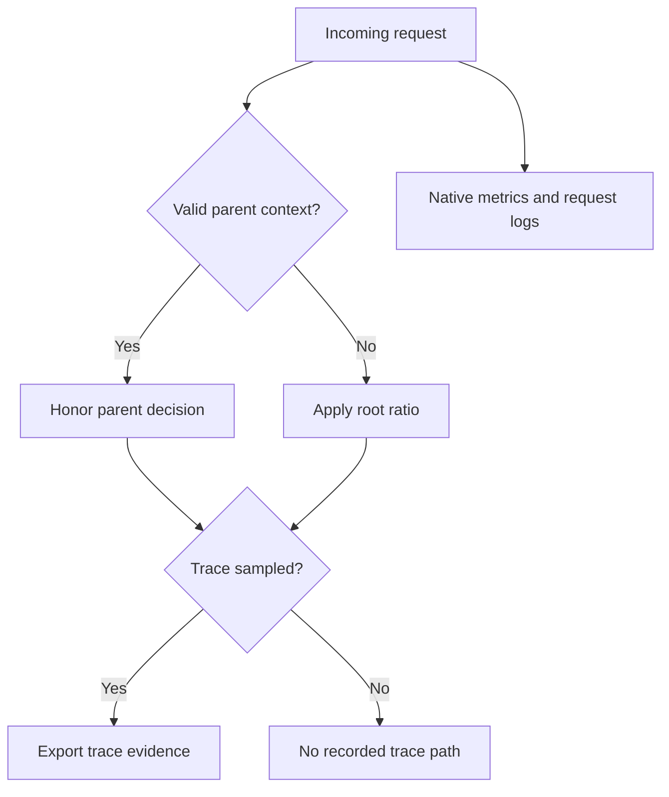

# Lab 38: Head Sampling and Diagnostic Loss

## 1. Purpose and Learning Outcomes

You will measure how much detailed trace evidence remains at different head-sampling ratios. Use a ledger of known IDs to count retained traces and check their completeness instead of estimating from search totals. Compare error-trace coverage with logs and native metrics, then test how an incoming sampled parent changes which sampling rule applies.

> **Primary Objective:** Measure how head-sampling ratios change the traces and span events that are retained while requests, logs, and native metrics continue to work.

Sampling deliberately keeps only some trace evidence. A head sampler decides when an operation starts, before knowing its final duration or outcome. This lab compares 100%, 25%, and 0% root sampling using the same small mix of scenarios and saved trace IDs.

Separate the SDK's sampling decision from actual backend retention. Measure missing spans and events, then demonstrate parent-based behavior. This lab does not introduce tail sampling, Collector queue faults, or disk-cost claims based on assumed compression. Restore full head sampling at the end for Lab 39.

## 2. Starting Point and Lab Map

Open the complete application repository before using this guide. Unless a step says otherwise, run commands in Bash from the repository's top-level folder. Follow the starting checks in order because later commands depend on the helper functions and running services they prepare.

Read each explanation before running its commands. Run one complete code block, check the result, and then continue. In your notebook, save the commands, what happened, why you think it happened, and anything that differed from the expected result.

### Key Terms

| **Term**              | **Explanation**                                                                                             |
| --------------------- | ----------------------------------------------------------------------------------------------------------- |
| Head sampling         | Deciding whether to record a trace when it starts, before its final duration or outcome is known.           |
| Parent-based sampling | Following the sampling decision in an incoming parent context when that context is present.                 |
| Retention audit       | Looking up known trace IDs and checking the expected spans against the data actually stored in the backend. |

### Lab Map

The arrows show how the parts connect and where a request can take different paths. Use this map to understand the design. It is not a recording of a request that actually ran.



## 3. Guided Walkthrough

### Step 01. Inherited State and Starting Checks

**What You Are Doing:** Verify the scenario workload and full-sampling baseline before lowering the ratio. Later differences should come from the sampling setting, not unresolved delivery failures.

**Practical Walkthrough:** Confirm that the full-sampling workload produces complete expected span paths. This positive control checks instrumentation and transport. Keep the scenario mixture the same in later runs so you can compare the effect of changing the ratio.

Audit complete traces at full sampling first. If that baseline is incomplete, fix it before reducing the ratio. Otherwise, you could incorrectly label an export or instrumentation failure as an intentional sampling decision.

Complete [Lab 37](Lab-37.md) first. Work from the repository root in one Bash session and retain the credentials, named volumes, checkpoint item, dashboards, and earlier evidence.

```bash
source lab-notes/session.sh
source lab-notes/evidence.sh
source lab-notes/metrics-session.sh
source lab-notes/platform-session.sh
source lab-notes/traces-session.sh
load_app_settings
start_lab 38
dp config --quiet
dp ps -a
wait_ready
wait_backend loki:3100 /ready
wait_backend tempo:3200 /ready
wait_backend otel-collector:13133 /
wait_backend lab-downstream:8001 /health/live
```

Use `dp`, the stage-aware helper from Lab 31, to preserve the current project and learning overlays. Plain `docker compose up` would use different settings. `start_lab` creates a fresh `LAB_DIR`; save this run's observations there. You still need Bash, Python 3, curl, and jq. YAML edits use the isolated `lab-notes/.tools/bin/python` environment installed in Lab 31.

The inherited platform has thirteen services, nine Prometheus scrape jobs, and four dashboards. No service or scrape job is added here. Pyroscope stays disabled until profiling. Native application metrics still go to Prometheus, traces go through the Collector, and Docker's Fluentd driver sends JSON stdout through the Collector to Loki.

```bash
cp lab-notes/compose.auto-tracing.yaml "$LAB_DIR/compose.auto-tracing.yaml.before"
lab-notes/.tools/bin/python - <<'CHECK'
import yaml
c=yaml.safe_load(open('lab-notes/tracing/collector.yml'))
assert not any(p.startswith('tail_sampling') for p in c['service']['pipelines']['traces']['processors'])
CHECK
```

Stop other learning load generators during each measurement, but leave dependency health monitoring running. The audit uses only this run's known request IDs, so background traces are outside its total. Record each planned application recreation as a change event; existing startup or error alerts may observe those changes.

**Understanding the Result:** Comparable source workloads and a complete baseline are needed to interpret sampling results. Fix missing baseline data before measuring intentional reductions.

### Step 02. Learning Objectives and Sampling Predictions

**What You Are Doing:** Predict new-root behavior separately from requests that already carry parent context. The root ratio applies only when the request starts without a parent.

**Practical Walkthrough:** Separate independent roots from requests carrying incoming context. The root sampler decides for a new trace, while the parent-based sampler can honor an inherited decision. Keep the two cases separate in your predictions and ledger.

For independent roots, record the configured probability and expect the observed count to vary in a small run. For parented requests, inspect the incoming sampled flag and the parent's effect on the decision. Separate ledger groups explain why a trace can be retained at a zero root ratio without a sampling defect.

The application uses `ParentBased(TraceIdRatioBased(ratio))`. A valid incoming parent can determine the decision; the root ratio applies when no parent exists. Lab 36's standard-library caller sends no `traceparent`, making each request an independent root. The downstream follows the decision propagated from upstream.

| **Root Ratio** | **Expected Behavior for 60 Calls**         | **Diagnostic Implication**                                                |
| -------------- | ------------------------------------------ | ------------------------------------------------------------------------- |
| 1.0            | All 60 roots are selected for sampling     | Provides a complete controlled baseline if export succeeds                |
| 0.25           | About 15 roots are expected to be selected | Some slow and failed traces, including their events, will be absent       |
| 0.0            | No independent roots are selected          | Requests, logs, and metrics continue, but detailed traces are unavailable |

**Prediction Checkpoint:** Normal, slow, and error roots have the same head-sampling probability. An error discovered later cannot reverse an earlier DROP decision. A log can still have a valid trace ID with `trace_sampled=false`; that ID provides context without promising a retrievable trace.

For 60 independent roots at 25%, the expected retained count is 15, with a binomial standard deviation of about 3.35. Therefore, a result other than exactly 15 does not by itself fail the test. The twenty-error subgroup has an expected five sampled traces, also with substantial variation.

**Understanding the Result:** A zero root ratio does not force every remotely parented trace to be unsampled. Incoming parent context can make a different decision rule apply.

### Step 03. Make the Existing Root Ratio Explicitly Switchable

**What You Are Doing:** Make the active overlay's ratio configurable and recreate only the app to apply changes. Restarting the existing container does not load a newly defined environment.

**Practical Walkthrough:** Change the ratio through the active overlay, then recreate the application. Environment settings are established at container creation. Record the new process boundary before taking counter baselines, because recreation resets process-local values.

Follow the ratio helper's sequence: set the value, recreate the app, wait for readiness, and inspect the effective sampler. A shell variable affects the Compose command that reads it; it does not update an already running process. Keep each ratio's evidence separate because its counters belong to a different application lifetime.

```bash
lab-notes/.tools/bin/python - <<'PYTHON'
from pathlib import Path
import yaml
path=Path('lab-notes/compose.auto-tracing.yaml')
config=yaml.safe_load(path.read_text())
config['services']['app']['environment']['TRACE_SAMPLE_RATIO']='${LAB_HEAD_SAMPLE_RATIO:-1.0}'
path.write_text(yaml.safe_dump(config,sort_keys=False))
PYTHON
set_head_ratio() {
  case "$1" in 1.0|0.25|0.0) ;; *) echo 'Use 1.0, 0.25 or 0.0' >&2; return 2 ;; esac
  export LAB_HEAD_SAMPLE_RATIO="$1"
  dp config --quiet || return
  dp up -d --no-deps --force-recreate app || return
  wait_ready || return
  dp exec -T app python - "$1" <<'CHECK'
import sys
from app.config import Settings
s=Settings()
assert s.otel_enabled and s.trace_sample_ratio==float(sys.argv[1])
print('Active root ratio:',s.trace_sample_ratio)
CHECK
}
```

The edit changes the overlay already loaded by `dp`. An arbitrary new overlay filename would not be included automatically. The function recreates only the app because `restart` would keep the previous environment. It prints the ratio without displaying resolved credentials or the full environment.

The downstream's root sampler remains at 1.0. With correct propagation, it receives a parent and honors the upstream decision. If Lab 35's context-stripping fault remains active, it can create new sampled roots and invalidate the comparison. The workload's cross-service checks detect that mismatch.

**Understanding the Result:** Applying the ratio also recreates the app and resets its local instruments. Compare raw counters only within the same process lifetime.

### Step 04. Install a Known-ID Retention Audit

**What You Are Doing:** Install a limited audit that looks up every expected ID and checks the required spans. Finding some trace data and finding the complete expected path are different results.

**Practical Walkthrough:** Audit every known ID and classify it as found, missing, or incomplete. A returned trace object proves that some spans exist, but it does not prove that the whole distributed operation was retained.

Read both the lookup result and the audit's required span checks. Save complete, partial, and absent results separately. Partial evidence remains useful, but it should not be counted as a complete expected operation.

```bash
cat > lab-notes/tracing/retention_audit.py <<'PYTHON'
"""Run inside app: inspect known trace IDs without exposing Tempo's port."""
import argparse
import concurrent.futures
import json
import time
from urllib.error import HTTPError, URLError
from urllib.request import ProxyHandler, Request, build_opener

parser = argparse.ArgumentParser()
parser.add_argument('ledger_jsonl')
parser.add_argument('--wait', type=int, default=20)
parser.add_argument('--require-all', action='store_true')
args = parser.parse_args()
rows = [json.loads(line) for line in args.ledger_jsonl.splitlines() if line.strip()]
assert 1 <= len(rows) <= 90 and 1 <= args.wait <= 60
states = {r['response']['upstream_trace_id']: {
    'trace_id': r['response']['upstream_trace_id'], 'scenario': r['scenario'],
    'request_id': r['request_id'], 'head_sampled': r['response']['trace_sampled'],
    'found': False, 'complete': False, 'spans': 0, 'events': 0, 'query_bytes': 0,
    'last_http': None, 'lookup_error': None} for r in rows}
assert len(states) == len(rows), 'Each call must be a distinct root'


def lookup(trace_id):
    request = Request('http://tempo:3200/api/traces/' + trace_id, headers={'Accept': 'application/json'})
    opener = build_opener(ProxyHandler({}))
    try:
        with opener.open(request, timeout=2) as response:
            raw = response.read()
        data = json.loads(raw)
        spans = [span for batch in data.get('batches', data.get('resourceSpans', []))
                 for scope in batch.get('scopeSpans', batch.get('instrumentationLibrarySpans', []))
                 for span in scope.get('spans', [])]
        names = {span['name'] for span in spans}
        return trace_id, {'found': bool(spans), 'complete': len(spans) >= 5 and
            {'demo.evaluate', 'demo.compute'} <= names, 'spans': len(spans),
            'events': sum(len(span.get('events', [])) for span in spans),
            'query_bytes': len(raw), 'last_http': 200, 'lookup_error': None}
    except HTTPError as error:
        return trace_id, {'last_http': error.code,
                          'lookup_error': None if error.code == 404 else 'HTTPError'}
    except (URLError, TimeoutError, ValueError) as error:
        return trace_id, {'lookup_error': type(error).__name__}


deadline = time.monotonic() + args.wait
with concurrent.futures.ThreadPoolExecutor(max_workers=6) as pool:
    while True:
        pending = [key for key, state in states.items() if not state['complete']]
        if not pending:
            break
        for key, result in pool.map(lookup, pending):
            states[key].update(result)
        if time.monotonic() >= deadline:
            break
        time.sleep(1)
result = {'requested': len(rows), 'head_sampled': sum(s['head_sampled'] for s in states.values()),
          'found': sum(s['found'] for s in states.values()),
          'complete': sum(s['complete'] for s in states.values()),
          'span_count': sum(s['spans'] for s in states.values()),
          'event_count': sum(s['events'] for s in states.values()),
          'traces': list(states.values())}
print(json.dumps(result, indent=2))
if any(s['lookup_error'] for s in states.values()):
    raise SystemExit('Some lookups failed; do not interpret them as sampling loss')
if args.require_all and result['complete'] != result['requested']:
    raise SystemExit('Not all known traces are complete; inspect export/ingestion evidence')
PYTHON
```

**Command Note:** `<<'PYTHON'` writes the following block exactly as shown until the closing `PYTHON`. The quoted delimiter prevents Bash from expanding `$variables` inside the file. Creation and execution are separate actions.

The script runs in the existing application container, where `tempo:3200` resolves. It uses the standard library, a limited number of concurrent lookups, and a polling deadline. The JSONL ledger is supplied as one quoted argument containing synthetic IDs and scenario information, not secrets.

`found` means that some spans arrived. `complete` additionally requires both custom span names and at least five spans. Keep HTTP 404 separate from connection failures and backend 5xx responses. Repeated 404s after a healthy baseline and a known head DROP are expected, but a 404 alone cannot explain why a trace is absent. Larger real traces need stronger completeness criteria than this fixed lab structure.

`query_bytes` measures the JSON bytes returned by the query and serves as a payload-size comparison. It does not measure compressed Tempo blocks, WAL, billing, or OTLP/gRPC bytes on the network.

**Understanding the Result:** Report retained traces and complete traces separately. A trace can be present while still missing useful parts of the expected path.

### Step 05. Run Three Small, Comparable Experiments

**What You Are Doing:** Run the same scenario mix at each ratio and record every recreation boundary. Keep raw counter comparisons inside one application lifetime and allow export time before auditing.

**Practical Walkthrough:** Run independent-root workloads at ratios 1, 0.25, and 0. Save a separate ledger and process boundary for each. Do not send caller trace headers, because inherited decisions would change the root-sampling experiment. Allow the bounded export interval before auditing IDs.

Use the same finite scenario mix each time, with no incoming trace context. Keep each run's ledger and process identity separate. After allowing delivery time, compare the known IDs without generating extra replacement traffic that would change the group being measured.

```bash
# If a command fails, run set_head_ratio 1.0 before leaving this lab.
for ratio in 1.0 0.25 0.0; do
  set_head_ratio "$ratio"
  api -fsS "$APP_URL/metrics" > "$LAB_DIR/metrics-$ratio.before.prom"
  python3 lab-notes/tracing/scenario_load.py "$APP_URL" "$LAB_DIR/head-$ratio.jsonl" --count 60
  api -fsS "$APP_URL/metrics" > "$LAB_DIR/metrics-$ratio.after.prom"
  LEDGER_JSON=$(cat "$LAB_DIR/head-$ratio.jsonl")
  dp exec -T app python - "$LEDGER_JSON" --wait 25 < lab-notes/tracing/retention_audit.py > "$LAB_DIR/audit-$ratio.json"
  jq '{requested,head_sampled,found,complete,span_count,event_count}' "$LAB_DIR/audit-$ratio.json"
done
```

Allow time for SDK batching and Tempo ingestion. The 25-second observation window exceeds normal export intervals but does not guarantee delivery. If a sampled trace is incomplete, investigate SDK and Collector evidence before assigning the missing data to head sampling.

Application counters reset at recreation. Subtract before-and-after values **within** each ratio run, never across recreations. With no competing caller, the route should gain 60 requests at every ratio. Each run includes twenty deliberate 502 responses, which affect native error metrics and may legitimately trigger learning alerts.

**Understanding the Result:** Compare the actual retained IDs as well as span totals. Each result describes a finite workload under one process configuration.

### Step 06. Quantify Evidence Reduction and Failure Coverage

**What You Are Doing:** Measure retained trace and span volume alongside failure coverage. A small random sample need not retain exactly the configured fraction of requests.

**Practical Walkthrough:** Calculate retained traces, spans, and failed-request traces from the audit. Compare failure coverage separately from overall volume reduction. Saving space may also remove the specific failure examples you would need during an investigation.

Use audited identities to calculate observed retention and error coverage. Explain differences from the configured percentage as possible sample variation rather than automatically treating them as defects. Show which known failures lost their detailed trace evidence.

```bash
python3 - "$LAB_DIR" <<'CHECK'
import json,sys
from pathlib import Path
root=Path(sys.argv[1])
baseline=json.loads((root/'audit-1.0.json').read_text())
assert baseline['head_sampled']==60 and baseline['complete']==60, 'Resolve baseline delivery first'
print('ratio requests SDK-kept complete spans events span-reduction% JSON-bytes-proxy')
for ratio in ['1.0','0.25','0.0']:
    data=json.loads((root/f'audit-{ratio}.json').read_text())
    assert not any(s['lookup_error'] for s in data['traces'])
    reduction=100*(1-data['span_count']/baseline['span_count'])
    print(ratio,data['requested'],data['head_sampled'],data['complete'],data['span_count'],
          data['event_count'],round(reduction,1),sum(s['query_bytes'] for s in data['traces']))
    for scenario in ['normal','slow','error']:
        rows=[s for s in data['traces'] if s['scenario']==scenario]
        print(' ',scenario,'stored complete',sum(s['complete'] for s in rows),'of',len(rows))
    if ratio=='0.0':
        assert data['head_sampled']==0 and data['found']==0
CHECK
```

Record both the reduction and its diagnostic cost: retained span/event counts, relative span-volume reduction, returned JSON size, and error-trace coverage. For example, retaining five of twenty error traces leaves fifteen real failures without their detailed paths and events. Use your measured count; the example is not a required outcome.

Physical Tempo storage also depends on compression, blocks, WAL, compaction, and unrelated traffic. Smaller returned trace payloads suggest possible savings but do not prove the same percentage reduction in disk cost. A later disk study would need comparable workloads, equal retention windows, and compaction accounting. Do not delete this shared learning volume for cleaner measurements.

Head sampling does not necessarily reduce independently collected logs. Span events disappear when their spans are discarded. A completion log may therefore remain available even when the matching `work.rejected` event is absent.

**Understanding the Result:** Report observed fractions as results of this run. A configured probability is an expectation over many decisions, not a guaranteed retained count for a small workload.

### Step 07. Prove Logs and Native HTTP Metrics Remain

**What You Are Doing:** At zero root sampling, check the known requests through native metrics and completion logs. Missing trace detail does not mean the request or its other observations disappeared.

**Practical Walkthrough:** Verify the zero-ratio workload through the client results, native counters, and structured logs. Keep business outcomes separate from trace absence. The request still executes, and independent metrics and logging continue to collect their own evidence.

Compare client outcomes with counters and completion records when roots are unsampled. Trace absence is expected for this group, while logs and metrics can still prove activity. Do not interpret a missing trace as a request that never ran.

```bash
rg 'application_http_requests_total.*route="/api/v1/demo/downstream"' "$LAB_DIR/metrics-0.0.after.prom"
jq -rs '.[0] | {request_id,trace_id:.response.upstream_trace_id,sampled:.response.trace_sampled}' "$LAB_DIR/head-0.0.jsonl"
```

For the isolated run, the route-template counter should normally gain 40 HTTP 200 and 20 HTTP 502 requests. Check the before values too, because another caller could change the exact differences.

In Loki, select the established service/environment streams, parse JSON, and search a zero-ratio request ID or trace ID. Verify the completion record and `trace_sampled=false`. Its Tempo link should find no recorded trace. Keep trace IDs in logs: even without stored spans, they can still correlate records across services.

Use the Prometheus request counter as the service error-rate denominator. Tempo's returned trace count cannot replace it, especially after Lab 39 introduces retention decisions that depend on outcomes.

**Understanding the Result:** Logs and metrics preserve observations through their own paths. They can show requests for which no detailed trace was stored.

### Step 08. Test the Parent-Based Exception Deliberately

**What You Are Doing:** Send a valid sampled remote parent while the root ratio remains zero. Keep this deliberate parent-based test outside the independent-root workload ledger.

**Practical Walkthrough:** Supply the known sampled parent and inspect the resulting trace. Save it separately from the sixty independent roots. It demonstrates a different sampling rule, so including it in root-ratio statistics would make those results misleading.

Keep the supplied parent context with the separate test result. Verify retention and parentage at the zero root ratio. This checks the parent's influence directly and should not be mixed with measurements of decisions made for unparented roots.

```bash
REMOTE_TRACE=$(python3 -c 'import secrets; print(secrets.token_hex(16))')
REMOTE_PARENT=$(python3 -c 'import secrets; print(secrets.token_hex(8))')
api -fsS "$APP_URL/api/v1/demo/downstream?scenario=normal" \
  -H "traceparent: 00-$REMOTE_TRACE-$REMOTE_PARENT-01" > "$LAB_DIR/remote-parent.json"
jq -e '.trace_sampled==true and .operation_recording==true' "$LAB_DIR/remote-parent.json"
fetch_trace "$REMOTE_TRACE" "$LAB_DIR/remote-parent-trace.json"
```

The application remains at root ratio 0.0, but this ParentBased sampler honors a valid sampled remote parent. Exclude the request from the sixty-root ledger. The caller does not export its synthetic parent span, so that known absence in the waterfall is not a newly discovered delivery failure.

Allowing untrusted callers to force recording has cost and trust implications. Decide where incoming context is accepted or replaced. Neither the sampled bit nor a trace ID grants authorization. Other sampler configurations may behave differently, so document the actual policy rather than assuming all samplers honor parents this way.

**Understanding the Result:** The incoming parent's sampled decision explains retention in this case. Include caller context when interpreting the result.

### Step 09. Restore Full Head Sampling and Prove Recovery

**What You Are Doing:** Restore full root sampling, remove the temporary shell override, and verify new complete traces. Keep the audit tools for later sampling and delivery experiments.

**Practical Walkthrough:** Restore the approved full-sampling setting through app recreation and remove the temporary override. Generate fresh requests without parent headers and audit their traces. Preserve the helpers for the tail-sampling and queue labs.

Set ratio 1.0 through recreation, clear the temporary shell override, and generate a new unparented canary. Check its full expected structure. Restored configuration is only the input; newly retained traces prove that ordinary full-sampling behavior works again.

```bash
set_head_ratio 1.0
unset LAB_HEAD_SAMPLE_RATIO
python3 lab-notes/tracing/scenario_load.py "$APP_URL" "$LAB_DIR/recovered.jsonl" --count 3
LEDGER_JSON=$(cat "$LAB_DIR/recovered.jsonl")
dp exec -T app python - "$LEDGER_JSON" --wait 25 --require-all < lab-notes/tracing/retention_audit.py > "$LAB_DIR/recovered-audit.json"
jq '{requested,head_sampled,complete,event_count}' "$LAB_DIR/recovered-audit.json"
wait_ready
```

The overlay defaults to 1.0, so removing the shell override preserves full sampling on the next recreation. Keep the switchable overlay and audit helper for subsequent labs.

| **Symptom**                                   | **Likely Distinction to Investigate**                                                                                                           |
| --------------------------------------------- | ----------------------------------------------------------------------------------------------------------------------------------------------- |
| 25% keeps exactly every request               | Check whether an instrumented caller or incoming sampled parent is choosing the decision. Verify that the root workload sends no parent header. |
| Downstream remains sampled at root ratio zero | Inspect lost or deliberately stripped context and restore propagation before comparing the root workload.                                       |
| Sampled flag true but Tempo missing           | Investigate SDK, Collector, export, backend loss, or delivery delay. The flag does not show a head DROP.                                        |
| App setting stays unchanged                   | Recreate the container and inspect its typed Settings. A restart alone keeps its original environment.                                          |
| Counter seems to decrease                     | Check whether recreation reset the process counters. Use within-run snapshots or reset-aware rates.                                             |
| Zero-ratio trace link fails                   | This is expected when a log has valid context but no trace data was recorded.                                                                   |

**Understanding the Result:** New complete traces prove restoration. Old full-sampling results cannot verify the ratio currently used by the application.

## 4. Troubleshooting and Diagnosis

Begin with the first result that differed from your prediction. Save the exact error or symptom and identify which service or command produced it. Use the checks below, make the needed fix, and repeat the original check to confirm the problem is resolved.

Use Step 09's recovery and troubleshooting checks to explain unexpected sampling results.

## 5. Review and Practice

Answer the questions in your own words before reading the answers. For the scenario, say what you would inspect and exactly what each result would tell you.

### Knowledge Check

1. Why can a head sampler not preferentially keep a failure discovered at the end?
2. Why should a 25% sample not retain exactly 15 of 60 requests every time?
3. Is `trace_sampled=true` a storage acknowledgement?
4. Does reducing trace volume imply the same percentage reduction in logs or disk usage?

#### Answer Guide

1. A head sampler decides when the root begins, before the eventual duration and outcome are known. A later failure cannot change that original decision.
2. The decision is probabilistic across distinct root IDs. Small groups vary, so 15 is an expected count rather than a fixed requirement.
3. No. The flag carries the sampling decision. Export, transport, or storage can still fail after the decision is made.
4. No. Logs are collected independently, while disk usage also depends on compression, overhead, and other traffic.

### Professional Scenario Exercise

After a storage alert, a team proposes 1% head sampling. Use this experiment to estimate how often detailed evidence for a rare error might remain and explain what native metrics and logs would still show. Propose a trial with measured retention and diagnostic-coverage criteria. Do not promise that the next rare incident will have a stored trace.

## 6. Completion Checklist

Tick an item only when you can show its result or saved evidence. Finish the cleanup instructions before starting the next lab.

### Observable Completion Criteria

- [ ] Each of the three ratios is measured with sixty independent roots.
- [ ] The full-sampling baseline has complete traces before reduced retention is interpreted.
- [ ] Span/event reduction and diagnostic coverage for each scenario are measured.
- [ ] Logs and native metrics remain available for unsampled requests.
- [ ] A sampled remote parent demonstrates ParentBased behavior at a zero root ratio.
- [ ] Ratio 1.0 is restored, and the complete three-scenario canary passes.

## 7. Production Context and Next Lab

### Production Implications

Choose a head-sampling rate with a clear target for retained diagnostic evidence. Sampling reduces SDK, export, and backend trace work, while propagation, middleware, logs, and native metrics still cost resources. Incoming-context trust and correct propagation matter alongside the root ratio. See [OpenTelemetry sampling concepts](https://opentelemetry.io/docs/concepts/sampling/) and [Python sampler API](https://opentelemetry-python.readthedocs.io/en/latest/sdk/trace.sampling.html).

### End State and Transition

Leave head sampling at 1.0, keep the ledger and audit tools, and verify the existing telemetry paths. [Lab 39](Lab-39.md) moves the retention decision to the Collector, where observed errors and long durations can influence it.
