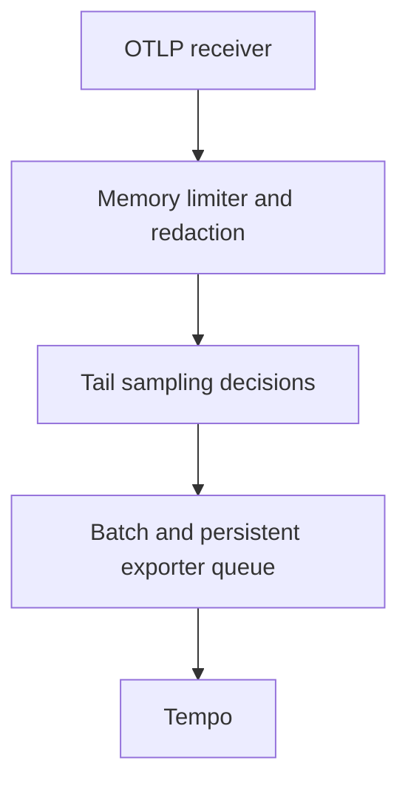

# Lab 39: Tail Sampling in the Collector

## Purpose and Scope

> **Primary Objective:** Retain observed errors and slow traces using explicit Collector policies, then reduce ordinary trace retention without confusing sampling with delivery failure.

Head sampling could not see a later failure. Tail sampling waits for trace data and applies policies to what has arrived. This lab installs one trace-complete tail sampler in the existing Collector and verifies its decisions with deterministic fixtures and the real two-service workload.

    You will separate policy correctness from statistical baseline retention and explain decision delay, late spans, memory and routing constraints. This remains one single-node Collector, not a highly available sampling tier. No new metrics exporter, service graph or profiling component is introduced.

## 1. Inherited State and Starting Checks

Complete [Lab 38](Lab-38.md) first. Run from the repository root in one Bash session; keep the existing credentials, named volumes, checkpoint item, dashboards and earlier evidence.

```bash
source lab-notes/session.sh
source lab-notes/evidence.sh
source lab-notes/metrics-session.sh
source lab-notes/platform-session.sh
source lab-notes/traces-session.sh
load_app_settings
start_lab 39
dp config --quiet
dp ps -a
wait_ready
wait_backend loki:3100 /ready
wait_backend tempo:3200 /ready
wait_backend otel-collector:13133 /
wait_backend lab-downstream:8001 /health/live
````dp` is the stage-aware Compose helper from Lab 31. It preserves the learning overlays and the current project. Plain `docker compose up` would use a different set of settings. `start_lab` creates a new `LAB_DIR`; all observations in this guide belong to that directory. Host tools remain Bash, Python 3, curl and jq; YAML edits use the isolated `lab-notes/.tools/bin/python` environment already installed in Lab 31.

The inherited platform has thirteen services, nine Prometheus scrape jobs and four existing dashboards. These labs add no service or scrape job. Pyroscope remains disabled until the profiling phase. The application still exposes native Prometheus metrics; traces travel through the Collector; Docker's fluentd logging driver sends JSON stdout to the same Collector and then Loki.

```bash
unset LAB_HEAD_SAMPLE_RATIO LAB_TRUST_TRACE_CONTEXT
cp lab-notes/tracing/collector.yml "$LAB_DIR/collector.before-tail.yml"
dp exec -T app python - <<'CHECK'
from app.config import Settings
assert Settings().trace_sample_ratio==1.0
print('Root head sampler supplies complete candidate traces')
CHECK
python3 lab-notes/tracing/scenario_load.py "$APP_URL" "$LAB_DIR/before-tail.jsonl" --count 3
LEDGER_JSON=$(cat "$LAB_DIR/before-tail.jsonl")
dp exec -T app python - "$LEDGER_JSON" --wait 25 --require-all < lab-notes/tracing/retention_audit.py > "$LAB_DIR/before-tail-audit.json"
```

Resolve any baseline missing spans first. A tail sampler cannot recover spans the SDK never recorded. Sending all root traces to the Collector increases upstream trace transport and processor work compared with 25% head sampling, even when fewer traces reach Tempo.

## 2. Learning Objectives and Policy Design

The intended trace pipeline is:



| Policy | Decision |
|---|---|
| Any observed ERROR span | Keep the trace |
| Trace elapsed extent at least 200 ms | Keep the trace |
| Remaining ordinary traces | Keep approximately 10% by trace ID |

These positive policies combine as OR, not as an ordered “first match then stop” routing table. A trace can satisfy both error and latency policies. The probabilistic baseline does not reduce the ERROR/latency policies to 10%.

**Prediction checkpoint:** the slow and error scenarios should remain available, while some normal traces disappear. Both services will still report `trace_sampled=true` because head sampling is 1.0. Tail decisions are made later and are not propagated back to the already completed request.

## 3. Install the Version-Matched Tail Processor

```bash
cat > lab-notes/tracing/tail_config.py <<'PYTHON'
"""Enable trace-complete tail sampling without changing the log pipeline."""
import argparse
from pathlib import Path
import yaml

parser = argparse.ArgumentParser()
parser.add_argument('--baseline-percent', type=float, choices=[0.0, 10.0], default=10.0)
args = parser.parse_args()
path = Path('lab-notes/tracing/collector.yml')
config = yaml.safe_load(path.read_text())
config['processors']['tail_sampling'] = {
    'sampling_strategy': 'trace-complete', 'decision_wait': '10s',
    'num_traces': 1000, 'expected_new_traces_per_sec': 20,
    'decision_cache': {'sampled_cache_size': 10000, 'non_sampled_cache_size': 10000},
    'policies': [
        {'name': 'keep-errors', 'type': 'status_code', 'status_code': {'status_codes': ['ERROR']}},
        {'name': 'keep-slow', 'type': 'latency', 'latency': {'threshold_ms': 200}},
        {'name': 'ordinary-baseline', 'type': 'probabilistic',
         'probabilistic': {'sampling_percentage': args.baseline_percent}}]}
pipeline = config['service']['pipelines']['traces']
assert pipeline['receivers'] == ['otlp'] and pipeline['exporters'] == ['otlp_grpc/tempo']
pipeline['processors'] = ['memory_limiter', 'transform/traces', 'tail_sampling', 'batch']
path.write_text(yaml.safe_dump(config, sort_keys=False))
PYTHON
```

```bash
lab-notes/.tools/bin/python lab-notes/tracing/tail_config.py --baseline-percent 0
dp run --rm -T --no-deps otel-collector validate --config=/etc/otelcol-contrib/config.yaml
dp up -d --no-deps --force-recreate otel-collector
wait_backend otel-collector:13133 /
```

The pinned `otel/opentelemetry-collector-contrib:0.160.0` contains `tail_sampling`. The explicit `trace-complete` strategy and decision-cache settings are validated against that distribution. Do not paste this configuration into an arbitrary older core Collector image.

`decision_wait=10s` starts when a trace is first observed; it is not a guarantee that every span has arrived. `num_traces=1000` bounds trace entries, not total bytes. `expected_new_traces_per_sec=20` helps size internal structures; it is not a rate limiter. The two caches retain earlier decisions for later spans after a trace leaves the waiting buffer.

We first use 0% ordinary retention to make the policy fixture deterministic. After verifying the positive controls and one negative control, we install the intended 10% baseline. The existing logs pipeline is untouched; sampling is only in the traces pipeline, after privacy filtering and before export batching.

## 4. Prove the Policies With Exact OTLP Fixtures

```bash
cat > lab-notes/tracing/policy_probe.py <<'PYTHON'
"""Deterministic OTLP fixtures through the Collector; never sent directly to Tempo."""
import json
import secrets
import time
from urllib.request import Request, urlopen

now = time.time_ns()
spans, cases = [], []
for scenario, duration_ms, code in [('normal', 25, 1), ('slow', 250, 1), ('error', 25, 2)]:
    trace_id = secrets.token_hex(16)
    cases.append({'scenario': scenario, 'trace_id': trace_id})
    spans.append({'traceId': trace_id, 'spanId': secrets.token_hex(8), 'name': 'policy.fixture',
                  'kind': 1, 'startTimeUnixNano': str(now-duration_ms*1000000),
                  'endTimeUnixNano': str(now), 'status': {'code': code},
                  'attributes': [{'key': 'lab.scenario', 'value': {'stringValue': scenario}}]})
body = {'resourceSpans': [{'resource': {'attributes': [
    {'key': 'service.name', 'value': {'stringValue': 'lab-sampling-fixture'}},
    {'key': 'deployment.environment.name', 'value': {'stringValue': 'local'}}]},
    'scopeSpans': [{'scope': {'name': 'lab.policy.fixture'}, 'spans': spans}]}]}
request = Request('http://otel-collector:4318/v1/traces',
    data=json.dumps(body).encode(), headers={'Content-Type': 'application/json'}, method='POST')
with urlopen(request, timeout=5) as response:
    result = json.load(response)
assert not int(result.get('partialSuccess', {}).get('rejectedSpans', 0)), result
print(json.dumps({'cases': cases, 'accepted_http': 200}, indent=2))
PYTHON
```

```bash
cat > lab-notes/tracing/verify_policy.py <<'PYTHON'
"""Confirm positive policy controls before interpreting the deliberately absent fixture."""
import argparse
import json
import time
from urllib.error import HTTPError
from urllib.request import Request, urlopen

parser=argparse.ArgumentParser()
parser.add_argument('fixture_json')
args=parser.parse_args()
cases=json.loads(args.fixture_json)['cases']
results={}
for case in sorted(cases,key=lambda c:c['scenario']=='normal'):
    scenario,trace_id=case['scenario'],case['trace_id']
    deadline=time.monotonic()+30
    while True:
        try:
            request=Request('http://tempo:3200/api/traces/'+trace_id,headers={'Accept':'application/json'})
            with urlopen(request,timeout=3) as response:
                document=json.load(response)
            spans=[s for b in document.get('batches',document.get('resourceSpans',[]))
                   for scope in b.get('scopeSpans',b.get('instrumentationLibrarySpans',[]))
                   for s in scope.get('spans',[])]
            assert any(s['name']=='policy.fixture' for s in spans), 'Incomplete fixture response'
            code=200
        except HTTPError as error:
            if error.code!=404: raise
            code=404
        if scenario=='normal' or code==200 or time.monotonic()>=deadline:
            break
        time.sleep(1)
    expected=404 if scenario=='normal' else 200
    assert code==expected,(scenario,code,expected)
    results[scenario]={'trace_id':trace_id,'http_status':code}
print(json.dumps(results,indent=2))
PYTHON
```

```bash
dp exec -T app python - < lab-notes/tracing/policy_probe.py > "$LAB_DIR/policy-fixtures.json"
FIXTURE_JSON=$(cat "$LAB_DIR/policy-fixtures.json")
dp exec -T app python - "$FIXTURE_JSON" < lab-notes/tracing/verify_policy.py > "$LAB_DIR/policy-proof.json"
jq . "$LAB_DIR/policy-proof.json"
```

These are deliberately labeled `lab-sampling-fixture` spans, sent to the Collector's OTLP/HTTP receiver, never directly to Tempo. Their timestamps define exactly 25 ms normal, 250 ms slow and 25 ms ERROR operations. A synthetic fixture tests policy mechanics; it is not claimed to be an application request, measured latency or a native application metric.

The verification first waits for the slow/error positive controls, then requires HTTP 404 for the normal negative control with ordinary retention at zero. Other HTTP errors fail the test. This is stronger than immediately declaring an absent trace “sampled out” before any decision window has elapsed. Expected output is `slow:200`, `error:200`, `normal:404` with your generated IDs.

A successful OTLP HTTP response establishes intake acceptance, not durable storage. The later lookup verifies the selected fixture's backend arrival. In a fault-free run these controls isolate the policy; with transport errors or early eviction, investigate those before interpreting the negative control.

## 5. Enable the Ordinary Baseline and Run Real Requests

```bash
lab-notes/.tools/bin/python lab-notes/tracing/tail_config.py --baseline-percent 10
dp run --rm -T --no-deps otel-collector validate --config=/etc/otelcol-contrib/config.yaml
dp up -d --no-deps --force-recreate otel-collector
wait_backend otel-collector:13133 /
python3 lab-notes/tracing/scenario_load.py "$APP_URL" "$LAB_DIR/tail-ledger.jsonl" --count 60
LEDGER_JSON=$(cat "$LAB_DIR/tail-ledger.jsonl")
dp exec -T app python - "$LEDGER_JSON" --wait 35 < lab-notes/tracing/retention_audit.py > "$LAB_DIR/tail-audit.json"
python3 - "$LAB_DIR/tail-audit.json" <<'CHECK'
import json,sys
data=json.load(open(sys.argv[1]))
assert data['head_sampled']==60
for scenario in ['normal','slow','error']:
    rows=[r for r in data['traces'] if r['scenario']==scenario]
    kept=sum(r['complete'] for r in rows)
    print(scenario,'complete',kept,'of',len(rows))
    if scenario in {'slow','error'}:
        assert kept==len(rows), 'Investigate missing/late spans, eviction or export failure'
print('Retained span count:',data['span_count'],'retained event count:',data['event_count'])
CHECK
```

Expect all twenty slow and twenty error traces, plus some ordinary traces. Ten percent of the twenty normal traces has an expected value of two, not a guaranteed count. Host contention can push nominally normal trace duration over 200 ms, legitimately retaining more under the latency policy. Open a retained normal trace before blaming the probabilistic rule.

Overall retention is much greater than 10% for this intentionally failure-heavy workload. The workload mix, overlapping policies and slow-host effects determine the total. A result of 42 retained traces would be plausible, not a required answer.

Compare with the Lab 38 head-sampling evidence: error and slow diagnostic coverage is now prioritized, but every candidate trace first reaches the Collector. State the tradeoff in both transport/processor work and backend volume.

## 6. Observe Decision Delay and Remaining Evidence

```bash
python3 lab-notes/tracing/scenario_load.py "$APP_URL" "$LAB_DIR/delay-ledger.jsonl" --count 1 --only error
DELAY_TRACE=$(jq -r '.response.upstream_trace_id' "$LAB_DIR/delay-ledger.jsonl")
if backend tempo:3200 "/api/traces/$DELAY_TRACE" > "$LAB_DIR/early-trace.json" 2> "$LAB_DIR/early-lookup.error"; then
  echo 'Trace was already visible; inspect elapsed wall time before claiming an immediate decision'
else
  cat "$LAB_DIR/early-lookup.error"
fi
fetch_trace "$DELAY_TRACE" "$LAB_DIR/decided-trace.json"
python3 lab-notes/tracing/verify_boundary.py "$LAB_DIR/decided-trace.json"
backend otel-collector:8888 /metrics > "$LAB_DIR/collector-tail.prom"
rg 'tail_sampling|otelcol_receiver_accepted_spans|otelcol_exporter_sent_spans' "$LAB_DIR/collector-tail.prom"
```

A quick lookup often returns 404 while the decision buffer is waiting. Use the recorded request completion time and the eventual lookup time to describe observed visibility delay; it includes SDK batching, tail waiting and backend ingestion. Do not report exactly ten seconds as a guaranteed end-to-end delay.

Discover the actual exposed tail-sampling metric names/labels in the captured exposition before writing a query. Policy counters can overlap because one trace may satisfy several policies; summing them need not equal unique retained traces. Receiver and exporter counters describe different stages and cannot be equated after intentional filtering.

In Loki, find a normal request that the audit did not find in Tempo. Its completion log and sampled flag can still exist. Unlike the Lab 38 zero-ratio example, `trace_sampled=true` here describes the head decision while the later tail policy omits the trace. Native Prometheus HTTP metrics still count it.

## 7. Reason About Late Spans and Capacity

With one Collector, both services naturally send their spans to the same decision process. A production tier with multiple samplers requires trace-aware routing; round-robin distribution can split one trace across independent decisions. Merely sharing exporter storage does not solve that problem.

A decision based on incomplete data can miss a late ERROR span. A decision cache helps later spans follow an earlier decision; it cannot retroactively reconsider an already dropped trace or reconstruct missing data. Size the wait using observed request duration and arrival delay, then verify it under load.

Waiting traces and decision caches consume memory. The exporter’s persistent queue begins after the sampler and batch processor; it does not persist undecided traces. Restarting the Collector during the decision window can lose that in-memory evidence. The rough concurrent-trace estimate `arrival rate × wait` is only a starting point: span counts, attribute sizes and bursts affect actual bytes.

Do not claim an exact event population or unbiased error rate from tail-selected traces. This selection intentionally favors slow and failed work; keep native Prometheus metrics for service-level denominators.

## 8. Recovery and Troubleshooting

```bash
wait_ready
wait_backend tempo:3200 /ready
wait_backend otel-collector:13133 /
dp logs --since=5m --tail=150 --no-color otel-collector > "$LAB_DIR/collector-tail.log"
lab-notes/.tools/bin/python - <<'CHECK'
import yaml
c=yaml.safe_load(open('lab-notes/tracing/collector.yml'))
t=c['processors']['tail_sampling']
assert t['policies'][-1]['probabilistic']['sampling_percentage']==10
assert c['service']['pipelines']['traces']['processors'].index('tail_sampling') < c['service']['pipelines']['traces']['processors'].index('batch')
print('Intended 10% ordinary baseline retained')
CHECK
```

| Symptom | Investigate |
|---|---|
| All ordinary fixture traces retained during the 0% test | Wrong active config, sampler missing from pipeline, stale fixture IDs or actual ERROR/duration fields. |
| Error fixture absent | Intake failure, wrong status code, memory refusal, early eviction, timing or export/backend failure. |
| App errors missing despite a correct fixture | Head ratio/propagation, late error spans and actual application status instrumentation. |
| Normal request retained unexpectedly | Probabilistic baseline or actual trace duration above the latency threshold. |
| More policy matches than traces | Policies overlap; do not sum matches as a unique trace count. |
| Exporter queue survives but some traces vanish on restart | Tail decision state and upstream batch buffers are separate in-memory stages. |

Normal completion keeps tail sampling enabled with ERROR, 200 ms latency and 10% ordinary policies. For rollback, copy `$LAB_DIR/collector.before-tail.yml` to `lab-notes/tracing/collector.yml`, validate and recreate the Collector. Keep that rollback file; do not delete data volumes. If you roll back, reapply the verified tail configuration before Lab 40.

## 9. Knowledge Check

1. Why cannot tail sampling repair head-sampled-away errors?
2. Does a 10% ordinary policy imply 10% overall retention?
3. Does file_storage persist the tail decision buffer?
4. What happens when a decisive error arrives after the original drop decision?

### Answer Guide

1. Unrecorded spans never reach the Collector, so it has no error evidence to evaluate.
2. No. ERROR and latency policies retain additional traces, often with overlap.
3. No. It persists the configured exporter queue; undecided tail state remains in memory.
4. A cached drop can continue to omit that trace; the decision cannot reconstruct or retroactively retain its missing earlier data.

## 10. Professional Scenario Exercise

A team adds two tail-sampling Collectors behind a round-robin load balancer and sees incomplete error traces. Draw the point where trace-aware routing is required, identify which memory and delivery limits still exist, and design a bounded test with known IDs before increasing the replica count.

## 11. Lab Notebook Template

Create a notebook in the evidence directory for this run:

```bash
test -e "$LAB_DIR/notebook.md" || printf '# Lab 39 Evidence\n' > "$LAB_DIR/notebook.md"
```

Use these headings and fill them with your predictions, commands, observed results and conclusions:

```markdown
# Lab 39 Evidence

## Prediction and starting state
## Configuration and bounded workload
## Evidence with timestamps and identifiers
## Explanation and competing hypotheses
## Recovery proof
## Production decision and remaining uncertainty
```

## 12. Observable Completion Criteria

- [ ] Head sampling is 1.0 and the pre-policy baseline is complete.
- [ ] The exact pinned Collector validates the tail configuration.
- [ ] Deterministic slow/error fixtures survive and the ordinary 0% fixture is absent.
- [ ] The real workload retains complete slow/error traces under the final policies.
- [ ] The notebook distinguishes head flags, tail choices, export success and backend lookup.
- [ ] The final ordinary baseline is 10%, with logs and native metrics healthy.

## 13. Production Implications

Tail sampling trades backend reduction and diagnostic preference for upstream volume, memory, decision delay and routing complexity. Test policy overlap, long requests and late spans. This single-node lab proves mechanics, not high availability. See the [version-pinned tail sampling processor](https://github.com/open-telemetry/opentelemetry-collector-contrib/tree/v0.160.0/processor/tailsamplingprocessor) and [OpenTelemetry sampling concepts](https://opentelemetry.io/docs/concepts/sampling/).

## 14. End State and Transition

Keep full head sampling and the verified tail policies. [Lab 40](Lab-40.md) interrupts Tempo export and examines exactly which buffers, retries and memory protections preserve or lose trace data.
