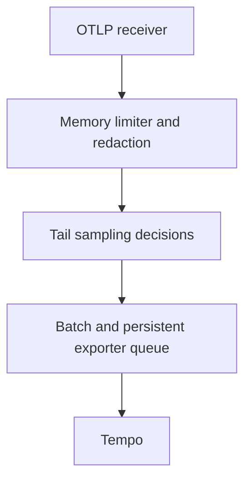

# Lab 39: Tail Sampling in the Collector

## 1. Purpose and Learning Outcomes

You will move trace selection to the Collector so it can inspect observed errors and duration before choosing what to keep. First, use synthetic examples with exact values to verify each policy, then send real application requests. Check decision delay and incomplete arrival separately so an intentional sampling drop is not confused with failed delivery.

> **Primary Objective:** Use explicit Collector policies to retain observed errors and slow traces while keeping fewer ordinary traces. Distinguish those deliberate decisions from delivery failures.

Head sampling decides too early to know about a later failure. Tail sampling waits for trace data and evaluates what has arrived. This lab adds one sampler using the trace-complete strategy in the existing Collector, then tests its decisions with predictable fixtures and the real two-service workload.

Separate exact policy checks from the statistical results of ordinary-trace sampling. Explain decision delay, late spans, memory limits, and routing requirements. The experiment uses one Collector and does not establish a highly available sampling tier. No metrics exporter, service graph, or profiling component is added.

## 2. Starting Point and Lab Map

Open the complete application repository before using this guide. Unless a step says otherwise, run commands in Bash from the repository's top-level folder. Follow the starting checks in order because later commands depend on the helper functions and running services they prepare.

Read each explanation before running its commands. Run one complete code block, check the result, and then continue. In your notebook, save the commands, what happened, why you think it happened, and anything that differed from the expected result.

### Key Terms

| **Term**            | **Explanation**                                                                                           |
| ------------------- | --------------------------------------------------------------------------------------------------------- |
| Tail sampling       | Choosing whether to keep a trace after waiting for span data and examining what has arrived.              |
| Decision wait       | The time allowed for trace data to accumulate before the sampler makes its policy decision.               |
| Trace-aware routing | Sending spans from the same trace to the same sampler so one decision process can consider them together. |

### Lab Map

The arrows show how the parts connect and where a request can take different paths. Use this map to understand the design. It is not a recording of a request that actually ran.


```mermaid
flowchart TD
    A["OTLP receiver"] --> B["Memory limiter and redaction"]
    B --> C["Tail sampling decisions"]
    C --> D["Batch and persistent exporter queue"]
    D --> E["Tempo"]
```

## 3. Guided Walkthrough

### Step 01. Inherited State and Starting Checks

**What You Are Doing:** Restore full head sampling before testing Collector policies. The tail sampler cannot recover spans that the SDK never recorded.

**Practical Walkthrough:** Verify complete input traces at full head sampling before enabling Collector selection. Tail sampling can use only the spans that reach it. Keep transport-health checks separate from checks of which policy chose to retain a trace.

Remove temporary shell overrides and inspect the running app's sampler setting. Send a new known request and retrieve its expected spans rather than relying on an older trace. Save the Collector's configuration before the change so later missing data can be compared with a clear baseline and the exact activated policy.

Complete [Lab 38](Lab-38.md) first. Use one Bash session from the repository root, retaining the credentials, named volumes, checkpoint item, dashboards, and earlier evidence.

```bash
source lab-notes/session.sh
source lab-notes/evidence.sh
source lab-notes/metrics-session.sh
source lab-notes/platform-session.sh
source lab-notes/traces-session.sh
load_app_settings
start_lab 39
dp config --quiet
dp ps -a
wait_ready
wait_backend loki:3100 /ready
wait_backend tempo:3200 /ready
wait_backend otel-collector:13133 /
wait_backend lab-downstream:8001 /health/live
```

Use `dp`, the stage-aware helper from Lab 31, to preserve the current project and learning overlays. Plain `docker compose up` would use different settings. `start_lab` creates a fresh `LAB_DIR`; save this run's observations there. You still need Bash, Python 3, curl, and jq. YAML edits use the isolated `lab-notes/.tools/bin/python` environment installed in Lab 31.

The inherited platform has thirteen services, nine Prometheus scrape jobs, and four dashboards. No service or scrape job is added here. Pyroscope stays disabled until profiling. Native application metrics still go to Prometheus, traces go through the Collector, and Docker's Fluentd driver sends JSON stdout through the Collector to Loki.

```bash
unset LAB_HEAD_SAMPLE_RATIO LAB_TRUST_TRACE_CONTEXT
cp lab-notes/tracing/collector.yml "$LAB_DIR/collector.before-tail.yml"
dp exec -T app python - <<'CHECK'
from app.config import Settings
assert Settings().trace_sample_ratio==1.0
print('Root head sampler supplies complete candidate traces')
CHECK
python3 lab-notes/tracing/scenario_load.py "$APP_URL" "$LAB_DIR/before-tail.jsonl" --count 3
LEDGER_JSON=$(cat "$LAB_DIR/before-tail.jsonl")
dp exec -T app python - "$LEDGER_JSON" --wait 25 --require-all < lab-notes/tracing/retention_audit.py > "$LAB_DIR/before-tail-audit.json"
```

Fix missing baseline spans before continuing. Data discarded at the SDK cannot be recreated by a tail sampler. Sending every root trace to the Collector also increases upstream transport and processing work compared with 25% head sampling, even if fewer traces are ultimately stored in Tempo.

**Understanding the Result:** Tail-policy results require the intended input traces to reach the sampler. Upstream omissions would make claims about its retention decisions unreliable.

### Step 02. Learning Objectives and Policy Design

**What You Are Doing:** Define the error, slow-trace, and ordinary-baseline policies and how they combine. A single trace can satisfy more than one condition for retention.

**Practical Walkthrough:** Read the policies together: retain errors, retain traces lasting at least 200 milliseconds, and keep a probabilistic sample of ordinary work. Predict decisions from actual status and duration. Scenario names alone do not determine which policy applies.

Evaluate error status and duration first, then consider the ordinary sampling probability. Policies can overlap. A request named normal may still be retained because it ran slowly on a busy host, so inspect the stored trace before attributing retention to chance.

The intended order of the trace pipeline is shown below:

The lab map in Section 2 shows this relationship.

| **Policy**                           | **Decision**                                             |
| ------------------------------------ | -------------------------------------------------------- |
| Any observed ERROR span              | Retain the trace containing that error                   |
| Trace elapsed extent at least 200 ms | Retain the trace because it meets the latency threshold  |
| Remaining ordinary traces            | Retain approximately 10% using a trace-ID-based decision |

These positive conditions combine with OR. They are not a routing list that stops at the first match. A trace may satisfy both error and latency policies. The ordinary 10% policy does not reduce qualifying ERROR or slow traces to 10% retention.

**Prediction Checkpoint:** Slow and error examples should remain available, while some normal traces disappear. Both services still report `trace_sampled=true` because head sampling is 1.0. The Collector decides later, and that decision is not sent back to the already completed request.

**Understanding the Result:** A normal scenario can still exceed the latency threshold on a busy host. A retained trace does not, by itself, identify one exclusive policy that matched.

### Step 03. Install the Version-Matched Tail Processor

**What You Are Doing:** Add the processor supported by the selected Collector version at the intended place in the pipeline. Its wait and cache settings affect when a retained trace becomes visible.

**Practical Walkthrough:** Preserve logging and exporter settings while adding the version-compatible tail processor. Review its wait, capacity, and caches before activation. The ten-second wait begins when the processor first observes the trace, not when the client starts the request.

Check processor order, pending-trace capacity, decision wait, and cached decisions in the active trace pipeline. Leave logs and export settings intact. Client start time alone cannot establish the decision deadline because the sampler begins tracking the trace only after observing it.

```bash
cat > lab-notes/tracing/tail_config.py <<'PYTHON'
"""Enable trace-complete tail sampling without changing the log pipeline."""
import argparse
from pathlib import Path
import yaml

parser = argparse.ArgumentParser()
parser.add_argument('--baseline-percent', type=float, choices=[0.0, 10.0], default=10.0)
args = parser.parse_args()
path = Path('lab-notes/tracing/collector.yml')
config = yaml.safe_load(path.read_text())
config['processors']['tail_sampling'] = {
    'sampling_strategy': 'trace-complete', 'decision_wait': '10s',
    'num_traces': 1000, 'expected_new_traces_per_sec': 20,
    'decision_cache': {'sampled_cache_size': 10000, 'non_sampled_cache_size': 10000},
    'policies': [
        {'name': 'keep-errors', 'type': 'status_code', 'status_code': {'status_codes': ['ERROR']}},
        {'name': 'keep-slow', 'type': 'latency', 'latency': {'threshold_ms': 200}},
        {'name': 'ordinary-baseline', 'type': 'probabilistic',
         'probabilistic': {'sampling_percentage': args.baseline_percent}}]}
pipeline = config['service']['pipelines']['traces']
assert pipeline['receivers'] == ['otlp'] and pipeline['exporters'] == ['otlp_grpc/tempo']
pipeline['processors'] = ['memory_limiter', 'transform/traces', 'tail_sampling', 'batch']
path.write_text(yaml.safe_dump(config, sort_keys=False))
PYTHON
```

**Command Note:** `<<'PYTHON'` writes the following block exactly as shown until the closing `PYTHON`. Quoting the delimiter prevents Bash from expanding `$variables` in the generated file. Writing and executing the file are separate steps.

```bash
lab-notes/.tools/bin/python lab-notes/tracing/tail_config.py --baseline-percent 0
dp run --rm -T --no-deps otel-collector validate --config=/etc/otelcol-contrib/config.yaml
dp up -d --no-deps --force-recreate otel-collector
wait_backend otel-collector:13133 /
```

The pinned `otel/opentelemetry-collector-contrib:0.160.0` distribution contains `tail_sampling`. The `trace-complete` strategy and decision-cache settings are validated for that distribution. Do not assume the same configuration works in an arbitrary older core Collector image.

`decision_wait=10s` begins at first observation and does not guarantee that all spans arrive in time. `num_traces=1000` limits trace entries, not bytes. `expected_new_traces_per_sec=20` helps allocate internal structures; it does not limit incoming traffic. The two caches keep earlier decisions so later spans can follow them after a trace leaves the waiting buffer.

Begin with 0% ordinary retention so the policy fixtures have predictable keep/drop outcomes. After the positive controls and negative control pass, enable the intended 10% baseline. The log pipeline is unchanged. Tail sampling operates only on traces, after privacy filtering and before export batching.

**Understanding the Result:** The configured wait explains only part of visibility delay. SDK batching, export, and backend processing add time at other stages.

### Step 04. Prove the Policies with Exact OTLP Fixtures

**What You Are Doing:** Send fixtures with exact durations and statuses through the Collector receiver. This isolates policy behavior from variations in application execution and host timing.

**Practical Walkthrough:** Keep ordinary retention disabled and send the exact OTLP fixtures. Their controlled status and duration values test the error and latency policies directly. After the decision interval, audit every fixture ID and record the expected retained and dropped cases.

Verify the positive error and slow controls before interpreting the absent normal fixture. Wait for both the decision interval and export delay. A trace still awaiting a decision must not be reported as intentionally dropped.

```bash
cat > lab-notes/tracing/policy_probe.py <<'PYTHON'
"""Deterministic OTLP fixtures through the Collector; never sent directly to Tempo."""
import json
import secrets
import time
from urllib.request import Request, urlopen

now = time.time_ns()
spans, cases = [], []
for scenario, duration_ms, code in [('normal', 25, 1), ('slow', 250, 1), ('error', 25, 2)]:
    trace_id = secrets.token_hex(16)
    cases.append({'scenario': scenario, 'trace_id': trace_id})
    spans.append({'traceId': trace_id, 'spanId': secrets.token_hex(8), 'name': 'policy.fixture',
                  'kind': 1, 'startTimeUnixNano': str(now-duration_ms*1000000),
                  'endTimeUnixNano': str(now), 'status': {'code': code},
                  'attributes': [{'key': 'lab.scenario', 'value': {'stringValue': scenario}}]})
body = {'resourceSpans': [{'resource': {'attributes': [
    {'key': 'service.name', 'value': {'stringValue': 'lab-sampling-fixture'}},
    {'key': 'deployment.environment.name', 'value': {'stringValue': 'local'}}]},
    'scopeSpans': [{'scope': {'name': 'lab.policy.fixture'}, 'spans': spans}]}]}
request = Request('http://otel-collector:4318/v1/traces',
    data=json.dumps(body).encode(), headers={'Content-Type': 'application/json'}, method='POST')
with urlopen(request, timeout=5) as response:
    result = json.load(response)
assert not int(result.get('partialSuccess', {}).get('rejectedSpans', 0)), result
print(json.dumps({'cases': cases, 'accepted_http': 200}, indent=2))
PYTHON
```

```bash
cat > lab-notes/tracing/verify_policy.py <<'PYTHON'
"""Confirm positive policy controls before interpreting the deliberately absent fixture."""
import argparse
import json
import time
from urllib.error import HTTPError
from urllib.request import Request, urlopen

parser=argparse.ArgumentParser()
parser.add_argument('fixture_json')
args=parser.parse_args()
cases=json.loads(args.fixture_json)['cases']
results={}
for case in sorted(cases,key=lambda c:c['scenario']=='normal'):
    scenario,trace_id=case['scenario'],case['trace_id']
    deadline=time.monotonic()+30
    while True:
        try:
            request=Request('http://tempo:3200/api/traces/'+trace_id,headers={'Accept':'application/json'})
            with urlopen(request,timeout=3) as response:
                document=json.load(response)
            spans=[s for b in document.get('batches',document.get('resourceSpans',[]))
                   for scope in b.get('scopeSpans',b.get('instrumentationLibrarySpans',[]))
                   for s in scope.get('spans',[])]
            assert any(s['name']=='policy.fixture' for s in spans), 'Incomplete fixture response'
            code=200
        except HTTPError as error:
            if error.code!=404: raise
            code=404
        if scenario=='normal' or code==200 or time.monotonic()>=deadline:
            break
        time.sleep(1)
    expected=404 if scenario=='normal' else 200
    assert code==expected,(scenario,code,expected)
    results[scenario]={'trace_id':trace_id,'http_status':code}
print(json.dumps(results,indent=2))
PYTHON
```

```bash
dp exec -T app python - < lab-notes/tracing/policy_probe.py > "$LAB_DIR/policy-fixtures.json"
FIXTURE_JSON=$(cat "$LAB_DIR/policy-fixtures.json")
dp exec -T app python - "$FIXTURE_JSON" < lab-notes/tracing/verify_policy.py > "$LAB_DIR/policy-proof.json"
jq . "$LAB_DIR/policy-proof.json"
```

The fixture spans use the explicit service label `lab-sampling-fixture` and enter the Collector through OTLP/HTTP, never directly through Tempo. Their timestamps define a 25 ms normal span, a 250 ms slow span, and a 25 ms ERROR span. These artificial records test policies; they are not real application requests, measured application latency, or native metrics.

First wait for the slow and error controls to arrive. Then require HTTP 404 for the normal control while ordinary retention is zero. Other HTTP errors fail the check. This avoids calling an early missing trace sampled out before its decision wait finishes. Expect `slow:200`, `error:200`, and `normal:404` for your generated IDs.

A successful OTLP HTTP response proves intake acceptance, not durable storage. Later retrieval proves that selected fixtures reached the backend. These controls isolate policy behavior in a fault-free run. If transport errors or early eviction occur, investigate them before explaining the absent control as a policy drop.

**Understanding the Result:** Exact fixtures verify the policy mechanics. Real requests add variable timing and a larger span tree in the next step.

### Step 05. Enable the Ordinary Baseline and Run Real Requests

**What You Are Doing:** Enable the ordinary baseline and run the real scenarios. Inspect unexpectedly retained normal traces because their actual error status or duration may satisfy another policy.

**Practical Walkthrough:** Set the ordinary baseline to ten percent and run the limited real workload at full head sampling. Compare each retained trace with all positive policies. Do not assume that every normal scenario was retained only by the probability rule.

Keep full head sampling so the Collector receives all candidate traces. For each retained operation, inspect actual duration and status as well as its scenario label. Explain which conditions it meets before assessing the ordinary sampling result.

```bash
lab-notes/.tools/bin/python lab-notes/tracing/tail_config.py --baseline-percent 10
dp run --rm -T --no-deps otel-collector validate --config=/etc/otelcol-contrib/config.yaml
dp up -d --no-deps --force-recreate otel-collector
wait_backend otel-collector:13133 /
python3 lab-notes/tracing/scenario_load.py "$APP_URL" "$LAB_DIR/tail-ledger.jsonl" --count 60
LEDGER_JSON=$(cat "$LAB_DIR/tail-ledger.jsonl")
dp exec -T app python - "$LEDGER_JSON" --wait 35 < lab-notes/tracing/retention_audit.py > "$LAB_DIR/tail-audit.json"
python3 - "$LAB_DIR/tail-audit.json" <<'CHECK'
import json,sys
data=json.load(open(sys.argv[1]))
assert data['head_sampled']==60
for scenario in ['normal','slow','error']:
    rows=[r for r in data['traces'] if r['scenario']==scenario]
    kept=sum(r['complete'] for r in rows)
    print(scenario,'complete',kept,'of',len(rows))
    if scenario in {'slow','error'}:
        assert kept==len(rows), 'Investigate missing/late spans, eviction or export failure'
print('Retained span count:',data['span_count'],'retained event count:',data['event_count'])
CHECK
```

Expect all twenty slow traces and twenty error traces, plus some normal traces. Ten percent of twenty normal requests has an expected count of two, not a guaranteed count. Host contention can push a normal trace beyond 200 ms and legitimately qualify it under the latency policy. Inspect such a trace before blaming the probabilistic rule.

This workload contains many deliberate failures and slow requests, so overall retention should be much higher than 10%. The scenario mix, overlapping policies, and host timing all affect the total. Retaining 42 traces would be plausible, but it is not a required answer.

Compare the result with Lab 38. Tail sampling now prioritizes detailed error and slow-request evidence, while every candidate still travels to the Collector. Describe the tradeoff between increased upstream transport and processing and reduced backend volume.

**Understanding the Result:** A small random result need not equal exactly ten percent. Normal scenarios may also qualify through measured latency or error status.

### Step 06. Observe Decision Delay and Remaining Evidence

**What You Are Doing:** Measure when known traces become visible and inspect the sampler's real metrics. Total visibility delay includes more than the configured decision wait.

**Practical Walkthrough:** Record when known IDs first become queryable and inspect the exported sampler metrics. Allow the decision interval plus downstream delivery time. Use metric names actually exposed by this version and avoid declaring loss at the instant the ten-second wait ends.

Keep timestamps for the known-ID lookups across the decision and export interval. Inspect the actual metrics alongside them. Batching and backend ingestion can extend the delay, so absence at the nominal wait boundary is not enough to prove loss.

```bash
python3 lab-notes/tracing/scenario_load.py "$APP_URL" "$LAB_DIR/delay-ledger.jsonl" --count 1 --only error
DELAY_TRACE=$(jq -r '.response.upstream_trace_id' "$LAB_DIR/delay-ledger.jsonl")
if backend tempo:3200 "/api/traces/$DELAY_TRACE" > "$LAB_DIR/early-trace.json" 2> "$LAB_DIR/early-lookup.error"; then
  echo 'Trace was already visible; inspect elapsed wall time before claiming an immediate decision'
else
  cat "$LAB_DIR/early-lookup.error"
fi
fetch_trace "$DELAY_TRACE" "$LAB_DIR/decided-trace.json"
python3 lab-notes/tracing/verify_boundary.py "$LAB_DIR/decided-trace.json"
backend otel-collector:8888 /metrics > "$LAB_DIR/collector-tail.prom"
rg 'tail_sampling|otelcol_receiver_accepted_spans|otelcol_exporter_sent_spans' "$LAB_DIR/collector-tail.prom"
```

A quick lookup may return 404 while the sampler is still waiting. Compare request-completion time with eventual successful lookup time to describe observed visibility delay. That interval includes SDK batching, tail waiting, and backend ingestion; ten seconds is not a guaranteed total.

Find the exact tail-sampling metric names and labels in the captured exposition before writing queries. Policy counts can overlap because one trace can match several conditions, so their sum need not equal unique retained traces. Receiver and exporter counters also measure different stages, especially after deliberate filtering.

In Loki, find a normal request missing from Tempo's audit. Its completion log and sampled flag may still exist. Here, `trace_sampled=true` describes the earlier head decision, while the later tail policy omits storage. This differs from Lab 38's zero-head-ratio case. Native Prometheus HTTP metrics still count the request.

**Understanding the Result:** Successful eventual lookup measures the full path to queryability. Sampler counters describe activity at their own processing stage rather than every step in that path.

### Step 07. Reason About Late Spans and Capacity

**What You Are Doing:** Examine how late spans, incomplete decisions, and capacity limits affect retention. A multi-Collector design must send related spans to the same sampling state.

**Practical Walkthrough:** Consider spans arriving after the wait or cached decision, and traces exceeding pending capacity. Related spans must reach the same decision process for meaningful trace-level policies. This creates both routing and memory requirements in a distributed Collector tier.

Place a late span on a timeline relative to the decision and cache lifetime. Then consider pending-trace capacity. Explain these assumptions before applying this single-Collector result to multiple samplers, because separate decision states cannot automatically combine a trace's evidence.

With one Collector, both services send their spans to the same decision process. Multiple sampling Collectors require trace-aware routing. Round-robin distribution can split one trace across independent decisions, and shared exporter storage does not bring those decision states together.

If an ERROR span arrives too late, a decision made from incomplete data can miss it. The decision cache lets later spans follow the earlier choice; it cannot reconsider an already dropped trace or rebuild missing spans. Choose the wait using measured request durations and arrival delays, then test it under load.

Pending traces and decision caches use memory. The persistent exporter queue comes after tail sampling and batching, so it does not store undecided traces. Restarting the Collector during the wait can lose this in-memory evidence. `arrival rate × wait` is a rough starting estimate for concurrent traces; span counts, attribute sizes, and bursts determine actual memory use.

Tail selection deliberately favors errors and slow work. Do not use its retained population as an unbiased error-rate sample or exact traffic total. Keep native Prometheus metrics for service-level denominators.

**Understanding the Result:** Tail sampling cannot reconstruct unlimited past evidence. Late arrival and capacity pressure can change both trace completeness and the decision made from available spans.

### Step 08. Recovery and Troubleshooting

**What You Are Doing:** Verify the approved policies with new qualifying canaries. Use evidence from sampling, intake, and export to explain absent traces rather than assuming every absence has the same cause.

**Practical Walkthrough:** Run fresh error or slow canaries that should qualify under the approved policy. Check their traces, current logs, and business readiness. For a missing trace, inspect head decisions, Collector intake, tail selection, and export as separate possible points of omission.

Verify complete new traces for known qualifying error or slow requests. Independently check business behavior and logging. Classify any absence against each collection step before calling it transport loss.

```bash
wait_ready
wait_backend tempo:3200 /ready
wait_backend otel-collector:13133 /
dp logs --since=5m --tail=150 --no-color otel-collector > "$LAB_DIR/collector-tail.log"
lab-notes/.tools/bin/python - <<'CHECK'
import yaml
c=yaml.safe_load(open('lab-notes/tracing/collector.yml'))
t=c['processors']['tail_sampling']
assert t['policies'][-1]['probabilistic']['sampling_percentage']==10
assert c['service']['pipelines']['traces']['processors'].index('tail_sampling') < c['service']['pipelines']['traces']['processors'].index('batch')
print('Intended 10% ordinary baseline retained')
CHECK
```

| **Symptom**                                               | **Investigate**                                                                                                            |
| --------------------------------------------------------- | -------------------------------------------------------------------------------------------------------------------------- |
| All ordinary fixture traces retained during the 0% test   | Check the active configuration, sampler inclusion in the pipeline, fresh fixture IDs, and actual ERROR or duration fields. |
| Error fixture absent                                      | Investigate intake failure, incorrect status, memory refusal, early eviction, timing, and export or backend failure.       |
| App errors missing despite a correct fixture              | Check the head ratio, propagation, late error spans, and actual application status instrumentation.                        |
| Normal request retained unexpectedly                      | Check the probabilistic baseline and whether actual duration exceeded the latency threshold.                               |
| More policy matches than traces                           | A trace can match multiple policies. Do not add policy matches as if they counted unique traces.                           |
| Exporter queue survives but some traces vanish on restart | Pending tail decisions and upstream batches occupy separate in-memory stages before the persistent queue.                  |

The successful end state keeps ERROR, 200 ms latency, and 10% ordinary retention policies active. To roll back, copy `$LAB_DIR/collector.before-tail.yml` to `lab-notes/tracing/collector.yml`, validate, and recreate the Collector. Keep the rollback file and all data volumes. Reapply the verified tail configuration before starting Lab 40 if you used the rollback.

**Understanding the Result:** Leave the policy active for the next lab. A freshly retained qualifying canary proves the current path for that known case.

## 4. Troubleshooting and Diagnosis

Begin with the first result that differed from your prediction. Save the exact error or symptom and identify which service or command produced it. Use the checks below, make the needed fix, and repeat the original check to confirm the problem is resolved.

Use Step 08's recovery and troubleshooting procedure for unexpected policy or delivery results.

## 5. Review and Practice

Answer the questions in your own words before reading the answers. For the scenario, say what you would inspect and exactly what each result would tell you.

### Knowledge Check

1. Why cannot tail sampling repair head-sampled-away errors?
2. Does a 10% ordinary policy imply 10% overall retention?
3. Does file_storage persist the tail decision buffer?
4. What happens when a decisive error arrives after the original drop decision?

#### Answer Guide

1. Head-dropped spans never reach the Collector, so the tail sampler has no error data from them to inspect or recover.
2. No. ERROR and latency policies retain additional traces, and some traces match more than one policy.
3. No. file_storage persists the configured exporter queue. Traces still awaiting a tail decision remain in memory.
4. The cached drop decision can continue to omit the trace. It cannot reconstruct missing earlier data or retroactively retain the already dropped trace.

### Professional Scenario Exercise

A team puts two tail-sampling Collectors behind a round-robin load balancer and begins seeing incomplete error traces. Show where trace-aware routing is needed, explain the memory and delivery limits that remain, and design a small known-ID test before increasing the replica count further.

## 6. Completion Checklist

Tick an item only when you can show its result or saved evidence. Finish the cleanup instructions before starting the next lab.

### Observable Completion Criteria

- [ ] Head sampling is 1.0, and the pre-policy trace baseline is complete.
- [ ] The pinned Collector distribution validates the tail-sampling configuration.
- [ ] Exact slow and error fixtures are retained, while the normal fixture is absent with ordinary retention at 0%.
- [ ] The final policies retain complete slow and error traces from the real workload.
- [ ] The notebook distinguishes head flags, tail decisions, export success, and backend retrieval.
- [ ] The ordinary baseline is restored to 10%, with healthy logs and native metrics.

## 7. Production Context and Next Lab

### Production Implications

Tail sampling reduces backend volume and prioritizes selected diagnostic cases, but it requires upstream traffic, memory, decision time, and careful routing. Test overlapping policies, long-running requests, and late spans. This single-node exercise proves the mechanics, not high availability. See the [version-pinned tail sampling processor](https://github.com/open-telemetry/opentelemetry-collector-contrib/tree/v0.160.0/processor/tailsamplingprocessor) and [OpenTelemetry sampling concepts](https://opentelemetry.io/docs/concepts/sampling/).

### End State and Transition

Keep full head sampling and the verified tail policies active. [Lab 40](Lab-40.md) interrupts export to Tempo and tests which queues, retries, and memory protections preserve trace data and where loss can still occur.
