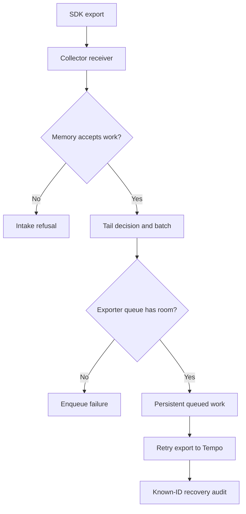

# Lab 40: Collector Queues, Retries, Memory, and Backpressure

## 1. Purpose and Learning Outcomes

You will test what happens when a trace qualifies for retention but cannot reach Tempo. First, observe buffering and recovery across a Collector restart. Then make a deliberately small queue overflow and set a low memory threshold that refuses work. Known trace IDs and explicit restoration steps let you measure each failure point without exhausting the host.

> **Primary Objective:** Observe limited buffering, recovery from a persistent queue, queue overflow, and memory refusal. Keep application health separate from proof of telemetry delivery.

A sampled trace must still pass through processing, export, and storage. This lab stops only delivery to Tempo, observes the persistent queue, deliberately fills a small queue, and tests memory refusal by lowering its threshold instead of consuming all host memory.

Keep the existing tail policies and use error scenarios they are configured to retain. Identify where trace data can be lost, then recover with the saved configuration and known-ID canaries. The experiment does not prove zero loss, exactly-once delivery, or high availability. Loki outages, broader backend fault exercises, and production load tests remain later topics.

## 2. Starting Point and Lab Map

Open the complete application repository before using this guide. Unless a step says otherwise, run commands in Bash from the repository's top-level folder. Follow the starting checks in order because later commands depend on the helper functions and running services they prepare.

Read each explanation before running its commands. Run one complete code block, check the result, and then continue. In your notebook, save the commands, what happened, why you think it happened, and anything that differed from the expected result.

### Key Terms

| **Term**                  | **Explanation**                                                                                                |
| ------------------------- | -------------------------------------------------------------------------------------------------------------- |
| Persistent exporter queue | Pending export work stored on disk so it can survive a Collector restart with compatible settings and storage. |
| Backpressure              | Pressure from a downstream limit that causes earlier work to wait, fail, or be refused.                        |
| Memory limiter            | A processor that refuses incoming work when configured memory thresholds are reached.                          |

### Lab Map

The arrows show how the parts connect and where a request can take different paths. Use this map to understand the design. It is not a recording of a request that actually ran.



## 3. Guided Walkthrough

### Step 01. Inherited State and Starting Checks

**What You Are Doing:** Start with the approved sampling policy and healthy backends. Use traces that should be retained so deliberate sampling drops are not mistaken for queue-related loss.

**Practical Walkthrough:** Verify Tempo health and the current tail policies before changing queues. Use known qualifying scenarios and keep business and log canaries as independent controls. This isolates the trace-export fault from normal sampling choices.

Choose error or slow scenarios known to qualify for retention and verify the active policy first. Otherwise, a missing ordinary trace could be an expected sampling drop rather than lost queued work. That distinction is essential for the restart and overflow tests.

Complete [Lab 39](Lab-39.md) first. Work from the repository root in one Bash session and retain the credentials, named volumes, checkpoint item, dashboards, and earlier evidence.

```bash
source lab-notes/session.sh
source lab-notes/evidence.sh
source lab-notes/metrics-session.sh
source lab-notes/platform-session.sh
source lab-notes/traces-session.sh
load_app_settings
start_lab 40
dp config --quiet
dp ps -a
wait_ready
wait_backend loki:3100 /ready
wait_backend tempo:3200 /ready
wait_backend otel-collector:13133 /
wait_backend lab-downstream:8001 /health/live
```

Use `dp`, the stage-aware helper from Lab 31, to preserve the current project and learning overlays. Plain `docker compose up` would use different settings. `start_lab` creates a fresh `LAB_DIR`; save this run's observations there. You still need Bash, Python 3, curl, and jq. YAML edits use the isolated `lab-notes/.tools/bin/python` environment installed in Lab 31.

The inherited platform has thirteen services, nine Prometheus scrape jobs, and four dashboards. No service or scrape job is added here. Pyroscope stays disabled until profiling. Native application metrics still go to Prometheus, traces go through the Collector, and Docker's Fluentd driver sends JSON stdout through the Collector to Loki.

```bash
cp lab-notes/tracing/collector.yml "$LAB_DIR/collector.before-faults.yml"
lab-notes/.tools/bin/python - <<'CHECK'
import yaml
c=yaml.safe_load(open('lab-notes/tracing/collector.yml'))
assert 'tail_sampling' in c['service']['pipelines']['traces']['processors']
assert c['exporters']['otlp_grpc/tempo']['sending_queue']['storage']=='file_storage'
print('Tail sampling and persistent trace exporter queue present')
CHECK
dp exec -T app python - <<'CHECK'
from app.config import Settings
assert Settings().trace_sample_ratio==1.0
CHECK
backend otel-collector:8888 /metrics > "$LAB_DIR/collector-original.prom"
```

Stop other learning load generators while leaving ordinary dependency checks active. Keep every named volume. Tempo or target alerts may fire during the planned outage; record their times as expected observations instead of disabling rules to make the experiment look healthy.

**Understanding the Result:** First establish that a trace should be retained, then audit its delivery. Sampling selection and transport survival are separate filters.

### Step 02. Learning Objectives and Buffer Boundaries

**What You Are Doing:** Identify the separate SDK, intake, sampling, batching, and export buffers. Persistence at one stage does not automatically protect data waiting in earlier stages.

**Practical Walkthrough:** Follow spans through SDK memory, Collector intake, sampling state, batching, and the exporter queue. Disk-backed export storage protects only work that actually reaches it under the configured conditions. Spans still waiting in earlier memory-only stages have different failure risks.

For each span, identify where it is currently held. A persistent exporter queue does not make SDK buffers, tail decisions, or pending batches durable. Keep those stages separate when interpreting what survives a Collector restart.

| **Stage**                      | **What Is Buffered or Decided**               | **Important Limitation**                                                                 |
| ------------------------------ | --------------------------------------------- | ---------------------------------------------------------------------------------------- |
| Python BatchSpanProcessor      | Completed spans waiting for SDK export        | Uses process memory and has limited capacity                                             |
| OTLP receiver + memory limiter | Decides whether intake is accepted or refused | Acceptance is not proof of end-to-end storage                                            |
| Tail sampler                   | Holds candidate traces and cached decisions   | Uses memory; it cannot reconstruct traces already dropped                                |
| Batch processor                | Groups data into export batches               | Uses memory; asynchronous handoffs affect what retries can recover                       |
| Persistent exporter queue      | Holds requests accepted for backend delivery  | Limited by disk, capacity, and retry policy; it does not guarantee exactly-once delivery |
| Tempo                          | Stores ingested trace data                    | Backend durability and retention remain separate checks                                  |

Queue units depend on its configuration. This lab sets `sizer: requests` and uses one span per export batch, making each queued request small and easy to interpret. This is a teaching setup, not an efficient batch size for production.

**Prediction Checkpoint:** Stopping Tempo should leave application readiness successful while queues grow and retries appear. A short outage within capacity can recover. A full small queue can reject later exports, and an earlier successful SDK export cannot recreate data lost after an asynchronous handoff.

**Understanding the Result:** State which stage a durability claim applies to. A persistent exporter queue protects a specific part of the path; it does not make the entire path lossless.

### Step 03. Install Reversible Configuration and Snapshot Helpers

**What You Are Doing:** Save the approved configuration and derive every temporary variant from it. This prevents a fault setting from accidentally carrying into the next experiment.

**Practical Walkthrough:** Keep separate configurations for the persistence, small-queue, and low-memory tests. Generate each from the same saved baseline, rather than modifying the previous fault file. This gives every experiment one intended configuration change.

Inspect each variant against the saved approved baseline before activation. Do not derive it from the last temporary file. Otherwise, a tiny queue or low threshold could silently remain active and introduce another cause for the next result.

```bash
cat > lab-notes/tracing/queue_config.py <<'PYTHON'
"""Derive each fault configuration from a clean saved baseline, never another fault."""
import argparse
from pathlib import Path
import yaml

parser = argparse.ArgumentParser()
parser.add_argument('baseline')
parser.add_argument('mode', choices=['buffer', 'overflow', 'memory'])
args = parser.parse_args()
config = yaml.safe_load(Path(args.baseline).read_text())
assert 'tail_sampling' in config['processors']
# Stable, explicit raw metric names for the evidence queries in this lab.
prom = config['service']['telemetry']['metrics']['readers'][0]['pull']['exporter']['prometheus']
prom['without_type_suffix'] = True
prom['without_units'] = True
exporter = config['exporters']['otlp_grpc/tempo']
exporter['sending_queue'] = {'enabled': True, 'sizer': 'requests',
    'queue_size': 8 if args.mode == 'overflow' else 128, 'num_consumers': 1,
    'wait_for_result': False, 'block_on_overflow': False, 'storage': 'file_storage'}
exporter['timeout'] = '2s'
exporter['retry_on_failure'] = {'enabled': True, 'initial_interval': '1s',
                              'max_interval': '3s', 'max_elapsed_time': '120s'}
# One span per export request makes queue units observable. Logs keep their existing batch processor.
config['processors']['batch/traces-lab'] = {
    'timeout': '200ms', 'send_batch_size': 1, 'send_batch_max_size': 1}
config['service']['pipelines']['traces']['processors'] = [
    'memory_limiter', 'transform/traces', 'tail_sampling', 'batch/traces-lab']
if args.mode == 'memory':
    config['processors']['memory_limiter/lab'] = {
        'check_interval': '100ms', 'limit_mib': 2, 'spike_limit_mib': 1}
    config['service']['pipelines']['traces']['processors'][0] = 'memory_limiter/lab'
Path('lab-notes/tracing/collector.yml').write_text(yaml.safe_dump(config, sort_keys=False))
PYTHON
```

**Command Note:** `<<'PYTHON'` writes the following block exactly as shown until the closing `PYTHON`. The quotes prevent Bash from expanding `$variables` inside the generated file. Creating the file and running it are separate steps.

```bash
cat > lab-notes/tracing/collector_snapshot.py <<'PYTHON'
"""Run inside app. Print a compact snapshot from the Collector's real exposition."""
import json
from urllib.request import urlopen
from prometheus_client.parser import text_string_to_metric_families

with urlopen('http://otel-collector:8888/metrics', timeout=3) as response:
    text = response.read().decode()
names = {'otelcol_exporter_queue_size', 'otelcol_exporter_queue_capacity', 'otelcol_exporter_in_flight_requests',
         'otelcol_exporter_enqueue_failed_spans', 'otelcol_exporter_sent_spans',
         'otelcol_exporter_send_failed_spans', 'otelcol_receiver_accepted_spans',
         'otelcol_receiver_refused_spans', 'otelcol_process_memory_rss',
         'otelcol_process_runtime_heap_alloc_bytes'}
rows = []
for family in text_string_to_metric_families(text):
    for sample in family.samples:
        # Parser may normalize a Prometheus counter to its _total sample name.
        name = sample.name.removesuffix('_total')
        if name not in names:
            continue
        if name.startswith('otelcol_exporter_') and sample.labels.get('exporter') != 'otlp_grpc/tempo':
            continue
        rows.append({'metric': name, 'labels': sample.labels, 'value': sample.value})
print(json.dumps(rows, indent=2))
PYTHON
```

```bash
collector_snapshot() {
  dp exec -T app python - < lab-notes/tracing/collector_snapshot.py
}
apply_collector_fault() {
  lab-notes/.tools/bin/python lab-notes/tracing/queue_config.py "$LAB_DIR/collector.before-faults.yml" "$1" || return
  dp run --rm -T --no-deps otel-collector validate --config=/etc/otelcol-contrib/config.yaml || return
  dp up -d --no-deps --force-recreate otel-collector || return
  wait_backend otel-collector:13133 /
}
restore_collector() {
  dp start tempo || return
  wait_backend tempo:3200 /ready || return
  cp "$LAB_DIR/collector.before-faults.yml" lab-notes/tracing/collector.yml || return
  dp run --rm -T --no-deps otel-collector validate --config=/etc/otelcol-contrib/config.yaml || return
  dp up -d --no-deps --force-recreate otel-collector || return
  wait_backend otel-collector:13133 /
}
```

Each temporary variant starts from the saved baseline, preventing fault settings from leaking between experiments. The Loki exporter and existing log pipeline remain in place while the trace batching and export settings are changed for the tests.

Snapshots use the already installed `prometheus_client` parser inside the app. The temporary configuration disables Collector type/unit suffixes to make metric names explicit. The parser may still normalize counters, which the helper handles. Some zero-valued series appear only after their first observation, so an absent series does not automatically mean a failed scrape.

`queue_size` and `in_flight_requests` describe implementation stages that can overlap; do not automatically add them. Persistent queue accounting may include in-flight work. `send_failed_spans` is not a count of every retry attempt: warnings may appear before a final-failure counter rises. Save both component logs and metrics.

**Understanding the Result:** Verify restoration against the original saved baseline, not against a temporary file that already contains fault settings.

### Step 04. Prove Buffering and Recovery Across a Collector Restart

**What You Are Doing:** Briefly stop Tempo export, observe queued work, and restart the Collector with compatible persistence settings. Audit the known traces after recovery to determine what survived.

**Practical Walkthrough:** Interrupt Tempo for the limited interval, capture the queue backlog, and restart the Collector under the persistence configuration. Restore Tempo before the retry budget expires. Then check all expected IDs and spans; queue health alone cannot prove complete survival.

Observe backlog before restarting the Collector. Restore Tempo within the configured retry time and compare exact trace identities and required spans afterward. A healthy exporter and recovered queue show current operation, while backend reconciliation shows which known requests survived completely.

```bash
apply_collector_fault buffer
collector_snapshot > "$LAB_DIR/buffer-before.json"
(
  set -euo pipefail
  trap 'dp start tempo >/dev/null' EXIT
  date -u +%FT%TZ > "$LAB_DIR/buffer-outage-start.txt"
  dp stop tempo
  python3 lab-notes/tracing/scenario_load.py "$APP_URL" "$LAB_DIR/buffer-ledger.jsonl" --count 3 --only error
  # Wait beyond ordinary SDK batching and the 10-second tail decision window.
  for second in {1..20}; do
    collector_snapshot | jq -c --argjson second "$second" '{second:$second,samples:.}' >> "$LAB_DIR/buffer-timeline.jsonl"
    sleep 1
  done
  collector_snapshot > "$LAB_DIR/buffer-before-restart.json"
  jq -e 'any(.[]; .metric=="otelcol_exporter_queue_size" and .value>0)' "$LAB_DIR/buffer-before-restart.json"
  api -fsS "$APP_URL/health/ready" > "$LAB_DIR/ready-during-tempo-outage.json"
  dp restart otel-collector
  wait_backend otel-collector:13133 /
  collector_snapshot > "$LAB_DIR/buffer-after-restart.json"
  dp start tempo
  wait_backend tempo:3200 /ready
  trap - EXIT
)
LEDGER_JSON=$(cat "$LAB_DIR/buffer-ledger.jsonl")
dp exec -T app python - "$LEDGER_JSON" --wait 40 --require-all < lab-notes/tracing/retention_audit.py > "$LAB_DIR/buffer-recovered-audit.json"
collector_snapshot > "$LAB_DIR/buffer-recovered.json"
dp logs --since=4m --tail=160 --no-color otel-collector > "$LAB_DIR/buffer-collector.log"
```

**Command Note:** `trap ... EXIT` schedules cleanup when that shell exits. Keep it in the fault block. Follow it with explicit recovery checks to verify that restoration actually succeeded.

The subshell starts Tempo again if a command fails. It does not delete storage or restart business dependencies. Keep the interruption within the temporary 120-second retry budget. If interrupted, run `dp start tempo` and then `restore_collector`.

Three deliberate error requests normally produce at least fifteen spans eligible under the ERROR policy. The 128-request queue has space for that limited workload and modest background traffic. Application readiness should still pass because required business health depends on PostgreSQL and Redis, not Tempo.

An observed queue followed by successful known-ID retrieval demonstrates persistence for those exported requests across this restart. It does not prove every accepted span had already entered the queue. The twenty-second wait is an observation allowance, not a guarantee: slow SDK or export processing may leave data upstream or awaiting a tail decision. If completeness fails, save missing IDs and investigate their stage rather than claiming lossless recovery.

Compare counter values only within one process lifetime. Collector counters reset on restart even when pending disk-backed queue data survives. Do not subtract across that reset to infer recovery.

**Understanding the Result:** This test covers work admitted to the configured persistent export queue. Earlier spans that had not reached it may survive differently.

### Step 05. Drain Before Changing Capacity

**What You Are Doing:** Verify that the first backlog drained and finish its identity audit before changing capacity. Keep the next experiment separate so any later gaps can be attributed correctly.

**Practical Walkthrough:** Wait for the first queue to settle and complete its known-ID comparison. Save unresolved differences with that run. Starting another fault before this is finished would mix workloads and make later loss harder to explain.

Finish the backlog and trace comparison before activating another configuration. Keep missing or partial traces attached to their original experiment. Overlapping fault populations would obscure whether a gap came from restart, overflow, or memory refusal.

```bash
wait_collector_drain() {
  local attempt
  for attempt in {1..30}; do
    collector_snapshot > "$LAB_DIR/drain-check.json" || return
    if jq -e 'any(.[]; .metric=="otelcol_exporter_queue_size") and all(.[]; (.metric!="otelcol_exporter_queue_size" and .metric!="otelcol_exporter_in_flight_requests") or .value==0)' "$LAB_DIR/drain-check.json" >/dev/null; then
      return 0
    fi
    sleep 1
  done
  echo 'Exporter did not drain; inspect Tempo and retry evidence' >&2
  return 1
}
wait_collector_drain
```

Require the exporter to drain before shrinking its queue. Otherwise, the first backlog would compete with the new workload. For this limited exercise, a brief zero between background batches is sufficient only after the known-ID recovery audit passes.

Persistent queues rely on disk. An incompatible path, deleted named volume, or full disk can defeat that protection. Keep the exporter identity and `file_storage` directory unchanged, because renaming the exporter can change the storage namespace used for its persisted work.

**Understanding the Result:** Queue emptiness is one observation, not the full recovery proof. Reconcile the first run's traces before continuing.

### Step 06. Force a Small, Bounded Queue Overflow

**What You Are Doing:** Use a deliberately small queue and finite workload to make overflow visible. Compare enqueue failures with missing or partial known traces after Tempo returns.

**Practical Walkthrough:** Apply the eight-request queue and run only the prescribed twelve calls, which produce roughly sixty spans under this batching setup. Observe enqueue failures while Tempo is down. Restore it within the retry limits, then distinguish complete, partial, and absent traces.

Read capacity in its configured export-request units instead of assuming it always means spans. Keep the workload and outage limited, capture enqueue failures, and restore Tempo. Overflow can remove only part of a distributed trace, so audit completeness as well as presence.

```bash
apply_collector_fault overflow
collector_snapshot > "$LAB_DIR/overflow-before.json"
(
  set -euo pipefail
  trap 'dp start tempo >/dev/null' EXIT
  dp stop tempo
  python3 lab-notes/tracing/scenario_load.py "$APP_URL" "$LAB_DIR/overflow-ledger.jsonl" --count 12 --only error
  for second in {1..20}; do
    collector_snapshot | jq -c --argjson second "$second" '{second:$second,samples:.}' >> "$LAB_DIR/overflow-timeline.jsonl"
    sleep 1
  done
  collector_snapshot > "$LAB_DIR/overflow-full.json"
  jq -e 'any(.[]; .metric=="otelcol_exporter_enqueue_failed_spans" and .value>0)' "$LAB_DIR/overflow-full.json"
  api -fsS "$APP_URL/health/ready" > "$LAB_DIR/ready-during-overflow.json"
  dp start tempo
  wait_backend tempo:3200 /ready
  trap - EXIT
)
LEDGER_JSON=$(cat "$LAB_DIR/overflow-ledger.jsonl")
dp exec -T app python - "$LEDGER_JSON" --wait 40 < lab-notes/tracing/retention_audit.py > "$LAB_DIR/overflow-audit.json"
jq '{requested,found,complete,span_count,event_count}' "$LAB_DIR/overflow-audit.json"
dp logs --since=4m --tail=200 --no-color otel-collector > "$LAB_DIR/overflow-collector.log"
```

**Command Note:** In `jq`, `--arg` passes a string, while `--argjson` passes a JSON value. With `-e`, a final false or null result fails the command, allowing an assertion to stop the block.

Twelve requests create roughly sixty eligible spans. The eight-request queue, with one span in each export request, cannot hold all of them while Tempo is stopped. One consumer and nonblocking overflow make capacity rejection observable without sustained load.

Expect enqueue failures above zero and some missing or partial traces after recovery. Batching, scheduling, and background traffic determine exactly which IDs survive. A trace marked `found` can still lack required spans. Compare it with `complete` and inspect missing custom spans or events.

Do not treat failed-to-enqueue spans as a count of failed business requests. The route deliberately returned twelve application errors; later telemetry loss has different units and causes. Retries cover requests that reach the exporter's retry path. They cannot replay arbitrary spans already discarded at an asynchronous batch or queue boundary.

While Tempo is down, find one ledger request's completion log in Loki. Logs have their own exporter queue and backend, so they should continue during this trace-backend-only fault. Both pipelines still share Collector resources. A process crash or host exhaustion could affect both, so this test does not prove complete signal isolation.

**Understanding the Result:** Queue capacity is expressed in export requests, not automatically in traces. Enqueue evidence and identity comparisons explain actual loss more clearly than the configured capacity alone.

### Step 07. Exercise Memory Refusal without Exhausting the VM

**What You Are Doing:** Lower a trace-only memory threshold to trigger refusal. Change the limit instead of generating enough data to exhaust the VM.

**Practical Walkthrough:** Use the deliberately low two-megabyte trace threshold and observe refusal with the prescribed small workload. Save known IDs and audit them after recovery. Keep normal business and log checks as independent controls.

Apply the low trace threshold, record refusal evidence, and preserve the request ledger. Restore the configuration, then audit those IDs and recheck business and log delivery separately. This localizes the test to the intended telemetry stage without deliberately exhausting host memory.

```bash
wait_collector_drain
apply_collector_fault memory
(
set -euo pipefail
trap 'restore_collector' EXIT
collector_snapshot > "$LAB_DIR/memory-before.json"
dp exec -T app python - <<'PYTHON' > "$LAB_DIR/memory-refusal.json"
import json,secrets,time
from urllib.error import HTTPError
from urllib.request import Request,urlopen
now=time.time_ns()
payload={'resourceSpans':[{'resource':{'attributes':[
    {'key':'service.name','value':{'stringValue':'lab-memory-fixture'}}]},
    'scopeSpans':[{'spans':[{'traceId':secrets.token_hex(16),'spanId':secrets.token_hex(8),
    'name':'memory.refusal.fixture','kind':1,'startTimeUnixNano':str(now-1000000),
    'endTimeUnixNano':str(now),'status':{'code':2}}]}]}]}
observed=[]
for attempt in range(3):
    request=Request('http://otel-collector:4318/v1/traces',data=json.dumps(payload).encode(),
                    headers={'Content-Type':'application/json'})
    try:
        with urlopen(request,timeout=3) as response:
            code=response.status
            response.read()
    except HTTPError as error:
        code=error.code
        error.read()
    observed.append(code)
    time.sleep(0.3)
print(json.dumps({'http_codes':observed,'refused':any(c in (429,503) for c in observed)}))
assert any(c in (429,503) for c in observed), 'Inspect limiter startup, threshold and receiver response'
PYTHON
collector_snapshot > "$LAB_DIR/memory-after.json"
jq -e 'any(.[]; .metric=="otelcol_receiver_refused_spans" and .value>0)' "$LAB_DIR/memory-after.json"
api -fsS "$APP_URL/health/ready" > "$LAB_DIR/ready-during-memory-refusal.json"
dp logs --since=2m --tail=100 --no-color otel-collector > "$LAB_DIR/memory-collector.log"
restore_collector
trap - EXIT
)
```

The temporary trace-only limiter has a 2 MiB hard limit and a 1 MiB spike allowance, below normal Collector runtime use. It tests refusal without large payloads or host OOM. It is not a production setting or realistic saturation benchmark. Logs retain their original limiter, although both pipelines still run in the same process.

The pinned Collector normally returns a retryable OTLP HTTP 503 for this refusal. The fixture makes only three attempts and saves the observed codes. SDKs have their own limited retries and buffers, so retryable does not mean recoverable forever. Upstream clients must respond to backpressure, and discarded SDK buffers still represent lost data.

The normal limiter uses a 192 MiB hard setting with a 48 MiB spike allowance, giving a nominal 144 MiB soft threshold for the usage it measures. Compare decision logs, Go heap, and process RSS without treating them as identical memory measures. Container accounting includes other allocations and file-backed pages too. Leave room below the container limit; the limiter does not guarantee prevention of OOM.

Run `restore_collector` immediately, even if the refusal assertion fails. Do not leave the tiny threshold active while investigating unrelated application behavior.

**Understanding the Result:** This experiment lowers the protection threshold instead of exhausting the VM. Work may be refused before it ever reaches the persistent exporter queue.

### Step 08. Prove Final Recovery at Every Relevant Layer

**What You Are Doing:** Restore the exact baseline and verify fresh business, log, and trace evidence. Use a deliberate error as the final canary because the sampling policy should retain it.

**Practical Walkthrough:** Restore and compare the saved configuration, recreate the required component, and send new checks. Use a known qualifying error scenario for trace verification. Keep the queue and memory results separate from the final recovery evidence.

Compare the active configuration with the saved baseline, then verify fresh business, log, and qualifying trace canaries. Leave the old fault audits unchanged. Current success proves recovery but does not erase earlier missing or partial data.

```bash
wait_ready
wait_backend tempo:3200 /ready
wait_backend loki:3100 /ready
wait_backend otel-collector:13133 /
python3 lab-notes/tracing/scenario_load.py "$APP_URL" "$LAB_DIR/final-canary.jsonl" --count 3 --only error
LEDGER_JSON=$(cat "$LAB_DIR/final-canary.jsonl")
dp exec -T app python - "$LEDGER_JSON" --wait 40 --require-all < lab-notes/tracing/retention_audit.py > "$LAB_DIR/final-audit.json"
jq '{requested,head_sampled,complete,event_count}' "$LAB_DIR/final-audit.json"
cmp "$LAB_DIR/collector.before-faults.yml" lab-notes/tracing/collector.yml
dp ps -a > "$LAB_DIR/final-services.txt"
backend otel-collector:8888 /metrics > "$LAB_DIR/collector-final.prom"
```

Open a final trace and its correlated completion log in Grafana. Verify the parent link, both custom spans, and the rejection event. Errors are intentional here because Lab 39 retains them. An ordinary successful trace could legitimately be absent under the 10% baseline.

The byte comparison proves restoration of the original Collector configuration, including batching, queue size, retry settings, metric naming, and tail policies. Temporary metric suffix settings are no longer guaranteed. Inspect the final exposition before reusing a PromQL expression written for the temporary configuration.

Native metrics should continue to record the controlled 502 responses throughout the exercise. Readiness still reflects required business dependencies. Collector health alone does not prove Tempo delivery: the experiment demonstrates a healthy process whose exporter cannot reach its backend.

**Understanding the Result:** Recovery does not reconstruct earlier lost data. The matching baseline and fresh complete canary establish the intended current state.

## 4. Troubleshooting and Diagnosis

Begin with the first result that differed from your prediction. Save the exact error or symptom and identify which service or command produced it. Use the checks below, make the needed fix, and repeat the original check to confirm the problem is resolved.

### Troubleshooting and an Evidence-Based Incident Timeline

| **Observation**                               | **Interpretation or Next Check**                                                                                        |
| --------------------------------------------- | ----------------------------------------------------------------------------------------------------------------------- |
| Queue does not grow immediately               | Allow SDK batching and tail decisions, then verify a qualifying ERROR scenario and the active exporter queue.           |
| Queue remains zero while errors log           | Check intake and processing. Data may have been refused earlier, sampled out, or still be waiting in memory.            |
| Retry warnings with zero send-failure counter | Retry attempts and terminal failures are different events. Check exporter behavior and the elapsed retry budget.        |
| Export counters reset after restart           | This is expected for a new process. Compare persisted work and known trace IDs instead of subtracting across the reset. |
| In-flight count and queue size overlap        | Persistent queue counts may include consumed work. Verify the gauge meanings before adding them.                        |
| Queue full but no immediate client error      | An earlier stage may already have acknowledged intake before a later asynchronous stage failed.                         |
| Collector healthy, app ready, trace absent    | Both health checks can succeed while trace delivery fails. Inspect the actual delivery path.                            |
| Memory experiment causes persistent refusal   | Restore the baseline immediately, then check retries and fresh canaries.                                                |
| Recovery is partial                           | Inspect head and tail decisions, SDK and batch state, enqueue failures, retry expiry, and backend errors separately.    |

Build a timeline of outage start, first retry, first nonzero queue, Collector restart, overflow or refusal, backend restart, and confirmed canary arrival. Support it with metrics, logs, and trace IDs. Keep deliberately generated business errors separate from failures in telemetry delivery.

If interrupted, start Tempo, restore the saved configuration, validate and recreate the Collector, and run the final error canary. Deleting volumes does not repair exporter connectivity or memory-threshold settings.

## 5. Review and Practice

Answer the questions in your own words before reading the answers. For the scenario, say what you would inspect and exactly what each result would tell you.

### Knowledge Check

1. What does a successful OTLP intake response guarantee here?
2. Which buffers are protected by exporter file_storage?
3. Why might a queue overflow lose data even with retries enabled?
4. Why is a healthy Collector process insufficient evidence of trace delivery?
5. What makes this memory experiment different from host resource saturation?

#### Answer Guide

1. It confirms acceptance or processing at that stage according to the pipeline. Later asynchronous stages may still lose data, so it is not an end-to-end storage receipt.
2. It protects the configured exporter sending queue. SDK buffers, pending tail decisions, and the batch processor remain separate memory stages.
3. Data can be rejected before reaching the retry path or lost after an asynchronous handoff, with no upstream copy left to replay.
4. The process and receiver can remain healthy while export fails or queues fill. Verify backend arrival independently.
5. It lowers the refusal threshold below normal usage instead of intentionally filling memory. The test checks refusal behavior, not the host's safe operating capacity.

### Professional Scenario Exercise

During an incident, the app remains ready and Loki has completion logs, but Tempo has few traces and Collector queue failures are rising. Prepare steps to restore export, preserve evidence, and identify the likely loss interval. Avoid assuming every absent trace was sampled out. Explain how to prove recovery and which lost diagnostic details cannot be recovered.

## 6. Completion Checklist

Tick an item only when you can show its result or saved evidence. Finish the cleanup instructions before starting the next lab.

### Observable Completion Criteria

- [ ] Tempo failure was observed while application readiness remained based on business dependencies.
- [ ] Queued trace data survived the controlled Collector restart and was verified using known IDs.
- [ ] The limited small-queue test produced enqueue failures and measured missing or partial traces.
- [ ] The low-threshold memory test produced receiver refusal without deliberate host exhaustion.
- [ ] The notebook distinguishes queue units, retry attempts, lost spans, and business requests.
- [ ] The exact pre-fault configuration and healthy Tempo and Loki paths are restored.
- [ ] The final retained canary contains complete cross-service traces with matching logs.

## 7. Production Context and Next Lab

### Production Implications

Plan queue capacity using its units, incoming rate, batch sizes, available disk, and tolerated outage duration. Test expired retries and storage failures in a controlled environment before relying on persistence. Inspect accepted and refused data, queue pressure, enqueue failures, final export failures, and backend arrival together. Separate exporters still share CPU, memory, and disk. See [Collector resiliency](https://opentelemetry.io/docs/collector/resiliency/), [internal telemetry](https://opentelemetry.io/docs/collector/internal-telemetry/) and [exporter helper behavior](https://github.com/open-telemetry/opentelemetry-collector/tree/v0.160.0/exporter/exporterhelper).

### End State and Transition

Keep Lab 39's restored tail policies, full head sampling, and healthy native metrics, logs, and traces. Preserve the incident evidence while removing temporary queue and limiter settings. [Lab 41](Lab-41.md) introduces trace-derived span metrics, service graphs, and exemplars; none is enabled early in this lab.
