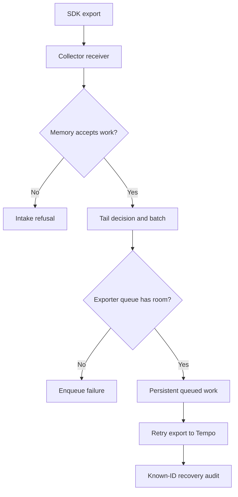

# Lab 40: Collector Queues, Retries, Memory, and Backpressure

## 1. Purpose and Learning Outcomes

**In Plain Language:** You will test what happens after a trace has been selected for retention but cannot reach Tempo. First observe buffering and restart recovery, then force a deliberately small queue to overflow and a low memory threshold to refuse work. Known trace IDs and explicit restoration keep each failure boundary measurable without exhausting the host.

> **Primary Objective:** Observe bounded buffering, persistent-queue recovery, queue overflow and memory refusal while separating application health from telemetry delivery.

A sampled trace still has to survive transport, processing, export and storage. This lab interrupts only Tempo export, observes a persistent queue, deliberately overflows a small queue, then tests the memory limiter with a low threshold rather than exhausting the host.

The existing tail policies remain part of the experiment. You will use error requests that those policies retain, identify where data can be lost, and recover using a saved configuration and known-ID canaries. This does not prove zero loss, exactly-once delivery or high availability. Loki outage, broad backend game days and production load testing remain later topics.

## 2. Starting Point and Lab Map

Use this guide inside the complete application repository. Run commands from the repository root in Bash unless a step says otherwise. Work through the starting checks in order; they load the helpers and state this lab needs.

Read the explanation before each step, run one complete code block at a time, and compare the actual result with the stated expectation. Save commands, observations, explanations, and unexpected results in your notebook.

### Key Terms

| **Term**                  | **Plain-Language Meaning**                                                       |
| ------------------------- | -------------------------------------------------------------------------------- |
| Persistent exporter queue | Disk-backed pending export work that can survive a compatible Collector restart. |
| Backpressure              | Downstream limits causing upstream work to wait, fail, or be refused.            |
| Memory limiter            | A processor that refuses intake at configured memory thresholds.                 |

### Lab Map

The arrows show the flow or dependency being studied. Branches identify paths to compare; this is a conceptual map, not a captured runtime trace.



## 3. Guided Walkthrough

### Step 01. Inherited State and Starting Checks

**What You Are Doing:** Start with the approved sampling policy and healthy backends. Queue-loss experiments need a known retention decision so sampled-out traces are not counted as transport loss.

**Practical Walkthrough:** Verify the approved tail policy and healthy Tempo before testing queues. Use scenarios known to be retained so a missing trace is not simply an intentional sample drop. Preserve business and log canaries as independent controls while changing the trace export path.

Choose known-retained error or slow scenarios for the queue experiments. Confirm healthy Tempo and the approved tail policy first. Otherwise an expected sampling drop could be misdiagnosed as lost queued work, weakening the later restart and overflow conclusions.

Complete [Lab 39](Lab-39.md) first. Run from the repository root in one Bash session; keep the existing credentials, named volumes, checkpoint item, dashboards and earlier evidence.

```bash
source lab-notes/session.sh
source lab-notes/evidence.sh
source lab-notes/metrics-session.sh
source lab-notes/platform-session.sh
source lab-notes/traces-session.sh
load_app_settings
start_lab 40
dp config --quiet
dp ps -a
wait_ready
wait_backend loki:3100 /ready
wait_backend tempo:3200 /ready
wait_backend otel-collector:13133 /
wait_backend lab-downstream:8001 /health/live
```

`dp` is the stage-aware Compose helper from Lab 31. It preserves the learning overlays and the current project. Plain `docker compose up` would use a different set of settings. `start_lab` creates a new `LAB_DIR`; all observations in this guide belong to that directory. Host tools remain Bash, Python 3, curl and jq; YAML edits use the isolated `lab-notes/.tools/bin/python` environment already installed in Lab 31.

The inherited platform has thirteen services, nine Prometheus scrape jobs and four existing dashboards. These labs add no service or scrape job. Pyroscope remains disabled until the profiling phase. The application still exposes native Prometheus metrics; traces travel through the Collector; Docker's fluentd logging driver sends JSON stdout to the same Collector and then Loki.

```bash
cp lab-notes/tracing/collector.yml "$LAB_DIR/collector.before-faults.yml"
lab-notes/.tools/bin/python - <<'CHECK'
import yaml
c=yaml.safe_load(open('lab-notes/tracing/collector.yml'))
assert 'tail_sampling' in c['service']['pipelines']['traces']['processors']
assert c['exporters']['otlp_grpc/tempo']['sending_queue']['storage']=='file_storage'
print('Tail sampling and persistent trace exporter queue present')
CHECK
dp exec -T app python - <<'CHECK'
from app.config import Settings
assert Settings().trace_sample_ratio==1.0
CHECK
backend otel-collector:8888 /metrics > "$LAB_DIR/collector-original.prom"
```

Stop other learning load generators. Keep ordinary dependency checks running and preserve all named volumes. Existing Tempo/target alerts may fire during the deliberate outage; record their timestamps as expected observations. Do not disable alert rules to make the experiment appear healthy.

**Understanding the Result:** Known retention eligibility is necessary for a meaningful transport-loss audit. Sampling and delivery are separate filters.

### Step 02. Learning Objectives and Buffer Boundaries

**What You Are Doing:** Separate SDK buffering, intake, sampling memory, batching, and export queues. A persistence guarantee at one stage does not extend automatically to every earlier stage.

**Practical Walkthrough:** Follow spans through SDK buffering, Collector intake, sampling memory, batching, and export queue. Persistence at the export queue protects only work that reached that queue under the configured conditions. It does not automatically protect spans still waiting in earlier memory-only stages.

Identify where each span is held: SDK, sampling state, batch processor, or exporter queue. Persistent export storage protects only the work that reached that boundary. Preserve this distinction when testing Collector restart so earlier in-memory spans are not assumed durable merely because one queue persists.

| **Stage**                      | **What Is Buffered or Decided**        | **Important Limitation**                                    |
| ------------------------------ | -------------------------------------- | ----------------------------------------------------------- |
| Python BatchSpanProcessor      | Ended spans waiting for export         | Process memory, finite capacity                             |
| OTLP receiver + memory limiter | Intake acceptance or refusal           | Acceptance is not end-to-end storage acknowledgement        |
| Tail sampler                   | Candidate traces and decision cache    | Memory only; already dropped traces cannot be reconstructed |
| Batch processor                | Data grouped for export                | Memory only; asynchronous boundaries change retry behavior  |
| Persistent exporter queue      | Requests accepted for backend delivery | Disk/capacity/retry limits; not exactly once                |
| Tempo                          | Ingested trace data                    | Backend durability/retention is a separate boundary         |

Queue units depend on configuration. This lab explicitly uses `sizer: requests` and a one-span export batch, so an export request is deliberately small and understandable. This is an experiment setting, not an efficient production batch size.

**Prediction Checkpoint:** stopping Tempo should not fail application readiness. A queue should grow and exporter retry warnings should appear. A short outage within capacity can recover. A small full queue can reject later export requests, and an earlier successful SDK export cannot reconstruct data lost beyond an asynchronous processing boundary.

**Understanding the Result:** Always attach a durability claim to its boundary. 'Persistent queue' does not mean the entire telemetry path is lossless.

### Step 03. Install Reversible Configuration and Snapshot Helpers

**What You Are Doing:** Save a baseline and derive each temporary configuration from it. This prevents a small-queue or low-memory setting from leaking into the next experiment.

**Practical Walkthrough:** Save the approved Collector configuration and derive every temporary variant from that same baseline. Keep separate files for persistence, small-queue, and low-memory tests. This prevents one experiment's restrictive setting from accidentally becoming the starting condition for the next.

Derive every temporary configuration from the saved approved baseline, not from the previous fault file. Inspect the intended setting difference before activation. Separate variants prevent a small queue or low memory threshold from silently carrying into another experiment and creating a second failure cause.

```bash
cat > lab-notes/tracing/queue_config.py <<'PYTHON'
"""Derive each fault configuration from a clean saved baseline, never another fault."""
import argparse
from pathlib import Path
import yaml

parser = argparse.ArgumentParser()
parser.add_argument('baseline')
parser.add_argument('mode', choices=['buffer', 'overflow', 'memory'])
args = parser.parse_args()
config = yaml.safe_load(Path(args.baseline).read_text())
assert 'tail_sampling' in config['processors']
# Stable, explicit raw metric names for the evidence queries in this lab.
prom = config['service']['telemetry']['metrics']['readers'][0]['pull']['exporter']['prometheus']
prom['without_type_suffix'] = True
prom['without_units'] = True
exporter = config['exporters']['otlp_grpc/tempo']
exporter['sending_queue'] = {'enabled': True, 'sizer': 'requests',
    'queue_size': 8 if args.mode == 'overflow' else 128, 'num_consumers': 1,
    'wait_for_result': False, 'block_on_overflow': False, 'storage': 'file_storage'}
exporter['timeout'] = '2s'
exporter['retry_on_failure'] = {'enabled': True, 'initial_interval': '1s',
                              'max_interval': '3s', 'max_elapsed_time': '120s'}
# One span per export request makes queue units observable. Logs keep their existing batch processor.
config['processors']['batch/traces-lab'] = {
    'timeout': '200ms', 'send_batch_size': 1, 'send_batch_max_size': 1}
config['service']['pipelines']['traces']['processors'] = [
    'memory_limiter', 'transform/traces', 'tail_sampling', 'batch/traces-lab']
if args.mode == 'memory':
    config['processors']['memory_limiter/lab'] = {
        'check_interval': '100ms', 'limit_mib': 2, 'spike_limit_mib': 1}
    config['service']['pipelines']['traces']['processors'][0] = 'memory_limiter/lab'
Path('lab-notes/tracing/collector.yml').write_text(yaml.safe_dump(config, sort_keys=False))
PYTHON
```

**Command Note:** `<<'PYTHON'` writes the following block literally until `PYTHON`. Quoting the delimiter prevents Bash from expanding `$variables` inside the generated file; creation and execution are separate steps.

```bash
cat > lab-notes/tracing/collector_snapshot.py <<'PYTHON'
"""Run inside app. Print a compact snapshot from the Collector's real exposition."""
import json
from urllib.request import urlopen
from prometheus_client.parser import text_string_to_metric_families

with urlopen('http://otel-collector:8888/metrics', timeout=3) as response:
    text = response.read().decode()
names = {'otelcol_exporter_queue_size', 'otelcol_exporter_queue_capacity', 'otelcol_exporter_in_flight_requests',
         'otelcol_exporter_enqueue_failed_spans', 'otelcol_exporter_sent_spans',
         'otelcol_exporter_send_failed_spans', 'otelcol_receiver_accepted_spans',
         'otelcol_receiver_refused_spans', 'otelcol_process_memory_rss',
         'otelcol_process_runtime_heap_alloc_bytes'}
rows = []
for family in text_string_to_metric_families(text):
    for sample in family.samples:
        # Parser may normalize a Prometheus counter to its _total sample name.
        name = sample.name.removesuffix('_total')
        if name not in names:
            continue
        if name.startswith('otelcol_exporter_') and sample.labels.get('exporter') != 'otlp_grpc/tempo':
            continue
        rows.append({'metric': name, 'labels': sample.labels, 'value': sample.value})
print(json.dumps(rows, indent=2))
PYTHON
```

```bash
collector_snapshot() {
  dp exec -T app python - < lab-notes/tracing/collector_snapshot.py
}
apply_collector_fault() {
  lab-notes/.tools/bin/python lab-notes/tracing/queue_config.py "$LAB_DIR/collector.before-faults.yml" "$1" || return
  dp run --rm -T --no-deps otel-collector validate --config=/etc/otelcol-contrib/config.yaml || return
  dp up -d --no-deps --force-recreate otel-collector || return
  wait_backend otel-collector:13133 /
}
restore_collector() {
  dp start tempo || return
  wait_backend tempo:3200 /ready || return
  cp "$LAB_DIR/collector.before-faults.yml" lab-notes/tracing/collector.yml || return
  dp run --rm -T --no-deps otel-collector validate --config=/etc/otelcol-contrib/config.yaml || return
  dp up -d --no-deps --force-recreate otel-collector || return
  wait_backend otel-collector:13133 /
}
```

Each fault is derived from the saved baseline, so the small-queue or low-memory setting cannot silently carry into the next experiment. Only trace batching/export settings change; the existing Loki exporter and log pipeline remain in place.

The snapshot uses the already installed `prometheus_client` parser inside the app. The temporary configuration disables Collector metric type/unit suffixes for explicit metric names. Counters may still be normalized by the parser; the helper handles that. Zero-valued series may not exist before their first observation, so absence is not automatically a failed scrape.

`queue_size` and `in_flight_requests` describe implementation stages; do not blindly add them. Persistent queue accounting can include an in-flight item. `send_failed_spans` is not a universal count of every retry attempt: transient retry warnings can appear before a terminal failure counter rises. Preserve both metrics and component logs.

**Understanding the Result:** Compare restoration against the saved baseline, not against the most recently modified temporary file.

### Step 04. Prove Buffering and Recovery Across a Collector Restart

**What You Are Doing:** Interrupt Tempo export briefly, observe queued work, and restart the Collector under the compatible configuration. Audit the known retained traces after recovery instead of relying on queue health alone.

**Practical Walkthrough:** Interrupt Tempo export for the bounded interval, observe queued work, and restart Collector under the compatible persistence configuration. Restore Tempo before the retry budget is exhausted, then audit expected retained trace IDs and spans. Queue health alone cannot prove every span survived restart.

Observe backlog before the Collector restart and restore Tempo within the configured retry budget. Then audit exact trace IDs and required spans. Queue recovery and a healthy exporter are necessary observations, but only backend reconciliation shows which known distributed operations survived completely.

```bash
apply_collector_fault buffer
collector_snapshot > "$LAB_DIR/buffer-before.json"
(
  set -euo pipefail
  trap 'dp start tempo >/dev/null' EXIT
  date -u +%FT%TZ > "$LAB_DIR/buffer-outage-start.txt"
  dp stop tempo
  python3 lab-notes/tracing/scenario_load.py "$APP_URL" "$LAB_DIR/buffer-ledger.jsonl" --count 3 --only error
  # Wait beyond ordinary SDK batching and the 10-second tail decision window.
  for second in {1..20}; do
    collector_snapshot | jq -c --argjson second "$second" '{second:$second,samples:.}' >> "$LAB_DIR/buffer-timeline.jsonl"
    sleep 1
  done
  collector_snapshot > "$LAB_DIR/buffer-before-restart.json"
  jq -e 'any(.[]; .metric=="otelcol_exporter_queue_size" and .value>0)' "$LAB_DIR/buffer-before-restart.json"
  api -fsS "$APP_URL/health/ready" > "$LAB_DIR/ready-during-tempo-outage.json"
  dp restart otel-collector
  wait_backend otel-collector:13133 /
  collector_snapshot > "$LAB_DIR/buffer-after-restart.json"
  dp start tempo
  wait_backend tempo:3200 /ready
  trap - EXIT
)
LEDGER_JSON=$(cat "$LAB_DIR/buffer-ledger.jsonl")
dp exec -T app python - "$LEDGER_JSON" --wait 40 --require-all < lab-notes/tracing/retention_audit.py > "$LAB_DIR/buffer-recovered-audit.json"
collector_snapshot > "$LAB_DIR/buffer-recovered.json"
dp logs --since=4m --tail=160 --no-color otel-collector > "$LAB_DIR/buffer-collector.log"
```

**Command Note:** `trap ... EXIT` schedules cleanup when that shell exits. Keep it in the same block as the fault; the explicit recovery checks afterward confirm that restoration actually succeeded.

The subshell ensures Tempo is started again if an experiment command fails. It does not delete storage or restart business dependencies. Keep the outage short: the temporary retry budget is 120 seconds. If interrupted, run `dp start tempo`, then `restore_collector`.

Three failed scenario requests normally produce at least fifteen spans, all eligible under the ERROR policy. The 128-request queue provides room for that controlled workload and modest background traffic. Readiness should stay successful because PostgreSQL/Redis, not Tempo, define required business health.

The observed queue plus later successful known-ID lookup demonstrates persistence for these exported requests across this restart. It does not establish that every accepted span was already in the queue. The twenty-second wait is an observation allowance, not a guarantee: a slow exporter/SDK could leave candidate data upstream or in the tail buffer. If the final completeness assertion fails, record missing IDs and investigate the stage instead of asserting lossless recovery.

Compare before/after values within a process lifetime. Collector counters reset on restart; the persistent queue's outstanding data can survive while those counters restart at zero. Do not infer recovery by subtracting reset counters.

**Understanding the Result:** The test covers the configured persisted export boundary. Earlier unqueued spans may have different survival behavior.

### Step 05. Drain Before Changing Capacity

**What You Are Doing:** Prove the previous backlog drained before changing capacity. Otherwise later missing spans could belong to an earlier experiment and distort the result.

**Practical Walkthrough:** Wait for the first backlog to settle and complete its identity audit before changing queue capacity. Save unresolved discrepancies with that run. Starting another fault too early would mix populations and make later missing spans impossible to attribute confidently.

Wait for the backlog to drain and finish its identity comparison before the next configuration change. Save any unresolved missing or partial traces with that experiment. Overlapping fault populations would make later gaps difficult to attribute to persistence, overflow, or memory refusal.

```bash
wait_collector_drain() {
  local attempt
  for attempt in {1..30}; do
    collector_snapshot > "$LAB_DIR/drain-check.json" || return
    if jq -e 'any(.[]; .metric=="otelcol_exporter_queue_size") and all(.[]; (.metric!="otelcol_exporter_queue_size" and .metric!="otelcol_exporter_in_flight_requests") or .value==0)' "$LAB_DIR/drain-check.json" >/dev/null; then
      return 0
    fi
    sleep 1
  done
  echo 'Exporter did not drain; inspect Tempo and retry evidence' >&2
  return 1
}
wait_collector_drain
```

Require a drained exporter before shrinking its capacity. Otherwise you would mix an earlier backlog with a new experiment and might misattribute losses. A brief zero between background batches is sufficient for this bounded exercise only after the known-ID recovery audit has passed.

A persistent queue uses disk. Restarting with an incompatible storage path, deleting the named volume or exhausting disk space defeats its protection. Keep the same exporter identity and `file_storage` directory; changing the name of the exporter can change its persisted storage namespace.

**Understanding the Result:** An empty queue is only one check. Reconcile the first run's traces before proceeding.

### Step 06. Force a Small, Bounded Queue Overflow

**What You Are Doing:** Use a deliberately tiny queue and finite workload to expose overflow. Compare enqueue failures with missing or partial known traces after restoring the backend.

**Practical Walkthrough:** Apply the tiny eight-request queue and generate only the prescribed finite workload, approximately sixty spans from twelve calls under the stated batching setup. Observe enqueue failures during the outage, then restore Tempo and compare complete and partial trace results. Keep the configured retry limit in view.

Read queue capacity in its configured request units rather than treating it as eight spans. Keep workload and outage finite, capture enqueue-failure evidence, and restore the backend. Compare complete, partial, and absent traces afterward, since overflow can remove only part of an expected distributed operation.

```bash
apply_collector_fault overflow
collector_snapshot > "$LAB_DIR/overflow-before.json"
(
  set -euo pipefail
  trap 'dp start tempo >/dev/null' EXIT
  dp stop tempo
  python3 lab-notes/tracing/scenario_load.py "$APP_URL" "$LAB_DIR/overflow-ledger.jsonl" --count 12 --only error
  for second in {1..20}; do
    collector_snapshot | jq -c --argjson second "$second" '{second:$second,samples:.}' >> "$LAB_DIR/overflow-timeline.jsonl"
    sleep 1
  done
  collector_snapshot > "$LAB_DIR/overflow-full.json"
  jq -e 'any(.[]; .metric=="otelcol_exporter_enqueue_failed_spans" and .value>0)' "$LAB_DIR/overflow-full.json"
  api -fsS "$APP_URL/health/ready" > "$LAB_DIR/ready-during-overflow.json"
  dp start tempo
  wait_backend tempo:3200 /ready
  trap - EXIT
)
LEDGER_JSON=$(cat "$LAB_DIR/overflow-ledger.jsonl")
dp exec -T app python - "$LEDGER_JSON" --wait 40 < lab-notes/tracing/retention_audit.py > "$LAB_DIR/overflow-audit.json"
jq '{requested,found,complete,span_count,event_count}' "$LAB_DIR/overflow-audit.json"
dp logs --since=4m --tail=200 --no-color otel-collector > "$LAB_DIR/overflow-collector.log"
```

**Command Note:** In `jq`, `--arg` supplies a string and `--argjson` supplies a JSON value. `-e` also makes a false or null final result fail the command, so assertions can stop the block.

Twelve requests create roughly sixty eligible spans. A queue of eight one-span requests cannot hold all of them while Tempo is down. The experiment uses one consumer and nonblocking queue overflow to make finite-capacity rejection observable without sustained load.

Expect positive enqueue failures and some absent or partial traces after recovery. Exactly which IDs survive depends on batching, scheduling and background traffic. A `found` trace can still be incomplete; compare it with `complete` and inspect missing custom spans/events.

Do not equate the enqueue-failure span count with a count of failed business requests. The route intentionally returned twelve application errors, while the telemetry loss happens later and has different units. Collector retries retry requests that reached the exporter retry path; they cannot replay arbitrary spans already dropped by an asynchronous batch/queue boundary.

While Tempo is down, use Loki to locate one ledger request's completion log. The logs pipeline has a different backend/exporter queue and should continue in this trace-only backend fault. Both pipelines still share process resources, so a Collector crash or host exhaustion could affect both; this experiment does not prove total signal isolation.

**Understanding the Result:** Queue units are export requests, not automatically traces. Overflow evidence and ID reconciliation explain actual loss more clearly than capacity alone.

### Step 07. Exercise Memory Refusal without Exhausting the VM

**What You Are Doing:** Set an intentionally low trace-only memory threshold to exercise refusal. The test changes the limit rather than allocating enough workload to exhaust the VM.

**Practical Walkthrough:** Use the intentionally low two-megabyte trace memory threshold to exercise refusal without stressing the host with a large workload. Observe the specific refusal evidence and audit known requests after recovery. Keep logs and normal business paths available as separate controls.

Apply the intentionally low trace threshold instead of generating enough workload to exhaust the VM. Capture refusal evidence and retain the known request ledger. After restoration, audit those requests and verify business and log controls separately so memory refusal is localized to the intended telemetry boundary.

```bash
wait_collector_drain
apply_collector_fault memory
(
set -euo pipefail
trap 'restore_collector' EXIT
collector_snapshot > "$LAB_DIR/memory-before.json"
dp exec -T app python - <<'PYTHON' > "$LAB_DIR/memory-refusal.json"
import json,secrets,time
from urllib.error import HTTPError
from urllib.request import Request,urlopen
now=time.time_ns()
payload={'resourceSpans':[{'resource':{'attributes':[
    {'key':'service.name','value':{'stringValue':'lab-memory-fixture'}}]},
    'scopeSpans':[{'spans':[{'traceId':secrets.token_hex(16),'spanId':secrets.token_hex(8),
    'name':'memory.refusal.fixture','kind':1,'startTimeUnixNano':str(now-1000000),
    'endTimeUnixNano':str(now),'status':{'code':2}}]}]}]}
observed=[]
for attempt in range(3):
    request=Request('http://otel-collector:4318/v1/traces',data=json.dumps(payload).encode(),
                    headers={'Content-Type':'application/json'})
    try:
        with urlopen(request,timeout=3) as response:
            code=response.status
            response.read()
    except HTTPError as error:
        code=error.code
        error.read()
    observed.append(code)
    time.sleep(0.3)
print(json.dumps({'http_codes':observed,'refused':any(c in (429,503) for c in observed)}))
assert any(c in (429,503) for c in observed), 'Inspect limiter startup, threshold and receiver response'
PYTHON
collector_snapshot > "$LAB_DIR/memory-after.json"
jq -e 'any(.[]; .metric=="otelcol_receiver_refused_spans" and .value>0)' "$LAB_DIR/memory-after.json"
api -fsS "$APP_URL/health/ready" > "$LAB_DIR/ready-during-memory-refusal.json"
dp logs --since=2m --tail=100 --no-color otel-collector > "$LAB_DIR/memory-collector.log"
restore_collector
trap - EXIT
)
```

The temporary trace-only limiter has a 2 MiB hard limit and 1 MiB spike allowance, intentionally below normal Collector runtime use. This tests the threshold/refusal path without allocating large payloads or causing a host OOM. It is not a production memory setting or a realistic saturation benchmark. The normal logs pipeline retains its original limiter; the process is shared but only traces use the deliberately tiny threshold.

OTLP HTTP normally returns a retryable 503 for this refusal in the pinned Collector. The fixture makes only three attempts and preserves observed status codes. Real SDKs have their own finite retry/buffer behavior; retryable does not mean indefinitely recoverable. Upstream callers must cooperate with backpressure, and dropped SDK buffers still lose data.

The normal limiter's hard setting is 192 MiB with 48 MiB spike allowance, leaving a nominal 144 MiB soft threshold for its measured usage. Compare its decision logs with Go heap and process RSS, but do not assume they measure identical memory. Container memory accounting also includes other allocations and file-backed pages. Leave headroom below the container limit; a memory limiter is not proof against OOM.

Run `restore_collector` immediately even if a refusal assertion fails. Do not leave the low threshold active while trying unrelated application experiments.

**Understanding the Result:** The experiment lowers a guardrail rather than exhausting the VM. Refusal can occur before spans reach the persistent export queue.

### Step 08. Prove Final Recovery at Every Relevant Layer

**What You Are Doing:** Restore the baseline configuration and verify business, log, and trace evidence. Use an error scenario known to be retained by the sampling policy as the final canary.

**Practical Walkthrough:** Restore and compare the exact baseline configuration, restart the required component, and verify fresh business, log, and trace evidence. Use a known error scenario so tail retention is expected. Retain queue and memory experiment results separately from the final recovery canary.

Compare restored configuration with the saved baseline and verify fresh business, log, and known-retained trace canaries. Keep the old fault audits unchanged. Current success proves recovery, while the earlier missing or partial evidence remains part of what the queue and memory experiments demonstrated.

```bash
wait_ready
wait_backend tempo:3200 /ready
wait_backend loki:3100 /ready
wait_backend otel-collector:13133 /
python3 lab-notes/tracing/scenario_load.py "$APP_URL" "$LAB_DIR/final-canary.jsonl" --count 3 --only error
LEDGER_JSON=$(cat "$LAB_DIR/final-canary.jsonl")
dp exec -T app python - "$LEDGER_JSON" --wait 40 --require-all < lab-notes/tracing/retention_audit.py > "$LAB_DIR/final-audit.json"
jq '{requested,head_sampled,complete,event_count}' "$LAB_DIR/final-audit.json"
cmp "$LAB_DIR/collector.before-faults.yml" lab-notes/tracing/collector.yml
dp ps -a > "$LAB_DIR/final-services.txt"
backend otel-collector:8888 /metrics > "$LAB_DIR/collector-final.prom"
```

Open one final trace and its correlated completion log in Grafana. Confirm the correct parent edge, both custom spans and the rejection event. This canary deliberately uses errors because Lab 39 retains them; an ordinary successful trace could be legitimately absent under the 10% baseline.

The byte comparison proves the original Collector configuration was restored, including normal batching, queue size, retry settings, metric naming and tail policies. The temporary raw metric suffix settings are therefore no longer guaranteed; inspect the final exposition before reusing a temporary PromQL expression.

Native application metrics should continue to show the controlled 502 requests throughout the experiment. Readiness stays about required business dependencies. Collector health is useful but does not prove Tempo delivery: a healthy process with a blocked exporter is exactly the condition you just observed.

**Understanding the Result:** Current recovery does not undo earlier loss. The saved baseline and fresh retained trace establish the intended end state.

## 4. Troubleshooting and Diagnosis

Start with the first unexpected result. Record the exact symptom, identify which component produced it, and use the checks below before repeating the experiment. After a fix, repeat the original check and confirm recovery.

### Troubleshooting and an Evidence-Based Incident Timeline

| **Observation**                               | **Interpretation or Next Check**                                                                                 |
| --------------------------------------------- | ---------------------------------------------------------------------------------------------------------------- |
| Queue does not grow immediately               | Wait for SDK batches and tail decisions; verify an ERROR scenario and active exporter queue.                     |
| Queue remains zero while errors log           | Data may be refused upstream, dropped by sampling or still in memory; inspect intake and processor evidence.     |
| Retry warnings with zero send-failure counter | Retry attempts and final failures are different events; inspect exporter semantics and elapsed retry budget.     |
| Export counters reset after restart           | Expected process reset; compare persisted work and known trace IDs instead.                                      |
| In-flight count and queue size overlap        | Persistent queue accounting can include consumed work; do not add gauges without verifying semantics.            |
| Queue full but no immediate client error      | Async boundaries may already have acknowledged earlier stages.                                                   |
| Collector healthy, app ready, trace absent    | Both health checks can pass despite telemetry delivery failure.                                                  |
| Memory experiment causes persistent refusal   | Restore the baseline immediately, then inspect retries and fresh canaries.                                       |
| Recovery is partial                           | Identify head/tail decisions, SDK/batch state, enqueue failures, retry exhaustion and backend errors separately. |

Write a timeline with outage start, first retry, first nonzero queue, restart, overflow/refusal, backend restart and confirmed canary arrival. Include metrics, logs and trace IDs as evidence. Separate business failures deliberately generated by the scenario from failures in the telemetry delivery path.

If a step was interrupted, start Tempo, restore the saved configuration, validate/recreate the Collector and run the final error canary. Volume deletion is not a recovery step for exporter connectivity or memory thresholds.

## 5. Review and Practice

Answer the knowledge questions in your own words before reading the answer guide. For the scenario, name the evidence you would collect and the conclusion each observation would support.

### Knowledge Check

1. What does a successful OTLP intake response guarantee here?
2. Which buffers are protected by exporter file_storage?
3. Why might a queue overflow lose data even with retries enabled?
4. Why is a healthy Collector process insufficient evidence of trace delivery?
5. What makes this memory experiment different from host resource saturation?

#### Answer Guide

1. Only the accepting stage has processed/accepted the request according to its pipeline; later async stages can still lose it.
2. The configured exporter sending queue, not SDK buffers, tail decisions or the batch processor.
3. Data rejected before entering the retry path, or lost behind an asynchronous boundary, may have no retained upstream copy.
4. The process and receiver can be healthy while a backend exporter is failing or queues are full.
5. It lowers the refusal threshold under normal usage rather than deliberately filling memory; it tests behavior, not safe operating capacity.

### Professional Scenario Exercise

During an incident, the app is ready, Loki has completion logs, Tempo is sparse and Collector queue failures rise. Prepare a response that restores export, preserves evidence and identifies the likely loss interval without claiming that every absent trace was sampled out. Include how you would prove recovery and what irreversible diagnostic loss remains.

## 6. Completion Checklist

Mark each item only after you can point to its result or evidence file. Complete any cleanup shown here before moving on.

### Observable Completion Criteria

- [ ] Tempo failure is observed without turning application readiness into a telemetry dependency.
- [ ] Queued trace data is recovered across the controlled Collector restart and verified by known IDs.
- [ ] A bounded small queue produces enqueue failures and measured missing/partial trace evidence.
- [ ] A low-threshold test produces receiver refusal without intentional host exhaustion.
- [ ] The notebook separates queue units, retry attempts, dropped spans and business requests.
- [ ] The exact pre-fault configuration and healthy Tempo/Loki paths are restored.
- [ ] The final retained canary has complete cross-service traces and correlated logs.

## 7. Production Context and Next Lab

### Production Implications

Budget queues using units, incoming rate, batch sizes, disk and tolerated outage duration. Test retry exhaustion and storage failure in controlled environments before relying on persistence. Watch accepted/refused data, queue pressure, enqueue failures, final export failures and backend arrival together. Independent signal exporters still share CPU, memory and disk. See [Collector resiliency](https://opentelemetry.io/docs/collector/resiliency/), [internal telemetry](https://opentelemetry.io/docs/collector/internal-telemetry/) and [exporter helper behavior](https://github.com/open-telemetry/opentelemetry-collector/tree/v0.160.0/exporter/exporterhelper).

### End State and Transition

Keep the restored Lab 39 tail policies, full head sampling and healthy native metrics/logs/traces. Preserve the incident evidence, not the temporary queue or limiter settings. [Lab 41](Lab-41.md) introduces trace-derived span metrics, service graphs and exemplars; those components have not been enabled early here.
