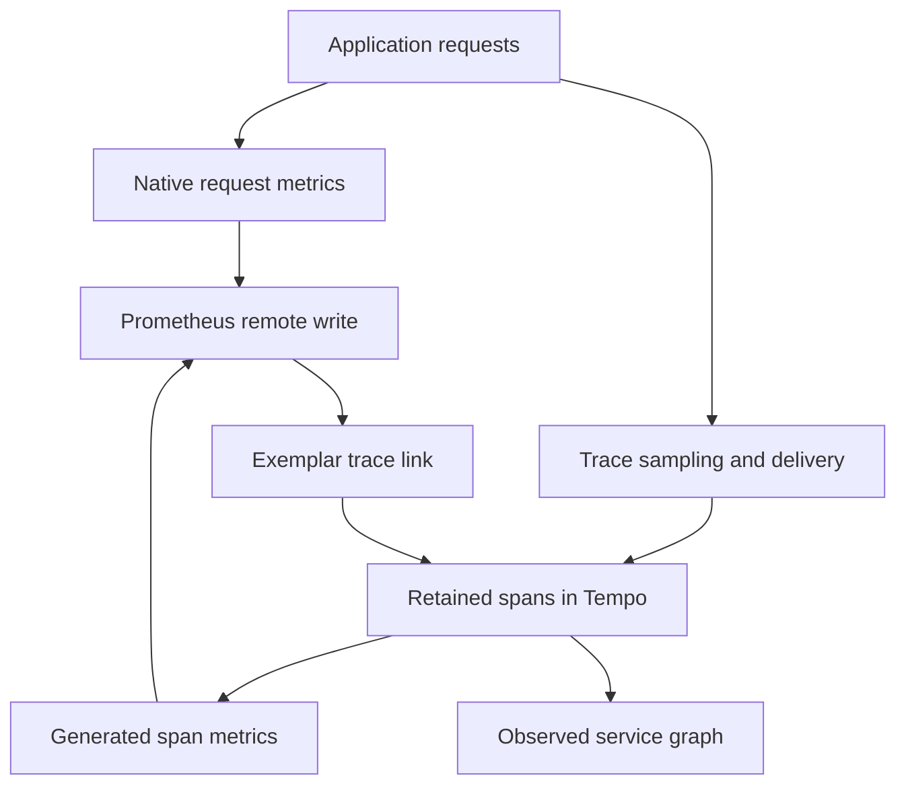

# Lab 41: Tempo Span Metrics, Service Graphs, and Exemplars

## 1. Purpose and Learning Outcomes

You will create diagnostic metrics and service relationships from traces that were actually retained. Compare a fully retained workload with a sampled one to see how selection changes the requests represented by those metrics. Then follow an exemplar to one trace. Keep that example separate from the complete native request measurements used for the service's SLI, or service-level indicator.

> **Primary Objective:** Generate metrics from retained spans, inspect the observed relationships between services, and open a trace from a metric exemplar without treating sampled data as the service's complete SLI population.

Labs 38–40 showed that traces can be dropped at several stages. Tempo will now generate a separate, clearly named set of diagnostic metrics from the spans it receives. FastAPI's native metrics still supply request totals, latency SLIs, and error rates because their request population is independent of trace retention.

Extend the existing single-node Tempo setup and allow Prometheus to receive remote-written samples. Compare fully retained and tail-sampled workloads, then configure Grafana service graphs and exemplars. This adds no second application-metrics exporter, Kafka cluster, or additional Collector.

## 2. Starting Point and Lab Map

Open the complete application repository before using this guide. Unless a step says otherwise, run commands in Bash from the repository's top-level folder. Follow the starting checks in order because later commands depend on the helper functions and running services they prepare.

Read each explanation before running its commands. Run one complete code block, check the result, and then continue. In your notebook, save the commands, what happened, why you think it happened, and anything that differed from the expected result.

### Key Terms

| **Term**      | **Explanation**                                                                                               |
| ------------- | ------------------------------------------------------------------------------------------------------------- |
| Span metric   | A metric calculated from the spans that actually reached the trace-processing component.                      |
| Service graph | A combined view of service-to-service relationships observed in telemetry.                                    |
| Exemplar      | One representative observation attached to a metric, often with a trace ID that lets you inspect its details. |

### Lab Map

The arrows show how the parts connect and where a request can take different paths. Use this map to understand the design. It is not a recording of a request that actually ran.



## 3. Guided Walkthrough

### Step 01. Inherited State and Starting Checks

**What You Are Doing:** Verify that the queue experiments are fully recovered before generating metrics from traces. Earlier sampling or delivery loss changes which spans the generator can observe.

**Practical Walkthrough:** Confirm recovery from the queue and memory faults, then keep native request metrics as an independent comparison. The generator only sees spans delivered to it. A change in its input may reflect trace selection or loss even when application traffic stays the same.

Clear the previous faults and verify delivery before enabling generation. Compare trace-derived results with native app metrics so you can distinguish a changed retained population from a changed number of requests.

Complete [Lab 40](Lab-40.md), including recovery. Work from the repository root in one Bash session, retaining credentials, named volumes, and earlier evidence.

```bash
source lab-notes/session.sh
source lab-notes/evidence.sh
source lab-notes/metrics-session.sh
source lab-notes/platform-session.sh
source lab-notes/traces-session.sh
load_app_settings
start_lab 41
dp config --quiet
dp ps -a
wait_ready
wait_backend tempo:3200 /ready
wait_backend otel-collector:13133 /
wait_backend lab-downstream:8001 /health/live
dp exec -T app python - <<'CHECK'
from app.config import Settings
assert Settings().trace_sample_ratio == 1.0
CHECK
```

Continue using `dp`, the stage-aware Compose helper. Plain `docker compose up` would omit the learning overlays. `start_lab` creates a new evidence directory in `LAB_DIR`; keep this run's observations there. You need Bash, Python 3, curl, jq, and the existing PyYAML environment at `lab-notes/.tools/bin/python`.

The inherited setup has thirteen services and nine scrape jobs, with Pyroscope disabled. Keep the repository's pinned versions: Tempo 3.0.3 with `target: all`, Prometheus 3.14.0, Grafana 13.2.2, and Collector contrib 0.160.0. Tempo's monolithic mode can run its metrics generator directly. Kafka requirements for other Tempo 3 deployment modes do not apply to this setup.

Confirm that Lab 40's tiny queue and memory threshold are no longer active. Stop other learning load generators so the compared counts and totals describe the intended workload.

**Understanding the Result:** Generated metrics inherit the limits of the traces they receive. They do not automatically include every request handled by the application.

### Step 02. Learning Objectives and Signal Ownership

**What You Are Doing:** Identify who produces each metric family and how it reaches Prometheus. Native request metrics and generated span metrics observe different points in the system.

**Practical Walkthrough:** Follow each metric's collection path. Prometheus scrapes native application metrics, while Tempo sends generated metrics through remote write. Check their names, labels, units, and included populations separately before comparing their values.

Identify the producer and transport first, then inspect the actual labels and units. Although both families describe rate, errors, and duration, the generated family represents delivered, retained spans. Similar concepts do not imply identical request coverage.

| **Signal**                           | **Producer and Transport**                      | **Question It Can Answer**                                         |
| ------------------------------------ | ----------------------------------------------- | ------------------------------------------------------------------ |
| `application_http_requests_total`    | FastAPI → `/metrics` → Prometheus               | How many completed requests did the application process observe?   |
| `traces_spanmetrics_calls_total`     | Retained spans → Tempo generator → remote write | Which operations are represented in the retained trace population? |
| `traces_service_graph_request_total` | Paired client/server spans → Tempo generator    | Which instrumented services were observed communicating?           |
| Histogram exemplar                   | Tempo generator → Prometheus → Grafana          | Which retained trace provides an example of an observation?        |

An exemplar attaches a trace reference to an observation without adding a new time-series label. A service graph is inferred from telemetry, so it is not a complete network-dependency inventory. Missing spans, uninstrumented components, and matching time limits can produce absent or virtual edges.

**Prediction Checkpoint:** With full head recording and a brief tail-sampling bypass, the selected server-span count should follow the known workload. After restoring error, latency, and 10% ordinary retention, the generated error proportion should rise because more ordinary successes are discarded. Native request metrics should remain near one-third errors for the equal normal/slow/error mix.

**Understanding the Result:** Two metrics can describe similar RED concepts while covering different populations. Displaying them on the same dashboard does not make their coverage equal.

### Step 03. Back Up and Enable the Metrics Generator

**What You Are Doing:** Back up Tempo's settings and add generation while preserving receivers and storage. Limit the output dimensions and explicitly define the remote-write destination.

**Practical Walkthrough:** Extend the saved Tempo configuration and verify that the destination accepts generated samples. Keep label values limited. Use individual trace IDs for exemplars or lookup, not as a metric dimension that creates a separate series for every trace.

Preserve the working receivers and storage, then check the remote-write path. The output should use bounded dimensions. Exemplar navigation can link a trace without turning that unique ID into a new series label.

```bash
cp lab-notes/tracing/tempo.yml "$LAB_DIR/tempo.before.yml"
cp lab-notes/tracing/collector.yml "$LAB_DIR/collector.before.yml"
cp lab-notes/compose.metrics.yaml "$LAB_DIR/compose.metrics.before.yaml"
cp -a config/grafana/learning/provisioning/datasources "$LAB_DIR/datasources.before"
```

The editor preserves existing receivers, storage, retention flags, and data-source UIDs. The generator writes its own WAL in the existing Tempo volume. Classic histogram buckets match the queries below, and a series cap limits cardinality on the small VM. Request, item, trace, and span IDs do not become metric dimensions.

```bash
cat > lab-notes/tracing/configure_span_metrics.py <<'PYTHON'
"""Enable Tempo's own metrics generator; leave FastAPI's native metric pipeline intact."""
from pathlib import Path
import yaml

path=Path('lab-notes/tracing/tempo.yml')
config=yaml.safe_load(path.read_text())
assert config['target']=='all'
config['metrics_generator']={
    'registry': {'collection_interval':'5s','external_labels':{'source':'tempo'}},
    'processor': {
        'service_graphs': {'wait':'15s','max_items':1000,'workers':2},
        'span_metrics': {'histogram_buckets':[0.005,0.01,0.025,0.05,0.1,0.2,0.3,0.5,1,2.5,5],
                         'enable_target_info':False}},
    'storage': {'path':'/var/tempo/generator/wal','remote_write':[
        {'url':'http://prometheus:9090/api/v1/write','send_exemplars':True}]},
    'metrics_ingestion_time_range_slack':'2m'}
config.setdefault('overrides',{}).setdefault('defaults',{}).setdefault('metrics_generator',{}).update({
    'processors':['service-graphs','span-metrics'],
    'max_active_series':10000,'generate_native_histograms':'classic'})
path.write_text(yaml.safe_dump(config,sort_keys=False))
path=Path('lab-notes/compose.metrics.yaml');config=yaml.safe_load(path.read_text())
command=config['services']['prometheus']['command']
for flag in ['--web.enable-remote-write-receiver','--enable-feature=exemplar-storage']:
    if flag not in command: command.append(flag)
path.write_text(yaml.safe_dump(config,sort_keys=False))
# Find the existing datasources rather than assuming a provisioned filename.
entries=[]
for path in Path('config/grafana/learning/provisioning/datasources').glob('*.y*ml'):
    document=yaml.safe_load(path.read_text())
    for ds in document.get('datasources',[]): entries.append((path,document,ds))
prom=[e for e in entries if e[2]['type']=='prometheus']
tempo=[e for e in entries if e[2].get('uid')=='tempo']
assert len(prom)==len(tempo)==1,'Expected one existing Prometheus datasource and the Tempo UID'
prom_uid=prom[0][2]['uid']
for path,document,ds in entries:
    changed=False
    if ds['type']=='prometheus':
        ds.setdefault('jsonData',{})['exemplarTraceIdDestinations']=[{'name':'traceID','datasourceUid':'tempo'}]
        changed=True
    if ds.get('uid')=='tempo':
        ds.setdefault('jsonData',{}).update({'serviceMap':{'datasourceUid':prom_uid},'nodeGraph':{'enabled':True}})
        changed=True
    if changed: path.write_text(yaml.safe_dump(document,sort_keys=False))
print('Tempo metrics -> Prometheus remote write; existing datasource UIDs preserved')
PYTHON
```

**Command Note:** `<<'PYTHON'` writes the block exactly as shown until the closing `PYTHON`. The quotes prevent Bash from expanding `$variables` inside the file. Creating and executing the file are separate steps.

```bash
lab-notes/.tools/bin/python lab-notes/tracing/configure_span_metrics.py
dp config --quiet
dp up -d --no-deps --force-recreate prometheus
wait_prometheus
dp up -d --no-deps --force-recreate tempo grafana
wait_backend tempo:3200 /ready
wait_grafana
dp logs --since 2m --tail 100 tempo prometheus
```

Prometheus now receives internal remote writes at `/api/v1/write`, with exemplar storage explicitly enabled. This uses Prometheus's existing HTTP listener. Keep its host binding limited to loopback and do not expose the receiver to untrusted clients.

Expect ready services without unknown-field or remote-write errors. The scrape count stays at nine because generation uses remote write rather than a new scrape job. Do not also add a Collector span-metrics connector. `source="tempo"` identifies these generated samples; `service` is their metric label, while `service.name` is an OTel resource attribute.

**Understanding the Result:** Generator startup proves only that it started. Confirm that its actual metric families arrive in Prometheus.

### Step 04. Measure One Fully Retained Workload

**What You Are Doing:** Briefly bypass tail selection for one controlled workload, then restore it. The fully retained run provides a reference for explaining the later sampled view.

**Practical Walkthrough:** Use the prescribed sixty-trace workload while the temporary bypass is active. Keep the supplied recovery path and save exact run times. This makes it possible to separate full-input metrics from the later selected population.

Keep the change inside the restoration wrapper and audit all sixty traces before comparing metrics. Save the workload interval, then restore the approved policy. Otherwise, the later sampled run would not be a valid comparison.

The bypass is short and reversible, and SDK head sampling remains 1.0. It supplies a reference population for the later biased view. On exit or interruption, the trap restores the complete saved Collector configuration, including its log pipeline and persistent-queue settings.

```bash
(
  set -euo pipefail
  restore_tail() {
    cp "$LAB_DIR/collector.before.yml" lab-notes/tracing/collector.yml
    dp up -d --no-deps --force-recreate otel-collector
  }
  trap restore_tail EXIT
  trap 'exit 130' INT
  trap 'exit 143' TERM
  lab-notes/.tools/bin/python - <<'PYTHON'
from pathlib import Path
import yaml
p=Path('lab-notes/tracing/collector.yml'); c=yaml.safe_load(p.read_text())
a=c['service']['pipelines']['traces']['processors']
assert 'tail_sampling' in a
c['service']['pipelines']['traces']['processors']=[v for v in a if v!='tail_sampling']
p.write_text(yaml.safe_dump(c,sort_keys=False))
PYTHON
  dp run --rm -T --no-deps otel-collector validate --config=/etc/otelcol-contrib/config.yaml
  dp up -d --no-deps --force-recreate otel-collector
  wait_backend otel-collector:13133 /
  api -fsS "$APP_URL/metrics" > "$LAB_DIR/full.before.prom"
  python3 lab-notes/tracing/scenario_load.py "$APP_URL" "$LAB_DIR/full.jsonl" --count 60
  api -fsS "$APP_URL/metrics" > "$LAB_DIR/full.after.prom"
  LEDGER_JSON=$(cat "$LAB_DIR/full.jsonl")
  dp exec -T app python - "$LEDGER_JSON" --wait 35 --require-all \
    < lab-notes/tracing/retention_audit.py > "$LAB_DIR/full-audit.json"
  sleep 10
  pq 'traces_spanmetrics_calls_total{source="tempo"}' > "$LAB_DIR/full-span-counters.json"
  pq 'traces_service_graph_request_total{source="tempo"}' > "$LAB_DIR/full-edges.json"
)
wait_backend otel-collector:13133 /
jq '{requested,head_sampled,complete}' "$LAB_DIR/full-audit.json"
jq '.data.result[] | {metric,value}' "$LAB_DIR/full-span-counters.json"
jq '.data.result[] | {metric,value}' "$LAB_DIR/full-edges.json"
```

**Command Note:** `trap ... EXIT` schedules cleanup when that shell exits. Keep it in the same block as the temporary change, then use the explicit checks afterward to confirm restoration.

Expect sixty complete traces, with twenty examples of each scenario. Each request creates several spans, so adding **all** span-metric series does not count requests correctly. Select the app's `SPAN_KIND_SERVER` series for `/api/v1/demo/downstream` and compare it with the sixty-row ledger. Counters may include earlier traffic; use before-and-after differences or an isolated interval when claiming exact counts.

Expect an application → `lab-downstream` relationship in the graph. Inspect actual `client` and `server` labels before filtering. SQL and Redis instrumentation may also create inferred dependency nodes; those nodes do not prove that the dependency servers export their own spans.

If traces pass the audit but generated series are empty, repeat the same queries for up to sixty seconds. Trace availability, metric collection, and remote-write visibility have separate delays. HTTP 200 with an empty result does not prove successful metric delivery.

**Understanding the Result:** The bypass belongs only to the full-retention comparison. Restore the approved tail policy before generating the next workload.

### Step 05. Query RED Metrics and Reveal Sampling Bias

**What You Are Doing:** Query the actual generated families and compare their retained populations. Preserve exact run times because a moving window may combine the two experiments.

**Practical Walkthrough:** Inspect metric names and units, especially the latency family whose name does not state seconds. Compare full and sampled runs over their recorded intervals. A moving rate window can mix both phases and obscure the sampling effect.

Read metadata and units before configuring panels. Use the saved full and sampled intervals for comparison. A five-minute query may contain traffic from both policies, so its blended result cannot be explained solely by the policy active now.

```promql
sum by (service) (rate(traces_spanmetrics_calls_total{source="tempo",span_kind="SPAN_KIND_SERVER"}[5m]))
```

```promql
sum by (service) (rate(traces_spanmetrics_calls_total{source="tempo",span_kind="SPAN_KIND_SERVER",status_code="STATUS_CODE_ERROR"}[5m]))
/
sum by (service) (rate(traces_spanmetrics_calls_total{source="tempo",span_kind="SPAN_KIND_SERVER"}[5m]))
```

```promql
histogram_quantile(0.95,
  sum by (le,service) (rate(traces_spanmetrics_latency_bucket{source="tempo",span_kind="SPAN_KIND_SERVER"}[5m]))
)
```

The latency histogram is `traces_spanmetrics_latency_bucket`, without an extra `_seconds` suffix, but its configured boundaries are in seconds. Filter `span_name` when examining one operation and discover its exact value from saved results rather than guessing from a URL. Use separate absolute windows for the two phases because five-minute rates can mix them.

```bash
api -fsS "$APP_URL/metrics" > "$LAB_DIR/tail.before.prom"
python3 lab-notes/tracing/scenario_load.py "$APP_URL" "$LAB_DIR/tail.jsonl" --count 60
api -fsS "$APP_URL/metrics" > "$LAB_DIR/tail.after.prom"
LEDGER_JSON=$(cat "$LAB_DIR/tail.jsonl")
dp exec -T app python - "$LEDGER_JSON" --wait 35 \
  < lab-notes/tracing/retention_audit.py > "$LAB_DIR/tail-audit.json"
sleep 10
pq 'traces_spanmetrics_calls_total{source="tempo"}' > "$LAB_DIR/tail-span-counters.json"
jq '{requested,head_sampled,complete}' "$LAB_DIR/tail-audit.json"
```

Subject to successful delivery, expect all error and slow traces plus some normal traces. Twenty normal requests need not produce exactly 10% retention. Let both runs settle and compare counter changes between saved snapshots. The retained population favors errors and slow work, so its latency and error distributions are diagnostic views rather than unbiased service measurements.

Keep native application metrics and their complete request total for future SLIs. Multiplying tail-selected counts by ten cannot repair a selection policy that treats outcomes differently. Generating metrics before sampling is another architecture with different costs; it is not implemented here.

**Understanding the Result:** Tail retention can bias trace-derived rate, error, and duration metrics. Keep the independently defined native request population as the basis for application SLIs.

### Step 06. Use a Service Graph and an Exemplar

**What You Are Doing:** Inspect an observed service relationship and open a retained trace from an exemplar. One example adds detail without proving every request or dependency was captured.

**Practical Walkthrough:** Follow an available exemplar and verify that its trace matches the selected metric context. Inspect the service relationship too. These views supply concrete diagnostic evidence, but neither guarantees a complete set of requests or service connections.

Identify the client and server services for the chosen edge. When following an exemplar, compare its trace ID, operation, and time with the metric context. If navigation fails, try direct ID lookup to separate missing trace data from a link or data-source configuration error.

In Grafana Explore, choose **Tempo** and open the service graph. `serviceMap.datasourceUid` points to the existing Prometheus data source. Inspect the app/downstream edge and a known error trace. The graph summarizes observed relationships; use the waterfall to inspect their execution order.

Switch Explore to **Prometheus**, query the discovered service and operation's latency buckets, and use an absolute interval containing the experiment. Enable exemplars and click a marker. The destination uses the case-sensitive exemplar label `traceID` and the existing `tempo` UID.

Check the same observation through the Prometheus API:

```bash
EXEMPLAR_START=$(python3 - "$LAB_DIR/full.jsonl" <<'PYTHON'
import json,sys
with open(sys.argv[1]) as f: print(int(json.loads(next(f))['start_ns']/1e9)-5)
PYTHON
)
EXEMPLAR_END=$(date +%s)
curl -fsS --connect-timeout 2 --max-time 15 -G \
  "$PROM_URL/api/v1/query_exemplars" \
  --data-urlencode 'query=traces_spanmetrics_latency_bucket{source="tempo"}' \
  --data-urlencode "start=$EXEMPLAR_START" --data-urlencode "end=$EXEMPLAR_END" \
  > "$LAB_DIR/exemplars.json"
jq -e '.status=="success" and (.data|length)>0' "$LAB_DIR/exemplars.json"
EXEMPLAR_TRACE=$(jq -r '[.data[].exemplars[].labels.traceID // empty][0] // empty' "$LAB_DIR/exemplars.json")
test -n "$EXEMPLAR_TRACE"
fetch_trace "$EXEMPLAR_TRACE" "$LAB_DIR/exemplar-trace.json"
```

The check passes when the trace can be retrieved, not merely when a marker is clickable. Exemplars are sparse examples, so there is no promise of a link for every request. Nor is an exemplar necessarily the exact p95 request: the quantile is estimated from a histogram population.

**Understanding the Result:** Use the linked example to investigate detail while keeping the aggregate's population in mind. Missing exemplars do not automatically imply missing metric samples.

## 4. Troubleshooting and Diagnosis

Begin with the first result that differed from your prediction. Save the exact error or symptom and identify which service or command produced it. Use the checks below, make the needed fix, and repeat the original check to confirm the problem is resolved.

### Troubleshooting and Safe Recovery

| **Observation**                           | **Check and Correction**                                                                                              |
| ----------------------------------------- | --------------------------------------------------------------------------------------------------------------------- |
| Remote write returns 404                  | Recreate Prometheus with the changed Compose command. Reloading its configuration does not change startup flags.      |
| No generated metrics                      | Check processors in `overrides.defaults.metrics_generator`, Tempo logs, WAL permissions, and the receiver URL.        |
| Metrics exist, graph absent               | Check the Tempo data-source mapping, edge labels, and pairing of client/server spans.                                 |
| Exemplar query empty                      | Inspect the feature flag, `send_exemplars`, query interval, and real generated histogram samples.                     |
| Exemplar exists but trace absent          | Look up the exact ID and inspect Collector/Tempo logs. Trace retention and exemplar retention are separate concerns.  |
| Error ratio disagrees with native metrics | Check sampling, span-kind and operation filters, and overlapping intervals before blaming FastAPI counters.           |
| Tempo fails after editing                 | Restore the saved Tempo configuration and recreate only Tempo, keeping its volume.                                    |

To undo this lab's infrastructure changes completely, restore the three saved configuration files and the saved data-source directory, then recreate Prometheus, Tempo, Collector, and Grafana with `dp`. Normal completion keeps generation and navigation enabled; remove only the temporary tail bypass.

```bash
lab-notes/.tools/bin/python - <<'CHECK'
import yaml
c=yaml.safe_load(open('lab-notes/tracing/collector.yml'))
assert 'tail_sampling' in c['service']['pipelines']['traces']['processors']
CHECK
wait_ready
wait_backend tempo:3200 /ready
wait_backend otel-collector:13133 /
dp ps -a
```

Use the [Tempo metrics generator](https://grafana.com/docs/tempo/latest/metrics-from-traces/metrics-generator/), [span metrics](https://grafana.com/docs/tempo/latest/metrics-from-traces/span-metrics/), [Tempo configuration](https://grafana.com/docs/tempo/latest/configuration/), and [Prometheus feature flags](https://prometheus.io/docs/prometheus/latest/feature_flags/) references. When reading newer documentation, compare it with the behavior of the repository's pinned versions.

## 5. Review and Practice

Answer the questions in your own words before reading the answers. For the scenario, say what you would inspect and exactly what each result would tell you.

### Knowledge Check

1. Why are native request metrics still needed?
2. Why is summing all span calls an invalid request count?
3. Can an exemplar be treated as the p95 request?
4. Does a missing service-graph node prove there is no dependency?

#### Answer Guide

1. Native metrics provide request totals independently of trace sampling and losses during trace delivery.
2. One request creates server, client, and internal spans. Select the relevant service, operation, and span kind instead of counting all of them as separate requests.
3. No. An exemplar is one representative observation; p95 is an estimate calculated from a distribution.
4. No. Instrumentation coverage, sampling, matching windows, and delivery loss all affect what the graph can show.

### Professional Scenario Exercise

A teammate wants to page on a 45% error ratio from Tempo, while the native route metric shows 33%. Compare the ledgers, retained scenario classes, counter differences, and matching time intervals. Decide whether the service changed or only the observed population changed, then identify which signal should own the alert.

## 6. Completion Checklist

Tick an item only when you can show its result or saved evidence. Finish the cleanup instructions before starting the next lab.

### Observable Completion Criteria

- [ ] Real span and edge metrics reach Prometheus without duplicating FastAPI's native metrics.
- [ ] Both workloads' ledgers, retention audits, and counter observations are saved.
- [ ] The graph contains a verified application-to-downstream relationship.
- [ ] An actual exemplar ID opens a retrievable Tempo trace.
- [ ] The original tail policy is restored, and required services are ready.

## 7. Production Context and Next Lab

### Production Implications

Generated metrics add series, WAL writes, and remote-write traffic. Limit dimensions and capacity, monitor delivery, and protect the receiver. The sampling policy becomes part of what each generated metric means. Graphs and exemplars speed up investigation but do not establish complete topology or high availability. Production choices need measured volume, retention, authentication, and acceptable failure limits.

### End State and Transition

Keep Tempo generation, graph configuration, and exemplar navigation enabled. Restore the original tail policies, retain native metrics as the authoritative request measurements, and leave profiling off. [Lab 42](Lab-42.md) enables the existing Python profiler and inspects real sampled stacks.
