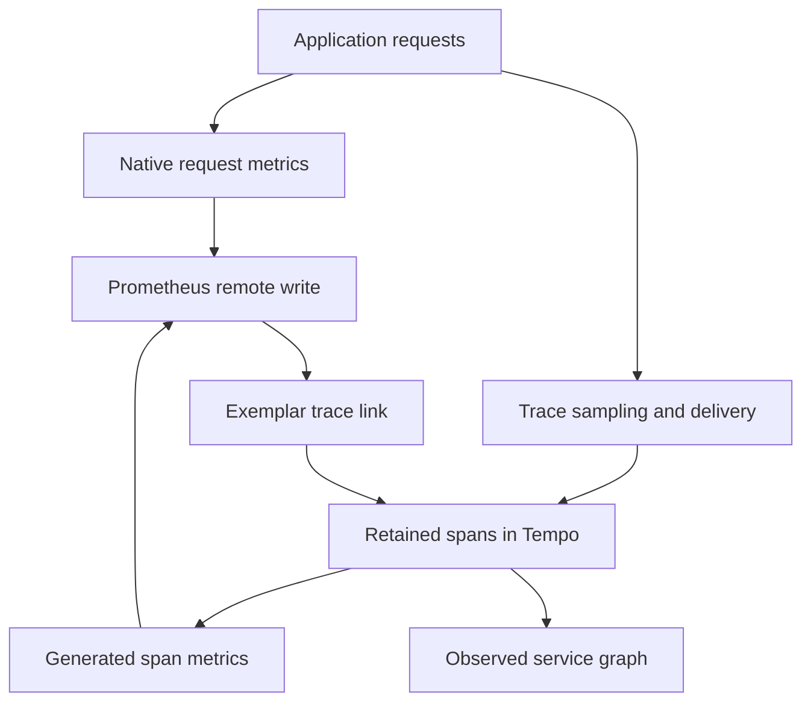

# Lab 41: Tempo Span Metrics, Service Graphs, and Exemplars

## 1. Purpose and Learning Outcomes

**In Plain Language:** You will generate diagnostic metrics and service relationships from retained traces. Compare a fully retained workload with the sampled view to see how selection changes the metric population. Then follow an exemplar to one trace, keeping that representative example separate from the complete native request measurements used by the service SLI.

> **Primary Objective:** Generate metrics from retained spans, inspect service relationships, and follow a metric exemplar to its trace without confusing sampled telemetry with the service SLI.

Labs 38–40 established that a trace can be dropped at several boundaries. This lab puts that lesson to work: Tempo generates a second, explicitly named family of diagnostic metrics from the spans it actually receives. FastAPI's native metrics remain the source for request totals, latency SLIs and error rates.

You will extend the existing single-node Tempo deployment, enable Prometheus remote-write reception, compare full-trace and tail-sampled workloads, and configure Grafana service graphs and exemplars. No second application metric exporter, Kafka cluster or additional Collector is introduced.

## 2. Starting Point and Lab Map

Use this guide inside the complete application repository. Run commands from the repository root in Bash unless a step says otherwise. Work through the starting checks in order; they load the helpers and state this lab needs.

Read the explanation before each step, run one complete code block at a time, and compare the actual result with the stated expectation. Save commands, observations, explanations, and unexpected results in your notebook.

### Key Terms

| **Term**      | **Plain-Language Meaning**                                                                 |
| ------------- | ------------------------------------------------------------------------------------------ |
| Span metric   | A metric calculated from spans that reached the trace-processing stage.                    |
| Service graph | An aggregate view of observed relationships between services.                              |
| Exemplar      | A representative observation associated with a metric, carrying a link such as a trace ID. |

### Lab Map

The arrows show the flow or dependency being studied. Branches identify paths to compare; this is a conceptual map, not a captured runtime trace.



## 3. Guided Walkthrough

### Step 01. Inherited State and Starting Checks

**What You Are Doing:** Verify recovery from queue experiments before generating metrics from traces. Loss or sampling upstream can change the population the generator observes.

**Practical Walkthrough:** Confirm the queue and memory experiments have fully recovered before enabling metrics derived from traces. The generator sees only spans that reach its boundary, so earlier loss or selection changes its population. Keep native request metrics available as the independent application observer.

Confirm prior queues and memory faults are cleared before enabling the generator. Its input consists of spans actually received after sampling and delivery. Keep native app metrics as an independent observer so changes in trace-derived population can be distinguished from changes in request traffic.

Complete [Lab 40](Lab-40.md), including its recovery checks. Run from the repository root in one Bash session. Preserve credentials, named volumes and earlier evidence.

```bash
source lab-notes/session.sh
source lab-notes/evidence.sh
source lab-notes/metrics-session.sh
source lab-notes/platform-session.sh
source lab-notes/traces-session.sh
load_app_settings
start_lab 41
dp config --quiet
dp ps -a
wait_ready
wait_backend tempo:3200 /ready
wait_backend otel-collector:13133 /
wait_backend lab-downstream:8001 /health/live
dp exec -T app python - <<'CHECK'
from app.config import Settings
assert Settings().trace_sample_ratio == 1.0
CHECK
```

`dp` is the stage-aware Compose helper. Continue using it: plain `docker compose up` would omit the learning overlays. `start_lab` creates a fresh evidence directory in `LAB_DIR`. The host tools are Bash, Python 3, curl, jq and the existing PyYAML environment at `lab-notes/.tools/bin/python`.

The inherited platform has thirteen running services and nine scrape jobs. Pyroscope is still disabled. Tempo 3.0.3 runs with `target: all`; Prometheus is 3.14.0, Grafana 13.2.2, and the Collector contrib distribution is 0.160.0. Keep the repository's pins. Tempo's monolithic mode supports its metrics generator directly; the Kafka requirements of other Tempo 3 deployment modes do not apply here.

Check that Lab 40's tiny queue and memory-fault settings were restored. Stop other learning load generators so the experiment's numerator and denominator refer to the same workload.

**Understanding the Result:** Generated metrics inherit upstream evidence limits. They do not automatically represent every request the app handled.

### Step 02. Learning Objectives and Signal Ownership

**What You Are Doing:** Identify the producer and transport of each metric family. Native request metrics and generated span metrics describe different observation boundaries.

**Practical Walkthrough:** Identify which component produces each metric family and how it reaches Prometheus. Native metrics arrive by scraping the app; Tempo-generated span metrics use the configured remote-write route. Their names, labels, units, and observed populations must be inspected separately before comparing values.

Identify each metric's producer and transport before comparing it. Native app metrics are scraped, while generated span metrics follow the configured remote-write path. Inspect their actual labels, units, and sampled population instead of assuming matching RED concepts imply identical measurement coverage.

| **Signal**                           | **Producer and Transport**                      | **Question It Can Answer**                                 |
| ------------------------------------ | ----------------------------------------------- | ---------------------------------------------------------- |
| `application_http_requests_total`    | FastAPI → `/metrics` → Prometheus               | How many completed requests did this process observe?      |
| `traces_spanmetrics_calls_total`     | Retained spans → Tempo generator → remote write | What operations occurred in the retained trace population? |
| `traces_service_graph_request_total` | Paired client/server spans → Tempo generator    | Which instrumented services communicated?                  |
| Histogram exemplar                   | Tempo generator → Prometheus → Grafana          | Which retained trace illustrates one observation?          |

An exemplar is a trace reference attached to an observation; it is not an extra time-series label. A service graph is inferred from telemetry, not an authoritative inventory of every network dependency. Missing spans, uninstrumented components and time limits can leave missing or virtual edges.

**Prediction Checkpoint:** with full head recording and tail sampling bypassed briefly, the selected server-span count should track the known workload. After restoring error/latency/10% tail policies, the trace-derived error proportion should rise because ordinary successful traces are preferentially discarded. The native request error proportion should stay close to one third for this lab's equal normal/slow/error mix.

**Understanding the Result:** Similar RED concepts can arise from different boundaries. A shared dashboard does not make their coverage identical.

### Step 03. Back Up and Enable the Metrics Generator

**What You Are Doing:** Back up and enable the generator while retaining existing Tempo storage and receivers. Keep its output dimensions bounded and make its remote-write destination explicit.

**Practical Walkthrough:** Back up Tempo's configuration and add the generator while preserving storage and receivers. Keep output dimensions bounded and verify the remote-write destination accepts the intended data. Individual trace IDs should support exemplars or lookup, not become an unbounded metric label dimension.

Preserve Tempo receivers and storage while adding the generator, and verify the remote-write receiving path. Keep output dimensions bounded. A trace ID can support exemplar navigation without becoming a metric label that creates a new series for every observed operation.

```bash
cp lab-notes/tracing/tempo.yml "$LAB_DIR/tempo.before.yml"
cp lab-notes/tracing/collector.yml "$LAB_DIR/collector.before.yml"
cp lab-notes/compose.metrics.yaml "$LAB_DIR/compose.metrics.before.yaml"
cp -a config/grafana/learning/provisioning/datasources "$LAB_DIR/datasources.before"
```

The following editor preserves existing Tempo receivers, storage, retention flags and datasource UIDs. The generator writes its own WAL under the existing Tempo volume. Classic histogram buckets match the PromQL below; the series cap keeps a small VM from silently accepting unbounded cardinality. No request, item, trace or span ID becomes a metric dimension.

```bash
cat > lab-notes/tracing/configure_span_metrics.py <<'PYTHON'
"""Enable Tempo's own metrics generator; leave FastAPI's native metric pipeline intact."""
from pathlib import Path
import yaml

path=Path('lab-notes/tracing/tempo.yml')
config=yaml.safe_load(path.read_text())
assert config['target']=='all'
config['metrics_generator']={
    'registry': {'collection_interval':'5s','external_labels':{'source':'tempo'}},
    'processor': {
        'service_graphs': {'wait':'15s','max_items':1000,'workers':2},
        'span_metrics': {'histogram_buckets':[0.005,0.01,0.025,0.05,0.1,0.2,0.3,0.5,1,2.5,5],
                         'enable_target_info':False}},
    'storage': {'path':'/var/tempo/generator/wal','remote_write':[
        {'url':'http://prometheus:9090/api/v1/write','send_exemplars':True}]},
    'metrics_ingestion_time_range_slack':'2m'}
config.setdefault('overrides',{}).setdefault('defaults',{}).setdefault('metrics_generator',{}).update({
    'processors':['service-graphs','span-metrics'],
    'max_active_series':10000,'generate_native_histograms':'classic'})
path.write_text(yaml.safe_dump(config,sort_keys=False))
path=Path('lab-notes/compose.metrics.yaml');config=yaml.safe_load(path.read_text())
command=config['services']['prometheus']['command']
for flag in ['--web.enable-remote-write-receiver','--enable-feature=exemplar-storage']:
    if flag not in command: command.append(flag)
path.write_text(yaml.safe_dump(config,sort_keys=False))
# Find the existing datasources rather than assuming a provisioned filename.
entries=[]
for path in Path('config/grafana/learning/provisioning/datasources').glob('*.y*ml'):
    document=yaml.safe_load(path.read_text())
    for ds in document.get('datasources',[]): entries.append((path,document,ds))
prom=[e for e in entries if e[2]['type']=='prometheus']
tempo=[e for e in entries if e[2].get('uid')=='tempo']
assert len(prom)==len(tempo)==1,'Expected one existing Prometheus datasource and the Tempo UID'
prom_uid=prom[0][2]['uid']
for path,document,ds in entries:
    changed=False
    if ds['type']=='prometheus':
        ds.setdefault('jsonData',{})['exemplarTraceIdDestinations']=[{'name':'traceID','datasourceUid':'tempo'}]
        changed=True
    if ds.get('uid')=='tempo':
        ds.setdefault('jsonData',{}).update({'serviceMap':{'datasourceUid':prom_uid},'nodeGraph':{'enabled':True}})
        changed=True
    if changed: path.write_text(yaml.safe_dump(document,sort_keys=False))
print('Tempo metrics -> Prometheus remote write; existing datasource UIDs preserved')
PYTHON
```

**Command Note:** `<<'PYTHON'` writes the following block literally until `PYTHON`. Quoting the delimiter prevents Bash from expanding `$variables` inside the generated file; creation and execution are separate steps.

```bash
lab-notes/.tools/bin/python lab-notes/tracing/configure_span_metrics.py
dp config --quiet
dp up -d --no-deps --force-recreate prometheus
wait_prometheus
dp up -d --no-deps --force-recreate tempo grafana
wait_backend tempo:3200 /ready
wait_grafana
dp logs --since 2m --tail 100 tempo prometheus
```

Prometheus now accepts internal remote writes at `/api/v1/write`, and exemplar storage is enabled explicitly. This endpoint shares Prometheus's HTTP listener: retain the existing loopback-only host binding and do not expose it to untrusted clients.

Expect ready services without unknown-field or remote-write errors. Nine scrape jobs remain nine: Tempo-generated samples arrive by remote write, not by a new scrape job. Do not also configure a Collector span-metrics connector. `source="tempo"` distinguishes the generated samples; `service` is the generated metric label, whereas `service.name` is an OTel resource attribute.

**Understanding the Result:** Successful generator startup is only the first check. Confirm actual generated families arrive in Prometheus.

### Step 04. Measure One Fully Retained Workload

**What You Are Doing:** Temporarily bypass tail selection for one controlled workload and restore it afterward. Full retention provides a comparison population for interpreting the later selected view.

**Practical Walkthrough:** Temporarily bypass tail selection for the prescribed sixty-trace workload, then restore it through the supplied recovery path. Full retention supplies a comparison population whose generated measurements are easier to interpret. Record exact experiment times so later range queries can separate it from selected traffic.

Keep the temporary full-retention change inside the supplied restoration wrapper and save exact workload times. Audit the sixty-trace population before comparing generated metrics. Restore the approved sampling policy afterward so later selected traffic remains distinguishable from this controlled full-input phase.

Use a short, reversible tail-sampler bypass. The SDK still samples at 1.0. This establishes a denominator for interpreting the later biased view. The trap restores the complete saved Collector configuration on normal exit or interruption; it never deletes the logs pipeline or persistent queue settings.

```bash
(
  set -euo pipefail
  restore_tail() {
    cp "$LAB_DIR/collector.before.yml" lab-notes/tracing/collector.yml
    dp up -d --no-deps --force-recreate otel-collector
  }
  trap restore_tail EXIT
  trap 'exit 130' INT
  trap 'exit 143' TERM
  lab-notes/.tools/bin/python - <<'PYTHON'
from pathlib import Path
import yaml
p=Path('lab-notes/tracing/collector.yml'); c=yaml.safe_load(p.read_text())
a=c['service']['pipelines']['traces']['processors']
assert 'tail_sampling' in a
c['service']['pipelines']['traces']['processors']=[v for v in a if v!='tail_sampling']
p.write_text(yaml.safe_dump(c,sort_keys=False))
PYTHON
  dp run --rm -T --no-deps otel-collector validate --config=/etc/otelcol-contrib/config.yaml
  dp up -d --no-deps --force-recreate otel-collector
  wait_backend otel-collector:13133 /
  api -fsS "$APP_URL/metrics" > "$LAB_DIR/full.before.prom"
  python3 lab-notes/tracing/scenario_load.py "$APP_URL" "$LAB_DIR/full.jsonl" --count 60
  api -fsS "$APP_URL/metrics" > "$LAB_DIR/full.after.prom"
  LEDGER_JSON=$(cat "$LAB_DIR/full.jsonl")
  dp exec -T app python - "$LEDGER_JSON" --wait 35 --require-all \
    < lab-notes/tracing/retention_audit.py > "$LAB_DIR/full-audit.json"
  sleep 10
  pq 'traces_spanmetrics_calls_total{source="tempo"}' > "$LAB_DIR/full-span-counters.json"
  pq 'traces_service_graph_request_total{source="tempo"}' > "$LAB_DIR/full-edges.json"
)
wait_backend otel-collector:13133 /
jq '{requested,head_sampled,complete}' "$LAB_DIR/full-audit.json"
jq '.data.result[] | {metric,value}' "$LAB_DIR/full-span-counters.json"
jq '.data.result[] | {metric,value}' "$LAB_DIR/full-edges.json"
```

**Command Note:** `trap ... EXIT` schedules cleanup when that shell exits. Keep it in the same block as the fault; the explicit recovery checks afterward confirm that restoration actually succeeded.

Expect sixty complete traces: twenty normal, twenty slow and twenty error scenarios. Each trace contains multiple spans, so summing **all** span-metric series does not equal sixty requests. Find the `SPAN_KIND_SERVER` series for your app and the `/api/v1/demo/downstream` operation, and compare that series population with the sixty-row ledger. Generated counters can contain earlier traffic; use before/after deltas or an isolated time interval when claiming exact counts.

The graph should contain the application → `lab-downstream` relationship. Inspect the actual `client` and `server` label values before applying filters. SQL and Redis instrumentation can produce additional inferred dependency nodes. Their presence does not mean those servers are exporting spans.

If the audit succeeds but generated series are initially empty, poll the same queries for up to sixty seconds. Trace availability, generator collection and remote-write visibility have separate delays. A HTTP 200 query with an empty result is not successful proof of metric delivery.

**Understanding the Result:** The temporary change is scoped to the comparison. Restore the approved sampling policy before the next workload.

### Step 05. Query RED Metrics and Reveal Sampling Bias

**What You Are Doing:** Query the actual generated metric names and compare retained populations. Windowed values can blend both experiments, so preserve their precise timing before attributing a difference to sampling.

**Practical Walkthrough:** Query the actual generated names and inspect units, including the latency family whose name alone does not state seconds. Compare fully retained and sampled populations over their recorded intervals. A moving rate window can blend both phases and obscure the sampling effect.

Read the actual metric metadata and units before configuring panels, especially latency. Compare full and sampled phases using their saved intervals. A moving five-minute query can contain both populations, so avoid attributing its blended result entirely to whichever sampling policy is active now.

```promql
sum by (service) (rate(traces_spanmetrics_calls_total{source="tempo",span_kind="SPAN_KIND_SERVER"}[5m]))
```

```promql
sum by (service) (rate(traces_spanmetrics_calls_total{source="tempo",span_kind="SPAN_KIND_SERVER",status_code="STATUS_CODE_ERROR"}[5m]))
/
sum by (service) (rate(traces_spanmetrics_calls_total{source="tempo",span_kind="SPAN_KIND_SERVER"}[5m]))
```

```promql
histogram_quantile(0.95,
  sum by (le,service) (rate(traces_spanmetrics_latency_bucket{source="tempo",span_kind="SPAN_KIND_SERVER"}[5m]))
)
```

The latency histogram is named `traces_spanmetrics_latency_bucket`, without an added `_seconds` suffix. The configured bucket boundaries are seconds. Restrict `span_name` as well when investigating one operation; discover its exact value in the saved result rather than guessing it from a raw URL. Five-minute rates blend traffic from both experiments, so use separate absolute time windows for a visual comparison.

```bash
api -fsS "$APP_URL/metrics" > "$LAB_DIR/tail.before.prom"
python3 lab-notes/tracing/scenario_load.py "$APP_URL" "$LAB_DIR/tail.jsonl" --count 60
api -fsS "$APP_URL/metrics" > "$LAB_DIR/tail.after.prom"
LEDGER_JSON=$(cat "$LAB_DIR/tail.jsonl")
dp exec -T app python - "$LEDGER_JSON" --wait 35 \
  < lab-notes/tracing/retention_audit.py > "$LAB_DIR/tail-audit.json"
sleep 10
pq 'traces_spanmetrics_calls_total{source="tempo"}' > "$LAB_DIR/tail-span-counters.json"
jq '{requested,head_sampled,complete}' "$LAB_DIR/tail-audit.json"
```

Expect all error and slow traces plus a probabilistic subset of normal traces, subject to delivery success. Do not demand an exact 10% count from twenty normal requests. Compare counter deltas between the two saved generator snapshots after allowing both runs to settle. The retained population overrepresents errors and slower requests: its latency distribution and error proportion are diagnostic, not unbiased service measurements.

For a future SLI, retain the application metrics and their complete request denominator. Multiplying tail-sampled counts by ten cannot repair outcome-dependent selection. Moving generation before sampling is an alternative architecture with different costs; it is not implemented in this lab.

**Understanding the Result:** Trace-derived RED can be biased by retention policy. Preserve native application SLIs as the independently defined request population.

### Step 06. Use a Service Graph and an Exemplar

**What You Are Doing:** Inspect the observed service edge and follow an exemplar to its trace. A representative trace adds detail without proving that every request or relationship was retained.

**Practical Walkthrough:** Inspect the generated service relationship and follow an available exemplar to its stored trace. Check that the trace illustrates the selected metric context and actual observed edge. An exemplar adds one concrete example; it does not prove all requests or service relationships were retained.

Choose the observed edge and identify its client and server services before opening a related trace. For an exemplar, compare the linked trace ID with the selected metric context, then inspect the corresponding operation and time. If navigation fails, try direct lookup of that ID to separate an unavailable retained trace from a data-source or link configuration problem.

In Grafana Explore, select **Tempo** and open its service graph view. The configured `serviceMap.datasourceUid` points to the existing Prometheus datasource. Inspect the app/downstream edge, then inspect a trace from the known error ledger. The graph displays generated relationships; it does not replace the waterfall's causal ordering.

Switch Explore to **Prometheus**. Query the latency buckets for the discovered service/operation, use an absolute interval covering the experiment, enable exemplars in the query options and click an exemplar marker. The derived destination uses the case-sensitive exemplar label `traceID` and the existing `tempo` UID.

Verify the same observation through Prometheus's API:

```bash
EXEMPLAR_START=$(python3 - "$LAB_DIR/full.jsonl" <<'PYTHON'
import json,sys
with open(sys.argv[1]) as f: print(int(json.loads(next(f))['start_ns']/1e9)-5)
PYTHON
)
EXEMPLAR_END=$(date +%s)
curl -fsS --connect-timeout 2 --max-time 15 -G \
  "$PROM_URL/api/v1/query_exemplars" \
  --data-urlencode 'query=traces_spanmetrics_latency_bucket{source="tempo"}' \
  --data-urlencode "start=$EXEMPLAR_START" --data-urlencode "end=$EXEMPLAR_END" \
  > "$LAB_DIR/exemplars.json"
jq -e '.status=="success" and (.data|length)>0' "$LAB_DIR/exemplars.json"
EXEMPLAR_TRACE=$(jq -r '[.data[].exemplars[].labels.traceID // empty][0] // empty' "$LAB_DIR/exemplars.json")
test -n "$EXEMPLAR_TRACE"
fetch_trace "$EXEMPLAR_TRACE" "$LAB_DIR/exemplar-trace.json"
```

The pass condition is a retrievable trace, not merely a clickable marker. Exemplars are sparse representatives; they do not promise one link per request or that the selected trace is exactly the calculated p95 request. A quantile is a histogram estimate over a population.

**Understanding the Result:** Use the example to investigate detail while retaining aggregate scope. Missing exemplars do not automatically mean missing metric samples.

## 4. Troubleshooting and Diagnosis

Start with the first unexpected result. Record the exact symptom, identify which component produced it, and use the checks below before repeating the experiment. After a fix, repeat the original check and confirm recovery.

### Troubleshooting and Safe Recovery

| **Observation**                           | **Check and Correction**                                                                                              |
| ----------------------------------------- | --------------------------------------------------------------------------------------------------------------------- |
| Remote write returns 404                  | Recreate Prometheus with the modified Compose command; a config reload alone cannot change startup flags.             |
| No generated metrics                      | Check enabled processors in `overrides.defaults.metrics_generator`, Tempo logs, WAL permissions and receiver URL.     |
| Metrics exist, graph absent               | Check Tempo datasource UID mapping, edge metric labels and client/server span pairing.                                |
| Exemplar query empty                      | Check feature flag, `send_exemplars`, selected interval and actual generated histogram samples.                       |
| Exemplar exists but trace absent          | Separate trace retention/ingestion loss from exemplar retention; query the exact ID and inspect Collector/Tempo logs. |
| Error ratio disagrees with native metrics | First test sampling, span-kind/operation filters, and interval overlap. Do not assume FastAPI counters are wrong.     |
| Tempo fails after editing                 | Restore the saved Tempo file and recreate only Tempo; do not remove its volume.                                       |

To completely undo this lab's infrastructure changes, restore the three saved configuration files, replace the datasource directory with its saved copy, and recreate Prometheus, Tempo, Collector and Grafana using `dp`. Normal completion keeps the generator and datasource links enabled; only the temporary tail bypass is removed.

```bash
lab-notes/.tools/bin/python - <<'CHECK'
import yaml
c=yaml.safe_load(open('lab-notes/tracing/collector.yml'))
assert 'tail_sampling' in c['service']['pipelines']['traces']['processors']
CHECK
wait_ready
wait_backend tempo:3200 /ready
wait_backend otel-collector:13133 /
dp ps -a
```

Technical references: [Tempo metrics generator](https://grafana.com/docs/tempo/latest/metrics-from-traces/metrics-generator/), [span metrics](https://grafana.com/docs/tempo/latest/metrics-from-traces/span-metrics/), [Tempo configuration](https://grafana.com/docs/tempo/latest/configuration/), and [Prometheus feature flags](https://prometheus.io/docs/prometheus/latest/feature_flags/). Check the repository's pinned-version behavior when comparing newer documentation.

## 5. Review and Practice

Answer the knowledge questions in your own words before reading the answer guide. For the scenario, name the evidence you would collect and the conclusion each observation would support.

### Knowledge Check

1. Why are native request metrics still needed?
2. Why is summing all span calls an invalid request count?
3. Can an exemplar be treated as the p95 request?
4. Does a missing service-graph node prove there is no dependency?

#### Answer Guide

1. They retain a request denominator independent of trace sampling and transport loss.
2. A request creates server, client and internal spans; select the relevant service, operation and span kind.
3. No. It is a representative observation, while p95 is estimated from a distribution.
4. No. Instrumentation, sampling, matching windows and telemetry loss determine graph visibility.

### Professional Scenario Exercise

A teammate proposes paging on a 45% error ratio from Tempo while the native route metric reports 33%. Use the ledgers, retained trace classes, counter deltas and matching intervals to decide whether the service changed or the observation population changed. State which signal should own the alert.

## 6. Completion Checklist

Mark each item only after you can point to its result or evidence file. Complete any cleanup shown here before moving on.

### Observable Completion Criteria

- [ ] The generator writes real span/edge metrics to Prometheus without duplicating FastAPI metrics.
- [ ] Full and sampled request ledgers, retention audits and counter observations are saved.
- [ ] The service graph contains a verified app/downstream edge.
- [ ] An actual exemplar ID resolves to a Tempo trace.
- [ ] Tail sampling is restored and all required services are ready.

## 7. Production Context and Next Lab

### Production Implications

Generated metrics add series, WAL writes and remote-write load. Bound dimensions and capacity, monitor delivery, and protect the receiver. Sampling policy becomes part of the metric definition. Service graphs and exemplars accelerate investigation; they do not establish topology completeness or HA. Production decisions require measured volume, retention, authentication and failure budgets.

### End State and Transition

Tempo generation, service graph configuration and exemplar navigation remain enabled. The original tail policies are active, native metrics remain authoritative, and profiling is still off. Continue to [Lab 42](Lab-42.md) to enable the existing Python profiler and inspect real sampled stacks.
