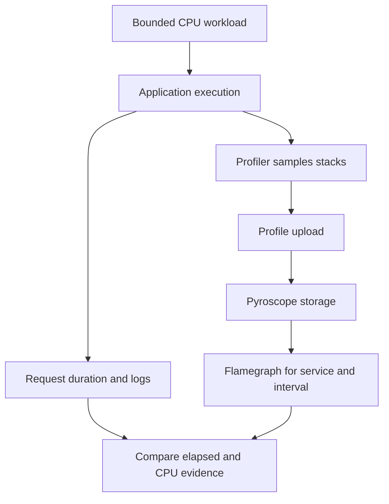

# Lab 42: Pyroscope Continuous Profiling Fundamentals

## 1. Purpose and Learning Outcomes

You will enable continuous CPU profiling and retrieve the sampled call stacks for a known workload. Profiles help show which code used CPU during a time interval, adding detail to request timings and traces. Use the correct service identity, time range, and units when reading the flamegraph so its width is not mistaken for a request timeline.

> **Primary Objective:** Enable the supported Python profiler already in the repository, prove that CPU samples reach Pyroscope, and interpret those stacks alongside request telemetry.

Activate the profiling path that earlier labs kept disabled. Reuse the existing lifespan integration and pinned `pyroscope-io` client, add the Grafana data source, run limited CPU work, and retrieve stored profiles through both the API and interface.

A profile statistically samples execution stacks. It is not a chronological log, trace waterfall, or count of business events. Keep those differences clear before moving to profile comparisons and span-specific profiling.

## 2. Starting Point and Lab Map

Open the complete application repository before using this guide. Unless a step says otherwise, run commands in Bash from the repository's top-level folder. Follow the starting checks in order because later commands depend on the helper functions and running services they prepare.

Read each explanation before running its commands. Run one complete code block, check the result, and then continue. In your notebook, save the commands, what happened, why you think it happened, and anything that differed from the expected result.

### Key Terms

| **Term**     | **Explanation**                                                                        |
| ------------ | -------------------------------------------------------------------------------------- |
| CPU profile  | Sampled call stacks showing where CPU execution was observed during an interval.       |
| Flamegraph   | A combined view of stacks, where frame width represents the selected sample weight.    |
| Profile type | The kind of measurement and its units, which determine what the displayed values mean. |

### Lab Map

The arrows show how the parts connect and where a request can take different paths. Use this map to understand the design. It is not a recording of a request that actually ran.



## 3. Guided Walkthrough

### Step 01. Inherited State and Starting Checks

**What You Are Doing:** Check the working trace setup and preserve existing service state. Enable the profiling backend already defined in the repository at this stage of the course.

**Practical Walkthrough:** Verify tracing recovery and start Pyroscope through the cumulative helper. Keep volumes and signal settings intact. The stage grows to fourteen services while keeping nine scrape jobs, so check these inventories separately.

Check existing signal health, then use the current helper to add the backend. A new running service does not automatically mean another scrape job exists. Verify each count against the intended stage rather than assuming they rise together.

```bash
source lab-notes/session.sh
source lab-notes/evidence.sh
source lab-notes/metrics-session.sh
source lab-notes/platform-session.sh
source lab-notes/traces-session.sh
load_app_settings
start_lab 42
dp config --quiet
wait_ready
wait_backend tempo:3200 /ready
wait_backend otel-collector:13133 /
mkdir -p lab-notes/profiling
cp lab-notes/platform-session.sh "$LAB_DIR/platform-session.before.sh"
cp lab-notes/backend_api.py "$LAB_DIR/backend_api.before.py"
dp exec -T app python - <<'CHECK'
from importlib.metadata import version
from app.config import Settings
print('pyroscope-io:', version('pyroscope-io'))
s=Settings()
assert s.demo_enabled and s.otel_enabled
assert not s.pyroscope_enabled, 'Expected the completed pre-profiling stage'
CHECK
```

Complete [Lab 41](Lab-41.md) first. The thirteen services, nine scrape jobs, and four dashboards remain. Starting the defined Pyroscope service gives fourteen running services without adding a scrape job. If repeating a completed Lab 42, treat `pyroscope_enabled=true` as the existing state rather than resetting the environment.

Keep `pyroscope-io==1.2.3`, Pyroscope 2.3.1, and Grafana 13.2.2, using the repository's image and dependency lock. The Python client contains native code. Building the provided Linux image gives a more repeatable environment than installing an arbitrary profiler package into host Python.

Use one Uvicorn worker. Multiple workers require separate lifecycle and profiling choices for each process. Avoid development reload mode because it creates another process and can initialize profiling more than once.

**Understanding the Result:** A running backend proves service availability, not application profile ingestion. You still need to retrieve samples produced by the intended workload.

### Step 02. Learning Objectives and the Sampling Model

**What You Are Doing:** Compare the questions answered by durations, logs, traces, and CPU stacks. Profiling samples execution rather than recording every instruction or request.

**Practical Walkthrough:** Compare elapsed request time with sampled CPU activity. Logs record occurrences, traces describe timed operations, and profiles combine sampled execution stacks. Waiting can make a request slow without producing a large amount of CPU sample weight.

Keep elapsed duration separate from CPU weight. Use traces to locate operation boundaries and profiles to identify sampled execution locations. A long wait can appear prominently in timing while contributing little CPU work.

| **Observation**         | **Meaning**                                                   | **What It Does Not Establish**                            |
| ----------------------- | ------------------------------------------------------------- | --------------------------------------------------------- |
| HTTP duration histogram | Summarizes elapsed request durations                          | Does not identify which Python functions used CPU         |
| JSON completion event   | Records one occurrence with its context                       | Is not a continuous execution sample                      |
| Span and span event     | Describe an operation interval and selected moments within it | Do not record every stack executed during the interval    |
| CPU profile             | Combines sampled stacks using the profile's declared unit     | Does not capture every request or all waiting off the CPU |

The integration already calls `pyroscope.configure(application_name=..., server_address=..., sample_rate=100, oncpu=True, gil_only=True, tags={"environment": ...})` with supported arguments. `application_name` provides the service identity in Pyroscope. The environment tag has a limited set of values.

`oncpu=True` targets CPU execution. `gil_only=True` focuses on threads holding Python's GIL, so native work done after releasing the GIL may be omitted. A nominal 100 Hz rate means roughly one observation every 10 ms, not a guaranteed sample of each 10 ms operation. Short functions may be missed. Check the stored profile's unit to distinguish sample counts from estimated CPU time.

**Prediction Checkpoint:** The CPU demo should make its calculation stack visible. An idle process may produce sparse samples and still be healthy. Profiling does not make application readiness depend on Pyroscope.

**Understanding the Result:** Profiles provide sampled evidence. They are neither instruction-by-instruction recordings nor guaranteed records of every request.

### Step 03. Enable the Existing SDK Lifecycle and Internal Backend

**What You Are Doing:** Enable the existing profiler startup and shutdown path. Keep one initialization owner and preserve the distinction between telemetry-backend health and business readiness.

**Practical Walkthrough:** Use the repository's current lifespan integration instead of adding another configure call. Check startup and shutdown handling together. Evaluate profile delivery separately from the application's required database-backed functionality.

Enable the documented lifecycle owner and verify both initialization and cleanup. Avoid duplicate profilers. Then prove backend delivery independently: Pyroscope is a telemetry destination, not the required Items persistence store.

The profiler already starts during application lifespan and stops through `pyroscope.shutdown()`. Initialization failures are caught and logged. Reuse this implementation; another `configure()` call or exporter would create competing ownership.

The overlay enables profiling at this stage and removes the baseline Pyroscope host-port publication. Grafana and the internal helper supply the required access. The repository's required Compose version supports the `!override` tag used for that change.

```bash
cat > lab-notes/compose.profiles.yaml <<'YAML'
services:
  app:
    environment:
      PYROSCOPE_ENABLED: "true"
      PYROSCOPE_SERVER_ADDRESS: http://pyroscope:4040
      PYROSCOPE_SAMPLE_RATE: "100"
  pyroscope:
    ports: !override []
YAML
```

**Command Note:** `<<'YAML'` writes the block exactly as shown until the closing `YAML`. The quotes stop Bash from expanding `$variables` in the file. Writing the configuration and applying it are separate steps.

```bash
cat > lab-notes/profiling/configure_profiles.py <<'PYTHON'
"""Extend the stage helper and expose only an internal Pyroscope backend."""
from pathlib import Path
import yaml

path=Path('lab-notes/platform-session.sh');text=path.read_text()
old='auto-tracing downstream;'
new='auto-tracing downstream profiles;'
if new not in text:
    assert text.count(old)==1,'Expected Lab 31 stage-helper loop'
    path.write_text(text.replace(old,new))
path=Path('lab-notes/backend_api.py');text=path.read_text()
if "'pyroscope:4040'" not in text:
    anchor="'lab-downstream:8001'"
    assert text.count(anchor)==1
    path.write_text(text.replace(anchor,anchor+", 'pyroscope:4040'"))
path=Path('config/grafana/learning/provisioning/datasources/pyroscope.yml')
path.write_text(yaml.safe_dump({'apiVersion':1,'datasources':[{
    'name':'Pyroscope','uid':'pyroscope','type':'grafana-pyroscope-datasource',
    'access':'proxy','url':'http://pyroscope:4040','editable':False}]},sort_keys=False))
PYTHON
```

```bash
lab-notes/.tools/bin/python lab-notes/profiling/configure_profiles.py
source lab-notes/platform-session.sh
source lab-notes/traces-session.sh
dp config --quiet
dp up -d pyroscope
wait_backend pyroscope:4040 /ready
dp up -d --no-deps --force-recreate app grafana
wait_ready
wait_grafana
dp exec -T app python - <<'CHECK'
from app.config import Settings
s=Settings()
assert s.pyroscope_enabled
assert s.pyroscope_server_address == 'http://pyroscope:4040'
assert s.pyroscope_sample_rate == 100
CHECK
dp logs --since 3m --tail 120 app pyroscope
```

Expect a `profiling_started` record and a ready Pyroscope service. The record proves local initialization, not storage of every upload. The following steps check actual delivery.

Keep the repository's single-node `target: all` Pyroscope, filesystem storage, named volume, and retention setting. Preserve `/data`, non-root execution, resource limits, and readiness checks. HTTP uploads are asynchronous, so a later backend outage need not crash FastAPI. A native-library crash would still be a real process failure; Python exception handling cannot guarantee prevention of that failure.

**Understanding the Result:** One lifecycle prevents duplicate profiler setup. Profile uploads use their configured direct path, separate from the Collector's trace pipeline.

### Step 04. Install a Bounded Query Helper

**What You Are Doing:** Add a limited internal query helper and use the API's millisecond timestamps. Mixing seconds, milliseconds, and nanoseconds selects the wrong interval.

**Practical Walkthrough:** Keep the helper's time convention explicit and convert timestamps deliberately. Include service identity, profile type, and start/end bounds in each query. This makes empty results easier to diagnose without searching unrelated history.

Check millisecond bounds, the selected service, and the available profile type before interpreting an empty response. A query with wrong units or the wrong type cannot prove there was no sampled CPU work.

The helper calls the real Pyroscope Connect JSON query API from inside the application container. It does not expose an administrative endpoint or install curl in the image. This API uses Unix **milliseconds**, while Loki uses nanoseconds and Prometheus uses seconds.

```bash
cat > lab-notes/profiling/profile_api.py <<'PYTHON'
"""Bounded JSON requests to the real Pyroscope query API; run inside app."""
import argparse
import json
import sys
from urllib.error import HTTPError
from urllib.request import ProxyHandler, Request, build_opener

parser=argparse.ArgumentParser()
parser.add_argument('method',choices=['ProfileTypes','LabelValues','Series','SelectMergeStacktraces','Diff'])
parser.add_argument('body_json')
args=parser.parse_args()
body=json.loads(args.body_json)
request=Request('http://pyroscope:4040/querier.v1.QuerierService/'+args.method,
    data=json.dumps(body).encode(),headers={'Content-Type':'application/json'},method='POST')
try:
    with build_opener(ProxyHandler({})).open(request,timeout=20) as response:
        document=json.load(response)
except HTTPError as error:
    print('Pyroscope query failed: HTTP '+str(error.code),file=sys.stderr)
    raise SystemExit(1)
print(json.dumps(document,indent=2))
PYTHON
```

```bash
cat > lab-notes/profiling/session.sh <<'BASH'
pquery() {
  dp exec -T app python - "$1" "$2" < "$LAB_ROOT/lab-notes/profiling/profile_api.py"
}
profile_window() {
  python3 - <<'PYTHON'
import time
print(int(time.time()*1000))
PYTHON
}
BASH
source lab-notes/profiling/session.sh
```

Keep the helper for Labs 43–45. It restricts access to the query methods used here and a fixed internal server. HTTP success with no results is not proof that the intended application's samples arrived.

**Understanding the Result:** Confusing seconds with milliseconds shifts the query by a factor of a thousand. Verify units before deciding that an upload is missing.

### Step 05. Generate and Retrieve Real CPU Profiles

**What You Are Doing:** Run the capped CPU workload and retrieve its real profile type and samples. Aim for identifiable nonzero evidence, not maximum load.

**Practical Walkthrough:** Send the eighty sequential requests as directed, allow upload time, and query the available profile types. Look for nonzero samples from this app. Do not keep increasing load simply to produce a denser flamegraph.

Run the finite workload once and save its interval. Discover the actual profile type before selecting it, then verify service-specific samples. If evidence is sparse, check identity and timing before considering any change to the prescribed workload.

```bash
PROFILE_START=$(profile_window)
for ((i=1; i<=80; i++)); do
  api -fsS "$APP_URL/api/v1/demo/work?iterations=1000000&delay_ms=0" \
    -H "X-Request-ID: profile-baseline-$i" > "$LAB_DIR/work-$i.json"
  sleep 0.2
done
sleep 15
PROFILE_END=$(profile_window)
jq -n --argjson start "$PROFILE_START" --argjson end "$PROFILE_END" \
  '{start:$start,end:$end}' > "$LAB_DIR/window.json"
pquery ProfileTypes "$(cat "$LAB_DIR/window.json")" > "$LAB_DIR/profile-types.json"
jq . "$LAB_DIR/profile-types.json"
jq -er '[.profileTypes[]?.id | select(test(":cpu:|:samples:"))] | unique | \
  if length==1 then .[0] else error("Inspect actual CPU profile types before proceeding") end' \
  "$LAB_DIR/profile-types.json" > lab-notes/profiling/profile-type.txt
PROFILE_TYPE=$(cat lab-notes/profiling/profile-type.txt)
SELECTOR="{service_name=\"$LAB_SERVICE\",environment=\"$LAB_ENVIRONMENT\"}"
QUERY=$(jq -n --argjson start "$PROFILE_START" --argjson end "$PROFILE_END" \
  --arg selector "$SELECTOR" --arg type "$PROFILE_TYPE" \
  '{start:$start,end:$end,labelSelector:$selector,profileTypeID:$type}')
printf '%s\n' "$QUERY" > "$LAB_DIR/profile-query.json"
pquery SelectMergeStacktraces "$QUERY" > "$LAB_DIR/cpu-profile.json"
jq -e '(.flamegraph.total // 0 | tonumber)>0' "$LAB_DIR/cpu-profile.json"
jq '.flamegraph | {total,maxSelf,names}' "$LAB_DIR/cpu-profile.json"
```

**Command Note:** In `jq`, `--arg` supplies a string and `--argjson` supplies a JSON value. `-e` returns failure for a final false or null result, allowing assertions to stop the block.

The workload consists of eighty sequential requests, each with capped work and a short pause. Its demo route is available only in the local learning environment. Keep those limits instead of adding many parallel callers for a more dramatic graph.

Expect nonzero CPU samples and stack names containing the app's calculation function. Discover the exact type through `ProfileTypes`; do not borrow an ID from another SDK or language. If several CPU types exist, inspect their units and select the one produced by this service before saving its ID. An empty selection needs investigation, not an invented type.

If empty initially, repeat the same query for up to sixty seconds while keeping the original interval. Upload and visibility are asynchronous. If it stays empty, inspect startup, backend readiness, labels, and sample-producing work. Do not count an unrelated service's profile as success by widening the search to everything.

**Understanding the Result:** Brief work may yield few samples. Interpret the result using the known workload and actual profile type rather than expecting every operation to appear.

### Step 06. Read the Flamegraph in Grafana

**What You Are Doing:** Open the same profile in Grafana and inspect units and stack structure. Frame width represents combined weight, not the chronological order of requests.

**Practical Walkthrough:** Match the service, type, and interval used by the API. Read width as sample weight and vertical nesting as call structure. Horizontal placement is a layout choice rather than a timeline of execution.

Keep Grafana's selectors aligned with the saved API evidence. Use the interval and traces for timing questions. A frame's horizontal position does not show when its requests ran.

1. Open Grafana Explore, choose **Pyroscope**, and select the actual CPU profile type saved above.
2. Set `service_name` and `environment` to the configured values. Use the absolute interval in `window.json`, converting milliseconds to the interface's time format if needed.
3. Find the calculation function and its callers. Wider frames contain more selected weight. Parent width generally includes child work, so adding inclusive values across depths counts the same samples repeatedly.
4. Compare **self** work, attributed to the function itself, with **total/inclusive** work, which also includes children. This distinguishes an expensive wrapper from a wrapper calling an expensive child.
5. Save the function name, available source location, profile type and unit, interval, selectors, and displayed weight. A screenshot alone does not preserve the query needed to reproduce the result.

The graph combines stacks over the whole selected interval. Horizontal position is not time order. A wide frame may reflect one long request, many short requests, or background activity, so time overlap alone cannot assign it to a particular request.

Compare the native latency panel with the CPU profile. The histogram describes elapsed request time; the profile helps locate CPU execution within the selected population. Lab 43 adds explicit waiting, and Lab 44 verifies a span-specific profile link.

**Understanding the Result:** Read the displayed units before comparing widths. A flamegraph shows where sampled weight accumulated rather than providing a request timeline.

### Step 07. Validate Identity, Lifecycle and Health Independently

**What You Are Doing:** Verify profile identity, lifecycle, and business health separately. Backend reachability alone does not prove that this app's current workload was captured.

**Practical Walkthrough:** Check current application labels, the single profiler lifecycle, and business health. Use fresh workload samples instead of an old stored profile. Preserve the configuration and record sampling or visibility limits for later comparisons.

An old visible profile proves past storage only. Verify fresh data from the intended process and save the current settings. Check normal business readiness independently so later comparisons start from a known working state.

```bash
LABEL_QUERY=$(jq -n --argjson start "$PROFILE_START" --argjson end "$PROFILE_END" \
  '{start:$start,end:$end,name:"service_name"}')
pquery LabelValues "$LABEL_QUERY" > "$LAB_DIR/service-labels.json"
SERIES_QUERY=$(jq -n --argjson start "$PROFILE_START" --argjson end "$PROFILE_END" \
  --arg selector "$SELECTOR" '{start:$start,end:$end,matchers:[$selector]}')
pquery Series "$SERIES_QUERY" > "$LAB_DIR/profile-series.json"
jq . "$LAB_DIR/service-labels.json"
jq . "$LAB_DIR/profile-series.json"
api -fsS "$APP_URL/health/live" > "$LAB_DIR/live.json"
api -fsS "$APP_URL/health/ready" > "$LAB_DIR/ready.json"
backend pyroscope:4040 /ready > "$LAB_DIR/pyroscope-ready.txt"
dp ps -a
```

Confirm that returned labels identify this application and environment. PostgreSQL remains the required readiness dependency, with Redis allowed to degrade. Pyroscope does not become a required business dependency.

Review `app/app/telemetry.py`: it catches initialization failures, tracks successful startup, and shuts down once. Leave broad backend outages for the later platform incident lab. Here, establish successful delivery and understand the existing process-failure boundary.

**Understanding the Result:** Current samples from the correct process prove profiling is working. A reachable backend alone is insufficient.

## 4. Troubleshooting and Diagnosis

Begin with the first result that differed from your prediction. Save the exact error or symptom and identify which service or command produced it. Use the checks below, make the needed fix, and repeat the original check to confirm the problem is resolved.

### Troubleshooting and Controlled Rollback

| **Symptom**                                     | **Investigation**                                                                                                                                |
| ----------------------------------------------- | ------------------------------------------------------------------------------------------------------------------------------------------------ |
| `profiling_initialization_failed`               | Check the pinned native wheel and platform, import, configured URL, and sanitized exception details.                                             |
| `profiling_started`, no stored samples          | Check workload, upload delay, ingest logs, timestamp units, and labels. Initialization does not prove delivery.                                  |
| Profiles visible under an unexpected service    | Compare `SERVICE_NAME`, the SDK application name, and actual `service_name` labels.                                                              |
| Grafana datasource unavailable                  | Check `http://pyroscope:4040`, data-source type and UID, and backend readiness.                                                                  |
| Zero or tiny CPU weight during an idle interval | Run the bounded workload. Idle time need not contain sustained CPU execution.                                                                    |
| Samples stop at a restart                       | Inspect the new process's profiler startup and query its correct interval. Each process owns its lifecycle.                                      |
| High observed overhead                          | Check for duplicate profilers, excessive tags, or sampling changes. Measure comparable enabled/disabled runs before changing defaults.           |

To disable profiling while keeping evidence, set `PYROSCOPE_ENABLED` to `"false"` in `lab-notes/compose.profiles.yaml`, recreate only `app`, and verify readiness. Historical profiles can remain queryable. Re-enable profiling and prove fresh delivery before continuing. Keep volumes and the pinned client version.

Use the [Pyroscope Python integration](https://grafana.com/docs/pyroscope/latest/configure-client/language-sdks/python/), [Python client source](https://github.com/grafana/pyroscope-python), [Pyroscope HTTP API](https://grafana.com/docs/pyroscope/latest/reference-server-api/), and [Grafana Pyroscope datasource](https://grafana.com/docs/grafana/latest/datasources/pyroscope/) references for implementation details.

## 5. Review and Practice

Answer the questions in your own words before reading the answers. For the scenario, say what you would inspect and exactly what each result would tell you.

### Knowledge Check

1. How does a profile sample differ from a completion event?
2. Why can a short function disappear from a profile?
3. Does a wide parent frame prove its own instructions are expensive?
4. Does profiler initialization prove upload delivery?

#### Answer Guide

1. A profile sample observes an execution stack at a sampling point. A completion event records a specific occurrence and its context.
2. It may run between sampling points or contribute too little weight to remain visible in the selected view.
3. No. Inclusive width includes child functions. Compare self weight with the child stacks before blaming the parent.
4. No. Retrieve samples from the intended backend using the correct service, environment, type, and interval.

### Professional Scenario Exercise

An engineer sees a wide request-handler frame and proposes rewriting the router. Examine its callers, self and inclusive weight, profile units, and a controlled workload. Decide whether the handler itself or its calculation child is the useful target, and state which missing evidence would prevent a confident recommendation.

## 6. Completion Checklist

Tick an item only when you can show its result or saved evidence. Finish the cleanup instructions before starting the next lab.

### Observable Completion Criteria

- [ ] The existing lifespan owns one supported profiler for each application process.
- [ ] Pyroscope is ready internally and uses persistent storage.
- [ ] The helper retrieves nonzero samples for the exact service and environment.
- [ ] Grafana shows the calculation stack with its actual profile unit.
- [ ] No request or trace IDs were added as ordinary profile-series tags.
- [ ] Required business health passes, and profiling stays enabled for Lab 43.

## 7. Production Context and Next Lab

### Production Implications

Continuous profiling uses CPU, memory, and upload capacity. Measure overhead, limit labels, protect ingest and query APIs, and review function and source names for sensitive information. GIL-focused Python CPU sampling does not capture all native work or off-CPU waiting. This single-node lab demonstrates collection and analysis, not resilient production storage.

### End State and Transition

Keep fourteen services running, along with the profiler, query helper, Pyroscope data source, and discovered CPU profile type. Metrics and traces retain their established paths. [Lab 43](Lab-43.md) compares equivalent CPU-heavy, waiting-heavy, and optimized work.
