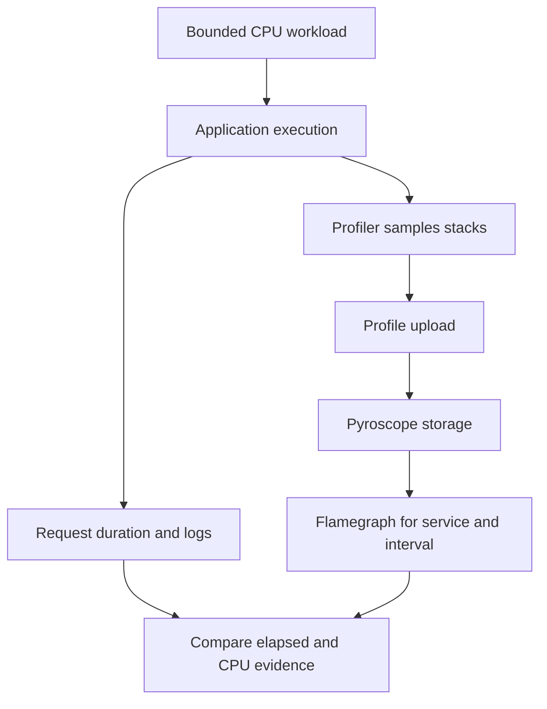

# Lab 42: Pyroscope Continuous Profiling Fundamentals

## 1. Purpose and Learning Outcomes

**In Plain Language:** You will enable continuous CPU profiling and retrieve the sampled stacks for a known workload. Profiles answer which code was observed using CPU over an interval, complementing request timings and traces. Reading a flamegraph with the correct identity, time range, and units prevents its width from being mistaken for a request timeline.

> **Primary Objective:** Enable the repository’s supported Python profiler, prove that CPU profiles reach Pyroscope, and interpret sampled call stacks alongside request telemetry.

This lab activates the profiling path that was intentionally disabled during the earlier stages. You will reuse the existing lifespan integration and pinned `pyroscope-io` client, provision Grafana's Pyroscope datasource, generate bounded CPU work, and verify stored profiles through both the query API and the UI.

A profile is a statistical view of execution stacks. It is not a chronological request log, a trace waterfall or a counter of business events. The experiment keeps those distinctions visible before introducing differential and span-specific profiling.

## 2. Starting Point and Lab Map

Use this guide inside the complete application repository. Run commands from the repository root in Bash unless a step says otherwise. Work through the starting checks in order; they load the helpers and state this lab needs.

Read the explanation before each step, run one complete code block at a time, and compare the actual result with the stated expectation. Save commands, observations, explanations, and unexpected results in your notebook.

### Key Terms

| **Term**     | **Plain-Language Meaning**                                                    |
| ------------ | ----------------------------------------------------------------------------- |
| CPU profile  | Sampled call-stack evidence of where CPU execution occurred over an interval. |
| Flamegraph   | An aggregated stack view whose width reflects the selected sample weight.     |
| Profile type | The measurement and units represented by the selected profile data.           |

### Lab Map

The arrows show the flow or dependency being studied. Branches identify paths to compare; this is a conceptual map, not a captured runtime trace.



## 3. Guided Walkthrough

### Step 01. Inherited State and Starting Checks

**What You Are Doing:** Verify the retained-trace stage and preserve existing service state. Enable the already-defined profiling backend at this point in the course.

**Practical Walkthrough:** Verify the recovered tracing stage and start the already-defined profiling backend using the cumulative helper. Preserve existing volumes and signal settings. The stage expands to fourteen services while retaining the stated nine scrape jobs, so use the appropriate inventory check.

Verify existing signal health and use the cumulative helper to add the already-defined backend. Check the resulting service and scrape inventories separately. Starting profiling expands services without necessarily adding a new scrape job, so do not infer one count from the other.

```bash
source lab-notes/session.sh
source lab-notes/evidence.sh
source lab-notes/metrics-session.sh
source lab-notes/platform-session.sh
source lab-notes/traces-session.sh
load_app_settings
start_lab 42
dp config --quiet
wait_ready
wait_backend tempo:3200 /ready
wait_backend otel-collector:13133 /
mkdir -p lab-notes/profiling
cp lab-notes/platform-session.sh "$LAB_DIR/platform-session.before.sh"
cp lab-notes/backend_api.py "$LAB_DIR/backend_api.before.py"
dp exec -T app python - <<'CHECK'
from importlib.metadata import version
from app.config import Settings
print('pyroscope-io:', version('pyroscope-io'))
s=Settings()
assert s.demo_enabled and s.otel_enabled
assert not s.pyroscope_enabled, 'Expected the completed pre-profiling stage'
CHECK
```

Complete [Lab 41](Lab-41.md) first. The inherited thirteen services, nine scrape jobs and four dashboards remain. Starting the already-defined Pyroscope service makes fourteen running services; no new scrape job is necessary. Re-running a completed Lab 42 requires treating `pyroscope_enabled=true` as the inherited state rather than resetting the environment.

The versions are `pyroscope-io==1.2.3`, Pyroscope 2.3.1 and Grafana 13.2.2. Use the repository's existing image and dependency lock. The client includes native code: building the provided Linux image is more reproducible than installing an arbitrary profiler package into the host Python environment.

Keep one Uvicorn worker for these labs. Multiple workers require separate process lifecycle and profiling decisions. Do not use development reload mode, which creates another process and can initialize the profiler more than once.

**Understanding the Result:** Service presence and profile ingestion are different checks. A running backend is not yet evidence of application samples.

### Step 02. Learning Objectives and the Sampling Model

**What You Are Doing:** Compare the questions answered by request duration, logs, traces, and sampled stacks. Profiling contributes code-execution evidence without recording every instruction or every request.

**Practical Walkthrough:** Compare elapsed request duration with sampled CPU stacks before enabling the profiler. Traces describe timed operations, logs describe records, and profiles aggregate sampled execution locations. Waiting can make a request slow without producing proportionally large CPU stack weight.

Distinguish elapsed operation duration from CPU sample weight before interpreting profiles. A waiting request can be slow with little CPU activity. Use traces for timing boundaries and profiles for sampled execution locations, preserving both views instead of expecting matching visual widths.

| **Observation**         | **Meaning**                                          | **What It Does Not Establish**        |
| ----------------------- | ---------------------------------------------------- | ------------------------------------- |
| HTTP duration histogram | Aggregated elapsed request time                      | The Python functions using CPU        |
| JSON completion event   | A discrete occurrence with context                   | A continuous execution sample         |
| Span and span event     | Operation interval and recorded milestones           | Every stack executed in that interval |
| CPU profile             | Sampled stacks weighted by the reported profile unit | Every request or all off-CPU waiting  |

The existing integration calls `pyroscope.configure(application_name=..., server_address=..., sample_rate=100, oncpu=True, gil_only=True, tags={"environment": ...})`. These are supported client arguments. `application_name` becomes the service identity available in Pyroscope; the environment is a bounded tag.

`oncpu=True` targets CPU execution. `gil_only=True` focuses on threads holding the Python GIL and can omit native work performed while the GIL is released. A nominal 100 Hz rate implies roughly 10 ms sampling intervals, not a guaranteed sample for every 10 ms operation. Short functions may be missed, and the stored profile's declared unit determines whether displayed values represent samples or estimated CPU time.

**Prediction Checkpoint:** the CPU demo should make the worker's calculation stack visible. An idle process can produce sparse profiles while remaining completely healthy. The profiler does not make application readiness depend on Pyroscope.

**Understanding the Result:** A profile is sampled evidence, not an instruction-by-instruction recording or a guaranteed record of every request.

### Step 03. Enable the Existing SDK Lifecycle and Internal Backend

**What You Are Doing:** Use the repository's existing profiler startup and shutdown lifecycle. One owner avoids duplicate initialization and keeps backend failure separate from required business readiness.

**Practical Walkthrough:** Enable the repository's existing profiler lifecycle rather than adding another initialization call. Confirm startup configuration and shutdown handling belong to one owner. Profiling is an observability path; backend failure should be evaluated separately from required database-backed business readiness.

Enable the existing profiler lifecycle through its documented owner and inspect both startup and shutdown handling. Avoid duplicate initialization. Then verify backend delivery separately from application readiness, because the profiling destination is a telemetry dependency rather than the required Items persistence path.

The profiler already starts from application lifespan and shuts down through `pyroscope.shutdown()`. Initialization failures are caught and logged. Reuse that implementation; adding a second `configure()` call or a second exporter would create ambiguous ownership.

The overlay enables profiling only at this curriculum stage. It removes the baseline Pyroscope host-port publication because Grafana and the internal query helper provide the required access. Compose's `!override` tag is supported by the Compose version already required by the repository.

```bash
cat > lab-notes/compose.profiles.yaml <<'YAML'
services:
  app:
    environment:
      PYROSCOPE_ENABLED: "true"
      PYROSCOPE_SERVER_ADDRESS: http://pyroscope:4040
      PYROSCOPE_SAMPLE_RATE: "100"
  pyroscope:
    ports: !override []
YAML
```

**Command Note:** `<<'YAML'` writes the following block literally until `YAML`. Quoting the delimiter prevents Bash from expanding `$variables` inside the generated file; creation and execution are separate steps.

```bash
cat > lab-notes/profiling/configure_profiles.py <<'PYTHON'
"""Extend the stage helper and expose only an internal Pyroscope backend."""
from pathlib import Path
import yaml

path=Path('lab-notes/platform-session.sh');text=path.read_text()
old='auto-tracing downstream;'
new='auto-tracing downstream profiles;'
if new not in text:
    assert text.count(old)==1,'Expected Lab 31 stage-helper loop'
    path.write_text(text.replace(old,new))
path=Path('lab-notes/backend_api.py');text=path.read_text()
if "'pyroscope:4040'" not in text:
    anchor="'lab-downstream:8001'"
    assert text.count(anchor)==1
    path.write_text(text.replace(anchor,anchor+", 'pyroscope:4040'"))
path=Path('config/grafana/learning/provisioning/datasources/pyroscope.yml')
path.write_text(yaml.safe_dump({'apiVersion':1,'datasources':[{
    'name':'Pyroscope','uid':'pyroscope','type':'grafana-pyroscope-datasource',
    'access':'proxy','url':'http://pyroscope:4040','editable':False}]},sort_keys=False))
PYTHON
```

```bash
lab-notes/.tools/bin/python lab-notes/profiling/configure_profiles.py
source lab-notes/platform-session.sh
source lab-notes/traces-session.sh
dp config --quiet
dp up -d pyroscope
wait_backend pyroscope:4040 /ready
dp up -d --no-deps --force-recreate app grafana
wait_ready
wait_grafana
dp exec -T app python - <<'CHECK'
from app.config import Settings
s=Settings()
assert s.pyroscope_enabled
assert s.pyroscope_server_address == 'http://pyroscope:4040'
assert s.pyroscope_sample_rate == 100
CHECK
dp logs --since 3m --tail 120 app pyroscope
```

Expect a `profiling_started` application record and a ready Pyroscope backend. Startup confirmation means the local profiler initialized; it does not acknowledge successful storage of every upload. Prove delivery below.

The service remains the repository's single-node `target: all`, filesystem-backed Pyroscope with its named volume and retention setting. Preserve its `/data` storage, non-root runtime, resource limit and readiness check. The profiler's HTTP push is asynchronous; a later backend outage does not need to crash FastAPI. A native library crash, if one occurs, is still a real process failure and cannot be promised away by Python exception handling.

**Understanding the Result:** One lifecycle avoids duplicate profilers. The SDK sends profiles directly through its configured path, independent of the Collector trace pipeline.

### Step 04. Install a Bounded Query Helper

**What You Are Doing:** Install a bounded internal query helper and use the API's millisecond timestamps. Mixing milliseconds, seconds, and nanoseconds would query a completely different interval.

**Practical Walkthrough:** Install the internal query helper and preserve the API's millisecond timestamp convention. Convert deliberately when using times from other tools. Keep service identity, profile type, and bounded start/end times explicit so an empty result can be diagnosed without searching unrelated history.

Keep the helper's millisecond time convention explicit when building query bounds. Check service identity and profile type before interpreting an empty result. A valid query over the wrong units or unavailable profile type cannot establish that the application performed no sampled CPU work.

The helper uses the real Pyroscope Connect JSON query endpoint from inside the app container. It does not publish an admin endpoint or require installing curl into the application image. Times passed to this API are Unix **milliseconds**; Loki's nanosecond timestamps and Prometheus's second timestamps use different units.

```bash
cat > lab-notes/profiling/profile_api.py <<'PYTHON'
"""Bounded JSON requests to the real Pyroscope query API; run inside app."""
import argparse
import json
import sys
from urllib.error import HTTPError
from urllib.request import ProxyHandler, Request, build_opener

parser=argparse.ArgumentParser()
parser.add_argument('method',choices=['ProfileTypes','LabelValues','Series','SelectMergeStacktraces','Diff'])
parser.add_argument('body_json')
args=parser.parse_args()
body=json.loads(args.body_json)
request=Request('http://pyroscope:4040/querier.v1.QuerierService/'+args.method,
    data=json.dumps(body).encode(),headers={'Content-Type':'application/json'},method='POST')
try:
    with build_opener(ProxyHandler({})).open(request,timeout=20) as response:
        document=json.load(response)
except HTTPError as error:
    print('Pyroscope query failed: HTTP '+str(error.code),file=sys.stderr)
    raise SystemExit(1)
print(json.dumps(document,indent=2))
PYTHON
```

```bash
cat > lab-notes/profiling/session.sh <<'BASH'
pquery() {
  dp exec -T app python - "$1" "$2" < "$LAB_ROOT/lab-notes/profiling/profile_api.py"
}
profile_window() {
  python3 - <<'PYTHON'
import time
print(int(time.time()*1000))
PYTHON
}
BASH
source lab-notes/profiling/session.sh
```

Keep this small helper for Labs 43–45. It allows only the query methods used in the guides and a fixed internal server. An HTTP success with an empty result is different from proof that the intended service has profile samples.

**Understanding the Result:** A thousand-fold time-unit mismatch selects the wrong interval. Validate units before concluding no profile was uploaded.

### Step 05. Generate and Retrieve Real CPU Profiles

**What You Are Doing:** Generate the capped CPU workload and retrieve its actual profile type and data. The objective is identifiable nonzero samples, not maximizing load for a denser graph.

**Practical Walkthrough:** Run the capped eighty-request CPU workload sequentially as instructed and query the profile types actually available. Allow upload time and look for nonzero samples associated with the app. The goal is identifiable work, so do not increase load indefinitely merely to make the visualization denser.

Run the finite eighty-request workload once, save its interval, and allow upload time. Query available profile types before selecting one and confirm nonzero samples tied to the app. If evidence is sparse, inspect timing and identity before increasing load beyond the prescribed bound.

```bash
PROFILE_START=$(profile_window)
for ((i=1; i<=80; i++)); do
  api -fsS "$APP_URL/api/v1/demo/work?iterations=1000000&delay_ms=0" \
    -H "X-Request-ID: profile-baseline-$i" > "$LAB_DIR/work-$i.json"
  sleep 0.2
done
sleep 15
PROFILE_END=$(profile_window)
jq -n --argjson start "$PROFILE_START" --argjson end "$PROFILE_END" \
  '{start:$start,end:$end}' > "$LAB_DIR/window.json"
pquery ProfileTypes "$(cat "$LAB_DIR/window.json")" > "$LAB_DIR/profile-types.json"
jq . "$LAB_DIR/profile-types.json"
jq -er '[.profileTypes[]?.id | select(test(":cpu:|:samples:"))] | unique | \
  if length==1 then .[0] else error("Inspect actual CPU profile types before proceeding") end' \
  "$LAB_DIR/profile-types.json" > lab-notes/profiling/profile-type.txt
PROFILE_TYPE=$(cat lab-notes/profiling/profile-type.txt)
SELECTOR="{service_name=\"$LAB_SERVICE\",environment=\"$LAB_ENVIRONMENT\"}"
QUERY=$(jq -n --argjson start "$PROFILE_START" --argjson end "$PROFILE_END" \
  --arg selector "$SELECTOR" --arg type "$PROFILE_TYPE" \
  '{start:$start,end:$end,labelSelector:$selector,profileTypeID:$type}')
printf '%s\n' "$QUERY" > "$LAB_DIR/profile-query.json"
pquery SelectMergeStacktraces "$QUERY" > "$LAB_DIR/cpu-profile.json"
jq -e '(.flamegraph.total // 0 | tonumber)>0' "$LAB_DIR/cpu-profile.json"
jq '.flamegraph | {total,maxSelf,names}' "$LAB_DIR/cpu-profile.json"
```

**Command Note:** In `jq`, `--arg` supplies a string and `--argjson` supplies a JSON value. `-e` also makes a false or null final result fail the command, so assertions can stop the block.

This is eighty sequential requests, each with a capped work size and a short pause. The existing demo route is enabled only for the local learning environment. Do not remove the bounds or run many parallel callers to make a prettier graph.

Expect a nonzero CPU profile and stack names including the application's calculation function. Discover the exact profile type from `ProfileTypes`; do not paste a profile ID from another language or SDK. If there are multiple CPU profile types, inspect their units and select the one produced by this service before saving its ID. An empty selection is a diagnostic failure, not a reason to invent a type.

If the first query is empty, repeat the same query for up to sixty seconds while leaving the original start/end interval unchanged. Upload and storage visibility are asynchronous. If it remains empty, inspect the SDK startup message, backend readiness, service/environment labels and sample-producing work. Do not widen the query to every service and call an unrelated profile a success.

**Understanding the Result:** Sampling can produce sparse results for brief work. Use the bounded workload and observed profile type to interpret what was captured.

### Step 06. Read the Flamegraph in Grafana

**What You Are Doing:** Open the same service and interval in Grafana and inspect the flamegraph's units and stacks. Read width as aggregated weight, not as the left-to-right order of requests.

**Practical Walkthrough:** Open the same service, profile type, and interval in Grafana. Read flamegraph width as aggregated sample weight and inspect stack ancestry vertically. Horizontal position is a layout choice, not the chronological order in which requests or functions executed.

Match Grafana's service, profile type, and time range to the API evidence. Read width as sample weight and vertical ancestry as call structure. Horizontal placement does not order requests in time, so use the recorded interval or traces for chronological questions.

1. Open Grafana Explore and select **Pyroscope**. Select the actual CPU profile type saved above.
2. Filter `service_name` to the configured application name and `environment` to the configured environment. Choose the absolute interval in `window.json`; convert milliseconds to the UI's time format if needed.
3. Find the CPU demo's calculation function and inspect its callers. Wider frames contain more of the selected sample weight. Parent width normally includes descendant work; summing inclusive values across stack depths double counts samples.
4. Compare **self** work with **total/inclusive** work. A narrow wrapper above a wide child is different from a hot loop whose own instructions consume CPU.
5. Save the function name, source location if available, profile type/unit, interval, selectors and displayed weight in the notebook. A screenshot alone omits the query needed to reproduce the result.

Horizontal position is not chronological execution order. The graph aggregates stacks over the selected time range. A wide frame may represent one long request, many short requests or background activity. You cannot assign it to one request merely because that request occurred in the same interval.

Compare the native request latency panel with the CPU profile. They answer complementary questions: the histogram describes elapsed request durations, while the profile helps locate sampled CPU execution. Lab 43 introduces waiting explicitly; Lab 44 adds a verified span-specific link.

**Understanding the Result:** Check displayed units before comparing widths. A flamegraph explains where sampled weight accumulated, not a request timeline.

### Step 07. Validate Identity, Lifecycle and Health Independently

**What You Are Doing:** Verify profile identity, lifecycle behavior, and application health independently. A reachable backend alone does not establish that this app's current workload was profiled.

**Practical Walkthrough:** Verify app identity in the profile, the intended single profiler lifecycle, and normal business health separately. Use fresh workload evidence rather than an old profile in the backend. Preserve the profiling configuration for later comparisons while recording any sampling or visibility limits.

Verify a fresh profile's application identity, the single active profiler lifecycle, and business health as separate checks. An old visible profile proves historical storage only. Preserve current configuration and sampling limits so subsequent comparisons start from a known working observation path.

```bash
LABEL_QUERY=$(jq -n --argjson start "$PROFILE_START" --argjson end "$PROFILE_END" \
  '{start:$start,end:$end,name:"service_name"}')
pquery LabelValues "$LABEL_QUERY" > "$LAB_DIR/service-labels.json"
SERIES_QUERY=$(jq -n --argjson start "$PROFILE_START" --argjson end "$PROFILE_END" \
  --arg selector "$SELECTOR" '{start:$start,end:$end,matchers:[$selector]}')
pquery Series "$SERIES_QUERY" > "$LAB_DIR/profile-series.json"
jq . "$LAB_DIR/service-labels.json"
jq . "$LAB_DIR/profile-series.json"
api -fsS "$APP_URL/health/live" > "$LAB_DIR/live.json"
api -fsS "$APP_URL/health/ready" > "$LAB_DIR/ready.json"
backend pyroscope:4040 /ready > "$LAB_DIR/pyroscope-ready.txt"
dp ps -a
```

Verify that the returned labels describe this application and environment. Readiness still depends on PostgreSQL as the required store, with Redis allowed to degrade. It does not add Pyroscope as a required business dependency.

Review `app/app/telemetry.py`: initialization catches failures, the successful state is tracked, and shutdown runs once. Do not test an observability-wide outage here; the later platform incident lab covers backend failure systematically. This stage establishes successful profile delivery and the application's existing failure boundary.

**Understanding the Result:** Backend reachability alone is insufficient. Current samples from the intended process establish that this app is actually being profiled.

## 4. Troubleshooting and Diagnosis

Start with the first unexpected result. Record the exact symptom, identify which component produced it, and use the checks below before repeating the experiment. After a fix, repeat the original check and confirm recovery.

### Troubleshooting and Controlled Rollback

| **Symptom**                                     | **Investigation**                                                                                                                                |
| ----------------------------------------------- | ------------------------------------------------------------------------------------------------------------------------------------------------ |
| `profiling_initialization_failed`               | Inspect the pinned native wheel/platform, import, configured URL and sanitized exception context.                                                |
| `profiling_started`, no stored samples          | Check workload, SDK upload delay, Pyroscope ingest logs, time units and labels. Initialization is not delivery.                                  |
| Profiles visible under an unexpected service    | Inspect `SERVICE_NAME`/SDK application name and actual `service_name` values.                                                                    |
| Grafana datasource unavailable                  | Check internal URL `http://pyroscope:4040`, datasource type/UID and backend readiness.                                                           |
| Zero or tiny CPU weight during an idle interval | Generate the bounded workload; idle time is not expected to contain sustained CPU execution.                                                     |
| Samples stop at a restart                       | Each process has its own profiler lifecycle; inspect the new startup and compare the correct interval.                                           |
| High observed overhead                          | Confirm one profiler per process, bounded tags and sampling settings; measure a controlled enabled/disabled comparison before changing defaults. |

To disable profiling without deleting evidence, change `PYROSCOPE_ENABLED` to `"false"` in `lab-notes/compose.profiles.yaml`, recreate only `app`, and verify readiness. The queryable historical data can remain in Pyroscope. Re-enable it and prove fresh delivery before continuing. Do not delete volumes or silently install a different client version.

Technical references: [Pyroscope Python integration](https://grafana.com/docs/pyroscope/latest/configure-client/language-sdks/python/), [Python client source](https://github.com/grafana/pyroscope-python), [Pyroscope HTTP API](https://grafana.com/docs/pyroscope/latest/reference-server-api/), and [Grafana Pyroscope datasource](https://grafana.com/docs/grafana/latest/datasources/pyroscope/).

## 5. Review and Practice

Answer the knowledge questions in your own words before reading the answer guide. For the scenario, name the evidence you would collect and the conclusion each observation would support.

### Knowledge Check

1. How does a profile sample differ from a completion event?
2. Why can a short function disappear from a profile?
3. Does a wide parent frame prove its own instructions are expensive?
4. Does profiler initialization prove upload delivery?

#### Answer Guide

1. A sample observes an execution stack statistically; an event records a specific occurrence.
2. It may execute between sample observations or contribute too little weight to remain visible.
3. No. Inclusive width includes children; compare self weight and child stacks.
4. No. Verify queryable samples at the intended backend and selectors.

### Professional Scenario Exercise

An engineer sees a wide request-handler frame and proposes rewriting routing code. Use the callers, self/inclusive distinction, profile units and a controlled workload to decide whether the handler or its calculation child is the useful optimization target. Explain which missing evidence would prevent a confident recommendation.

## 6. Completion Checklist

Mark each item only after you can point to its result or evidence file. Complete any cleanup shown here before moving on.

### Observable Completion Criteria

- [ ] The existing lifespan owns one supported Python profiler per application process.
- [ ] Pyroscope is ready on the internal network with persistent storage.
- [ ] The query helper retrieves nonzero samples for the exact service and environment.
- [ ] Grafana shows the CPU calculation stack and its actual profile unit.
- [ ] No new request IDs or trace IDs were added as ordinary profile-series tags.
- [ ] Required application health remains successful and profiling stays enabled for Lab 43.

## 7. Production Context and Next Lab

### Production Implications

Continuous profiling requires CPU, memory and upload budget. Measure overhead, bound labels, protect ingest/query APIs and review function/source names as potentially sensitive telemetry. Python GIL-focused CPU samples do not cover every native or off-CPU path. This local single-node deployment demonstrates instrumentation and analysis, not resilient production storage.

### End State and Transition

Fourteen services are running. The profiler, internal query helper, Pyroscope datasource and discovered CPU profile type remain. Native metrics and traces retain their original paths. Continue to [Lab 43](Lab-43.md) to compare equivalent CPU-heavy, waiting-heavy and optimized work.
